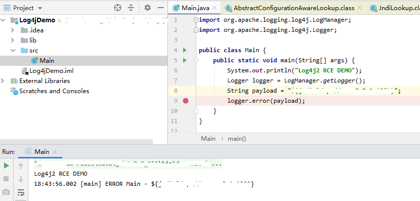
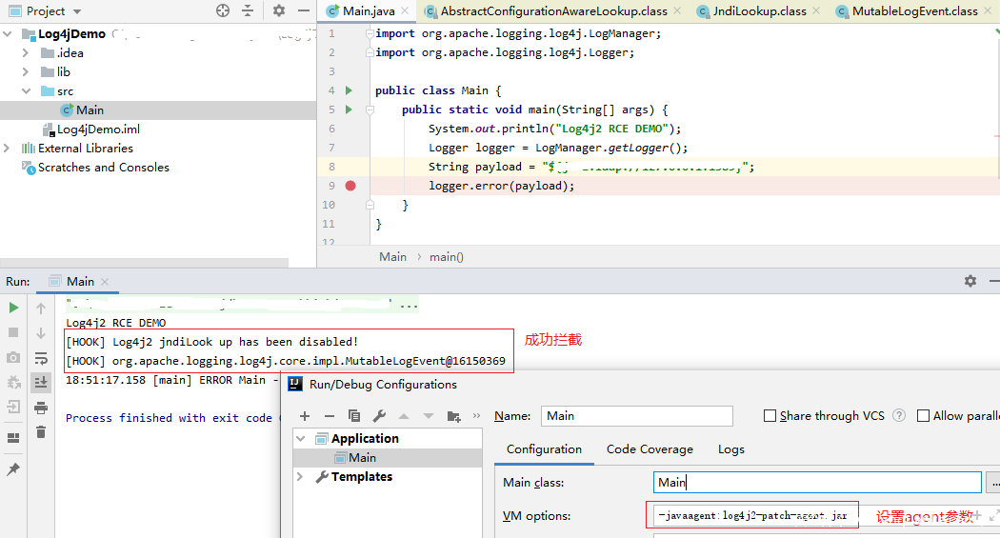

```sh
gc优化
   使用g1收集器
   主要参数:
    -XX:-UseBiasedLocking      去除偏向锁防止因为偏向锁导致Stopping threads took时间过长
    -XX:InitiatingHeapOccupancyPercent=65    当old区占用heap的65%时开始进行mixgc，主要根据blockcache+memstore+staticindex大小设定
    -XX:ParallelGCThreads=8    并行收集器的线程数，同时有多少个线程一起进行垃圾回收
    -XX:ConcGCThreads=2        并发GC使用的线程数
    -XX:G1NewSizePercent=5     eden区达到最小占用heap空间的大小
    -XX:G1MaxNewSizePercent=15 eden区达到最大占用heap空间的大小，默认值为60，防止每次young gc时回收内存过大
    -XX:MaxTenuringThreshold=1 （regionserver）young在Survivor区转换几次后到达old区，由于regionserver的old区的内存主要由blockcache+memstore+staticindex组成，需要将对象尽快添加到old区减少在Survivor区停留时间
    -XX:MaxTenuringThreshold=15 hmaster，thriftserver old占用很小对象调大也可以很快清理掉没有引用的对象

  hmaster配置参数
-Xmx4g -Xms4g
-XX:+UseG1GC
-XX:+UnlockExperimentalVMOptions
-XX:-OmitStackTraceInFastThrow
-XX:+ParallelRefProcEnabled
-XX:-ResizePLAB
-XX:-UseBiasedLocking
-XX:+SafepointTimeout
-XX:SafepointTimeoutDelay=2000
-XX:G1NewSizePercent=5
-XX:G1MaxNewSizePercent=15
-XX:MaxTenuringThreshold=15
-XX:G1MixedGCCountTarget=16
-XX:MaxGCPauseMillis=200
-XX:ParallelGCThreads=4
-XX:ConcGCThreads=2
-XX:InitiatingHeapOccupancyPercent=45
-XX:G1MixedGCLiveThresholdPercent=65
-XX:G1HeapWastePercent=10
-XX:G1OldCSetRegionThresholdPercent=9
-XX:G1ReservePercent=10

  regionserver配置参数
-Xms16g -Xmx16g
-XX:+UseG1GC
-XX:+UnlockExperimentalVMOptions
-XX:-OmitStackTraceInFastThrow
-XX:+ParallelRefProcEnabled
-XX:-ResizePLAB
-XX:-UseBiasedLocking
-XX:+SafepointTimeout
-XX:SafepointTimeoutDelay=2000
-XX:G1NewSizePercent=5
-XX:G1MaxNewSizePercent=15
-XX:MaxTenuringThreshold=1
-XX:G1HeapRegionSize=8M
-XX:G1MixedGCCountTarget=16
-XX:MaxGCPauseMillis=200
-XX:ParallelGCThreads=8
-XX:ConcGCThreads=2
-XX:InitiatingHeapOccupancyPercent=65
-XX:G1MixedGCLiveThresholdPercent=65
-XX:G1HeapWastePercent=10
-XX:G1OldCSetRegionThresholdPercent=9
-XX:G1ReservePercent=10

  thriftserver配置参数
-Xmx2g -Xms2g
-XX:+UseG1GC
-XX:+UnlockExperimentalVMOptions
-XX:-OmitStackTraceInFastThrow
-XX:+ParallelRefProcEnabled
-XX:-ResizePLAB
-XX:-UseBiasedLocking
-XX:+SafepointTimeout
-XX:SafepointTimeoutDelay=2000
-XX:G1NewSizePercent=5
-XX:G1MaxNewSizePercent=15
-XX:MaxTenuringThreshold=15
-XX:G1MixedGCCountTarget=16
-XX:MaxGCPauseMillis=200
-XX:ParallelGCThreads=2
-XX:ConcGCThreads=1
-XX:InitiatingHeapOccupancyPercent=45
-XX:G1MixedGCLiveThresholdPercent=65
-XX:G1HeapWastePercent=10
-XX:G1OldCSetRegionThresholdPercent=9
-XX:G1ReservePercent=10

配置文件更改
    hbase.hregion.majorcompaction              major compact 周期默认是7天，一般调成0挑选hbase相对空闲时段然后自己写脚本做合并
    hbase.hstore.blockingStoreFiles            hfile文件数量这里设置成100，如果hfile数量超过这个值的时候写入会受到阻塞    hbase.regionserver.handler.count      regionserver上用于等待响应用户表级请求的线程数
    hbase.hregion.memstore.flush.size 128M     Memstore级别限制：一个region的一个列族memstore大小达到128M促使这个region flush
    hbase.hregion.memstore.block.multiplier 4  Region级别限制：当一个region的所有列族的memstore大小占用128×4的时候促使这个region flush
    hbase.regionserver.global.memstore.size 0.45 regionserver级别flush：当regionserver中所有region的memstore大小占用heap的45%时会根据占用memstore占用region的大小排序，进行flush
    hbase.regionserver.global.memstore.size.lower.limit 0.4    当触发regionserver级别flush时，memstore占用内存小于40%时停止regionserver级别flush
    hbase.hregion.max.filesize 15g             当一个hfile的大小大于15g时会触发split
    hfile.block.cache.size 0.3                 regionserver的读缓存占用heap的30%
```


[JAVA教学](https://www.bilibili.com/video/BV1np4y1C7Yf)


# 利用 Java Agent 动态修补 Log4j2 漏洞

## 1、前言

Apache Log4j2 JNDI 注入漏洞（CVE-2021-44228）持续发酵，目前网络上提供了多种修补方案，如更新至最新版本、通过配置禁用 lookup 特性、删除 org/apache/logging/log4j/core/lookup/JndiLookup.class 类等，这些方法都能有效修补该漏洞，受 NCCGROUP 的项目 [log4j-jndi-be-gone](https://github.com/nccgroup/log4j-jndi-be-gone) 启发，笔者将分享一个通过 java agent 修改 jvm 字节码的方式动态 patch Log4j2 漏洞的方案，此方案的特点是可以在不重启服务的情况下，也可完成修复。希望此方案能够给那些因为业务原因无法重启应用的朋友们提供点思路。

 

## 2、Java Agent 简介

Java Agent 时 java 提供的一种机制，可以理解为一种 hook 机制，可以在 jvm 运行时动态修改 java 字节码，从而改变运行流程，从而实现一些特殊的功能，如性能监控，热更新等。关于如何开发一个 java agent， 网上有很多资料可以可以参考，如：https://www.jianshu.com/p/3bbfa22ec7f5 ,这里就不进行阐述。

 

## 3、动态修补 Log4j2 漏洞

根据公开资料，已经知道该漏洞最终出现在Log4j2中 org.apache.logging.log4j.core.lookup.JndiLookup 类的 lookup 函数，故只要对该函数进行拦截并禁用，就可以完成漏洞修补。

### 3.1 拦截 Log4j2 JNDI lookup 调用

核心拦截代码如下：

```java
public static void hook(Instrumentation instrumentation){
    AgentBuilder.Transformer transformer = new AgentBuilder.Transformer() {
        public DynamicType.Builder<?> transform(DynamicType.Builder<?> builder, TypeDescription typeDescription, ClassLoader classLoader, JavaModule javaModule) {
            return builder
                    .method(ElementMatchers.<MethodDescription>namedIgnoreCase("lookup")) // 拦截 lookup 函数
                    .intercept(MethodDelegation.to(Intercepter.class));
        }
    };

    new AgentBuilder
            .Default()
            .type(ElementMatchers.nameStartsWith("org.apache.logging.log4j.core.lookup.JndiLookup")) // 拦截 JndiLookup 类
            .transform(transformer)
            .installOn(instrumentation);

}
```

首先通过 bytebuddy 库的 type(ElementMatchers.nameStartsWith(“org.apache.logging.log4j.core.lookup.JndiLookup”)) 拦截 JndiLookup类调用，只要调用该类，就会被拦截。拦截到该类之后，通过定义一个 Transformer 对该类的 lookup 函数进行拦截：

```java
AgentBuilder.Transformer transformer = new AgentBuilder.Transformer() {
        public DynamicType.Builder<?> transform(DynamicType.Builder<?> builder, TypeDescription typeDescription, ClassLoader classLoader, JavaModule javaModule) {
            return builder
                    .method(ElementMatchers.<MethodDescription>namedIgnoreCase("lookup")) // 拦截 lookup 函数
                    .intercept(MethodDelegation.to(Intercepter.class));
        }
    };
```

通过这种方式，只要 org.apache.logging.log4j.core.lookup.JndiLookup 的 lookup 函数被调用，就会被 Intercepter 类拦截。

### 3.2 禁用 Log4j2 JNDI lookup 调用

定义一个拦截类 Intercepter 如下：

```java
package demo.agent;

import net.bytebuddy.implementation.bind.annotation.*;

import java.lang.reflect.Method;
import java.util.concurrent.Callable;

public class Intercepter  {
    @RuntimeType
    public static Object intercept(@Origin Method method, @SuperCall Callable<?> callable, @AllArguments Object [] objects) {
        // 直接禁用原函数执行， 等价于删除该函数，从而使漏洞无法生效
        // 同时打印相关日志
        System.out.println("[HOOK] Log4j2 jndiLook up has been disabled!");

        // TODO 此处可通过监控过来的数据，动态捕获攻击流量
        System.out.println("[HOOK] " + objects[0].toString());

        // 执行原函数（此处不执行）
        // return callable.call();
        return null;
    }
}
```

然后将其注册至 java agent 之中

```java
AgentBuilder.Transformer transformer = new AgentBuilder.Transformer() {
        public DynamicType.Builder<?> transform(DynamicType.Builder<?> builder, TypeDescription typeDescription, ClassLoader classLoader, JavaModule javaModule) {
            return builder
                    .method(ElementMatchers.<MethodDescription>namedIgnoreCase("lookup"))
                    .intercept(MethodDelegation.to(Intercepter.class)); // 注册拦截类 Intercepter
        }
    };
```

通过此种方式，只要 lookup 函数被调用，就会被拦截然后调用 Intercepter 类 intercept 方法，在该方法中，我们只写入自己的代码即可，如果不执行 callable.call() , 原来的方法就不会被调用，所以完成了 lookup 方法的禁用。另外，通过这种方式，可以将拦截的参数捕获出来，通过完善此部分代码，可以动态捕获攻击流量（有兴趣可以深入研究）

### 3.3 加载 Java Agent 完成修复

加载 Java Agent 有两种方式，第一种是 jvm 启动时加载，第二种是 jvm 运行时动态加载，其中第二种方法可以实现服务不重启情况下动态修复漏洞。

首先是 jvm 启动时加载，只需要给java添加启动参数 `-javaagent:agent.jar` 即可：

```shell
java -javaagent:log4j2-patch-agent.jar application.jar
```

第二种是 jvm 运行时动态加载，java 1.6 之后提供了一种 Attach 机制，能够通过 java 代码 attach 到 jvm 进程，然后再向其注入 agent，核心代码如下。

```java
String jvmPid = "8888";
String agentJar = "path/to/agent";
VirtualMachine jvm = VirtualMachine.attach(jvmPid);
jvm.loadAgent(agentJar);
```

不过这个机制的相关代码在 tools.jar 中。JVM 启动时默认不加载这个 jar 包，需要在 classpath 中额外指定。

另外一种加载方式是使用bytebuddy库进行加载，该库对tools.jar 进行了封装，可以直接调用进行加载:

```java
ByteBuddyAgent.attach(jarFile, pid);
```

成功加载后，运行截图如下，可以看到 agent 成功加载，并且 lookup 函数未被调用，完成修复：

未加载 agent 时：



加载 agent 后，拦截漏洞成功：



 

## 4、参考

1. https://research.nccgroup.com/2021/12/12/log4j-jndi-be-gone-a-simple-mitigation-for-cve-2021-44228/
2. https://www.jianshu.com/p/fe1448bf7d31
3. https://segmentfault.com/a/1190000016601560
4. https://stackoverflow.com/questions/55029961/bytebuddy-attach-to-a-local-running-process


知识来源: [https://www.anquanke.com/post/id/263311](http://www.hackdig.com/go.php?rid=567727)