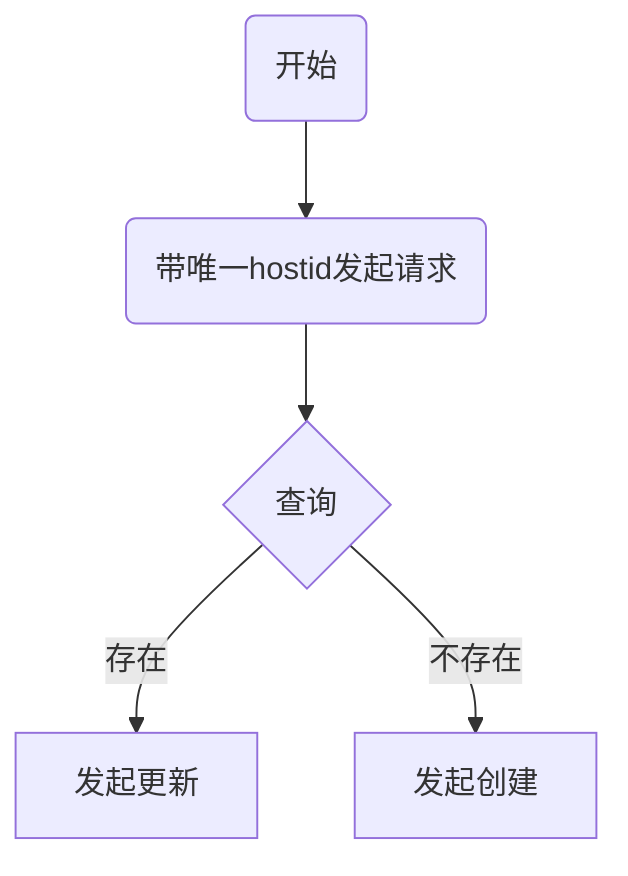

my_callback.py

```python
#!/usr/bin/env python
#-*-coding:utf-8 -*-

from __future__ import (absolute_import, division, print_function)
__metaclass__ = type
 
import os
import time
import json
from ansible.module_utils._text import to_bytes
from ansible.plugins.callback import CallbackBase

class CallbackModule(CallbackBase):
    """
    logs playbook results, per host, in /var/log/ansible/hosts
    """
    CALLBACK_VERSION = 2.0
    CALLBACK_TYPE = 'notification'
    CALLBACK_NAME = 'log_plays'           #此处为callback_name,需要在配置文件中指定
    CALLBACK_NEEDS_WHITELIST = True          #为True时，以上必做
 
  #定义的格式，自定义即可
    TIME_FORMAT="%b %d %Y %H:%M:%S"
    MSG_FORMAT="%(now)s - %(category)s - %(data)s\n\n"
    MSG_FORMAT1="%(data)s\n\n"
 
    def __init__(self):
 
        super(CallbackModule, self).__init__()
 
        if not os.path.exists("/var/log/ansible/hosts"):
            os.makedirs("/var/log/ansible/hosts")
 
  #定义log函数的目的是将处理后的执行结果写到文件，我这里直接display在屏幕上，这里可以自定义一个写入到数据库的函数，
    def log(self, host, category, data):
        #默认的执行结果为一个字典，即data在这里为一个字典
        result_last = json.dumps(self.option_result(data))  #定义一个函数，接收执行的结果，由于结果不支持字典数据，所以只能dumps成str
        self._display.display(result_last)            #将执行结果在屏幕上显示出来（不支持print打印）
        
     #以下为相关格式化内容 
        path = os.path.join("/var/log/ansible/hosts", host)
        now = time.strftime(self.TIME_FORMAT, time.localtime())
 
        msg = to_bytes(self.MSG_FORMAT % dict(now=now, category=category, data=data))
        msg1 = to_bytes(self.MSG_FORMAT1 % dict(data=data))
        with open(path, "ab") as fd:
            fd.write(msg)
 
   #定义函数，解析执行结果，并返回给log函数（注：此函数里代码可直接写到log函数里，此处为了区分清楚，单写一个）
    def option_result(self,msg):
      result = {}
      result['stderr_lines'] = msg['stderr_lines']
      result['start_time'] = msg['start']
      result['end_time'] = msg['end']
      result['stderr'] = msg['stderr']
      return result

    def runner_on_failed(self, host, res, ignore_errors=False):
        self.log(host, 'FAILED', res)
    
    def runner_on_ok(self, host, res):
        self.log(host, 'OK', res)
 
    def runner_on_skipped(self, host, item=None):
        self.log(host, 'SKIPPED', '...')
  
    def runner_on_unreachable(self, host, res):
        self.log(host, 'UNREACHABLE', res)
 
    def runner_on_async_failed(self, host, res, jid):
        self.log(host, 'ASYNC_FAILED', res)
 
    def playbook_on_import_for_host(self, host, imported_file):
        self.log(host, 'IMPORTED', imported_file)
 
    def playbook_on_not_import_for_host(self, host, missing_file):
        self.log(host, 'NOTIMPORTED', missing_file)

```


```shell
cp my_callback.py /home/data/opt/anaconda3/lib/python3.7/site-packages/ansible/plugins/callback/
```


ansible.cfg

```ini
[defaults]
ansible_python=auto
host_key_checking=False
gathering=smart
fact_caching=jsonfile
fact_caching_connection=.ansible_facts_cache
fact_caching_timeout=3600
#callback_whitelist=profile_tasks
callback_whitelist=my_callback
sdtout_callback=my_callback
roles_path    = ./roles
#remote_port=22

[inventory]
unparsed_is_failed=True

[ssh_connection]
pipelining = True
```


|                                                              |      |      |
| ------------------------------------------------------------ | ---- | ---- |
| [rundeck + ansible 插件](https://liumiaocn.blog.csdn.net/article/details/89206990) |      |      |
|                                                              |      |      |
|                                                              |      |      |


在ansible中foo_port是合法的变量名


```yml
include:
 c: playbook
 a: 
 - 
tags:
 c: 实现部分运行play-book的机制
 a: 
 - 打相同tags实现依赖? 
 - 重跑role
defaults:
 c: role中最低优先级,预设值
 a: 默认值
meta:
 c: '依赖,被多个role添加不会重复执行,allow_duplicates: yes可打开重复'
 a: 依赖
内置变量:
 c: hostvars,group_names,groups,environmen
 a: 负载均衡遍历host
分文件host和groups变量:
 c: playbook dir 覆盖inventory dir
 a:
 - playbook dir
 - inventory dir 
vault加密:
 c: password,keys,defaults,handlers加密,默认加密方式是AES
 a: 
 - 安全审计
{{ ansible_managed }}:
 c: |- 
 '默认设置可以哪个用户修改和修改时间: ansible_managed = Ansible managed: {file} modified on %Y-%m-%d %H:%M:%S by {uid} on {host}'
 a: 
 - 记录变更
 - 审计用户
handlers:
 c: 在发生改变时执行的操作, 多个改动只触发一次, 如果没有notify,handlers不会被执行, 不管有多少个通知进行了notify, 等到play 中的所有task执行完成,handlers也只会被执行一次
 a: 
 - 触发重启服务
```


```yml
production                # inventory file for production servers 关于生产环境服务器的清单文件
stage                     # inventory file for stage environment 关于 stage 环境的清单文件

group_vars/
   group1                 # here we assign variables to particular groups 这里我们给特定的组赋值
   group2                 # ""
host_vars/
   hostname1              # if systems need specific variables, put them here 如果系统需要特定的变量,把它们放置在这里.
   hostname2              # ""

library/                  # if any custom modules, put them here (optional) 如果有自定义的模块,放在这里(可选)
filter_plugins/           # if any custom filter plugins, put them here (optional) 如果有自定义的过滤插件,放在这里(可选)

site.yml                  # master playbook 主 playbook
webservers.yml            # playbook for webserver tier Web 服务器的 playbook
dbservers.yml             # playbook for dbserver tier 数据库服务器的 playbook

roles/
    common/               # this hierarchy represents a "role" 这里的结构代表了一个 "role"
        tasks/            #
            main.yml      #  <-- tasks file can include smaller files if warranted
        handlers/         #
            main.yml      #  <-- handlers file
        templates/        #  <-- files for use with the template resource
            ntp.conf.j2   #  <------- templates end in .j2
        files/            #
            bar.txt       #  <-- files for use with the copy resource
            foo.sh        #  <-- script files for use with the script resource
        vars/             #
            main.yml      #  <-- variables associated with this role
        defaults/         #
            main.yml      #  <-- default lower priority variables for this role
        meta/             #
            main.yml      #  <-- role dependencies

    webtier/              # same kind of structure as "common" was above, done for the webtier role
    monitoring/           # ""
    fooapp/               # ""
```

# ansible-vault

https://github.com/tomoh1r/ansible-vault/wiki/sample

https://github.com/jhaals/ansible-vault


# 常用builtin

https://docs.ansible.com/ansible/latest/collections/ansible/builtin/index.html

[goto](# 排序)


# 内置变量

## ansible-playbook内置变量

(https://www.jianshu.com/u/e714de66d8fd)

[绅士喵m](https://www.jianshu.com/u/e714de66d8fd)关注

2019.08.27 17:08:27字数 460阅读 2,516

我们可以使用ansible-playbook的内置变量实现主机相关的逻辑判断。本篇介绍7个常用的内置变量：

## 1.gourps和group_names

groups是一个全局变量，它会打印出Inventory文件里面的所有主机以及主机组信息，它返回的是一个JSON字符串，我们可以直接把它当作一个变量，使用{{ groups }}格式调用。当然也可以使用{{ groups['all'] }}引用其中一个的数据。变量会打印当前主机所在的groups名称，如果没有定义会返回ungrouped，它返回的组名是一个list列表。

## 2.hostvars

hostvars是用来调用指定的主机变量，需要传入主机信息，返回结果也是一个JSON字符串，同样，也可以直接引用JSON字符串内的指定信息。

## 3.inventory_hostname和inventory_hostname_short

inventory_hostname返回的是Inventory文件里面定义的主机名，inventory_hostname_short返回的是Inventory文件里面定义的主机名的第一部分。

## 4.play_hosts和inventory_dir

play_hosts变量时用来返回当前playbook运行的主机信息，返回格式是主机list结构，inventory_dir变量时返回当前playbook使用的Inventory目录。

# KMS

https://growingio.feishu.cn/docs/doccnpgUZAhEVAePkmRvSXJcaWc#


# ansible连接客户端selinux问题

文章来自 本末丶 's Blog // 道路千万条。。。

* [Home](http://blog.leanote.com/benmo)

我们在新增服务器后通常会执行以下操作来手动关闭客户端的selinux

```sh
sed -i 's/=enforcing/=disabled/' /etc/selinux/config
setenforce 0
```

在我们不重启客户端的情况下，服务器的selinux处于'Permissive'状态，不影响我们我实际操作。

 

此时我们用ansible测试到客户机的连通性

```sh
# ansible node04 -m ping -u root -k
SSH password: 
node04 | SUCCESS => {
    "changed": false,
    "ping": "pong"
}
```

看似一切正常，但我们使用部分模块操作时，却发现selinux检查并不通过：

```sh
ansible node04 -m copy -a 'src=app-info.log dest=/tmp/' -k
SSH password: 
node04 | FAILED! => {
    "changed": false,
    "checksum": "a3bf6211a787d7a51122a2ff406ddd72b67c6701",
    "msg": "Aborting, target uses selinux but python bindings (libselinux-python) aren't installed!"
}
```

 

在不重启客户端的情况下，我们需要按照提示安装'libselinux-python'才能操作客户端，但是，此时不能通过yum/shell模块去操作，因为yum/shell模块依赖python,会得到如上一样的报错反馈，所以此时，我们使用不依赖python的raw去安装。

```sh
# ansible node04 -m raw -a 'yum -y install libselinux-python' -k -o
node04 | CHANGED | rc=0 | (stdout) 已加载插件：fastestmirror\r\nLoading mirror speeds from cached hostfile\r\n * base: mirrors.aliyun.com\r\n * epel: mirrors.tongji.edu.cn\r\n * extras: mirrors.163.com\r\n * updates: mirrors.sohu.com\r\n正在解决依赖关系\r\n--> 正在检查事务\r\n---> 软件包 libselinux-python.x86_64.0.2.5-12.el7 将被 安装\r\n--> 解决依赖关系完成\r\n\r\n依赖关系解决\r\n\r\n================================================================================\r\n Package                   架构           版本               源            大小\r\n================================================================================\r\n正在安装:\r\n libselinux-python         x86_64         2.5-12.el7         base         235 k\r\n\r\n事务概要\r\n================================================================================\r\n安装  1 软件包\r\n\r\n总下载量：235 k\r\n安装大小：589 k\r\nDownloading packages:\r\n\rlibselinux-python-2.5-12.el7.x86_64.rpm                    | 235 kB   00:00     \r\nRunning transaction check\r\nRunning transaction test\r\nTransaction test succeeded\r\nRunning transaction\r\n\r  正在安装    : libselinux-python-2.5-12.el7 [                            ] 1/1\r  正在安装    : libselinux-python-2.5-12.el7 [##                          ] 1/1\r  正在安装    : libselinux-python-2.5-12.el7 [#####                       ] 1/1\r  正在安装    : libselinux-python-2.5-12.el7 [########                    ] 1/1\r  正在安装    : libselinux-python-2.5-12.el7 [###########                 ] 1/1\r  正在安装    : libselinux-python-2.5-12.el7 [#############               ] 1/1\r  正在安装    : libselinux-python-2.5-12.el7 [################            ] 1/1\r  正在安装    : libselinux-python-2.5-12.el7 [###################         ] 1/1\r  正在安装    : libselinux-python-2.5-12.el7 [######################      ] 1/1\r  正在安装    : libselinux-python-2.5-12.el7 [########################    ] 1/1\r  正在安装    : libselinux-python-2.5-12.el7 [########################### ] 1/1\r  正在安装    : libselinux-python-2.5-12.el7.x86_64                         1/1 \r\n\r  验证中      : libselinux-python-2.5-12.el7.x86_64                         1/1 \r\n\r\n已安装:\r\n  libselinux-python.x86_64 0:2.5-12.el7
```

之后，我们再次执行之前的copy操作，可以正常进行，且可以看到它多设置了一个secontext的上下文

```sh
# ansible node04 -m copy -a 'src=app-info.log dest=/tmp/' -k
SSH password: 
node04 | SUCCESS => {
    "changed": true,
    "checksum": "57bbe08bca53bc6cb8c3ad4855730a64f158068e",
    "dest": "/tmp/app-info.log",
    "gid": 0,
    "group": "root",
    "md5sum": "9e04f215d41cf64fbf4280643c8e6f50",
    "mode": "0644",
    "owner": "root",
    "secontext": "unconfined_u:object_r:user_home_t:s0",
    "size": 23070,
    "src": "/home/pengjk/.ansible/tmp/ansible-tmp-1529043022.9829628-60924778876197/source",
    "state": "file",
    "uid": 0
}
```

 

另外，还有一种情况是，我们的客户机无法上网，也没有内部yum源，在运行的服务器也不能随便重启，此时我们只能通过修改源码来解决。

1).首先我们进入到ansible源码目录，通过报错提示关键字'libselinux-python',找出源代码文件'module_utils/basic.py'

```sh
### 我是linux Minit，CentOS7在/usr/lib/python2.7/site-packages/ansible下
# cd /usr/local/lib/python3.5/dist-packages/ansible
# grep '(libselinux-python)' -R
Binary file module_utils/__pycache__/basic.cpython-35.pyc matches
module_utils/basic.py:                    self.fail_json(msg="Aborting, target uses selinux but python bindings (libselinux-python) aren't installed!")
```

 

2).vim打开'module_utils/basic.py'，搜索'libselinux-python'关键字，在1007行左右

```sh
1001     def selinux_enabled(self):
1002         if not HAVE_SELINUX:
1003             seenabled = self.get_bin_path('selinuxenabled')
1004             if seenabled is not None:
1005                 (rc, out, err) = self.run_command(seenabled)
1006                 if rc == 0:
1007                     self.fail_json(msg="Aborting, target uses selinux but python bindings (libselinux-python) aren't installed!")
1008             return False
1009         if selinux.is_selinux_enabled() == 1:
1010             return True
1011         else:
1012             return False
```

 

我们可以看到，之所以手动关闭不生效是因为，ansible使用'selinuxenabled'命令的返回值来判断selinux是否开启，为了满足我们的需求，我们需要修改如下。

```sh
### 即：当getenforce 0的结果为'Disabled','Permissive'的任意一个，都认为selinux已经关闭
### 注意: 更新或者重新安装后，修改的配置会被还原！
1001     def selinux_enabled(self):
1002         if not HAVE_SELINUX:
1003             #seenabled = self.get_bin_path('selinuxenabled')
1004             seenabled = self.get_bin_path('getenforce')
1005             if seenabled is not None:
1006                 (rc, out, err) = self.run_command(seenabled)
1007                 #if rc == 0:
1008                 if out not in ['Disabled','Permissive']:
1009                     self.fail_json(msg="Aborting, target uses selinux but python bindings (libselinux-python) aren't installed!")
1010             return False
1011         if selinux.is_selinux_enabled() == 1:
1012             return True
1013         else:
1014             return False
```

 

3).我们再次执行copy操作，可以正常进行，且发现没有'secontext'的上下文描述

```sh
# ansible node04 -m copy -a 'src=app-info.log dest=/tmp/' -k
SSH password: 
node04 | SUCCESS => {
    "changed": true,
    "checksum": "7d5a15ba26b69709981698de261e06592bb283d5",
    "dest": "/tmp/app-info.log",
    "gid": 0,
    "group": "root",
    "md5sum": "ba709129a47ddfc61cc8ff2373846e31",
    "mode": "0644",
    "owner": "root",
    "size": 103806,
    "src": "/home/pengjk/.ansible/tmp/ansible-tmp-1529045191.0324137-179005958155180/source",
    "state": "file",
    "uid": 0
}
```

# [并行和异步](http://www.ansible.com.cn/docs/playbooks_async.html)


[gosshtool](https://github.com/kggg/gosshtool)


11.11 第三方策略插件：[Mitogen for Ansible](https://mitogen.networkgenomics.com/ansible_detailed.html#installation)


```
$ wget 'https://networkgenomics.com/try/mitogen-0.2.9.tar.gz'
$ mkdir -p ~/.ansible/plugins
$ tar xf mitogen-0.2.9.tar.gz -C ~/.ansible/plugins/
```


# timer

```ini
[defaults]
callback_whitelist = profile_tasks
```

# 排序

|          |                   |          |
| -------- | ----------------- | -------- |
| 冒泡排序 | [写法](#冒泡算法) | 稳定排序 |
| 选择排序 | [code](#选择排序) |          |
| 插入排序 | [code](#插入排序) |          |


# ansible-playbook的branch的实现


```yml
- name: "if else"
  include_tasks: "test{{ item }}.yml"
  with_items: "{{ my_list }}"
```


拼出dict

```yaml
- set_fact:
    genders: "{{ genders|default({}) | combine( {item.item.name: item.stdout} ) }}"
  with_items: "{{ people.results }}"
```

接出列表

```yml
- name: Register changed title
  set_fact:
    grafana_changed_title_list: "{{ grafana_changed_title_list|default([]) + [ (lookup('file', item.dest)|from_json).title ] }}"
  when: item.changed
  with_items: "{{ push_changed.results }}"
```

读json文件

```yml
version_file: "{{ lookup('file','/home/shasha/devOps/tests/packageFile.json') | from_json }}"
```


## 冒泡算法

```go
func bubbleSort(listPao []int) []int {
	//冒泡排序
	num := 0
	for i:=len(listPao)-1;i>0;i-- {
		for j:=0;j<i;j++{
			if listPao[j] > listPao[j+1]{
				num = listPao[j]
				listPao[j] = listPao[j+1]
				listPao[j+1] = num
			}
		}
	}
	return listPao

}
```

## 选择排序


## 插入排序

演示


```java
public static void insertionSort(int[] arr){
    for (int i=1; i<arr.length; ++i){
        int value = arr[i];
        int position=i;
        while (position>0 && arr[position-1]>value){
            arr[position] = arr[position-1];
            position--;
        }
        arr[position] = value;
    }//loop i
}
```

# jinja2

https://www.junmajinlong.com/ansible/9_power_of_jinja2/

# ---

# [最佳实践](https://blog.lfyzjck.com/2020/06/07/ansible-quick-start.html)


建议用这样的命令来执行，这个就不是用root来登录了，而是先用haima用户登录，登录完后 执行 su -，自动输入对应的root的密码

```
ansible -i xxxx -m ping --become-method=su --become-user=root -K all
```


# lookup

```sh
ansible-doc -l -t lookup
```


```yml
- hosts: HY-ZABBIX-SERVER02
  gather_facts: no
  tasks:
    - debug:
        msg: "{{ lookup('file', '/etc/hosts')}}"
```


#  /etc/hosts

```yml
- name: Replace a localhost entry searching for a literal string to avoid escaping
  lineinfile:
    path: /etc/hosts
    regexp: '^{{ my_host }}'
    line: "{{ my_host }} HY-ZABBIX-SERVER"
    backup: yes
    owner: root
    group: root
    mode: '0644'
  remote_user: root
  vars:
    my_host: "10.30.0.228"
```


# 循环role


```yaml
- name: myrole
  with_items:
    - "aone"
    - "atwo"
  include_role:
    name: myrole
  vars:
    thing: "{{ item }}"
```


幂等性请求




# ansible shell 执行远程命令遇到awk 中$符号的问题

```
\$ 转义
```


# WARN: Collection community.general does not support Ansible version 2.10.17

```shell
ansible-galaxy collection install community.general:==4.8.7 --force
```


# shell  配合 changed_when: false


```yml


# In Ansible, a play with the status of 'CHANGED' is a successful response. If it wasn't successful, it would have reported back that the play 'FAILED'.

# In an Ansible playbook, you can suppress the 'CHANGED' status by adding changed_when: false to a play. If the play is successful, the status would then be 'OK'.

- name: "create {{ proxy_db }}"
  shell:
    cmd: 'ls'
    chdir: "{{ goose_home }}"
  changed_when: false


```

# hostvars inventory_hostname play_hosts


1 hostvars 可以在当前操作主机中输出其他主机中的facts信息

```lua
---


- name: "play 1: Gather facts of test71"


  hosts: test71


  remote_user: root


 


- name: "play 2: Get facts of test71 when operating on test70"


  hosts: test70


  remote_user: root


  tasks:


  - debug:


      msg: "{{hostvars['test71'].ansible_ens35.ipv4}}"
```

2 inventory_hostname 获取被操作的当前主机主机名（inventory文件中的名称）

```csharp
[test_group]


10.1.1.60


test70.zsythink.net ansible_host=10.1.1.70


test71 anisble_host=10.1.1.71
# ansible test_group -m debug -a "msg={{inventory_hostname}}"


test70.zsythink.net | SUCCESS => {


    "changed": false, 


    "msg": "test70.zsythink.net"


}


10.1.1.60 | SUCCESS => {


    "changed": false, 


    "msg": "10.1.1.60"


}


test71 | SUCCESS => {


    "changed": false, 


    "msg": "test71"


}
```

3 play_hosts 获取当前play所操作的所有主机的主机名列表

```handlebars
---


- hosts: test70,test71


  remote_user: root


  gather_facts: no


  tasks:


  - debug:


      msg: "{{play_hosts}}"
```

执行得到

```css
TASK [debug] *************************


ok: [test70] => {


    "msg": [


        "test71", 


        "test70"


    ]


}


ok: [test71] => {


    "msg": [


        "test71", 


        "test70"


    ]


}
```

4 groups 获取play操作的清单中分组列表

5 group_names 获取当前操作的主机的分组名


# 优化

- 
- 
- 
- 

# 如何优化 Ansible Playbook执行速度

(https://bbs.huaweicloud.com/community/usersnew/id_1575540903718176) [山河已无恙](https://bbs.huaweicloud.com/community/usersnew/id_1575540903718176) 发表于 2022/08/25 00:32:15

 

 396 0 0

【摘要】 写在前面今天和小伙伴们分享一些 Ansible 中 Playbook 执行速度优化的笔记博文通过7种不同的优化方式，合理利用可配置资源，从而提高 Playbook 的执行速度食用方式了解 Ansible 基础知识了解 Ansible 剧本编写理解不足小伙伴帮忙指正如果我不曾见到太阳，我本可以忍受黑暗。——————艾米莉·狄金森优化 Playbook 执行主要通过以下方式来优化优化基础架构禁用...

## 写在前面

------

- 今天和小伙伴们分享一些 Ansible 中 Playbook 执行速度优化的笔记
- 博文通过7种不同的优化方式，合理利用可配置资源，从而提高 Playbook 的执行速度
- 食用方式
  - 了解 Ansible 基础知识
  - 了解 Ansible 剧本编写
- 理解不足小伙伴帮忙指正

**如果我不曾见到太阳，我本可以忍受黑暗。——————艾米莉·狄金森**

------

## 优化 Playbook 执行

主要通过以下方式来优化

- `优化基础架构`
- `禁用facts收集`
- `增加任务并行`
- 程序包管理器模块`不使用循环`
- `高效拷贝文件`
- `使用模板代替lineinfile`
- `优化SSH连接`
- `启用pipelining`

下面我们一起来看一下如何优化

### 优化基础架构

运行`最新版本的 Ansible`可帮助提高使用 Ansible 核心模块的 Playbook 的性能。同时尽可能让`控制节点靠近受管节点`。Ansible严重依赖网络通信和数据传输。

### 禁用facts收集

通过将`gater_facts`指令设置为`Fasle`来跳过收集,这样做的前提是剧本不依赖采集主机信息生成的变量信息，如涉及到装包或者其他不使用收集的系统变量，魔法变量的剧本，那个跳过收集可以节省横多时间，尤其是受控机的量级达到一定程度。

实际看一下，如果剧本中没有显示设置不采集主机信息，并且没有在配置中显示配置策略，那么剧本默认收集主机信息

```javascript
---
- name: do not become
  hosts: all
  tasks:
    - name: sleep 2
      shell: sleep 2
```

上面的剧本默认收集主机信息，执行中我们可以找日志里看到`TASK [Gathering Facts]`

```javascript
$ time ansible-playbook  fact.yaml
PLAY [do not become] ***********************************************************************************************
TASK [Gathering Facts] *********************************************************************************************
ok: [servera]
ok: [serverb]
ok: [serverc]
.............
real    0m10.204s
user    0m1.874s
sys     0m1.610s
```

可以看到执行时间耗时`10.204s`,在剧本中配置`gather_facts:False`禁用观察一下

```javascript
---
- name: do not become
  hosts: all
  gather_facts: false
  tasks:
    - name: sleep 2
      shell: sleep 2
```

可以发现执行耗时`6.928s`执行速度缩短了4秒

```javascript
$ vim +3 fact.yaml
$ time ansible-playbook  fact.yaml

PLAY [do not become] ***********************************************************************************************
TASK [sleep 2] *****************************************************************************************************
changed: [serverd]
changed: [serverc]
changed: [serverb]
.......................
real    0m6.928s
user    0m1.329s
sys     0m0.581s
```

当然，主机收集作禁用作为变量，也了在配置文件中去赋值，这里赋值是全局的。

```javascript
$ cat /etc/ansible/ansible.cfg | grep -i  gather
# plays will gather facts by default, which contain information about
# smart - gather by default, but don't regather if already gathered
# implicit - gather by default, turn off with gather_facts: False
# explicit - do not gather by default, must say gather_facts: True
#gathering = implicit
......
```

通过 `gathering=explicit` 配置禁用全局的主机收集

```javascript
$ cat ansible.cfg
[defaults]
inventory=inventory
remote_user=devops
roles_path=roles
gathering=explicit

[privilege_escalation]
become=True
become_method=sudo
become_user=root
become_ask_pass=False
```

删除剧本的禁用配置，时间和刚才差不多

```javascript
$ sed '4d' fact.yaml -i
$ time ansible-playbook  fact.yaml
PLAY [do not become] ***********************************************************************************************
TASK [sleep 2] *****************************************************************************************************
changed: [servere]
changed: [serverd]
.......
real    0m7.323s
user    0m0.939s
sys     0m1.124s
$
```

### 增加并行

所谓增加并行，即一次要把命令分发给几个受管机执行，这个配置由参数`forks`控制, 说的准确的些，即Ansible可以有多少个连接同时处于活动状态。在默认情况下，它设置为 5。

```javascript
$ ansible-config  dump | grep -i fork
DEFAULT_FORKS(default) = 5
```

可以在`Ansible 配置文件`中指定，或者通过`-f 选项`传递给`ansible-playbook`命令：

#### 配置文件中设置

```javascript
$ cat ansible.cfg
[defautts]
inventory=inventory 
remote_user=devops 
forks=10
```

#### 命令行中的设置

```
ansible-playbook fact.yaml -f 10
$ time ansible-playbook  fact.yaml  -f 10
PLAY [do not become] ***********************************************************************************************
TASK [sleep 2] *****************************************************************************************************
changed: [serverf]
changed: [servere]
changed: [serverd]
changed: [serverb]
.....
real    0m4.163s
user    0m1.013s
sys     0m0.471s
$
```

可以发现，在禁用主机收集`gather_facts=False`的基础上，设置多并行处理`forks=10`，时间由原来的10秒到现在的4秒。

### 使用软件包管理器模块避免循环：

某些模块接受要处理的项的列表，不要使用循环。此时模块将调用一次而不是多次。比如使用yum模块来装包

```javascript
- name: Install the packages on the web servers
  hosts: all

  tasks:
    - name: Ensure the packages are installed
      yum:
        name:
          - httpd
          - mod_ssl
          - httpd-tools
          - mariadb-server
          - mariadb
          - php
          - php-mysqlnd
        state: absent
```

等效于

```javascript
 yum -y install httpd mod_ssl httpd-tools \
>mariadb-server mariadb php php-mysqlnd
```

使用循环的方式，可以发现使用的循环的方式是通过多个子bash的方式来执行，所以每次执行都要重新申请资源为一个bash进程来处理，而上面的方式始终只有个一个bash进程

```javascript
- name: Install the packages on the web servers
  hosts: all

  tasks:
    - name: Ensure the packages are installed
      yum:
        name: "{{ item }}"
        state: present
      loop:
          - httpd
          - mod_ssl
          - httpd-tools
          - mariadb-server
          - mariadb
          - php
          - php-mysqlnd
```

等效于

```javascript
$ yum install httpd
$ yum install mod_sst
$ yum install httpd-tools
$ yum install mariadb-server
$ yum install mariadb
$ yum install php
$ yum install php-mysqlnd
```

注意：并非所有模块都接受 name 参数的列表，

### 高效复制文件到受管主机：

在将大量文件复制到受管主机时，使用 `synchronize` 模块更为高效，应为``synchronize` 模块使用可rsync来同步文件，会通过哈希值比较文件，如果文件存在，则不复制，速度非常快，所以大多数情况下此模块后台使用 rsync 速度比copy 模块快，copy模块本质上是scp，所以他不会对文件是否存在进行校验。

申请一个1G的文件测试下

```javascript
$ dd if=/dev/zero of=bigfile1 bs=1M count=1024
1024+0 records in
1024+0 records out
1073741824 bytes (1.1 GB, 1.0 GiB) copied, 0.431348 s, 2.5 GB/s
```

文件不存在的情况，通过`synchronize`复制文件

```javascript
---
- name: Deploy the w eb content on the web servers
  hosts: all
  become: True
  gather_facts: False
  tasks:
    - name: copy demo
      synchronize:
        src: bigfile1
        dest: /tmp/
```

执行耗时为`26.146s`

```javascript
$ time ansible-playbook  copy_task.yaml
PLAY [Deploy the w eb content on the web servers] ******************************************************************
TASK [copy demo] ***************************************************************************************************
changed: [servere]
changed: [serverf]
changed: [serverb]
changed: [servera]
changed: [serverd]
changed: [serverc]
PLAY RECAP *********************************************************************************************************
servera                    : ok=1    changed=1    unreachable=0    failed=0    skipped=0    rescued=0    ignored=0
serverb                    : ok=1    changed=1    unreachable=0    failed=0    skipped=0    rescued=0    ignored=0
serverc                    : ok=1    changed=1    unreachable=0    failed=0    skipped=0    rescued=0    ignored=0
serverd                    : ok=1    changed=1    unreachable=0    failed=0    skipped=0    rescued=0    ignored=0
servere                    : ok=1    changed=1    unreachable=0    failed=0    skipped=0    rescued=0    ignored=0
serverf                    : ok=1    changed=1    unreachable=0    failed=0    skipped=0    rescued=0    ignored=0

real    0m26.146s
user    0m50.033s
sys     0m2.382s
```

现在我么使用 copy 模块来试下

```javascript
---
- name: Deploy the w eb content on the web servers
  hosts: all
  become: True
  gather_facts: False
  tasks:
    - name: copy demo
      #synchronize:
      copy:
        src: bigfile1
        dest: /tmp/
$ time ansible-playbook  copy_task.yaml
PLAY [Deploy the w eb content on the web servers] ******************************************************************
TASK [copy demo] ***************************************************************************************************
ok: [serverc]
ok: [serverd]
ok: [serverf]
ok: [servera]
ok: [serverb]
ok: [servere]

PLAY RECAP *********************************************************************************************************
servera                    : ok=1    changed=0    unreachable=0    failed=0    skipped=0    rescued=0    ignored=0
serverb                    : ok=1    changed=0    unreachable=0    failed=0    skipped=0    rescued=0    ignored=0
serverc                    : ok=1    changed=0    unreachable=0    failed=0    skipped=0    rescued=0    ignored=0
serverd                    : ok=1    changed=0    unreachable=0    failed=0    skipped=0    rescued=0    ignored=0
servere                    : ok=1    changed=0    unreachable=0    failed=0    skipped=0    rescued=0    ignored=0
serverf                    : ok=1    changed=0    unreachable=0    failed=0    skipped=0    rescued=0    ignored=0

real    0m14.868s
user    0m12.273s
sys     0m5.125s
```

copy 模块耗时`14.868s`,因为他不用对文件进行校验所以要少于`synchronize`模块，我们在次使用`synchronize`

```javascript
$ cat copy_task.yaml
---
- name: Deploy the w eb content on the web servers
  hosts: all
  become: True
  gather_facts: False
  tasks:
    - name: copy demo
      synchronize:
      #copy:
        src: bigfile1
        dest: /tmp/
$ time ansible-playbook  copy_task.yaml
PLAY [Deploy the w eb content on the web servers] ******************************************************************
TASK [copy demo] ***************************************************************************************************
ok: [servere]
ok: [serverb]
ok: [serverd]
ok: [servera]
ok: [serverf]
ok: [serverc]

PLAY RECAP *********************************************************************************************************
servera                    : ok=1    changed=0    unreachable=0    failed=0    skipped=0    rescued=0    ignored=0
serverb                    : ok=1    changed=0    unreachable=0    failed=0    skipped=0    rescued=0    ignored=0
serverc                    : ok=1    changed=0    unreachable=0    failed=0    skipped=0    rescued=0    ignored=0
serverd                    : ok=1    changed=0    unreachable=0    failed=0    skipped=0    rescued=0    ignored=0
servere                    : ok=1    changed=0    unreachable=0    failed=0    skipped=0    rescued=0    ignored=0
serverf                    : ok=1    changed=0    unreachable=0    failed=0    skipped=0    rescued=0    ignored=0

real    0m2.022s
user    0m1.757s
sys     0m0.568s
```

发现只使用了2秒，所以要分情况使用，如果是确定是新文件，那么使用copy模块，如果不确定，使用`synchronize`模块

### 使用模板：

`lineinfile`模块在文件中插入或删除行，与循环搭配时不是很高效：请改用`template`模块,这不多讲，`lineinfile`模块用于少量的配置文件修改，比如关闭交换分区，Selinux等。如果是Nginx等配置文件，使用模板文件会更高效

### 优化 SSH 连接：

Ansible 建立 SSH 连接可能是一个速度较慢的过程，为缓解这类问题，Ansible 依赖于 SSH 提供的两个功能：

- `ControlMaster`：`允许多个同时与远程主机连接的 SSH 会话使用单一网络连接`。第一个 SSH 会话建立连接，与同一主机连接的其他会话则重复利用该连接，从而绕过较慢的初始过程。SSH 在最后一个会话关闭后，立即销毁共享的连接。
- `ControlPersist`：`使连接在后台保持打开，而不是在上⼀次会话后销毁连接`。此指令允许稍后的 SSH 会话重用该连接。ControlPersist 指示 SSH 应使空闲连接保持打开的时间长度，每个新会话将重置此空闲计时器。

Ansible 通过 Ansible 配置⽂件的`[ssh_connection]`部分下的`ssh_args`指令启用`ControlMaster 和ControlPersist`功能,并且默认是开启状态的。

ssh_args 的默认值：

```javascript
$ ansible-config  dump | grep -i master
ANSIBLE_SSH_ARGS(default) = -C -o ControlMaster=auto -o ControlPersist=60s
```

显示设置

```javascript
[ssh_connection]
ssh_args=-o ControlMaster=auto -o ControlPersist=60s
```

如果`forks 值或 ControlPersist`设置比较大，控制节点可能会使用更多的并发连接。确保控制节点配置有足够的`文件句柄`，可用于支持许多活动的`网络连接`。

### 启用 Pipelining：

为了在远程节点上运行任务，Ansible 会执行多个 SSH 操作，`将模块及其所有数据复制到远程节点并执行该模块`。若要提高 playbook 的性能，可以激活`Pipelining`功能，Ansible 将建立较少的 SSH 连接。若要启用 Pipelining ，将 Ansible 配置文件中的`[ssh_connection]`部分：

```javascript
[ssh_connection]
pipelining =True
```

此功能默认不启用，因为需要禁用受管主机中的`requiretty sudo 选项`。requiretty表示即使`没有交互式shell /会话也可以使用sudo`。

禁用需要找受管机做如下配置

```javascript
[root@servera student]# cat /etc/sudoers | grep -C 4 visiblepw

#
# Refuse to run if unable to disable echo on the tty.
#
Defaults   !visiblepw
Defaults   !requiretty 
#
# Preserving HOME has security implications since many programs
# use it when searching for configuration files. Note that HOME
[root@servera student]#
```

## 实战

```javascript
[student@workstation task-speed]$ cat deploy_webservers.yml
---
- name: Deploy the web servers
  hosts: web_servers
  become: True

  tasks:
    - name: Ensure required packages are installed
      yum:
        name: "{{ item }}"
        state: present
      loop:
        - httpd
        - mod_ssl
        - httpd-tools
        - mariadb-server
        - mariadb
        - php
        - php-mysqlnd

    - name: Ensure the services are enabled
      service:
        name: "{{ item }}"
        state: started
        enabled: True
      loop:
        - httpd
        - mariadb

    - name: Ensure the web content is installed
      copy:
        src: web_content/
        dest: /var/www/html
[defaults]
inventory=inventory.yml
remote_user=devops
callback_whitelist=timer,profile_tasks
[student@workstation task-speed]$ ansible-playbook  deploy_webservers.yml

PLAY [Deploy the web servers] ****************************************************************************

TASK [Gathering Facts] ***********************************************************************************
Tuesday 16 August 2022  00:08:41 +0800 (0:00:00.033)       0:00:00.033 ********
ok: [serverb.lab.example.com]
ok: [serverc.lab.example.com]

TASK [Ensure required packages are installed] ************************************************************
Tuesday 16 August 2022  00:08:42 +0800 (0:00:01.165)       0:00:01.198 ********
changed: [serverc.lab.example.com] => (item=httpd)
changed: [serverb.lab.example.com] => (item=httpd)
changed: [serverc.lab.example.com] => (item=mod_ssl)
changed: [serverb.lab.example.com] => (item=mod_ssl)
ok: [serverc.lab.example.com] => (item=httpd-tools)
ok: [serverb.lab.example.com] => (item=httpd-tools)
changed: [serverc.lab.example.com] => (item=mariadb-server)
changed: [serverb.lab.example.com] => (item=mariadb-server)
ok: [serverc.lab.example.com] => (item=mariadb)
ok: [serverb.lab.example.com] => (item=mariadb)
changed: [serverc.lab.example.com] => (item=php)
changed: [serverb.lab.example.com] => (item=php)
changed: [serverc.lab.example.com] => (item=php-mysqlnd)
changed: [serverb.lab.example.com] => (item=php-mysqlnd)

TASK [Ensure the services are enabled] *******************************************************************
Tuesday 16 August 2022  00:09:00 +0800 (0:00:18.639)       0:00:19.838 ********
changed: [serverc.lab.example.com] => (item=httpd)
changed: [serverb.lab.example.com] => (item=httpd)
changed: [serverc.lab.example.com] => (item=mariadb)
changed: [serverb.lab.example.com] => (item=mariadb)

TASK [Ensure the web content is installed] ***************************************************************
Tuesday 16 August 2022  00:09:03 +0800 (0:00:02.720)       0:00:22.558 ********
changed: [serverc.lab.example.com]
changed: [serverb.lab.example.com]

PLAY RECAP ***********************************************************************************************
serverb.lab.example.com    : ok=4    changed=3    unreachable=0    failed=0    skipped=0    rescued=0    ignored=0
serverc.lab.example.com    : ok=4    changed=3    unreachable=0    failed=0    skipped=0    rescued=0    ignored=0

Tuesday 16 August 2022  00:09:38 +0800 (0:00:34.566)       0:00:57.124 ********
===============================================================================
Ensure the web content is installed -------------------------------------------------------------- 34.57s
Ensure required packages are installed ----------------------------------------------------------- 18.64s
Ensure the services are enabled ------------------------------------------------------------------- 2.72s
Gathering Facts ----------------------------------------------------------------------------------- 1.17s
Playbook run took 0 days, 0 hours, 0 minutes, 57 seconds
[student@workstation task-speed]$
[student@workstation task-speed]$ ansible-playbook deploy_webservers.yml

PLAY [Deploy the web servers] ****************************************************************************

TASK [Ensure required packages are installed] ************************************************************
Tuesday 16 August 2022  00:16:20 +0800 (0:00:00.035)       0:00:00.035 ********
changed: [serverb.lab.example.com]
changed: [serverc.lab.example.com]

TASK [Ensure the services are enabled] *******************************************************************
Tuesday 16 August 2022  00:16:30 +0800 (0:00:10.005)       0:00:10.041 ********
changed: [serverc.lab.example.com] => (item=httpd)
changed: [serverb.lab.example.com] => (item=httpd)
changed: [serverb.lab.example.com] => (item=mariadb)
changed: [serverc.lab.example.com] => (item=mariadb)

TASK [Ensure the web content is installed] ***************************************************************
Tuesday 16 August 2022  00:16:33 +0800 (0:00:03.142)       0:00:13.184 ********
changed: [serverc.lab.example.com]
changed: [serverb.lab.example.com]

PLAY RECAP ***********************************************************************************************
serverb.lab.example.com    : ok=3    changed=3    unreachable=0    failed=0    skipped=0    rescued=0    ignored=0
serverc.lab.example.com    : ok=3    changed=3    unreachable=0    failed=0    skipped=0    rescued=0    ignored=0

Tuesday 16 August 2022  00:16:54 +0800 (0:00:20.718)       0:00:33.902 ********
===============================================================================
Ensure the web content is installed -------------------------------------------------------------- 20.72s
Ensure required packages are installed ----------------------------------------------------------- 10.01s
Ensure the services are enabled ------------------------------------------------------------------- 3.14s
Playbook run took 0 days, 0 hours, 0 minutes, 33 seconds
[student@workstation task-speed]$
```

## 博文参考

------

```
《Red Hat Ansible Engine 2.8 DO447》
```

------

嗯，关于Ansible 中Playbook 执行速度优化就和小伙伴们分享到这里，生活加油 `^_^`


**三、ControlPersist**

ControlPersist 特性需要高版本的 SSH 才支持，CentOS 6 默认是不支持的，如果需要使用，需要自行升级 openssh。ControlPersist 即持久化 socket，一次验证，多次通信。并且只需要修改 ssh 客户端就行，也就是 Ansible 机器即可。

升级 openssh 的过程这里不做介绍。这里只介绍下 ControlPersist 设置的办法。

> cat ~/.ssh/config 
> Host * 
> Compression yes 
> ServerAliveInterval 60 
> ServerAliveCountMax 5 
> ControlMaster auto 
> ControlPath <a href="mailto:~/.ssh/sockets/%25r@%25h-%25p"><code>~/.ssh/sockets/%r@%h-%p</code></a>
> ControlPersist 4h


在开启了 ControlPersist 特性后，SSH 在建立了 sockets 之后，节省了每次验证和创建的时间。在网络状况不是特别理想，尤其是跨互联网的情况下，所带来的性能提升是非常可观的。有这边需求的，试试就知道了。