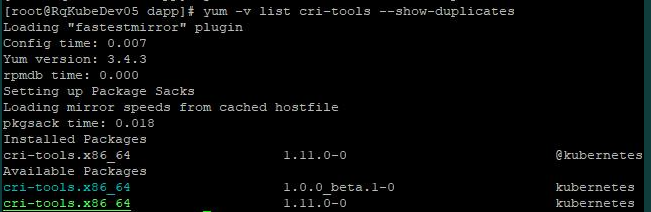

# yum 查询包版本与rpm包下载

# 查询版本号

某些场景下我们需要安装某些软件的特定版本，这个时候就需要在yum仓库中查询包版本号。例如查询 cri-tools 这个软件的版本如下：

```
yum -v list cri-tools --show-duplicates
yum --showduplicates list cri-tools
```



列出的版本信息具体内容是：

```
package_name.architecture  version_number–build_number  repository
```

# 下载rpm

在知道rpm包版本好后，我们希望将其下载下来，以供内网环境安装。用如下方法下载:

```
yum install --downloadonly --downloaddir=/tmp/ [package-name]-[version].[architecture]

# 例如：
yum install --downloadonly --downloaddir=/tmp/ cri-tools-1.0.0_beta.1-0
```


# 8.4  yum 源


```sh
sudo sed -e "s|^mirrorlist=|#mirrorlist=|g" \
         -e "s|^baseurl=http://mirrors.cloud.aliyuncs.com/\$contentdir/\$releasever|baseurl=https://mirrors.tuna.tsinghua.edu.cn/centos-vault/centos/8/$minorver|g" \
         -i.bak \
         /etc/yum.repos.d/CentOS-*.repo

sudo yum makecache

```


> CentOS Linux 8 - AppStream                       70  B/s |  38  B     00:00    
>
> **Error: Failed to download metadata for repo 'appstream': Cannot prepare internal mirrorlist: No URLs in mirrorlist**
>
> ==解决方法==
>
> 1. **IF** mirror.centos.org => vault.cetnos.org
>
> ```sh
> sed -e 's/mirrorlist/#mirrorlist/g' -e 's|#baseurl=http://mirror.centos.org|baseurl=http://vault.centos.org|g' -i.bak /etc/yum.repos.d/CentOS-*.repo 
> sudo yum makecache
> ```
>
> 2. **IF** aliyuncs => tuna
>
> ```sh
> sudo sed -e "s|^mirrorlist=|#mirrorlist=|g" \
>          -e "s|^baseurl=http://mirrors.cloud.aliyuncs.com/\$contentdir/\$releasever|baseurl=https://mirrors.tuna.tsinghua.edu.cn/centos-vault/centos/8/$minorver|g" \
>          -i.bak \
>          /etc/yum.repos.d/CentOS-*.repo
> 
> sudo yum makecache
> ```
>
> 


# netstat / ss


```

```

#   unbound variable


when

```sh
set -ue
if [ -n "$pasdwcfsf" ]
then
  echo OK
fi
```

Very close to what you posted, actually. You can use something called [Bash parameter expansion](https://www.gnu.org/software/bash/manual/html_node/Shell-Parameter-Expansion.html) to accomplish this.

To get the assigned value, or `default` if it's missing:

```sh
FOO="${VARIABLE:-default}"  # If variable not set or null, use default.
# If VARIABLE was unset or null, it still is after this (no assignment done).
```

Or to assign `default` to `VARIABLE` at the same time:

```sh
FOO="${VARIABLE:=default}"  # If variable not set or null, set it to default.
```


^PS:  [Default shell variables value](https://bash.cyberciti.biz/guide/Default_shell_variables_value)


# 阿里云linux[磁盘扩容](https://help.aliyun.com/document_detail/113316.html)


```sh
growpart /dev/vdb 1
resize2fs /dev/vdb1
```


# openssh升级[8.9](https://www.cnblogs.com/nihaorz/p/16012216.html)

VNC 连接至主机，执行以下脚本（请提前使用 scp 上传该文件到主机）：

```sh
#!/bin/bash
set -e

echo '1. download openssh source code'
cd /usr/local/src
rm -rf openssh-8.9p1.tar.gz openssh-8.9p1
curl -O https://mirrors.aliyun.com/pub/OpenBSD/OpenSSH/portable/openssh-8.9p1.tar.gz

echo '2. install dependency'
dnf install wget gcc automake autoconf libtool make zlib-devel openssl-devel pam-devel libselinux-devel -y

echo '3. uninstall old version for openssh'
rpm -e --nodeps `rpm -qa | grep openssh`

echo '4. unpackage openssh source code and configure'
tar -zxvf openssh-8.9p1.tar.gz
cd openssh-8.9p1
./configure --prefix=/usr --sysconfdir=/etc/ssh --with-md5-passwords --with-pam --with-zlib --with-tcp-wrappers --with-ssl-dir=/usr/local/ssl --without-hardening

echo '5. make and install'
make && make install
chmod 600 /etc/ssh/ssh_host_rsa_key /etc/ssh/ssh_host_ecdsa_key /etc/ssh/ssh_host_ed25519_key
cp -a contrib/redhat/sshd.init /etc/init.d/sshd
chmod u+x /etc/init.d/sshd
chkconfig --add sshd
chkconfig sshd on

sed -i 's/#PermitRootLogin prohibit-password/#PermitRootLogin prohibit-password\nPermitRootLogin yes/g' /etc/ssh/sshd_config
systemctl restart sshd
echo '6. openssh update success, new version is: '
echo $(ssh -V)

```

##  回滚

重装

```
openssh-server
openssh-client
```

# openvpn

```
docker run --cap-add=NET_ADMIN --privileged=true --device=/dev/net/tun -d --name openvpn centos:8 /sbin/init
```


# 快捷键

> Ecs + f
>
> Ecs + b
>
> Ecs + BackSpace
>
> Ecs + .


# vimdiff


ceshi.vim

```
:qa!
```

-s  silent

```sh
vimdiff -s ceshi.vim -c TOhtml -c "w custom_name.html"
```


交互式

```sh
vimdiff -c TOhtml -c "w custom_name.html"
```

