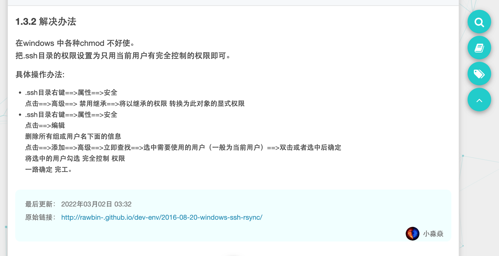

# rsync


```sh
# 建议使用rsync 同步目录和文件（支持跨主机）
rsync -rltDzvOP -e "ssh -p 22" /base_dir/local_path root@hostip:/tmp/
# local_path 为本地目录
# 注意, 会将 local_path 同步到目标host 的 /tmp/local_path, 只需填写/tmp ，不需要写全下一级
# -r, --recursive             recurse into directories
# -l, --links                 copy symlinks as symlinks
# -t, --times                 preserve modification times
# -D                          same as --devices --specials
# -z, --compress              compress file data during the transfer
# -v, --verbose               increase verbosity
# -O, --omit-dir-times        omit directories from --times
# -P                          same as --partial --progress 显示进度
```

算法和工作原理  https://www.cnblogs.com/f-ck-need-u/p/7226781.html


# yum 查询包版本与rpm包下载

# 查询版本号

某些场景下我们需要安装某些软件的特定版本，这个时候就需要在yum仓库中查询包版本号。例如查询 cri-tools 这个软件的版本如下：

```
yum -v list cri-tools --show-duplicates
yum --showduplicates list cri-tools
```


列出的版本信息具体内容是：

```
package_name.architecture  version_number–build_number  repository
```

# 下载rpm

在知道rpm包版本好后，我们希望将其下载下来，以供内网环境安装。用如下方法下载:

```
yum install --downloadonly --downloaddir=/tmp/ [package-name]-[version].[architecture]

# 例如：
yum install --downloadonly --downloaddir=/tmp/ cri-tools-1.0.0_beta.1-0
```


# 8.4  yum 源


```sh
sudo sed -e "s|^mirrorlist=|#mirrorlist=|g" \
         -e "s|^baseurl=http://mirrors.cloud.aliyuncs.com/\$contentdir/\$releasever|baseurl=https://mirrors.tuna.tsinghua.edu.cn/centos-vault/centos/8/$minorver|g" \
         -i.bak \
         /etc/yum.repos.d/CentOS-*.repo

sudo yum makecache

```


> CentOS Linux 8 - AppStream                       70  B/s |  38  B     00:00    
>
> **Error: Failed to download metadata for repo 'appstream': Cannot prepare internal mirrorlist: No URLs in mirrorlist**
>
> ==解决方法==
>
> 1. **IF** mirror.centos.org => vault.cetnos.org
>
> ```sh
> sed -e 's/mirrorlist/#mirrorlist/g' -e 's|#baseurl=http://mirror.centos.org|baseurl=http://vault.centos.org|g' -i.bak /etc/yum.repos.d/CentOS-*.repo 
> sudo yum makecache
> ```
>
> 2. **IF** aliyuncs => tuna
>
> ```sh
> sudo sed -e "s|^mirrorlist=|#mirrorlist=|g" \
>          -e "s|^baseurl=http://mirrors.cloud.aliyuncs.com/\$contentdir/\$releasever|baseurl=https://mirrors.tuna.tsinghua.edu.cn/centos-vault/centos/8/$minorver|g" \
>          -i.bak \
>          /etc/yum.repos.d/CentOS-*.repo
> 
> sudo yum makecache
> ```
>
> 


# netstat / ss


```

```

#   unbound variable


when

```sh
set -ue
if [ -n "$pasdwcfsf" ]
then
  echo OK
fi
```

Very close to what you posted, actually. You can use something called [Bash parameter expansion](https://www.gnu.org/software/bash/manual/html_node/Shell-Parameter-Expansion.html) to accomplish this.

To get the assigned value, or `default` if it's missing:

```sh
FOO="${VARIABLE:-default}"  # If variable not set or null, use default.
# If VARIABLE was unset or null, it still is after this (no assignment done).
```

Or to assign `default` to `VARIABLE` at the same time:

```sh
FOO="${VARIABLE:=default}"  # If variable not set or null, set it to default.
```


^PS:  [Default shell variables value](https://bash.cyberciti.biz/guide/Default_shell_variables_value)


# 阿里云linux[磁盘扩容](https://help.aliyun.com/document_detail/113316.html)


```sh
growpart /dev/vdb 1
resize2fs /dev/vdb1
```


# openssh升级[8.9](https://www.cnblogs.com/nihaorz/p/16012216.html)

VNC 连接至主机，执行以下脚本（请提前使用 scp 上传该文件到主机）：

```sh
#!/bin/bash
set -e

echo '1. download openssh source code'
cd /usr/local/src
rm -rf openssh-8.9p1.tar.gz openssh-8.9p1
curl -O https://mirrors.aliyun.com/pub/OpenBSD/OpenSSH/portable/openssh-8.9p1.tar.gz

echo '2. install dependency'
dnf install wget gcc automake autoconf libtool make zlib-devel openssl-devel pam-devel libselinux-devel -y

echo '3. uninstall old version for openssh'
rpm -e --nodeps `rpm -qa | grep openssh`

echo '4. unpackage openssh source code and configure'
tar -zxvf openssh-8.9p1.tar.gz
cd openssh-8.9p1
./configure --prefix=/usr --sysconfdir=/etc/ssh --with-md5-passwords --with-pam --with-zlib --with-tcp-wrappers --with-ssl-dir=/usr/local/ssl --without-hardening

echo '5. make and install'
make && make install
chmod 600 /etc/ssh/ssh_host_rsa_key /etc/ssh/ssh_host_ecdsa_key /etc/ssh/ssh_host_ed25519_key
cp -a contrib/redhat/sshd.init /etc/init.d/sshd
chmod u+x /etc/init.d/sshd
chkconfig --add sshd
chkconfig sshd on

sed -i 's/#PermitRootLogin prohibit-password/#PermitRootLogin prohibit-password\nPermitRootLogin yes/g' /etc/ssh/sshd_config
systemctl restart sshd
echo '6. openssh update success, new version is: '
echo $(ssh -V)

```

##  回滚

重装

```
openssh-server
openssh-client
```

# openvpn

```
docker run --cap-add=NET_ADMIN --privileged=true --device=/dev/net/tun -d --name openvpn centos:8 /sbin/init
```


# 快捷键

> Ecs + f
>
> Ecs + b
>
> Ecs + BackSpace
>
> Ecs + .


# vimdiff


ceshi.vim

```
:qa!
```

-s  silent

```sh
vimdiff -s ceshi.vim -c TOhtml -c "w custom_name.html"
```


交互式

```sh
vimdiff -c TOhtml -c "w custom_name.html"
```


# limits


stack是啥

```
* soft stack 65535
* hard stack 65535
```


# rsync




https://rawbin-.github.io/dev-env/2016-08-20-windows-ssh-rsync/


# linux删除日志: -bash: /var/log/messages 禁止操作

[centos7](https://www.bestyii.com/?tag=centos7) [运维](https://www.bestyii.com/?node=ops) · [best](https://www.bestyii.com/member/best/show) · 于 1年前 发布 · 817 次阅读

https://www.bestyii.com/member/best/show


```bash
systemctl stop rsyslog
```

大家想必都遇到系统盘满了，导致服务不正常的情况。 今天就遇到这种事。 系统日志占了40多G，当然这是一个意外导致有很多垃圾日志。 果断清理日志

```sh
> /var/log/messages
-bash: /var/log/messages: Operation not permitted
```

居然提示没有权限。

可能有a属性,用下面命令看看

```
lsattr /var/log/messages
```

确实存在那就去掉他，

```sh
sudo chattr -a  /var/log/messages
sudo chattr -i /var/log/messages
```

继续执行清理日志命令，顺利完成。

# 文件属性及相关命令

文件属性在文件系统的安全管理方面起很重要的作用，linux下lsattr命令用于查看文件属性信息。

## linux lsattr命令

**语法:** `lsattr [-adRvV] [文件或目录...]`

**选项介绍:**

* -a: 显示所有文件和目录，包括隐藏文件;
* -d: 显示目录名称，而非其内容;
* -R: 递归处理，将指定目录下的所有文件及子目录一并处理;
* -v: 显示文件或目录版本;
* -V: 显示版本信息;

**执行范例:**

```
$ chattr +ai text
$ lsattr
 ----ia------- text
```

**扩展阅读:**

chattr命令用于修改文件属性，chattr命令需要root权限。

## 文件属性

* a: append only; 系统只允许在这个文件之后追加数据，不允许任何进程覆盖或截断这个文件。如果目录具有这个属性，系统将只允许在这个目录下建立和修改文件，而不允许删除任何文件。
* c: compressed; 系统以透明的方式压缩这个文件。从这个文件读取时，返回的是解压之后的数据；而向这个文件中写入数据时，数据首先被压缩之后才写入磁盘。
* d: no dump; 在进行文件系统备份时，dump程序将忽略这个文件。
* i: immutable; 系统不允许对这个文件进行任何的修改。如果目录具有这个属性，那么任何的进程只能修改目录之下的文件，不允许建立和删除文件。
* j: data journalling; 如果一个文件设置了该属性，那么它所有的数据在写入文件本身之前，写入到ext3文件系统日志中，如果该文件系统挂载的时候使用了”data=ordered” 或”data=writeback”选项。当文件系统采用”data=journal”选项挂载时，所有文件数据已经记录日志，因此这个属性不起作用。仅仅超级用户或者拥有CAP_SYS_RESOURCE能力的进程可以设置和删除该属性。
* s: secure deletion; 让系统在删除这个文件时，使用0填充文件所在的区域。
* t: no tail-merging; 和其他文件合并时，该文件的末尾不会有部分块碎片(为支持尾部合并的文件系统使用)。
* u: undeletable; 当一个应用程序请求删除这个文件，系统会保留其数据块以便以后能够恢复删除这个文件。
* A: no atime updates; 告诉系统不要修改对这个文件的最后访问时间
* D: synchronous directory updates; 任何改变将同步到磁盘；这等价于mount命令中的dirsync选项：
* S: synchronous updates; 一旦应用程序对这个文件执行了写操作，使系统立刻把修改的结果写到磁盘。
* T: top of directory hierarchy; 如果一个目录设置了该属性，它将被视为目录结构的顶极目录


 在Linux中让echo命令显示带颜色的字。

2011-04-16 19:23:51

标签：[linux](http://blog.51cto.com/tag-linux.html) [echo](http://blog.51cto.com/tag-echo.html) [休闲](http://blog.51cto.com/tag-休闲.html) [onlyzq](http://blog.51cto.com/tag-onlyzq.html) [职场](http://blog.51cto.com/tag-职场.html)

原创作品，允许转载，转载时请务必以超链接形式标明文章 [原始出处](http://onlyzq.blog.51cto.com/1228/546459) 、作者信息和本声明。否则将追究法律责任。http://onlyzq.blog.51cto.com/1228/546459

echo显示带颜色，需要使用参数-e
格式如下:
echo -e "\033[字背景颜色;文字颜色m字符串\033[0m"
例如: 
echo -e "\033[41;37m TonyZhang \033[0m"
其中41的位置代表底色, 37的位置是代表字的颜色

 注：
1、字背景颜色和文字颜色之间是英文的“""”
2、文字颜色后面有个m
3、字符串前后可以没有空格，如果有的话，输出也是同样有空格

### 下面看几个例子：

echo -e "\033[30m 黑色字 \033[0m"
echo -e "\033[31m 红色字 \033[0m"
echo -e "\033[32m 绿色字 \033[0m"
echo -e "\033[33m 黄色字 \033[0m"
echo -e "\033[34m 蓝色字 \033[0m"
echo -e "\033[35m 紫色字 \033[0m"
echo -e "\033[36m 天蓝字 \033[0m"
echo -e "\033[37m 白色字 \033[0m"


echo -e "\033[40;37m 黑底白字 \033[0m"
echo -e "\033[41;37m 红底白字 \033[0m"
echo -e "\033[42;37m 绿底白字 \033[0m"
echo -e "\033[43;37m 黄底白字 \033[0m"
echo -e "\033[44;37m 蓝底白字 \033[0m"
echo -e "\033[45;37m 紫底白字 \033[0m"
echo -e "\033[46;37m 天蓝底白字 \033[0m"
echo -e "\033[47;30m 白底黑字 \033[0m"

**控制选项说明 ：**

\33[0m 关闭所有属性 
\33[1m 设置高亮度 
\33[4m 下划线 
\33[5m 闪烁 
\33[7m 反显 
\33[8m 消隐 
\33[30m -- \33[37m 设置前景色 
\33[40m -- \33[47m 设置背景色 
\33[nA 光标上移n行 
\33[nB 光标下移n行 
\33[nC 光标右移n行 
\33[nD 光标左移n行 
\33[y;xH设置光标位置 
\33[2J 清屏 
\33[K 清除从光标到行尾的内容 
\33[s 保存光标位置 
\33[u 恢复光标位置 
\33[?25l 隐藏光标 
\33[?25h 显示光标 

系统字体配色方案

export LS_COLORS='no=00:fi=00:di=44;37:ln=01;36:pi=40;33:so=01;35:bd=40;33;01:cd=40;33;01:or=01;05;37;41:mi=01;05;37;41:ex=01;32:*.cmd=01;32:*.exe=01;32:*.com=01;32:*.btm=01;32:*.bat=01;32:*.sh=01;32:*.csh=01;32:*.tar=01;31:*.tgz=01;31:*.arj=01;31:*.taz=01;31:*.lzh=01;31:*.zip=01;31:*.z=01;31:*.Z=01;31:*.gz=01;31:*.bz2=01;31:*.bz=01;31:*.tz=01;31:*.rpm=01;31:*.cpio=01;31:*.jpg=01;35:*.gif=01;35:*.bmp=01;35:*.xbm=01;35:*.xpm=01;35:*.png=01;35:*.tif=01;35:'


# linux 内存分配限制,overcommit_memory 2

gonaYet

于 2016-10-14 16:40:02 发布

8278
 收藏 2
分类专栏： 操作系统_linux 文章标签： linux 内存限制 overcommit_memory
版权

操作系统_linux
专栏收录该内容
145 篇文章0 订阅
订阅专栏
诡异场景:

当你发现程序在申请大段内存的时候，发生申请失败。

这时候你通过查看free -g发现free下的内存还有大量可以使用的内存。

然后你再继续查看ulimit -a的时候，却发现max memroy size为不受限。

这时候你或许会很疑惑，为什么在足够内存的情况下，当申请内存达到一定量的时候，却还是失败呢。

这时候你查看sysctl -a | grep "vm.overcommit_memory",如果你发现值为2,那么问题便是发生在这里了

在我们进行内存申请的时候，如malloc 200m,这时候仅仅是进行内存申请，但实际使用的时候可能仅仅是100m, 意味着有100m并没有真是被分配。

这时候我们通过free 看到使用的也只有100m的内存。但是vm.overcommit_memory其关注的是申请的内存，即200m的内存，这点需要注意。

而vm.overcommit_memory的意思:

0 — 默认设置。内核执行启发式内存过量使用处理，方法是估算可用内存量，并拒绝明显无效的请求。遗憾的是因为内存是使用启发式而非准确算法计算进行部署，这个设置有时可能会造成系统中的可用内存超载。
1 — 内核执行无内存过量使用处理。使用这个设置会增大内存超载的可能性，但也可以增强大量使用内存任务的性能。
2 — 内存拒绝等于或者大于总可用 swap 大小以及  overcommit_ratio 指定的物理 RAM 比例的内存请求。如果您希望减小内存过度使用的风险，这个设置就是最好的
值为2下的场景:

公式:CommitLimit = (Physical RAM * vm.overcommit_ratio / 100) + Swap
Physical RAM为当前系统的总物理内存

 vm.overcommit_ratio为物理内存的比例,默认为50
Swap为当前系统的总Swap

可以通过查看

grep -i commit /proc/meminfo
CommitLimit:    73955212 kB
Committed_AS:    kB

这里的CommitLimit为当前系统可以申请的总内存，Committed_AS为当前已经申请的内存，记住是申请。

因此当你的free查看有很多大量可用的内存的时候，实际Committed_AS可能已经申请了大量的内存了，在vm.overcommit_memory 2模式下，后续的程序可以申请的剩余内存

为CommitLimit - Commited_AS了。

而vm.overcommit_memory设置为2一般是建议当Swap大于物理内存的时候才进行设置。

而vm.overcommit_memory一般是设置为0模式的。

因此现在你知道该如何查理这种场景了吧。


参考文章:

https://access.redhat.com/documentation/zh-CN/Red_Hat_Enterprise_Linux/6/html/Performance_Tuning_Guide/s-memory-captun.html

http://linuxperf.com/?p=102
http://engineering.pivotal.io/post/Virtual_memory_settings_in_Linux_-_The_problem_with_Overcommit/
————————————————
版权声明：本文为CSDN博主「gonaYet」的原创文章，遵循CC 4.0 BY-SA版权协议，转载请附上原文出处链接及本声明。
原文链接：https://blog.csdn.net/qq_16097611/article/details/52816908


# [linux 的overcommit_memory、overcommit_ratio、swappiness 的说明 ](https://www.cnblogs.com/ctypyb2002/p/9792921.html)

## vm.overcommit_memory

```avrasm
vm.overcommit_memory = 0
vm.overcommit_memory = 1
vm.overcommit_memory = 2
```

0 默认设置。表示内核将检查是否有足够的可用内存供应用进程使用；如果有足够的可用内存，内存申请允许；否则，内存申请失败，并把错误返回给应用进程。
遗憾的是因为内存是使用启发式overcommitting handle(会尽量减少swap的使用)而非准确算法计算进行部署，这个设置有时可能会造成系统中的可用内存超载。

1 允许超过CommitLimit，即允许分配所有的物理内存，而不管当前的内存状态如何。
使用这个设置会增大内存超载的可能性，但也可以增强大量使用内存任务的性能。

2 拒绝超过CommitLimit的分配，即拒绝等于或者大于总可用 swap 大小以及 overcommit_ratio 指定的物理 RAM 比例的内存请求。如果您**希望减小内存过度使用的风险，这个设置就是最好的。**

公式:CommitLimit = (Physical RAM * vm.overcommit_ratio / 100) + Swap

## vm.overcommit_ratio

```ini
vm.overcommit_ratio = 90 
```

默认为50，为物理内存分配时的比例。
只有当vm.overcommit_memory = 2的时候才会生效

查看系统overcommit信息

```avrasm
# cat /proc/meminfo |grep -i commit
CommitLimit:    90971304 kB
Committed_AS:   64872556 kB
```

CommitLimit：最大能分配的内存(个人理解仅仅在vm.overcommit_memory=2时候生效)，具体的值是
SWAP内存大小 + 物理内存 * overcommit_ratio / 100

Committed_AS：当前已经分配的内存大小

临时设置

```bash
#sysctl vm.swappiness=10
```

## vm.swappiness

```ini
vm.swappiness = 1 
```

默认值为60,代表 当剩余物理内存低于40%（40=100-60）时，开始使用交换空间

vm.swappiness = 0
最大限度使用物理内存，然后才是 swap空间，即在内存不足的情况下–当剩余空闲内存低于vm.min_free_kbytes limit时，使用交换空间。
在内存紧张时优先减少RAM里文件系统缓存的大小，而非使用swap空间，**这是一种提高数据库性能的推荐做法。**

vm.swappiness = 1
内核版本3.5及以上、Red Hat内核版本2.6.32-303及以上，进行最少量的交换，而不禁用交换。

vm.swappiness = 10
当系统存在足够内存时，推荐设置为该值以提高性能。

vm.swappiness = 60
默认值

vm.swappiness = 100
积极的使用交换空间。

对于内核版本为3.5及以上，Red Hat内核版本2.6.32-303及以上，多数情况下，设置为1可能比较好，0则适用于理想的情况下（it is likely better to use 1 for cases where 0 used to be optimal）

临时设置

```shell
# echo 10 > /proc/sys/vm/swappiness
```


# 大磁盘分区

# rsync

# [rsync 替换 cp 命令显示速度和进度](https://my.oschina.net/u/4332520/blog/4280798)

[osc_wl6d9wri](https://my.oschina.net/u/4332520)

2020/05/16 13:57

阅读数 7.9K

```sh
# rsync -P test.tar.gz ./
test.tar.gz
    395,706,368  48%  377.34MB/s    0:00:01

Or
# rsync -avPh test.tar.gz ./
注意：rsync和scp都可以远程拷贝。

*****************************************************************************************
一般最常用的选项组合：-avzP 来进行传输,

rsync的同步参数选项：
-a ：归档模式，表示以递归模式传输文件，并保持文件所有属性相当于-rtopgdl
-v :详细模式输出，传输时的进度等信息
-z :传输时进行压缩以提高效率—compress-level=num可按级别压缩
-r :对子目录以递归模式，即目录下的所有目录都同样传输。
-t :保持文件的时间信息—time
-o ：保持文件属主信息owner
-p ：保持文件权限
-g ：保持文件的属组信息
-P :--progress 显示同步的过程及传输时的进度等信息
-e ：使用的信道协议，指定替代rsh的shell程序。例如：ssh
-D :保持设备文件信息
-l ：--links 保留软连接
--progress  :显示备份过程
--delete    :删除那些DST中SRC没有的文件
--exclude=PATTERN 　指定排除不需要传输的文件模式
-u, --update 仅仅进行更新，也就是跳过所有已经存在于DST，并且文件时间晚于要备份的文件。(不覆盖更新的文件)
-b, --backup 创建备份，也就是对于目的已经存在有同样的文件名时，将老的文件重新命名为~filename。
-suffix=SUFFIX 定义备份文件前缀
-stats 给出某些文件的传输状态
-R, --relative 使用相对路径信息  如：rsync foo/bar/foo.c remote:/tmp/   则在/tmp目录下创建foo.c文件，而如果使用-R参数：rsync -R foo/bar/foo.c remote:/tmp/     则会创建文件/tmp/foo/bar/foo.c，也就是会保持完全路径信息。
--config=FILE 指定其他的配置文件，不使用默认的rsyncd.conf文件
--port=PORT 指定其他的rsync服务端口
```

 

[rsync](https://www.oschina.net/p/rsync)

本文转载自：https://blog.csdn.net/u010164190/article/details/106145819


# 编译

```sh
yum -y install gcc automake autoconf libtool make
yum install gcc gcc-c++
yum install readline-devel -y
yum install zlib-devel -y
```


# linux用户密码过期导致命令执行失败

使用[zabbix](https://so.csdn.net/so/search?q=zabbix&spm=1001.2101.3001.7020)调用系统命令，检查时间同步，发现一直在报错，root 用户执行无异常，问题还是出现zabbix用户上面。

```sh
[zabbix@test-10-12 ~]$ sudo ntpdate time.test.com
sudo: pam_open_session: System error
sudo: policy plugin failed session initialization

sudo: pam_open_session：系统错误
sudo: 策略插件会话初始化失败
```

检查其他用户执行该命令正常，怀疑zabbix用户密码过期，修改zabbix过期时间

```sh
[root@test-10-12 ~]# chage -M 99999 zabbix
[root@test-10-12 ~]# su - zabbix
Last login: Tue May 28 10:17:16 JST 2019 on pts/0
[zabbix@jp33e505-10-12 ~]$ sudo ntpdate time.test.com
28 May 10:22:08 ntpdate[26830]: adjust time server 172.19.3.200 offset 0.000270 sec
```


# SWAP

命令

```sh
dd if=/dev/zero of=/data2/32Gswap bs=1024 count=33554432
/sbin/mkswap /data2/32Gswap
chmod 600 /data2/32Gswap 
/sbin/swapon /data2/32Gswap

dd if=/dev/zero of=/data1/8Gswap bs=1024 count=8388608
/sbin/mkswap /data1/8Gswap
chmod 600 /data1/8Gswap 
/sbin/swapon /data1/8Gswap

dd if=/dev/zero of=/data1/8Gswap bs=1024 count=8388608
/sbin/mkswap /data1/8Gswap
chmod 600 /data1/8Gswap
/sbin/swapon /data1/8Gswap
```


/etc/fstab

```
/data2/32Gswap swap swap defaults 0 0
```


# yum --allowerasing

从[官方文档](https://dnf.readthedocs.io/en/latest/command_ref.html)同样可以了解到，`--allowerasing`参数的设计目的就是为了自动化`yum swap`，做到真正的自动解冲突，即在遇到冲突时优先自动卸载产生冲突的软件包，并安装依赖所需的软件包。

dnf的基本操作和yum基本一致，甚至在Fedora 22和RHEL/CentOS 8之后，将yum作为其软链接，如下图所示。

[![[小技巧\] 巧用yum三板斧，巧解软件源重复导致的软件包冲突 – Untitled Spot_未命名小站](https://untitled.pw/wp-content/uploads/2020/10/wp_editor_md_05a1384131bb57bf10e0b61c6ff581e5.jpg)](https://untitled.pw/wp-content/uploads/2020/10/wp_editor_md_05a1384131bb57bf10e0b61c6ff581e5.jpg)

> 图7. CentOS 8已默认将yum作为dnf的软链接

如果你还在使用yum，不妨使用`alias`将包管理器升级为dnf，并享受`--allowerasing`的快感：

```bash
yum install dnf
# 将这一行写入你所使用Shell的启动文件里，如~/.zshrc或~/.bashrc或/etc/profile
alias yum="dnf"
```

接下来我们需要做的只是执行`dnf install --allowerasing install git`，然后见证奇迹：

![[小技巧] 巧用yum三板斧，巧解软件源重复导致的软件包冲突 – Untitled Spot_未命名小站](.img_centos/wp_editor_md_97c8864dc2a07eae42d2eed50869e182.jpg)

[![[小技巧\] 巧用yum三板斧，巧解软件源重复导致的软件包冲突 – Untitled Spot_未命名小站](https://untitled.pw/wp-content/uploads/2020/10/wp_editor_md_97c8864dc2a07eae42d2eed50869e182.jpg)](https://untitled.pw/wp-content/uploads/2020/10/wp_editor_md_97c8864dc2a07eae42d2eed50869e182.jpg)

这里我们可以看到，yum（或者称之为dnf更合适）自动解决了冲突，并自动纠正了OpenSSH的版本，无需我们做任何操


# NFS报错

## [关于nfs服务启动messages日志中报错-Unable to watch /proc/fs/nfsd/clients: No such file or directory](https://www.cnblogs.com/5201351/p/17126423.html)

Posted on 2023-02-16 14:14 [520_1351](https://www.cnblogs.com/5201351/) 阅读(16) 评论(0) [编辑](https://i.cnblogs.com/EditPosts.aspx?postid=17126423) [收藏](javascript:void(0)) [举报](javascript:void(0))

操作系统环境：Red Hat Enterprise Linux release 8.x

nfs-utils版本：nfs-utils-2.3.3-57.el8.x86_64

最近笔者在服务器中安装了nfs-utils，然后也配置了/etc/exports文件

也通过systemctl restart nfs-server.service 启动nfs-server，命令行没有返回报错

但是在本机showmount -e 时就发现有报错: **rpc mount export: RPC: Unable to receive; errno = Connection refused**

```
[root@QQ-5201351 ~]# showmount  -e
rpc mount export: RPC: Unable to receive; errno = Connection refused
```

然后又去看了一下nfs相关的端口监听，TCP/2049 , TCP/111-(rpcbind) , TCP/20048 -(rpc.mountd)等端口也是监听了的

又查看了一下 /var/log/messages日志中又有一段明显的报错日志：**Unable to watch /proc/fs/nfsd/clients: No such file or directory**

```
Feb 15 17:13:25 QQ-5201351 systemd[1]: Started NFS Mount Daemon.
Feb 15 17:13:25 QQ-5201351 rpc.mountd[4321]: Unable to watch /proc/fs/nfsd/clients: No such file or directory
Feb 15 17:13:25 QQ-5201351 systemd[1]: nfs-mountd.service: Main process exited, 
```

这里可以看到 可能是与nfs-mountd.service 这个服务没有启动成功，于是去查询状态，果然有些异常 Active: failed (Result: exit-code)

通过如上报错信息，笔者想到会不会是与utils-utils的版本有关系，查询一了一下，是最新的版本

那么就有可能是版本太新了？于是笔者尝试如下的解决方法：

 

**解决方法一（不是很推荐）：降低nfs-utils的版本>>>>>>**

操作步骤如下：

```
# yum 查看nfs-utils历史版本
yum list nfs-utils --showduplicates

# 然后降级安装nfs-utils
yum downgrade nfs-utils-2.3.3-46.el8.x86_64
```

这样下来之后，nfs启动时，messages日志再没有报错了，showmount -e 也能正常列出本机的nfs资源，客户端也能正常挂载使用了

```
[root@QQ-5201351 ~]# showmount -e
Export list for QQ-5201351:
/nfstest *
[root@QQ-5201351 ~]#
```

笔者从最新版本向下降级测试的，直到nfs-utils-2.3.3-46 才正常，前面还有2个更新的版本、都是不行的

最后问题也算是临时解决了，但总觉得有点怪怪的，难道Red Hat Enterprise Linux release 8.x 就不能使用最新的nfs-utils么？

按理说Redhat既然已经将最新的nfs-utils放到yum的repo仓库了，肯定是有过测试，而且能正常使用的

 

**冷静分析中..............................**

**1、难道与Redhat 的次版本存在兼容问题，于是又将 OS 版本升级到 Red Hat Enterprise Linux release 8.7 (Ootpa) 报错依然存在**

**2、另外有没有可能与内核版本有关系呢？当时也查询了一下，rpc.mountd[4321]: Unable to watch /proc/fs/nfsd/clients: No such file or directory 报错**

**也有说与内核的版本可能有关系，于是查看内核版本，才发现竟然是旧的内核版本，但笔者确实升级OS时用的yum update 升级的，同时内核也就升级了**

**然后OS也进行了重启，新的内核版本没有应用上，于是笔者努力尝试让OS应用上最新的内核版本，最后才发现处理好内核版本后也就将最上面的nfs问题处理好了**

**于是就有了第二种解决方案，升级kernel到最新版本，让最新nfs-utils与最新的kernel兼容，详细如下**

 

**解决方法二（推荐）：升级kernel到最新的版本，从根原因解决>>>>>>**

这里只说本文问题的原因，解决过程，是因为笔者这里的OS环境的问题，原因很复杂，也是经历了很多的时间去处理，最后才让OS应用上最新的kernel版本

至于为什么升级kernel后，重启OS也没有应用上，笔者可能将在后续的文章中记录原因及处理方法

**总之如果能升级kernel到最新版本，且能应用上，那么也就能正常的安装启动当前最新的nfs-utils版本，messages日志也没有报错，客户端也能正常挂载使用~**

 

 

 

尊重别人的劳动成果 转载请务必注明出处：https://www.cnblogs.com/5201351/p/17126423.html
