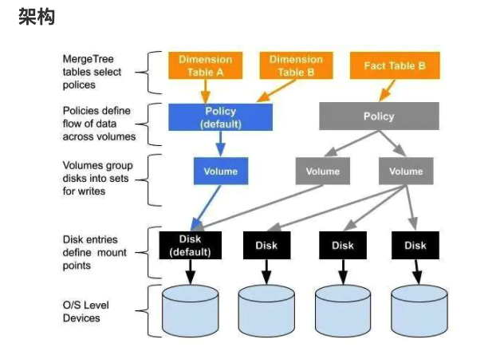

# 支撑700亿数据量的ClickHouse高可用架构实践

https://mp.weixin.qq.com/s?__biz=MzkwOTIxNDQ3OA==&mid=2247534096&idx=1&sn=4c33b99f37124ec29f9567755af66200&source=41#wechat_redirect


# 多磁盘存储



https://www.jianshu.com/p/72b0c9bd3967 

```sql
select name,path,formatReadableSize(free_space) AS free,formatReadableSize(total_space) AS total,formatReadableSize(keep_free_space) AS reserved from system.disks;
```


```sql
SELECT policy_name, volume_name, disks FROM system.storage_policies
```

https://clickhouse.tech/docs/en/engines/table-engines/mergetree-family/mergetree/#table_engine-mergetree-multiple-volumes_configure


```yml
多层存储:
  c: 多数据盘,区分存储类型
  a:
    - 根据类型将热数据和冷数据分开
    - 多盘提升IOPS
冷热\数据移动\move factor:
  c: 设置阈值移动热数据到冷存储，配置文件里的卷顺序很重要，数据会优先写入第一个卷
  a:
    - 在线转离线
冷热\数据移动\TTL:
  c: TTL表达式，遵循时间规则在指定磁盘或卷之间移动数据，实现分层存储
  a:  
    - 不同存储间
    - 在线转离线数据
    - 降低存储成本
Hive到Clickhosue的数据

- 同步
- 迁移


缓存保护Clickhouse查询

- 主动缓存
- 被动缓存


是否使用分布式:

- zookeeper瓶颈大量日志问题

- 集群同步压力
- 分布式查询压力


Clickhosue缩容扩容问题

- 数据自动平衡问题

  - https://tech.youzan.com/clickhouse-zai-you-zan-de-shi-jian-zhi-lu/

  - ```
    七、ClickHouse 在有赞的未来和展望
    7.1 ClickHouse 的痛点
    扩容/缩容后数据无法自动平衡，只能通过低效的数据重新导入的方式来进行人工平衡。
    尽管我们开发了一套工具基于 clickhouse-copier 来帮助运维进行这个操作，从而加速整个过程，降低人工操作的错误率。但是被迁移的表在迁移过程中仍然需要停止写入的。
    ```

  - gio解决方案: 工具在本地导入临时表转成正式表

- UAT环境=> 单节点？
- 生产环境=> 分布式?


多磁盘存储


历史分区的清理
  

```


# 6亿数据秒级查询，ClickHouse太快了！

https://blog.csdn.net/g6U8W7p06dCO99fQ3/article/details/115274415


# 监控

通过clickhouse sql监控

-  https://grafana.com/grafana/dashboards/2515

prometheus  exporter 监控

- https://grafana.com/grafana/dashboards/882

- https://grafana.com/grafana/dashboards/14192


# HDFS engine

https://blog.csdn.net/u012551524/article/details/109188434

参考: https://github.com/ClickHouse/ClickHouse/issues/8159

```sh
clickhouse hdfs engine('URI')  
中的URI不识别大小写
我们的growingFS被转成 growingfs, 经测试将hdfs-client.xml中的growingFS批量替换成小写growingfs 有效可用
```


```

```

# **参考文档**

1、[ClickHouse官方文档](https://clickhouse.tech/docs/zh/)

2、Altinity网站参考文档

* [https://altinity.com/blog/201...](https://altinity.com/blog/2019/11/27/amplifying-clickhouse-capacity-with-multi-volume-storage-part-1)
* [https://altinity.com/blog/202...](https://altinity.com/blog/2020/3/23/putting-things-where-they-belong-using-new-ttl-moves)
* [https://altinity.com/presenta...](https://altinity.com/presentations/clickhouse-tiered-storage-intro)

3、[《腾讯云ClickHouse支持数据均衡服务》](https://cloud.tencent.com/developer/article/1688478?from=10680)

4、[《交互式分析领域，为何ClickHouse能够杀出重围？》](https://mp.weixin.qq.com/s?__biz=MzI2NDU4OTExOQ==&mid=2247508197&idx=1&sn=b8924b10f61c22537568a42f326bfa04&scene=21#wechat_redirect)

5、[对象存储COS文档中心](https://cloud.tencent.com/document/product/436?from=10680)


