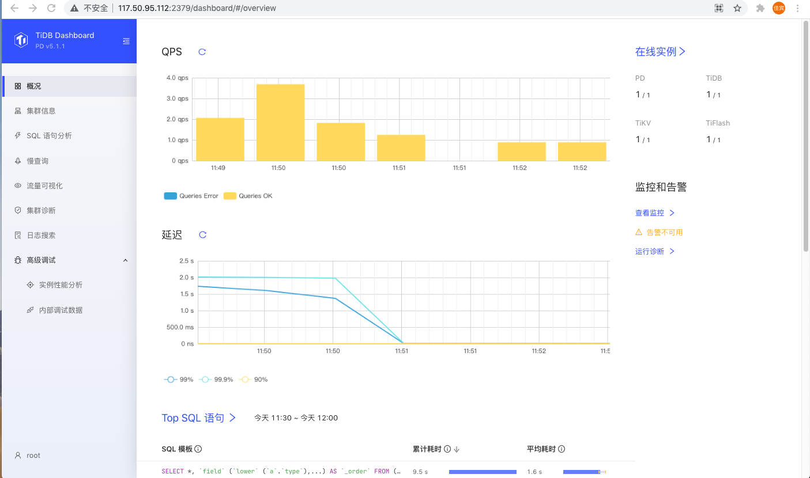
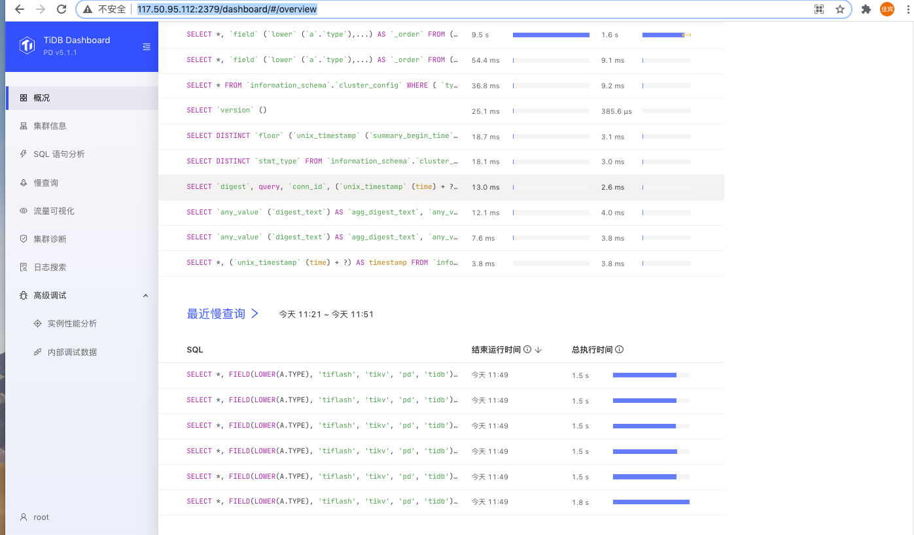
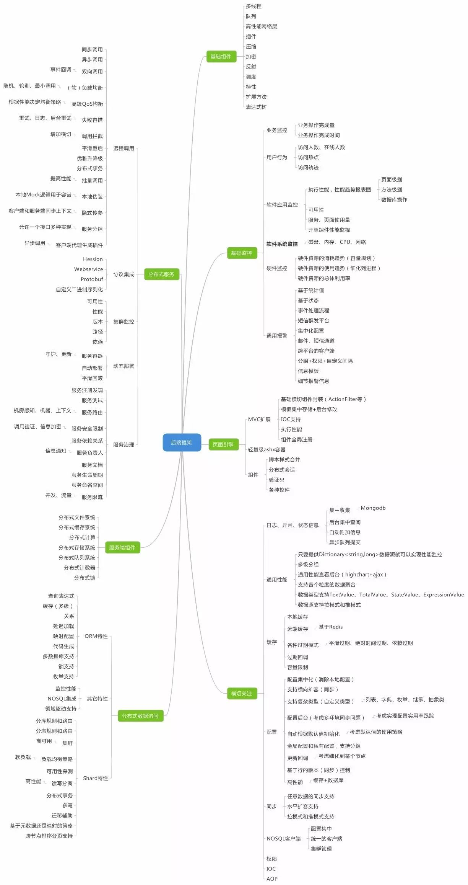
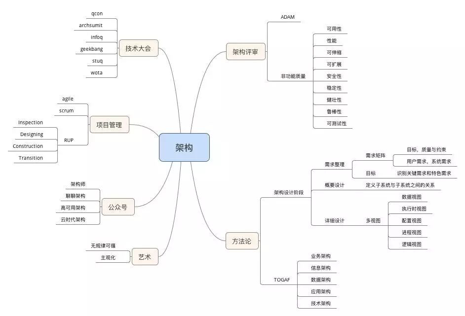
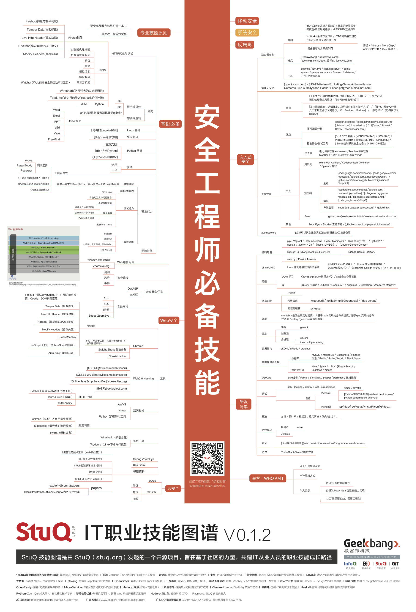
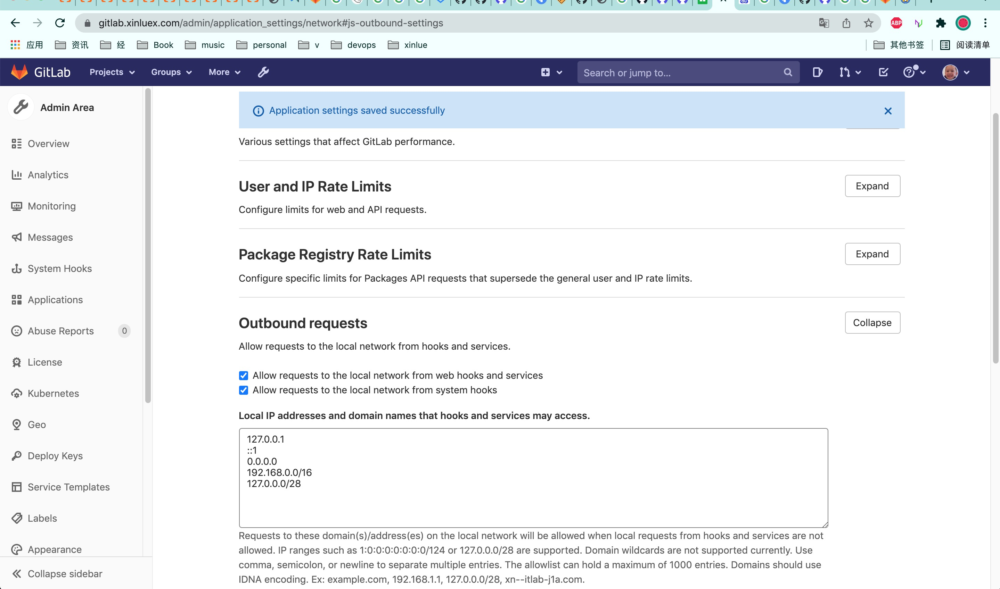

# 调研

https://github.com/pingcap/tiup/blob/master/doc/dev/README.md

发现是tidb的管理平台，go编写，速度还可

与devops有些联系，但还不合用我们现在的需求

# 自动化测试tox

[基础设施及代码](https://martinfowler.com/bliki/InfrastructureAsCode.html)

[11.Ansible你快点：Ansible执行过程分析、异步、效率优化improve](.img_ansible/improve)

# DevOps软件架构师行动指南-读书笔记整理

|                    |                                                              |                        |
| ------------------ | ------------------------------------------------------------ | ---------------------- |
| devops             | 一组过程、方法与系统的统称                                   |                        |
| pipeline           |                                                              |                        |
| 权限分配痛点       | 跨团队开发时,涉及merge和jenkins CI/CD需要其他团队配合        |                        |
| 沟通效率痛点       | 向不同的人描述上下文成本                                     |                        |
| 明确需求痛点       |                                                              |                        |
| 人员轮岗痛点       | 新成员输入上下文、交接工作                                   |                        |
| 关键角色管理痛点   | 未向正确的人汇报                                             | 沟通、建立交付价值指标 |
| 反模式             |                                                              |                        |
| 三步法             |                                                              |                        |
| 职能导向的负面影响 | 对接时需要到达决策层再逐级下达, 调整局部的优先级, 执行工作的人通常都不太理解整件事情的关联, 也会导致糟糕的交接,大量的返工,交付质量下降,延期等现象. |                        |
| 市场导向(速度优化) | 建立虚拟小团队,以客户为导向, 这使得每个小团队能够独立的向客户交付价值,而不必提交工单给IT运维\QA或信息安全等其他部门 |                        |

# [持续集成中的问题整理](.img_devops/CI)

交付 移植

# [技术栈](https://mp.weixin.qq.com/s/FDV4tp9tAodShQjM_LLXpQ)

https://zhuanlan.zhihu.com/p/373551077

## 架构方法论

# SRE GOOGLE

|                          |                                                     |           |
| ------------------------ | --------------------------------------------------- | --------- |
| 开发与运维之间的矛盾     | 开发想快速上线迭代,运维求稳                         |           |
| SRE成员特点              | 排斥重复和手工,足够的软件开发能力                   |           |
| 产品OPS负载              |                                                     |           |
| 方法论                   |                                                     |           |
| SLO                      |                                                     |           |
| AB测试?                  |                                                     |           |
| 灰度发布?                |                                                     |           |
| 错误预算?                |                                                     |           |
| 管理错误?                |                                                     |           |
| 紧急报警                 | 需要立即执行某种操作,目标是解决或避免即将发生的问题 | 重大/紧急 |
| 工单                     | 系统不能自动解决目前情况, 几天内解决                | ticket    |
| 日志                     | 正确的做法是平时没人会主动阅读日志,除非有特殊需要   | loki      |
| MTTF                     | 平均失败时间                                        |           |
| MTTR                     | 平均恢复时间                                        |           |
| 变更管理                 |                                                     |           |
| 运维手册+多次演习on-call |                                                     |           |
| 渐进式发布               |                                                     |           |
| 及时检测问题             |                                                     |           |
| 回滚                     |                                                     |           |
| 故障预测...              |                                                     |           |
| 需求预测                 |                                                     |           |
|                          |                                                     |           |

# 程序员的自我修养

|          |      |      |
| -------- | ---- | ---- |
| 微观管理 |      |      |
|          |      |      |
|          |      |      |

# 数据库变更的持续交付

| 数据库变更的持续交付                                         | CI/CD |      |
| ------------------------------------------------------------ | ----- | ---- |
| [针对数据库变更的持续集成与交付](.detail_devops/针对数据库变更的持续集成与交付.md) |       |      |
| [数据库变更部署自动化秘诀](.detail_devops/数据库变更部署自动化秘诀.md) |       |      |
| [数据库版本管理最佳实践](.detail_devops/数据库版本管理最佳实践.md) |       |      |

## 变更规范

|                                                              |      |      |
| ------------------------------------------------------------ | ---- | ---- |
| sql中不能有drop                                              |      |      |
| 在migrate中备份表名 ``"{table}_{current_version}"``, 然后写一个回滚sql文件把表名改回来 |      |      |
|                                                              |      |      |

## 工具准备

|                    |      |      |
| ------------------ | ---- | ---- |
| 一个开发同学一个库 |      |      |
|                    |      |      |
|                    |      |      |

##  migrate as code

|                                                |      |      |
| ---------------------------------------------- | ---- | ---- |
| https://github.com/playframework/playframework |      |      |
|                                                |      |      |
|                                                |      |      |

# dba tool

**Webhooks and insecure internal web services** **all tiers** **self-managed**

1. On the top bar, select Menu > Admin.
2. On the left sidebar, select Settings > Network.
3. Expand the Outbound requests section:
4. Select Allow requests to the local network from web hooks and services.

On the new page, hover over or click “***Settings\***” then hit “***Network\***“.

When the new page loads, look for “***Outbound requests\***“. On the far right of this field, click on “***Expand\***“.

Once Outbound requests field is expanded, you will see a field against a radio button that reads, “*Allow requests to the local network from web hooks and services*“. Click on the radio button to enable it as shared in the illustration below.

