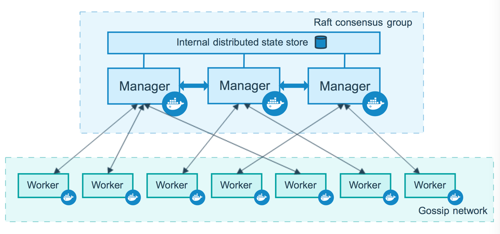

```sh
docker commit -a "vue ts python3.6" -m "打包测试成功" f8520479ba2b vue3-ts-python3.6:1.0.0

docker export  --output=vue3-ts-python36.tar  c7
cat vue3-ts-python36.tar|docker import - c8
```


```bash
hr:centos7 hr$ docker port 4966d35fe0a3
22/tcp -> 0.0.0.0:10022
```

# docker swarm




# 查看docker RestartPolicy

```sh
 docker inspect m1 | python3 -c 'import json,sys;print(json.load(sys.stdin)[0]["HostConfig"]["RestartPolicy"]["Name"])'
```

