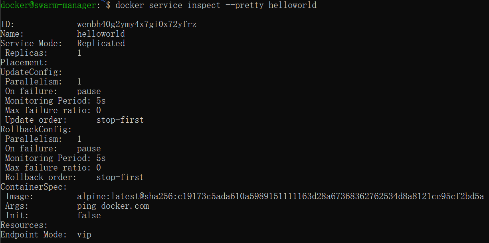
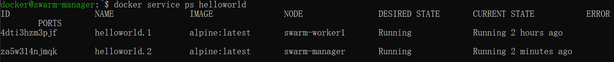
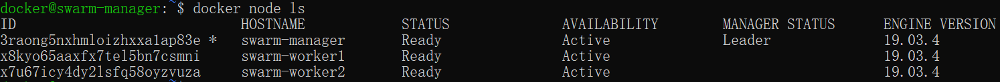

# docker安装

centos 7 以上

```sh
yum install -y yum-utils device-mapper-persistent-data lvm2

yum-config-manager --add-repo https://download.docker.com/linux/centos/docker-ce.repo

yum install docker-ce -y

yum install bridge-utils -y

sudo brctl addbr docker0

sudo ip addr add 10.49.0.1/24 dev docker0

# vi /etc/docker/daemon.json

# {"bip":"10.49.0.1/24"}

sudo ip link set dev docker0 up

sudo ip addr show docker0

sudo groupadd docker

sudo usermod -aG docker appuser

mkdir /app/docker && ln -s /app/docker /var/lib/docker && chown -R appuser:appuser /app/docker

sudo systemctl restart docker
```


```sh
docker commit -a "vue ts python3.6" -m "打包测试成功" f8520479ba2b vue3-ts-python3.6:1.0.0

docker export  --output=vue3-ts-python36.tar  c7
cat vue3-ts-python36.tar|docker import - c8
```


```bash
hr:centos7 hr$ docker port 4966d35fe0a3
22/tcp -> 0.0.0.0:10022
```

# docker swarm

官方网站：[https://docs.docker.com/engine/swarm/](https://links.jianshu.com/go?to=https%3A%2F%2Fdocs.docker.com%2Fengine%2Fswarm%2F)


# 查看docker RestartPolicy

```sh
 docker inspect m1 | python3 -c 'import json,sys;print(json.load(sys.stdin)[0]["HostConfig"]["RestartPolicy"]["Name"])'
```


```sh
docker run -d --name portainer1.2.1 -p 9000:9000 -v /var/run/docker.sock:/var/run/docker.sock -v portainer_data:/data portainer/portainer
```


# [Docker使用pipework配置本地网络](https://www.coonote.com/docker-note/docker-pipework-netword.html)

## 需求

在使用Docker的过程中，有时候我们会有将Docker容器配置到和主机同一网段的需求。要实现这个需求，我们只要将Docker容器和主机的网卡桥接起来，再给Docker容器配上IP就可以了。

下面我们就使用pipework工具来实现这一需求。

## 1、pipework的安装

Pipework是一个Docker配置工具，是一个开源项目，由200多行[shell](https://www.coonote.com/shell/shell-tutorial.html)实现。

Pipework是一个集成工具，需要配合使用的两个工具是OpenvSwitch和Bridge-utils。

```
$ git clone https://github.com/jpetazzo/pipework.git $ sudo cp pipework/pipework /usr/local/bin/
```

## 2、pipework配置Docker的三个简单场景

### 2.1　　pipework+linux bridge：配置Docker单主机容器

```
#主机A：192.168.187.143 #主机A上创建两个容器con1、con2 docker run -itd --name con1 --net=none ubuntu:14.04 bash docker run -itd --name con2 --net=none ubuntu:14.04 bash #使用pipework建立网桥br0，为容器con1和con2添加新的网卡，并将它们连接到br0上 pipework br0 con1 10.0.0.2/24 pipework br0 con2 10.0.0.3/24 #在容器con1和con2内部可以看到有一个网卡地址分别如上，可以ping通
```

### 2.2　　pipework+OVS：单主机Docker容器VLAN划分

pipework不仅可以使用Linux bridge连接Docker容器，还可以与OpenVswitch结合，实现Docker容器的VLAN划分。

```sh
 1 #主机A的IP地址为:192.168.187.147
 2 #在主机A上创建4个Docker容器，test1、test2、test3、test4  3 
 4 docker run -itd --name test1 --net=none busybox sh  5 docker run -itd --name test2 --net=none busybox sh  6 docker run -itd --name test3 --net=none busybox sh  7 docker run -itd --name test4 --net=none busybox sh  8 
 9 #将test1，test2划分到一个vlan中，vlan在mac地址后加@指定，此处mac地址省略 10 pipework ovs0 test1 192.168.0.1/24 @100
11 pipework ovs0 test2 192.168.0.2/24 @100
12 
13 #将test3，test4划分到另一个vlan中 14 pipework ovs0 test3 192.168.0.3/24 @200
15 pipework ovs0 test4 192.168.0.4/24 @200
16 
17 #此时进入容器test1 18 ping 10.0.0.2 #可以通信 19 ping 10.0.0.3    #不可以通信
```

这个功能其实是由于OpenVSwitch本身支持VLAN功能，在将veth pair的一端加入ovs0网桥时，指定了tag。底层的操作是

```sh
ovs-vsctl add-port ovs0 veth* tag=100
```

 

### 2.3　　pipework+OVS：多主机Docker容器VLAN划分

```
 1 #主机A：192.168.187.147
 2 #主机B：192.168.187.148
 3 
 4 #主机A上  5 docker run -itd --net=none --name con1 busybox sh  6 docker run -itd --net=none --name con2 busybox sh  7 
 8 #划分vlan  9 pipework ovs con1 10.0.0.1/24 @100
10 pipework ovs con2 10.0.0.2/24 @200
11 
12 #将eth0连接到ovs上 13 ovs-vsctl add-port ovs eth0 14 
15 #同理在主机B上进行操作 16 docker run -itd --net=none --name con3 busybox sh 17 docker run -itd --net=none --name con4 busybox sh 18 
19 #划分vlan 20 pipework ovs con3 10.0.0.3/24 @100
21 pipework ovs con4 10.0.0.4/24 @200
22 
23 #将eth0连接到ovs上 24 ovs-vsctl add-port ovs eth0
```

遇到问题：

1）进入容器con3，我们期望的结果是可以ping通con1，但是不能ping通con2.但是实验发现都不能ping通。感觉跨主机划分vlan还是存在问题。

注：看到将eth0连接到ovs上另一种实现方式如下，但是试过了还是不能ping通

```
1 #主机A的IP地址为:192.168.187.147
2 ip addr add 192.168.187.147/24 dev ovs0 3 ip addr del 192.168.187.147/24 dev eth0 4 ovs-vsctl add-port ovs0 eth0 5 route del default
6 route add default gw 192.168.187.254 dev ovs0
```

2）如果不划分vlan的话，是可以跨主机通信的。


# 敏感数据及密码

docker secret 

gitlab-ci private variable


# 如何将Docker镜像从1.43G瘦身到22.4MB

张亚龙 译 [Go招聘](javascript:void(0);) *2021-09-18 14:47*

收录于话题#Go译文18个

如果你正在做Web开发相关工作，那么你可能已经知道容器化的概念，以及知道它强大的功能等等。


但在使用Docker时，镜像大小至关重要。我们从create-react-app（https://reactjs.org/docs/create-a-new-react-app.html）获得的样板项目通常都超过1.43 GB。


今天，我们将容器化一个ReactJS应用程序，并学习一些关于如何减少镜像大小并提高性能的技巧。


我们将以ReactJS为例，但它适用于任何类型的NodeJS应用程序。


步骤1：创建项目


1、借助脚手架通过命令行模式创建React项目

```
npx create-react-app docker-image-test
```


2、命令执行成功后将生成一个基础React应用程序架构


3、我们可以进入项目目录安装依赖并运行项目

```
cd docker-image-test
yarn install
yarn start
```


4、通过访问http://localhost:3000可以访问已经启动的应用程序


步骤2：构建第一个镜像


1、在项目的根目录中创建一个名为Dockerfile的文件，并粘贴以下代码：

```
FROM node:12

WORKDIR /app

COPY package.json ./

RUN yarn install

COPY . .

EXPOSE 3000

CMD ["yarn", "start"]
```


2、注意，这里我们从Docker仓库获得基础镜像Node:12，然后安装依赖项并运行基本命令。（我们不会在这里讨论Docker命令的细节）


3、现在可以通过终端为容器构建镜像

```
docker build -t docker-image-test .
```


4、Docker构建镜像完成之后，你可以使用此命令查看已经构建的镜像：

```
docker images
```

在查询结果列表的顶部，是我们新创建的图像，在最右边，我们可以看到图像的大小。目前是1.43GB。


5、我们使用以下命令运行镜像

```
docker run --rm -it -p 3000:3000/tcp docker-image-test:latest
```

打开浏览器并且刷新页面验证其可以正常运行。


步骤3：修改基础镜像


1、先前的配置中我们用node:12作为基础镜像。但是传统的Node镜像是基于Ubuntu的，对于我们简单的React应用程序来说这大可不必。


2、从DockerHub（官方Docker镜像注册表）中我们可以看到，基于alpine-based的Node镜像比基于Ubuntu的镜像小得多，而且它们的依赖程度非常低。


3、下面显示了这些基本图像的大小比较


现在我们将使用node:12-alpine作为我们的基础镜像，看看会发生什么。

```
FROM node:12-alpine

WORKDIR /app

COPY package.json ./

RUN yarn install

COPY . .

EXPOSE 3000

CMD ["yarn", "start"]
```

然后我们以此构建我们的镜像，并与之前做对比。


哇！我们的镜像大小减少到只有580MB，这是一个很大的进步。但还能做得更好吗？


步骤4：多级构建


1、在之前的配置中，我们会将所有源代码也复制到工作目录中。


2、但这大可不必，因为从发布和运行来看我们只需要构建好的运行目录即可。因此，现在我们将引入多级构建的概念，以减少不必要的代码和依赖于我们的最终镜像。


3、配置是这样的：

```
# STAGE 1

FROM node:12-alpine AS build

WORKDIR /app

COPY package.json ./

RUN yarn  install

COPY . /app

RUN yarn build


# STAGE 2

FROM node:12-alpine

WORKDIR /app

RUN npm install -g webserver.local

COPY --from=build /app/build ./build

EXPOSE 3000

CMD webserver.local -d ./build
```


4、在第一阶段，安装依赖项并构建我们的项目


5、在第二阶段，我们复制上一阶段构建产物目录，并使用它来运行应用程序。


6、这样我们在最终的镜像中就不会有不必要的依赖和代码。


接下来，构建镜像成功后并从列表中查看镜像


现在我们的镜像大小只有97.5MB。这简直太棒了。


步骤5：使用Nginx


1、我们正在使用Node服务器运行ReactJS应用程序的静态资源，但这不是静态资源运行的最佳选择。


2、我们尝试使用Nginx这类更高效、更轻量级的服务器来运行资源应用程序，也可以尽可能提高其性能，并且减少镜像的量。


3、我们最终的Docker配置文件看起来像这样

```
# STAGE 1

FROM node:12-alpine AS build

WORKDIR /app

COPY package.json ./

RUN yarn  install

COPY . /app

RUN yarn build

# STAGE 2

FROM nginx:stable-alpine

COPY --from=build /app/build /usr/share/nginx/html

EXPOSE 80

CMD ["nginx", "-g", "daemon off;"]
```


4、我们正在改变Docker配置的第二阶段，以使用Nginx来服务我们的应用程序。


5、然后使用当前配置构建镜像。


6、镜像大小减少到只有22.4MB！


7、同时，我们正在使用一个性能更好的服务器来服务我们出色的应用程序。


8、我们可以使用以下命令验证应用程序是否仍在工作。

```
docker run --rm  -it -p 3000:80/tcp docker-image-test:latest
```


9、注意，我们将容器的80端口暴露给外部，因为默认情况下，Nginx将在容器内部的80端口上可用。


所以这些是一些简单的技巧，你可以应用到你的任何NodeJS项目，以大幅减少镜像大小。


现在，您的容器确实更加便携和高效了。c


原文链接：https://javascript.plainenglish.io/how-i-reduced-docker-image-size-from-1-43-gb-to-22-4-mb-84058d70574b


来自：https://cloud.51cto.com/art/202108/679717.htm


# 在 Go 中使用 dockertest 进行集成测试

原创 程序员ug [幽鬼](javascript:void(0);) *2021-11-29 11:30*

收录于话题#golang56个

争做团队核心程序员，关注「幽鬼」


进行集成测试（或系统测试）通常意味着让数据库填充数据，像 redis、elasticsearch 等，通常，我们的软件与之交互的任何基础设施都可以工作。

最常见的方法是复制我们的生产基础设施，其实用容器来实现还是比较容易的，比如 docker 容器。

我们可以为需要复制的每个服务设置和运行一个容器，我们可以使用 docker-compose 对其进行编排并创建一些 makefile 或只是一个简单的脚本来准备基础设施并运行集成测试。

如果你的测试是独立的（它们应该是独立的），你必须找到在测试之间“重新启动”基础设施服务的方法，这可能很难通过分离的基础设施设置和测试来实现（基础设施是在脚本中设置的，而测试在 Go 文件中）

## 01 dockertest

如果你使用的是 Go，则可以使用 dockertest，一个可以管理和编排 Go 测试文件中的容器的库。

从 Go 文件管理测试基础设施容器，允许我们控制在每个测试中需要的服务（例如，某些包正在使用数据库而不是 Redis，为这个测试运行 Redis 没有意义）

### 安装 dockertest

要安装 dockertest，只需运行：

```sh
go get -u github.com/ory/dockertest/v3
```

### 使用 dockertest

使用 dockertest 设置基础设施的最简单方法是在测试文件的`TestMain` 函数中添加设置代码。

`TestMain` 是在包中运行测试之前调用的函数，更多信息参考这里。

这是如何使用 dockertest 设置 MySQL 服务的示例：

```
package mypackage_test

import (
 "database/sql"
 "fmt"
 "log"
 "os"
 "testing"

 _ "github.com/go-sql-driver/mysql"
 "github.com/ory/dockertest/v3"
)

var db *sql.DB

func TestMain(m *testing.M) {
 // uses a sensible default on windows (tcp/http) and linux/osx (socket)
 pool, err := dockertest.NewPool("")
 if err != nil {
  log.Fatalf("Could not connect to docker: %s", err)
 }

 // pulls an image, creates a container based on it and runs it
 resource, err := pool.Run("mysql", "5.7", []string{"MYSQL_ROOT_PASSWORD=secret"})
 if err != nil {
  log.Fatalf("Could not start resource: %s", err)
 }

 // exponential backoff-retry, because the application in the container might not be ready to accept connections yet
 if err := pool.Retry(func() error {
  var err error
  db, err = sql.Open("mysql", fmt.Sprintf("root:secret@(localhost:%s)/mysql", resource.GetPort("3306/tcp")))
  if err != nil {
   return err
  }
  return db.Ping()
 }); err != nil {
  log.Fatalf("Could not connect to docker: %s", err)
 }

  // RESERVED FOR DATABASE MIGRATIONS
 code := m.Run()
 
 // You can't defer this because os.Exit doesn't care for defer
 if err := pool.Purge(resource); err != nil {
  log.Fatalf("Could not purge resource: %s", err)
 }
 
 os.Exit(code)
}
```

### 填充数据库

现在我们有工作的数据库服务，但这个数据库是空的。dockertest 正在为容器使用通用 MySQL 映像，并且没有与我们的应用程序相关的任何内容。

之前写了一篇关于 数据库迁移，在那篇文章中，我谈到了 *go-migrate*，一个运行数据库迁移的工具，那篇文章，我专注于作为 CLI 工具使用，现在将在我们的 Go 代码中使用它。

我们将先前编写的代码 `// RESERVED FOR DATABASE MIGRATIONS` 添加到此代码中：

```
m, err := migrate.NewWithDatabaseInstance("file://<path-to-migration-folder>, "mysql", driver)
if err != nil {
    log.Fatalf("Error running migrations: %s", err)
}
err = m.Up()
if err != nil {
    log.Fatal(err.Error())
}
```

然后在 dockertest up 数据库后，迁移工具填充数据库，我们的集成测试可以使用数据库中的相同数据运行。

如果应用程序有多个包（这是常见情况），我会将服务的设置代码放在一个独立文件中，该文件在每个包中调用：

```
// it_utils.go
package it_utils

func IntegrationTestSetup() (*dockertest.Pool, *[]dockertestResource {
  // Setup the services
  //return the pool and the resources
}

func IntegrationTestTeardown(pool *dockertest.Pool, resources []*dockertest.Resource) {
 for _, resource := range resources {
  if err := pool.Purge(resource); err != nil {
   fmt.Printf("Could not purge resource: %s\n", err)
  }
 }
}
```

那么在每个包的测试中我们只需要添加如下代码：

```
package my_package

func TestMyTests (t *testing.T) {
    if testing.Short() {
  t.Skip()
 }
 pool, resources := itutils.IntegrationTestSetup()
 defer itutils.IntegrationTestTeardown(pool, resources)
 
 t.Run("your test", func(t *testing.T) {
 ...
 }
}

func TestOtherTests (t *testing.T) {
    if testing.Short() {
  t.Skip()
 }
 pool, resources := itutils.IntegrationTestSetup()
 defer itutils.IntegrationTestTeardown(pool, resources)
 
 t.Run("your other test", func(t *testing.T) {
 ...
 }
}
```

以这种方式在每个测试块上执行此操作，服务在新容器中运行，从而使测试完全独立。

作为最后一个提示，我建议将集成测试放在不同的包中以避免循环导入。

原文链接：https://sergiocarracedo.es/integration-tests-in-golang-with-dockertest/


# bytebase

```sh
docker run -d --init --name bytebase --restart always --publish 18080:8080 --volume ~/.bytebase/data:/var/opt/bytebase bytebase/bytebase:0.11.0 --data /var/opt/bytebase --host http://172.16.200.82 --port 18080
```


# rancher


```sh


docker run --name m1 -p 63306:3306 -e MYSQL_ROOT_PASSWORD=Xinlue@2022 -d mysql:8.0

docker run   -d --name=rancher-master --privileged   --restart=unless-stopped   -p 18081:80 -p 44444:443  \
-v /home/infra/rancher/cni:/var/lib/cni \
-v /home/infra/rancher/log:/var/log \
-v /home/infra/rancher/kubelet:/var/lib/kubelet \
-v /home/infra/rancher/rancher:/var/lib/rancher \
   rancher/rancher:v2.6.0
```


# Swarm 集群管理

### 简介

Docker Swarm 是 Docker 的集群管理工具。它将 Docker 主机池转变为单个虚拟 Docker 主机。 Docker Swarm 提供了标准的 Docker API，所有任何已经与 Docker 守护程序通信的工具都可以使用 Swarm 轻松地扩展到多个主机。

支持的工具包括但不限于以下各项：

* Dokku
* Docker Compose
* Docker Machine
* Jenkins

### 原理

如下图所示，swarm 集群由管理节点（manager）和工作节点（work node）构成。

* **swarm mananger**：负责整个集群的管理工作包括集群配置、服务管理等所有跟集群有关的工作。
* **work node**：即图中的 available node，主要负责运行相应的服务来执行任务（task）。

[](https://www.runoob.com/wp-content/uploads/2019/11/services-diagram.png)

------

## 使用

以下示例，均以 Docker Machine 和 virtualbox 进行介绍，确保你的主机已安装 virtualbox。

### 1、创建 swarm 集群管理节点（manager）

创建 docker 机器：

```
$ docker-machine create -d virtualbox swarm-manager
```

[](https://www.runoob.com/wp-content/uploads/2019/11/swarm1.png)

初始化 swarm 集群，进行初始化的这台机器，就是集群的管理节点。

```
$ docker-machine ssh swarm-manager
$ docker swarm init --advertise-addr 192.168.99.107 #这里的 IP 为创建机器时分配的 ip。
```

[](https://www.runoob.com/wp-content/uploads/2019/11/swarm2.png)

以上输出，证明已经初始化成功。需要把以下这行复制出来，在增加工作节点时会用到：

```
docker swarm join --token SWMTKN-1-4oogo9qziq768dma0uh3j0z0m5twlm10iynvz7ixza96k6jh9p-ajkb6w7qd06y1e33yrgko64sk 192.168.99.107:2377
```

### 2、创建 swarm 集群工作节点（worker）

这里直接创建好俩台机器，swarm-worker1 和 swarm-worker2 。

[](https://www.runoob.com/wp-content/uploads/2019/11/swarm3.png)

分别进入两个机器里，指定添加至上一步中创建的集群，这里会用到上一步复制的内容。

[](https://www.runoob.com/wp-content/uploads/2019/11/swarm4.png)

以上数据输出说明已经添加成功。

上图中，由于上一步复制的内容比较长，会被自动截断，实际上在图运行的命令如下：

```
docker@swarm-worker1:~$ docker swarm join --token SWMTKN-1-4oogo9qziq768dma0uh3j0z0m5twlm10iynvz7ixza96k6jh9p-ajkb6w7qd06y1e33yrgko64sk 192.168.99.107:2377
```

### 3、查看集群信息

进入管理节点，执行：docker info 可以查看当前集群的信息。

```
$ docker info
```

[](https://www.runoob.com/wp-content/uploads/2019/11/swarm5.png)

通过画红圈的地方，可以知道当前运行的集群中，有三个节点，其中有一个是管理节点。

### 4、部署服务到集群中

**注意**：跟集群管理有关的任何操作，都是在管理节点上操作的。

以下例子，在一个工作节点上创建一个名为 helloworld 的服务，这里是随机指派给一个工作节点：

```
docker@swarm-manager:~$ docker service create --replicas 1 --name helloworld alpine ping docker.com
```

[](https://www.runoob.com/wp-content/uploads/2019/11/swarm6.png)

### 5、查看服务部署情况

查看 helloworld 服务运行在哪个节点上，可以看到目前是在 swarm-worker1 节点：

```
docker@swarm-manager:~$ docker service ps helloworld
```

[](https://www.runoob.com/wp-content/uploads/2019/11/swarm7.png)

查看 helloworld 部署的具体信息：

```
docker@swarm-manager:~$ docker service inspect --pretty helloworld
```

[](https://www.runoob.com/wp-content/uploads/2019/11/swarm8.png)

### 6、扩展集群服务

我们将上述的 helloworld 服务扩展到俩个节点。

```
docker@swarm-manager:~$ docker service scale helloworld=2
```

[](https://www.runoob.com/wp-content/uploads/2019/11/swarm9.png)

可以看到已经从一个节点，扩展到两个节点。

[](https://www.runoob.com/wp-content/uploads/2019/11/swarm10.png)

### 7、删除服务

```
docker@swarm-manager:~$ docker service rm helloworld
```

[](https://www.runoob.com/wp-content/uploads/2019/11/swarm11.png)

查看是否已删除：

[](https://www.runoob.com/wp-content/uploads/2019/11/swarm12.png)

### 8、滚动升级服务

以下实例，我们将介绍 redis 版本如何滚动升级至更高版本。

创建一个 3.0.6 版本的 redis。

```
docker@swarm-manager:~$ docker service create --replicas 1 --name redis --update-delay 10s redis:3.0.6
```

[](https://www.runoob.com/wp-content/uploads/2019/11/swarm13.png)

滚动升级 redis 。

```
docker@swarm-manager:~$ docker service update --image redis:3.0.7 redis
```

[](https://www.runoob.com/wp-content/uploads/2019/11/swarm14.png)

看图可以知道 redis 的版本已经从 3.0.6 升级到了 3.0.7，说明服务已经升级成功。

### 9、停止某个节点接收新的任务

查看所有的节点：

```
docker@swarm-manager:~$ docker node ls
```

[](https://www.runoob.com/wp-content/uploads/2019/11/swarm16.png)

可以看到目前所有的节点都是 Active, 可以接收新的任务分配。

停止节点 swarm-worker1：

[](https://www.runoob.com/wp-content/uploads/2019/11/swarm17.png)

**注意**：swarm-worker1 状态变为 Drain。不会影响到集群的服务，只是 swarm-worker1 节点不再接收新的任务，集群的负载能力有所下降。

可以通过以下命令重新激活节点：

```
docker@swarm-manager:~$  docker node update --availability active swarm-worker1
```

[](https://www.runoob.com/wp-content/uploads/2019/11/swarm19.png)


