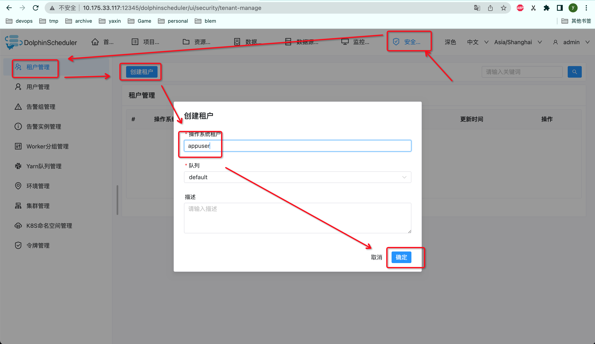
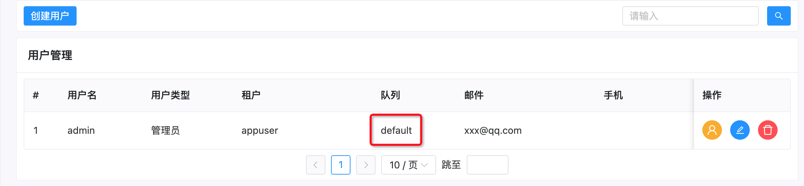

## 对接本地文件系统

### 配置 `common.properties` 文件

- 如果您以 `集群` 模式或者 `伪集群` 模式部署DolphinScheduler，您需要对以下路径的文件进行配置：`api-server/conf/common.properties` 和 `worker-server/conf/common.properties`；
- 若您以 `单机` 模式部署DolphinScheduler，您只需要配置 `standalone-server/conf/common.properties`，具体配置如下：

如下配置三个字段

```properties
......

# resource storage type: HDFS, S3, NONE
resource.storage.type=HDFS
# resource store on HDFS/S3 path, resource file will store to this base path, self configuration, please make sure the directory exists on hdfs and have read write permissions. "/dolphinscheduler" is recommended
resource.storage.upload.base.path=/tmp/dolphinscheduler

......

resource.hdfs.fs.defaultFS=file:///

......
```

- 将 `resource.storage.upload.base.path` 改为本地存储路径，请确保部署 DolphinScheduler 的用户拥有读写权限，例如：`resource.storage.upload.base.path=/tmp/dolphinscheduler`。当路径不存在时会自动创建文件夹
- 修改 `resource.storage.type=HDFS` 和 `resource.hdfs.fs.defaultFS=file:///`。

> **注意**：如果您不想用默认值作为资源中心的基础路径，请修改`resource.storage.upload.base.path`的值。


# local file storage

3.2.0 issue

https://github.com/apache/dolphinscheduler/pull/13303

2023-06-19 17:23:40 目前最新 3.1.7


**部署完服务，发现master、worker host地址和实际部署地址不一致**

`vi common.properties `

```properties
dolphin.scheduler.network.interface.preferred=
```


appuser







gp

