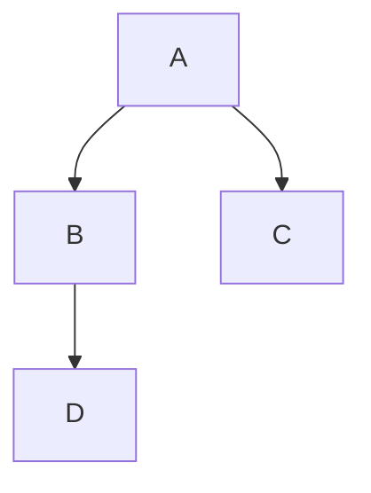
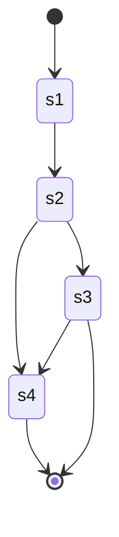
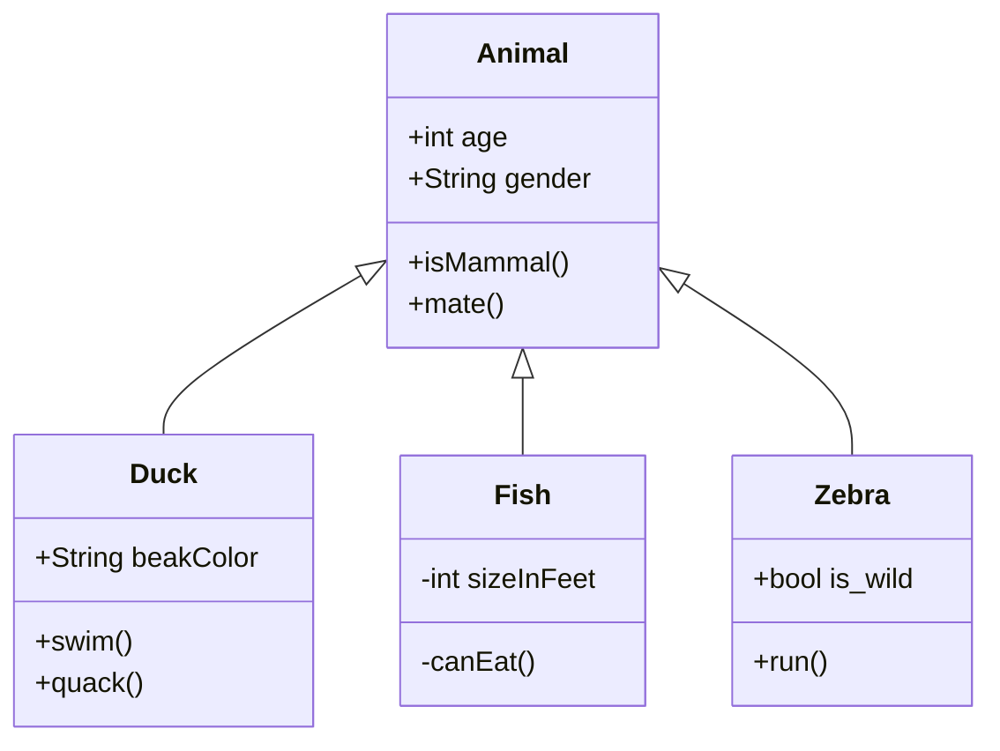

# python vs Golang

|      |      |      |
| ---- | ---- | ---- |
|      |      |      |
|      |      |      |
|      |      |      |


- defer()定義延遲調用，無論函數是否出錯，它都確保結束前被調用。


```yaml
学习笔记:
  key: 
    - 黄金三分法
    - 典型应用
```

https://github.com/yinggaozhen/awesome-go-cn


> 1. `go tool compile -N -l -S main.go`可以得到程序的汇编代码
> 2. 官方说使用go build + fileName 编译出来的就直接带有调试信息了，可以使用go build -ldflags “-s”把编译信息去掉,**减小大约一半的大小**
> 3. 默认编译会有一些给调试带来不便的优化，可以使用-gcflags “-N -l”选项把它去掉
>
> 

go build ldflags参数说明

```excel
-w 去掉DWARF调试信息，得到的程序就不能用gdb调试了。

-s 去掉符号表,panic时候的stack trace就没有任何文件名/行号信息了，这个等价于普通C/C++程序被strip的效果，

-X 设置包中的变量值
```


**如果想要在go build生成的可执行文件中注入编译时间，git hash等信息。可以在编译的时候使用-ldflags -X参数来注入变量**

> go build -ldflags "-X ' packageName.varName=cmd ' "


## 社区资源

- 在 [Freenode](http://freenode.net/) IRC 上，可能有很多#go-nuts的开发人员和用户，你可以获取即时的帮助。

- 还可以访问Go语言的官方邮件列表 [Go Nuts](http://groups.google.com/group/golang-nuts)。

- Bug可以在 [Go issue tracker](http://code.google.com/p/go/issues/list) 提交。

- 对于开发Go语言用户，有令一个专门的邮件列表 [golang-checkins](http://groups.google.com/group/golang-checkins)。 这里讨论的是Go语言仓库代码的变更。

- ~~如果是中文用户，请访问：[Go语言中文论坛](http://bbs.golang-china.org/)。~~

- [中文文档](https://www.kancloud.cn/wizardforcel/golang-doc/121334)


# Go AES加解密

2019-05-05阅读 3.3K0

版权声明：感谢您对博文的关注！

https://blog.csdn.net/K346K346/article/details/89387460				

利用Go提供的AES加解密与Base64编解码包，我们可以轻松地实现AES的加解密。实现之前，首先了解一下AES的一些常识点。 （1）AES有5种加密模式，分别是： （a）电码本模式（Electronic Codebook Book，ECB）； （b）密码分组链接模式（Cipher Block Chaining ，CBC），如果明文长度不是分组长度16字节的整数倍需要进行填充； （c）计算器模式（Counter，CTR）； （d）密码反馈模式（Cipher FeedBack，CFB）； （e）输出反馈模式（Output FeedBack，OFB）。

（2）AES是对称分组加密算法，每组长度为128bits，即16字节。

（3）AES秘钥的长度只能是16、24或32字节，分别对应三种AES，即AES-128, AES-192和AES-256，三者的区别是加密的轮数不同；

下面以CBC模式为例，实现AES加解密。

```javascript
package aeswrap

import (
    "fmt"
    "crypto/cipher"
    "crypto/aes"
    "bytes"
    "encoding/base64"
)

//@brief:填充明文
func PKCS5Padding(plaintext []byte, blockSize int) []byte{
    padding := blockSize-len(plaintext)%blockSize
    padtext := bytes.Repeat([]byte{byte(padding)},padding)
    return append(plaintext,padtext...)
}

//@brief:去除填充数据
func PKCS5UnPadding(origData []byte) []byte{
    length := len(origData)
    unpadding := int(origData[length-1])
    return origData[:(length - unpadding)]
}

//@brief:AES加密
func AesEncrypt(origData, key []byte) ([]byte, error){
    block, err := aes.NewCipher(key)
    if err != nil {
        return nil, err
    }

	//AES分组长度为128位，所以blockSize=16，单位字节
    blockSize := block.BlockSize()
    origData = PKCS5Padding(origData,blockSize)					
    blockMode := cipher.NewCBCEncrypter(block,key[:blockSize])	//初始向量的长度必须等于块block的长度16字节
    crypted := make([]byte, len(origData))
    blockMode.CryptBlocks(crypted,origData)
    return crypted, nil
}

//@brief:AES解密
func AesDecrypt(crypted, key []byte) ([]byte, error) {
    block, err := aes.NewCipher(key)
    if err != nil {
        return nil, err
    }

	//AES分组长度为128位，所以blockSize=16，单位字节
    blockSize := block.BlockSize()
    blockMode := cipher.NewCBCDecrypter(block, key[:blockSize])	//初始向量的长度必须等于块block的长度16字节
    origData := make([]byte, len(crypted))
    blockMode.CryptBlocks(origData, crypted)
    origData = PKCS5UnPadding(origData)
    return origData, nil
}

func main(){
	//key的长度必须是16、24或者32字节，分别用于选择AES-128, AES-192, or AES-256
    var aeskey = []byte("12345678abcdefgh")
    pass := []byte("vdncloud123456")
    xpass, err := AesEncrypt(pass,aeskey)
    if err != nil {
        fmt.Println(err)
        return
    }

    pass64 := base64.StdEncoding.EncodeToString(xpass)
    fmt.Printf("加密后:%v\n",pass64)

    bytesPass, err := base64.StdEncoding.DecodeString(pass64)
    if err != nil {
        fmt.Println(err)
        return
    }

    tpass, err := AesDecrypt(bytesPass, aeskey)
    if err != nil {
        fmt.Println(err)
        return
    }
    fmt.Printf("解密后:%s\n", tpass)
}
```

编译运行输出：

```javascript
加密后:Z9Mz4s6LDwYpIam4z+fqxw==
解密后:vdncloud123456
```

如果想了解AES实现原理，可参考[AES加密算法的详细介绍与实现](https://blog.csdn.net/qq_28205153/article/details/55798628#commentBox)。


# 朝花夕拾

|      |      |      |
| ---- | ---- | ---- |
|      |      |      |
|      |      |      |
|      |      |      |

# 扫目录

```go
package main

import (
    "fmt"
    "io/ioutil"
    "log"
)

func main() {
    files, err := ioutil.ReadDir(".")
    if err != nil {
        log.Fatal(err)
    }

    for _, file := range files {
        fmt.Println(file.Name())
    }
}
```

# 指针

# 不定长参数

```go
// Print代替fmt.Println(x...)
// x...  为展开
func Print(x ...interface{}) {
	fmt.Println(x...)
}
```


#  可选参数 ∆

options

# recover

recover只有发生在panic之后调用才会生效, 放在同goroutine下的defer比较合理

# Struct and tags


**结构体中的成员变量，只有首字母大写，才能在其定义的 package 以外访问。而在同一个 package 内，就不会有此限制。**

**package以外的访问都需要将package内成员和变量名大写**

struct[结构转换开发工具](https://www.golangs.cn/)


```go
type User struct {
    Name          string    `json:"name"`
    Password      string    `json:"password"`
    PreferredFish []string  `json:"preferredFish,omitempty"`
    CreatedAt     time.Time `json:"createdAt"`
}
```

```go
type User struct {
    Name      string    `json:"name"`
    Password  string    `json:"-"`
    CreatedAt time.Time `json:"createdAt"`
}
```

```go
type TopField struct {
	TestField `json:",omitempty,inline"`
	TestA     string `json:"test_a"`
	TestB     string `json:"test_b"`
}
```

yml

```go
type AnsibleVars struct {
	AnsibleSSHHost           string `yaml:"ansible_ssh_host,omitempty"`
	AnsibleSSHPass           string `yaml:"ansible_ssh_pass,omitempty"`
	AnsibleSSHUser           string `yaml:"ansible_ssh_user"`
	AnsibleSSHPrivateKeyFile string `yaml:"ansible_ssh_private_key_file"`
}
```


# reflect

Go:反射之用字符串函数名调用函数


```go

package main
 
import (
	"fmt"
	"reflect"
)
 
type Animal struct {
}
 
func (m *Animal) Eat() {
	fmt.Println("Eat")
}
func main() {
	animal := Animal{}
	value := reflect.ValueOf(&animal)
	f := value.MethodByName("Eat") //通过反射获取它对应的函数，然后通过call来调用
	f.Call([]reflect.Value{})

```


# interface

struct实现interface 接口, 可以让 &struct 传入 以interface接口作为参数 的func


# 1.17 泛型

# 协程


|                 |                                                              |                                               |
| --------------- | ------------------------------------------------------------ | --------------------------------------------- |
| go py协程的区别 | goroutine抢占式任务处理(互斥由channel实现,支持多核), coroutine协作式任务处理(不需要互斥,单核) | goroutineCPU/IO密集都适合,coroutine适合IO密集 |
|                 |                                                              |                                               |
|                 |                                                              |                                               |


# goproxy


go env -w GOPROXY=https://goproxy.cn,direct

# 折腾破解

 最新！IntelliJ IDEA 2020.3.2 - Mac激活教程（亲测有效）PyCharm、CLion、PhpStorm、GoLand、WebStorm、Rider、DataGrip、Ru...

[](https://www.jianshu.com/u/9e4d5c95a655)

[继粮](https://www.jianshu.com/u/9e4d5c95a655)关注

2021.03.04 20:17:35字数 314阅读 1,130

## 前言

本方法适用于所有平台（Win、Mac、Linux）的 JetBrains 软件（IntelliJIdea、CLion、PhpStorm、GoLand、PyCharm、WebStorm、Rider、DataGrip、RubyMine、AppCode）

**工具地址**：

[蓝凑云](https://links.jianshu.com/go?to=https%3A%2F%2Fouo.io%2Fzn8c3kh)：提取码: 4qpg

[百度云](https://links.jianshu.com/go?to=https%3A%2F%2Fouo.io%2Fg4ntsU)：提取码: rwub

## 一、下载

在 JetBrains 官网下载 IDEA 2020.3.2 版本: 【[传送门](https://links.jianshu.com/go?to=https%3A%2F%2Fouo.io%2FSRG8hV)】


下载.png

## 二、卸载旧版本


卸载1.png


卸载2.png

## 三、安装


安装.png

## 四、启动激活

### 启动

**第一种情况**：点击试用进入 IDEA


启动1.png

**第二种情况**：提示已过试用期，可以直接点击 OK 进入IDEA；或者使用脚本重置试用期，具体操作在后面


启动2.png

### 激活

打开任意一个工程或文件，把插件 `BetterIntelliJ.zip` 文件拖入到 IDEA 窗口中，注意不要解压`BetterIntelliJ.zip`文件


激活1.png


当提示重启 IDE 时，表示插件已经安装成功，此时关闭 idea，重新启动


激活2.png

重启后，打开激活界面


激活3.png


激活4.png

把 `激活key.txt` 文件中的内容复制到激活码输入框中


激活5.png

激活成功后，提示有效期至2099年12月31日


激活6.png

## 五、重置试用期

**window**：执行 `reset_jetbrains_eval_windows.vbs`

**Mac | Linux**：执行 `reset_jetbrains_eval_mac_linux.sh`


```bash
# 首先进入到 “JetBrains 激活工具/reset_script” 目录下
# 给脚本添加执行权限
chmod u+x reset_jetbrains_eval_mac_linux.sh

# 执行脚本,成功后会提示 'done.'
./reset_jetbrains_eval_mac_linux.sh 
```


重置试用期.png


# goland 升级1.17后无法配置SDK 

```
goland not a valid home for go sdk golang 1.17
```

edit  `src/runtime/internal/sys/zversion.go`

add new row `const theVersion = 'go1.17'`  

```go
// Code generated by go tool dist; DO NOT EDIT.
package sys
const StackGuardMultiplierDefault = 1
const theVersion = `go1.17`
```


# 学习Gin

https://gin-gonic.com/zh-cn/docs/examples/html-rendering/

# struct 和 struct pointer


```go
type MyStruct struct {
    Name string
}

func (s MyStruct) SetName1(name string) {
    s.Name = name
}

func (s *MyStruct) SetName2(name string) {
    s.Name = name
}
```

整体有以下几个考虑因素，按重要程度顺序排列：

1. 在使用上的考虑：方法是否需要修改接收器？如果需要，接收器必须是一个指针。
2. 在效率上的考虑：如果接收器很大，比如：一个大的结构体，使用指针接收器会好很多。
3. 在一致性上的考虑：如果类型的某些方法必须有指针接收器，那么其余的方法也应该有指针接收器，所以无论类型如何使用，方法集都是一致的。


# Rust 和 Go


# error的处理

```go
err = yaml.Unmarshal(yamlFile, &resultMap)
```











# git通用配置


```sh
vim .git/info/exclude
```


```
.idea
go.mod
go.sum


```

