# python vs Golang

|      |      |      |
| ---- | ---- | ---- |
|      |      |      |
|      |      |      |
|      |      |      |


- defer()定義延遲調用，無論函數是否出錯，它都確保結束前被調用。


# defer return 顺序


先上结论：

1. defer的执行顺序为：倒序执行。
2. defer的执行顺序在return之后，但是在返回值返回给调用方之前，所以使用defer可以达到修改返回值的目的。

然后再慢慢分析。


# 学习


```yaml
学习笔记:
  key: 
    - 黄金三分法
    - 典型应用
```

https://github.com/yinggaozhen/awesome-go-cn


> 1. `go tool compile -N -l -S main.go`可以得到程序的汇编代码
> 2. 官方说使用go build + fileName 编译出来的就直接带有调试信息了，可以使用go build -ldflags “-s”把编译信息去掉,**减小大约一半的大小**
> 3. 默认编译会有一些给调试带来不便的优化，可以使用-gcflags “-N -l”选项把它去掉
>
> 

go build ldflags参数说明

```excel
-w 去掉DWARF调试信息，得到的程序就不能用gdb调试了。

-s 去掉符号表,panic时候的stack trace就没有任何文件名/行号信息了，这个等价于普通C/C++程序被strip的效果，

-X 设置包中的变量值
```


**如果想要在go build生成的可执行文件中注入编译时间，git hash等信息。可以在编译的时候使用-ldflags -X参数来注入变量**

> go build -ldflags "-X ' packageName.varName=cmd ' "


## 社区资源

- 在 [Freenode](http://freenode.net/) IRC 上，可能有很多#go-nuts的开发人员和用户，你可以获取即时的帮助。

- 还可以访问Go语言的官方邮件列表 [Go Nuts](http://groups.google.com/group/golang-nuts)。

- Bug可以在 [Go issue tracker](http://code.google.com/p/go/issues/list) 提交。

- 对于开发Go语言用户，有令一个专门的邮件列表 [golang-checkins](http://groups.google.com/group/golang-checkins)。 这里讨论的是Go语言仓库代码的变更。

- ~~如果是中文用户，请访问：[Go语言中文论坛](http://bbs.golang-china.org/)。~~

- [中文文档](https://www.kancloud.cn/wizardforcel/golang-doc/121334)


# 交叉编译

Golang 支持交叉编译，在一个平台上生成另一个平台的可执行程序，最近使用了一下，非常好用，这里备忘一下。

Mac 下编译 Linux 和 Windows 64位可执行程序

```
CGO_ENABLED=0 GOOS=linux GOARCH=amd64 go build main.go
CGO_ENABLED=0 GOOS=windows GOARCH=amd64 go build main.go
```


Linux 下编译 Mac 和 Windows 64位可执行程序

```
CGO_ENABLED=0 GOOS=darwin GOARCH=amd64 go build main.go
CGO_ENABLED=0 GOOS=windows GOARCH=amd64 go build main.go
```


Windows 下编译 Mac 和 Linux 64位可执行程序

```
SET CGO_ENABLED=0
SET GOOS=darwin
SET GOARCH=amd64
go build main.go

SET CGO_ENABLED=0
SET GOOS=linux
SET GOARCH=amd64
go build main.go
```

GOOS：目标平台的操作系统（darwin、freebsd、linux、windows）
GOARCH：目标平台的体系架构（386、amd64、arm）
交叉编译不支持 CGO 所以要禁用它

上面的命令编译 64 位可执行程序，你当然应该也会使用 386 编译 32 位可执行程序
很多博客都提到要先增加对其它平台的支持，但是我跳过那一步，上面所列的命令也都能成功，且得到我想要的结果，可见那一步应该是非必须的，或是我所使用的 Go 版本已默认支持所有平台。
————————————————
版权声明：本文为CSDN博主「磐石区」的原创文章，遵循CC 4.0 BY-SA版权协议，转载请附上原文出处链接及本声明。
原文链接：https://blog.csdn.net/panshiqu/article/details/53788067

# Go AES加解密

2019-05-05阅读 3.3K0

版权声明：感谢您对博文的关注！

https://blog.csdn.net/K346K346/article/details/89387460				

利用Go提供的AES加解密与Base64编解码包，我们可以轻松地实现AES的加解密。实现之前，首先了解一下AES的一些常识点。 （1）AES有5种加密模式，分别是： （a）电码本模式（Electronic Codebook Book，ECB）； （b）密码分组链接模式（Cipher Block Chaining ，CBC），如果明文长度不是分组长度16字节的整数倍需要进行填充； （c）计算器模式（Counter，CTR）； （d）密码反馈模式（Cipher FeedBack，CFB）； （e）输出反馈模式（Output FeedBack，OFB）。

（2）AES是对称分组加密算法，每组长度为128bits，即16字节。

（3）AES秘钥的长度只能是16、24或32字节，分别对应三种AES，即AES-128, AES-192和AES-256，三者的区别是加密的轮数不同；

下面以CBC模式为例，实现AES加解密。

```javascript
package aeswrap

import (
    "fmt"
    "crypto/cipher"
    "crypto/aes"
    "bytes"
    "encoding/base64"
)

//@brief:填充明文
func PKCS5Padding(plaintext []byte, blockSize int) []byte{
    padding := blockSize-len(plaintext)%blockSize
    padtext := bytes.Repeat([]byte{byte(padding)},padding)
    return append(plaintext,padtext...)
}

//@brief:去除填充数据
func PKCS5UnPadding(origData []byte) []byte{
    length := len(origData)
    unpadding := int(origData[length-1])
    return origData[:(length - unpadding)]
}

//@brief:AES加密
func AesEncrypt(origData, key []byte) ([]byte, error){
    block, err := aes.NewCipher(key)
    if err != nil {
        return nil, err
    }

	//AES分组长度为128位，所以blockSize=16，单位字节
    blockSize := block.BlockSize()
    origData = PKCS5Padding(origData,blockSize)					
    blockMode := cipher.NewCBCEncrypter(block,key[:blockSize])	//初始向量的长度必须等于块block的长度16字节
    crypted := make([]byte, len(origData))
    blockMode.CryptBlocks(crypted,origData)
    return crypted, nil
}

//@brief:AES解密
func AesDecrypt(crypted, key []byte) ([]byte, error) {
    block, err := aes.NewCipher(key)
    if err != nil {
        return nil, err
    }

	//AES分组长度为128位，所以blockSize=16，单位字节
    blockSize := block.BlockSize()
    blockMode := cipher.NewCBCDecrypter(block, key[:blockSize])	//初始向量的长度必须等于块block的长度16字节
    origData := make([]byte, len(crypted))
    blockMode.CryptBlocks(origData, crypted)
    origData = PKCS5UnPadding(origData)
    return origData, nil
}

func main(){
	//key的长度必须是16、24或者32字节，分别用于选择AES-128, AES-192, or AES-256
    var aeskey = []byte("12345678abcdefgh")
    pass := []byte("vdncloud123456")
    xpass, err := AesEncrypt(pass,aeskey)
    if err != nil {
        fmt.Println(err)
        return
    }

    pass64 := base64.StdEncoding.EncodeToString(xpass)
    fmt.Printf("加密后:%v\n",pass64)

    bytesPass, err := base64.StdEncoding.DecodeString(pass64)
    if err != nil {
        fmt.Println(err)
        return
    }

    tpass, err := AesDecrypt(bytesPass, aeskey)
    if err != nil {
        fmt.Println(err)
        return
    }
    fmt.Printf("解密后:%s\n", tpass)
}
```

编译运行输出：

```javascript
加密后:Z9Mz4s6LDwYpIam4z+fqxw==
解密后:vdncloud123456
```

如果想了解AES实现原理，可参考[AES加密算法的详细介绍与实现](https://blog.csdn.net/qq_28205153/article/details/55798628#commentBox)。


# unsafe


[unsafe string to []byte](https://colobu.com/2022/09/06/string-byte-convertion/)

## byte slice 和 string 的转换优化

直接通过强转`string(bytes)`或者`[]byte(str)`会带来数据的复制，性能不佳，所以在追求极致性能场景，我们会采用『骇客』的方式，来实现这两种类型的转换,比如k8s采用下面的方式：

```
https://github.com/kubernetes/apiserver/blob/706a6d89cf35950281e095bb1eeed5e3211d6272/pkg/authentication/token/cache/cached_token_authenticator.go#L263-L271
// toBytes performs unholy acts to avoid allocations
func toBytes(s string) []byte {
	return *(*[]byte)(unsafe.Pointer(&s))
}

// toString performs unholy acts to avoid allocations
func toString(b []byte) string {
	return *(*string)(unsafe.Pointer(&b))
}
```

更多的采用下面的方式(rpcx也采用下面的方式):

```
func SliceByteToString(b []byte) string {
	return *(*string)(unsafe.Pointer(&b))
}

func StringToSliceByte(s string) []byte {
	x := (*[2]uintptr)(unsafe.Pointer(&s))
	h := [3]uintptr{x[0], x[1], x[1]}
	return *(*[]byte)(unsafe.Pointer(&h))
}
```

甚至，标准库也采用这种方式：

```
https://github.com/golang/go/blob/82f902ae8e2b7f7eff0cdb087e47e939cc296a62/src/strings/clone.go
func Clone(s string) string {
	if len(s) == 0 {
		return ""
	}
	b := make([]byte, len(s))
	copy(b, s)
	return *(*string)(unsafe.Pointer(&b))
}
```

因为 slice of byte 和 string 数据结构类似，所以我们可以可以使用这种『骇客』的方式强转。这两种类型的数据结构在`reflect`包中有定义:

```
type SliceHeader struct {
	Data uintptr
	Len  int
	Cap  int
}
type StringHeader struct {
	Data uintptr
	Len  int
}
```

`Slice`比`String`多一个`Cap`字段，它们的数据通过一个数组存储，这两个结构的`Data`存储了指向这个数组的指针。

## Go 1.20 的新的方式

很多项目中都使用上面的方式进行性能提升，但是这是通过`unsafe`实现的，有相当的风险，因为强转之后，slice可能会做一些变动，导致相关的数据被覆盖了或者被回收了，也经常会出现一些意想不到的问题，我在使用这种方式做RedisProxy的时候，也犯过类似的错误，我当时还以为是标准库出错了呢。

因此， Go官方准备在 1.20 中把这两个类型`SliceHeader`和`StringHeader`废弃掉，避免大家的误用。
废弃就废弃吧，但是也得提供相应的替代方法才行。这不，在 Go 1.12中，增加了几个方法`String`、`StringData`、`Slice`和`SliceData`,用来做这种性能转换。

* func Slice(ptr *ArbitraryType, len IntegerType) []ArbitraryType: 返回一个Slice,它的底层数组自ptr开始，长度和容量都是len
* func SliceData(slice []ArbitraryType) *ArbitraryType：返回一个指针，指向底层的数组
* func String(ptr *byte, len IntegerType) string： 生成一个字符串，底层的数组开始自ptr, 长度是len
* func StringData(str string) *byte: 返回字符串底层的数组

这四个方法看起来很原始很底层。

这个提交是由cuiweixie提交的。因为涉及到很基础很底层的实现，而且又是可能被广泛使用的方法，所以大家review起来特别的仔细，大家可以围观: [go-review#427095](https://go-review.googlesource.com/c/go/+/427095/)。

甚至，这个修改都惊动了蛰伏多月的Rob Pike大佬，他老人家询问为啥只有实现连注释文档都没有呢:[#54858](https://github.com/golang/go/issues?q=is%3Aissue+unsafe)，当然原因是这个功能还在开发和review之中，不过可以看出Rob Pike很重视这个修改。

cuiweixie 甚至还修改了标准库里面一些[写法](https://github.com/golang/go/issues/54854)，使用他提交的unsafe中的这四个方法。

## 性能测试

虽然cuiweixie的提交还没有被merge到主分支，还存在一些变数，但是我发现使用gotip能使用这几个方法了。 我理解的是gotip适合master分支保持一致的，难道不是么？

不管怎样，先写个benchmark:

```
var L = 1024 * 1024
var str = strings.Repeat("a", L)
var s = bytes.Repeat([]byte{'a'}, L)

var str2 string
var s2 []byte

func BenchmarkString2Slice(b *testing.B) {
	for i := 0; i < b.N; i++ {
		bt := []byte(str)
		if len(bt) != L {
			b.Fatal()
		}
	}
}

func BenchmarkString2SliceReflect(b *testing.B) {
	for i := 0; i < b.N; i++ {
		bt := *(*[]byte)(unsafe.Pointer(&str))
		if len(bt) != L {
			b.Fatal()
		}
	}
}

func BenchmarkString2SliceUnsafe(b *testing.B) {
	for i := 0; i < b.N; i++ {
		bt := unsafe.Slice(unsafe.StringData(str), len(str))
		if len(bt) != L {
			b.Fatal()
		}
	}
}

func BenchmarkSlice2String(b *testing.B) {
	for i := 0; i < b.N; i++ {
		ss := string(s)
		if len(ss) != L {
			b.Fatal()
		}
	}
}

func BenchmarkSlice2StringReflect(b *testing.B) {
	for i := 0; i < b.N; i++ {
		ss := *(*string)(unsafe.Pointer(&s))
		if len(ss) != L {
			b.Fatal()
		}
	}
}

func BenchmarkSlice2StringUnsafe(b *testing.B) {
	for i := 0; i < b.N; i++ {
		ss := unsafe.String(unsafe.SliceData(s), len(str))
		if len(ss) != L {
			b.Fatal()
		}
	}
}
```

实际测试结果:

```
➜  strslice gotip test -benchmem  -bench .
goos: darwin
goarch: arm64
pkg: github.com/smallnest/study/strslice
BenchmarkString2Slice-8          	   18826	         63942 ns/op	 1048579 B/op	       1 allocs/op
BenchmarkString2SliceReflect-8   	1000000000	         0.6498 ns/op	       0 B/op	       0 allocs/op
BenchmarkString2SliceUnsafe-8    	1000000000	         0.8178 ns/op	       0 B/op	       0 allocs/op
BenchmarkSlice2String-8          	   18686	         65864 ns/op	 1048580 B/op	       1 allocs/op
BenchmarkSlice2StringReflect-8   	1000000000	         0.6488 ns/op	       0 B/op	       0 allocs/op
BenchmarkSlice2StringUnsafe-8    	1000000000	         0.9744 ns/op	       0 B/op	       0 allocs/op
```

可以看到，不通过『骇客』的方式，两种类型强转耗时非常巨大，如果采用`reflect`的方式，性能提升大大改观。

如果采用最新的`unsafe`包的方式，性能也能大大提高，虽然耗时比`reflect`略有增加，可以忽略。

# 朝花夕拾

|      |      |      |
| ---- | ---- | ---- |
|      |      |      |
|      |      |      |
|      |      |      |

# regex

## 正则表达式模式

[code](https://vimsky.com/examples/usage/golang_regexp_Regexp_FindAllIndex.html)

模式字符串使用特殊的语法来表示一个正则表达式：

字母和数字表示他们自身。一个正则表达式模式中的字母和数字匹配同样的字符串。

多数字母和数字前加一个反斜杠时会拥有不同的含义。

标点符号只有被转义时才匹配自身，否则它们表示特殊的含义。

反斜杠本身需要使用反斜杠转义。

由于正则表达式通常都包含反斜杠，所以你最好使用原始字符串来表示它们。模式元素(如 r'\t'，等价于 '\\t')匹配相应的特殊字符。

下表列出了正则表达式模式语法中的特殊元素。如果你使用模式的同时提供了可选的标志参数，某些模式元素的含义会改变。

| 模式        | 描述                                                         |
| :---------- | :----------------------------------------------------------- |
| ^           | 匹配字符串的开头                                             |
| $           | 匹配字符串的末尾。                                           |
| .           | 匹配任意字符，除了换行符，当re.DOTALL标记被指定时，则可以匹配包括换行符的任意字符。 |
| [...]       | 用来表示一组字符,单独列出：[amk] 匹配 'a'，'m'或'k'          |
| [^...]      | 不在[]中的字符：[^abc] 匹配除了a,b,c之外的字符。             |
| re*         | 匹配0个或多个的表达式。                                      |
| re+         | 匹配1个或多个的表达式。                                      |
| re?         | 匹配0个或1个由前面的正则表达式定义的片段，非贪婪方式         |
| re{ n}      | 精确匹配 n 个前面表达式。例如， **o{2}** 不能匹配 "Bob" 中的 "o"，但是能匹配 "food" 中的两个 o。 |
| re{ n,}     | 匹配 n 个前面表达式。例如， o{2,} 不能匹配"Bob"中的"o"，但能匹配 "foooood"中的所有 o。"o{1,}" 等价于 "o+"。"o{0,}" 则等价于 "o*"。 |
| re{ n, m}   | 匹配 n 到 m 次由前面的正则表达式定义的片段，贪婪方式         |
| a\| b       | 匹配a或b                                                     |
| (re)        | 对正则表达式分组并记住匹配的文本                             |
| (?imx)      | 正则表达式包含三种可选标志：i, m, 或 x 。只影响括号中的区域。 |
| (?-imx)     | 正则表达式关闭 i, m, 或 x 可选标志。只影响括号中的区域。     |
| (?: re)     | 类似 (...), 但是不表示一个组                                 |
| (?imx: re)  | 在括号中使用i, m, 或 x 可选标志                              |
| (?-imx: re) | 在括号中不使用i, m, 或 x 可选标志                            |
| (?#...)     | 注释.                                                        |
| (?= re)     | 前向肯定界定符。如果所含正则表达式，以 ... 表示，在当前位置成功匹配时成功，否则失败。但一旦所含表达式已经尝试，匹配引擎根本没有提高；模式的剩余部分还要尝试界定符的右边。 |
| (?! re)     | 前向否定界定符。与肯定界定符相反；当所含表达式不能在字符串当前位置匹配时成功 |
| (?> re)     | 匹配的独立模式，省去回溯。                                   |
| \w          | 匹配字母数字及下划线                                         |
| \W          | 匹配非字母数字及下划线                                       |
| \s          | 匹配任意空白字符，等价于 **[ \t\n\r\f]**。                   |
| \S          | 匹配任意非空字符                                             |
| \d          | 匹配任意数字，等价于 [0-9].                                  |
| \D          | 匹配任意非数字                                               |
| \A          | 匹配字符串开始                                               |
| \Z          | 匹配字符串结束，如果是存在换行，只匹配到换行前的结束字符串。 |
| \z          | 匹配字符串结束                                               |
| \G          | 匹配最后匹配完成的位置。                                     |
| \b          | 匹配一个单词边界，也就是指单词和空格间的位置。例如， 'er\b' 可以匹配"never" 中的 'er'，但不能匹配 "verb" 中的 'er'。 |
| \B          | 匹配非单词边界。'er\B' 能匹配 "verb" 中的 'er'，但不能匹配 "never" 中的 'er'。 |
| \n, \t, 等. | 匹配一个换行符。匹配一个制表符。等                           |
| \1...\9     | 匹配第n个分组的内容。                                        |
| \10         | 匹配第n个分组的内容，如果它经匹配。否则指的是八进制字符码的表达式。 |


### 正则表达式实例

#### 字符匹配

| 实例   | 描述           |
| :----- | :------------- |
| python | 匹配 "python". |

#### 字符类

| 实例        | 描述                              |
| :---------- | :-------------------------------- |
| [Pp]ython   | 匹配 "Python" 或 "python"         |
| rub[ye]     | 匹配 "ruby" 或 "rube"             |
| [aeiou]     | 匹配中括号内的任意一个字母        |
| [0-9]       | 匹配任何数字。类似于 [0123456789] |
| [a-z]       | 匹配任何小写字母                  |
| [A-Z]       | 匹配任何大写字母                  |
| [a-zA-Z0-9] | 匹配任何字母及数字                |
| [^aeiou]    | 除了aeiou字母以外的所有字符       |
| [^0-9]      | 匹配除了数字外的字符              |


#### 特殊字符类

| 实例 | 描述                                                         |
| :--- | :----------------------------------------------------------- |
| .    | 匹配除 "\n" 之外的任何单个字符。要匹配包括 '\n' 在内的任何字符，请使用象 '[.\n]' 的模式。 |
| \d   | 匹配一个数字字符。等价于 [0-9]。                             |
| \D   | 匹配一个非数字字符。等价于 [^0-9]。                          |
| \s   | 匹配任何空白字符，包括空格、制表符、换页符等等。等价于 [ \f\n\r\t\v]。 |
| \S   | 匹配任何非空白字符。等价于 [^ \f\n\r\t\v]。                  |
| \w   | 匹配包括下划线的任何单词字符。等价于'[A-Za-z0-9_]'。         |
| \W   | 匹配任何非单词字符。等价于 '[^A-Za-z0-9_]'。                 |

# 扫目录

```go
package main

import (
    "fmt"
    "io/ioutil"
    "log"
)

func main() {
    files, err := ioutil.ReadDir(".")
    if err != nil {
        log.Fatal(err)
    }

    for _, file := range files {
        fmt.Println(file.Name())
    }
}
```

# 指针

# 不定长参数

```go
// Print代替fmt.Println(x...)
// x...  为展开
func Print(x ...interface{}) {
	fmt.Println(x...)
}
```


#  可选参数 ∆

options

# recover

recover只有发生在panic之后调用才会生效, 放在同goroutine下的defer比较合理

# Struct and tags


**结构体中的成员变量，只有首字母大写，才能在其定义的 package 以外访问。而在同一个 package 内，就不会有此限制。**

**package以外的访问都需要将package内成员和变量名大写**

struct[结构转换开发工具](https://www.golangs.cn/)


```go
type User struct {
    Name          string    `json:"name"`
    Password      string    `json:"password"`
    PreferredFish []string  `json:"preferredFish,omitempty"`
    CreatedAt     time.Time `json:"createdAt"`
}
```

```go
type User struct {
    Name      string    `json:"name"`
    Password  string    `json:"-"`
    CreatedAt time.Time `json:"createdAt"`
}
```

```go
type TopField struct {
	TestField `json:",omitempty,inline"`
	TestA     string `json:"test_a"`
	TestB     string `json:"test_b"`
}
```

yml

```go
type AnsibleVars struct {
	AnsibleSSHHost           string `yaml:"ansible_ssh_host,omitempty"`
	AnsibleSSHPass           string `yaml:"ansible_ssh_pass,omitempty"`
	AnsibleSSHUser           string `yaml:"ansible_ssh_user"`
	AnsibleSSHPrivateKeyFile string `yaml:"ansible_ssh_private_key_file"`
}
```


# reflect

Go:反射之用字符串函数名调用函数


```go

package main
 
import (
	"fmt"
	"reflect"
)
 
type Animal struct {
}
 
func (m *Animal) Eat() {
	fmt.Println("Eat")
}
func main() {
	animal := Animal{}
	value := reflect.ValueOf(&animal)
	f := value.MethodByName("Eat") //通过反射获取它对应的函数，然后通过call来调用
	f.Call([]reflect.Value{})

```


修改值

此篇文章引自https://juejin.im/post/5a75a4fb5188257a82110544#heading-13

## 编程语言中反射的概念

  在计算机科学领域，反射是指一类应用，它们能够自描述和自控制。也就是说，这类应用通过采用某种机制来实现对自己行为的描述（self-representation）和监测（examination），并能根据自身行为的状态和结果，调整或修改应用所描述行为的状态和相关的语义。
 每种语言的反射模型都不同，并且有些语言根本不支持反射。Golang语言实现了反射，反射机制就是在运行时动态的调用对象的方法和属性，官方自带的reflect包就是反射相关的，只要包含这个包就可以使用。
 多插一句，Golang的gRPC也是通过反射实现的。

## interface 和 [反射](https://mp.weixin.qq.com/s/TmzV2VTfkE8of2_zuKa0gA)

在讲反射之前，先来看看Golang关于类型设计的一些原则

* 变量包括（type, value）两部分    理解这一点就知道为什么nil != nil了
* type 包括 static type和concrete type. 简单来说 static type是你在编码是看见的类型(如int、string)，concrete type是runtime系统看见的类型
* 类型断言能否成功，取决于变量的concrete type，而不是static type. 因此，一个 reader变量如果它的concrete type也实现了write方法的话，它也可以被类型断言为writer.

  接下来要讲的反射，就是建立在类型之上的，Golang的指定类型的变量的类型是静态的（也就是指定int、string这些的变量，它的type是static type），在创建变量的时候就已经确定，反射主要与Golang的interface类型相关（它的type是concrete type），只有interface类型才有反射一说。
  在Golang的实现中，每个interface变量都有一个对应pair，pair中记录了实际变量的值和类型:


```go
(value, type)
```

  复制代码value是实际变量值，type是实际变量的类型。一个interface{}类型的变量包含了2个指针，一个指针指向值的类型【对应concrete type】，另外一个指针指向实际的值【对应value】。
 例如，创建类型为*os.File的变量，然后将其赋给一个接口变量r：


```go
tty, err := os.OpenFile("/dev/tty", os.O_RDWR, 0)

var r io.Reader
r = tty
```

  复制代码接口变量r的pair中将记录如下信息：(tty, *os.File)，这个pair在接口变量的连续赋值过程中是不变的，将接口变量r赋给另一个接口变量w:


```go
var w io.Writer
w = r.(io.Writer)
```

  复制代码接口变量w的pair与r的pair相同，都是:(tty, *os.File)，即使w是空接口类型，pair也是不变的。
  interface及其pair的存在，是Golang中实现反射的前提，理解了pair，就更容易理解反射。反射就是用来检测存储在接口变量内部(值value；类型concrete type) pair对的一种机制。

## Golang的反射reflect

#### reflect的基本功能TypeOf和ValueOf

  既然反射就是用来检测存储在接口变量内部(值value；类型concrete type) pair对的一种机制。那么在Golang的reflect反射包中有什么样的方式可以让我们直接获取到变量内部的信息呢？ 它提供了两种类型（或者说两个方法）让我们可以很容易的访问接口变量内容，分别是reflect.ValueOf() 和 reflect.TypeOf()，看看官方的解释


```go
// ValueOf returns a new Value initialized to the concrete value
// stored in the interface i.  ValueOf(nil) returns the zero 
func ValueOf(i interface{}) Value {...}

翻译一下：ValueOf用来获取输入参数接口中的数据的值，如果接口为空则返回0


// TypeOf returns the reflection Type that represents the dynamic type of i.
// If i is a nil interface value, TypeOf returns nil.
func TypeOf(i interface{}) Type {...}

翻译一下：TypeOf用来动态获取输入参数接口中的值的类型，如果接口为空则返回nil
```

reflect.TypeOf()是获取pair中的type，reflect.ValueOf()获取pair中的value，示例如下：


```go
package main

import (
    "fmt"
    "reflect"
)

func main() {
    var num float64 = 1.2345

    fmt.Println("type: ", reflect.TypeOf(num))
    fmt.Println("value: ", reflect.ValueOf(num))
}

运行结果:
type:  float64
value:  1.2345
```

##### 说明

1. reflect.TypeOf： 直接给到了我们想要的type类型，如float64、int、各种pointer、struct 等等真实的类型
2. reflect.ValueOf：直接给到了我们想要的具体的值，如1.2345这个具体数值，或者类似&{1 "Allen.Wu" 25} 这样的结构体struct的值
3. 也就是说明反射可以将“接口类型变量”转换为“反射类型对象”，反射类型指的是reflect.Type和reflect.Value这两种

#### 从relfect.Value中获取接口interface的信息

  当执行reflect.ValueOf(interface)之后，就得到了一个类型为”relfect.Value”变量，可以通过它本身的Interface()方法获得接口变量的真实内容，然后可以通过类型判断进行转换，转换为原有真实类型。不过，我们可能是已知原有类型，也有可能是未知原有类型，因此，下面分两种情况进行说明。

##### 已知原有类型【进行“强制转换”】

  已知类型后转换为其对应的类型的做法如下，直接通过Interface方法然后强制转换，如下：


```go
realValue := value.Interface().(已知的类型)
```

示例如下：


```go
package main

import (
    "fmt"
    "reflect"
)

func main() {
    var num float64 = 1.2345

    pointer := reflect.ValueOf(&num)
    value := reflect.ValueOf(num)

    // 可以理解为“强制转换”，但是需要注意的时候，转换的时候，如果转换的类型不完全符合，则直接panic
    // Golang 对类型要求非常严格，类型一定要完全符合
    // 如下两个，一个是*float64，一个是float64，如果弄混，则会panic
    convertPointer := pointer.Interface().(*float64)
    convertValue := value.Interface().(float64)

    fmt.Println(convertPointer)
    fmt.Println(convertValue)
}

运行结果：
0xc42000e238
1.2345
```

##### 说明

1. 转换的时候，如果转换的类型不完全符合，则直接panic，类型要求非常严格！
2. 转换的时候，要区分是指针还是指
3. 也就是说反射可以将“反射类型对象”再重新转换为“接口类型变量”

##### 未知原有类型【遍历探测其Filed】

  很多情况下，我们可能并不知道其具体类型，那么这个时候，该如何做呢？需要我们进行遍历探测其Filed来得知，示例如下:


```go
package main

import (
    "fmt"
    "reflect"
)

type User struct {
    Id   int
    Name string
    Age  int
}

func (u User) ReflectCallFunc() {
    fmt.Println("Allen.Wu ReflectCallFunc")
}

func main() {

    user := User{1, "Allen.Wu", 25}

    DoFiledAndMethod(user)

}

// 通过接口来获取任意参数，然后一一揭晓
func DoFiledAndMethod(input interface{}) {

    getType := reflect.TypeOf(input)
    fmt.Println("get Type is :", getType.Name())

    getValue := reflect.ValueOf(input)
    fmt.Println("get all Fields is:", getValue)

    // 获取方法字段
    // 1. 先获取interface的reflect.Type，然后通过NumField进行遍历
    // 2. 再通过reflect.Type的Field获取其Field
    // 3. 最后通过Field的Interface()得到对应的value
    for i := 0; i < getType.NumField(); i++ {
        field := getType.Field(i)
        value := getValue.Field(i).Interface()
        fmt.Printf("%s: %v = %v\n", field.Name, field.Type, value)
    }

    // 获取方法
    // 1. 先获取interface的reflect.Type，然后通过.NumMethod进行遍历
    for i := 0; i < getType.NumMethod(); i++ {
        m := getType.Method(i)
        fmt.Printf("%s: %v\n", m.Name, m.Type)
    }
}

运行结果：
get Type is : User
get all Fields is: {1 Allen.Wu 25}
Id: int = 1
Name: string = Allen.Wu
Age: int = 25
ReflectCallFunc: func(main.User)
```

##### 说明

通过运行结果可以得知获取未知类型的interface的具体变量及其类型的步骤为：

1. 先获取interface的reflect.Type，然后通过NumField进行遍历
2. 再通过reflect.Type的Field获取其Field
3. 最后通过Field的Interface()得到对应的value

通过运行结果可以得知获取未知类型的interface的所属方法（函数）的步骤为：

1. 先获取interface的reflect.Type，然后通过NumMethod进行遍历
2. 再分别通过reflect.Type的Method获取对应的真实的方法（函数）
3. 最后对结果取其Name和Type得知具体的方法名
4. 也就是说反射可以将“反射类型对象”再重新转换为“接口类型变量”
5. struct 或者 struct 的嵌套都是一样的判断处理方式

#### 通过reflect.Value设置实际变量的值

  reflect.Value是通过reflect.ValueOf(X)获得的，只有当X是指针的时候，才可以通过reflec.Value修改实际变量X的值，即：要修改反射类型的对象就一定要保证其值是“addressable”的。

示例如下：


```go
package main

import (
    "fmt"
    "reflect"
)

func main() {

    var num float64 = 1.2345
    fmt.Println("old value of pointer:", num)

    // 通过reflect.ValueOf获取num中的reflect.Value，注意，参数必须是指针才能修改其值
    pointer := reflect.ValueOf(&num)
    newValue := pointer.Elem()

    fmt.Println("type of pointer:", newValue.Type())
    fmt.Println("settability of pointer:", newValue.CanSet())

    // 重新赋值
    newValue.SetFloat(77)
    fmt.Println("new value of pointer:", num)

    ////////////////////
    // 如果reflect.ValueOf的参数不是指针，会如何？
    pointer = reflect.ValueOf(num)
    //newValue = pointer.Elem() // 如果非指针，这里直接panic，“panic: reflect: call of reflect.Value.Elem on float64 Value”
}

运行结果：
old value of pointer: 1.2345
type of pointer: float64
settability of pointer: true
new value of pointer: 77
```

##### 说明

1. 需要传入的参数是* float64这个指针，然后可以通过pointer.Elem()去获取所指向的Value，注意一定要是指针。
2. 如果传入的参数不是指针，而是变量，那么

* 通过Elem获取原始值对应的对象则直接panic
* 通过CanSet方法查询是否可以设置返回false

1. newValue.CantSet()表示是否可以重新设置其值，如果输出的是true则可修改，否则不能修改，修改完之后再进行打印发现真的已经修改了。
2. reflect.Value.Elem() 表示获取原始值对应的反射对象，只有原始对象才能修改，当前反射对象是不能修改的
3. 也就是说如果要修改反射类型对象，其值必须是“addressable”【对应的要传入的是指针，同时要通过Elem方法获取原始值对应的反射对象】
4. struct 或者 struct 的嵌套都是一样的判断处理方式

#### 通过reflect.ValueOf来进行方法的调用

  这算是一个高级用法了，前面我们只说到对类型、变量的几种反射的用法，包括如何获取其值、其类型、如果重新设置新值。但是在工程应用中，另外一个常用并且属于高级的用法，就是通过reflect来进行方法【函数】的调用。比如我们要做框架工程的时候，需要可以随意扩展方法，或者说用户可以自定义方法，那么我们通过什么手段来扩展让用户能够自定义呢？关键点在于用户的自定义方法是未可知的，因此我们可以通过reflect来搞定
 示例如下：


```go
package main

import (
    "fmt"
    "reflect"
)

type User struct {
    Id   int
    Name string
    Age  int
}

func (u User) ReflectCallFuncHasArgs(name string, age int) {
    fmt.Println("ReflectCallFuncHasArgs name: ", name, ", age:", age, "and origal User.Name:", u.Name)
}

func (u User) ReflectCallFuncNoArgs() {
    fmt.Println("ReflectCallFuncNoArgs")
}

// 如何通过反射来进行方法的调用？
// 本来可以用u.ReflectCallFuncXXX直接调用的，但是如果要通过反射，那么首先要将方法注册，也就是MethodByName，然后通过反射调动mv.Call

func main() {
    user := User{1, "Allen.Wu", 25}
    
    // 1. 要通过反射来调用起对应的方法，必须要先通过reflect.ValueOf(interface)来获取到reflect.Value，得到“反射类型对象”后才能做下一步处理
    getValue := reflect.ValueOf(user)

    // 一定要指定参数为正确的方法名
    // 2. 先看看带有参数的调用方法
    methodValue := getValue.MethodByName("ReflectCallFuncHasArgs")
    args := []reflect.Value{reflect.ValueOf("wudebao"), reflect.ValueOf(30)}
    methodValue.Call(args)

    // 一定要指定参数为正确的方法名
    // 3. 再看看无参数的调用方法
    methodValue = getValue.MethodByName("ReflectCallFuncNoArgs")
    args = make([]reflect.Value, 0)
    methodValue.Call(args)
}


运行结果：
ReflectCallFuncHasArgs name:  wudebao , age: 30 and origal User.Name: Allen.Wu
ReflectCallFuncNoArgs
```

##### 说明

1. 要通过反射来调用起对应的方法，必须要先通过reflect.ValueOf(interface)来获取到reflect.Value，得到“反射类型对象”后才能做下一步处理
2. reflect.Value.MethodByName这.MethodByName，需要指定准确真实的方法名字，如果错误将直接panic，MethodByName返回一个函数值对应的reflect.Value方法的名字。
3. []reflect.Value，这个是最终需要调用的方法的参数，可以没有或者一个或者多个，根据实际参数来定。
4. reflect.Value的 Call 这个方法，这个方法将最终调用真实的方法，参数务必保持一致，如果reflect.Value'Kind不是一个方法，那么将直接panic。
5. 本来可以用u.ReflectCallFuncXXX直接调用的，但是如果要通过反射，那么首先要将方法注册，也就是MethodByName，然后通过反射调用methodValue.Call


```go
// Golang program to illustrate
// reflect.Pointer() Function 
   
package main
   
import (
    "reflect"
    "unsafe"
    "fmt"
)
   
func main() {
    var s = struct{ foo int }{100}
    var i int
   
    rs := reflect.ValueOf(&s).Elem() 
    rf := rs.Field(0)              
    ri := reflect.ValueOf(&i).Elem()
       
    // use of Pointer() method
    rf = reflect.NewAt(rf.Type(), unsafe.Pointer(rf.UnsafeAddr())).Elem()
    ri.Set(rf)
    rf.Set(ri)
       
    fmt.Println(rf)
}

```


```go
// Golang program to illustrate
// reflect.Pointer() Function 
   
package main
   
import (
    "fmt"
    "play.ground/foo"
    "reflect"
    "unsafe"
)
   
func GetUnexportedField(field reflect.Value) interface{} {
    return reflect.NewAt(field.Type(), unsafe.Pointer(field.UnsafeAddr())).Elem().Interface()
}
   
func SetUnexportedField(field reflect.Value, value interface{}) {
    reflect.NewAt(field.Type(), unsafe.Pointer(field.UnsafeAddr())).
        Elem().
        Set(reflect.ValueOf(value))
}
   
func main() {
    f := &foo.Foo{
        Exported: "Old Value ",
    }
   
    fmt.Println(f.Exported) 
       
    field := reflect.ValueOf(f).Elem().FieldByName("unexported")
    SetUnexportedField(field, "New Value")
    fmt.Println(GetUnexportedField(field))
}
   
-- go.mod --
module play.ground
   
-- foo/foo.go --
package foo
   
type Foo struct {
    Exported   string
    unexported string
}

```


## Golang的反射reflect性能

  Golang的反射很慢，这个和它的API设计有关。在 java 里面，我们一般使用反射都是这样来弄的。


```go
Field field = clazz.getField("hello");
field.get(obj1);
field.get(obj2);
```

  这个取得的反射对象类型是 java.lang.reflect.Field。它是可以复用的。只要传入不同的obj，就可以取得这个obj上对应的 field。
  但是Golang的反射不是这样设计的:


```go
type_ := reflect.TypeOf(obj)
field, _ := type_.FieldByName("hello")
```

  这里取出来的 field 对象是 reflect.StructField 类型，但是它没有办法用来取得对应对象上的值。如果要取值，得用另外一套对object，而不是type的反射


```go
type_ := reflect.ValueOf(obj)
fieldValue := type_.FieldByName("hello")
```

  这里取出来的 fieldValue 类型是 reflect.Value，它是一个具体的值，而不是一个可复用的反射对象了，每次反射都需要malloc这个reflect.Value结构体，并且还涉及到GC。

##### 小结

Golang reflect慢主要有两个原因

1. 涉及到内存分配以及后续的GC；
2. reflect实现里面有大量的枚举，也就是for循环，比如类型之类的。

## 总结

上述详细说明了Golang的反射reflect的各种功能和用法，都附带有相应的示例，相信能够在工程应用中进行相应实践，总结一下就是：

1. 反射可以大大提高程序的灵活性，使得interface{}有更大的发挥余地

* 反射必须结合interface才玩得转
* 变量的type要是concrete type的（也就是interface变量）才有反射一说

1. 反射可以将“接口类型变量”转换为“反射类型对象”

* 反射使用 TypeOf 和 ValueOf 函数从接口中获取目标对象信息

1. 反射可以将“反射类型对象”转换为“接口类型变量

* reflect.value.Interface().(已知的类型)
* 遍历reflect.Type的Field获取其Field

1. 反射可以修改反射类型对象，但是其值必须是“addressable”

* 想要利用反射修改对象状态，前提是 interface.data 是 settable,即 pointer-interface

1. 通过反射可以“动态”调用方法
2. 因为Golang本身不支持模板，因此在以往需要使用模板的场景下往往就需要使用反射(reflect)来实现

## 参考链接

* [The Go Blog](https://link.juejin.im/?target=https%3A%2F%2Fblog.golang.org%2Flaws-of-reflection) : 其实看官方说明就足以了！
* [官方reflect-Kind](https://link.juejin.im/?target=https%3A%2F%2Fgolang.org%2Fpkg%2Freflect%2F%23Kind)
* [Go语言的反射三定律](https://link.juejin.im/?target=http%3A%2F%2Fwww.jb51.net%2Farticle%2F90021.htm)
* [Go基础学习五之接口interface、反射reflection](https://link.juejin.im/?target=https%3A%2F%2Fsegmentfault.com%2Fa%2F1190000011451232)
* [提高 golang 的反射性能](https://link.juejin.im/?target=https%3A%2F%2Fzhuanlan.zhihu.com%2Fp%2F25474088)


作者：北春南秋
链接：https://www.jianshu.com/p/8215e3bc1402
来源：简书
著作权归作者所有。商业转载请联系作者获得授权，非商业转载请注明出处。


# interface

struct实现interface 接口, 可以让 &struct 传入 以interface接口作为参数 的func


# 1.17 泛型

# 协程

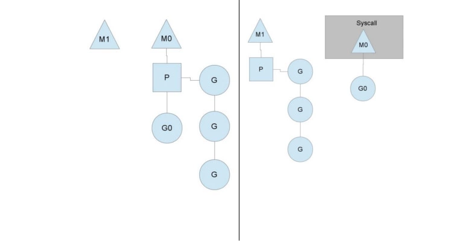


|                 |                                                              |                                               |
| --------------- | ------------------------------------------------------------ | --------------------------------------------- |
| go py协程的区别 | goroutine抢占式任务处理(互斥由channel实现,支持多核), coroutine协作式任务处理(不需要互斥,单核) | goroutineCPU/IO密集都适合,coroutine适合IO密集 |
|                 |                                                              |                                               |
|                 |                                                              |                                               |

# goroutine


[doc](https://mp.weixin.qq.com/s/VBn3A9P52HTEttt1gVFxpA)


# goproxy


```sh
go env -w GOPROXY=https://goproxy.cn,direct
```


```sh
GOPROXY=https://goproxy.io,direct
```


# 折腾破解

 最新！IntelliJ IDEA 2020.3.2 - Mac激活教程（亲测有效）PyCharm、CLion、PhpStorm、GoLand、WebStorm、Rider、DataGrip、Ru...

[](https://www.jianshu.com/u/9e4d5c95a655)

[继粮](https://www.jianshu.com/u/9e4d5c95a655)关注

2021.03.04 20:17:35字数 314阅读 1,130

## 前言

本方法适用于所有平台（Win、Mac、Linux）的 JetBrains 软件（IntelliJIdea、CLion、PhpStorm、GoLand、PyCharm、WebStorm、Rider、DataGrip、RubyMine、AppCode）

**工具地址**：

[蓝凑云](https://links.jianshu.com/go?to=https%3A%2F%2Fouo.io%2Fzn8c3kh)：提取码: 4qpg

[百度云](https://links.jianshu.com/go?to=https%3A%2F%2Fouo.io%2Fg4ntsU)：提取码: rwub

## 一、下载

在 JetBrains 官网下载 IDEA 2020.3.2 版本: 【[传送门](https://links.jianshu.com/go?to=https%3A%2F%2Fouo.io%2FSRG8hV)】

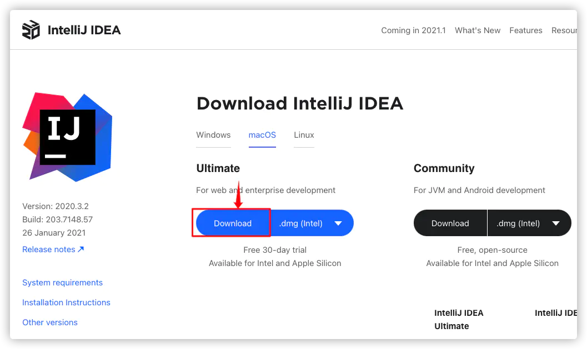

下载.png

## 二、卸载旧版本

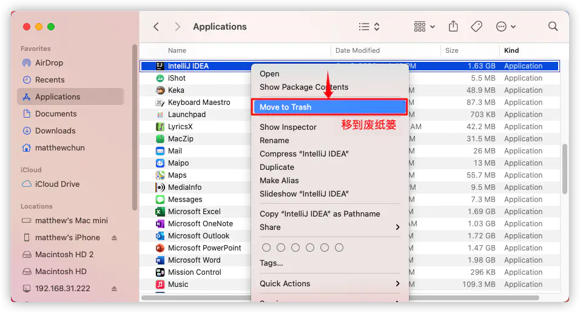

卸载1.png


卸载2.png

## 三、安装

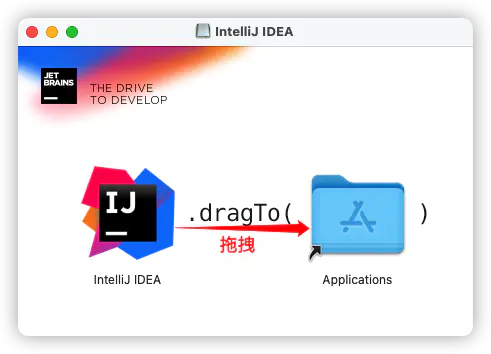

安装.png

## 四、启动激活

### 启动

**第一种情况**：点击试用进入 IDEA

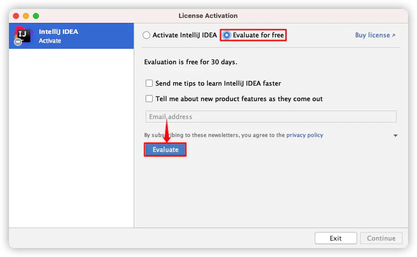

启动1.png

**第二种情况**：提示已过试用期，可以直接点击 OK 进入IDEA；或者使用脚本重置试用期，具体操作在后面

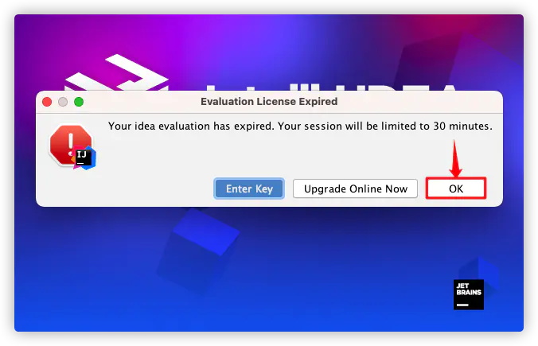

启动2.png

### 激活

打开任意一个工程或文件，把插件 `BetterIntelliJ.zip` 文件拖入到 IDEA 窗口中，注意不要解压`BetterIntelliJ.zip`文件

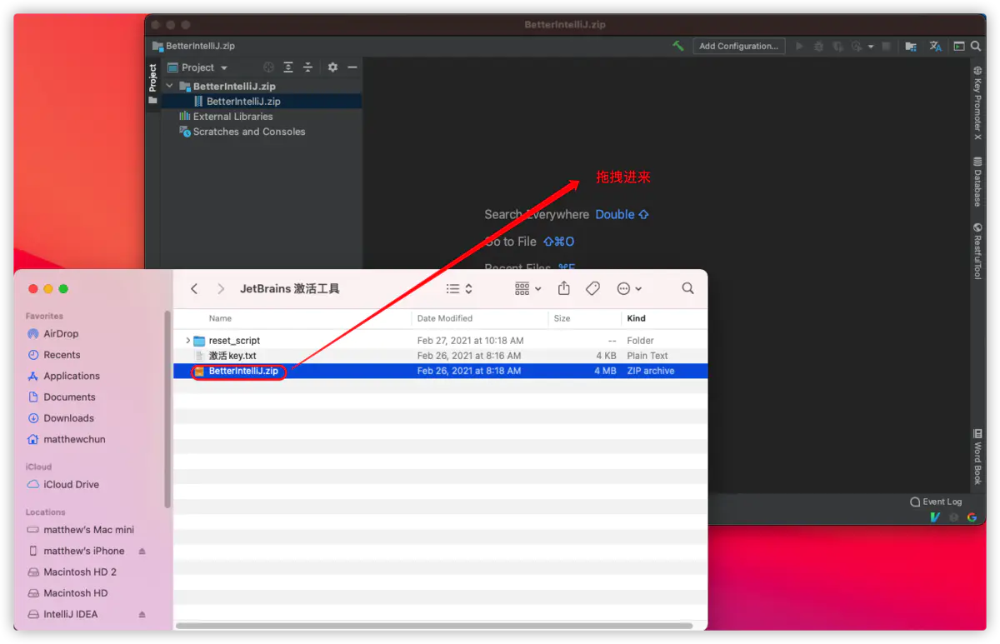

激活1.png


当提示重启 IDE 时，表示插件已经安装成功，此时关闭 idea，重新启动


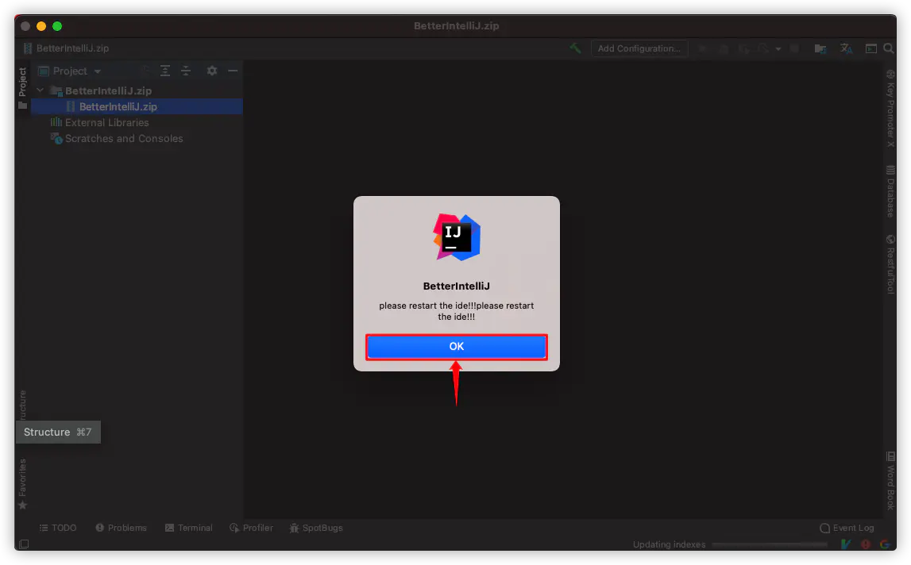

激活2.png

重启后，打开激活界面


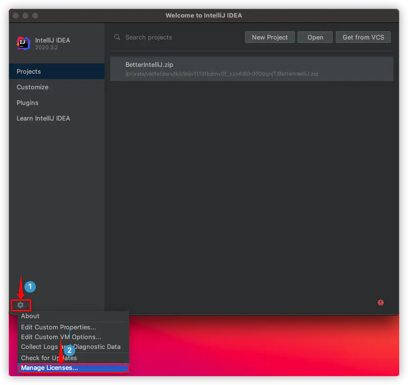

激活3.png

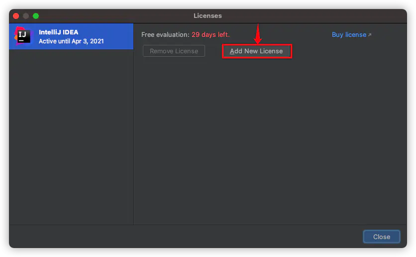

激活4.png

把 `激活key.txt` 文件中的内容复制到激活码输入框中

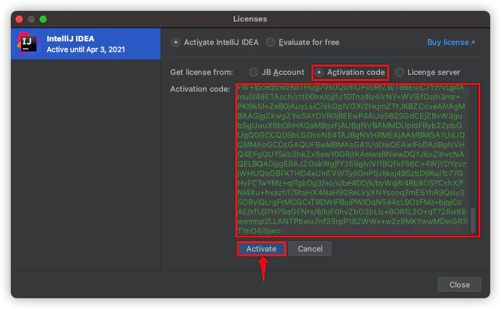

激活5.png

激活成功后，提示有效期至2099年12月31日

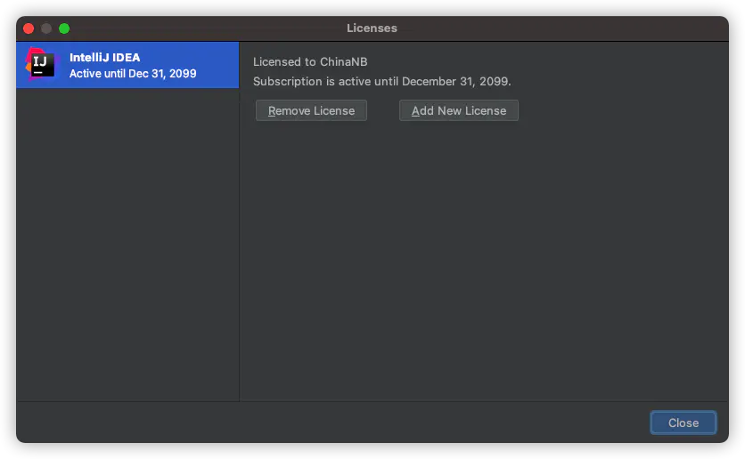

激活6.png

## 五、重置试用期

**window**：执行 `reset_jetbrains_eval_windows.vbs`

**Mac | Linux**：执行 `reset_jetbrains_eval_mac_linux.sh`


```bash
# 首先进入到 “JetBrains 激活工具/reset_script” 目录下
# 给脚本添加执行权限
chmod u+x reset_jetbrains_eval_mac_linux.sh

# 执行脚本,成功后会提示 'done.'
./reset_jetbrains_eval_mac_linux.sh 
```

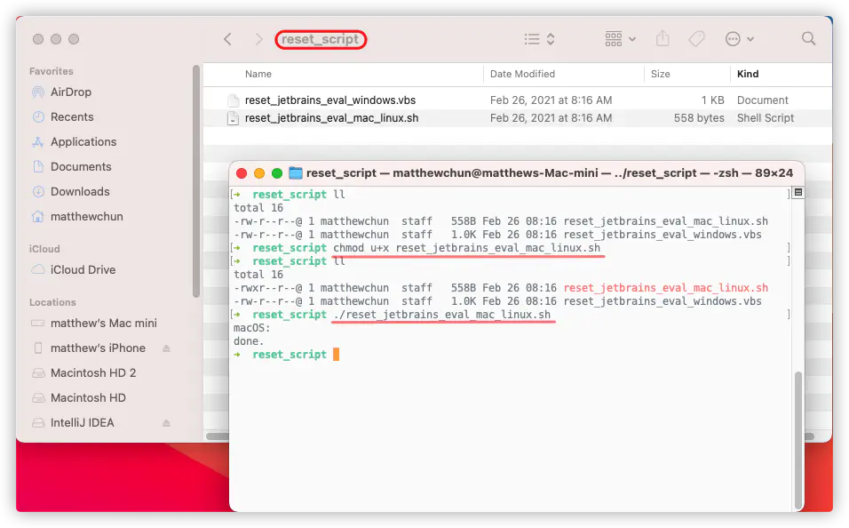

重置试用期.png


# goland 升级1.17后无法配置SDK 

```
goland not a valid home for go sdk golang 1.17
```

edit  `src/runtime/internal/sys/zversion.go`

add new row `const theVersion = 'go1.17'`  

```go
// Code generated by go tool dist; DO NOT EDIT.
package sys
const StackGuardMultiplierDefault = 1
  const theVersion = `go1.17`
```


# 学习Gin

https://gin-gonic.com/zh-cn/docs/examples/html-rendering/

# struct 和 struct pointer


```go
type MyStruct struct {
    Name string
}

func (s MyStruct) SetName1(name string) {
    s.Name = name
}

func (s *MyStruct) SetName2(name string) {
    s.Name = name
}
```

整体有以下几个考虑因素，按重要程度顺序排列：

1. 在使用上的考虑：方法是否需要修改接收器？如果需要，接收器必须是一个指针。
2. 在效率上的考虑：如果接收器很大，比如：一个大的结构体，使用指针接收器会好很多。
3. 在一致性上的考虑：如果类型的某些方法必须有指针接收器，那么其余的方法也应该有指针接收器，所以无论类型如何使用，方法集都是一致的。


# Rust 和 Go


# error的处理

```go
err = yaml.Unmarshal(yamlFile, &resultMap)
```


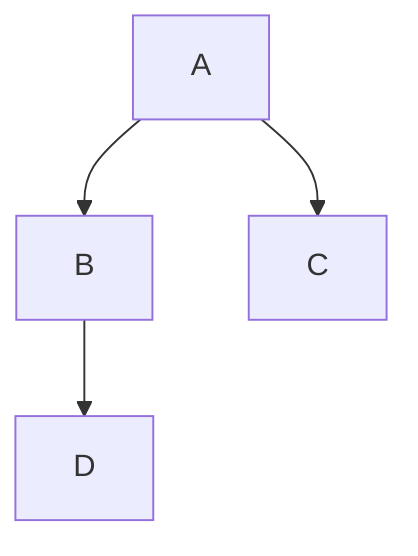
```mermaid
graph TD;
    A-->B;
    A-->C;
    B-->D;
```


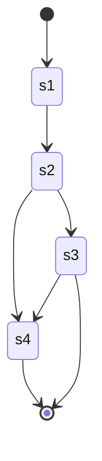
```mermaid
stateDiagram
    [*] --> s1
    s1 --> s2
    s2 --> s4
    s2 --> s3
    s3 --> s4
    s4 --> [*]
    s3 --> [*]
```


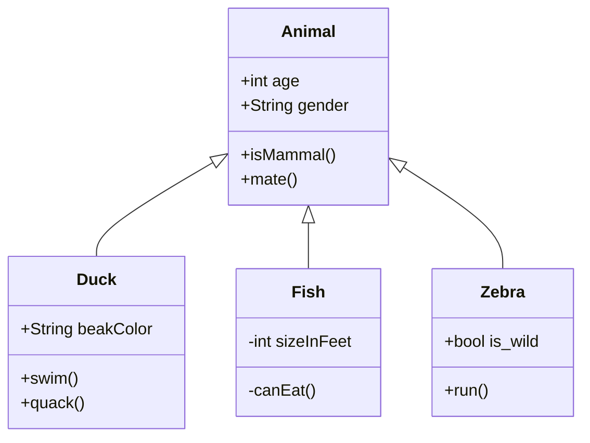
```mermaid
classDiagram
      Animal <|-- Duck
      Animal <|-- Fish
      Animal <|-- Zebra
      Animal : +int age
      Animal : +String gender
      Animal: +isMammal()
      Animal: +mate()
      class Duck{
          +String beakColor
          +swim()
          +quack()
      }
      class Fish{
          -int sizeInFeet
          -canEat()
      }
      class Zebra{
          +bool is_wild
          +run()
      }
```


# git通用配置


```sh
vim .git/info/exclude
```


```
.idea
go.mod
go.sum


```


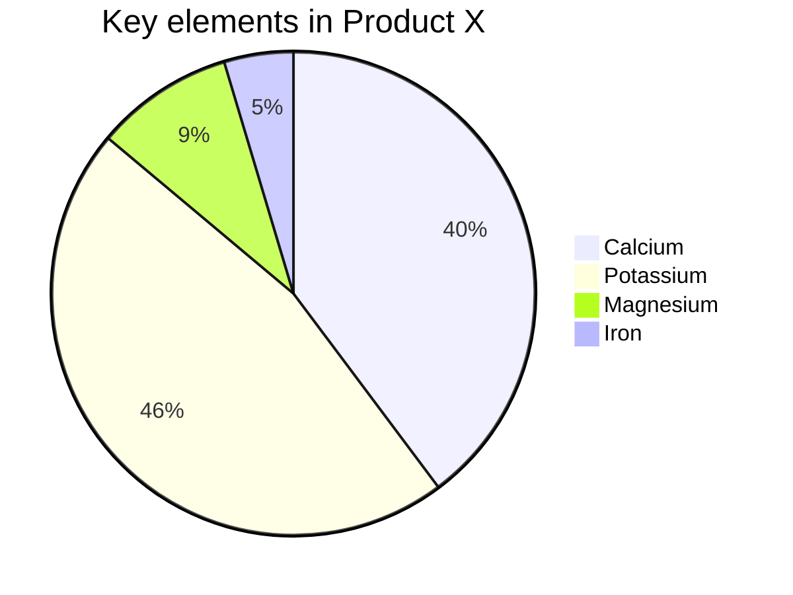
```mermaid
pie
    title Key elements in Product X
    "Calcium" : 42.96
    "Potassium" : 50.05
    "Magnesium" : 10.01
    "Iron" :  5
```


```sequence
Alice->Bob: Hello Bob, how are you?
Note right of Bob: Bob thinks
Bob-->Alice: I am good thanks!
```


## 简介Cobra

[cobra](https://link.juejin.cn?target=http%3A%2F%2Fgithub.com%2Fspf13%2Fcobra)是一个命令行程序库，可以用来编写命令行程序。同时，它也提供了一个脚手架， 用于生成基于 cobra 的应用程序框架。非常多知名的开源项目使用了 cobra 库构建命令行，如[Kubernetes](https://link.juejin.cn?target=http%3A%2F%2Fkubernetes.io%2F)、[Hugo](https://link.juejin.cn?target=http%3A%2F%2Fgohugo.io%2F)、[etcd](https://link.juejin.cn?target=https%3A%2F%2Fgithub.com%2Fcoreos%2Fetcd)等等等等。 本文介绍 cobra 库的基本使用和一些有趣的特性。

## 

作者：傻梦兽
链接：https://juejin.cn/post/7057178581897740319
来源：稀土掘金
著作权归作者所有。商业转载请联系作者获得授权，非商业转载请注明出处。


# 中级go


[傻梦兽](https://juejin.cn/user/2066737588876983)

并发编程肯定要精通…，然后要会linux和一些运维工作，devops有部分是go来编写的。 我司要求就这么点吧，还有会grpc有些业务java处理复杂的事情go实现简单的话丢给go处理完数据，再就回去java那边处理，网络通信处理也要懂 也没什么了


# yaml to json


```

```


#  jwt 认证 [casdoor](https://github.com/casdoor/casdoor)

# 位运算符

[运算符](https://www.runoob.com/go/go-operators.html)


# Go 语言运算符

运算符用于在程序运行时执行数学或逻辑运算。

Go 语言内置的运算符有：

* 算术运算符
* 关系运算符
* 逻辑运算符
* 位运算符
* 赋值运算符
* 其他运算符

接下来让我们来详细看看各个运算符的介绍。

------

## 算术运算符

下表列出了所有Go语言的算术运算符。假定 A 值为 10，B 值为 20。

| 运算符 | 描述 | 实例               |
| :----- | :--- | :----------------- |
| +      | 相加 | A + B 输出结果 30  |
| -      | 相减 | A - B 输出结果 -10 |
| *      | 相乘 | A * B 输出结果 200 |
| /      | 相除 | B / A 输出结果 2   |
| %      | 求余 | B % A 输出结果 0   |
| ++     | 自增 | A++ 输出结果 11    |
| --     | 自减 | A-- 输出结果 9     |

以下实例演示了各个算术运算符的用法：

## 实例

**package** main

**import** "fmt"

func main() {

  **var** a int = 21
  **var** b int = 10
  **var** c int

  c = a + b
  fmt.Printf("第一行 - c 的值为 %d**\n**", c )
  c = a - b
  fmt.Printf("第二行 - c 的值为 %d**\n**", c )
  c = a * b
  fmt.Printf("第三行 - c 的值为 %d**\n**", c )
  c = a / b
  fmt.Printf("第四行 - c 的值为 %d**\n**", c )
  c = a % b
  fmt.Printf("第五行 - c 的值为 %d**\n**", c )
  a++
  fmt.Printf("第六行 - a 的值为 %d**\n**", a )
  a=21  *// 为了方便测试，a 这里重新赋值为 21*
  a--
  fmt.Printf("第七行 - a 的值为 %d**\n**", a )
}

以上实例运行结果：

```
第一行 - c 的值为 31
第二行 - c 的值为 11
第三行 - c 的值为 210
第四行 - c 的值为 2
第五行 - c 的值为 1
第六行 - a 的值为 22
第七行 - a 的值为 20
```

------

## 关系运算符

下表列出了所有Go语言的关系运算符。假定 A 值为 10，B 值为 20。

| 运算符 | 描述                                                         | 实例              |
| :----- | :----------------------------------------------------------- | :---------------- |
| ==     | 检查两个值是否相等，如果相等返回 True 否则返回 False。       | (A == B) 为 False |
| !=     | 检查两个值是否不相等，如果不相等返回 True 否则返回 False。   | (A != B) 为 True  |
| >      | 检查左边值是否大于右边值，如果是返回 True 否则返回 False。   | (A > B) 为 False  |
| <      | 检查左边值是否小于右边值，如果是返回 True 否则返回 False。   | (A < B) 为 True   |
| >=     | 检查左边值是否大于等于右边值，如果是返回 True 否则返回 False。 | (A >= B) 为 False |
| <=     | 检查左边值是否小于等于右边值，如果是返回 True 否则返回 False。 | (A <= B) 为 True  |

以下实例演示了关系运算符的用法：

## 实例

**package** main

**import** "fmt"

func main() {
  **var** a int = 21
  **var** b int = 10

  **if**( a == b ) {
   fmt.Printf("第一行 - a 等于 b**\n**" )
  } **else** {
   fmt.Printf("第一行 - a 不等于 b**\n**" )
  }
  **if** ( a < b ) {
   fmt.Printf("第二行 - a 小于 b**\n**" )
  } **else** {
   fmt.Printf("第二行 - a 不小于 b**\n**" )
  }

  **if** ( a > b ) {
   fmt.Printf("第三行 - a 大于 b**\n**" )
  } **else** {
   fmt.Printf("第三行 - a 不大于 b**\n**" )
  }
  */\* Lets change value of a and b \*/*
  a = 5
  b = 20
  **if** ( a <= b ) {
   fmt.Printf("第四行 - a 小于等于 b**\n**" )
  }
  **if** ( b >= a ) {
   fmt.Printf("第五行 - b 大于等于 a**\n**" )
  }
}

以上实例运行结果：

```
第一行 - a 不等于 b
第二行 - a 不小于 b
第三行 - a 大于 b
第四行 - a 小于等于 b
第五行 - b 大于等于 a
```

------

## 逻辑运算符

下表列出了所有Go语言的逻辑运算符。假定 A 值为 True，B 值为 False。

| 运算符 | 描述                                                         | 实例               |
| :----- | :----------------------------------------------------------- | :----------------- |
| &&     | 逻辑 AND 运算符。 如果两边的操作数都是 True，则条件 True，否则为 False。 | (A && B) 为 False  |
| \|\|   | 逻辑 OR 运算符。 如果两边的操作数有一个 True，则条件 True，否则为 False。 | (A \|\| B) 为 True |
| !      | 逻辑 NOT 运算符。 如果条件为 True，则逻辑 NOT 条件 False，否则为 True。 | !(A && B) 为 True  |

以下实例演示了逻辑运算符的用法：

## 实例

**package** main

**import** "fmt"

func main() {
  **var** a bool = **true**
  **var** b bool = **false**
  **if** ( a && b ) {
   fmt.Printf("第一行 - 条件为 true**\n**" )
  }
  **if** ( a || b ) {
   fmt.Printf("第二行 - 条件为 true**\n**" )
  }
  */\* 修改 a 和 b 的值 \*/*
  a = **false**
  b = **true**
  **if** ( a && b ) {
   fmt.Printf("第三行 - 条件为 true**\n**" )
  } **else** {
   fmt.Printf("第三行 - 条件为 false**\n**" )
  }
  **if** ( !(a && b) ) {
   fmt.Printf("第四行 - 条件为 true**\n**" )
  }
}

以上实例运行结果：

```
第二行 - 条件为 true
第三行 - 条件为 false
第四行 - 条件为 true
```

------

## 位运算符

位运算符对整数在内存中的二进制位进行操作。

下表列出了位运算符 &, |, 和 ^ 的计算：

| p    | q    | p & q | p \| q | p ^ q |
| :--- | :--- | :---- | :----- | :---- |
| 0    | 0    | 0     | 0      | 0     |
| 0    | 1    | 0     | 1      | 1     |
| 1    | 1    | 1     | 1      | 0     |
| 1    | 0    | 0     | 1      | 1     |

假定 A = 60; B = 13; 其二进制数转换为：

```
A = 0011 1100

B = 0000 1101

-----------------

A&B = 0000 1100

A|B = 0011 1101

A^B = 0011 0001
```


Go 语言支持的位运算符如下表所示。假定 A 为60，B 为13：

| 运算符 | 描述                                                         | 实例                                   |
| :----- | :----------------------------------------------------------- | :------------------------------------- |
| &      | 按位与运算符"&"是双目运算符。 其功能是参与运算的两数各对应的二进位相与。 | (A & B) 结果为 12, 二进制为 0000 1100  |
| \|     | 按位或运算符"\|"是双目运算符。 其功能是参与运算的两数各对应的二进位相或 | (A \| B) 结果为 61, 二进制为 0011 1101 |
| ^      | 按位异或运算符"^"是双目运算符。 其功能是参与运算的两数各对应的二进位相异或，当两对应的二进位相异时，结果为1。 | (A ^ B) 结果为 49, 二进制为 0011 0001  |
| <<     | 左移运算符"<<"是双目运算符。左移n位就是乘以2的n次方。 其功能把"<<"左边的运算数的各二进位全部左移若干位，由"<<"右边的数指定移动的位数，高位丢弃，低位补0。 | A << 2 结果为 240 ，二进制为 1111 0000 |
| >>     | 右移运算符">>"是双目运算符。右移n位就是除以2的n次方。 其功能是把">>"左边的运算数的各二进位全部右移若干位，">>"右边的数指定移动的位数。 | A >> 2 结果为 15 ，二进制为 0000 1111  |

以下实例演示了位运算符的用法：

## 实例

**package** main

**import** "fmt"

func main() {

  **var** a uint = 60   */\* 60 = 0011 1100 \*/* 
  **var** b uint = 13   */\* 13 = 0000 1101 \*/*
  **var** c uint = 0      

  c = a & b    */\* 12 = 0000 1100 \*/*
  fmt.Printf("第一行 - c 的值为 %d**\n**", c )

  c = a | b    */\* 61 = 0011 1101 \*/*
  fmt.Printf("第二行 - c 的值为 %d**\n**", c )

  c = a ^ b    */\* 49 = 0011 0001 \*/*
  fmt.Printf("第三行 - c 的值为 %d**\n**", c )

  c = a << 2   */\* 240 = 1111 0000 \*/*
  fmt.Printf("第四行 - c 的值为 %d**\n**", c )

  c = a >> 2   */\* 15 = 0000 1111 \*/*
  fmt.Printf("第五行 - c 的值为 %d**\n**", c )
}

以上实例运行结果：

```
第一行 - c 的值为 12
第二行 - c 的值为 61
第三行 - c 的值为 49
第四行 - c 的值为 240
第五行 - c 的值为 15
```

------

## 赋值运算符

下表列出了所有Go语言的赋值运算符。

| 运算符 | 描述                                           | 实例                                  |
| :----- | :--------------------------------------------- | :------------------------------------ |
| =      | 简单的赋值运算符，将一个表达式的值赋给一个左值 | C = A + B 将 A + B 表达式结果赋值给 C |
| +=     | 相加后再赋值                                   | C += A 等于 C = C + A                 |
| -=     | 相减后再赋值                                   | C -= A 等于 C = C - A                 |
| *=     | 相乘后再赋值                                   | C *= A 等于 C = C * A                 |
| /=     | 相除后再赋值                                   | C /= A 等于 C = C / A                 |
| %=     | 求余后再赋值                                   | C %= A 等于 C = C % A                 |
| <<=    | 左移后赋值                                     | C <<= 2 等于 C = C << 2               |
| >>=    | 右移后赋值                                     | C >>= 2 等于 C = C >> 2               |
| &=     | 按位与后赋值                                   | C &= 2 等于 C = C & 2                 |
| ^=     | 按位异或后赋值                                 | C ^= 2 等于 C = C ^ 2                 |
| \|=    | 按位或后赋值                                   | C \|= 2 等于 C = C \| 2               |

以下实例演示了赋值运算符的用法：

## 实例

**package** main

**import** "fmt"

func main() {
  **var** a int = 21
  **var** c int

  c = a
  fmt.Printf("第 1 行 - =  运算符实例，c 值为 = %d**\n**", c )

  c += a
  fmt.Printf("第 2 行 - += 运算符实例，c 值为 = %d**\n**", c )

  c -= a
  fmt.Printf("第 3 行 - -= 运算符实例，c 值为 = %d**\n**", c )

  c *= a
  fmt.Printf("第 4 行 - *= 运算符实例，c 值为 = %d**\n**", c )

  c /= a
  fmt.Printf("第 5 行 - /= 运算符实例，c 值为 = %d**\n**", c )

  c  = 200;

  c <<= 2
  fmt.Printf("第 6行  - <<= 运算符实例，c 值为 = %d**\n**", c )

  c >>= 2
  fmt.Printf("第 7 行 - >>= 运算符实例，c 值为 = %d**\n**", c )

  c &= 2
  fmt.Printf("第 8 行 - &= 运算符实例，c 值为 = %d**\n**", c )

  c ^= 2
  fmt.Printf("第 9 行 - ^= 运算符实例，c 值为 = %d**\n**", c )

  c |= 2
  fmt.Printf("第 10 行 - |= 运算符实例，c 值为 = %d**\n**", c )

}

以上实例运行结果：

```
第 1 行 - =  运算符实例，c 值为 = 21
第 2 行 - += 运算符实例，c 值为 = 42
第 3 行 - -= 运算符实例，c 值为 = 21
第 4 行 - *= 运算符实例，c 值为 = 441
第 5 行 - /= 运算符实例，c 值为 = 21
第 6行  - <<= 运算符实例，c 值为 = 800
第 7 行 - >>= 运算符实例，c 值为 = 200
第 8 行 - &= 运算符实例，c 值为 = 0
第 9 行 - ^= 运算符实例，c 值为 = 2
第 10 行 - |= 运算符实例，c 值为 = 2
```

------

## 其他运算符

下表列出了Go语言的其他运算符。

| 运算符 | 描述             | 实例                       |
| :----- | :--------------- | :------------------------- |
| &      | 返回变量存储地址 | &a; 将给出变量的实际地址。 |
| *      | 指针变量。       | *a; 是一个指针变量         |

以下实例演示了其他运算符的用法：

## 实例

**package** main

**import** "fmt"

func main() {
  **var** a int = 4
  **var** b int32
  **var** c float32
  **var** ptr *int

  */\* 运算符实例 \*/*
  fmt.Printf("第 1 行 - a 变量类型为 = %T**\n**", a );
  fmt.Printf("第 2 行 - b 变量类型为 = %T**\n**", b );
  fmt.Printf("第 3 行 - c 变量类型为 = %T**\n**", c );

  */\*  & 和 \* 运算符实例 \*/*
  ptr = &a   */\* 'ptr' 包含了 'a' 变量的地址 \*/*
  fmt.Printf("a 的值为  %d**\n**", a);
  fmt.Printf("*ptr 为 %d**\n**", *ptr);
}

以上实例运行结果：

```
第 1 行 - a 变量类型为 = int
第 2 行 - b 变量类型为 = int32
第 3 行 - c 变量类型为 = float32
a 的值为  4
*ptr 为 4
```

------

## 运算符优先级

有些运算符拥有较高的优先级，二元运算符的运算方向均是从左至右。下表列出了所有运算符以及它们的优先级，由上至下代表优先级由高到低：

| 优先级 | 运算符           |
| :----- | :--------------- |
| 5      | * / % << >> & &^ |
| 4      | + - \| ^         |
| 3      | == != < <= > >=  |
| 2      | &&               |
| 1      | \|\|             |

当然，你可以通过使用括号来临时提升某个表达式的整体运算优先级。

以上实例运行结果：

## 实例

**package** main

**import** "fmt"

func main() {
  **var** a int = 20
  **var** b int = 10
  **var** c int = 15
  **var** d int = 5
  **var** e int;

  e = (a + b) * c / d;    *// ( 30 \* 15 ) / 5*
  fmt.Printf("(a + b) * c / d 的值为 : %d**\n**", e );

  e = ((a + b) * c) / d;   *// (30 \* 15 ) / 5*
  fmt.Printf("((a + b) * c) / d 的值为  : %d**\n**" , e );

  e = (a + b) * (c / d);  *// (30) \* (15/5)*
  fmt.Printf("(a + b) * (c / d) 的值为  : %d**\n**", e );

  e = a + (b * c) / d;   *//  20 + (150/5)*
  fmt.Printf("a + (b * c) / d 的值为  : %d**\n**" , e ); 
}

以上实例运行结果：

```
(a + b) * c / d 的值为 : 90
((a + b) * c) / d 的值为  : 90
(a + b) * (c / d) 的值为  : 90
a + (b * c) / d 的值为  : 50
```


# beego


```
exec: "go": executable file not found in $PATH异常的原因

```


runmode=prod


```
bee pack
```


# beego阿里云SLB健康检查失败, 做Head方法

**健康检查失败导致网站无法访问怎么办？**

如果使用SLB，请在健康检查URL的controller中接受**head**请求，否则可能会导致健康检查失败，网站无法访问。

```go
package controllers

import (
  "github.com/astaxie/beego"
)

type MainController struct {
  beego.Controller
}

func (c *MainController) Get() {
  c.Data["Website"] = "beego.me"
  c.Data["Email"] = "astaxie@gmail.com"
  c.TplName = "index.tpl"
}


func (c *MainController) Head() {
  c.Ctx.Output.Body([]byte(""))
}
```


# init()

​	

```go
package main

import (
    "fmt"
    "time"
)

func init() {
    fmt.Println("init will be before hello world")
}

func main() {
    fmt.Println("hello world")
    fmt.Println("today times:" + time.Now().String())
}

```


# [reflect](https://segmentfault.com/a/1190000021401057)

> - value
> - type
>   - static
>   - concrete


**concrete type 比如interface{}需要反射**


- 判断类型

  - ```go
    reflect.TypeOf(i)
    reflect.ValueOf(i)
    ```


```go
package main

import (
    "fmt"
    "reflect"
)

func main() {
    var i int = 233
    
    p := reflect.ValueOf(&i)
    v := reflect.ValueOf(i)

    cp := p.Interface().(*int)
    cv := v.Interface().(int)

    fmt.Println(cp, cv)
}

// output
// 0xc000016070 233
```


# 并发,协程和信道


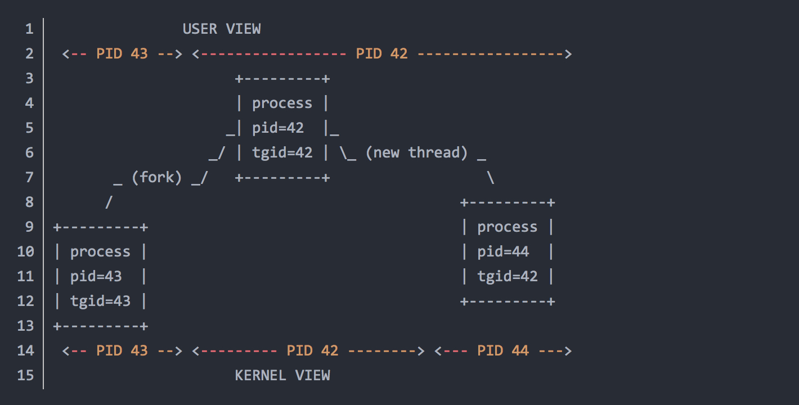


# [学习](https://goa.lenggirl.com/#/golang/README)

```sh
# 拉镜像
docker pull hunterhug/gotourzh

# 后台运行
docker run -d -p 9999:9999 hunterhug/gotourzh
```


# go [fuzzing](https://mp.weixin.qq.com/s/XBW-x8GvUNwJOm92XaYw_A)


> 特别说明：这个真的不是标题党，我写代码20+年，真心认为 `go fuzzing` 是我见过的最牛逼的代码自测方法。我在用 `AC自动机` 算法改进关键字过滤效率（提升~50%），改进 `mapreduce` 对 `panic` 的处理机制的时候，都通过 `go fuzzing` 发现了极端边缘情况的 bug。所以深深的认为，这是我见过最牛逼的代码自测方法，没有之一！
>
> `go fuzzing` 至今已经发现了代码质量极高的 `Go` 标准库超过200个bug，见：https://github.com/dvyukov/go-fuzz#trophies

春节程序员之间的祝福经常是，祝你代码永无 bug！虽然调侃，但对我们每个程序员来说，每天都在写 bug，这是事实。代码没 bug 这事，只能证伪，不能证明。即将发布的 Go 1.18 官方提供了一个帮助我们证伪的绝佳工具 - `go fuzzing`。

Go 1.18 大家最关注的是泛型，然而我真的觉得 `go fuzzing` 真的是 Go 1.18 最有用的功能，没有之一！

本文我们就来详细看看 `go fuzzing：`

* 是什么？
* 怎么用？
* 有何最佳实践？

> 首先，你需要升级到 Go 1.18
>
> Go 1.18 虽然还未正式发布，但你可以下载 RC 版本，而且即使你生产用 Go 更早版本，你也可以开发环境使用 go fuzzing 寻找 bug

## go fuzzing 是什么

根据 官方文档 介绍，`go fuzzing` 是通过持续给一个程序不同的输入来自动化测试，并通过分析代码覆盖率来智能的寻找失败的 case。这种方法可以尽可能的寻找到一些边缘 case，亲测确实发现的都是些平时很难发现的问题。


## go fuzzing 怎么用

官方介绍写 fuzz tests 的一些规则：

* 函数必须是 Fuzz开头，唯一的参数是 `*testing.F`，没有返回值

* Fuzz tests 必须在 `*_test.go` 的文件里

* 上图中的 `fuzz target` 是个方法调用 `(*testing.F).Fuzz`，第一个参数是 `*testing.T`，然后就是称之为 `fuzzing arguments` 的参数，没有返回值

* 每个 `fuzz test` 里只能有一个 `fuzz target`

* 调用 `f.Add(…)` 的时候需要参数类型跟 `fuzzing arguments` 顺序和类型都一致

* `fuzzing arguments` 只支持以下类型：

* * `string`, `[]byte`
  * `int`, `int8`, `int16`, `int32`/`rune`, `int64`
  * `uint`, `uint8`/`byte`, `uint16`, `uint32`, `uint64`
  * `float32`, `float64`
  * `bool`

* `fuzz target` 不要依赖全局状态，会并行跑。

### 运行 `fuzzing tests`

如果我写了一个 `fuzzing test`，比如：

```
// 具体代码见 https://github.com/zeromicro/go-zero/blob/master/core/mr/mapreduce_fuzz_test.go
func FuzzMapReduce(f *testing.F) {
  ...
}
```

那么我们可以这样执行：

```
go test -fuzz=MapReduce
```

我们会得到类似如下结果：

```
fuzz: elapsed: 0s, gathering baseline coverage: 0/2 completed
fuzz: elapsed: 0s, gathering baseline coverage: 2/2 completed, now fuzzing with 10 workers
fuzz: elapsed: 3s, execs: 3338 (1112/sec), new interesting: 56 (total: 57)
fuzz: elapsed: 6s, execs: 6770 (1144/sec), new interesting: 62 (total: 63)
fuzz: elapsed: 9s, execs: 10157 (1129/sec), new interesting: 69 (total: 70)
fuzz: elapsed: 12s, execs: 13586 (1143/sec), new interesting: 72 (total: 73)
^Cfuzz: elapsed: 13s, execs: 14031 (1084/sec), new interesting: 72 (total: 73)
PASS
ok    github.com/zeromicro/go-zero/core/mr  13.169s
```

其中的 `^C` 是我按了 `ctrl-C` 终止了测试，详细解释参考官方文档。

## go-zero 的最佳实践

按照我使用下来的经验总结，我把最佳实践初步总结为以下四步：

1. 定义 `fuzzing arguments`，首先要想明白怎么定义 `fuzzing arguments`，并通过给定的 `fuzzing arguments` 写 `fuzzing target`
2. 思考 `fuzzing target` 怎么写，这里的重点是怎么验证结果的正确性，因为 `fuzzing arguments` 是“随机”给的，所以要有个通用的结果验证方法
3. 思考遇到失败的 case 如何打印结果，便于生成新的 `unit test`
4. 根据失败的 `fuzzing test` 打印结果编写新的 `unit test，这个新的 `unit test`会被用来调试解决`fuzzing test`发现的问题，并固化下来留给`CI` 用`

接下来我们以一个最简单的数组求和函数来展示一下上述步骤，go-zero 的实际案例略显复杂，文末我会给出 go-zero 内部落地案例，供大家参考复杂场景写法。

这是一个注入了 bug 的求和的代码实现：

```
func Sum(vals []int64) int64 {
  var total int64

  for _, val := range vals {
    if val%1e5 != 0 {
      total += val
    }
  }

  return total
}
```

### 1. 定义 `fuzzing arguments`

你至少需要给出一个 `fuzzing argument`，不然 `go fuzzing` 没法生成测试代码，所以即使我们没有很好的输入，我们也需要定义一个对结果产生影响的 `fuzzing argument`，这里我们就用 slice 元素个数作为 `fuzzing arguments`，然后 `Go fuzzing` 会根据跑出来的 `code coverage` 自动生成不同的参数来模拟测试。

```
func FuzzSum(f *testing.F) {
  f.Add(10)
  f.Fuzz(func(t *testing.T, n int) {
    n %= 20
    ...
  })
}
```

这里的 `n` 就是让 `go fuzzing` 来模拟 slice 元素个数，为了保证元素个数不会太多，我们限制在20以内（0个也没问题），并且我们添加了一个值为10的语料（`go fuzzing` 里面称之为 `corpus`），这个值就是让 `go fuzzing` 冷启动的一个值，具体为多少不重要。

### 2. 怎么写 `fuzzing target`

这一步的重点是如何编写可验证的 `fuzzing target`，根据给定的 `fuzzing arguments` 写出测试代码的同时，还需要生成验证结果正确性用的数据。

对我们这个 `Sum` 函数来说，其实还是比较简单的，就是随机生成 `n` 个元素的 slice，然后求和算出期望的结果。如下：

```
func FuzzSum(f *testing.F) {
  rand.Seed(time.Now().UnixNano())

  f.Add(10)
  f.Fuzz(func(t *testing.T, n int) {
    n %= 20
    var vals []int64
    var expect int64
    for i := 0; i < n; i++ {
      val := rand.Int63() % 1e6
      vals = append(vals, val)
      expect += val
    }

    assert.Equal(t, expect, Sum(vals))
  })
}
```

这段代码还是很容易理解的，自己求和和 `Sum` 求和做比较而已，就不详细解释了。但复杂场景你就需要仔细想想怎么写验证代码了，不过这不会太难，太难的话，可能是对测试函数没有足够理解或者简化。

此时就可以用如下命令跑 `fuzzing tests` 了，结果类似如下：

```
$ go test -fuzz=Sum
fuzz: elapsed: 0s, gathering baseline coverage: 0/2 completed
fuzz: elapsed: 0s, gathering baseline coverage: 2/2 completed, now fuzzing with 10 workers
fuzz: elapsed: 0s, execs: 6672 (33646/sec), new interesting: 7 (total: 6)
--- FAIL: FuzzSum (0.21s)
    --- FAIL: FuzzSum (0.00s)
        sum_fuzz_test.go:34:
              Error Trace:  sum_fuzz_test.go:34
                                  value.go:556
                                  value.go:339
                                  fuzz.go:334
              Error:        Not equal:
                            expected: 8736932
                            actual  : 8636932
              Test:         FuzzSum

    Failing input written to testdata/fuzz/FuzzSum/739002313aceff0ff5ef993030bbde9115541cabee2554e6c9f3faaf581f2004
    To re-run:
    go test -run=FuzzSum/739002313aceff0ff5ef993030bbde9115541cabee2554e6c9f3faaf581f2004
FAIL
exit status 1
FAIL  github.com/kevwan/fuzzing  0.614s
```

那么问题来了！我们看到了结果不对，但是我们很难去分析为啥不对，你仔细品品，上面这段输出，你怎么分析？

### 3. 失败 case 如何打印输入

对于上面失败的测试，我们如果能打印出输入，然后形成一个简单的测试用例，那我们就可以直接调试了。打印出来的输入最好能够直接 `copy/paste` 到新的测试用例里，如果格式不对，对于那么多行的输入，你需要一行一行调格式就太累了，而且这未必就只有一个失败的 case。

所以我们把代码改成了下面这样：

```
func FuzzSum(f *testing.F) {
  rand.Seed(time.Now().UnixNano())

  f.Add(10)
  f.Fuzz(func(t *testing.T, n int) {
    n %= 20
    var vals []int64
    var expect int64
    var buf strings.Builder
    buf.WriteString("\n")
    for i := 0; i < n; i++ {
      val := rand.Int63() % 1e6
      vals = append(vals, val)
      expect += val
      buf.WriteString(fmt.Sprintf("%d,\n", val))
    }

    assert.Equal(t, expect, Sum(vals), buf.String())
  })
}
```

再跑命令，得到如下结果：

```
$ go test -fuzz=Sum
fuzz: elapsed: 0s, gathering baseline coverage: 0/2 completed
fuzz: elapsed: 0s, gathering baseline coverage: 2/2 completed, now fuzzing with 10 workers
fuzz: elapsed: 0s, execs: 1402 (10028/sec), new interesting: 10 (total: 8)
--- FAIL: FuzzSum (0.16s)
    --- FAIL: FuzzSum (0.00s)
        sum_fuzz_test.go:34:
              Error Trace:  sum_fuzz_test.go:34
                                  value.go:556
                                  value.go:339
                                  fuzz.go:334
              Error:        Not equal:
                            expected: 5823336
                            actual  : 5623336
              Test:         FuzzSum
              Messages:
                            799023,
                            110387,
                            811082,
                            115543,
                            859422,
                            997646,
                            200000,
                            399008,
                            7905,
                            931332,
                            591988,

    Failing input written to testdata/fuzz/FuzzSum/26d024acf85aae88f3291bf7e1c6f473eab8b051f2adb1bf05d4491bc49f5767
    To re-run:
    go test -run=FuzzSum/26d024acf85aae88f3291bf7e1c6f473eab8b051f2adb1bf05d4491bc49f5767
FAIL
exit status 1
FAIL  github.com/kevwan/fuzzing  0.602s
```

### 4. 编写新的测试用例

根据上面的失败 case 的输出，我们可以 `copy/paste` 生成如下代码，当然框架是自己写的，输入参数可以直接拷贝进去。

```
func TestSumFuzzCase1(t *testing.T) {
  vals := []int64{
    799023,
    110387,
    811082,
    115543,
    859422,
    997646,
    200000,
    399008,
    7905,
    931332,
    591988,
  }
  assert.Equal(t, int64(5823336), Sum(vals))
}
```

这样我们就可以很方便的调试了，并且能够增加一个有效 `unit test`，确保这个 bug 再也不会出现了。

## `go fuzzing` 更多经验

### Go 版本问题

我相信，Go 1.18 发布了，大多数项目线上代码不会立马升级到 1.18 的，那么 `go fuzzing` 引入的 `testing.F` 不能使用怎么办？

线上（go.mod）不升级到 Go 1.18，但是我们本机是完全推荐升级的，那么这时我们只需要把上面的 `FuzzSum` 放到一个文件名类似 `sum_fuzz_test.go` 的文件里，然后在文件头加上如下指令即可：

```
//go:build go1.18
// +build go1.18
```

> 注意：第三行必须是一个空行，否则就会变成 `package` 的注释了。

这样我们在线上不管用哪个版本就不会报错了，而我们跑 `fuzz testing` 一般都是本机跑的，不受影响。

### go fuzzing 不能复现的失败

上面讲的步骤是针对简单情况的，但有时根据失败 case 得到的输入形成新的 `unit test` 并不能复现问题时（特别是有 goroutine 死锁问题），问题就变得复杂起来了，如下输出你感受一下：

```
go test -fuzz=MapReduce
fuzz: elapsed: 0s, gathering baseline coverage: 0/2 completed
fuzz: elapsed: 0s, gathering baseline coverage: 2/2 completed, now fuzzing with 10 workers
fuzz: elapsed: 3s, execs: 3681 (1227/sec), new interesting: 54 (total: 55)
...
fuzz: elapsed: 1m21s, execs: 92705 (1101/sec), new interesting: 85 (total: 86)
--- FAIL: FuzzMapReduce (80.96s)
    fuzzing process hung or terminated unexpectedly: exit status 2
    Failing input written to testdata/fuzz/FuzzMapReduce/ee6a61e8c968adad2e629fba11984532cac5d177c4899d3e0b7c2949a0a3d840
    To re-run:
    go test -run=FuzzMapReduce/ee6a61e8c968adad2e629fba11984532cac5d177c4899d3e0b7c2949a0a3d840
FAIL
exit status 1
FAIL  github.com/zeromicro/go-zero/core/mr  81.471s
```

这种情况下，只是告诉我们 `fuzzing process` 卡住了或者不正常结束了，状态码是2。这种情况下，一般 `re-run` 是不会复现的。为什么只是简单的返回错误码2呢？我仔细去看了 `go fuzzing` 的源码，每个 `fuzzing test` 都是一个单独的进程跑的，然后 `go fuzzing` 把模糊测试的进程输出扔掉了，只是显示了状态码。那么我们如何解决这个问题呢？

我仔细分析了之后，决定自己来写一个类似 `fuzzing test` 的常规单元测试代码，这样就可以保证失败是在同一个进程内，并且会把错误信息打印到标准输出，代码大致如下：

```
func TestSumFuzzRandom(t *testing.T) {
  const times = 100000
  rand.Seed(time.Now().UnixNano())

  for i := 0; i < times; i++ {
    n := rand.Intn(20)
    var vals []int64
    var expect int64
    var buf strings.Builder
    buf.WriteString("\n")
    for i := 0; i < n; i++ {
      val := rand.Int63() % 1e6
      vals = append(vals, val)
      expect += val
      buf.WriteString(fmt.Sprintf("%d,\n", val))
    }

    assert.Equal(t, expect, Sum(vals), buf.String())
  }
}
```

这样我们就可以自己来简单模拟一下 `go fuzzing`，但是任何错误我们可以得到清晰的输出。这里或许我没研究透 `go fuzzing`，或者还有其它方法可以控制，如果你知道，感谢告诉我一声。

但这种需要跑很长时间的模拟 case，我们不会希望它在 CI 时每次都被执行，所以我把它放在一个单独的文件里，文件名类似 `sum_fuzzcase_test.go`，并在文件头加上了如下指令：

```
//go:build fuzz
// +build fuzz
```

这样我们需要跑这个模拟 case 的时候加上 `-tags fuzz` 即可，比如：

```
go test -tags fuzz ./...
```

## 复杂用法示例

上面介绍的是一个示例，还是比较简单的，如果遇到复杂场景不知道怎么写，可以先看看  go-zero 是如何落地 `go fuzzing` 的，如下所示：

* MapReduce - https://github.com/zeromicro/go-zero/tree/master/core/mr

* * 模糊测试了 **死锁** 和 **goroutine leak**，特别是 `chan + goroutine` 的复杂场景可以借鉴

* stringx - https://github.com/zeromicro/go-zero/tree/master/core/stringx

* * 模糊测试了常规的算法实现，对于算法类场景可以借鉴


欢迎加 star：https://github.com/zeromicro/go-zero


------

**推荐阅读**

* [Go 1.18新特性前瞻：原生支持Fuzzing测试](http://mp.weixin.qq.com/s?__biz=MzAxMTA4Njc0OQ==&mid=2651451747&idx=3&sn=a282a6bc9eca55178d0d8a06c919d9f0&chksm=80bb2f91b7cca6873f2c5341834607ae9c5f622ba541e917ec8cf7572e980b5f6e507929a3d5&scene=21#wechat_redirect)


# jsoniter

```
// github.com/gin-gonic/gin@v1.6.3/internal/json/jsoniter.go
// +build jsoniter
package json
import "github.com/json-iterator/go"
var (
    json = jsoniter.ConfigCompatibleWithStandardLibrary
    // Marshal is exported by gin/json package.
    Marshal = json.Marshal
    // Unmarshal is exported by gin/json package.
    Unmarshal = json.Unmarshal
    // MarshalIndent is exported by gin/json package.
    MarshalIndent = json.MarshalIndent
    // NewDecoder is exported by gin/json package.
    NewDecoder = json.NewDecoder
    // NewEncoder is exported by gin/json package.
    NewEncoder = json.NewEncoder
)
```


# gorm/orm

```

```


# go1.8 兼容性


# Go 1.18 兼容 1.17


Go 的新版本如期而至，然而，问题终于也如期而至：


```go
# golang.org/x/sys/unix
/Users/x/go/pkg/mod/golang.org/x/sys@v0.0.0-20200930185726-fdedc70b468f/unix/syscall_darwin.1_13.go:29:3: //go:linkname must refer to declared function or variable
/Users/x/go/pkg/mod/golang.org/x/sys@v0.0.0-20200930185726-fdedc70b468f/unix/zsyscall_darwin_amd64.1_13.go:27:3: //go:linkname must refer to declared function or variable
/Users/x/go/pkg/mod/golang.org/x/sys@v0.0.0-20200930185726-fdedc70b468f/unix/zsyscall_darwin_amd64.1_13.go:40:3: //go:linkname must refer to declared function or variable
/Users/x/go/pkg/mod/golang.org/x/sys@v0.0.0-20200930185726-fdedc70b468f/unix/zsyscall_darwin_amd64.go:28:3: //go:linkname must refer to declared function or variable
/Users/x/go/pkg/mod/golang.org/x/sys@v0.0.0-20200930185726-fdedc70b468f/unix/zsyscall_darwin_amd64.go:43:3: //go:linkname must refer to declared function or variable
/Users/x/go/pkg/mod/golang.org/x/sys@v0.0.0-20200930185726-fdedc70b468f/unix/zsyscall_darwin_amd64.go:59:3: //go:linkname must refer to declared function or variable
/Users/x/go/pkg/mod/golang.org/x/sys@v0.0.0-20200930185726-fdedc70b468f/unix/zsyscall_darwin_amd64.go:75:3: //go:linkname must refer to declared function or variable
/Users/x/go/pkg/mod/golang.org/x/sys@v0.0.0-20200930185726-fdedc70b468f/unix/zsyscall_darwin_amd64.go:90:3: //go:linkname must refer to declared function or variable
/Users/x/go/pkg/mod/golang.org/x/sys@v0.0.0-20200930185726-fdedc70b468f/unix/zsyscall_darwin_amd64.go:105:3: //go:linkname must refer to declared function or variable
/Users/x/go/pkg/mod/golang.org/x/sys@v0.0.0-20200930185726-fdedc70b468f/unix/zsyscall_darwin_amd64.go:121:3: //go:linkname must refer to declared function or variable
/Users/x/go/pkg/mod/golang.org/x/sys@v0.0.0-20200930185726-fdedc70b468f/unix/zsyscall_darwin_amd64.go:121:3: too many errors
```

遇到问题不要慌，Google 一下，答案就在 [Stack Overflow](https://stackoverflow.com/questions/71507321/go-1-18-build-error-on-mac-unix-syscall-darwin-1-13-go253-golinkname-mus) 里。

链接打不开？算了，我直接告诉你吧。


```csharp
go get -u golang.org/x/sys
```

执行完，问题就解决了。


# 作为Gopher，你知道Go的注释即文档应该怎么写吗？

开发者**.腾讯云官方社区公众号，汇聚技术开发者群体，分享技术干货，打造技术影响力交流社区。](https://mp.weixin.qq.com/s/nAeZIEyKkhE6_kId_yRS-g#)

导语 | Go一直奉行“注释即文档”的概念，在代码中针对各种public内容进行注释之后，这些注释也就是对应内容的文档，这称为GoDoc。那么作为gopher，你知道GoDoc应该怎么写吗？


**引言**


刚入门Go开发时，在开源项目的主页上我们经常可以看到这样的一个徽章：


点击徽章，就可以打开https://pkg.go.dev/的网页，网页中给出了这个开源项目所对应的Go文档。在刚接触Go的时候，我曾一度以为，pkg.go.dev上面的文档是需要开发者上传并审核的——要不然那些文档咋都显得那么专业呢。


然而当我写自己的轮子时，慢慢的我就发现并非如此。


**划重点**：在pkg.go.dev上的文档，都是Go自动从开源项目的工程代码中爬取、格式化后展现出来的。换句话说，每个人都可以写自己的GoDoc并且展示在pkg.go.dev上，只需要遵从GoDoc的格式标准即可，也不需要任何审核动作。


本文章的目的是通过例子，简要说明GoDoc的格式，让读者也可以自己写一段高大上的godoc。以下内容以我自己的jsonvalue（https://github.com/Andrew-M-C/go.jsonvalue）包为例子。其对应的GoDoc在这里（https://pkg.go.dev/github.com/Andrew-M-C/go.jsonvalue）。读者可以点开，并与代码中的内容做参考对比。


**一、什么是GoDoc**


顾名思义，GoDoc就是Go语言的文档。在实际应用中，godoc可能可以指以下含义：


* 在2019年11月之前，表示https://godoc.org中的内容。


* 现在godoc.org已经下线，会重定向到pkg.go.dev，并且其功能也都重新迁移到这上面——下文以“pkg.go.dev”指代这个含义。


* Go开发工具的一个命令，就叫做godoc——下文直接以“godoc”指代这个工具。


* pkg.go.dev的相关命令，被叫做pkgsite，代码托管在GitHub上——下文以“pkgsite”指代这个工具。


* Go工具包的文档以及生成该文档所相关的格式——下文以“GoDoc”指代这个含义。


目前的godoc和pkgsite有两个作用，一个是用来本地调试自己的GoDoc显示效果；另一个是在无法科学上网的时候，用来本地搭建GoDoc服务器之用。


**二、godoc命令**


我们从工具命令开始讲起吧。在2019年之前，Go使用的是godoc这个工具来格式化和展示Go代码中自带的文档。现在这个命令已经不再包含于Go工具链中，而需要额外安装:


* 

```
go get -v golang.org/x/tools/cmd/godoc
```


godoc命令有多种模式和参数，这里我们列出最常用和最简便的模式：


* 

```
cd XXXX; godoc -http=:6060
```


其中XXXX是包含go.mod的一个仓库目录。假设XXX是我的jsonvalue（https://github.com/Andrew-M-C/go.jsonvalue）库的本地目录，根据go.mod，这个库的地址是github.com/Andrew-M-C/go.jsonvalue，那么我就可以在浏览器中打开http://${IP}:${PORT}/pkg/github.com/Andrew-M-C/go.jsonvalue/，就可以访问我的jsonvalue库的GoDoc页面了，如下图所示:


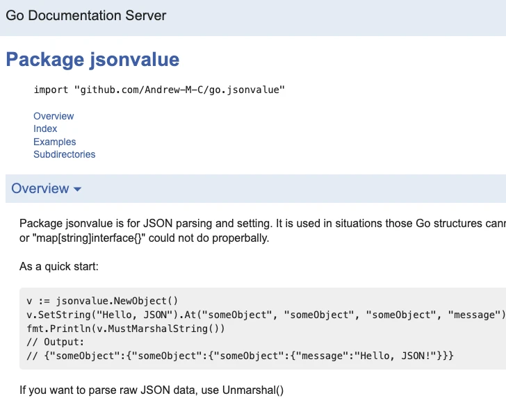


**三、pkgsite命令**


正如前文所说，现在Go官方维护和使用的是pkg.go.dev，因此本文主要说明pkgsite的用法。


当前的pkgsite要求Go 1.18版，因此请把Go版升级到1.18。然后我们需要安装pkgsite:


* 

```
go install golang.org/x/pkgsite/cmd/pkgsite@latest
```


然后和godoc类似:


* 

```
cd XXXX; pkgsite -http=:6060
```


一样用jsonvalue举例。浏览器的地址与godoc类似，但是少了“pkg/”，页面如下图所示:


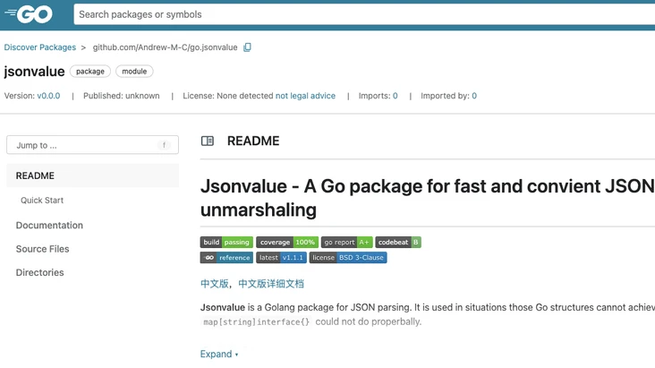


**四、pkg.go.dev内容**


### **（一）总体内容**


由于笔者在jsonvalue中对GoDoc玩得比较多，因此还是以这个库为例子。我们打开pkg.go.dev中相关包的主页，可以看到这些内容:


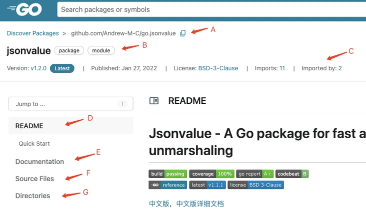


A-当前package的完整路径。


B-当前package的名称，其中的module表示这是一个符合go module的包。


C-当前package的一些基础信息，包括最新版本、发布时间、证书、依赖的包数量（包括系统包）、被引用的包数量。


D-如果当前package包含README文件，则展示README文件的内容。


E-当前package内的comment as document文档内容。


F-当前package的文件列表，可以点击快速浏览。


G-当前package的子目录列表。


如果你的README (markdown格式) 有子标题，那么pkgsite会生成 README 下的二级目录索引。Markdown的格式在本文就不予说明，相信码农们都耳熟能详了。


**（二）Documentation**


让我们点开Documentation，一个完整的package，可能包含以下这些内容:


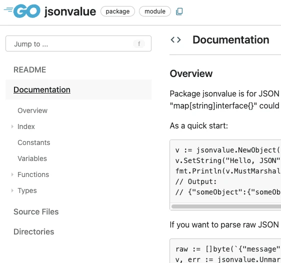


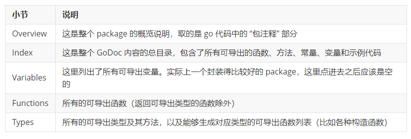


其实Documentation的内容，就是GoDoc。Go秉承“注释即文档”的理念，其中pkg.go.dev、godoc和pkgsite都使用同一套GoDoc格式，三者都按照该格式从文档的注释中提取，并生成文档。


下面我们具体来说明一下GoDoc的语法。


**五、GoDoc语法**


在GoDoc中，当前package的所有可导出类型，都会在pkg.go.dev页面中展示出来，即便某个可导出类型没有任何的注释，GoDoc也会将这个可导出内容的原型展示出来——当然了，我们应该时时刻刻记住：所有的可导出内容，都应该写好注释。


GoDoc支持//和/* ... */两种模式的注释符。但是笔者还是推荐使用//，这也是目前的注释符主流，而且大部分IDE也都支持一键将多行文本直接转为注释（比如Mac的VsCode，使用command+/）。虽然/* */在多行注释中非常方便，但一旦看到这个，总觉得好像是上古时代的代码 (狗头)。


**（一）绑定GoDoc与指定类型**


对于任意一个可导出内容，紧跟着代码定义上方一行的注释，都会被视为该内容的GoDoc，从而被提取出来。比如说：


* 
* 
* 
* 
* 
* 
* 
* 
* 
* 
* 
* 
* 
* 

```
// 这一行，会被视为 SomeTypeA 的 GoDoc，// 因为它紧挨着 SomeTypeA 的定义。type SomeTypeA struct{}
// 这一行与 SomeTypeB 的定义之间隔了一行，// 所以并不会认为是 SomeTypeB 的 GoDoc。
type SomeTypeB struct{}
/*使用这种注释符的注释也是同理，因为整个注释块紧挨着 SomeTypeC 的定义，因此会被视为 SomeTypeC 的注释。*/type SomeTypeC struct{}
```


这三个类型在pkgsite页面上的展示效果是这样的:


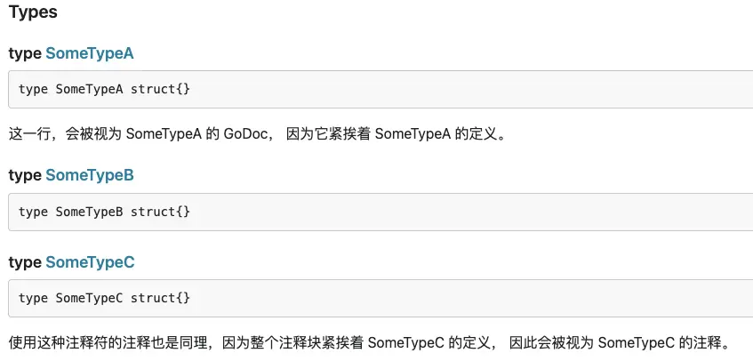


但是，请读者注意，按照Go官方的推荐，代码注释的第一个单词，应该是被注释的内容本身。比如前文中，SomeTypeA的注释应该是// SomeTypeA开头。下文开始将会统一使用这一规范。


**（二）换行（段落）**


读者可以注意到，前文中的所有有效注释，我都换了一行；但是在pkgsite的页面展示中，并没有发生换行。


实际上，在注释中如果只是单纯的一个换行另写注释的话，在页面是不会将其当作**新的一段**来看待的，GoDoc的逻辑，也仅仅渲染完这一行之后，再**加一个空格**，然后继续渲染下一行。


如果要在同一个注释块中新加一个段落，那么我们需要插入一行空注释，如下:


* 
* 
* 
* 
* 
* 

```
// SomeNewLine 只是用来展示如何在 GoDoc 中换行。//// 你看，这就是新的一行了，耶～✌️func SomeNewLine() error {    return nil}
```


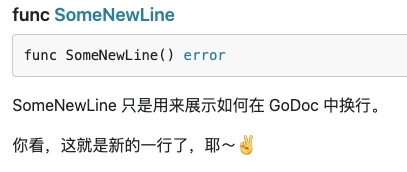


### **（三）内嵌代码**


如果有需要的话，我们可以在注释中内嵌一小段代码，代码会被独立为一个段落，并且使用等宽字符展示。比如下面的一个例子:


* 
* 
* 
* 
* 
* 
* 
* 
* 
* 
* 
* 
* 
* 
* 
* 
* 
* 
* 
* 
* 

```
// IntsElem 用于不 panic 地从一个 int 切片中读取元素，并且返回值和实际在切片中的位置。//// 不论是任何情况，如果切片长为0，则 actual Index 返回 -1.//// 根据参数 index 可以有几种情况：//// - 零值，则直接取切片的第一个值//// - 正值，则从切片0位置开始，如果遇到切片结束了，那么就循环从头开始数//// - 负值，则表示逆序，此时则循环从切片的最后一个值开始数//// 负值的例子:////    sli := []int{0, -1, -2, -3}//    val, idx := IntsElem(sli, -2)//// 返回得 val = -2, idx = 2func IntsElem(ints []int, index int) (value, actualIndex int) {    // ......}
```


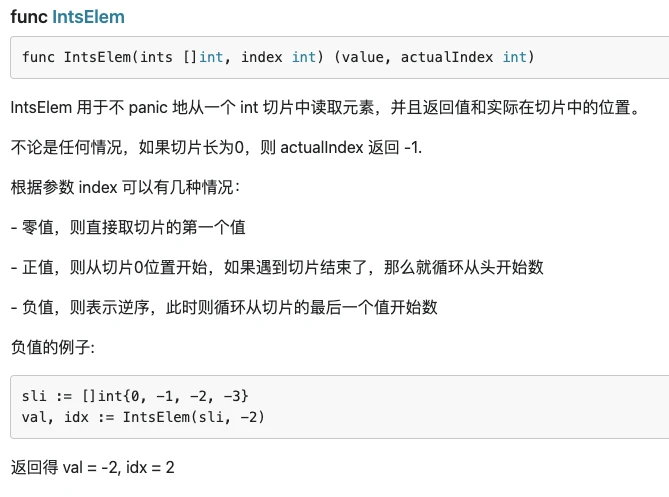


**总结**：在注释块中，如果部分注释行符合以下标准之一，则视为代码块:


* 注释行以制表符\t开头。


* 注释行以以多于一个空格（包括制表符）开头。


普通注释和代码块之间可以不用专门的空注释行，但个人建议还是加上比较好。


**六、Overview部分**


在Documentation中的Overview部分，是整个package的说明，这种类型的注释，被称为“包注释”。包注释是写在go文件最开始的package xxx上面。虽然GoDoc没有限制、但是Go官方建议包注释应当以// Package xxx开头作为文本的主语。


如果在一个package中，有多个文件都包含了包注释，那么GoDoc会按照文件的字典序，依次展示这些文件中的包注释。但这样可能会带来混乱，因此一个package我们应当**只在一个文件**中写包注释。


一般而言，我们可以选择以下的文件写包注释：


* 很多package下面会有一个与package名称同名的xxx.go文件，那我们可以统一就在这个文件里写包注释，比如这样：（https://github.com/Andrew-M-C/go.jsonvalue/blob/v1.2.0/jsonvalue.go#L1）

  


* 如果xxx.go文件本身承载了较多代码，或者是包注释比较长，那么我们可以专门开一个doc.go文件，用来写包注释，比如这样：（https://github.com/Andrew-M-C/go.jsonvalue/blob/v1.0.0/doc.go#L1）


**七、弃用代码声明**


Go所使用的版本号是vX.Y.Z的模式，按照官方的思想，每当package升级时，尽量不要升级大版本X值，这也同时代表着，本次升级是完全向前兼容的。但是实际上，我们在做一些小版本或中版本升级时，有些函数/类型可能不再推荐使用。此时，GoDoc提供了一个关键字Deprecated:，作为整个注释块的第一个单词，比如我们可以这么写:


* 
* 
* 
* 

```
// Deprecated: ElemAt 这个函数弃用，后续请迁移到 IntsElem 函数中.func ElemAt(ints []int, index int) int {    // ......}
```


针对deprecated的内容，pkgsite一方面会在目录中标识出来：


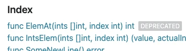


此外，在正文中，也会刻意用灰色字体低调展示，并且隐藏注释正文，需要点开才能显示:


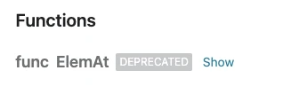


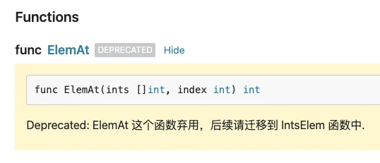


**八、代码示例文档**


读者如果看我jsonvalue的文档（https://pkg.go.dev/github.com/Andrew-M-C/go.jsonvalue#Set.At），在At()函数下，除了上文提到的文档正文之外，还有五个代码示例:


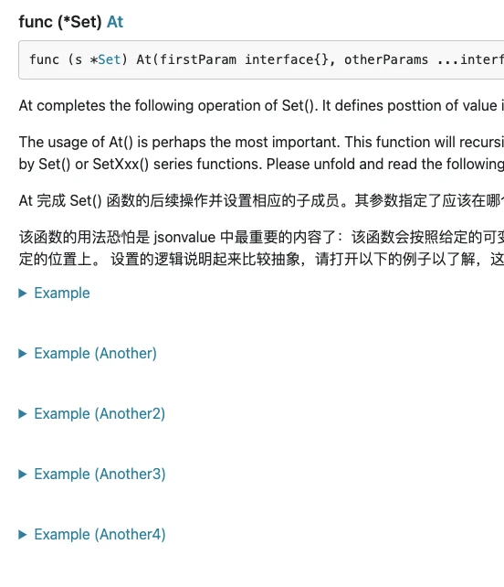

那么，文档中的代码示例又应该如何写呢？


首先，我们应该新建至少一个文件，专门用来存放示例代码。比如我就把示例代码写在了example_jsonvalue_test.go（https://github.com/Andrew-M-C/go.jsonvalue/blob/master/example_jsonvalue_test.go）文件中。这个文件的package名**不得**与当前包名相同，而应该命名为包名_test的格式。


此外，需要注意的是，示例代码文件也属于单元测试文件的内容，当执行go test的时候，示例文件也会纳入测试逻辑中。


### **（一）示例代码的声明**


如何声明一个示例代码，这里我举两个例子。首先是在At()函数下名为“Example (1)”的示例。在代码（https://github.com/Andrew-M-C/go.jsonvalue/blob/master/example_jsonvalue_test.go#L112）中，我把这个函数命名为：


* 
* 
* 

```
func ExampleSet_At_1() {    ......}
```


这个函数命名有几个部分：


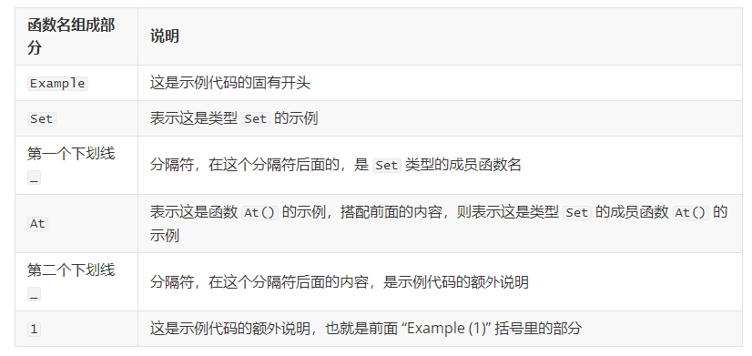


另外，示例代码中应该包含标准输出内容，这样便于读者了解执行情况。标准输出内容在函数内的最后，采用//Output: 单独起一行开头，剩下的每一行标准输出写一行注释。


相对应地，如果你想要给（不属于任何一个类型的）函数写示例的话，则去掉上文中关于“类型”的字段；如果你不需要示例的额外说明符，则去掉“额外说明”字段。比如说，我给类型Opt写的示例（https://pkg.go.dev/github.com/Andrew-M-C/go.jsonvalue#example-Opt）就只有一个，在代码（https://github.com/Andrew-M-C/go.jsonvalue/blob/master/example_jsonvalue_test.go#L43）中，只有一行：


* 
* 
* 

```
func ExampleOpt() {    ........}
```


甚至连示例说明都没有。


如果一个元素包含多个例子，那么godoc会按照字母序对示例及其相应的说明排序。这也就是为什么我干脆在At()函数中，示例标为一二三四五的原因，因为这是我希望读者阅读示例的顺序。


## **（二）在官网上发布GoDoc**


好了，当你写好了自己的GoDoc之后，总不是自己看自己自娱自乐吧，总归是要发布出来给大家看的。


其实发布也很简单：当你将包含了godoc的代码push之后（比如发布到github上），就可以在浏览器中输入https://pkg.go.dev/${package路径名}。比如jsonvalue的Github路径（也等同于import路径）为github.com/Andrew-M-C/go.jsonvalue，因此输入（https://pkg.go.dev/github.com/Andrew-M-C/go.jsonvalue）。


如果这是该页面第一次进入，那么pkg.go.dev会首先获取、解析和更新代码仓库中的文档内容，并且格式化之后展示。在pkg.go.dev中，如果能够找到package的最新的tag版本，那么会列出tag（而不是主干分支）上的GoDoc。


接下来更重要的是，把这份官网GoDoc的链接，附到你自己的README中。我们可以进入pkg.go.dev的徽章生成页（‍‍‍‍‍‍‍‍https://pkg.go.dev/badge/‍）


输入仓库地址就可以看到相应的徽标的链接了。有html和markdown格式任君选择。


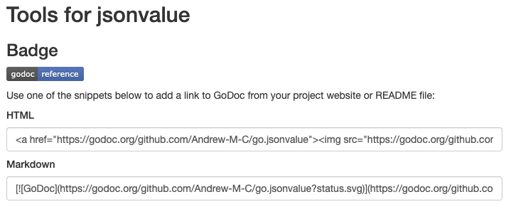


# **参考资料：**

1.万字长文解读pkg.go.dev的设计和实现

2.pkg.go.dev源码j