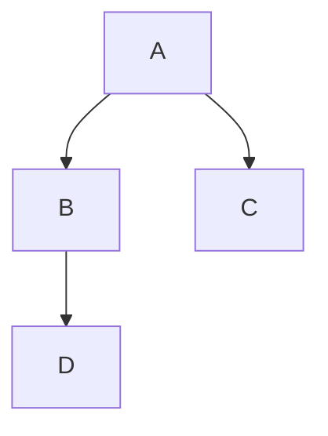
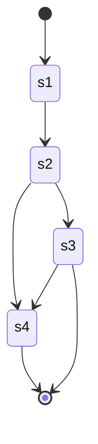
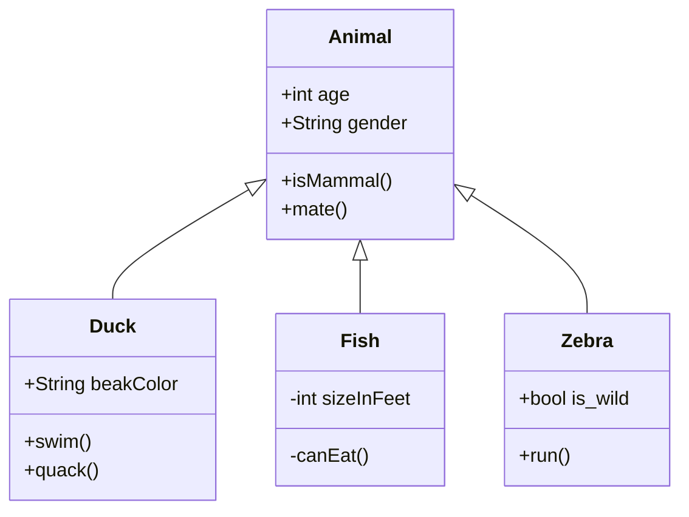
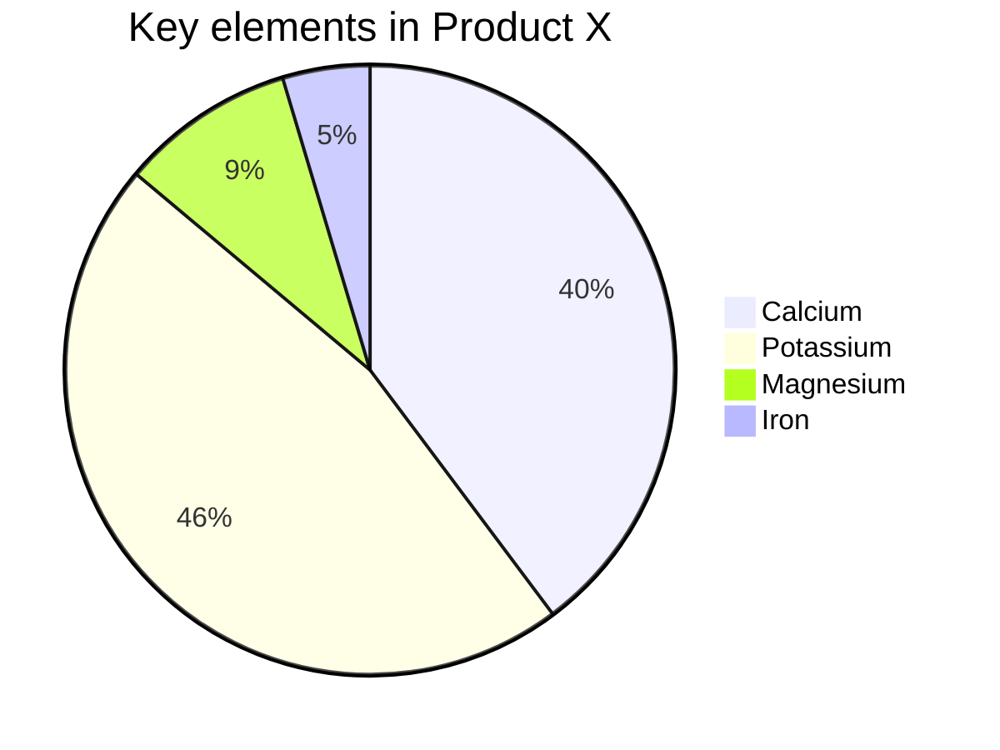

# python vs Golang

|      |      |      |
| ---- | ---- | ---- |
|      |      |      |
|      |      |      |
|      |      |      |


- defer()定義延遲調用，無論函數是否出錯，它都確保結束前被調用。


```yaml
学习笔记:
  key: 
    - 黄金三分法
    - 典型应用
```

https://github.com/yinggaozhen/awesome-go-cn


> 1. `go tool compile -N -l -S main.go`可以得到程序的汇编代码
> 2. 官方说使用go build + fileName 编译出来的就直接带有调试信息了，可以使用go build -ldflags “-s”把编译信息去掉,**减小大约一半的大小**
> 3. 默认编译会有一些给调试带来不便的优化，可以使用-gcflags “-N -l”选项把它去掉
>
> 

go build ldflags参数说明

```excel
-w 去掉DWARF调试信息，得到的程序就不能用gdb调试了。

-s 去掉符号表,panic时候的stack trace就没有任何文件名/行号信息了，这个等价于普通C/C++程序被strip的效果，

-X 设置包中的变量值
```


**如果想要在go build生成的可执行文件中注入编译时间，git hash等信息。可以在编译的时候使用-ldflags -X参数来注入变量**

> go build -ldflags "-X ' packageName.varName=cmd ' "


## 社区资源

- 在 [Freenode](http://freenode.net/) IRC 上，可能有很多#go-nuts的开发人员和用户，你可以获取即时的帮助。

- 还可以访问Go语言的官方邮件列表 [Go Nuts](http://groups.google.com/group/golang-nuts)。

- Bug可以在 [Go issue tracker](http://code.google.com/p/go/issues/list) 提交。

- 对于开发Go语言用户，有令一个专门的邮件列表 [golang-checkins](http://groups.google.com/group/golang-checkins)。 这里讨论的是Go语言仓库代码的变更。

- ~~如果是中文用户，请访问：[Go语言中文论坛](http://bbs.golang-china.org/)。~~

- [中文文档](https://www.kancloud.cn/wizardforcel/golang-doc/121334)


# 交叉编译

Golang 支持交叉编译，在一个平台上生成另一个平台的可执行程序，最近使用了一下，非常好用，这里备忘一下。

Mac 下编译 Linux 和 Windows 64位可执行程序

```
CGO_ENABLED=0 GOOS=linux GOARCH=amd64 go build main.go
CGO_ENABLED=0 GOOS=windows GOARCH=amd64 go build main.go
```


Linux 下编译 Mac 和 Windows 64位可执行程序

```
CGO_ENABLED=0 GOOS=darwin GOARCH=amd64 go build main.go
CGO_ENABLED=0 GOOS=windows GOARCH=amd64 go build main.go
```


Windows 下编译 Mac 和 Linux 64位可执行程序

```
SET CGO_ENABLED=0
SET GOOS=darwin
SET GOARCH=amd64
go build main.go

SET CGO_ENABLED=0
SET GOOS=linux
SET GOARCH=amd64
go build main.go
```

GOOS：目标平台的操作系统（darwin、freebsd、linux、windows）
GOARCH：目标平台的体系架构（386、amd64、arm）
交叉编译不支持 CGO 所以要禁用它

上面的命令编译 64 位可执行程序，你当然应该也会使用 386 编译 32 位可执行程序
很多博客都提到要先增加对其它平台的支持，但是我跳过那一步，上面所列的命令也都能成功，且得到我想要的结果，可见那一步应该是非必须的，或是我所使用的 Go 版本已默认支持所有平台。
————————————————
版权声明：本文为CSDN博主「磐石区」的原创文章，遵循CC 4.0 BY-SA版权协议，转载请附上原文出处链接及本声明。
原文链接：https://blog.csdn.net/panshiqu/article/details/53788067

# Go AES加解密

2019-05-05阅读 3.3K0

版权声明：感谢您对博文的关注！

https://blog.csdn.net/K346K346/article/details/89387460				

利用Go提供的AES加解密与Base64编解码包，我们可以轻松地实现AES的加解密。实现之前，首先了解一下AES的一些常识点。 （1）AES有5种加密模式，分别是： （a）电码本模式（Electronic Codebook Book，ECB）； （b）密码分组链接模式（Cipher Block Chaining ，CBC），如果明文长度不是分组长度16字节的整数倍需要进行填充； （c）计算器模式（Counter，CTR）； （d）密码反馈模式（Cipher FeedBack，CFB）； （e）输出反馈模式（Output FeedBack，OFB）。

（2）AES是对称分组加密算法，每组长度为128bits，即16字节。

（3）AES秘钥的长度只能是16、24或32字节，分别对应三种AES，即AES-128, AES-192和AES-256，三者的区别是加密的轮数不同；

下面以CBC模式为例，实现AES加解密。

```javascript
package aeswrap

import (
    "fmt"
    "crypto/cipher"
    "crypto/aes"
    "bytes"
    "encoding/base64"
)

//@brief:填充明文
func PKCS5Padding(plaintext []byte, blockSize int) []byte{
    padding := blockSize-len(plaintext)%blockSize
    padtext := bytes.Repeat([]byte{byte(padding)},padding)
    return append(plaintext,padtext...)
}

//@brief:去除填充数据
func PKCS5UnPadding(origData []byte) []byte{
    length := len(origData)
    unpadding := int(origData[length-1])
    return origData[:(length - unpadding)]
}

//@brief:AES加密
func AesEncrypt(origData, key []byte) ([]byte, error){
    block, err := aes.NewCipher(key)
    if err != nil {
        return nil, err
    }

	//AES分组长度为128位，所以blockSize=16，单位字节
    blockSize := block.BlockSize()
    origData = PKCS5Padding(origData,blockSize)					
    blockMode := cipher.NewCBCEncrypter(block,key[:blockSize])	//初始向量的长度必须等于块block的长度16字节
    crypted := make([]byte, len(origData))
    blockMode.CryptBlocks(crypted,origData)
    return crypted, nil
}

//@brief:AES解密
func AesDecrypt(crypted, key []byte) ([]byte, error) {
    block, err := aes.NewCipher(key)
    if err != nil {
        return nil, err
    }

	//AES分组长度为128位，所以blockSize=16，单位字节
    blockSize := block.BlockSize()
    blockMode := cipher.NewCBCDecrypter(block, key[:blockSize])	//初始向量的长度必须等于块block的长度16字节
    origData := make([]byte, len(crypted))
    blockMode.CryptBlocks(origData, crypted)
    origData = PKCS5UnPadding(origData)
    return origData, nil
}

func main(){
	//key的长度必须是16、24或者32字节，分别用于选择AES-128, AES-192, or AES-256
    var aeskey = []byte("12345678abcdefgh")
    pass := []byte("vdncloud123456")
    xpass, err := AesEncrypt(pass,aeskey)
    if err != nil {
        fmt.Println(err)
        return
    }

    pass64 := base64.StdEncoding.EncodeToString(xpass)
    fmt.Printf("加密后:%v\n",pass64)

    bytesPass, err := base64.StdEncoding.DecodeString(pass64)
    if err != nil {
        fmt.Println(err)
        return
    }

    tpass, err := AesDecrypt(bytesPass, aeskey)
    if err != nil {
        fmt.Println(err)
        return
    }
    fmt.Printf("解密后:%s\n", tpass)
}
```

编译运行输出：

```javascript
加密后:Z9Mz4s6LDwYpIam4z+fqxw==
解密后:vdncloud123456
```

如果想了解AES实现原理，可参考[AES加密算法的详细介绍与实现](https://blog.csdn.net/qq_28205153/article/details/55798628#commentBox)。


# 朝花夕拾

|      |      |      |
| ---- | ---- | ---- |
|      |      |      |
|      |      |      |
|      |      |      |

# 扫目录

```go
package main

import (
    "fmt"
    "io/ioutil"
    "log"
)

func main() {
    files, err := ioutil.ReadDir(".")
    if err != nil {
        log.Fatal(err)
    }

    for _, file := range files {
        fmt.Println(file.Name())
    }
}
```

# 指针

# 不定长参数

```go
// Print代替fmt.Println(x...)
// x...  为展开
func Print(x ...interface{}) {
	fmt.Println(x...)
}
```


#  可选参数 ∆

options

# recover

recover只有发生在panic之后调用才会生效, 放在同goroutine下的defer比较合理

# Struct and tags


**结构体中的成员变量，只有首字母大写，才能在其定义的 package 以外访问。而在同一个 package 内，就不会有此限制。**

**package以外的访问都需要将package内成员和变量名大写**

struct[结构转换开发工具](https://www.golangs.cn/)


```go
type User struct {
    Name          string    `json:"name"`
    Password      string    `json:"password"`
    PreferredFish []string  `json:"preferredFish,omitempty"`
    CreatedAt     time.Time `json:"createdAt"`
}
```

```go
type User struct {
    Name      string    `json:"name"`
    Password  string    `json:"-"`
    CreatedAt time.Time `json:"createdAt"`
}
```

```go
type TopField struct {
	TestField `json:",omitempty,inline"`
	TestA     string `json:"test_a"`
	TestB     string `json:"test_b"`
}
```

yml

```go
type AnsibleVars struct {
	AnsibleSSHHost           string `yaml:"ansible_ssh_host,omitempty"`
	AnsibleSSHPass           string `yaml:"ansible_ssh_pass,omitempty"`
	AnsibleSSHUser           string `yaml:"ansible_ssh_user"`
	AnsibleSSHPrivateKeyFile string `yaml:"ansible_ssh_private_key_file"`
}
```


# reflect

Go:反射之用字符串函数名调用函数


```go

package main
 
import (
	"fmt"
	"reflect"
)
 
type Animal struct {
}
 
func (m *Animal) Eat() {
	fmt.Println("Eat")
}
func main() {
	animal := Animal{}
	value := reflect.ValueOf(&animal)
	f := value.MethodByName("Eat") //通过反射获取它对应的函数，然后通过call来调用
	f.Call([]reflect.Value{})

```


# interface

struct实现interface 接口, 可以让 &struct 传入 以interface接口作为参数 的func


# 1.17 泛型

# 协程


|                 |                                                              |                                               |
| --------------- | ------------------------------------------------------------ | --------------------------------------------- |
| go py协程的区别 | goroutine抢占式任务处理(互斥由channel实现,支持多核), coroutine协作式任务处理(不需要互斥,单核) | goroutineCPU/IO密集都适合,coroutine适合IO密集 |
|                 |                                                              |                                               |
|                 |                                                              |                                               |


# goproxy


```sh
go env -w GOPROXY=https://goproxy.cn,direct
```


```sh
GOPROXY=https://goproxy.io,direct
```


# 折腾破解

 最新！IntelliJ IDEA 2020.3.2 - Mac激活教程（亲测有效）PyCharm、CLion、PhpStorm、GoLand、WebStorm、Rider、DataGrip、Ru...

[](https://www.jianshu.com/u/9e4d5c95a655)

[继粮](https://www.jianshu.com/u/9e4d5c95a655)关注

2021.03.04 20:17:35字数 314阅读 1,130

## 前言

本方法适用于所有平台（Win、Mac、Linux）的 JetBrains 软件（IntelliJIdea、CLion、PhpStorm、GoLand、PyCharm、WebStorm、Rider、DataGrip、RubyMine、AppCode）

**工具地址**：

[蓝凑云](https://links.jianshu.com/go?to=https%3A%2F%2Fouo.io%2Fzn8c3kh)：提取码: 4qpg

[百度云](https://links.jianshu.com/go?to=https%3A%2F%2Fouo.io%2Fg4ntsU)：提取码: rwub

## 一、下载

在 JetBrains 官网下载 IDEA 2020.3.2 版本: 【[传送门](https://links.jianshu.com/go?to=https%3A%2F%2Fouo.io%2FSRG8hV)】


下载.png

## 二、卸载旧版本


卸载1.png


卸载2.png

## 三、安装


安装.png

## 四、启动激活

### 启动

**第一种情况**：点击试用进入 IDEA


启动1.png

**第二种情况**：提示已过试用期，可以直接点击 OK 进入IDEA；或者使用脚本重置试用期，具体操作在后面


启动2.png

### 激活

打开任意一个工程或文件，把插件 `BetterIntelliJ.zip` 文件拖入到 IDEA 窗口中，注意不要解压`BetterIntelliJ.zip`文件


激活1.png


当提示重启 IDE 时，表示插件已经安装成功，此时关闭 idea，重新启动


激活2.png

重启后，打开激活界面


激活3.png


激活4.png

把 `激活key.txt` 文件中的内容复制到激活码输入框中


激活5.png

激活成功后，提示有效期至2099年12月31日


激活6.png

## 五、重置试用期

**window**：执行 `reset_jetbrains_eval_windows.vbs`

**Mac | Linux**：执行 `reset_jetbrains_eval_mac_linux.sh`


```bash
# 首先进入到 “JetBrains 激活工具/reset_script” 目录下
# 给脚本添加执行权限
chmod u+x reset_jetbrains_eval_mac_linux.sh

# 执行脚本,成功后会提示 'done.'
./reset_jetbrains_eval_mac_linux.sh 
```


重置试用期.png


# goland 升级1.17后无法配置SDK 

```
goland not a valid home for go sdk golang 1.17
```

edit  `src/runtime/internal/sys/zversion.go`

add new row `const theVersion = 'go1.17'`  

```go
// Code generated by go tool dist; DO NOT EDIT.
package sys
const StackGuardMultiplierDefault = 1
  const theVersion = `go1.17`
```


# 学习Gin

https://gin-gonic.com/zh-cn/docs/examples/html-rendering/

# struct 和 struct pointer


```go
type MyStruct struct {
    Name string
}

func (s MyStruct) SetName1(name string) {
    s.Name = name
}

func (s *MyStruct) SetName2(name string) {
    s.Name = name
}
```

整体有以下几个考虑因素，按重要程度顺序排列：

1. 在使用上的考虑：方法是否需要修改接收器？如果需要，接收器必须是一个指针。
2. 在效率上的考虑：如果接收器很大，比如：一个大的结构体，使用指针接收器会好很多。
3. 在一致性上的考虑：如果类型的某些方法必须有指针接收器，那么其余的方法也应该有指针接收器，所以无论类型如何使用，方法集都是一致的。


# Rust 和 Go


# error的处理

```go
err = yaml.Unmarshal(yamlFile, &resultMap)
```











# git通用配置


```sh
vim .git/info/exclude
```


```
.idea
go.mod
go.sum


```





```sequence
Alice->Bob: Hello Bob, how are you?
Note right of Bob: Bob thinks
Bob-->Alice: I am good thanks!
```


## 简介Cobra

[cobra](https://link.juejin.cn?target=http%3A%2F%2Fgithub.com%2Fspf13%2Fcobra)是一个命令行程序库，可以用来编写命令行程序。同时，它也提供了一个脚手架， 用于生成基于 cobra 的应用程序框架。非常多知名的开源项目使用了 cobra 库构建命令行，如[Kubernetes](https://link.juejin.cn?target=http%3A%2F%2Fkubernetes.io%2F)、[Hugo](https://link.juejin.cn?target=http%3A%2F%2Fgohugo.io%2F)、[etcd](https://link.juejin.cn?target=https%3A%2F%2Fgithub.com%2Fcoreos%2Fetcd)等等等等。 本文介绍 cobra 库的基本使用和一些有趣的特性。

## 

作者：傻梦兽
链接：https://juejin.cn/post/7057178581897740319
来源：稀土掘金
著作权归作者所有。商业转载请联系作者获得授权，非商业转载请注明出处。


# 中级go


[傻梦兽](https://juejin.cn/user/2066737588876983)

并发编程肯定要精通…，然后要会linux和一些运维工作，devops有部分是go来编写的。 我司要求就这么点吧，还有会grpc有些业务java处理复杂的事情go实现简单的话丢给go处理完数据，再就回去java那边处理，网络通信处理也要懂 也没什么了


# yaml to json


```

```


#  jwt 认证 [casdoor](https://github.com/casdoor/casdoor)

# 位运算符

[运算符](https://www.runoob.com/go/go-operators.html)


# Go 语言运算符

运算符用于在程序运行时执行数学或逻辑运算。

Go 语言内置的运算符有：

* 算术运算符
* 关系运算符
* 逻辑运算符
* 位运算符
* 赋值运算符
* 其他运算符

接下来让我们来详细看看各个运算符的介绍。

------

## 算术运算符

下表列出了所有Go语言的算术运算符。假定 A 值为 10，B 值为 20。

| 运算符 | 描述 | 实例               |
| :----- | :--- | :----------------- |
| +      | 相加 | A + B 输出结果 30  |
| -      | 相减 | A - B 输出结果 -10 |
| *      | 相乘 | A * B 输出结果 200 |
| /      | 相除 | B / A 输出结果 2   |
| %      | 求余 | B % A 输出结果 0   |
| ++     | 自增 | A++ 输出结果 11    |
| --     | 自减 | A-- 输出结果 9     |

以下实例演示了各个算术运算符的用法：

## 实例

**package** main

**import** "fmt"

func main() {

  **var** a int = 21
  **var** b int = 10
  **var** c int

  c = a + b
  fmt.Printf("第一行 - c 的值为 %d**\n**", c )
  c = a - b
  fmt.Printf("第二行 - c 的值为 %d**\n**", c )
  c = a * b
  fmt.Printf("第三行 - c 的值为 %d**\n**", c )
  c = a / b
  fmt.Printf("第四行 - c 的值为 %d**\n**", c )
  c = a % b
  fmt.Printf("第五行 - c 的值为 %d**\n**", c )
  a++
  fmt.Printf("第六行 - a 的值为 %d**\n**", a )
  a=21  *// 为了方便测试，a 这里重新赋值为 21*
  a--
  fmt.Printf("第七行 - a 的值为 %d**\n**", a )
}

以上实例运行结果：

```
第一行 - c 的值为 31
第二行 - c 的值为 11
第三行 - c 的值为 210
第四行 - c 的值为 2
第五行 - c 的值为 1
第六行 - a 的值为 22
第七行 - a 的值为 20
```

------

## 关系运算符

下表列出了所有Go语言的关系运算符。假定 A 值为 10，B 值为 20。

| 运算符 | 描述                                                         | 实例              |
| :----- | :----------------------------------------------------------- | :---------------- |
| ==     | 检查两个值是否相等，如果相等返回 True 否则返回 False。       | (A == B) 为 False |
| !=     | 检查两个值是否不相等，如果不相等返回 True 否则返回 False。   | (A != B) 为 True  |
| >      | 检查左边值是否大于右边值，如果是返回 True 否则返回 False。   | (A > B) 为 False  |
| <      | 检查左边值是否小于右边值，如果是返回 True 否则返回 False。   | (A < B) 为 True   |
| >=     | 检查左边值是否大于等于右边值，如果是返回 True 否则返回 False。 | (A >= B) 为 False |
| <=     | 检查左边值是否小于等于右边值，如果是返回 True 否则返回 False。 | (A <= B) 为 True  |

以下实例演示了关系运算符的用法：

## 实例

**package** main

**import** "fmt"

func main() {
  **var** a int = 21
  **var** b int = 10

  **if**( a == b ) {
   fmt.Printf("第一行 - a 等于 b**\n**" )
  } **else** {
   fmt.Printf("第一行 - a 不等于 b**\n**" )
  }
  **if** ( a < b ) {
   fmt.Printf("第二行 - a 小于 b**\n**" )
  } **else** {
   fmt.Printf("第二行 - a 不小于 b**\n**" )
  }

  **if** ( a > b ) {
   fmt.Printf("第三行 - a 大于 b**\n**" )
  } **else** {
   fmt.Printf("第三行 - a 不大于 b**\n**" )
  }
  */\* Lets change value of a and b \*/*
  a = 5
  b = 20
  **if** ( a <= b ) {
   fmt.Printf("第四行 - a 小于等于 b**\n**" )
  }
  **if** ( b >= a ) {
   fmt.Printf("第五行 - b 大于等于 a**\n**" )
  }
}

以上实例运行结果：

```
第一行 - a 不等于 b
第二行 - a 不小于 b
第三行 - a 大于 b
第四行 - a 小于等于 b
第五行 - b 大于等于 a
```

------

## 逻辑运算符

下表列出了所有Go语言的逻辑运算符。假定 A 值为 True，B 值为 False。

| 运算符 | 描述                                                         | 实例               |
| :----- | :----------------------------------------------------------- | :----------------- |
| &&     | 逻辑 AND 运算符。 如果两边的操作数都是 True，则条件 True，否则为 False。 | (A && B) 为 False  |
| \|\|   | 逻辑 OR 运算符。 如果两边的操作数有一个 True，则条件 True，否则为 False。 | (A \|\| B) 为 True |
| !      | 逻辑 NOT 运算符。 如果条件为 True，则逻辑 NOT 条件 False，否则为 True。 | !(A && B) 为 True  |

以下实例演示了逻辑运算符的用法：

## 实例

**package** main

**import** "fmt"

func main() {
  **var** a bool = **true**
  **var** b bool = **false**
  **if** ( a && b ) {
   fmt.Printf("第一行 - 条件为 true**\n**" )
  }
  **if** ( a || b ) {
   fmt.Printf("第二行 - 条件为 true**\n**" )
  }
  */\* 修改 a 和 b 的值 \*/*
  a = **false**
  b = **true**
  **if** ( a && b ) {
   fmt.Printf("第三行 - 条件为 true**\n**" )
  } **else** {
   fmt.Printf("第三行 - 条件为 false**\n**" )
  }
  **if** ( !(a && b) ) {
   fmt.Printf("第四行 - 条件为 true**\n**" )
  }
}

以上实例运行结果：

```
第二行 - 条件为 true
第三行 - 条件为 false
第四行 - 条件为 true
```

------

## 位运算符

位运算符对整数在内存中的二进制位进行操作。

下表列出了位运算符 &, |, 和 ^ 的计算：

| p    | q    | p & q | p \| q | p ^ q |
| :--- | :--- | :---- | :----- | :---- |
| 0    | 0    | 0     | 0      | 0     |
| 0    | 1    | 0     | 1      | 1     |
| 1    | 1    | 1     | 1      | 0     |
| 1    | 0    | 0     | 1      | 1     |

假定 A = 60; B = 13; 其二进制数转换为：

```
A = 0011 1100

B = 0000 1101

-----------------

A&B = 0000 1100

A|B = 0011 1101

A^B = 0011 0001
```


Go 语言支持的位运算符如下表所示。假定 A 为60，B 为13：

| 运算符 | 描述                                                         | 实例                                   |
| :----- | :----------------------------------------------------------- | :------------------------------------- |
| &      | 按位与运算符"&"是双目运算符。 其功能是参与运算的两数各对应的二进位相与。 | (A & B) 结果为 12, 二进制为 0000 1100  |
| \|     | 按位或运算符"\|"是双目运算符。 其功能是参与运算的两数各对应的二进位相或 | (A \| B) 结果为 61, 二进制为 0011 1101 |
| ^      | 按位异或运算符"^"是双目运算符。 其功能是参与运算的两数各对应的二进位相异或，当两对应的二进位相异时，结果为1。 | (A ^ B) 结果为 49, 二进制为 0011 0001  |
| <<     | 左移运算符"<<"是双目运算符。左移n位就是乘以2的n次方。 其功能把"<<"左边的运算数的各二进位全部左移若干位，由"<<"右边的数指定移动的位数，高位丢弃，低位补0。 | A << 2 结果为 240 ，二进制为 1111 0000 |
| >>     | 右移运算符">>"是双目运算符。右移n位就是除以2的n次方。 其功能是把">>"左边的运算数的各二进位全部右移若干位，">>"右边的数指定移动的位数。 | A >> 2 结果为 15 ，二进制为 0000 1111  |

以下实例演示了位运算符的用法：

## 实例

**package** main

**import** "fmt"

func main() {

  **var** a uint = 60   */\* 60 = 0011 1100 \*/* 
  **var** b uint = 13   */\* 13 = 0000 1101 \*/*
  **var** c uint = 0      

  c = a & b    */\* 12 = 0000 1100 \*/*
  fmt.Printf("第一行 - c 的值为 %d**\n**", c )

  c = a | b    */\* 61 = 0011 1101 \*/*
  fmt.Printf("第二行 - c 的值为 %d**\n**", c )

  c = a ^ b    */\* 49 = 0011 0001 \*/*
  fmt.Printf("第三行 - c 的值为 %d**\n**", c )

  c = a << 2   */\* 240 = 1111 0000 \*/*
  fmt.Printf("第四行 - c 的值为 %d**\n**", c )

  c = a >> 2   */\* 15 = 0000 1111 \*/*
  fmt.Printf("第五行 - c 的值为 %d**\n**", c )
}

以上实例运行结果：

```
第一行 - c 的值为 12
第二行 - c 的值为 61
第三行 - c 的值为 49
第四行 - c 的值为 240
第五行 - c 的值为 15
```

------

## 赋值运算符

下表列出了所有Go语言的赋值运算符。

| 运算符 | 描述                                           | 实例                                  |
| :----- | :--------------------------------------------- | :------------------------------------ |
| =      | 简单的赋值运算符，将一个表达式的值赋给一个左值 | C = A + B 将 A + B 表达式结果赋值给 C |
| +=     | 相加后再赋值                                   | C += A 等于 C = C + A                 |
| -=     | 相减后再赋值                                   | C -= A 等于 C = C - A                 |
| *=     | 相乘后再赋值                                   | C *= A 等于 C = C * A                 |
| /=     | 相除后再赋值                                   | C /= A 等于 C = C / A                 |
| %=     | 求余后再赋值                                   | C %= A 等于 C = C % A                 |
| <<=    | 左移后赋值                                     | C <<= 2 等于 C = C << 2               |
| >>=    | 右移后赋值                                     | C >>= 2 等于 C = C >> 2               |
| &=     | 按位与后赋值                                   | C &= 2 等于 C = C & 2                 |
| ^=     | 按位异或后赋值                                 | C ^= 2 等于 C = C ^ 2                 |
| \|=    | 按位或后赋值                                   | C \|= 2 等于 C = C \| 2               |

以下实例演示了赋值运算符的用法：

## 实例

**package** main

**import** "fmt"

func main() {
  **var** a int = 21
  **var** c int

  c = a
  fmt.Printf("第 1 行 - =  运算符实例，c 值为 = %d**\n**", c )

  c += a
  fmt.Printf("第 2 行 - += 运算符实例，c 值为 = %d**\n**", c )

  c -= a
  fmt.Printf("第 3 行 - -= 运算符实例，c 值为 = %d**\n**", c )

  c *= a
  fmt.Printf("第 4 行 - *= 运算符实例，c 值为 = %d**\n**", c )

  c /= a
  fmt.Printf("第 5 行 - /= 运算符实例，c 值为 = %d**\n**", c )

  c  = 200;

  c <<= 2
  fmt.Printf("第 6行  - <<= 运算符实例，c 值为 = %d**\n**", c )

  c >>= 2
  fmt.Printf("第 7 行 - >>= 运算符实例，c 值为 = %d**\n**", c )

  c &= 2
  fmt.Printf("第 8 行 - &= 运算符实例，c 值为 = %d**\n**", c )

  c ^= 2
  fmt.Printf("第 9 行 - ^= 运算符实例，c 值为 = %d**\n**", c )

  c |= 2
  fmt.Printf("第 10 行 - |= 运算符实例，c 值为 = %d**\n**", c )

}

以上实例运行结果：

```
第 1 行 - =  运算符实例，c 值为 = 21
第 2 行 - += 运算符实例，c 值为 = 42
第 3 行 - -= 运算符实例，c 值为 = 21
第 4 行 - *= 运算符实例，c 值为 = 441
第 5 行 - /= 运算符实例，c 值为 = 21
第 6行  - <<= 运算符实例，c 值为 = 800
第 7 行 - >>= 运算符实例，c 值为 = 200
第 8 行 - &= 运算符实例，c 值为 = 0
第 9 行 - ^= 运算符实例，c 值为 = 2
第 10 行 - |= 运算符实例，c 值为 = 2
```

------

## 其他运算符

下表列出了Go语言的其他运算符。

| 运算符 | 描述             | 实例                       |
| :----- | :--------------- | :------------------------- |
| &      | 返回变量存储地址 | &a; 将给出变量的实际地址。 |
| *      | 指针变量。       | *a; 是一个指针变量         |

以下实例演示了其他运算符的用法：

## 实例

**package** main

**import** "fmt"

func main() {
  **var** a int = 4
  **var** b int32
  **var** c float32
  **var** ptr *int

  */\* 运算符实例 \*/*
  fmt.Printf("第 1 行 - a 变量类型为 = %T**\n**", a );
  fmt.Printf("第 2 行 - b 变量类型为 = %T**\n**", b );
  fmt.Printf("第 3 行 - c 变量类型为 = %T**\n**", c );

  */\*  & 和 \* 运算符实例 \*/*
  ptr = &a   */\* 'ptr' 包含了 'a' 变量的地址 \*/*
  fmt.Printf("a 的值为  %d**\n**", a);
  fmt.Printf("*ptr 为 %d**\n**", *ptr);
}

以上实例运行结果：

```
第 1 行 - a 变量类型为 = int
第 2 行 - b 变量类型为 = int32
第 3 行 - c 变量类型为 = float32
a 的值为  4
*ptr 为 4
```

------

## 运算符优先级

有些运算符拥有较高的优先级，二元运算符的运算方向均是从左至右。下表列出了所有运算符以及它们的优先级，由上至下代表优先级由高到低：

| 优先级 | 运算符           |
| :----- | :--------------- |
| 5      | * / % << >> & &^ |
| 4      | + - \| ^         |
| 3      | == != < <= > >=  |
| 2      | &&               |
| 1      | \|\|             |

当然，你可以通过使用括号来临时提升某个表达式的整体运算优先级。

以上实例运行结果：

## 实例

**package** main

**import** "fmt"

func main() {
  **var** a int = 20
  **var** b int = 10
  **var** c int = 15
  **var** d int = 5
  **var** e int;

  e = (a + b) * c / d;    *// ( 30 \* 15 ) / 5*
  fmt.Printf("(a + b) * c / d 的值为 : %d**\n**", e );

  e = ((a + b) * c) / d;   *// (30 \* 15 ) / 5*
  fmt.Printf("((a + b) * c) / d 的值为  : %d**\n**" , e );

  e = (a + b) * (c / d);  *// (30) \* (15/5)*
  fmt.Printf("(a + b) * (c / d) 的值为  : %d**\n**", e );

  e = a + (b * c) / d;   *//  20 + (150/5)*
  fmt.Printf("a + (b * c) / d 的值为  : %d**\n**" , e ); 
}

以上实例运行结果：

```
(a + b) * c / d 的值为 : 90
((a + b) * c) / d 的值为  : 90
(a + b) * (c / d) 的值为  : 90
a + (b * c) / d 的值为  : 50
```


# beego


```
exec: "go": executable file not found in $PATH异常的原因

```


runmode=prod


```
bee pack
```


# beego阿里云SLB健康检查失败, 做Head方法

**健康检查失败导致网站无法访问怎么办？**

如果使用SLB，请在健康检查URL的controller中接受**head**请求，否则可能会导致健康检查失败，网站无法访问。

```go
package controllers

import (
  "github.com/astaxie/beego"
)

type MainController struct {
  beego.Controller
}

func (c *MainController) Get() {
  c.Data["Website"] = "beego.me"
  c.Data["Email"] = "astaxie@gmail.com"
  c.TplName = "index.tpl"
}


func (c *MainController) Head() {
  c.Ctx.Output.Body([]byte(""))
}
```


# init()

​	

```go
package main

import (
    "fmt"
    "time"
)

func init() {
    fmt.Println("init will be before hello world")
}

func main() {
    fmt.Println("hello world")
    fmt.Println("today times:" + time.Now().String())
}

```


# [reflect](https://segmentfault.com/a/1190000021401057)

> - value
> - type
>   - static
>   - concrete


**concrete type 比如interface{}需要反射**


- 判断类型

  - ```go
    reflect.TypeOf(i)
    reflect.ValueOf(i)
    ```


```go
package main

import (
    "fmt"
    "reflect"
)

func main() {
    var i int = 233
    
    p := reflect.ValueOf(&i)
    v := reflect.ValueOf(i)

    cp := p.Interface().(*int)
    cv := v.Interface().(int)

    fmt.Println(cp, cv)
}

// output
// 0xc000016070 233
```


# 并发,协程和信道


# [学习](https://goa.lenggirl.com/#/golang/README)

```sh
# 拉镜像
docker pull hunterhug/gotourzh

# 后台运行
docker run -d -p 9999:9999 hunterhug/gotourzh
```

