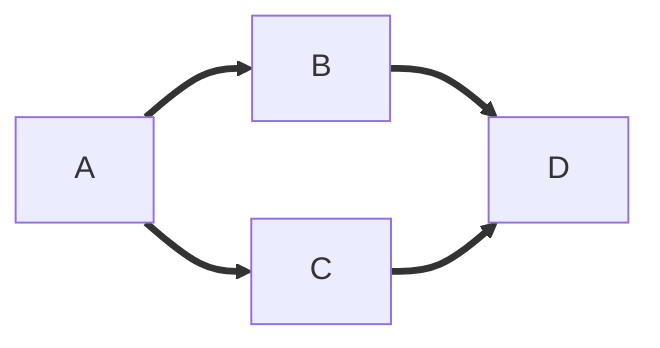
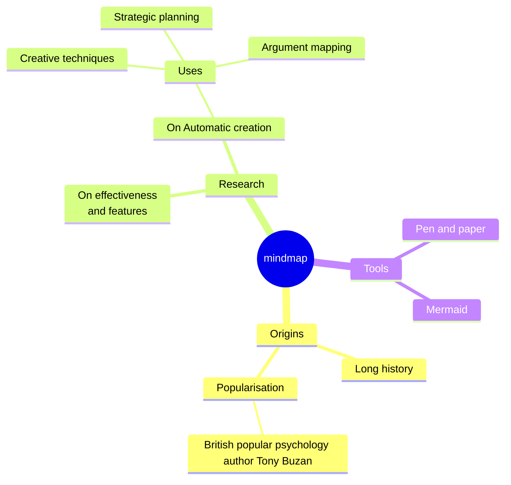
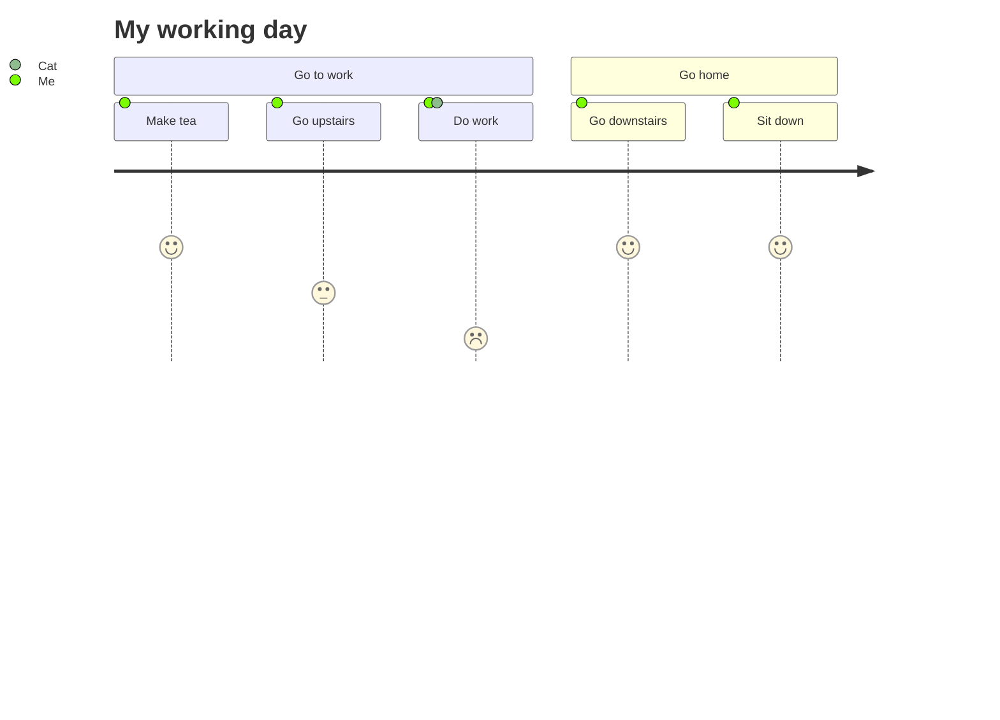
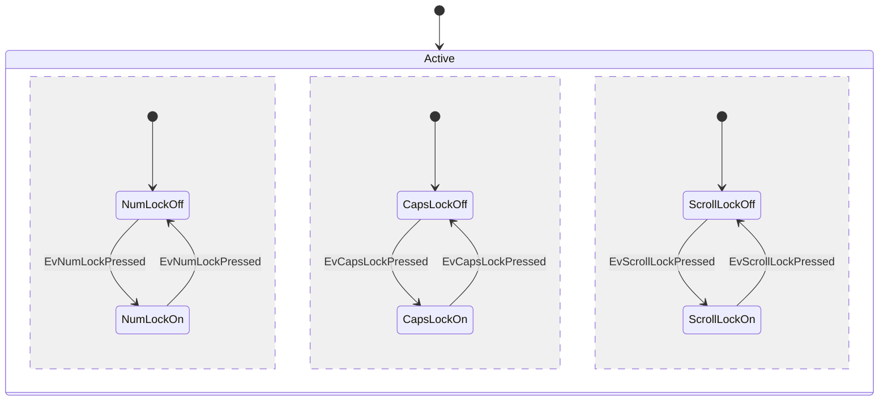
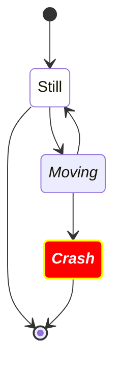
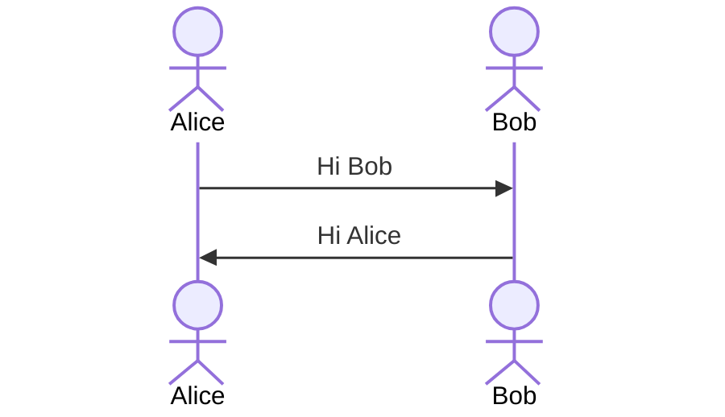
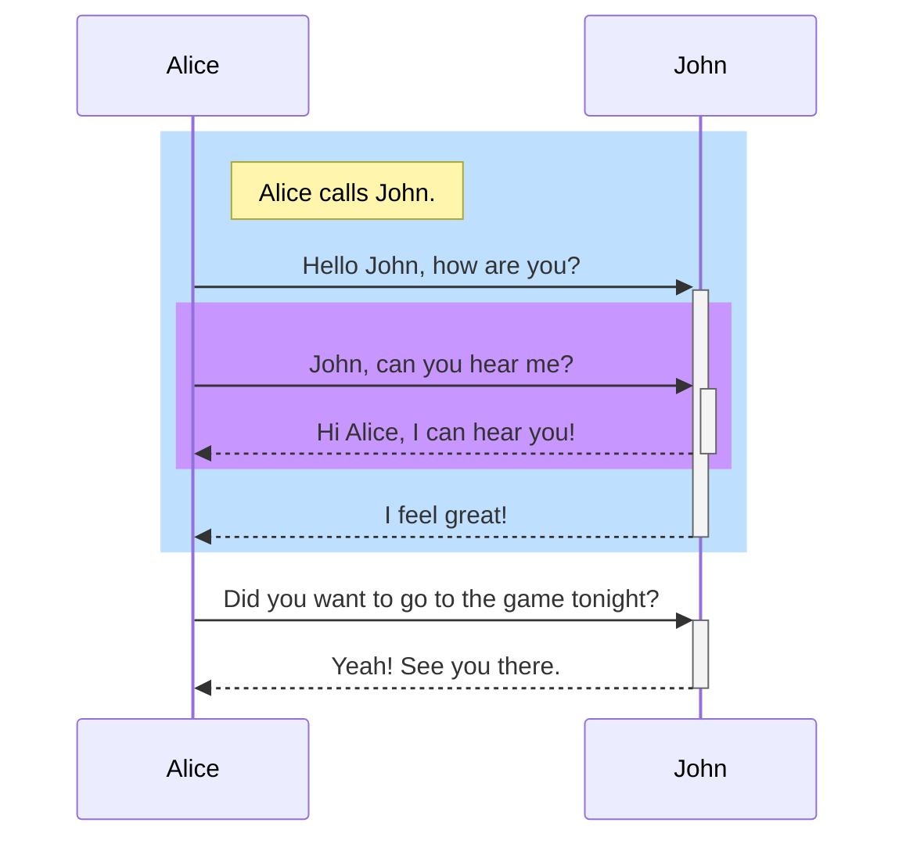

|      |      |      |
| ---- | ---- | ---- |
|      |      |      |
|      |      |      |
|      |      |      |
|      |      |      |
|      |      |      |


```sequence
Alice->Bob: Hello Bob, how are you?
Note right of Bob: Bob thinks
Bob-->Alice: I am good thanks!
```


```
请作为一个mermaid活动图生成器,你需要根据我的提示内容生成一个持续交付原理图，并输出相应的mermaid代码
```











stateDiagram-v2













2、ChatGPT指令大全-BestPrompts

https://www.doustudy.com/h5/#/pages/index/index


3、ChatGPT 提示语大全-ChatGPT Prompts

https://prompts.fresns.cn/


### ChatGPT知识库

ChatGPT知识库，一个Notion文档，收集了关于ChatGPT相关知识，包括ChatGPT入门指南、ChatGPT浏览器插件、ChatGPT终极指南和500+最佳ChatGPT提示，感兴趣的可以前往学习。

https://chatgpt.moyucm.xyz/102f0a2a6dd649a0a69a1ebebed3a965


