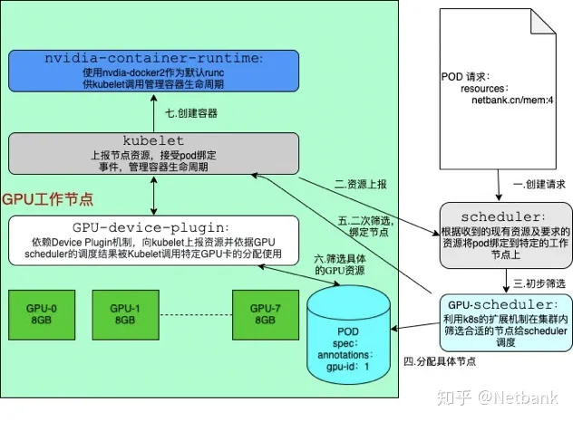
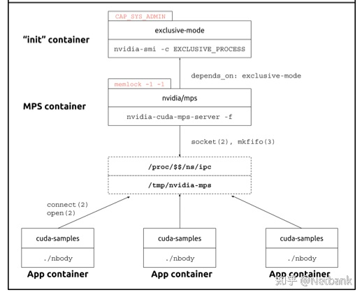
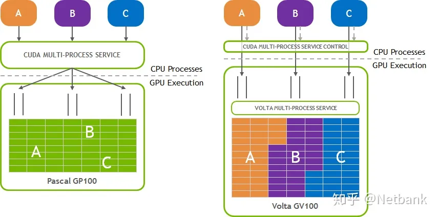
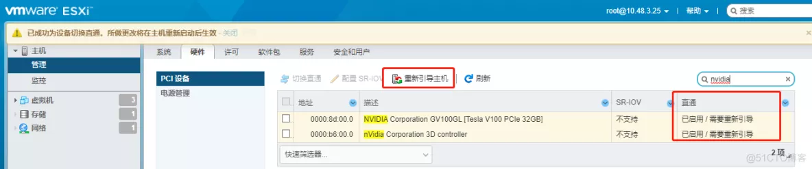
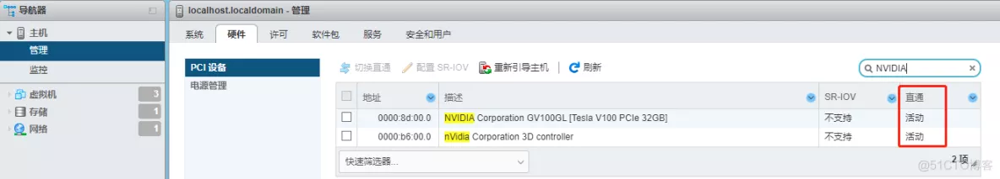
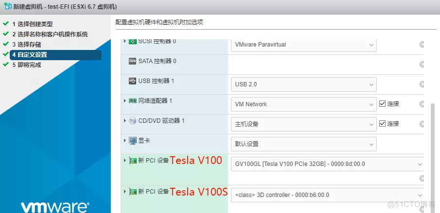
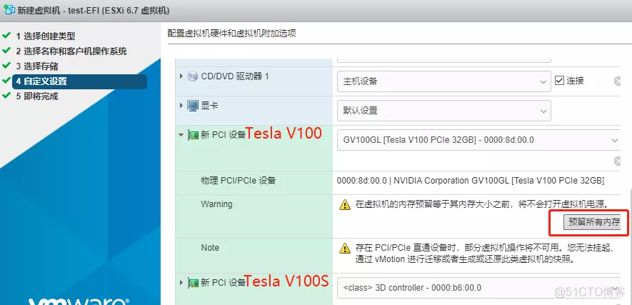
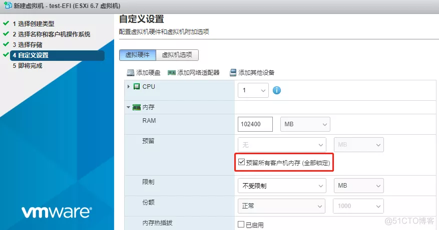
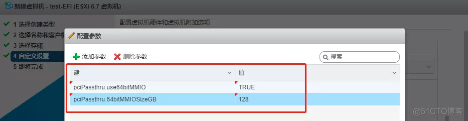
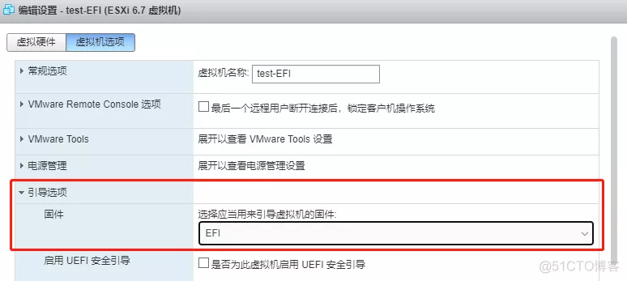

# GPU在容器云中的方案及使用

keyword: GPU,分布式,容器云

K8s | GPU 管理和 Device Plugin 工作机制 :https://www.cnblogs.com/zhaowei121/p/12196320.html


### 问题根源需求

在使用容器云调度资源场景下，我们可以请求并限制特定配额的CPU及内存供于容器创建使用，K8S调度器会将Pod绑定到资源合适的节点上；但对于现实使用场景原生资源的调度能力仍然不能满足现有的用户，其他特定资源例如GPU、IB卡、硬加密狗等也是迫切需要的，用户希望特定资源也可以被调度工具发现、监管、分配并最终使用。

GPU卡作为重要的计算资源不管是在算法训练还是预测上都不可或缺，而对于常见的算法训练平台或智能业务平台都有往容器迁移演进的趋势，此时如何更好的利用GPU资源成了容器云平台需要解决的问题。

所以可以看出需要解决的问题主要是一下三个方面：

1.资源管理：调度器可以发现并调度GPU资源；

2.资源限制隔离：运行在同一张卡上的GPU资源可以限制在配额之内；

3.资源算力损耗较少：同等算力的GPU资源计算能力不出现明显衰减；

### 解决方案

目前K8S官方对于如何共享单张GPU资源没有很好的解决方案，而对于使用多张GPU也停留在整张GPU卡作为调度颗粒度方式，应付复杂的使用场景譬如集群内存在多种GPU类型时仍有不足。处理复杂使用场景的GPU调度方案需要将资源多维度的标注，针对这种需求可以做如下处理：

1.以显存为单位上报资源并调度使用，用于应对共享单张GPU的场景；

2.以卡为单位上报资源并调度使用，用于应对多卡加速计算场景；

3.以类型为标签标注节点，尽量在同一节点安装相同GPU；

同时用户对于使用特型资源都不太愿意修改K8S原生代码，我们可以利用K8S现有的机制来避免对主干代码的侵入，如下：

1.Extended Resource机制：用于定义GPU资源；

2.Scheduler Extender机制：用于对GPU资源进行调度；

3.Device Plugin机制：用于上报、监管和分配GPU资源；

### 方案设计迭代

计划分三步迭代：

### 一、初步卡共享可行

已实现以显存/卡作为调度颗粒的资源上报使用，用户可以在该方案下在单张GPU上运行多个Pod和将多卡同时供单个Pod使用。

### 二、多类型GPU集群调度

需要支持多类型GPU调度使用，根据请求类型调度到特定节点上运行；同一节点上显存资源及卡资源联动，避免被以显存分配的卡重分配给卡单位的调度请求。

*完成以上两部迭代后，主要架构如下：*





### 三、GPU卡内配额限制

对于共享单张卡都无可避免的会出现计算效率下降的问题，此时可以利用Nvida官方提供的MPS接口，开启该功能可以运行多个进程在GPU上叠加提供利用率，减少了GPU上下文存储与切换，降低了调度带来的开销。需要注意的是容器内使用MPS需要GPU架构高于volta，runc默认为nvidia。对于配额的限制前期还是建议利用应用程序自己的机制来实现。在容器环境中开启MPS功能将根据一下来实现：





需要注意的时Nvidia在Volta 架构引入了新的 MPS 功能。与 Volta GPU 前的 MPS 相比，Volta MPS 提供了一些关键改进：

- Volta MPS 客户端直接向 GPU 提交工作，而无需通过 MPS 服务器。
- 每个 Volta MPS 客户端都拥有自己的 GPU 地址空间，而不是与所有其他 MPS 客户端共享 GPU 地址空间。
- Volta MPS 支持为服务质量 （QoS） 提供有限的执行资源资源。

Volta前架构与Volta机构GPU使用MPS对比：



### GPU在K8S中使用的全流程演示

要求：

1.节点有GPU资源

2.docker >=1.12

3.K8S >=1.10

### 一、安装Nvidia驱动及CUDA

驱动是应用使用GPU资源的前提

按照自己的需求安装特定版本的驱动（需要>=384.81），例如在ubuntu1604上安装CUDA10.2的驱动可以参考一下：

```text
$ wget http://developer.download.nvidia.com/compute/cuda/10.2/Prod/local_installers/cuda_10.2.89_440.33.01_linux.run
$ sudo sh cuda_10.2.89_440.33.01_linux.run
```

安装完成后，可以用一下命令确认：

```text
$ nvidia-smi
```

### 二、部署安装nvidia-docker2

NVIDIA 容器工具包允许用户构建和运行 GPU 加速 Docker 容器。该工具包包括一个容器运行时[库](https://link.zhihu.com/?target=https%3A//github.com/NVIDIA/libnvidia-container)和实用程序，用于自动配置容器以利用 NVIDIA GPU。

可以参考一下安装：

```text
distribution=$(. /etc/os-release;echo $ID$VERSION_ID)
curl -s -L https://nvidia.github.io/nvidia-docker/gpgkey | sudo apt-key add -
curl -s -L https://nvidia.github.io/nvidia-docker/$distribution/nvidia-docker.list | sudo tee /etc/apt/sources.list.d/nvidia-docker.list

sudo apt-get update && sudo apt-get install -y nvidia-container-toolkit
sudo systemctl restart docker
```

安装完成后验证是否已成功可以使用：

```text
docker run --gpus all nvidia/cuda:9.0-base nvidia-smi
```

### 三、切换runtime为nvidia-container-runtime

通过修改Docker的Runtime为nvidia runtime工作，当我们执行 `nvidia-docker create` 或者 `nvidia-docker run` 时，它会默认加上 `--runtime=nvidia` 参数。将runtime指定为nvidia。为了方便使用，可以直接修改Docker daemon 的启动参数，修改默认的 Runtime为：

```text
cat /etc/docker/daemon.json
{
    "default-runtime": "nvidia",
    "runtimes": {
        "nvidia": {
            "path": "/usr/bin/nvidia-container-runtime",
            "runtimeArgs": []
        }
    }
}
```

然后重启docker

### 四、部署GPU-Scheduler及开启K8S相关功能

使用GPU-Scheduler需要更改原生调度启动参数，利用K8S的扩展机制，在全局调度器筛选绑定的时候查找某个节点的特定GPU卡是否能够提供足够的显存，并且在绑定时将GPU分配结果通过annotation记录到Pod Spec以供后续检查分配结果。添加以下：

```text
- --policy-config-file=/etc/kubernetes/scheduler-policy-config.json
```

scheduler-policy-config.json的具体内容为：

```text
{
  "kind": "Policy",
  "apiVersion": "v1",
  "extenders": [
    {
      "urlPrefix": "http://127.0.0.1:32766/gpushare-scheduler",
      "filterVerb": "filter",
      "bindVerb":   "bind",
      "enableHttps": false,
      "nodeCacheCapable": true,
      "managedResources": [
        {
          "name": "aliyun.com/gpu-mem",
          "ignoredByScheduler": false
        }
      ],
      "ignorable": false
    }
  ]
}
```

待调度组件正常启动后，再部署GPU-Scheduler：

```text
---
kind: ClusterRole
apiVersion: rbac.authorization.k8s.io/v1
metadata:
  name: gpushare-schd-extender
rules:
- apiGroups:
  - ""
  resources:
  - nodes
  verbs:
  - get
  - list
  - watch
- apiGroups:
  - ""
  resources:
  - events
  verbs:
  - create
  - patch
- apiGroups:
  - ""
  resources:
  - pods
  verbs:
  - update
  - patch
  - get
  - list
  - watch
- apiGroups:
  - ""
  resources:
  - bindings
  - pods/binding
  verbs:
  - create
---
apiVersion: v1
kind: ServiceAccount
metadata:
  name: gpushare-schd-extender
  namespace: kube-system
---
kind: ClusterRoleBinding
apiVersion: rbac.authorization.k8s.io/v1
metadata:
  name: gpushare-schd-extender
  namespace: kube-system
roleRef:
  apiGroup: rbac.authorization.k8s.io
  kind: ClusterRole
  name: gpushare-schd-extender
subjects:
- kind: ServiceAccount
  name: gpushare-schd-extender
  namespace: kube-system

# deployment yaml
---
kind: Deployment
apiVersion: extensions/v1beta1
metadata:
  name: gpushare-schd-extender
  namespace: kube-system
spec:
  replicas: 1
  strategy:
    type: Recreate
  template:
    metadata:
      labels:
        app: gpushare
        component: gpushare-schd-extender
      annotations:
        scheduler.alpha.kubernetes.io/critical-pod: ''
    spec:
      hostNetwork: true
      tolerations:
      - effect: NoSchedule
        operator: Exists
        key: node-role.kubernetes.io/master
      - effect: NoSchedule
        operator: Exists
        key: node.cloudprovider.kubernetes.io/uninitialized
      serviceAccount: gpushare-schd-extender
      containers:
        - name: gpushare-schd-extender
          image: registry.cn-hangzhou.aliyuncs.com/acs/k8s-gpushare-schd-extender:1.11-d170d8a
          env:
          - name: LOG_LEVEL
            value: debug
          - name: PORT
            value: "12345"

# service.yaml
---
apiVersion: v1
kind: Service
metadata:
  name: gpushare-schd-extender
  namespace: kube-system
  labels:
    app: gpushare
    component: gpushare-schd-extender
spec:
  type: NodePort
  ports:
  - port: 12345
    name: http
    targetPort: 12345
    nodePort: 32766
  selector:
    # select app=ingress-nginx pods
    app: gpushare
    component: gpushare-schd-extender
```

### 五、简单部署GPUshare-device-plugin确认可行

GPUshare-device-plugi是开源的GPU资源上报组件，利用Device Plugin机制，由Kubelet负责调度GPU卡分配，依据GPU-Scheduler分配结果执行。可以用来简单的部署测试下是否已经可使用：

```text
kind: DaemonSet
metadata:
  name: gpushare-device-plugin-ds
  namespace: kube-system
spec:
  template:
    metadata:
      annotations:
        scheduler.alpha.kubernetes.io/critical-pod: ""
      labels:
        component: gpushare-device-plugin
        app: gpushare
        name: gpushare-device-plugin-ds
    spec:
      serviceAccount: gpushare-device-plugin
      hostNetwork: true
      nodeSelector:
        gpushare: "true"
      containers:
      - image: registry.cn-hangzhou.aliyuncs.com/acs/k8s-gpushare-plugin:v2-1.11-aff8a23
        name: gpushare
        command:
          - gpushare-device-plugin-v2
          - -logtostderr
          - --v=5
          - --memory-unit=GiB
          - --mps=true
        resources:
          limits:
            memory: "300Mi"
            cpu: "1"
          requests:
            memory: "300Mi"
            cpu: "1"
        env:
        - name: KUBECONFIG
          value: /etc/kubernetes/kubelet.conf
        - name: NODE_NAME
          valueFrom:
            fieldRef:
              fieldPath: spec.nodeName
        securityContext:
          allowPrivilegeEscalation: false
          capabilities:
            drop: ["ALL"]
        volumeMounts:
          - name: device-plugin
            mountPath: /var/lib/kubelet/device-plugins
      volumes:
        - name: device-plugin
          hostPath:
            path: /var/lib/kubelet/device-plugins
---
kind: ClusterRole
apiVersion: rbac.authorization.k8s.io/v1
metadata:
  name: gpushare-device-plugin
rules:
- apiGroups:
  - ""
  resources:
  - nodes
  verbs:
  - get
  - list
  - watch
- apiGroups:
  - ""
  resources:
  - events
  verbs:
  - create
  - patch
- apiGroups:
  - ""
  resources:
  - pods
  verbs:
  - update
  - patch
  - get
  - list
  - watch
- apiGroups:
  - ""
  resources:
  - nodes/status
  verbs:
  - patch
  - update
---
apiVersion: v1
kind: ServiceAccount
metadata:
  name: gpushare-device-plugin
  namespace: kube-system
---
kind: ClusterRoleBinding
apiVersion: rbac.authorization.k8s.io/v1
metadata:
  name: gpushare-device-plugin
  namespace: kube-system
roleRef:
  apiGroup: rbac.authorization.k8s.io
  kind: ClusterRole
  name: gpushare-device-plugin
subjects:
- kind: ServiceAccount
  name: gpushare-device-plugin
  namespace: kube-system
$ kubectl create -f gpu.yml
```

使用kubectl命令确认节点内已经有GPU资源：[http://aliyun.com/gpu-mem](https://link.zhihu.com/?target=http%3A//aliyun.com/gpu-mem) 后就可以尝试部署一个服务看是否正常：

```text
apiVersion: apps/v1
kind: Deployment
metadata:
  name: gpu-1
  labels:
    app: gpu-1
spec:
  replicas: 1
  selector:
    matchLabels:
      app: gpu-1
  template:
    metadata:
      labels:
        app: gpu-1

    spec:
      containers:
      - name: gpu-1
        image: bvlc/caffe:gpu
        command: ["/bin/sh"]
        args: ["-c","while true;do echo hello;sleep 1;done"]
        resources:
          limits:
            # GiB
            aliyun.com/gpu-mem: 1
```

如果Pod调度成功且可以在容器内正常调用GPU说明已经可以使用。

### 总结

方案在已成功验证步骤一情况下，结合现有资料说明发展路径是可行，后续的步骤是具体实现上的精力花费。

## 参考：

- [https://github.com/NVIDIA/nvidia-docker/wiki/MPS-(EXPERIMENTAL)](https://link.zhihu.com/?target=https%3A//github.com/NVIDIA/nvidia-docker/wiki/MPS-(EXPERIMENTAL))
- [https://kubernetes.io/docs/tasks/configure-pod-container/extended-resource/](https://link.zhihu.com/?target=https%3A//kubernetes.io/docs/tasks/configure-pod-container/extended-resource/)
- [https://github.com/kubernetes/community/blob/master/contributors/design-proposals/scheduling/scheduler_extender.md](https://link.zhihu.com/?target=https%3A//github.com/kubernetes/community/blob/master/contributors/design-proposals/scheduling/scheduler_extender.md)
- [https://docs.nvidia.com/deploy/mps/#topic_5_2_5](https://link.zhihu.com/?target=https%3A//docs.nvidia.com/deploy/mps/%23topic_5_2_5)
- [https://kubernetes.io/docs/concepts/extend-kubernetes/compute-storage-net/device-plugins/](https://link.zhihu.com/?target=https%3A//kubernetes.io/docs/concepts/extend-kubernetes/compute-storage-net/device-plugins/)
- [https://github.com/NVIDIA/k8s-device-plugin](https://link.zhihu.com/?target=https%3A//github.com/NVIDIA/k8s-device-plugin)
- [https://github.com/NVIDIA/nvidia-docker](https://link.zhihu.com/?target=https%3A//github.com/NVIDIA/nvidia-docker)
- [https://github.com/AliyunContainerService/gpushare-scheduler-extender/blob/master/docs/install.md](https://link.zhihu.com/?target=https%3A//github.com/AliyunContainerService/gpushare-scheduler-extender/blob/master/docs/install.md)

# Error 802: system not yet initialized

解决nvcc、驱动正常，但GPU无法正常使用问题

容器里使用cuda报错

```shell
root@13c785a7f060:/workspace/unet3d# python -c "import torch; print(torch.cuda.is_available())"
/opt/conda/lib/python3.8/site-packages/torch/cuda/__init__.py:52: UserWarning: CUDA initialization: Unexpected error from cudaGetDeviceCount(). Did you run some cuda functions before calling NumCudaDevices() that might have already set an error? Error 802: system not yet initialized (Triggered internally at  /opt/conda/conda-bld/pytorch_1607370172916/work/c10/cuda/CUDAFunctions.cpp:100.)
  return torch._C._cuda_getDeviceCount() > 0
False
```


https://blog.csdn.net/ZXF_1991/article/details/129855713

引言
在使用NVIDIA显卡(V100/A100/A30等)时，需要安装对应的驱动，但是有时还要安装与驱动版本对应的 nvidia-fabricmanager 服务，使 GPU 卡间能够通过NVSwitch互联。

问题
当报错信息为以下情况时需要安装nvidia-fabricmanager 服务

ubuntu安装nvidia-fabricmanager


```sh
version=470.103.01  #已经安装的驱动版本
main_version=$(echo $version | awk -F '.' '{print $1}')
apt-get update
apt-get -y install nvidia-fabricmanager-${main_version}=${version}-*

```

CentOS 安装nvidia-fabricmanager


```sh
version=470.103.01 #已经安装的驱动版本
yum -y install yum-utils
yum-config-manager --add-repo https://developer.download.nvidia.com/compute/cuda/repos/rhel7/x86_64/cuda-rhel7.repo
yum install -y nvidia-fabric-manager-${version}-1
```


查验安装结果
启动服务

```sh
sudo systemctl start nvidia-fabricmanager
```


查看状态

```sh
sudo systemctl status nvidia-fabricmanager
```

添加开机启动

```sh
sudo systemctl enable nvidia-fabricmanager
```


查看 cuda 

```sh
python -c "import torch; print(torch.cuda.is_available())"
python -c "import torch; print(torch.version.cuda)"
```


# cuda和驱动版本

https://docs.nvidia.com/cuda/cuda-toolkit-release-notes/index.html


# [安装GPU驱动](ubuntu.md)


| 虚拟化   | 显卡        | 系统         |
| -------- | ----------- | ------------ |
| EXSI 6.7 | RTX 2080 Ti | Ubuntu 20.04 |
|          |             |              |
|          |             |              |

## 物理机显卡直通

物理机配置
首先开机进入bios，提前修改物理机bios设置：

Above 4G decoding - Enable
Intel Virtualization Technology for Directed I/O (VT-d) - Enable
MMIO High Base - 默认56T（若为ESXi 6.5以下版本注意修改为4G-16T之间的值，如4T）


GPU 切换直通模式
 安装完ESXi软件后，首先需要将GPU切换为直通模式，切换方法为：导航界面选择管理—>硬件—>PCI设备，搜索框输入nvidia筛选出GPU设备，勾选后，点击切换直通。


GPU切换直通后，需要重新引导主机使配置生效：



重新引导主机后，GPU直通变为活动状态，表示GPU切换直通成功。




如图，添加两块GPU，分别为Tesla V100和Tesla V100S，并在新PCI设备选项下点击预留所有内存。







修改虚拟机内存

 虚拟硬件—>内存，建议设置最小内存为虚拟机所分配GPU显存总大小的1.5倍。确保已勾选预留所有客户机内存(全部锁定)





编辑虚拟机选项、高级、配置参数，添加如下参数

```
hypervisor.cpuid.v0 = "FALSE"
```





修改虚拟机引导选项

编辑虚拟机，修改虚拟机选项—>引导选项为EFI, 关闭UEFI安全引导




安装系统


```
sudo apt-get update   #更新软件列表
sudo apt-get install -y g++
sudo apt-get install -y gcc 
sudo apt-get install  -y  make


```


```
lsmod |grep -i nouveau
```


关闭nouveau

> sudo vim /etc/modprobe.d/blacklist.conf

```
blacklist nouveau
blacklist lbm-nouveau
options nouveau modeset=0
alias nouveau off
alias lbm-nouveau off

```


```sh
sudo update-initramfs -u
```


```sh
reboot
```


```sh
lsmod | grep nouveau
```


下载460包

https://http.download.nvidia.com/XFree86/Linux-x86_64/460.91.03/

```sh
sudo ./NVIDIA-Linux-x86_64-460.91.03.run -no-x-check -no-nouveau-check -no-opengl-files
```


---

> ```shell
> appuser@newkn1:~$ sudo ubuntu-drivers devices
> ERROR:root:could not open aplay -l
> Traceback (most recent call last):
> File "/usr/share/ubuntu-drivers-common/detect/sl-modem.py", line 35, in detect
>  aplay = subprocess.Popen(
> File "/usr/lib/python3.8/subprocess.py", line 858, in __init__
>  self._execute_child(args, executable, preexec_fn, close_fds,
> File "/usr/lib/python3.8/subprocess.py", line 1704, in _execute_child
>  raise child_exception_type(errno_num, err_msg, err_filename)
> FileNotFoundError: [Errno 2] No such file or directory: 'aplay'
> ```
>
> 


```
sudo apt install alsa-base
```


找驱动 https://www.nvidia.com/Download/Find.aspx?lang=en-us


```sh
sudo apt install libgtk-3-0
```


```
sudo update-pciids
```


```
apt install ubuntu-drivers-common
```

完全卸载NAVIDIA驱动
如果想卸载NAVIDIA驱动，使用附加驱动的方式只能切换驱动，但卸载不了驱动，只能通过命令的方式卸载：

```
sudo apt-get -y --purge remove nvidia*
sudo apt-get y --purge remove "*nvidia*"
sudo apt-get -y --purge remove "*cublas*" 
sudo apt-get -y --purge remove "cuda*"

sudo apt-get -y --purge nvidia*

sudo update-initramfs -u
```


```
sudo apt-get remove nvidia-*
```


下载460包

https://http.download.nvidia.com/XFree86/Linux-x86_64/460.91.03/


PS:


https://blog.csdn.net/qq_34525916/article/details/110953980

https://blog.csdn.net/qq_46107892/article/details/122616172

https://yukihane.work/li-gong/nvidia-ubuntu-laptop

https://blog.51cto.com/zaa47/2596875


https://hslxy.top/index.php/2022/07/21/esxi6-7ubuntu20-043080直通配置/


https://www.zhangfangzhou.cn/esxi-2080ti-passthrough.html ESXi7u1设置NVIDIA GEFORCE RTX 2080TI显卡直通（passthrough）


https://github.com/OrangeSpatial/documents/blob/main/Ubuntu安装rtx%202080ti%20显卡.md


# CUDA

https://blog.csdn.net/ziqibit/article/details/129935737

```
wget https://developer.download.nvidia.com/compute/cuda/repos/ubuntu2004/x86_64/cuda-ubuntu2004.pin
sudo mv cuda-ubuntu2004.pin /etc/apt/preferences.d/cuda-repository-pin-600
wget https://developer.download.nvidia.com/compute/cuda/12.1.0/local_installers/cuda-repo-ubuntu2004-12-1-local_12.1.0-530.30.02-1_amd64.deb
sudo dpkg -i cuda-repo-ubuntu2004-12-1-local_12.1.0-530.30.02-1_amd64.deb
sudo cp /var/cuda-repo-ubuntu2004-12-1-local/cuda-*-keyring.gpg /usr/share/keyrings/
sudo apt-get update
sudo apt-get -y install cuda
```


cuda会装 530驱动，要手动卸载装460

# [安装GPU驱动](ubuntu.md)


# gpu k8s

Nvidia  device plugin    [github](https://github.com/NVIDIA/k8s-device-plugin)

gpu-operator  [github](https://github.com/NVIDIA/gpu-operator)

|          | OrionX                                                       | [Nvidia](https://developer.nvidia.com/zh-cn/blog/nvidia-gpu-operator-simplifying-gpu-management-in-kubernetes/) | KubeSphere                                            | [TKG](https://www.chimsen.com/?p=1695) | [ Elastic GPU](https://www.cnblogs.com/tencent-cloud-native/p/16168666.html) |
| -------- | ------------------------------------------------------------ | ------------------------------------------------------------ | ----------------------------------------------------- | -------------------------------------- | ------------------------------------------------------------ |
| K8S      | [Y](https://virtaitech.com/development/index?doc=4r4gnqv5j9qgw70njj2a2jnzma) | [Y](https://github.com/NVIDIA/k8s-device-plugin)             | [Y](https://www.kubesphere.io/zh/blogs/gpu-operator/) |                                        | Y                                                            |
| 灵活度   | Y                                                            | N                                                            | N                                                     |                                        | Y                                                            |
| vgpu     | 最小资源单位为vgpu/gmem                                      | pod独占最小资源单位为一张卡                                  |                                                       |                                        | 最小资源单位为vgpu/gmem                                      |
| 远程调用 | 支持                                                         | 不支持,pod必须在gpu机器上                                    |                                                       |                                        | 不支持                                                       |

概念:  vGPU, GPU池化

需求: GPU 细粒度算力与显存分配调度

技术: qGPU 虚拟化、vCUDA、或是 GPU 远端池化


## OrionX

### 已知问题

下面列出当前版本不支持的CUDA库、工具以及使用模式

- 不支持CUDA应用程序使用 Unified Memory
- 不支持 nvidia-smi 工具
- 不支持OpenGL相关接口，不支持图形渲染相关接口
- 有限支持CUDA IPC，对部分程序可能不支持。
- 部分应用需要从源码重新编译以保证动态链接 CUDA 库


## Nvidia (灵活性不好)

> *   GPU 资源只能在 limits 中指定，即：
>     *   您可以只指定 GPU limits 而不指定 requests，因为 Kubernetes 会默认使用 GPU limits 的值作为 GPU requests 的值；
>     *   您可以同时指定 GPU limits 和 requests，但是两者必须相等；
>     *   您不能只指定 GPU requests 而不指定 GPU limits；
> *   容器（容器组）不能共享 GPU。GPU 也不能超售（GPU limits 的总和不能超过实际 GPU 资源的总和）；
> *   每个容器可以请求一个或多个 GPU，不能请求一个 GPU 的一部分（例如 0.5 个 GPU）。

*   GPU 资源只能在 limits 中指定，即：
    *   您可以只指定 GPU limits 而不指定 requests，因为 Kubernetes 会默认使用 GPU limits 的值作为 GPU requests 的值；
    *   您可以同时指定 GPU limits 和 requests，但是两者必须相等；
    *   您不能只指定 GPU requests 而不指定 GPU limits；
*   容器（容器组）不能共享 GPU。GPU 也不能超售（GPU limits 的总和不能超过实际 GPU 资源的总和）；
*   每个容器可以请求一个或多个 GPU，不能请求一个 GPU 的一部分（例如 0.5 个 GPU）。


# [阿里\腾讯\华为,三家对比](https://www.flftuu.com/2020/11/14/k8s集群GPU调研报告%2f)

| 厂商   | nvidia runtime依赖 | 内存共享 | 内存隔离 | 算力隔离 | 采用技术                                                 | 优点                                                         | 缺点                                                   |
| :----- | :----------------- | :------- | :------- | :------- | :------------------------------------------------------- | :----------------------------------------------------------- | :----------------------------------------------------- |
| 阿里云 | 依赖               | 支持     | 支持     | 支持     | cGPU（自研内核驱动）+ device plugin + scheduler extender | 优点：无需重编译AI应用，无需替换CUDA库，升级CUDA、cuDNN的版本后无需重新配置；且基本无性能损耗（官方宣称） | 缺点：开发难度相对较高                                 |
| 腾讯云 | 不依赖             | 支持     | 支持     | 支持     | cuda调用封装 + device plugin + scheduler extender        | 优点：开发难度相对较低                                       | 缺点：驱动和加速库的兼容性依赖于厂商存在约5%的性能损耗 |
| 华为云 | 依赖               | 支持     | 不支持   | 不支持   | device plugin                                            |                                                              |                                                        |

腾讯qGPU: https://cloud.tencent.com/document/product/560/66232

阿里cGPU: https://help.aliyun.com/document_detail/203715.html?spm=a2c4g.155040.0.0.2d484cbcT67uD6


https://blog.csdn.net/ikanaide/article/details/120864852

https://www.shouxicto.com/article/4459.html

https://kubernetes.io/docs/tasks/manage-gpus/scheduling-gpus/