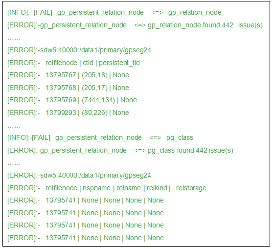
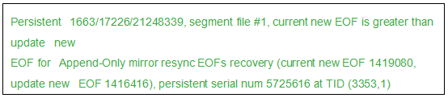
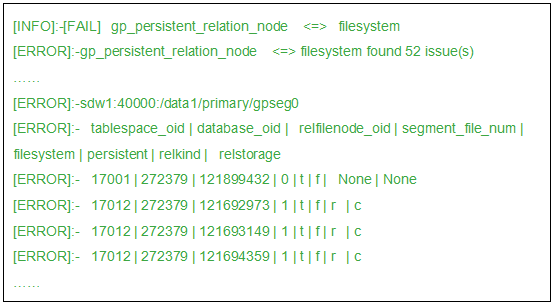

[toc]

# 管理员


|              |                                                              |                                                              |
| ------------ | ------------------------------------------------------------ | ------------------------------------------------------------ |
| MPP架构      | 多处理器协同执行一个操作、使用系统所有资源并行处理一个查询   |                                                              |
| 追加优化     |                                                              |                                                              |
| interconnect | B默认情况下，Interconnect使用带流控制的用户数据包协议（UDPIFC）在网络上发送消息。 Greenplum软件在UDP之上执行包验证。这意味着其可靠性等效于传输控制协议（TCP）且性能和可扩展性要超过TCP。 如果Interconnect被改为TCP，Greenplum数据库会有1000个Segment实例的可扩展性限制。对于Interconnect的默认协议UDPIFC则不存在这种限制。 | postgresql.conf<br>gp_interconnect_type=udpifc --> gp_interconnect_type=tcp |
| 扩容         | 每个表或分区在扩容期间是无法进行读写操作的                   |                                                              |


| greenplum 对比 | postgres |      |
| -------------- | -------- | ---- |
|                |          |      |
|                |          |      |
|                |          |      |


[rpm下载](https://network.pivotal.io/products/vmware-tanzu-greenplum#/releases/1193700/file_groups/10395)


```
fcopy
```


# best_practices


A newer version of this documentation is available. Use the version menu above to view the most up-to-date release of the Greenplum 6.x documentation.

# System Configuration

Requirements and best practices for system administrators who are configuring Greenplum Database cluster hosts.

Configuration of the Greenplum Database cluster is usually performed as root.

## Configuring the Timezone

Greenplum Database selects a timezone to use from a set of internally stored PostgreSQL timezones. The available PostgreSQL timezones are taken from the Internet Assigned Numbers Authority (IANA) Time Zone Database, and Greenplum Database updates its list of available timezones as necessary when the IANA database changes for PostgreSQL.

Greenplum selects the timezone by matching a PostgreSQL timezone with the user specified time zone, or the host system time zone if no time zone is configured. For example, when selecting a default timezone, Greenplum uses an algorithm to select a PostgreSQL timezone based on the host system timezone files. If the system timezone includes leap second information, Greenplum Database cannot match the system timezone with a PostgreSQL timezone. In this case, Greenplum Database calculates a "best match" with a PostgreSQL timezone based on information from the host system.

As a best practice, configure Greenplum Database and the host systems to use a known, supported timezone. This sets the timezone for the Greenplum Database master and segment instances, and prevents Greenplum Database from recalculating a "best match" timezone each time the cluster is restarted, using the current system timezone and Greenplum timezone files (which may have been updated from the IANA database since the last restart). Use the gpconfig utility to show and set the Greenplum Database timezone. For example, these commands show the Greenplum Database timezone and set the timezone to US/Pacific.

```
# gpconfig -s TimeZone
# gpconfig -c TimeZone -v 'US/Pacific'
```

You must restart Greenplum Database after changing the timezone. The command gpstop -ra restarts Greenplum Database. The catalog view pg_timezone_names provides Greenplum Database timezone information.

## File System

XFS is the file system used for Greenplum Database data directories. On RHEL/CentOS systems, mount XFS volumes with the following mount options:

```
rw,nodev,noatime,nobarrier,inode64
```

The nobarrier option is not supported on Ubuntu systems. Use only the options:

```
rw,nodev,noatime,inode64
```

## Port Configuration

See the [recommended OS parameter settings](https://gpdb.docs.pivotal.io/6-3/install_guide/prep_os.html#topic3) in the Greenplum Database Installation Guide for further details.

Set up ip_local_port_range so it does not conflict with the Greenplum Database port ranges. For example, setting this range in /etc/sysctl.conf:

```
net.ipv4.ip_local_port_range = 10000  65535
```

you could set the Greenplum Database base port numbers to these values.

```
PORT_BASE = 6000
MIRROR_PORT_BASE = 7000
```

See the [Recommended OS Parameters Settings](https://gpdb.docs.pivotal.io/6-3/install_guide/prep_os.html#topic3) in the Greenplum Database Installation Guide for further details.

## I/O Configuration

Set the blockdev read-ahead size to 16384 on the devices that contain data directories. This command sets the read-ahead size for /dev/sdb.

```
# /sbin/blockdev --setra 16384 /dev/sdb
```

This command returns the read-ahead size for /dev/sdb.

```
# /sbin/blockdev --getra /dev/sdb
16384
```

See the [Recommended OS Parameters Settings](https://gpdb.docs.pivotal.io/6-3/install_guide/prep_os.html#topic3) in the Greenplum Database Installation Guide for further details.

The deadline IO scheduler should be set for all data directory devices.

```
 # cat /sys/block/sdb/queue/scheduler
 noop anticipatory [deadline] cfq 
```

The maximum number of OS files and processes should be increased in the /etc/security/limits.conf file.

```
* soft  nofile 524288
* hard  nofile 524288
* soft  nproc 131072
* hard  nproc 131072
```

Enable core files output to a known location and make sure limits.conf allows core files.

```
kernel.core_pattern = /var/core/core.%h.%t
# grep core /etc/security/limits.conf  
* soft  core unlimited
```

## OS Memory Configuration

The Linux sysctl vm.overcommit_memory and vm.overcommit_ratio variables affect how the operating system manages memory allocation. See the [/etc/sysctl.conf](https://gpdb.docs.pivotal.io/6-3/install_guide/prep_os.html#topic3__sysctl_file) file parameters guidelines in the Greenplum Datatabase Installation Guide for further details.

vm.overcommit_memory determines the method the OS uses for determining how much memory can be allocated to processes. This should be always set to 2, which is the only safe setting for the database.

Note: For information on configuration of overcommit memory, refer to:

- [https://en.wikipedia.org/wiki/Memory_overcommitment](https://www.google.com/url?q=https://en.wikipedia.org/wiki/Memory_overcommitment&sa=D&ust=1499719618717000&usg=AFQjCNErcHO7vErv4pn9fIhCxrR0XRiknA)
- [https://www.kernel.org/doc/Documentation/vm/overcommit-accounting](https://www.google.com/url?q=https://www.kernel.org/doc/Documentation/vm/overcommit-accounting&sa=D&ust=1499719618717000&usg=AFQjCNEmu5tZutAaN1KCSlIwz4hwqihkOQ)

vm.overcommit_ratio is the percent of RAM that is used for application processes. The default is 50 on Red Hat Enterprise Linux. See [Resource Queue Segment Memory Configuration](https://gpdb.docs.pivotal.io/6-3/best_practices/sysconfig.html#topic_dt3_fkv_r4__segment_mem_config) for a formula to calculate an optimal value.

Do not enable huge pages in the operating system.

See also [Memory and Resource Management with Resource Queues](https://gpdb.docs.pivotal.io/6-3/best_practices/workloads.html#topic_hhc_z5w_r4).

## Shared Memory Settings

Greenplum Database uses shared memory to communicate between postgres processes that are part of the same postgres instance. The following shared memory settings should be set in sysctl and are rarely modified. See the [sysctl.conf ](https://gpdb.docs.pivotal.io/6-3/install_guide/prep_os.html#topic3__sysctl_file)file parameters in the Greenplum Database Installation Guide for further details.

```
kernel.shmmax = 500000000
kernel.shmmni = 4096
kernel.shmall = 4000000000
```

## Number of Segments per Host

Determining the number of segments to execute on each segment host has immense impact on overall system performance. The segments share the host's CPU cores, memory, and NICs with each other and with other processes running on the host. Over-estimating the number of segments a server can accommodate is a common cause of suboptimal performance.

The factors that must be considered when choosing how many segments to run per host include the following:

- Number of cores
- Amount of physical RAM installed in the server
- Number of NICs
- Amount of storage attached to server
- Mixture of primary and mirror segments
- ETL processes that will run on the hosts
- Non-Greenplum processes running on the hosts

## Resource Queue Segment Memory Configuration

The gp_vmem_protect_limit server configuration parameter specifies the amount of memory that all active postgres processes for a single segment can consume at any given time. Queries that exceed this amount will fail. Use the following calculations to estimate a safe value for gp_vmem_protect_limit.

1. Calculate

    

   gp_vmem

   , the host memory available to Greenplum Database, using this formula:

   ```
   gp_vmem = ((SWAP + RAM) – (7.5GB + 0.05 * RAM)) / 1.7
   ```

   where

    

   SWAP

    

   is the host's swap space in GB and

    

   RAM

    

   is the RAM installed on the host in GB.

2. Calculate max_acting_primary_segments. This is the maximum number of primary segments that can be running on a host when mirror segments are activated due to a segment or host failure on another host in the cluster. With mirrors arranged in a 4-host block with 8 primary segments per host, for example, a single segment host failure would activate two or three mirror segments on each remaining host in the failed host's block. The max_acting_primary_segments value for this configuration is 11 (8 primary segments plus 3 mirrors activated on failure).

3. Calculate

    

   gp_vmem_protect_limit

    

   by dividing the total Greenplum Database memory by the maximum number of acting primaries:

   ```
   gp_vmem_protect_limit = gp_vmem / max_acting_primary_segments
   ```

   Convert to megabytes to find the value to set for the

    

   gp_vmem_protect_limit

    

   system configuration parameter.

For scenarios where a large number of workfiles are generated, adjust the calculation for gp_vmem to account for the workfiles:

```
gp_vmem = ((SWAP + RAM) – (7.5GB + 0.05 * RAM - (300KB * total_#_workfiles))) / 1.7
```

For information about monitoring and managing workfile usage, see the *Greenplum Database Administrator Guide*.

You can calculate the value of the vm.overcommit_ratio operating system parameter from the value of gp_vmem:

```
vm.overcommit_ratio = (RAM - 0.026 * gp_vmem) / RAM
```

See [OS Memory Configuration](https://gpdb.docs.pivotal.io/6-3/best_practices/sysconfig.html#topic_dt3_fkv_r4__os_mem_config) for more about about vm.overcommit_ratio.

See also [Memory and Resource Management with Resource Queues](https://gpdb.docs.pivotal.io/6-3/best_practices/workloads.html#topic_hhc_z5w_r4).

## Resource Queue Statement Memory Configuration

The statement_mem server configuration parameter is the amount of memory to be allocated to any single query in a segment database. If a statement requires additional memory it will spill to disk. Calculate the value for statement_mem with the following formula:

(gp_vmem_protect_limit * .9) / max_expected_concurrent_queries

For example, for 40 concurrent queries with gp_vmem_protect_limit set to 8GB (8192MB), the calculation for statement_mem would be:

(8192MB * .9) / 40 = 184MB

Each query would be allowed 184MB of memory before it must spill to disk.

To increase statement_mem safely you must either increase gp_vmem_protect_limit or reduce the number of concurrent queries. To increase gp_vmem_protect_limit, you must add physical RAM and/or swap space, or reduce the number of segments per host.

Note that adding segment hosts to the cluster cannot help out-of-memory errors unless you use the additional hosts to decrease the number of segments per host.

Spill files are created when there is not enough memory to fit all the mapper output, usually when 80% of the buffer space is occupied.

Also, see [Resource Management](https://gpdb.docs.pivotal.io/6-3/best_practices/workloads.html#topic_hhc_z5w_r4) for best practices for managing query memory using resource queues.

## Resource Queue Spill File Configuration

Greenplum Database creates *spill files* (also called *workfiles*) on disk if a query is allocated insufficient memory to execute in memory. A single query can create no more than 100,000 spill files, by default, which is sufficient for the majority of queries.

You can control the maximum number of spill files created per query and per segment with the configuration parameter gp_workfile_limit_files_per_query. Set the parameter to 0 to allow queries to create an unlimited number of spill files. Limiting the number of spill files permitted prevents run-away queries from disrupting the system.

A query could generate a large number of spill files if not enough memory is allocated to it or if data skew is present in the queried data. If a query creates more than the specified number of spill files, Greenplum Database returns this error:

ERROR: number of workfiles per query limit exceeded

Before raising the gp_workfile_limit_files_per_query, try reducing the number of spill files by changing the query, changing the data distribution, or changing the memory configuration.

The gp_toolkit schema includes views that allow you to see information about all the queries that are currently using spill files. This information can be used for troubleshooting and for tuning queries:

- The gp_workfile_entries view contains one row for each operator using disk space for workfiles on a segment at the current time. See [How to Read Explain Plans](https://gpdb.docs.pivotal.io/6-3/best_practices/tuning_queries.html#reading_explain_plan)for information about operators.
- The gp_workfile_usage_per_query view contains one row for each query using disk space for workfiles on a segment at the current time.
- The gp_workfile_usage_per_segment view contains one row for each segment. Each row displays the total amount of disk space used for workfiles on the segment at the current time.

See the *Greenplum Database Reference Guide* for descriptions of the columns in these views.

The gp_workfile_compression configuration parameter specifies whether the spill files are compressed. It is off by default. Enabling compression can improve performance when spill files are used.

**Parent topic:** [Greenplum Database Best Practices](https://gpdb.docs.pivotal.io/6-3/best_practices/intro.html)


https://blog.csdn.net/Explorren/article/details/103636287

https://blog.51cto.com/michaelkang/2170608

https://www.cnblogs.com/zsql/p/14602612.html


# 监控


https://cloud.tencent.com/developer/article/1822708


# 三罐可乐带你读懂Greenplum的interconnect


# explain

# EXPLAIN

显示语句的查询计划。

## 概要

```
EXPLAIN [ ( option [, ...] ) ] statement
EXPLAIN [ANALYZE] [VERBOSE] statement
```

其中option可以是以下之一：

```
    ANALYZE [ boolean ]
    VERBOSE [ boolean ]
    COSTS [ boolean ]
    BUFFERS [ boolean ]
    TIMING [ boolean ]
    FORMAT { TEXT | XML | JSON | YAML }
```

## 描述

EXPLAIN显示Greenplum或Postgres优化器为提供的语句生成的查询计划。 查询计划是节点的查询树计划。 计划中的每个节点代表一个单独的操作，例如表扫描，连接，聚合或排序。

应从下至上阅读计划，因为每个节点都会向其上方的节点中发送行。 计划的最底层节点通常是表扫描操作（顺序扫描，索引扫描或位图索引扫描）。 如果查询需要连接，聚集或排序（或原始行上的其他操作），则扫描节点上方将有其他节点来执行这些操作。 最顶层的计划节点通常是Greenplum数据库motion节点（重新分发，显式重新分发，广播或收集motion）。 这些操作负责在查询处理期间在segment实例之间移动行。

EXPLAIN的输出对于计划树中的每个节点都有一行， 显示基本节点类型以及计划者为执行该计划节点而进行的以下成本估算：

- **cost** — 优化器对运行该语句要花费多长时间的猜测（以任意成本单位衡量，但通常是指磁盘页获取）。 显示了两个成本编号：可以返回第一行之前的启动成本，以及返回所有行的总成本。 请注意，总成本假定将检索所有行，但并非总是如此（例如，如果使用LIMIT）。
- **rows** — 此计划节点输出的总行数。 这通常少于计划节点处理或扫描的实际行数，反映了任何WHERE子句条件的估计选择性。 理想情况下，顶级节点估计将近似查询实际返回，更新或删除的行数。
- **width** — 此计划节点输出的所有行的总字节数。

重要的是要注意，上级节点的成本包括其所有子节点的成本。 计划的最高节点具有该计划的估计总执行成本。 这是计划者要尽量减少的数字。 同样重要的是要意识到，成本只反映查询优化器关心的事情。 特别是，成本不考虑将结果行传输到客户端所花费的时间。

EXPLAIN ANALYZE导致语句实际执行，而不仅仅是做计划。 EXPLAIN ANALYZE优化器会显示实际结果以及计划者的估计。 这对于查看优化器的估计是否接近实际很有用。 除了EXPLAIN计划中显示的信息之外，EXPLAIN ANALYZE还将显示以下附加信息：

- 运行查询所花费的总时间（以毫秒为单位）。

- 计划节点操作中涉及的*workers*（segment）数。仅计算返回行的segment。

- 操作产生最多行的segment所返回的最大行数。 如果多个segment产生相等数量的行，则结束时间最长的一个就是选择的那个。

- 为一个操作生成最多行的segment的segment ID号。

- 对于相关操作，该操作使用的

  work_mem

  。 如果

  work_mem

  不足以在内存中执行该操作，则该计划将显示有多少数据溢出到磁盘， 以及最低性能segment需要多少次数据传递。 例如：

  ```
  Work_mem used: 64K bytes avg, 64K bytes max (seg0).
  Work_mem wanted: 90K bytes avg, 90K bytes max (seg0) to abate workfile 
  I/O affecting 2 workers.
  [seg0] pass 0: 488 groups made from 488 rows; 263 rows written to 
  workfile
  [seg0] pass 1: 263 groups made from 263 rows
  ```

- 从产生最多行的segment中检索第一行所花费的时间（以毫秒为单位），以及从该segment中检索所有行所花费的总时间。 如果*<time> to first row*与*<time> to end*相同，则可以省略。

Important: 请记住，使用ANALYZE时实际上会执行该语句。 尽管EXPLAIN ANALYZE将丢弃SELECT将返回的任何输出，但是该语句的其他副作用将照常发生。 如果希望在DML语句上使用EXPLAIN ANALYZE而不让命令影响您的数据，请使用以下方法：

```
BEGIN;
EXPLAIN ANALYZE ...;
ROLLBACK;
```

仅可以指定ANALYZE和VERBOSE选项，并且只能按该顺序指定，而不要在括号中包含选项列表。

## 参数

- ANALYZE

  执行命令并显示实际运行时间和其他统计信息。 如果省略此参数，则默认为FALSE。 指定ANALYZE true可以启用它。

- VERBOSE

  显示有关计划的其他信息。 具体来说，包括计划树中每个节点的输出列列表，模式限定表和函数名称， 始终在表达式中使用范围表别名标记变量，并始终打印要显示其统计信息的每个触发器的名称。 如果省略此参数，则默认为FALSE； 指定VERBOSE true启用它。

- COSTS

  包括有关每个计划节点的估计启动成本和总成本以及估计的行数和估计的每行宽度的信息。 如果省略此参数，则默认为TRUE； 指定COSTS false禁用它。

- BUFFERS

  包括有关缓冲区使用情况的信息。 具体来说，包括命中，读取，弄脏和写入的共享块的数量，命中，读取，弄脏和写入的局部块的数量以及读写的临时块的数量。 命中表示避免读取，因为在需要时已在高速缓存中找到该块。 共享块包含来自常规表和索引的数据；本地块包含来自临时表和索引的数据； 临时块包含用于排序，哈希，物化计划节点和类似情况的短期工作数据。 被弄脏的块数表示此查询已更改的先前未修改的块数； 而写入的块数则表示此后端在查询处理期间从缓存中逐出的先前处理的块数。 上级节点显示的块数包括其所有子节点使用的块数。 在文本格式中，仅打印非零值。 仅当还启用了ANALYZE时，才可以使用此参数。 如果省略此参数，则默认为FALSE； 指定BUFFERS true启用它。

- TIMING

  在输出中包括实际的启动时间和在每个节点上花费的时间。 重复读取系统时钟的开销可能会在某些系统上显着降低查询速度， 因此，当仅需要实际的行计数而不是确切的时间时，将此参数设置为FALSE可能会很有用。 即使使用此选项关闭了节点级计时，也始终会测量整个语句的运行时间。 仅当还启用了ANALYZE时，才可以使用此参数。 默认为TRUE。

- FORMAT

  指定输出格式，可以是TEXT，XML，JSON或YAML。 非文本输出包含与文本输出格式相同的信息，但程序更易于解析。 此参数默认为TEXT。

- boolean

  指定是打开还是关闭所选选项。 您可以写入TRUE，ON或1以启用该选项， 而可以写入FALSE，OFF或0以禁用该选项。 布尔值也可以省略，在这种情况下，假定为TRUE。

- statement

  您希望查看其执行计划的任何SELECT，INSERT，UPDATE， DELETE，VALUES，EXECUTE， DECLARE或CREATE TABLE AS语句。

## 注解

为了使查询优化器在优化查询时能够做出合理的决策，应运行ANALYZE语句以记录有关表内数据分布的统计信息。 如果您尚未执行此操作（或者自上次运行ANALYZE以来，表中数据的统计分布已发生重大变化）， 则估计成本不太可能符合查询的实际属性，因此可能会选一个较差的查询计划。

在执行EXPLAIN ANALYZE命令期间运行的SQL语句从Greenplum数据库资源队列中排除。

有关查询分析的更多信息，请参阅Greenplum数据库管理员指南中的“查询分析”。 有关资源队列的更多信息，请参阅Greenplum数据库管理员指南中的“使用资源队列进行资源管理”。

## 示例

为了说明如何读取EXPLAIN查询计划，请考虑一个非常简单的查询的示例：

```
EXPLAIN SELECT * FROM names WHERE name = 'Joelle';
                                  QUERY PLAN
-------------------------------------------------------------------------------
 Gather Motion 3:1  (slice1; segments: 3)  (cost=0.00..431.27 rows=1 width=58)
   ->  Seq Scan on names  (cost=0.00..431.27 rows=1 width=58)
         Filter: (name = 'Joelle'::text)
 Optimizer: Pivotal Optimizer (GPORCA) version 3.23.0
(4 rows)
```

如果我们自下而上阅读计划，则查询优化器将从对names表的顺序扫描开始。 请注意，WHERE子句被用作过滤条件。 这意味着扫描操作将检查其扫描的每一行的条件，并仅输出通过条件的行。

扫描操作的结果将传递到*gather motion*操作。 在Greenplum数据库中，*gather motion*是将segment行发送到master。 在这种情况下，我们有3个segment实例发送到1个master实例（3：1）。 该操作在并行查询执行计划的slice1上进行。 在Greenplum数据库中，查询计划分为多个切片，以便查询计划的各个部分可以由这些segment并行处理。

该计划的估计启动成本为00.00（无成本），总成本为431.27。 优化器估计此查询将返回一行。

这是相同的查询，但成本估算被抑制：

```
EXPLAIN (COSTS FALSE) SELECT * FROM names WHERE name = 'Joelle';
                QUERY PLAN
------------------------------------------
 Gather Motion 3:1  (slice1; segments: 3)
   ->  Seq Scan on names
         Filter: (name = 'Joelle'::text)
 Optimizer: Pivotal Optimizer (GPORCA) version 3.23.0
(4 rows)
```

这是使用JSON格式的相同查询：

```
EXPLAIN (FORMAT JSON) SELECT * FROM names WHERE name = 'Joelle';
                  QUERY PLAN
-----------------------------------------------
 [                                            +
   {                                          +
     "Plan": {                                +
       "Node Type": "Gather Motion",          +
       "Senders": 3,                          +
       "Receivers": 1,                        +
       "Slice": 1,                            +
       "Segments": 3,                         +
       "Gang Type": "primary reader",         +
       "Startup Cost": 0.00,                  +
       "Total Cost": 431.27,                  +
       "Plan Rows": 1,                        +
       "Plan Width": 58,                      +
       "Plans": [                             +
         {                                    +
           "Node Type": "Seq Scan",           +
           "Parent Relationship": "Outer",    +
           "Slice": 1,                        +
           "Segments": 3,                     +
           "Gang Type": "primary reader",     +
           "Relation Name": "names",          +
           "Alias": "names",                  +
           "Startup Cost": 0.00,              +
           "Total Cost": 431.27,              +
           "Plan Rows": 1,                    +
           "Plan Width": 58,                  +
           "Filter": "(name = 'Joelle'::text)"+
         }                                    +
       ]                                      +
     },                                       +
     "Settings": {                            +
       "Optimizer": "Pivotal Optimizer (GPORCA) version 3.23.0"      +
     }                                        +
   }                                          +
 ]
(1 row)
```

如果存在索引，并且我们使用带有可索引WHERE条件的查询，则EXPLAIN可能会显示不同的计划。 此查询使用YAML格式生成带有索引扫描的计划：

```
EXPLAIN (FORMAT YAML) SELECT * FROM NAMES WHERE LOCATION='Sydney, Australia';
                          QUERY PLAN
--------------------------------------------------------------
 - Plan:                                                     +
     Node Type: "Gather Motion"                              +
     Senders: 3                                              +
     Receivers: 1                                            +
     Slice: 1                                                +
     Segments: 3                                             +
     Gang Type: "primary reader"                             +
     Startup Cost: 0.00                                      +
     Total Cost: 10.81                                       +
     Plan Rows: 10000                                        +
     Plan Width: 70                                          +
     Plans:                                                  +
       - Node Type: "Index Scan"                             +
         Parent Relationship: "Outer"                        +
         Slice: 1                                            +
         Segments: 3                                         +
         Gang Type: "primary reader"                         +
         Scan Direction: "Forward"                           +
         Index Name: "names_idx_loc"                         +
         Relation Name: "names"                              +
         Alias: "names"                                      +
         Startup Cost: 0.00                                  +
         Total Cost: 7.77                                    +
         Plan Rows: 10000                                    +
         Plan Width: 70                                      +
         Index Cond: "(location = 'Sydney, Australia'::text)"+
   Settings:                                                 +
     Optimizer: "Pivotal Optimizer (GPORCA) version 3.23.0"
(1 row)
```

## 兼容性

在SQL标准中没有定义EXPLAIN语句。

## 另见

[ANALYZE](http://docs-cn.greenplum.org/v6/ref_guide/sql_commands/ANALYZE.html#topic1)

# Join on


默认为 inner join on


# 第二篇 日常运维最佳实践


第一篇介绍了GP实施前重点应该关注前期规划及模型设计，**其实实施完运维更重要，切忌运而不维**（只让其运行而不加以维护）！


想要一个数据库长久健康的运行，离不开一个称职的DBA。


从其他数据库的DBA转为Greenplum的DBA并不是一件很困难的事，成功转成Greenplum DBA的工程师越来越多。


**1**


日常维护关注这些


现在企业客户中搭建的Greenplum集群服务器数量是越来越大，在电信行业和银行业，搭建50台服务器以上的Greenplum集群越来越多。而集群服务器数量越多也就代表故障发生率越高。作为Greenplum的DBA和运维人员，不单只关注Greenplum本身，还要关注集群中各硬件的状况，及时发现及时处理。硬盘状态、阵列卡状态、硬件告警、操作系统告警、空间使用率等都是应关注的重点。这些都可通过厂商提供的工具，编写监控程序，SNMP协议对接企业监控平台等手段提升日常巡检和监控的效率。

**
**

**针对Greenplum，DBA需要关注的重点：**


（1）**Greenplum的状态**：Standby master的同步状态往往容易被忽略。通过监控平台或者脚本程序，能够及时告警则最好。


（2）**系统表**：日常系统表维护（vacuum analyze），在系统投产时就应该配置好每天执行维护。


（3）**统计信息收集**：统计信息的准确性影响到运行效率，用户表应该及时收集统计信息。在应用程序中增加收集统计信息的处理逻辑，通过脚本定时批量收集统计信息，或者两者相结合。针对分区表日常可按需收集子分区的统计信息，可节省时间提升效率。


（4）**表倾斜**：表倾斜情况应该DBA的关注点之一，但无需每天处理。


（5）**表膨胀**：基于postgresql的MVCC机制，表膨胀情况不能忽视。重点应该关注日常更新和删除操作的表。


（6）**报错信息**：在日志中错误信息多种多样，大部分不是DBA需要关注的。应该重点关注PANIC、OOM、Internal error等关键信息。


**2**


重点说说系统表的维护


Greenplum与其他所有关系型数据库一样，拥有一套管理数据库内部对象及关联关系的元数据表，我们称之为Greenplum系统表。Greenplum的产品内核是基于postgresql数据库基础上开发完成的，因此，Greenplum系统表很多继承于postgresql数据库。


**Greenplum的系统表大致可分为这几类：**


**（1）数据库内部对象的元数据**，如：pg_database、pg_namespace、pg_class、pg_attribute、pg_type、pg_exttable等。


这类系统表既涵盖了全局的对象定义，也涵盖了每个数据库内的各种对象定义。这类系统表的元数据不是分布式的存储，而是每一个数据库实例（不论是master实例还是segment实例）中都各有一份完整的元数据。但也有例外，如：gp_distribution_policy（分布键定义）表则只在master上才有元数据。


对于这类系统表，各个实例之间元数据保持一致十分重要。


**（2）维护Greenplum集群状态的元数据**，如：gp_segment_configuration、gp_configuration_history、pg_stat_replication等。


这类系统表主要由master实例负责维护，就如segment实例状态管理的两张表gp_segment_configuration和gp_configuration_history的数据是由master的专用进程fts负责维护的。


**（3）Persistent table**，如：gp_persistent_database_node、gp_persistent_filespace_node、gp_persistent_relation_node、gp_persistent_tablespace_node。


这类系统表同样是存在于每一个数据库实例中。在每个实例内，persistenttable与pg_class/pg_relation_node/pg_database等系统表有着严格的主外键关系。**这类系统表也是primary实例与mirror实例之间实现同步的重要参考数据。**


在Greenplum集群出现故障时，会有可能导致系统表数据有问题。系统表出现问题会导致很多种故障产生，如：某些数据库对象不可用，实例恢复不成功，实例启动不成功等。针对系统表相关的问题，我们应该结合各个实例的日志信息，系统表的检查结果一起定位问题，本文将介绍一些定位、分析及解决问题的方法和技巧。


**3**


检查工具


Greenplum提供了一个系统表检查工具gpcheckcat。该工具在$GPHOME/bin/lib目录下。该工具必须要在Greenplum数据库空闲的时候检查才最准确。若在大量任务运行时，检查结果将会受到干扰，不利于定位问题。因此，在使用gpcheckcat前建议使用限制模式启动数据库，确保没有其他应用任务干扰。


**4**


分析方法和处理技巧


**1、遇到临时schema的问题**，命名为pg_temp_XXXXX，可以直接删除。通过gpcheckcat检查后，会自动生成对临时schema的修复脚本。由于临时schema的问题会干扰检查结果，因此，处理完后，需要再次用gpcheckcat检查。


**2、如遇个别表对象元数据不一致的情况**，通常只会影响该对象的使用，不会影响到整个集群。如果只是个别实例中存在问题，可以通过Utility模式连接到问题实例中处理。处理原则是尽量不要直接更改系统表的数据，而是采用数据库的手段去解决，如：drop table/alter table等。


**3、persistent table问题**，这类问题往往比较棘手，影响也比较大。依据gpcheckcat的检查结果，**必须把persistent table以外的所有问题修复完之后，才可以着手处理persistent table的问题。**

**
**

**针对persistent table再展开讲述几种问题的处理技巧：**


**（1）报错的Segment实例日志中出现类似信息**

**
**


该错误可能会导致实例启动失败，数据库实例恢复失败等情况。**首先可在问题的实例（postgresql.conf）中设置参数gp_persistent_skip_free_list=true。**让出问题的实例先启动起来。再进行gpcheckcat检查。在gpcheckcat的结果中应该能找到类似的问题：





从上述检查结果可以看出persistent table的部分数据和其他系统表对应关系不正确。处理方法就是要修复persistent table数据。


**（2）报错的实例日志中出现类似信息**


该问题可能会导致实例启动失败。可在问题的实例（postgresql.conf）中设置参数gp_persistent_repair_global_sequence=true，便可修复相应问题，让相应实例正常启动。





**（3）报错的实例日志中出现类似信息**


该问题会出现在AO表中，表示个别实例上的数据文件被损坏。问题可能会导致进程PANIC，实例启动失败。首先可在问题的实例（postgresql.conf）中设置参数gp_crash_recovery_suppress_ao_eof=true。让出问题的实例先启动起来。再进行gpcheckcat检查。确定问题所在并修复。**而通常出问题的AO表已经损坏，建议rename或者删除。**

**
**




**（4）在gpcheckcat的检查结果中如果出现如下信息**


检查结果表明文件系统中存在部分数据文件在系统表中没有对应的关系，也就是文件系统中有多余的数据文件。这种情况不会影响Greenplum集群的正常运作，可以暂时忽略不处理。


修复persistent table表的问题，不可手工修改，只能够使用Greenplum提供的修复工具gppersistentrebuild进行修复。工具提供了备份功能，**在操作修复之前必须要执行备份操作**。然后通过gppersistentrebuild，指定待修复的实例的contentid进行修复。


另外，如果primary实例与mirror实例之间是处于changetracking状态。一旦primary实例进行了persistent table的修复操作，primary实例与mirror实例之间**只能执行全量恢复操作（gprecoverseg -F）。**

**
**

上面所介绍的一些GUC参数，都是在修复系统表过程中临时增加的参数，待集群恢复正常之后，请将所修改过的GUC参数值恢复回原有默认状态。


Greenplum已经开源了，生态圈在迅速地壮大，Greenplum的爱好者、拥护者人数也在不断地壮大。在使用和探索Greenplum的路途中，我们通过一点经验介绍，希望让大家少走弯路。在产品实施过程中的关键阶段，还应该更多地寻求专业顾问的支持。


文章来源Pivotal订阅号，经作者同意由DBA+社群进行合并整理。


# [如何避免OOM？看Greenplum的最佳实践](https://mp.weixin.qq.com/s/UC-7gorTP-FbMzts1ea-cg)


# best practices

http://greenplum.org/docs/best_practices/workloads.html

# greenplum常用的gp_toolkit & pg_catalog监控语句

**目录**

[gp_toolkit 说明](https://blog.csdn.net/MyySophia/article/details/103226128#t0)

[1、表膨胀相关查询](https://blog.csdn.net/MyySophia/article/details/103226128#t1)

[2、表倾斜的相关信息](https://blog.csdn.net/MyySophia/article/details/103226128#t2)

[3、锁查询相关的信息](https://blog.csdn.net/MyySophia/article/details/103226128#t3)

[4、日志查询相关的信息](https://blog.csdn.net/MyySophia/article/details/103226128#t4)

[5、资源队列相关查询信息](https://blog.csdn.net/MyySophia/article/details/103226128#t5)

[6、查看磁盘上(database,schema,table,indexs,view)等的占用大小的相关信息](https://blog.csdn.net/MyySophia/article/details/103226128#t6)

[7、用户使用的工作空间大小信息](https://blog.csdn.net/MyySophia/article/details/103226128#t7)

[8、查看用户创建的信息(数据库,schema,表,索引,函数,视图)等信息](https://blog.csdn.net/MyySophia/article/details/103226128#t8)

[9、系统中维护的ID信息](https://blog.csdn.net/MyySophia/article/details/103226128#t9)

[10、系统查用的查询信息](https://blog.csdn.net/MyySophia/article/details/103226128#t10)

[11、系统中常用查询的函数](https://blog.csdn.net/MyySophia/article/details/103226128#t11)

[1、Greenplum 基本查询信息](https://blog.csdn.net/MyySophia/article/details/103226128#t12)

[1.1、Greenplum 常用查询](https://blog.csdn.net/MyySophia/article/details/103226128#t13)

[1.2、Greenplum 触发器,锁,类型等相关信息](https://blog.csdn.net/MyySophia/article/details/103226128#t14)

[1.3、Greenplum 故障检测相关的信息](https://blog.csdn.net/MyySophia/article/details/103226128#t15)

[1.4、Greenplum 分布式事务有关信息](https://blog.csdn.net/MyySophia/article/details/103226128#t16)

[1.5、Greenplum segment 有关信息](https://blog.csdn.net/MyySophia/article/details/103226128#t17)

[1.6、Greenplum 数据文件状态有关信息](https://blog.csdn.net/MyySophia/article/details/103226128#t18)

[1.7、Greenplum 有关储存的信息](https://blog.csdn.net/MyySophia/article/details/103226128#t19)

[2、Greenplum 插件相关信息](https://blog.csdn.net/MyySophia/article/details/103226128#t20)

[3、Greenplum 分区表的相关信息](https://blog.csdn.net/MyySophia/article/details/103226128#t21)

[4、Greenplum 资源队列相关信息](https://blog.csdn.net/MyySophia/article/details/103226128#t22)

[5、Greenplum 表,视图,索引等有关信息](https://blog.csdn.net/MyySophia/article/details/103226128#t23)

[5.1、Greenplum 中支持的索引](https://blog.csdn.net/MyySophia/article/details/103226128#t24)

[5.2、Greenplum 表的关系信息](https://blog.csdn.net/MyySophia/article/details/103226128#t25)

[6、Greenplum 系统目录存储基本信息](https://blog.csdn.net/MyySophia/article/details/103226128#t26)

[6.1、Greenplum 储存database,schema,table,view等的信息](https://blog.csdn.net/MyySophia/article/details/103226128#t27)

[7、以下只有在进入到gpexpand扩展时,才可以查询](https://blog.csdn.net/MyySophia/article/details/103226128#t28)

------

# gp_toolkit 说明

```
Greenplum数据库提供了一个名为gp_tooikit的管理schema,该schema下有关于查询系统目录,日志文件,
用户创建(databases,schema,table,indexs,view,function)等信息,也可以查询资源队列,表的膨胀表,表的倾斜,
系统自己维护的ID等的相关信息。注意不要在该schema下创建任何对象,否则会影响系统对元数据维护的错误问题,
同时再使用gpcrondump和gpdbrestore程序进行备份和恢复数据时,之前维护的元数据会发生更改。
```

## 1、表膨胀相关查询

```
-- 该视图显示了那些膨胀的（在磁盘上实际的页数超过了根据表统计信息得到预期的页数）正规的堆存储的表。
select * from gp_toolkit.gp_bloat_diag;

-- 所有对象的膨胀明细
select * from gp_toolkit.gp_bloat_expected_pages;
```

## 2、表倾斜的相关信息

```
-- 该视图通过计算存储在每个Segment上的数据的变异系数（CV）来显示数据分布倾斜。
select * from gp_toolkit.gp_skew_coefficients;

-- 该视图通过计算在表扫描过程中系统空闲的百分比来显示数据分布倾斜，这是一种数据处理倾斜的指示器。
select * from gp_toolkit.gp_skew_idle_fractions;
```

## 3、锁查询相关的信息

```
-- 该视图显示了当前所有表上持有锁，以及查询关联的锁的相关联的会话信息。
select * from gp_toolkit.gp_locks_on_relation;

-- 该视图显示当前被一个资源队列持有的所有的锁，以及查询关联的锁的相关联的会话信息。
select * from gp_toolkit.gp_locks_on_resqueue;
```

## 4、日志查询相关的信息

```
-- 该视图使用一个外部表来读取来自整个Greenplum（Master、Segment、镜像）的服务器日志文件并且列出所有的日志项。
select * from gp_toolkit.gp_log_system;

-- 该视图用一个外部表来读取在主机上的日志文件同时报告在数据库会话中SQL命令的执行时间
select * from gp_toolkit.gp_log_command_timings;

-- 该视图使用一个外部表来读取整个Greenplum系统（主机，段，镜像）的服务器日志文件和列出与当前数据库关联的日志的入口。
select * from gp_toolkit.gp_log_database;

-- 该视图使用一个外部表读取来自Master日志文件中日志域的一个子集。
select * from gp_toolkit.gp_log_master_concise;
```

## 5、资源队列相关查询信息

```
-- gp_toolkit.gp_resgroup_config视图允许管理员查看资源组的当前CPU、内存和并发限制
select * from gp_toolkit.gp_resgroup_config;

-- gp_toolkit.gp_resgroup_status视图允许管理员查看资源组的状态和活动
select * from gp_toolkit.gp_resgroup_status;

-- 该视图允许管理员查看到一个负载管理资源队列的状态和活动。
select * from gp_toolkit.gp_resqueue_status;

-- 对于那些有活动负载的资源队列，该视图为每一个通过资源队列提交的活动语句显示一行。
select * from gp_toolkit.gp_resq_activity;

-- 对于有活动负载的资源队列，该视图显示了队列活动的总览。
select * from gp_toolkit.gp_resq_activity_by_queue;

-- 资源队列的执行优先级
select * from gp_toolkit.gp_resq_priority_backend;

-- 该视图为当前运行在Greenplum数据库系统上的所有语句显示资源队列优先级、会话ID以及其他信息
select * from gp_toolkit.gp_resq_priority_statement;

-- 该视图显示与角色相关的资源队列。
select * from gp_toolkit.gp_resq_role;
```

## 6、查看磁盘上(database,[schema](https://so.csdn.net/so/search?q=schema&spm=1001.2101.3001.7020),table,indexs,view)等的占用大小的相关信息

```
-- 外部表在活动Segment主机上运行df（磁盘空闲）并且报告返回的结果
select * from gp_toolkit.gp_disk_free;

-- 该视图显示数据库的总大小。
select * from gp_toolkit.gp_size_of_database;

-- 该视图显示当前数据库中schema在数据中的大小
select * from gp_toolkit.gp_size_of_schema_disk;

-- 该视图显示一个表在磁盘上的大小。
select * from gp_toolkit.gp_size_of_table_disk;

-- 该视图查看表的索引
select * from gp_toolkit.gp_table_indexes;

-- 该视图显示了一个表上所有索引的总大小。
select * from gp_toolkit.gp_size_of_all_table_indexes;

-- 该视图显示分区子表及其索引在磁盘上的大小。
select * from gp_toolkit.gp_size_of_partition_and_indexes_disk;

-- 该视图显示表及其索引在磁盘上的大小。
select * from gp_toolkit.gp_size_of_table_and_indexes_disk;

-- 该视图显示表及其索引的总大小
select * from gp_toolkit.gp_size_of_table_and_indexes_licensing;

-- 该视图显示追加优化（AO）表没有压缩时的大小。
select * from gp_toolkit.gp_size_of_table_uncompressed;
```

## 7、用户使用的工作空间大小信息

```
-- 该视图为当前在Segment上使用磁盘空间作为工作文件的操作符包含一行。
select * from gp_toolkit.gp_workfile_entries;

-- GP工作文件管理器使用的磁盘空间
select * from gp_toolkit.gp_workfile_mgr_used_diskspace;

-- 每个查询的GP工作文件使用情况
select * from gp_toolkit.gp_workfile_usage_per_query;

-- 每个segment在GP工作文件中的使用量
select * from gp_toolkit.gp_workfile_usage_per_segment;
```

## 8、查看用户创建的信息(数据库,schema,表,索引,函数,视图)等信息

```
-- gp 中所有的名字(索引、表、视图、函数)等的名字
select * from gp_toolkit."__gp_fullname";

-- gp 中AO表的名字
select * from gp_toolkit."__gp_is_append_only";

-- gp 中segment的个数
select * from gp_toolkit."__gp_number_of_segments";

-- gp 中用户表的个数
select * from gp_toolkit."__gp_user_data_tables";

-- GP用户数据表可读
select * from gp_toolkit."__gp_user_data_tables_readable";

-- 用户自己创建的schema信息
select * from gp_toolkit."__gp_user_namespaces";

-- 用户自己创建的表信息
select * from gp_toolkit."__gp_user_tables";
```

## 9、系统中维护的ID信息

```
-- gp  本地维护的ID
select * from gp_toolkit."__gp_localid";

-- gp master外部的log信息
select * from gp_toolkit."__gp_log_master_ext";

-- gp segment外部的log信息
select * from gp_toolkit."__gp_log_segment_ext";

-- gp master 的id信息
select * from gp_toolkit."__gp_masterid";
```

## 10、系统查用的查询信息

```
-- 该视图显示那些没有统计信息的表，因此可能需要在表上执行ANALYZE命令。
select * from gp_toolkit.gp_stats_missing;

-- 该视图显示系统目录中被标记为down的Segment的信息。
select * from gp_toolkit.gp_pgdatabase_invalid;

-- 那些被分类为本地（local）（表示每个Segment从其自己的postgresql.conf文件中获取参数值）的服务器配置参数，应该在所有Segment上做相同的设置。
select * from gp_toolkit.gp_param_settings_seg_value_diffs;

-- 该视图显示系统中所有的角色以及指派给它们的成员（如果该角色同时也是一个组角色）。
select * from gp_toolkit.gp_roles_assigned;
```

## 11、系统中常用查询的函数

```
select * from gp_toolkit.gp_param_settings();
select * from gp_toolkit.gp_skew_details(oid);
select * from gp_toolkit."__gp_aocsseg"(IN  oid);
select * from gp_toolkit."__gp_aovisimap"(IN  oid);
select * from gp_toolkit.gp_param_setting(varchar);
select * from gp_toolkit."__gp_skew_coefficients"();
select * from gp_toolkit."__gp_workfile_entries_f"();
select * from gp_toolkit."__gp_skew_idle_fractions"();
select * from gp_toolkit."__gp_aocsseg_name"(IN  text);
select * from gp_toolkit."__gp_aovisimap_name"(IN  text);
select * from gp_toolkit."__gp_aocsseg_history"(IN  oid);
select * from gp_toolkit."__gp_aovisimap_entry"(IN  oid);
select * from gp_toolkit."__gp_aovisimap_hidden_typed"(oid);
select * from gp_toolkit."__gp_param_local_setting"(varchar);
select * from gp_toolkit."__gp_aovisimap_entry_name"(IN  text);
select * from gp_toolkit."__gp_aovisimap_hidden_info"(IN  oid);
select * from gp_toolkit."__gp_workfile_mgr_used_diskspace_f"();
select * from gp_toolkit."__gp_aovisimap_hidden_info_name"(IN  text);
select * from gp_toolkit.gp_skew_coefficient(IN targetoid oid, OUT skcoid oid, OUT skccoeff numeric);
select * from gp_toolkit.gp_skew_idle_fraction(IN targetoid oid, OUT sifoid oid, OUT siffraction numeric);
select * from gp_toolkit.gp_bloat_diag(IN btdrelpages int4, IN btdexppages numeric, IN aotable bool, OUT bltidx int4, OUT bltdiag text);
select * from gp_toolkit."__gp_aovisimap_compaction_info"(IN ao_oid oid, OUT content int4, OUT datafile int4, OUT compaction_possible bool, OUT hidden_tupcount int8, OUT total_tupcount int8, OUT percent_hidden numeric);
```

 

 

# 1、Greenplum 基本查询信息

## 1.1、Greenplum 常用查询

```
--  pg_constraint 对存储对表的检查,主键,唯一和外键约束。
select * from pg_catalog.pg_constraint;

--  pg_compression 描述了可用的压缩方法
select * from pg_catalog.pg_compression;

-- pg_class 目录表和大多数具有列或其他类似于表的所有其他表（也称为关系）。
select * from pg_catalog.pg_class;

--  pg_conversion 系统目录表描述了可用的编码转换过程create转换。
select * from pg_catalog.pg_conversion;

--  pg_operator 存储有关运算符的信息,包括内置和由其定义的运算符CREATE OPERATOR
select * from pg_catalog.pg_operator;

--  pg_partition 用于跟踪分区表及其继承级别关系。
select * from pg_catalog.pg_partition;

--  pg_pltemplate 存储过程语言的模板信息。
select * from pg_catalog.pg_pltemplate;

--  pg_proc 有关函数（或过程）的信息，包括内置函数和由函数定义的函数CREATE FUNCTION。
select * from pg_catalog.pg_proc;

--  pg_roles 提供对数据库角色信息的访问
select * from pg_catalog.pg_roles;

--  pg_shdepend 记录数据库对象和共享对象（如角色）之间的依赖关系。
select * from pg_catalog.pg_shdepend;

--  pg_shdescription 存储共享数据库对象的可选描述（注释）。
select * from pg_catalog.pg_shdescription;

--  pg_stat_activity每个服务器进程显示一行，并显示有关用户会话和查询的详细信息。
select * from pg_catalog.pg_stat_activity;

-- pg_stat_last_operation 包含有关数据库对象（表，视图等）的元数据跟踪信息。
select * from pg_catalog.pg_stat_last_operation;

-- pg_stat_last_shoperation 包含有关全局对象（角色，表空间等）的元数据跟踪信息。
select * from pg_catalog.pg_stat_last_shoperation;

--  pg_auth_members 显示角色之间的成员关系。
select * from pg_catalog.pg_auth_members;
```

## 1.2、Greenplum 触发器,锁,类型等相关信息

```
--  pg_trigger 触发器查询信息。
select * from pg_catalog.pg_trigger;

--  pg_type 数据库中数据类型的信息。
select * from pg_catalog.pg_type;

--  pg_locks 数据库中打开的事务所持有的锁的信息的访问。
select * from pg_catalog.pg_locks;

--  pg_user_mappingcatalog表存储从本地用户到远程用户的映射。
select * from pg_catalog.pg_user_mapping;

--  pg_window 表存储有关窗口函数的信息。
select * from pg_catalog.pg_window;
```

## 1.3、Greenplum 故障检测相关的信息

```
--  gp_configuration_history 包含有关故障检测和恢复操作的系统更改的信息。
select * from pg_catalog.gp_configuration_history order by time desc;

--  gp_fault_strategy 指定故障动作。
select * from pg_catalog.gp_fault_strategy;
```

## 1.4、Greenplum 分布式事务有关信息

```
--  gp_distributed_log 包含有关分布式事务及其关联的本地事务的状态信息。
select * from pg_catalog.gp_distributed_log;

--  gp_distributed_xacts 包含有关Greenplum Database分布式事务的信息。
select * from pg_catalog.gp_distributed_xacts;
```

## 1.5、Greenplum segment 有关信息

```
--  gp_distribution_policy 包含有关Greenplum数据库表及其segment分发表数据的策略的信息。
select * from pg_catalog.gp_distribution_policy;

--  gp_fastsequence 包含有关追加优化和面向列的表的信息
select * from pg_catalog.gp_fastsequence;

--  gp_global_sequence 包含事务日志中的日志序列号位置,文件复制过程使用位置来确定要从主段复制到镜像段的文件块。
select * from pg_catalog.gp_global_sequence;
```

## 1.6、Greenplum 数据文件状态有关信息

```
--  gp_persistent_database_node 跟踪与数据库对象的事务状态相关的文件系统对象的信息。
select * from pg_catalog.gp_persistent_database_node;

--  gp_persistent_filespace_node 跟踪文件系统对象与文件空间对象的事务状态相关的信息。
select * from pg_catalog.gp_persistent_filespace_node;

--  gp_persistent_tablespace_node 跟踪与表空间对象的事务状态相关的文件系统对象的信息。
select * from pg_catalog.gp_persistent_tablespace_node;

--  gp_pgdatabase 显示有关Greenplum segment实例的状态信息，以及它们是作为镜像还是主要实例。
select * from pg_catalog.gp_pgdatabase;
```

## 1.7、Greenplum 有关储存的信息

```
--  gp_transaction_log 包含有关特定segment本地事务的状态信息。
select * from pg_catalog.gp_transaction_log;

--  gp_version_at_initdb 在Greenplum数据库系统的主节点和每个segment上。
select * from pg_catalog.gp_version_at_initdb;

--  pg_appendonly 包含有关存储选项和附加优化表的其他特征的信息。
select * from pg_catalog.pg_appendonly;

--  pg_attrdef 存储列默认值。
select * from pg_catalog.pg_attrdef;

--  pg_attribute表存储有关表列的信息。
select * from pg_catalog.pg_attribute;

--  pg_authid表包含有关数据库授权标识符（角色）的信息。
select * from pg_catalog.pg_authid;

--  pg_cast里表存储数据类型转换路径，包括内置路径和使用的路径 创建CAST。
select * from pg_catalog.pg_cast;

--  pg_enum表包含将枚举类型与其关联值和标签匹配的条目。
select * from pg_catalog.pg_enum;

--  pg_exttable 系统目录表用于跟踪由中创建的外部表和Web表 创建外部表 命令。
select * from pg_catalog.pg_exttable;

--  pg_filespace表包含有关在Greenplum数据库系统中创建的文件空间的信息。
select * from pg_catalog.pg_filespace;

-- pg_filespace_entry 空间需要文件系统位置来存储其数据库文件。
select * from pg_catalog.pg_filespace_entry;

--  pg_inherits 系统目录表记录有关表继承层次结构的信息。
select * from pg_catalog.pg_inherits;

--  pg_largeobject系统目录表包含构成"large objects"的数据。
select * from pg_catalog.pg_largeobject;

--  pg_listener 系统目录表支持LISTENNOTIFY 通知命令。
select * from pg_catalog.pg_listener;

--  pg_max_external_files 显示使用外部表时每个段主机允许的最大外部表文件数file协议。
select * from pg_catalog.pg_max_external_files;
```

# 2、Greenplum 插件相关信息

```
-- pg_extension 有关已安装扩展的信息
select * from pg_catalog.pg_extension;

-- pg_available_extension_versions 列出了可用于安装的特定扩展版本。
select * from pg_catalog.pg_available_extension_versions;

-- pg_available_extensions 列出了可用于安装的扩展。
select * from pg_catalog.pg_available_extensions;

--  pg_language系统目录表注册可以编写函数或存储过程的语言。
select * from pg_catalog.pg_language;
```

# 3、Greenplum 分区表的相关信息

```
--  pg_partition_columns 系统视图用于显示分区表的分区键列。
select * from pg_catalog.pg_partition_columns;

--  pg_partition_columns 系统视图用于显示分区表的分区键列。
select * from pg_catalog.pg_partition_encoding;

--  pg_partition_rule系统目录表用于跟踪分区表，检查约束和数据包含规则。
select * from pg_catalog.pg_partition_rule;

--  pg_partition_templates 系统视图用于显示使用子分区模板创建的子分区。
select * from pg_catalog.pg_partition_templates;

--  pg_partitions 系统视图用于显示分区表的结构。
select * from pg_catalog.pg_partitions;
```

# 4、Greenplum 资源队列相关信息

```
--  pg_stat_partition_operations 视图显示有关在分区表上执行的上一个操作的详细信息
select * from pg_catalog.pg_stat_partition_operations;

--  pg_stat_replication 视图包含的元数据 walsender 用于Greenplum数据库主镜像的进程
select * from pg_catalog.pg_stat_replication;

--  pg_stat_resqueues 视图允许管理员随时查看有关资源队列工作负载的指标。
select * from pg_catalog.pg_stat_resqueues;

--  pg_resqueuecapability 包含有关现有Greenplum数据库资源队列的扩展属性或功能的信息
select * from pg_catalog.pg_resqueuecapability;

--  pg_resgroup 包含有关Greenplum数据库资源组的信息，这些资源组用于管理并发语句，CPU和内存资源。
select * from pg_catalog.pg_resgroup;

--  pg_resgroupcapability 包含有关已定义的Greenplum数据库资源组的功能和限制的信息
select * from pg_catalog.pg_resgroupcapability;

--  pg_resourcetype 包含有关可分配给Greenplum数据库资源队列的扩展属性的信息。
select * from pg_catalog.pg_resourcetype;

--  pg_resqueue 包含有关Greenplum数据库资源队列的信息，这些队列用于资源管理功能。
select * from pg_catalog.pg_resqueue;

--  pg_resqueue_attributes 视图允许管理员查看为资源队列设置的属性，例如其活动语句限制，查询成本限制和优先级。
select * from pg_catalog.pg_resqueue_attributes;
```

# 5、Greenplum 表,视图,索引等有关信息

## 5.1、Greenplum 中支持的索引

```
--  pg_am 有关索引方法的信息(btree,hash,gist,gin,bitmap索引)
select * from pg_catalog.pg_am;

--  pg_amop 有关与索引访问方法操作符类关联的运算符的信息
select * from pg_catalog.pg_amop;

--  pg_amproc 有关与索引访问方法操作符类关联的支持过程的信息。
select * from pg_catalog.pg_amproc;

--  pg_index 包含有关索引的部分信息。
select * from pg_catalog.pg_index;

--  pg_opclass记录系统目录表定义索引访问方法操作符类
select * from pg_catalog.pg_opclass;
```

## 5.2、Greenplum 表的关系信息

```
--  pg_tablespace系统目录表存储有关可用表空间的信息。
select * from pg_catalog.pg_tablespace;

-- gp_persistent_relation_node 表跟踪与关系对象(表,视图,索引等)的事务状态相关的文件系统对象的状态
select * from pg_catalog.gp_persistent_relation_node;

--  gp_relation_node 表包含有关系（表,视图,索引等）的文件系统对象的信息。
select * from pg_catalog.gp_relation_node;

--  pg_stat_operations 显示有关对数据库对象（例如表,索引,视图或数据库）或全局对象（例如角色）执行的上一个操作的详细信息。
select * from pg_catalog.pg_stat_operations;

--  gp_segment_configuration 表包含有关mirroring和segment配置的信息
select * from pg_catalog.gp_segment_configuration;

--  pg_aggregate里table存储有关聚合函数的信息。
select * from pg_catalog.pg_aggregate;
```

# 6、Greenplum 系统目录存储基本信息

## 6.1、Greenplum 储存database,schema,table,view等的信息

```
--  pg_database里系统目录表存储有关可用数据库的信息。
select * from pg_catalog.pg_database;

--  pg_statistic里系统目录表存储有关数据库内容的统计数据。
select * from pg_catalog.pg_statistic;

-- pg_description系统目录表存储每个数据库对象的可选描述（注释）。
select * from pg_catalog.pg_description;

--  pg_depend系统目录表记录数据库对象之间的依赖关系。
select * from pg_catalog.pg_depend;

--  pg_namespace系统目录表存储schema的名称。
select * from pg_catalog.pg_namespace;

--  gp_id系统目录表标识Greenplum数据库系统名称和系统的segment数
select * from pg_catalog.gp_id;

--  pg_rewrite 系统目录表存储表和视图的重写规则。
select * from pg_catalog.pg_rewrite;

--  pg_type_encoding 系统目录表包含列存储类型信息。
select * from pg_catalog.pg_type_encoding;

--  pg_attribute_encoding 系统目录表包含列存储信息。
select * from pg_catalog.pg_attribute_encoding;
```

# 7、以下只有在进入到gpexpand扩展时,才可以查询

```
select * from gpexpand.expansion_progress;
select * from gpexpand.status;
select * from gpexpand.status_detail;
```


# 压测记录

集群性能主要是针对集群的网络性能、磁盘I/O性能进行测试。

集群的网络性能测试：

```
gpcheckperf -f /data/opt/greenplum/all_hosts -r N -d /data/opt/greenplum/tmp
```

```sh
[gpadmin@dp01 ~]$ gpcheckperf -f /data/opt/greenplum/all_hosts -r N -d /data/opt/greenplum/tmp
/usr/local/greenplum-db-6.21.3/bin/gpcheckperf -f /data/opt/greenplum/all_hosts -r N -d /data/opt/greenplum/tmp

-------------------
--  NETPERF TEST
-------------------

====================
==  RESULT 2023-01-10T11:13:51.012689
====================
Netperf bisection bandwidth test
dp03 -> dp04 = 115.740000
dp05 -> dp03 = 75.540000
dp04 -> dp03 = 115.770000
dp03 -> dp05 = 115.770000

Summary:
sum = 422.82 MB/sec
min = 75.54 MB/sec
max = 115.77 MB/sec
avg = 105.70 MB/sec
median = 115.77 MB/sec

[Warning] connection between dp05 and dp03 is no good
```

另一块盘

```sh
[gpadmin@dp01 ~]$ gpcheckperf -f /data/opt/greenplum/all_hosts -r N -d /data1/opt/greenplum/tmp
/usr/local/greenplum-db-6.21.3/bin/gpcheckperf -f /data/opt/greenplum/all_hosts -r N -d /data1/opt/greenplum/tmp

-------------------
--  NETPERF TEST
-------------------

====================
==  RESULT 2023-01-10T11:16:31.069249
====================
Netperf bisection bandwidth test
dp03 -> dp04 = 115.720000
dp05 -> dp03 = 103.880000
dp04 -> dp03 = 48.580000
dp03 -> dp05 = 115.760000

Summary:
sum = 383.94 MB/sec
min = 48.58 MB/sec
max = 115.76 MB/sec
avg = 95.98 MB/sec
median = 115.72 MB/sec

[Warning] connection between dp05 and dp03 is no good
[Warning] connection between dp04 and dp03 is no good
```


磁盘I/O性能测试

```shell
[gpadmin@dp01 ~]$ gpcheckperf -f /data/opt/greenplum/all_hosts -r ds -D -v -d /data/opt/greenplum/tmp -d /data1/opt/greenplum/tmp 
[Info] sh -c 'cat /proc/meminfo | grep MemTotal'
MemTotal:       65804268 kB

/usr/local/greenplum-db-6.21.3/bin/gpcheckperf -f /data/opt/greenplum/all_hosts -r ds -D -v -d /data/opt/greenplum/tmp -d /data1/opt/greenplum/tmp
--------------------
  SETUP 2023-01-10T11:19:07.646581
--------------------
[Info] verify python interpreter exists
[Info] /usr/local/greenplum-db-6.21.3/bin/gpssh -f /data/opt/greenplum/all_hosts 'python -c print'
[Info] making gpcheckperf directory on all hosts ... 
[Info] /usr/local/greenplum-db-6.21.3/bin/gpssh -f /data/opt/greenplum/all_hosts 'rm -rf  /data/opt/greenplum/tmp/gpcheckperf_$USER /data1/opt/greenplum/tmp/gpcheckperf_$USER ; mkdir -p  /data/opt/greenplum/tmp/gpcheckperf_$USER /data1/opt/greenplum/tmp/gpcheckperf_$USER'
[Info] copy local /usr/local/greenplum-db-6.21.3/bin/lib/multidd to remote /data/opt/greenplum/tmp/gpcheckperf_$USER/multidd
[Info] /usr/local/greenplum-db-6.21.3/bin/gpscp -f /data/opt/greenplum/all_hosts /usr/local/greenplum-db-6.21.3/bin/lib/multidd =:/data/opt/greenplum/tmp/gpcheckperf_$USER/multidd
[Info] /usr/local/greenplum-db-6.21.3/bin/gpssh -f /data/opt/greenplum/all_hosts 'chmod a+rx /data/opt/greenplum/tmp/gpcheckperf_$USER/multidd'

--------------------
--  DISK WRITE TEST
--------------------
[Info] /usr/local/greenplum-db-6.21.3/bin/gpssh -f /data/opt/greenplum/all_hosts 'time -p /data/opt/greenplum/tmp/gpcheckperf_$USER/multidd -i /dev/zero -o /data/opt/greenplum/tmp/gpcheckperf_$USER/ddfile -i /dev/zero -o /data1/opt/greenplum/tmp/gpcheckperf_$USER/ddfile -B 32768'

```


写测试产生了126G数据, 16c配置load为4

```sh
[root@dp03 ~]# du -h --max-depth=1 /data/opt/greenplum/tmp/
126G    /data/opt/greenplum/tmp/gpcheckperf_gpadmin
[root@dp03 ~]# du -h --max-depth=1 /data1/opt/greenplum/tmp/
126G    /data1/opt/greenplum/tmp/gpcheckperf_gpadmin
```

读测试, load为2

```sh
[root@dp05 ~]# w
 11:27:15 up 24 days, 17:47,  2 users,  load average: 2.45, 2.66, 1.47
USER     TTY      FROM             LOGIN@   IDLE   JCPU   PCPU WHAT
root     pts/0    172.16.33.205    11:22    3.00s  0.03s  0.00s w
gpadmin  pts/1    dp01             11:25    2:07  38.05s 19.07s dd if=/data/opt/greenplum/tmp/gpcheckperf_gpadmin/ddfile of=/dev/null count=4112766 bs=32768
```


结束

```sh
[gpadmin@dp01 ~]$ gpcheckperf -f /data/opt/greenplum/all_hosts -r ds -D -v -d /data/opt/greenplum/tmp -d /data1/opt/greenplum/tmp 
[Info] sh -c 'cat /proc/meminfo | grep MemTotal'
MemTotal:       65804268 kB

/usr/local/greenplum-db-6.21.3/bin/gpcheckperf -f /data/opt/greenplum/all_hosts -r ds -D -v -d /data/opt/greenplum/tmp -d /data1/opt/greenplum/tmp
--------------------
  SETUP 2023-01-10T11:19:07.646581
--------------------
[Info] verify python interpreter exists
[Info] /usr/local/greenplum-db-6.21.3/bin/gpssh -f /data/opt/greenplum/all_hosts 'python -c print'
[Info] making gpcheckperf directory on all hosts ... 
[Info] /usr/local/greenplum-db-6.21.3/bin/gpssh -f /data/opt/greenplum/all_hosts 'rm -rf  /data/opt/greenplum/tmp/gpcheckperf_$USER /data1/opt/greenplum/tmp/gpcheckperf_$USER ; mkdir -p  /data/opt/greenplum/tmp/gpcheckperf_$USER /data1/opt/greenplum/tmp/gpcheckperf_$USER'
[Info] copy local /usr/local/greenplum-db-6.21.3/bin/lib/multidd to remote /data/opt/greenplum/tmp/gpcheckperf_$USER/multidd
[Info] /usr/local/greenplum-db-6.21.3/bin/gpscp -f /data/opt/greenplum/all_hosts /usr/local/greenplum-db-6.21.3/bin/lib/multidd =:/data/opt/greenplum/tmp/gpcheckperf_$USER/multidd
[Info] /usr/local/greenplum-db-6.21.3/bin/gpssh -f /data/opt/greenplum/all_hosts 'chmod a+rx /data/opt/greenplum/tmp/gpcheckperf_$USER/multidd'

--------------------
--  DISK WRITE TEST
--------------------
[Info] /usr/local/greenplum-db-6.21.3/bin/gpssh -f /data/opt/greenplum/all_hosts 'time -p /data/opt/greenplum/tmp/gpcheckperf_$USER/multidd -i /dev/zero -o /data/opt/greenplum/tmp/gpcheckperf_$USER/ddfile -i /dev/zero -o /data1/opt/greenplum/tmp/gpcheckperf_$USER/ddfile -B 32768'

--------------------
--  DISK READ TEST
--------------------
[Info] /usr/local/greenplum-db-6.21.3/bin/gpssh -f /data/opt/greenplum/all_hosts 'time -p /data/opt/greenplum/tmp/gpcheckperf_$USER/multidd -o /dev/null -i /data/opt/greenplum/tmp/gpcheckperf_$USER/ddfile -o /dev/null -i /data1/opt/greenplum/tmp/gpcheckperf_$USER/ddfile -B 32768'


--------------------
--  STREAM TEST
--------------------
[Info] copy local /usr/local/greenplum-db-6.21.3/bin/lib/stream to remote /data/opt/greenplum/tmp/gpcheckperf_$USER/stream
[Info] /usr/local/greenplum-db-6.21.3/bin/gpscp -f /data/opt/greenplum/all_hosts /usr/local/greenplum-db-6.21.3/bin/lib/stream =:/data/opt/greenplum/tmp/gpcheckperf_$USER/stream
[Info] /usr/local/greenplum-db-6.21.3/bin/gpssh -f /data/opt/greenplum/all_hosts 'chmod a+rx /data/opt/greenplum/tmp/gpcheckperf_$USER/stream'
[Info] /usr/local/greenplum-db-6.21.3/bin/gpssh -f /data/opt/greenplum/all_hosts /data/opt/greenplum/tmp/gpcheckperf_$USER/stream
--------------------
  TEARDOWN
--------------------
[Info] /usr/local/greenplum-db-6.21.3/bin/gpssh -f /data/opt/greenplum/all_hosts 'rm -rf  /data/opt/greenplum/tmp/gpcheckperf_$USER /data1/opt/greenplum/tmp/gpcheckperf_$USER'

====================
==  RESULT 2023-01-10T11:34:47.364279
====================

 disk write avg time (sec): 348.61
 disk write tot bytes: 808602697728
 disk write tot bandwidth (MB/s): 2212.16
 disk write min bandwidth (MB/s): 729.52 [dp03]
 disk write max bandwidth (MB/s): 741.71 [dp04]
 -- per host bandwidth --
    disk write bandwidth (MB/s): 729.52 [dp03]
    disk write bandwidth (MB/s): 741.71 [dp04]
    disk write bandwidth (MB/s): 740.92 [dp05]


 disk read avg time (sec): 475.13
 disk read tot bytes: 808602697728
 disk read tot bandwidth (MB/s): 1720.33
 disk read min bandwidth (MB/s): 462.72 [dp04]
 disk read max bandwidth (MB/s): 782.99 [dp03]
 -- per host bandwidth --
    disk read bandwidth (MB/s): 782.99 [dp03]
    disk read bandwidth (MB/s): 462.72 [dp04]
    disk read bandwidth (MB/s): 474.63 [dp05]


 stream tot bandwidth (MB/s): 28889.60
 stream min bandwidth (MB/s): 9613.60 [dp04]
 stream max bandwidth (MB/s): 9646.10 [dp03]
 -- per host bandwidth --
    stream bandwidth (MB/s): 9646.10 [dp03]
    stream bandwidth (MB/s): 9613.60 [dp04]
    stream bandwidth (MB/s): 9629.90 [dp05]

```


每台主机的磁盘文件预读统一设置为：16384

```sh
[root@dp03 ~]#   /sbin/blockdev --getra /dev/vda
8192
[root@dp03 ~]#   /sbin/blockdev --getra /dev/vdb
256
[root@dp03 ~]#   /sbin/blockdev --getra /dev/vdc
256
[root@dp03 ~]#   /sbin/blockdev --getra /dev/vdb
16384
[root@dp03 ~]#   /sbin/blockdev --getra /dev/vdc
16384
```


# --执行引擎--

https://www.modb.pro/db/430294


# --查看表分布--

https://blog.csdn.net/chuckchen1222/article/details/106899710


```sql
select gp_segment_id,count(*) from table_name group by gp_segment_id;
```


# 锁

https://blog.csdn.net/Explorren/article/details/105107672


来源：[Greenplum 运维脚本](https://mp.weixin.qq.com/s/jOhKsmNRE82x_vGkU2PHDw)

## 摘录内容 
Greenplum 运维脚本
==============

原创 gaoj [DCEGJ](javascript:void(0);)

**DCEGJ** 

微信号 gh_865591a6fb7b

功能介绍 SHARE

_2021-09-05 11:56_ _发表于_

收录于合集

  

SQL语法
-----

*   列转行
    

```sql
select unnest(string_to_array('111,222,333' , ',' ));
select array_remove(array[a,b,c],null);
select array[a,b,c,d] from xx;
```

SQL优化
-----

*   系统开关
    

| 参数名称                                           | 参数介绍 | 默认       |
| --- | --- | --- |
| optimizer | GPORCA优化器 | on |
| enable_bitmapscan | 位图扫描规划类型的使用 | on |
| enable_hashagg | hash聚集 | on |
| enable_hashjoin | hash连接 | on |
| enable_indexscan | 索引扫描 | on |
| enable_mergejoin | 融合连接 | on |
| enable_nestloop | 循环嵌套。我们不能完全消除明确的排序，但关闭这个参数可以让优化器在有其他方法的时候优先选择其他方法。 | on |
| enable_seqscan | 顺序扫描。我们不能完全消除明确的排序，但关闭这个参数可以让优化器在有其他方法的时候优先选择其他方法。 | on |
| enable_sort | 明确排序。我们不能完全消除明确的排序，但关闭这个参数可以让优化器在有其他方法的时候优先选择其他方法。 | on |
| enable_tidscan | TID扫描类型 | on |

打开/关闭命令：（会话级）

```sql
 set optimizer = off;
 set enable_bitmapscan = on;
 set enable_hashagg = on;
 set enable_hashjoin = on;
 set enable_indexscan = on;
 set enable_mergejoin = off;
 set enable_nestloop = off;
 set enable_seqscan = on;
 set enable_sort = on;
 set enable_tidscan = on;
```

psql
----

*   常用系统管理命令
    

```sql
 show search_path;
```

数据库管理
-----

*   常用伪列
    

```sql
 --分布的host主机id
 gp_segment_id
 --把oid和关系互转
 ::oid
 ::regclass --把oid和关系互转
```

*   常用系统函数
    

```sql
 --表大小
 select pg_size_pretty(pg_relation_size('table_name')); --表大小
 --杀进程
 select pg_terminate_backen(pid); --与pg_stat_activity联用
```

*   查看数据库对象
    

```sql
--查视图
 select * from pg_views;
 --查过程
 select * from pg_proc where proname like '%过程名%';
 --查字段
 select * from pg_catalog.pg_attribute;
 --查注释
 select * from pg_catalog.pg_description;
 
 --查用户、权限
 select * from pg_roles;
 select * from pg_authid;
 select * from information_schema.role_table_grants;
 
 --分区表
 select * from pg_partitions;
 
 --命名空间
 select * from pg_namespace;
```

  

*   资源管理
    

```sql
 --数据分布
 select gp_segment_id,count(*) from <table_name> group by gp_segment_id;
 --分部键（一对多）
 select * from pg_catalog.gp_distribution_policy;
 
 --资源管理
 select * from pg_roles,pg_resgroup where pg_roles.rolresgroup = pg_resgroup.oid;
 select t.localoid::regclass,t.* from gp_toolkit.gp_resgroup_config t;
```

  

*   连接数
    

```sql
 --连接统计
 select * from pg_stat_activity;
 select client_addr,count(1) from pg_stat_activity group by 1 order by 2;
 select pg_terminate_backend(pid) from pg_stat_activity where state = 'idle';
```

  

*   死锁
    

```sql
 select locks.pid, rolname, rsqname, granted, datnamek, query
   from gp_roles roles, gp_toolkit.gp_resqueue_status grs, pg_locks, pg_stat_activity state
  where roles.rolresqueue = locks.objid
    and locks.objid = grs.queueid
    and stat.pid = locks.pid;
```

  

*   备份恢复
    

```css
 pg_backup
 pg_restore -d postgres pg_backup.dat
```

  

模式管理 & 模式管理
-----------

```http
 create database gpdb with owner gpadmin lc_collate 'C' template template0;
 
 create extension pljava;
 create extension gpss;
 create extension pxf; --/dx查看
 create schema test_dwd;
 
 create role test_role login nosuperuser nocreatedb noinherit password 'test_role';
 
 alter role test_role with createexttable(type='readable');
 alter role test_role createexttable(typ'readable',protocol='gpfdist');
 alter role test_role set search_path to adw,test_dwd,pg_catalog,public;
 
 create resource group ods_group
 with (
 concurrency = 50,
 cpu_rate_limit = 10,
 memory_limit 20,
 memory_shared_quota = 50,
 memory_spill_ratio = 0
 );
 alter role test_role resource group ods_group;
 
 create sequence com.com_t_log_seq start with 10000000 increment by 1 no minvalue no maxvalue cache 1;
 
 grant all on schema test_dwd to test_role with grant option;
 grant usage on schema test_dwd to test_role;
 
 grant select on <table_name> in schema test_dwd to test_role;
 grant select on all tables in schema test_dwd to test_role;
 grant all on function com.fn_get_current_role() to test_role;
 grant all on <table_name> to test_role;
 
 --分裂分区
 alter table test_dwd.test_dwd_table_name split default pg_partition
 start ('20200123') inclusive end ('20220202') exclusive into (partition '20200123', default partition);
```

  

  

*   表所有者owner
    

```sql
 alter table test.test_table_name owner to usr_test;
 alter table test.test_table_name owner to usr_test;
```

  

*   权限查询
    

```sql
 1、查看某用户的表权限
 select * from information_schema.table_privileges where grantee='user_name';
 2、查看usage权限表
 select * from information_schema.usage_privileges where grantee='user_name';
 3、查看存储过程函数相关权限表
 select * from information_schema.routine_privileges where grantee='user_name';
```

  

*   pxf赋权
    

```sql
 ./pxf cluster init/reset/stop/start/gp_resqueue_status
 grant select on protocol pxf to usr_text;
 grant insert on protocol pxf to usr_text;
```

  

审计：gp_toolkit
-------------

*   数据库大小
    

```sql
select * from gp_toolkit.gp_size_of_database;
select t.*,pg_size_pretty(soddatasize) as size from gp_toolkit.gp_size_of_database t order by 2 desc;
```

*   执行log
    

```sql
 select * from gp_toolkit.__gp_log_master_ext t;
 select * from gp_toolkit.__gp_log_segment_ext t;
```

*   倾斜判断
    

```sql
--执行时间较长，数值越大越倾斜
select * from gp_toolkit.gp_skew_coefficients;
```


 通过计算表扫描过程中，系统闲置的百分比，帮助用户快速判断，是否存在分布键选择不合理，导致数据处理倾斜的问题。  
 变异系数CV:数值越低情况越好  
 在一次表扫描中系统空闲的百分比，0.1表示有10%的倾斜，超过0.1则要考虑其分布策略。  

```cs
select * from gp_toolkit.gp_skew_idlw_fractions;
```

  

*   检查失效的segment
    

```sql
select * from gp_toolkit.gp_pgdatabase_invalid;
```

  

审计：gpcc
-------

*   sql执行历史（重要）
    

```sql
 --只存住近5分钟的热数
 select * from gpmetrics.gpcc_pg_log_history;
```

```sql
 --重要
 select * from gpmetrics.gpcc_queries_history;
 select * from gpmetrics.queries_history; --对应gpcc_queries_history的视图
```

*   alert，对应gpcc中workload Mgmt里面对系统阈值的告警
    

```sql
 --规则制定表，历史表（为什么有历史表自行脑补）
 select * from gpmetrics.gpcc_alert_rule order by ctime desc;
 select * from gpmetrics.gpcc_alter_history order by transaction_time desc;
 
 --规则阈值触发日志
 select * from gpmetrics.gpcc_alter_log order by transaction_time desc;
```

  


alert执行结果，对应gpcc中触发history

```sql
 select * from gpmetrics.gpcc_wlm_rule;
 select * from gpmetrics.gpcc_wlm_log_history;
```
## 想法


# 追踪


```sh
yum install gdb strace -y
```


Strace是一个动态追踪进程系统调用的工具（进程跟操作系统内核的交互)，我们可以直接使用``strace -p` 这个命令直接查看，也可以用如下命令：

```sh
strace -T -f -ff -y -yy -p 
```


# end


