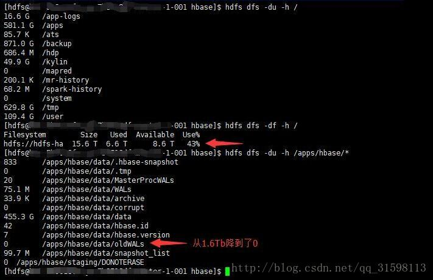

# 平滑重启

```sh
滚动重启regionserver #待测试
./graceful_stop.sh --restart --reload --debug --maxthreads 10 {regionserverhost}

滚动重启master
主master：
./hbase-daemon.sh stop master
./hbase-daemon.sh start master

backup master:
./hbase-daemon.sh stop master
./hbase-daemon.sh start master
```

————————————————
版权声明：本文为CSDN博主「灰二和杉菜」的原创文章，遵循CC 4.0 BY-SA版权协议，转载请附上原文出处链接及本声明。
原文链接：https://blog.csdn.net/qq475781638/article/details/96152462

# hbase-1.1.2的oldWALs占用过大hdfs空间问题的解决

为什么会出现oldWALs？
【原因】

当/hbase/WALs中的HLog文件被持久化到存储文件中，且这些Hlog日志文件不再被需要时，就会被转移到{hbase.rootdir}/oldWALs目录下，该目录由HMaster上的定时任务负责定期清理。

HMaster在做定期清理的时候首先会检查zookeeper中/hbase/replication/rs下是否有对应的复制文件，如果有就放弃清理，如果没有就清理对应的hlog。在手动清理oldWALs目录数据的同时，如果没有删除对应的znode数据，就会导致HMaster不会自动清理oldWALs。
另附某网友的解答：

>  The folder gets cleaned regularly by a chore in master. When a WAL file is not needed any more for recovery purposes (when HBase can guaratee HBase has flushed all the data in the WAL file), it is moved to the oldWALs folder for archival. The log stays there until all other references to the WAL file are finished. There is currently two services which may keep the files in the archive dir. First is a TTL process, which ensures that the WAL files are kept at least for 10 min. This is mainly for debugging. You can reduce this time by setting hbase.master.logcleaner.ttl configuration property in master. It is by default 600000. The other one is replication. If you have replication setup, the replication processes will hang on to the WAL files until they are replicated. Even if you disabled the replication, the files are still referenced.


【解决】

(1) 进到zookeeper的节点下，删除相关节点，如截图所示


(2) 确保hbase-site.xml中的属性hbase.replication=false和属性hbase.backup.enable=false 如果是true就改成false，如果没有那两个属性则添加上去后重启整个hbase集群。


(3) (我是在Ambari中)添加属性hbase.backup.enable=false到hbase-site.xml中去，再重启整个hbase集群，然后很快就能在hdfs中查看到{hbae.rootdir}/oldWALs目录大小为零了。所以说 hbase.backup.enable=false 属性是清除oldWALs文件的关键一步。

可以从截图中看到，原来1.6T的oldWALs，被hmaster清理掉了：



————————————————
版权声明：本文为CSDN博主「小猫爱吃鱼^_^」的原创文章，遵循CC 4.0 BY-SA版权协议，转载请附上原文出处链接及本声明。
原文链接：https://blog.csdn.net/qq_31598113/article/details/79221608