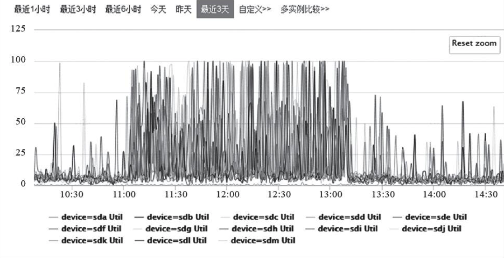
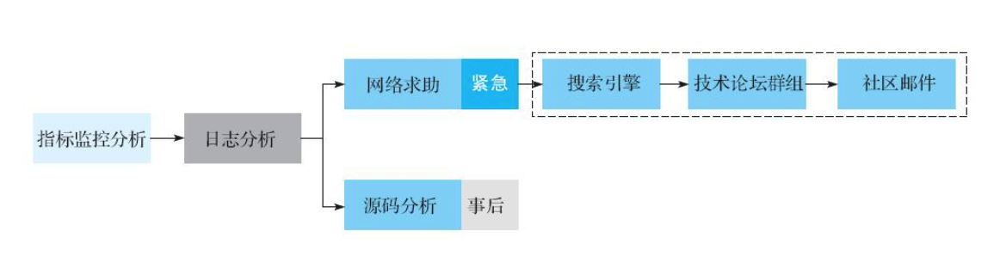

# 平滑重启

```sh
滚动重启regionserver #待测试
./graceful_stop.sh --restart --reload --debug --maxthreads 10 {regionserverhost}

滚动重启master
主master：
./hbase-daemon.sh stop master
./hbase-daemon.sh start master

backup master:
./hbase-daemon.sh stop master
./hbase-daemon.sh start master
```

————————————————
版权声明：本文为CSDN博主「灰二和杉菜」的原创文章，遵循CC 4.0 BY-SA版权协议，转载请附上原文出处链接及本声明。
原文链接：https://blog.csdn.net/qq475781638/article/details/96152462

# oldWALs

hbase-1.1.2的oldWALs占用过大hdfs空间问题的解决

为什么会出现oldWALs？
【原因】

当/hbase/WALs中的HLog文件被持久化到存储文件中，且这些Hlog日志文件不再被需要时，就会被转移到{hbase.rootdir}/oldWALs目录下，该目录由HMaster上的定时任务负责定期清理。

HMaster在做定期清理的时候首先会检查zookeeper中/hbase/replication/rs下是否有对应的复制文件，如果有就放弃清理，如果没有就清理对应的hlog。在手动清理oldWALs目录数据的同时，如果没有删除对应的znode数据，就会导致HMaster不会自动清理oldWALs。
另附某网友的解答：

>  The folder gets cleaned regularly by a chore in master. When a WAL file is not needed any more for recovery purposes (when HBase can guaratee HBase has flushed all the data in the WAL file), it is moved to the oldWALs folder for archival. The log stays there until all other references to the WAL file are finished. There is currently two services which may keep the files in the archive dir. First is a TTL process, which ensures that the WAL files are kept at least for 10 min. This is mainly for debugging. You can reduce this time by setting hbase.master.logcleaner.ttl configuration property in master. It is by default 600000. The other one is replication. If you have replication setup, the replication processes will hang on to the WAL files until they are replicated. Even if you disabled the replication, the files are still referenced.


【解决】

(1) 进到zookeeper的节点下，删除相关节点，如截图所示


(2) 确保hbase-site.xml中的属性hbase.replication=false和属性hbase.backup.enable=false 如果是true就改成false，如果没有那两个属性则添加上去后重启整个hbase集群。


(3) (我是在Ambari中)添加属性hbase.backup.enable=false到hbase-site.xml中去，再重启整个hbase集群，然后很快就能在hdfs中查看到{hbae.rootdir}/oldWALs目录大小为零了。所以说 hbase.backup.enable=false 属性是清除oldWALs文件的关键一步。

可以从截图中看到，原来1.6T的oldWALs，被hmaster清理掉了：


————————————————
版权声明：本文为CSDN博主「小猫爱吃鱼^_^」的原创文章，遵循CC 4.0 BY-SA版权协议，转载请附上原文出处链接及本声明。
原文链接：https://blog.csdn.net/qq_31598113/article/details/79221608


# 概述

```yml
table:
 c: hbase表
 a: 包含多行数据
column:
 c: column family + qualifier => 列簇 + 列名
 a: 
column family:
 c: 
 a: 
cell:
 c: 
 a: 
compaction:
 c: 合并小HFile,减少文件数，清除无效数据，稳定随机读延迟，提高HFile本地化率
 a: minor,major
minor compaction:
 c: minor=>不重要的,region的一个Store中选取部分较小的、相邻小HFile合并
 a: 影响较小可以无须管理
major compaction:
 c: major=>较重要的,region的一个Store中所有的HFile合并成一个,并且清理（被删除、TTL过期、版本号超出设定）三类数据，特点是持续较长、消耗大量系统资源
 a: 关闭major改为手动触发
 
```


# major触发脚本

```sh
#!/bin/bash
time_start=`date "+%Y-%m-%d %H:%M:%S"`
echo "开始进行HBase的大合并.时间:${time_start}"
 
str=`echo list | hbase shell | sed -n '$p'`
#str="a,b,c"
str=${str//,/ }
arr=($str)
length=${#arr[@]}
current=1
echo "HBase中总共有${length}张表需要合并."
echo "balance_switch false" | hbase shell | > /dev/null
echo "HBase的负载均衡已经关闭"
 
for each in ${arr[*]}
do
        table=`echo $each | sed 's/]//g' | sed 's/\[//g'`
        echo "开始合并第${current}/${length}张表,表的名称为:${table}"
        echo "major_compact ${table}" | hbase shell | > /dev/null
        let current=current+1 
done
 
echo "balance_switch true" | hbase shell | > /dev/null
echo "HBase的负载均衡已经打开."
 
time_end=`date "+%Y-%m-%d %H:%M:%S"`
echo "HBase的大合并完成.时间:${time_end}"
duration=$($(date +%s -d "$finish_time")-$(date +%s -d "$start_time"))
echo "耗时:${duration}s"
```


# 大数据相关技术文档


创建者[xuqiang](https://growingio.atlassian.net/wiki/people/5f55a2cf189482007df74f84?ref=confluence&src=profilecard)

最近更新日期：[9月 30, 2020](https://growingio.atlassian.net/wiki/pages/diffpagesbyversion.action?pageId=1648460079&selectedPageVersions=1&selectedPageVersions=2)

[14 人查看](https://growingio.atlassian.net/plugins/servlet/ac/com.addonengine.analytics/com.addonengine.analytics__analytics-content-byline-item?page.id=1648460079&space.key=CDP&content.id=1648460079&content.version=2&page.type=page&page.title=大数据相关技术文档&space.id=886409298&content.type=page&page.version=2)

## hbase

http://hbasefly.com/category/hbase/   

* [**数据写入流程解析**](http://hbasefly.com/2016/03/23/hbase_writer/)
* [**建表语句解析**](http://hbasefly.com/2016/03/23/hbase_create_table/)
* [**Memstore Flush深度解析**](http://hbasefly.com/2016/03/23/hbase-memstore-flush/)
* [**存储文件HFile结构解析**](http://hbasefly.com/2016/03/25/hbase-hfile/)
* [**探索HFile索引机制**](http://hbasefly.com/2016/04/03/hbase_hfile_index/)
* [**BlockCache系列 – 走进BlockCache**](http://hbasefly.com/2016/04/08/hbase-blockcache-1/)
* [**BlockCache系列 － 探求BlockCache实现机制**](http://hbasefly.com/2016/04/26/hbase-blockcache-2/)
* [**BlockCache系列 － 性能对比测试报告**](http://hbasefly.com/2016/05/06/hbase-blockcache-3/)
* [**RegionServer宕机**](http://hbasefly.com/2016/04/15/hbase-regionserver-crash/)
* [**GC的前生今世 – 身世篇**](http://hbasefly.com/2016/05/21/hbase-gc-1/)
* [**GC的前生今世 – 演进篇**](http://hbasefly.com/2016/05/29/hbase-gc-2/)
* [**客户端重试机制**](http://hbasefly.com/2016/06/04/hbase-client-1/)
* [**客户端超时机制**](http://hbasefly.com/2016/06/11/hbase-client-2/)
* [**内存规划**](http://hbasefly.com/2016/06/18/hbase-practise-ram/)
* [**列族设计优化**](http://hbasefly.com/2016/07/02/hbase-pracise-cfsetting/)
* [**Compaction的前生今世－身世之旅**](http://hbasefly.com/2016/07/13/hbase-compaction-1/)
* [**Compaction的前生今世－改造之路**](http://hbasefly.com/2016/07/25/hbase-compaction-2/)
* [**CMS GC调优**](http://hbasefly.com/2016/08/09/hbase-cms-gc/)
* [**集群规划**](http://hbasefly.com/2016/08/22/hbase-practise-cluster-planning/)
* [**聊聊RIT的那点事**](http://hbasefly.com/2016/09/08/hbase-rit/)
* [**多租户机制简析**](http://hbasefly.com/2016/09/26/hbase-mutiltenant-1/)
* [**RegionServer宕机数据恢复**](http://hbasefly.com/2016/10/29/hbase-regionserver-recovering/)
* [**读性能优化策略**](http://hbasefly.com/2016/11/11/hbase最佳实践－读性能优化策略/)
* [**写性能优化策略**](http://hbasefly.com/2016/12/10/hbase-parctice-write/)
* [**数据读取流程解析**](http://hbasefly.com/2016/12/21/hbase-getorscan/)
* [**用好你的操作系统**](http://hbasefly.com/2017/05/24/hbase-linux/)
* [**迟到的‘数据读取流程’部分细节**](http://hbasefly.com/2017/06/11/hbase-scan-2/)
* [**要弄懂的sequenceId**](http://hbasefly.com/2017/07/02/hbase-sequenceid/)
* [**数据库事务系列－HBase行级事务模型**](http://hbasefly.com/2017/07/26/transaction-2/)
* [**所有Region切分的细节都在这里了**](http://hbasefly.com/2017/08/27/hbase-split/)
* [**分布式系统中snapshot是怎么玩的？**](http://hbasefly.com/2017/09/17/hbase-snapshot/)
* [**Scan用法大观园**](http://hbasefly.com/2017/10/29/hbase-scan-3/)
* [**HBase内存管理之MemStore进化论**](http://hbasefly.com/2019/10/18/hbase-memstore-evolution/)
* [**HBase 2.2.1随机读写性能测试**](http://hbasefly.com/2020/01/12/hbase221_perf/)

## hadoop

https://developer.ibm.com/zh/articles/os-cn-hadoop-name-node/       hadoop ha 的工作原理

1. **NameNode 高可用整体架构概述**
2. **NameNode 的主备切换实现**
   1. HealthMonitor 实现分析
   2. ActiveStandbyElector 实现分析
   3. ZKFailoverController 实现分析
3. **NameNode 的共享存储实现**
   1. NameNode 的元数据存储概述
   2. 基于 QJM 的共享存储系统的总体架构
   3. 基于 QJM 的共享存储系统的数据同步机制分析
   4. 基于 QJM 的共享存储系统的数据恢复机制分析
   5. NameNode 在进行状态转换时对共享存储的处理
4. **NameNode 高可用运维中的注意事项**

https://tech.meituan.com/2016/08/26/namenode.html            hadoop的 namenode 内存中存储信息及数据存储结构，可以结合linux文件系统理解

1. **内存全景**
2. **内存分析**
   1. Namespace
   2. BlockManager
   3. NetworkTopology
   4. LeaseManager
3. **内存分析**
   1. NetworkTopology
   2. NameSpace
   3. BlocksMap
4. **重要公式：Total = 198 ∗ num(Directory + Files) + 176 ∗ num(blocks) + 2% ∗ size(JVM Memory Size)**

## spark

https://spark-internals.books.yourtion.com/index.html        spark的设计思想和执行过程中各组件的调用关系

* [**总体介绍**](https://spark-internals.books.yourtion.com/markdown/1-Overview.html)
* [**Job逻辑执行图**](https://spark-internals.books.yourtion.com/markdown/2-JobLogicalPlan.html)
* [**Job物理执行图**](https://spark-internals.books.yourtion.com/markdown/3-JobPhysicalPlan.html)
* [**Shuffle过程**](https://spark-internals.books.yourtion.com/markdown/4-shuffleDetails.html)
* [**统模块如何协调完成整个Job**](https://spark-internals.books.yourtion.com/markdown/5-Architecture.html)
* [**Cache和Checkpoint功能**](https://spark-internals.books.yourtion.com/markdown/6-CacheAndCheckpoint.html)
* [**Broadcast功能**](https://spark-internals.books.yourtion.com/markdown/7-Broadcast.html)

https://developer.ibm.com/zh/articles/ba-cn-apache-spark-memory-management/    Spark 内存管理详解

1. **堆内和堆外内存规划**
   1. 堆内内存
   2. 堆外内存
   3. 内存管理接口
2. **内存空间分配**
   1. 静态内存管理
   2. 统一内存管理
3. **存储内存管理**
   1. RDD 的持久化机制
   2. RDD 缓存的过程
   3. 淘汰和落盘
4. **执行内存管理**
   1. 多任务间内存分配
   2. Shuffle 的内存占用

 

https://www.processon.com/view/link/5f60a9976376894e3270a4ca ansible 执行思维导图

https://www.processon.com/view/link/5f63054c5653bb28eb4381d4#map  gio项目服务间依赖关系思维导图

无标签

# ---


[^ 1 ]: https://www.baidu.com


# hbase运维案例分析

在实际运维HBase集群时，各位小伙伴总会遇到RegionServer异常宕机、业务写入延迟增大甚至无法写入等类似问题。本章结合笔者的经验、列举真实生产线环境常见的几个问题，并介绍这些地问题的基本排查思路。同时，重点对HBase系统中的日志进行梳理介绍，最后对如何通过监控、日志等工具进行问题排查进行总结，形成问题排查套路，方便读者进行实践。

## regionserver宕机

### 案例一: 长时间GC导致Regionserver宕机

长时间FullGC是RegionServer宕机最常见的原因.分析这类问题,可以遵循如下排错过程:

**现象：**收到Regionserver进程退出的报警。

1. **宕机原因定位**

   **步骤1:** 通常在监控上看不出，需要到事发的RegionServer日志直接搜索2类关键字---a long garbage collecting  pause 或ABORTING region server。对于长时间Full GC的场景，搜索第一个关键字会检索到:

   ```java
       2019-06-14T17:22:02.054 WARN [JvmPauseMonitor] util.JvmPauseMonitor: Detected pause in JVM or host machine (eg GC): pause of approximately 20542ms
       GC pool 'ParNew' had collection(s): count=1 time=0ms
       GC pool 'ConcurrentMarkSweep' had collection(s): count=2 time=20898ms
       2019-06-14T WARN [regionserver60020.periodicFlusher] util.Sleeper: We slept 20936ms instead of 100ms, this is likely due to a long garbage collecting pause and it's usually bad, see http://hbase.apache.org/book.html#trouble.rs.runtime.zkexpired
      
   ```

   **步骤2:** 通常CMS GC策略会在2种场景下产生严重的Full GC ，1. Concurrent Mode Failure  2. Promotion Failure。

   ```java
     2017-06-14T17:22:02.054+0800:21039.790[FulGC20172017-06-14T17:22:020544+0800:21039.790: [CMS2017-06-14T17:22:02.0544+0800:21041.477: [CMS-concurrent-mark:1767/1782 sec][Times: user=14.01 sys=0.00 real=1.79 secs](concurrent mode fallure): 25165780K->25165777K(25165824K), 18.4242160 secs] 26109489K->26056746K(26109568K), [CMS Perm: 48563K-48534K(262144K), 18.4244700s secs][Times: user=28.77 sys=0.00 real=18.42. secs]]
     2017-06-14T17:22:20:47340800:21058.215:Totalime for which appll cation threads were stopped:184270530 seconds
   ```

   现在基本可以确认是由于concurrent mode failure模式的CMS GC导致长时间应用程序暂停。

2. 宕机原因分析

   >  故障因果分析: JVM触发的concurrent mode failure模式的CMS GC 会产生长时间的stop the world,上层应用因此长时间暂停。进一步导致RegionServer与Zookeeper之间建立的session超时。session一旦超时，Zookeeper就会通知Master将此宕机RegionServer踢出集群。

   > 什么是concurrent mode failure模式的GC？为什么会造成长时间暂停？假设HBase系统正在执行CMS回收老年代空间，在回收的过程中恰好从年轻代晋升了一批对象进来，不巧的是，老年代此时已经没有空间再容纳这些对象了。这种场景下，CMS收集器会停止工作，系统进入stop-the-world模式，并且回收算法会退化为单线程复制算法，重新分配整个堆内存的存活对象到SO中，释放所有其他空间。很显然，整个过程会比较漫长。

3. 解决方案

   > 既然是老年代来不及GC导致的问题，那只需要让CMS收集器更早一点回收就可以大概率避免这种情况发生。
   >
   > JVM提供了参数XX:CMSInitiatingOccupancyFraction=N来设置CMS回收的时机, N表示当前老年代已使用内存占年轻代总内存的比例, 可以将值改得更小使回收更早进行，比如60
   >
   > **另外建议在处理时关注下系统BlockCache是否开启了offheap模式，还有JVM启动参数是否合理，JVM堆内存管理是否未合理使用堆外内存。**

### 案例二: 系统严重Bug导致Regionserver宕机

**大字段scan导致RegionServer宕机**

现象： RegionServer进程退出

1. 宕机原因定位

   > **步骤1:** 日志。先检查GC相关，如果没有再继续搜索关键字“abort”，查到可疑日志“java.lang.OutOfMemoryError: Requested array exceeds VM limit"

   > **步骤2: ** 源码确认。看到带堆栈的FALTAL级别日志，定位到源码或者根据在关键字在网上搜索，确认该异常发生在scan结果数据在回传给客户端时，由于数据量太大导致申请的array大小超过JVM规定的最大值(Interge.Max_Value-2)
   >
   > 

2. 故障因果分析

   > 因为HBase系统自身的bug，在某些场景下scan结果数据太大导致JVM在申请array时抛出OutOfMemoryError，造成RegionServer宕机

3. 本质原因分析

   > 造成这个问题可以认为是HBase的bug，不应该申请超过JVM规定阈值的array。另一方面，也可以认为是业务方用法不当。
   >
   > - 表列太宽，并且对scan结果没有做列数据限制，导致一行数据就可能因为包含大量列而超过array阈值
   > - KeyValue太大，并且没有对scan的返回做限制，导致返回数据结果大小超过array阈值。

4. 解决方案

   > 可以在服务端做限制 hbase.server.scanner.max.result.size 大小
   >
   > 也可以在客户端访问的时候对返回结果大小做限制(scan.setMaxResultSize)

## hbase写入异常

**案例：HDFS缩容导致部分写入异常**

**现象：**业务反馈部分写入请求超时异常。此时HBase在执行HDFS集群多台DataNode退役操作。

1. 写入异常原因定位

   > **步骤1: **理论上平滑退役不会造成上层业务感知
   >
   > **步骤2:** 排查HBase节点集群监控， 发现退役操作期间节点IO负载较高
   >
   > 
   >
   > 初步判断写入异常和退服期间IO负载较高有一定关系。
   >
   > **步骤3:**在相关时间点查看RegionServer日志，搜索“Exception”，得到关键的2行:
   >
   > ```java
   > 2019-04-24 13:03:16,685 WARN [ResponseProcessor for block BP-1655660372-10.x.x.x-1505892014043:blk_1093094354_19353580] hdfs.DFSClient: DFSOutputStream ResponseProcessor exception for block BP-1655660374-10.x.x.x-1505892014043:blk_1093094354_19353580 java.io.IOException: Bad response ERROR for block BP-1655660372-10.x.x.x-1505892014043:blk_1093094354_19353580 from datanode 10.x.x.x:50010 at org.apache.hadoop.hdfs.DFSOutputStream$DataStreamer$ResponseProcessor.run(DFSOutputStream.java:828)
   > 2019-04-24 13:03:16,700 INFO [sync.0] wal.FSHLog: Slow sync cost: 13924 ms, current pipelin: [10.x.x.x:50010, 10.x.x.x:50010]
   > ```
   >
   > HLog执行sync花费时间太长(13924ms), 写入响应阻塞。
   >
   > **步骤4:** 进一步查看了DataNode日志发现刷盘很慢，有异常信息
   >
   > ```java
   > 2014-04-24 13:03:16,686 ERROR org.apache.hadoop.hdfs.server.datanode.DataNode: newsrec-hbase10.dg.163.org:50010:DataXceiver error processing WRITE_BLOCK operation src: /10.x.x.x:55637 dst:10.x.x.x:50010
   > ```

2. 写入异常原因分析

   - 多台DataNode同时退役，过程中copy大量数据块会导致集群所有节点的带宽和IO压力陡增。
   - 节点IO负载很高导致DataNode执行数据块落盘很慢，进而导致HBase中HLog刷盘超时异常，在集群写入压力较大的场景下会引起写入堆积超时

3. 解决方案

   > - 运维应在业务低峰期执行DataNode退役操作
   > - 不能同时退役多台DataNode，以免造成短时间IO压力急剧增大，改成依次退役。

## hbase运维时问题分析思路

生产线问题是系统运维工程师的导师。之所以这样说，是因为对问题的分析可以让我们积累更多的问题定位手段，并且让我们对系统的工作原理有更加深入的理解，甚至接触到很多之前不可能接触到的知识领域。就像去一个 未知的世界探索一个未知的问题，越往里面走，就越能看到别人看不到的世界。所以生产线上的问题发生了，一定要抓住机会，追根溯源。毫不夸张地说，技术人员的核心能力很大部分表现在定位并解决问题的能力上。 


实际上，解决问题只是一个结果。从收到报警看到问题的那一刻到最终解决问题，必然会经历三个阶段： 问题定位，问题分析，问题修复。 问题定位是从问题出发通过一定的技术手段找到触发问题的本质，问题分析是从原理上对整个流程脉络梳理清楚，问题解决依赖于问题分析，根据问题分析的结果对问题进行针对性修复或全局修复。

1. 问题定位

   > 定位问题的触发原因是解决问题的关键。问题定位的基本流程如图：
   >
   > 
   >
   > - 指标监控分析。很多问题都可以直接在监控界面上直观地找到答案。比如业务反馈在某一时刻后读延迟变得非常高。第一反应是去查看系统IO、CPU或者带宽是不是有任何异常，如果看到IO利用率在对应时间点变得异常高，就基本可以确认读性能下降就是由此导致。虽说IO利用率不是本质原因，但这是问题链上的 重要一环，接下来探究为什么IO利用率在对应时间点异常。
   >
   > 对问题定位有用的监控指标非常多，宏观上看可以分为系统基础指标和业务相关指标两大类。系统基础指标包括系统IO利用率、CPU负载、带宽等；业务相关指标包括RegionServer级别读写TPS、读写平均延迟、请求队列长度/Compaction队列长度、MemStore内存变化、BlockCache命中率等。
   >
   > - 日志分析。对于系统性能问题，监控指标或许可以帮忙，但对于系统异常类型的问题，监控指标可能看不到端倪。这个时候HBase系统相关日志最核心的有RegionServer日志和Master日志，另外GC日志、HDFS相关日志(NameNode日志和DataNode日志)以及Zookeeper日志在特定场景下对分析问题都有帮助。
   >
   > 对于日志分析并不需要将日志从头到尾读一遍，可以直接搜索类似于“Exception”，“ERROR”，甚至“WARN”关键字，再结合时间段对日志进行分析。
   >
   > - 网络求助。经过监控指标分析和日志分析后，运维人员通常都会有收获。也有部分情况下，我们能看到了"Exception"，但不明白具体含义。此时需要去网络上求助。首先在搜索引擎上根据相关日志查找，大多数情况下都能找到相关的文章说明，因为你遇到的问题很大概率别人也会遇到。如果没有线索，接着去各个专业论坛查找请教，比如stackoverflow、hbase-help.com以及各种HBase相关交流群组。最后，还可以发邮件到社区请教社区技术人员。
   > - 源码分析。在问题解决之后，建议通过源码对问题进行再次确认

2. 问题分析

   解决未知问题就像一次探索未知世界的旅程。定位问题的过程就是向未知世界走去，走得越远，看到的东西越多，见识到的世面越大。然而眼花缭乱的景色如果不仔细捋一捊，一旦别人问起那个地方怎么样，必然会无言以对。

   问题分析是问题定位的一个逆过程。从问题的最本质原因出发，结合系统的工作原理，不断推演，最终推演出系统的异常行为。要把这个过程分析的清清楚楚，不仅仅需要监控信息、异常日志，更需要结合系统工作原理进行分析。所以回过头来看，只有把系统的原理理解清楚，才能把问题分析清楚。

3. 问题修复

   如果能够把问题的来龙去脉解释清楚，相信就能够轻而易举地给出针对性解决方案。这应该是整个问题探索中最轻松的一个环节。没有解决不了的问题，如果有，那就是没有把问题分析清楚。

## hbase GC优化

## G1 GC

