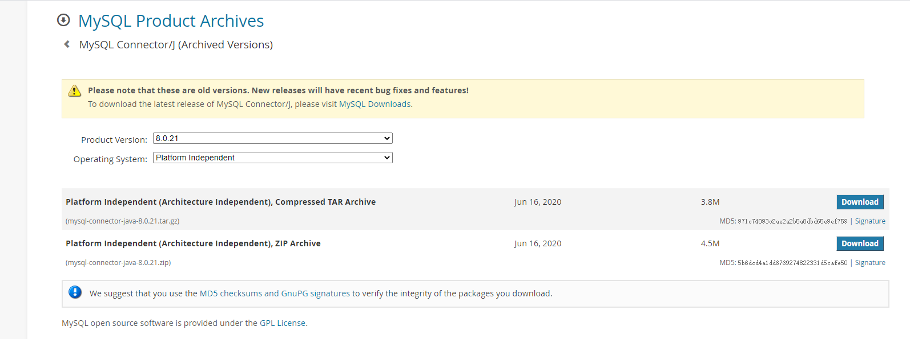
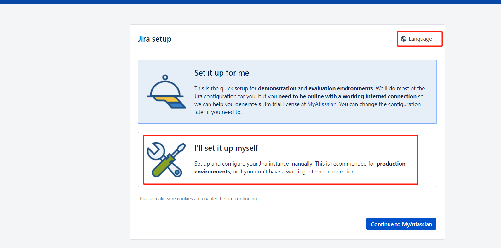
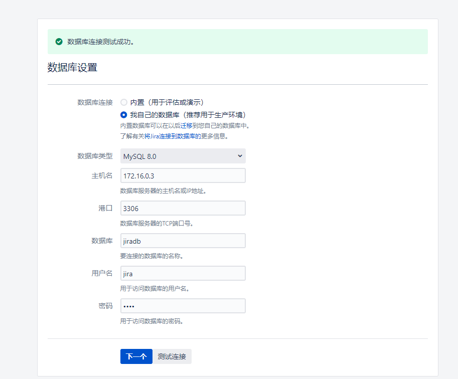
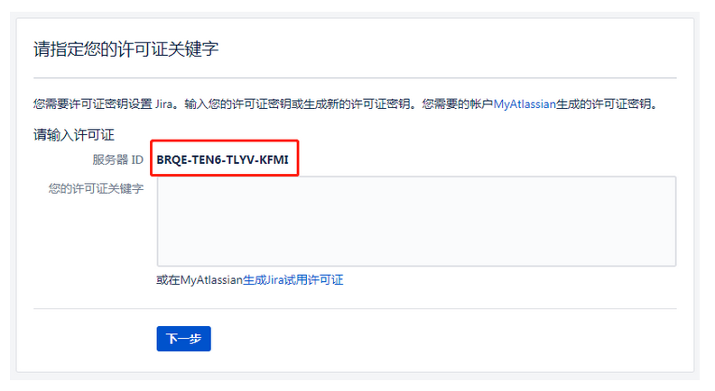
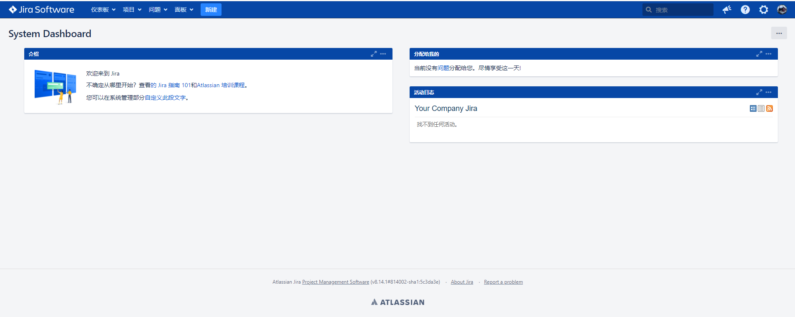

https://www.jitanglaile.com/article/48


# docker安装破解jira-8.14

## 部署jira

下载jira最新镜像

```
docker pull atlassian/jira-software:8.14
```

自定义镜像 添加破解jar包

複製成功

```dockerfile
FROM atlassian/jira-software:8.14
COPY atlassian-agent.jar /opt/atlassian/jira/
RUN echo 'export CATALINA_OPTS="-javaagent:/opt/atlassian/jira/atlassian-agent.jar ${CATALINA_OPTS}"' >> /opt/atlassian/jira/bin/setenv.sh
```

下载破解包至Dockerfile同一级别目录
[atlassian-agent.jar](https://pan.wqblogs.com/s/n8SLmJp2W2Ebqmq)0

```
-rw-r--r--. 1 root root 818083 Dec 10  2018 atlassian-agent.jar-rw-r--r--. 1 root root    221 Jan 15 14:22 Dockerfile
```

构建镜像

```
docker build -t wqblogs.com/jira-software:8.14 .
```

## 配置数据库

添加mysql配置 my.cnf

```
[mysqld]
character_set_server = utf8mb4
innodb_default_row_format = DYNAMIC
innodb_log_file_size = 2G
sql_mode = NO_AUTO_VALUE_ON_ZERO
[mysql]
default-character-set = utf8mb4

[client]
default-character-set =utf8mb4
```

重启mysql

```
/etc/init.d/mysql restart
```

创建用户与数据库

```sql
CREATE DATABASE jiradb CHARACTER SET utf8mb4 COLLATE utf8mb4_bin;
CREATE USER 'jira'@'%' IDENTIFIED BY 'jira';
GRANT SELECT,INSERT,UPDATE,DELETE,CREATE,DROP,REFERENCES,ALTER,INDEX on jiradb.* TO 'jira'@'%';
flush privileges;
```

启动jira容器

```
mkdir /data/jira
docker run -v /data/jira:/var/atlassian/application-data/jira -v /etc/localtime:/etc/localtime:ro  --name="jira" -d -p 8080:8080 wqblogs.com/jira-software:8.14
```

## web访问

[配置mysql 驱动](https://downloads.mysql.com/archives/c-j/)

[](https://www.jitanglaile.com/uploads/article/20230104/b01e472b05cf5727a5a652c10678e8cc.png)

```
docker cp mysql-connector-java-8.0.22.jar jira:/opt/atlassian/jira/libdocker restart jira
```

- web配置：选择语言和选择配置数据库
  [](https://www.jitanglaile.com/uploads/article/20230104/3fd317a60eb0217f50a1dc9a14cbf04a.png)
- web配置：配置数据库并测试连接
  [](https://www.jitanglaile.com/uploads/article/20230104/2ce3da33cad154ca0b06ca63d064bdb4.png)
- web配置：获取授权
  此图为网图，我的忘记截图了
  [](https://www.jitanglaile.com/uploads/article/20230104/5af8444be77e73f739e896d4ed4c0b44.png)

复制服务器ID: BKRG-CCI9-7V19-1M3C
在本地存放atlassian-agent.jar的目录下执行命令，生成许可证：
需替换邮箱（[weiqun.he@tenxcloud.com](mailto:weiqun.he@tenxcloud.com)）、名称（DEV）、访问地址（http://116.196.65.248:8080/）、服务器ID（BKRG-CCI9-7V19-1M3C）为你的信息

```
java -jar atlassian-agent.jar \
    -d -m weiqun.he@tenxcloud.com -n DEV -p jira \
    -o http://116.196.65.248:8080/ -s BKRG-CCI9-7V19-1M3C

====================================================
=======        Atlassian Crack Agent         =======
=======           https://zhile.io           =======
=======          QQ Group: 30347511          =======
====================================================

Your license code(Don't copy this line!!!):

AAABrQ0ODAoPeJyNkltvm0AQhd/5FUh93jXrCzGWkJIutKIFuwqO39d4HLbCC51dnDi/voshai6WV
YmXRXPOfHNmvnxD6f4QymUzl/mLibdgU5fna3fsjZnziACqrJsGkKayAKVhfWpgKQ4Q8lWWxfc8u
UsdjiCMrFUkDISdkHiMsJlzRRKBLlA2nSp8UJU8SAM7t+oF7vbklsY0ejEavZSyAiprJxNSGVBCF
RA/NxJPQ7d5QLwb+zm/JYpXyngne+tlmmTJOo6cZXvYAq72DxpQh4S9wl3xarDetYWh3YPoem+eB
AL9ZHSlVhRGHiE02MK7LN/+vyK3VIKDnRr70iGejW3cDTd28nb7L8ZzSXwUVXteRrgXlR7sPxqt8
FEoqfu6LmkbNGM+ZYFP/RkdT+eLuTf3Rg6vlbGwsQ2/Cp9A/mkVLeHW7uG5qOp2R4v60Le4HMt/D
pobgR1cjzxsJonCNInyeElS5jPPD4Ipm3r+5N2iL91WDngEtPKvP++/E86TgNxsWEBYNuGXTvrzs
fxqsSiFho8H/VZ8jrNBqYfxLGh4AXZI8MwYxZu/MDEraDAsAhRSj05h4SNNiYw3KTM1pV2N1P6zo
QIUHlNSQqah665emljexRRdKhfkAj8=X02kk
```

将生成的许可证复制到页面，完成破解

[](https://www.jitanglaile.com/uploads/article/20230104/d4936c3a93c80480f9c82c4ba690626b.png)

摘自：

[https://wqblogs.c](https://wqblogs.c/)0om/2021/01/15/jira%E9%83%A8%E7%BD%B2/