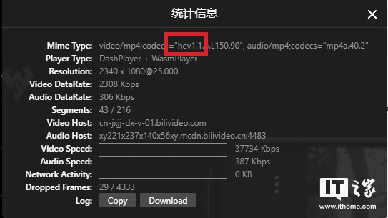

# mac使uniaccess agent监控软件失能？

作者：毒舌暴躁
链接：https://www.zhihu.com/question/308601708/answer/1916872794
来源：知乎
著作权归作者所有。商业转载请联系作者获得授权，非商业转载请注明出处。


## Mac版本

启动 `sudo newproc.d`，可以看到不停的在后台以每秒1次的频率执行以下： 

```text
2021 Nov  4 09:18:16 21177 <20569> 64b  sh -c /System/Library/PrivateFrameworks/Apple80211.framework/Versions/Current/Resources/airport -I | awk '/ SSID/ {print substr($0, in (...)
2021 Nov  4 09:18:16 21177 <20569> 64b  sh -c /System/Library/PrivateFrameworks/Apple80211.framework/Versions/Current/Resources/airport -I | awk '/ SSID/ {print substr($0, in (...)
2021 Nov  4 09:18:16 21179 <21177> 64b  awk / SSID/ {print substr($0, index($0, $2))}
2021 Nov  4 09:18:16 21178 <21177> 64b  /System/Library/PrivateFrameworks/Apple80211.framework/Versions/Current/Resources/airport -I
2021 Nov  4 09:18:18 21180 <20569> 64b  sh -c /opt/LVUAAgentInstBaseRoot/dvc-tool-exe -get-wifi-interfaces
2021 Nov  4 09:18:18 21180 <20569> 64b  sh -c /opt/LVUAAgentInstBaseRoot/dvc-tool-exe -get-wifi-interfaces
2021 Nov  4 09:18:18 21180 <20569> 64b  /opt/LVUAAgentInstBaseRoot/dvc-tool-exe -get-wifi-interfaces
2021 Nov  4 09:18:18 21181 <20569> 64b  sh -c /sbin/ifconfig en7| grep "status"
2021 Nov  4 09:18:18 21181 <20569> 64b  sh -c /sbin/ifconfig en7| grep "status"
2021 Nov  4 09:18:18 21182 <21181> 64b  /sbin/ifconfig en7
2021 Nov  4 09:18:18 21183 <21181> 64b  grep status
2021 Nov  4 09:18:18 21184 <20569> 64b  sh -c /sbin/ifconfig en1| grep "status"
```

不停不能平民愤啊，这就是[流氓软件](https://www.zhihu.com/search?q=流氓软件&search_source=Entity&hybrid_search_source=Entity&hybrid_search_extra={"sourceType"%3A"answer"%2C"sourceId"%3A1916872794})。

```bash
cd /opt
ls -lO
sudo chflags -f -R nohidden LVUAAgentInstBaseRoot
sudo chflags -f -R noschg LVUAAgentInstBaseRoot
sudo mkdir bak
sudo mv LVUAAgentInstBaseRoot/dvc-core-exe bak/
sudo mv LVUAAgentInstBaseRoot/dvc-screen-exe.app bak/
sudo mv LVUAAgentInstBaseRoot/dvc-unisensitive-exe bak/
sudo pkill dvc-screen-exe dvc-unisensitive-exe dvc-core-exe dvc-remote-exe
```

注：MacOS下这个方案一定可行

# mac完整卸载LV security agent 客户端

1. 原公司离职后,这破软件总是卸载不掉,查了很多教程发现都是互抄,都无法卸载,最后联系官方才终于找到完整卸载方法,现分享出来,方法如下:

2. 在应用程序里面把app丢废纸篓去,完成这一步后会发现那软件还在运行,打开资源管理器,然后搜索LV,会发现存在这个软件调起的进程,点击这个进程会看到它在频繁访问/opt/LVUAAgentInstBaseRoot/ 下的文件(我是卸载后写的这篇文章,所以没有图片可贴)
   打开终端,进入那个文件夹里面去,cd /opt/LVUAAgentInstBaseRoot
   运行卸载程序,./uninstall-exe,这里为什么要运行它的卸载程序,而不直接rm删除掉呢,是因为这里有些文件是受到保护的,即使是root权限也无法删除,更改属主也做不到,只有这个卸载程序才能把这部分文件卸载掉
   ⭐⭐⭐特别注意⭐⭐⭐：有很多网友评论说到这一步需要密码不知道怎么办，这个密码指的是你的电脑登录密码，是系统在和你申请权限呢。如果你电脑有多个账号，那么切忌是管理员账号的密码，如果分不清哪个账号是管理员，那就都试一遍，没有试错次数上限的，输错三次会自动退出，再重新运行卸载程序就行。还有，在输入密码的时候是不会有显示的，所以不用管屏幕，直接输入密码之后回车就行，密码错误会提示重新输入的。
3. 
4. 返回到上一级目录,cd ..
   这时删除掉剩余文件即可,sudo rm -rf LVUAAgentInstBaseRoot
   这时可以查看下,文件夹已经完成删除了,进程也已经终止了,彻底卸载完成.
   ————————————————
   原文链接：https://blog.csdn.net/qq_37510316/article/details/123926516

# 网页版 B 站导致 CPU 占用高的原因分析与解决方案

[杏杏 ](https://mp.ithome.com/account/#/24411367)2022/2/8 12:26:20 责编：GeekX

[评论：0](https://www.ithome.com/0/602/058.htm#post_comm)

最近在使用 Chrome 浏览器浏览 哔哩哔哩视频（以下简称B站）时发现 CPU 占用率非常高，虽然家中使用的只是 18 年比较低端的一款游戏本，但是处理器也是 Intel 与 AMD“核战”开始后的产物，在线看个视频应该不能构成什么压力才对。


## 分析

通过任务管理器可以看到在播放视频的时候 CPU 占用很高，但是 GPU 占用却非常低，这应该是没有正确调用硬件解码造成的，查看视频信息，看见了 hev1 编解码器，我猜测应该是 B 站在[长达一年多的测试](https://www.ithome.com/0/503/002.htm)后确认了 HEVC 播放的稳定性，为了降低网络带宽成本和缓解高峰期播放卡顿的问题，将默认编码修改为 HEVC 了。



上网查询的结果进一步验证了我的猜想，Chrome 果然不支持 HEVC 硬解，播放 HEVC 视频只能调用 CPU 进行软解。不只是 Chrome，整个桌面端只有苹果的 Safari 支持（注：对于部分设备预装了 HEVC decoder 的设备，微软 Edge 浏览器是可以硬解的）。HEVC 也不是啥新鲜玩意了，全球浏览器市场占用率第一的 Chrome 竟然还不支持，进一步搜索发现，原来是因为 MPEG-LA 和 HEVC Advance 专利池伸手太黑，给谷歌和苹果报价太高，最终只有财大气粗的苹果选择了交钱。而谷歌选择走自己的路，拉上了一大帮对高额专利授权费不爽的科技公司开始大力发展与推广 AV1 去了。


## 解决方案

说回正题，现在知道了 CPU 占用高的原因，这下解决起来就简单多了，那就是去买一台 Mac（误），准备掏钱买和正在用 Mac 的小伙伴们看到这里就可以撤了，接下来同诸位[IT之家](https://www.ithome.com/)家友讲讲坚持使用 Chromium 内核浏览器的解决方案。

- **方案一（推荐）：调整默认编码格式**

这是最简单粗暴，也是最高效的解决方法，使用 Chromium 内核浏览器的用户目前只有这一种解决方案。在播放器下方按照图片步调整择编码格式为 AVC，如果使用的是 Intel Xe 核显（大部分十一代和十二代处理器，除部分赛扬奔腾系列处理器）、使用 NVIDIA 30 系显卡，以及使用 AMD RX6000 系列显卡（RX6500XT 和 RX6400 除外）建议选择更省带宽的 AV1 编码格式。


- **方案二：更改 UA 使浏览器支持 HEVC**

经测试，这种方案支持使用 Chromium 内核的 Edge 浏览器，其他浏览器请IT之家的小伙伴自行测试。

首先[下载安装 HEVC 解码器](https://www.free-codecs.com/hevc_video_extension_download.htm)。注意，请选择下载 v1.0.31823 版本，目前新版本会出现掉帧和卡顿的问题（注意需要关闭微软商店自动更新功能）。

然后[下载安装 User-Agent Switcher and Manager 扩展](https://microsoftedge.microsoft.com/addons/detail/cnjkedgepfdpdbnepgmajmmjdjkjnifa)，并按照下图修改浏览器 UA。


注：一些教程会推荐修改 UA 为老版 Edge 浏览器，但是经我测试修改为老版 Edge 浏览器的 UA 后，哪怕在设置内选择默认 HEVC 编码，在观看视频时仍然只会使用 AVC 编码。

不想因为修改 UA 影响其他网站访问可以按照下面步骤将“https://www.bilibili.com”添加进特定站点。


- **方案三：使用 UWP 版哔哩哔哩**

最近几次更新 UWP 版哔哩哔哩功能算是比较齐全了，而且还支持了 HDR，看视频完全够用了。（想要支持 HEVC 需要安装 HEVC 扩展，并在设置里手动开启 HEVC）


B 站在国内的视频网站中可以算得上做的非常出色了，虽然为了节省带宽修改了默认偏好为 HEVC，但是很显然 B 站也注意到了 Chromium 内核这个市场占有率第一的内核无法硬解 HEVC 这个问题，只有在 1080P 高码率、1080P 以及更低分辨率下默认使用了 HEVC 编码，在 1080P 60 帧、4K 以及更高的 8K 视频下还是默认 AVC 格式，减轻对性能较差的处理器的解码压力；只有在使用 Safari 浏览器下才会全程使用 HEVC 编码。

并且 B 站也比较快的跟进了 AV1 编码，虽然目前用户手中支持硬解 AV1 的硬件较少，但是 2021 年后发布的新硬件支持的还算不错，只有少部分厂家没有跟进。退五千步来说 B 站至少将编码格式的选择权交给了用户，稍加设置仍然可以使用 AVC 编码，并没有一刀切的强上 HEVC 或者 AV1。

参考

- [Chrome / Egde 上为 B 站启用 HEVC 硬解](https://www.bilibili.com/read/cv13253613)
- [Can I use hevc ?](https://caniuse.com/?search=hevc)


# 挂载NTFS


先卸载


挂载

```
sudo mkdir /Volumes/mnt
sudo mount_ntfs -o rw,auto,nobrowse /dev/disk3s1 /Volumes/mnt
```


# mac怎么刻录带引导的iso

[](https://www.jianshu.com/u/9ede940c2add)

[印随2018](https://www.jianshu.com/u/9ede940c2add)关注IP属地: 广东

2019.07.06 12:39:23字数 100阅读 1,221

**准备的东西：**

1. USB口外置光驱
2. ISO镜像文件（我刻录的是CentOS-7-x86_64-DVD-1708.iso）
3. 一张比你ISO文件大的空白光盘

**步骤**：

1. USB外置光驱插入Mac
2. 放入空白的光盘（也可以待会儿再放，just you like _）
3. 按command+空格键，输入“ter" ，以打开Mac的终端（terminal）
4. hdiutil burn CentOS-7-x86_64-DVD-1810.iso

waiting......


生成iso文件

```sh
hdiutil makehybrid -o app.iso /data/app
```


刻入

```sh
hdiutil burn -erase app.iso
```


# Mac 移动硬盘未挂载-解决办法

[](https://www.jianshu.com/u/ebc48958a2c3)

[乌和兔](https://www.jianshu.com/u/ebc48958a2c3)关注IP属地: 江苏

12019.09.29 10:16:09字数 507阅读 50,055

西部数据的移动硬盘，没有点推出，而直接热插拔，再插上电脑不显示文件夹。
打开 Mac 的 磁盘工具，上面会显示当前插入的硬盘名称，并显示状态为未挂载。

网上主要有3种解决办法：

**方法1:格式化**
最傻逼的一种方法，西部数据客服说慢慢插入，实在没办法直接格式化为fat，之后就可以使用了，可我特么里面的数据不要了吗？

**方法2:使用命令挂载**

- 命令1: `diskutil list`，查看当前的硬盘信息，找到移动硬盘在系统内的名称；
- 命令2: `sudo diskutil mount /dev/disk2`，直接挂载对应名称的硬盘。
- 命令3: `sudo fsck_hfs -fy /dev/disk2`，如果命令2无效，则执行命令3之后再执行命令2。

> 但这种方法不适合我的硬盘，使用后显示`volume on disk2 timed out waiting to mount`，超时无法挂载。

**方法3:在系统内修复**

- Windows 下: 不要用磁盘修复，会提示必须先格式化。管理员身份打开命令行（Cmd），输入以下代码：`chkdsk {drive}: /f`
  例如：`chkdsk E: /f` 表示修复E 盘
- Mac 下: 过程略复杂，首先尝试用自带的磁盘工具（Disk Utility）修复，如果不成功再执行下面的步骤。打开终端，输入：`sudo fsck_exfat -d diskXsX`
  这里 diskXsX 表示要修复的分区，比如disk0s4，会出现一大堆文件列表，最后提示：`Main boot region needs to be updated. Yes/No?`输入Yes 即可。
  最后再回到 Disk Utility 去重新修复分区，这次就会成功了。

> 最后把硬盘插在 Windows 电脑上用命令修复了，十几分钟之后修复完毕，就可以正常在 Mac 电脑上使用了。


# mac远程桌面出现自动输入字母c是什么原因？

快乐小运维

于 2021-06-22 16:00:50 发布

1754
 收藏 2
文章标签： mac
版权
最近一个蛋疼的问题困扰了我，每次远程windows服务器的时候自动输入一个字母c


当我打开navicat双击数据库的时候自动帮我输入一个c
这个问题是因为我打开了翻译软件有道翻译，导致热键冲突

当我把这个程序关闭之后再远程桌面就不会出现这个情况！

————————————————
版权声明：本文为CSDN博主「快乐小运维」的原创文章，遵循CC 4.0 BY-SA版权协议，转载请附上原文出处链接及本声明。
原文链接：https://blog.csdn.net/weixin_45290734/article/details/118109141
