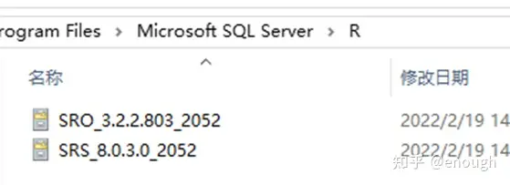

# mssql 2016

## 安装步骤

polybase不装，其他全选

下载

R open 

https://go.microsoft.com/fwlink/?LinkId=761266&lcid=2052

R Server

 https://go.microsoft.com/fwlink/?LinkId=735051&lcid=2052 

将后缀1033 改为2052 即：

重新获取一下安装包所在目录，下一步 就从灰色变成可点击的黑色了

## 参考

https://www.cnblogs.com/fishparadise/p/5655570.html

https://blog.csdn.net/qq_43719388/article/details/109801590

https://www.jianshu.com/p/7516c015a772