# docker安装oracle11g史上最全步骤（带图文）


[Alex_81D](https://blog.csdn.net/Alex_81D)已于 2022-10-31 13:40:26 修改31486 收藏 67

分类专栏： [数据库](https://blog.csdn.net/alex_81d/category_7743134.html) [大数据从入门到精通](https://blog.csdn.net/alex_81d/category_12103396.html) 文章标签： [oracle](https://so.csdn.net/so/search/s.do?q=oracle&t=blog&o=vip&s=&l=&f=&viparticle=) [docker](https://so.csdn.net/so/search/s.do?q=docker&t=blog&o=vip&s=&l=&f=&viparticle=)

版权

[数据库同时被 2 个专栏收录](https://blog.csdn.net/alex_81d/category_7743134.html)

32 篇文章0 订阅

订阅专栏

[大数据从入门到精通](https://blog.csdn.net/alex_81d/category_12103396.html)

23 篇文章1 订阅

订阅专栏

注明：本文是参照大佬的文章的，大佬的有几处问题，我已经改了，还有就是一定要按照步骤一步一步来，不要耍过多的花样，给小白和临时用的人，其他的看情况！（我主要是给自己做个记录，下次好直接用）

因为在Linux中[安装oracle](https://so.csdn.net/so/search?q=安装oracle&spm=1001.2101.3001.7020)非常麻烦，相信每个人也会遇到各种坑，为了一次装好，也方便将来直接可以导出镜像在各平台移植使用，所以选择用docker安装，并做详细记录，为以后需要之时拿来再看。

1、安装docker环境。

2、开始拉取oracle镜像

​     docker pull registry.cn-hangzhou.aliyuncs.com/helowin/oracle_11g

  大约有6个G，需要一段时间，抽根烟静等大约10分钟。

（自己做了一个镜像，有需要的同学可以私我。）

3、下载完成后，查看镜像

   docker images

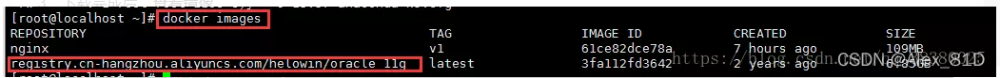

 4、创建容器

​    docker run -d -p 1521:1521 --name oracle11g registry.cn-hangzhou.aliyuncs.com/helowin/oracle_11g

可以写成shell脚本，下次打开oracle数据库就可以一条命令创建容器。

shell脚本如下：

\# BEGIN ANSIBLE MANAGED BLOCK
\#!/bin/bash
docker rm -f oracle11;
docker run -it -d -p 1521:1521 -v /data/oracle:/data/oracle --name oracle11g registry.cn-hangzhou.aliyuncs.com/helowin/oracle_11g
\# END ANSIBLE MANAGED BLOCK


但为了保存上一次容易的配置值，是不建议写这个shell脚本的，下次打开直接用docker start oracle11命令打开。

  如果创建成功能会返回容器id

5、进入镜像进行配置

   docker exec -it oracle11g bash


6、进行软连接

   sqlplus /nolog

发现没有该命令，所以切换root用户。

su root 

输入密码：helowin

7、编辑profile文件配置ORACLE环境变量

​    打开：vi /etc/profile ，在文件最后写上下面内容：

​      export ORACLE_HOME=/home/oracle/app/oracle/product/11.2.0/dbhome_2

​      export ORACLE_SID=helowin

​      export PATH=$ORACLE_HOME/bin:$PATH

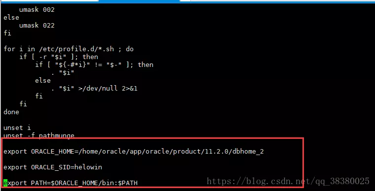
8、保存后执行source /etc/profile 加载环境变量；

9、创建软连接

​      ln -s $ORACLE_HOME/bin/sqlplus /usr/bin

10、切换到oracle 用户

​       这里还要说一下，一定要写中间的内条 -  必须要，否则软连接无效


11、登录sqlplus并修改sys、system用户密码

   sqlplus /nolog  --登录
   conn /as sysdba  --
   alter user system identified by system;--修改system用户账号密码；
  alter user sys identified by system;--修改sys用户账号密码；
  create user test identified by test; -- 创建内部管理员账号密码；
  grant connect,resource,dba to test; --将dba权限授权给内部管理员账号和密码；
  ALTER PROFILE DEFAULT LIMIT PASSWORD_LIFE_TIME UNLIMITED; --修改密码规则策略为密码永不过期；（会出现坑，后面讲解）
  alter system set processes=1000 scope=spfile; --修改数据库最大连接数据；

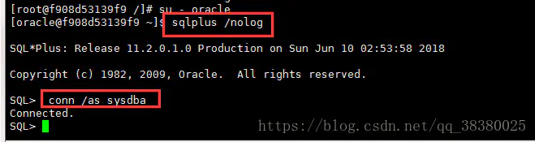
12、修改以上信息后，需要重新启动数据库；


conn /as sysdba
shutdown immediate; --关闭数据库
startup; --启动数据库

exit：退出软链接

其中一个坑说明：

当执行修改密码的时候出现 ：   database not open

   提示数据库没有打开，不急按如下操作

   输入：alter database open;

  注意了：这里也许还会提示  ：  ORA-01507: database not mounted

   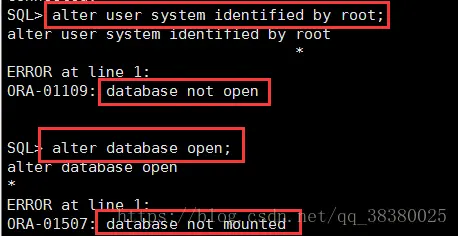


解决办法：

输入：alter database mount;

 输入 ：alter database open;

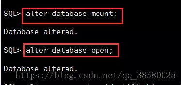

然后就可执行 修改数据库密码的命令了

   改完之后输入：ALTER PROFILE DEFAULT LIMIT PASSWORD_LIFE_TIME UNLIMITED;

   刷新下表  exit  是退休sql 软连接

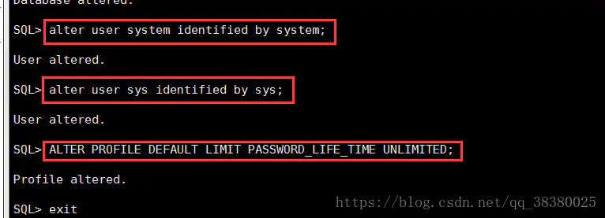
————————————————
版权声明：本文为CSDN博主「闰土先生」的原创文章，遵循CC 4.0 BY-SA版权协议，转载请附上原文出处链接及本声明。
原文链接：https://blog.csdn.net/xgc0215/article/details/104134241

[docker安装oracle11g史上最全步骤（带图文）_闰土先生的博客-CSDN博客_docker安装oracle](https://blog.csdn.net/xgc0215/article/details/104134241)

13.navicat连接成功图：

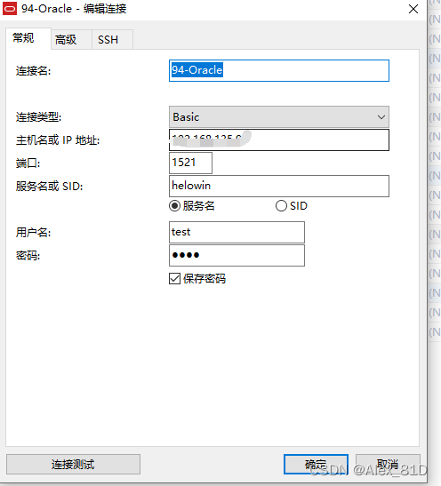

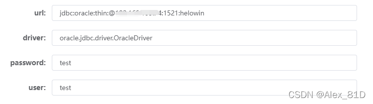


oracle 11.2.0.1.0 jar 下载

wcy10086

于 2021-05-20 15:27:20 发布

746
 收藏 1
版权
官网地址，需要登录之后返回刷新页面

https://www.oracle.com/jp/technical-resources/articles/features/jdbc/jdbc.html

下载jar 


 

 

注：jar 安装到本地mvn仓库命令 

mvn install:install-file -Dfile=E:\jar\ojdbc6.jar -DgroupId=com.oracle -DartifactId=ojdbc6 -Dversion=11.2.0.1.0 -Dpackaging=jar 

————————————————
版权声明：本文为CSDN博主「wcy10086」的原创文章，遵循CC 4.0 BY-SA版权协议，转载请附上原文出处链接及本声明。
原文链接：https://blog.csdn.net/qq_36949713/article/details/117078399


# 授权

```
chown xxx ojdbc6.jar
```


```

```


```sh

[root@7f53f07c93e5 /]# su - oracle
Last login: Wed Apr 17 08:29:31 UTC 2019
[oracle@7f53f07c93e5 ~]$ sqlplus / as sysdba
```


```
TSN: orcl
```


# [Oracle创建库及使用的流程 ](https://www.cnblogs.com/gangbalei/p/15313905.html)

 

## 前言

目前常用的关系型数据库常用的就MYSQL、ORACLE；大多数项目（偏中小型）情况下MYSQL就能满足，而且相对而言使用比较简单，想必是大家的常规选择，也可能现在的开发者也许都很少接触ORACLE。ORACLE相对MYSQL而言，确实性能和稳定性比较好，当表上了几百万数据库，能感觉到MYSQL的无力，这里就需要厉害的数据库管理人员，进行数据库优化（索引优化、读写分离、分库分表等），不然很难使用。

就我亲身经历而言，小哥第一个中型项目就是使用的ORACLE，平台级项目，数据量也能到千万级，项目运行了一年多，数据库技能上没有出现过什么问题，最多处理就是归档日志满了，清理归档日志。第二个中型项目，使用的MYSQL，当最大表数据库到达到百万级之后，很多业务有时会变得比较慢，也是一年多时间内（偏互联网应用，访问比较大），数据库出现问题的次数不下于十五次，访问量变大时，稍稍一条SQL没有写的太好，很容易也就卡带了，导致整个应用崩溃。不过现在这个项目最大表记录已经一千万了，也有相对厉害的数据库人员在维护，还过的去。

公司近期有个新项目，很要求稳定性和性能（项目服务的人群特殊），上级领导有意要使用ORACLE，叫小哥去搭建项目模板出来。就是ORACLE创建库这个过程，小哥也花了不少时间，才明白是怎么回事，下面就进入到正式的主题。

 

## 主题

### 一、对比MYSQL

想必大家都对MYSQL比较熟悉，MYSQL搭建好之后，使用连接工具进行连接后，在打开数据库连接后，右键新建数据库就可以为项目创建库了。


 

而使用连接工具连接ORACLE之后，没有创建数据库的选项，懵逼中，，，

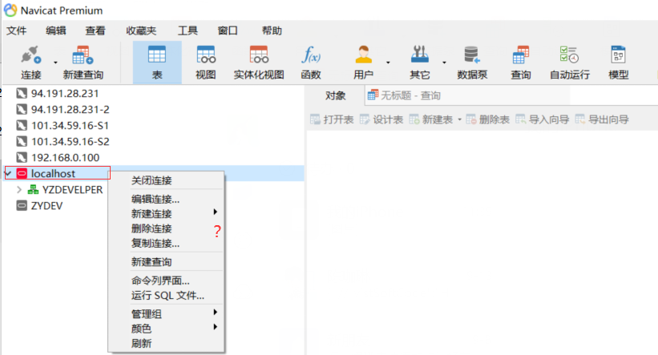

 

## 二、ORACLE创库

其实ORACLE也不叫创库（MYSQL使用多了，概念被混淆了），ORACLE的数据库表是需要放到指定的用户下，于是ORACLE创库是叫创建用户。

创建用户的步骤大致是：a、创建表空间；b、创建用户；c、为用户授权；

 

### 1、使用命令行工具，DBA方式连接ORACLE

```
sqlplus sys/123456 as sysdba;
```

### 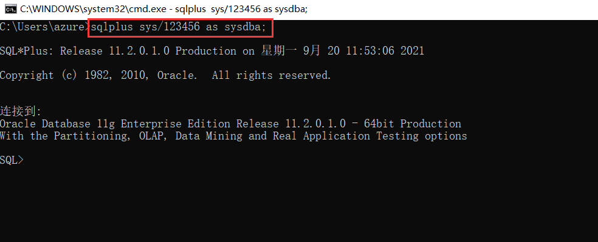

 

### 2、创建表空间

```
create tablespace ZYSERVICESPACE 
datafile 'E:/Application/ORACLE/oradata/orcl/ZYSERVICESPACE.dbf' 
size 1024m 
autoextend on 
next 100m 
maxsize unlimited;
```

- ```
  datafile：指定表空间文件存储的位置；
  ```

- ```
  size：表空间初始值大小；
  ```

- ```
  autoextend：开启表空间大小自动扩展；
  ```

- ```
  next：每次启动扩招的大小；
  ```

- ```
  maxsize：表空间的最大值，unlimited表示无限制；
  ```

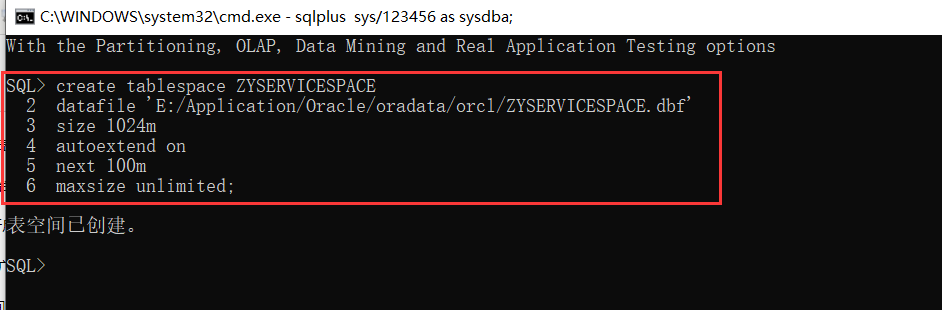

 

### 3、创建用户，关联表空间

```
create user ZYDEVER identified by "zydev2021"  default tablespace ZYSERVICESPACE profile default account unlock;
```

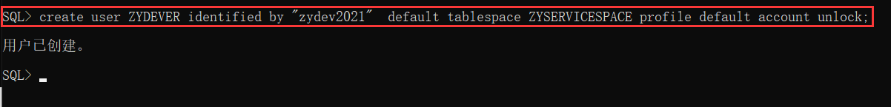

 

### 4、为用户授权

```
grant connect, resource to ZYDEVER;
grant unlimited tablespace to ZYDEVER;
```


 

## 三、连接使用

执行完上面的操作后，就可以刚创建的用户使用数据库进行连接了，也可以在项目用户进行创表，执行SQL，进行项目开发了。

 

但是不知道为何，明明使用的是项目用户连接，数据库连接下面可以看到很多其他的用户？


 

就表示不懂，尝试了各种解决办法，都没有办法直接去掉，后面只能在连接工具上进行如下处理，数据库连接下就只能看到项目用户（库），

这样可以避免其他误操作，同时更加聚焦项目；

 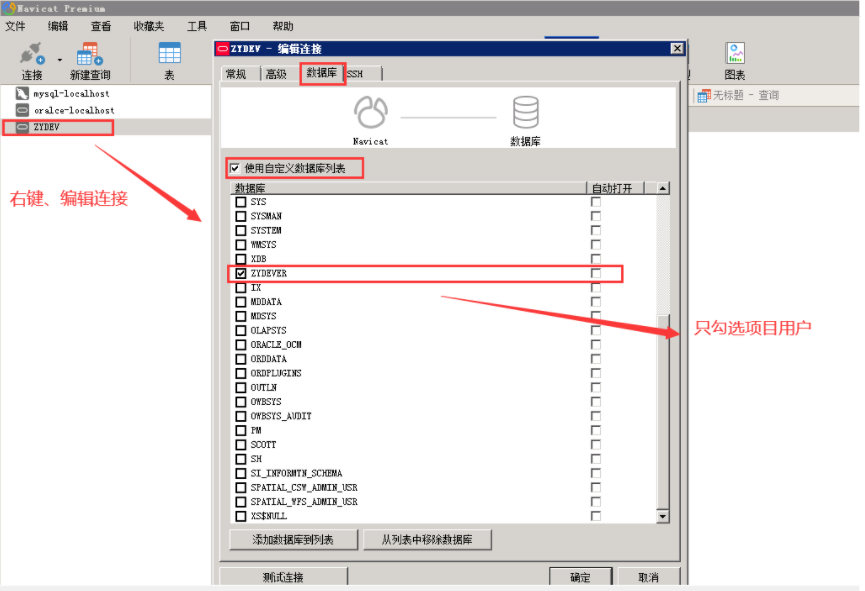

 

 设置好之后，只能看到项目用户（库）了，这样就很舒服。

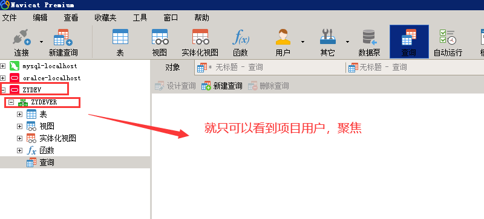

 

 

 

##  四、额外说明

ORACLE删除用户：

```
drop user ZYDEVER;
```

 ORALCE删除表空间：

```
-- 先将其下线
alter tablespace ZYSERVICESPACE offline;
-- 将磁盘上的数据文件一同删除
drop tablespace ZYSERVICESPACE including contents and datafiles;
```

 

>  成功 = 正确的选择 + 实际的行动 + 长期的坚持；
