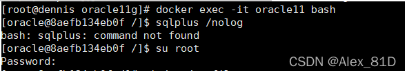

# docker安装oracle11g史上最全步骤（带图文）

[Alex_81D](https://blog.csdn.net/Alex_81D)已于 2022-10-31 13:40:26 修改31486 收藏 67

分类专栏： [数据库](https://blog.csdn.net/alex_81d/category_7743134.html) [大数据从入门到精通](https://blog.csdn.net/alex_81d/category_12103396.html) 文章标签： [oracle](https://so.csdn.net/so/search/s.do?q=oracle&t=blog&o=vip&s=&l=&f=&viparticle=) [docker](https://so.csdn.net/so/search/s.do?q=docker&t=blog&o=vip&s=&l=&f=&viparticle=)

版权

[数据库同时被 2 个专栏收录](https://blog.csdn.net/alex_81d/category_7743134.html)

32 篇文章0 订阅

订阅专栏

[大数据从入门到精通](https://blog.csdn.net/alex_81d/category_12103396.html)

23 篇文章1 订阅

订阅专栏

注明：本文是参照大佬的文章的，大佬的有几处问题，我已经改了，还有就是一定要按照步骤一步一步来，不要耍过多的花样，给小白和临时用的人，其他的看情况！（我主要是给自己做个记录，下次好直接用）

因为在Linux中[安装oracle](https://so.csdn.net/so/search?q=安装oracle&spm=1001.2101.3001.7020)非常麻烦，相信每个人也会遇到各种坑，为了一次装好，也方便将来直接可以导出镜像在各平台移植使用，所以选择用docker安装，并做详细记录，为以后需要之时拿来再看。

1、安装docker环境。

2、开始拉取oracle镜像

​     docker pull registry.cn-hangzhou.aliyuncs.com/helowin/oracle_11g

  大约有6个G，需要一段时间，抽根烟静等大约10分钟。

（自己做了一个镜像，有需要的同学可以私我。）

3、下载完成后，查看镜像

   docker images

 4、创建容器

​    docker run -d -p 1521:1521 --name oracle11g registry.cn-hangzhou.aliyuncs.com/helowin/oracle_11g

可以写成shell脚本，下次打开oracle数据库就可以一条命令创建容器。

shell脚本如下：

\# BEGIN ANSIBLE MANAGED BLOCK
\#!/bin/bash
docker rm -f oracle11;
docker run -it -d -p 1521:1521 -v /data/oracle:/data/oracle --name oracle11g registry.cn-hangzhou.aliyuncs.com/helowin/oracle_11g
\# END ANSIBLE MANAGED BLOCK

但为了保存上一次容易的配置值，是不建议写这个shell脚本的，下次打开直接用docker start oracle11命令打开。

  如果创建成功能会返回容器id

5、进入镜像进行配置

   docker exec -it oracle11g bash

6、进行软连接

   sqlplus /nolog

发现没有该命令，所以切换root用户。

su root 

输入密码：helowin

7、编辑profile文件配置ORACLE环境变量

​    打开：vi /etc/profile ，在文件最后写上下面内容：

​      export ORACLE_HOME=/home/oracle/app/oracle/product/11.2.0/dbhome_2

​      export ORACLE_SID=helowin

​      export PATH=$ORACLE_HOME/bin:$PATH

8、保存后执行source /etc/profile 加载环境变量；

9、创建软连接

​      ln -s $ORACLE_HOME/bin/sqlplus /usr/bin

10、切换到oracle 用户

​       这里还要说一下，一定要写中间的内条 -  必须要，否则软连接无效

11、登录sqlplus并修改sys、system用户密码

   sqlplus /nolog  --登录
   conn /as sysdba  --
   alter user system identified by system;--修改system用户账号密码；
  alter user sys identified by system;--修改sys用户账号密码；
  create user test identified by test; -- 创建内部管理员账号密码；
  grant connect,resource,dba to test; --将dba权限授权给内部管理员账号和密码；
  ALTER PROFILE DEFAULT LIMIT PASSWORD_LIFE_TIME UNLIMITED; --修改密码规则策略为密码永不过期；（会出现坑，后面讲解）
  alter system set processes=1000 scope=spfile; --修改数据库最大连接数据；

12、修改以上信息后，需要重新启动数据库；

conn /as sysdba
shutdown immediate; --关闭数据库
startup; --启动数据库

exit：退出软链接

其中一个坑说明：

当执行修改密码的时候出现 ：   database not open

   提示数据库没有打开，不急按如下操作

   输入：alter database open;

  注意了：这里也许还会提示  ：  ORA-01507: database not mounted

   

解决办法：

输入：alter database mount;

 输入 ：alter database open;

然后就可执行 修改数据库密码的命令了

   改完之后输入：ALTER PROFILE DEFAULT LIMIT PASSWORD_LIFE_TIME UNLIMITED;

   刷新下表  exit  是退休sql 软连接

————————————————
版权声明：本文为CSDN博主「闰土先生」的原创文章，遵循CC 4.0 BY-SA版权协议，转载请附上原文出处链接及本声明。
原文链接：https://blog.csdn.net/xgc0215/article/details/104134241

[docker安装oracle11g史上最全步骤（带图文）_闰土先生的博客-CSDN博客_docker安装oracle](https://blog.csdn.net/xgc0215/article/details/104134241)

13.navicat连接成功图：

