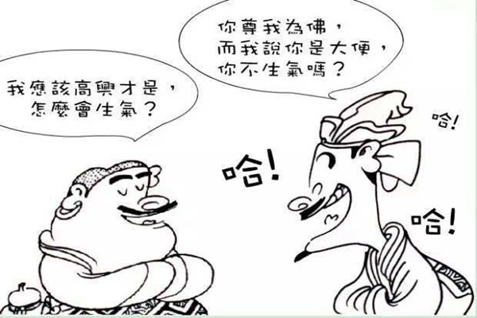

# 情感投射

在生活中不知道你有没有注意到这样的现象，当你和朋友一起吃火锅，朋友问你想不想吃某样“年糕”的时候，通常都是朋友内心想点的菜。当自己有某种喜好和特性的时候，认为对方也有某种喜好和特性，于是就将这些喜好投射给对方。

有这样一则关于苏轼和佛印的“狗屎与金佛”故事流传甚广：一天，苏轼拜访佛印，与佛印对坐，苏轼开玩笑对佛印说：“我看你是一堆狗屎。”而佛印笑着说：“我看你是一尊金佛。”苏轼觉得自己占了莫大的便宜，很是得意。回到家中，对妹妹提起，苏小妹说：“哥哥你输了，佛家说‘佛心自现’，你看别人是什么，就表示你自己是什么。”也许很多人都会对这个故事一笑而过，可是这一句“佛心自现”是非常有道理的，我们都是喜欢把自己的想法投射到他人身上。俗语说的“以小人之心，度君子之腹”就是这个道理。                             

在人际交往当中，我们认识和评价别人的时候，常常避免不了用自己的想法去推测别人的想法。但是别人的想法其实和我们是不一样的，推己及人，我们以投射效应站在自己的角度看待他人，他人同样会以同样的方式看我们自身，人是有共性也有不同的。例如贪婪的人也认为大多数人都是贪婪的；不诚实的人也通常认为大多数人都不是诚实的；自负的人也通常觉得他人是骄傲的；而一个随意泄露他人秘密的人，也认为别人会泄露他的秘密……

这些就是自己内在的投射，投射效应就是将自己的特点归因到对方身上的倾向，就是以己度人。将自己的情感、意志、特性投射到对方身上并强加于他人的一种认知障碍。投射效应是比较主观的，倾向于以自己是什么样的人来感知他人，而不是按照被观察者的真实的情况进行观察，投射过程中普遍缺乏客观的认知。      

其实投射效应除了将自己的情况反射在他人身上之外，还有情感投射。就是对自己喜欢的人越看越喜欢，对自己不喜欢的人越看越不喜欢。这种情况多发生在恋爱的时候，热恋的时候永远都吹嘘对方有多么完美无缺，而一旦失恋，对对方的憎恶溢于言表，并且都是言过其实。所以，在知道了投射效应在人际交往中会对我们造成的影响，我们就应该保持一定的理性，不受这种效应的不良影响。

任何事物都应辩证地去看，投射效应也不例外。投射效应会让我们拿自己的感受去揣摩对方，也就是失去了客观性，从而陷入了偏见的深渊而无法自拔，所以我们需要克服这一点。《庄子·天地》中记载了这样的一个故事：华封人祝尧“长寿、富贵、多男子”。在华封人看来，寿命长、富贵、孩子多是人之所欲，而在尧看来“多男子则多聚，富则多事，寿则多辱”。可以看出来我们每一个人的心理都是不同的，即使是一些基本特征也不能完全投射在他人身上。

由于产生心理投射是因为主观意识在作祟，所以我们可以通过保持理性来克服，从而消除这种效应带来的不良影响。我们要正确认识到别人与自己是不同的，要尊重他人的不同和看法，让自己正确认识到客观的事实。我们要不断地完善自己，让自己能从多方位角度认识他人，更贴近客观事实。如果我们能设身处地地站在他人的角度思考，理解对方的情感和需要，就能更好地与他人沟通，更好地了解到客观事实。

有许多人并不懂得克利用己的投射现象，事实上我们也可以通过别人的投射现象来了解到他们是怎样的一个人。比如他们认为你是怎样的一个人，这里面蕴含着的就是他们的情感投射和自我投射。合理地了解和规避、运用投射现象，我们也就能够避免投射现象带来的不利和享受投射现象带来的便利。

任何事情都不必太过主观看待，但也不必太过客观，当我们成熟到一定程度的时候，不仅对外物宽容，还对自己宽容。