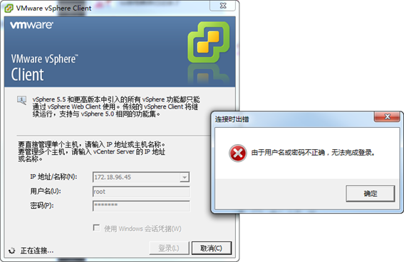
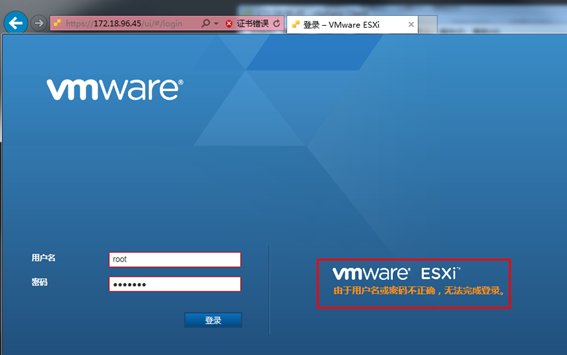
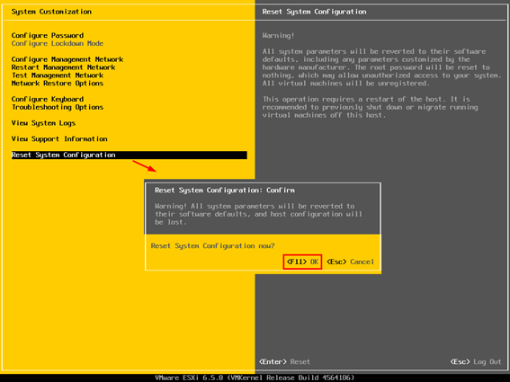
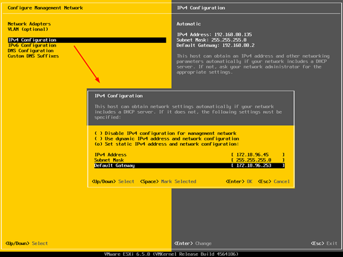
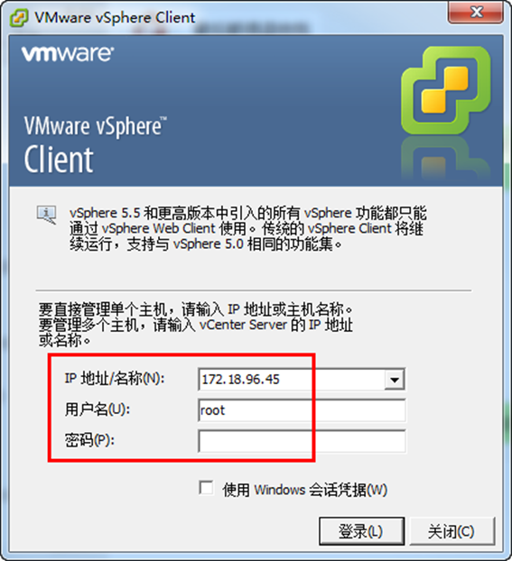
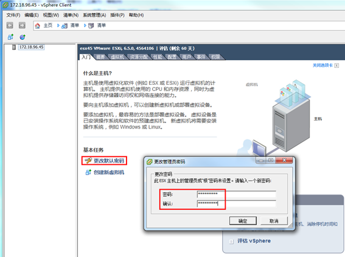

# VMware ESXi 6.7密码正确不能登录

------

今天新安装了一个 `VMware ESXi 6.7` 的系统，密码仍然用的习惯采用的密码。但在使用中，无论是使用 `vSphere Client` 连接，还是在 `vCenter Server` 中添加这台 `ESXi` 系统，都是提示密码不对，最后重置系统设置（密码清空），通过在 `vSphere Client` 设置新的密码的方法解决。下面简单回顾一下问题的现象及解决过程。

（1）使用 `vSphere Client` 登录新安装的 `ESXi 6.7`，提示密码不对，如图1-1所示。

图1-1 提示密码不正确

（2）使用 `Web` 端登录，仍然提示密码不对。如图1-2所示。

图1-2 提示密码不对

（3）在控制台前登录，密码是正确的。因为这台是新安装的，当前也没有进行其他配置。进入控制台，选择"`Reset System Configuration`"重置系统配置，在弹出的对话框中按 `F11` 键，如图1-3所示。重置系统之后，`ESXi` 重新启动。

图1-3 重置系统

我操作到这一步的时候，直接重新设置了一下密码 (`Configure Password`)，并且重启一下系统就可以了。

（4）再次进入系统之后，使用空密码登录，在 "`Configure Management Network→IPv4 Configuration`" 重新设置管理地址，如图1-4所示，设置之后保存退出，不要在控制台设置新密码。

图1-4 设置ESXi管理地址

（5）返回到管理端，使用 `vSphere Client` 再次登录 `ESXi`，输入用户名 `root`，密码为空，登录，如图1-5所示。

图1-5 使用空密码登录

（6）在"基本任务"中单击"更改默认密码"，在弹出的"更改管理员密码"对话框中，提示"此 `ESXi` 主机上的管理员或根密码未设置"，在此对话框中输出密码，如图1-6所示。

图1-6 设置密码

再在 `vCenter Server` 中添加`ESXi` 主机，添加完成。

后记：估计这是一个ESXi 6.5的小bug，我当前安装ESXi 6.5也有10几台了，只有这一台出现过这种故障。

文档转载于：https://www.jianshu.com/p/bec068fdf348