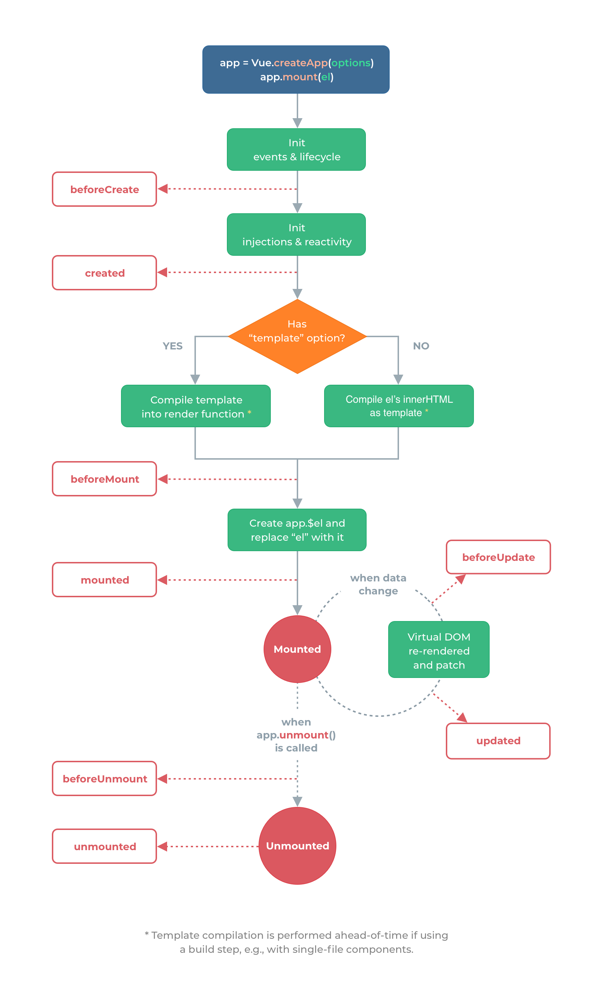

读书规划


# Vue note

学习笔记

## router

https://www.cnblogs.com/yuyujuan/p/9839705.html


新建src/router.config.js

```js
import Hello from '@/components/HelloWorld'
import Home from '@/components/Home'
export default {
  routes: [
    {path: '/home', component:Home},
    {path: '/', component:Hello},
    // {path: '*', redirect:'/home'}
  ]
}
```


main.js中引入

```js
import Vue from 'vue'
import App from './App.vue'
import ElementUI from 'element-ui'
import 'element-ui/lib/theme-chalk/index.css'
import axios from 'axios'
import VueRouter from 'vue-router'
import routerConfig from './router.config'

Vue.config.productionTip = false
Vue.use(ElementUI)
Vue.use(VueRouter)
const router = new VueRouter(routerConfig)
Vue.prototype.$axios = axios
// axios.defaults.baseURL = "http://localhost:18080"

new Vue({
  router,
  render: h => h(App),
}).$mount('#app')

```


App.vue

```js
<template>
  <div id="app">
  <el-container>
    <el-header>
      <router-link to ="/home">TEST</router-link>
      <router-link to ="/">project</router-link>
      Header</el-header>
    <el-container>
      <el-aside width="200px">Aside
        
      </el-aside>
      <el-container>
        <el-main>Main
          <div><router-view></router-view></div>
<!--        <HelloWorld msg="Welcome to Your Vue.js App" title="baby "/>-->
        </el-main>
        <el-footer>Footer
        </el-footer>
      </el-container>
    </el-container>
  </el-container>
  </div>
</template>

<script>
// import HelloWorld from './components/HelloWorld.vue'
export default {
  name: 'App',
  // components: {
  //   HelloWorld
  // }
}
</script>

<style>
#app {
  font-family: Avenir, Helvetica, Arial, sans-serif;
  -webkit-font-smoothing: antialiased;
  -moz-osx-font-smoothing: grayscale;
  text-align: center;
  color: #2c3e50;
  margin-top: 60px;
}
</style>

```

参照


# vue打包后分离config配置文件

用vue-cli构建的项目通常是采用前后端分离的开发模式，也就是前端与后台完全分离，此时就需要将后台接口地址打包进项目中，此时如果只是改个接口地址也要重新打包那就太麻烦了，解决方法是直接加个config.js文件

1.首先我们在static文件下建立一个js文件，就叫config.js吧，内容为

```js
window.g = {
  AXIOS_TIMEOUT: 10000,
  ApiUrl: 'http://localhost:21021/api/services/app', // 配置服务器地址,
  ParentPage: {
    CrossDomainProxyUrl: '/Home/CrossDomainProxy',
    BtnsApi: '/api/services/app/Authorization/GetBtns',
    OrgsApi: '/api/services/app/authorization/GetOrgsByUserId'
  },
}
 

```

2.接下来我们只需要在index.html这个入口文件里引入该文件（注意路径就ok）

```js
<script type="text/javascript" src="/static/config.js"></script>
3.然后你就可以在你需要的地方随意获取就行了，比如

var baseURLStr = window.g.ApiUrl
// 创建axios实例
const service = axios.create({
  baseURL: baseURLStr, // api的base_url
  timeout: 5000 // 请求超时时间
})

```

4.最后在打包成功之后，config,js文件不会被打包，依然存在static文件夹下，如果需要修改只需要用记事本打开文件修改地址就OK了，而且该方法也不会影响开发模式。


## WebSocket

# dashboard VUE改造

 项目信息管理

* [ ] ### hosts

* [ ] ### topology

* [ ] ### hardware resource info

* [ ] ### project info:  project id,key/pg con info/redis passwword/api info/auth info

* [ ] ### 项目版本管理、切换  时间线记录

## 服务管理

* [ ] ### 配置查看

* [ ] ### 配置批量修改

* [ ] ### 服务重启

## 部署管理


| word            | main                                                         | applications                                                 |
| --------------- | ------------------------------------------------------------ | ------------------------------------------------------------ |
| bootstrap       | html,css,js框架                                              | 以前很火，现在的话比较简单重复的企业可能会用到它，它和JQuery一样已经不再是主流。 |
| 前端框架        | html,css,js的库和框架                                        | 提高前端生产效率                                             |
| vue             |                                                              | 你会我也会，工资不高,学习vue较react简单，算法看一看就好，主要是设计模式 |
| react           |                                                              | 你会我也会，工资不高                                         |
| 设计模式        | 指导软件设计开发过程中反复出现的某类问题的思想和解决方案，设计模式是方法论不是现成的代码 | 结构型模式（Structural Patterns）；创建型模式（Creational Patterns）；行为型模式（Behavioral Patterns）； |
| 结构型模式      |                                                              |                                                              |
| 创建型模式      |                                                              |                                                              |
| 行为型模式      |                                                              |                                                              |
| 外观模式/结构型 | 把多个子系统抽象成一个简洁易用的API                          | JQuery把复杂的原生DOM操作抽象和封装并消除了浏览器之间的兼容性问题 |
| 代理模式/结构型 | 降低访问时间或专业成本; 增加额外逻辑                         | 中间商，中介，律师，代理，proxy,缓存                         |
| 工厂模式/创建型 | 集中\统一方法和类,根据传入参数生成不同的对象                 | 构造函数过多,创建对象之间存在某些关联,使用工厂设计模式实现统一集中化管理,避免代码重复\灵活性差 |
| 单例模式/创建型 | 单个实例贯穿整个系统,保持唯一性,优点是: 减少资源占用; 防止重复; | 防止脑裂, 分布式锁保障                                       |
|                 |                                                              |                                                              |
|                 |                                                              |                                                              |


# Vue 3.0 + typescript + element-plus


```bash
npm uninstall  element-ui -S
yarn remove element-ui
```

then install the latest one :

```bash
npm i element-plus -S
#
yarn add element-plus
```

the `main.js` minimum content :

```javascript
import { createApp } from "vue";
import router from "./router";
import store from "./store";

import ElementPlus from "element-plus";
import "element-plus/lib/theme-chalk/index.css";

import App from "./App.vue";

createApp(App)
.use(ElementPlus)
.use(store)
.use(router)
.mount("#app");
```

在 main.js 中写入以下内容：

```javascript
import { createApp } from 'vue'
import ElementPlus from 'h';
import 'element-plus/lib/theme-chalk/index.css';
import App from './App.vue';

const app = createApp(App)
app.use(ElementPlus)
app.mount('#app')
```

以上代码便完成了 Element Plus 的引入。需要注意的是，样式文件需要单独引入。

## axios


# websoket

公共状态管理


#    vue3 动画特效教程 [技术胖](https://jspang.com/detailed?id=71#toc21)

技术胖 https://jspang.com/detailed?id=68  23集

官方 https://www.vue3js.cn/docs/zh/guide/introduction.html#%E5%A3%B0%E6%98%8E%E5%BC%8F%E6%B8%B2%E6%9F%93   45小节

https://v3.cn.vuejs.org/guide/introduction.html#vue-js-%E6%98%AF%E4%BB%80%E4%B9%88

google https://www.google.com/search?q=vue3+%E8%AF%AD%E6%B3%95&oq=vue3+%E8%AF%AD%E6%B3%95&aqs=chrome..69i57j0i30j0i8i30l2.2227j0j7&sourceid=chrome&ie=UTF-8


目标:   =>  VUE3+ts 

1. 能够搭建 devops运维平台
2. 实现webssh, axios动态加载


# 学习书签

| 学习进度                                                     |                                            |                     |
| ------------------------------------------------------------ | ------------------------------------------ | ------------------- |
| Dom                                                          |                                            |                     |
| Mustaceh                                                     |                                            |                     |
| 应用 & 组件实例https://www.vue3js.cn/docs/zh/guide/instance.html | https://codepen.io/team/Vue/pen/KKpRVpx    | 2021-07-15 09:48:43 |
|                  |                                            |                     |
| [模板语法](https://www.vue3js.cn/docs/zh/guide/template-syntax.html#%E6%8F%92%E5%80%BC) |                                            |                     |
| [data property](https://www.vue3js.cn/docs/zh/guide/data-methods.html#data-property) |                                            |                     |
| [方法](https://www.vue3js.cn/docs/zh/guide/data-methods.html#%E6%96%B9%E6%B3%95) |                                            |                     |
| [生命周期勾子](https://www.vue3js.cn/docs/zh/guide/instance.html#%E7%94%9F%E5%91%BD%E5%91%A8%E6%9C%9F%E9%92%A9%E5%AD%90) => [方法](https://www.vue3js.cn/docs/zh/guide/data-methods.html#%E6%96%B9%E6%B3%95) |                                            |                     |
| [防抖和节流](https://www.vue3js.cn/docs/zh/guide/data-methods.html#%E9%98%B2%E6%8A%96%E5%92%8C%E8%8A%82%E6%B5%81) |                                            |                     |
| [计算属性和侦听器](https://www.vue3js.cn/docs/zh/guide/computed.html#%E8%AE%A1%E7%AE%97%E5%B1%9E%E6%80%A7) | [笔记](.detail_vue_ts/计算属性与侦听器.md) |                     |


# 书签尾部


