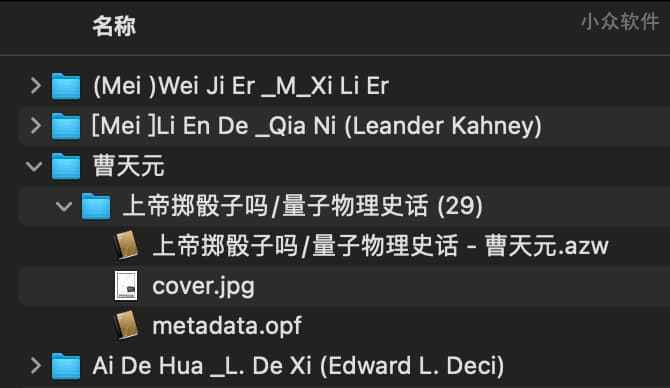

# 请 Calibre 不要翻译我的文件路径

Calibre 是一款一站式电子书解决方案，它可以管理电子书、转换格式、阅读电子书、下载、编辑电子书等等，但它有个特点，当你将文件名为中文的电子书加入到 Calibre 库里后，它会帮你自动把文件名改为拼音，这让很多用户很崩溃，但又没什么办法。@[Appinn](https://www.appinn.com/calibre-do-not-translate-my-file-paths/)

关于自动改名这件事，有不少同学完全不能忍，提出《[求助好的电子书管理软件，calibre对中文支持太差了](https://meta.appinn.net/t/topic/25782)》这样的问题。在另一个问题《[有可以建立本地电脑图书馆系统软件吗](https://meta.appinn.net/t/topic/47800)？》中，@**[czz404](https://meta.appinn.net/t/topic/47800/5?u=qingwa)** 同学推荐的这款插件，终于解决了这个问题。

## Calibre 不要翻译我的文件路径 | Calibre: Do not translate my file paths

开发者 @**Cirn09** 在 [GitHub](https://github.com/Cirn09/calibre-do-not-translate-my-path) 发布了这个名字听起来就很霸气的插件，比较正经一点的描述是：将我的书库从拼音目录切换至非纯英文（中文）命名。

### 已经是拼音名

对于已经是 Calibre 用户并且书库里有不少存货的同学，安装插件后，可以如下：

1. 备份你的书库（可选，建议）
2. 打开书库，按下 Ctrl+A 选中所有书籍
3. 右键 – 编辑元数据 – 批量编辑元数据 – “查找替换”页
4. 查找模式：正则表达式，查找的字段：`title`，搜索：`$`，替换为：`__DELME__`
5. 点击“应用”，等待 Calibre 完成（点击前注意看一下下面的替换预阅，新书名应当是原书名+`__DELME__`）
6. 查找模式：字符匹配，查找的字段：`title`，搜索：`__DELME__`，“替换为”保持为空（
7. 点击“确定”，等待 Calibre 完成（点击前注意看一下下面的替换预阅，此时的新书名应当是原本的书名）

**注**：青小蛙测试并没有成功，不是很明白这个替换的逻辑… 已成功

### 新用户

对于 Calibre 新用户，请使用上个月发布的 Calibre 6.27.0 版本，前两天发布的最新版本还不支持。

然后从[这里下载](https://github.com/Cirn09/calibre-do-not-translate-my-path/releases)对应版本后，直接覆盖即可（macOS 用户请右键显示包内容，替换掉源程序同位置的文件即可）。

然后，你就能得到 作者 – 书名 这样的目录结构了：

终于舒服了。

------

原文：https://www.appinn.com/calibre-do-not-translate-my-file-paths/