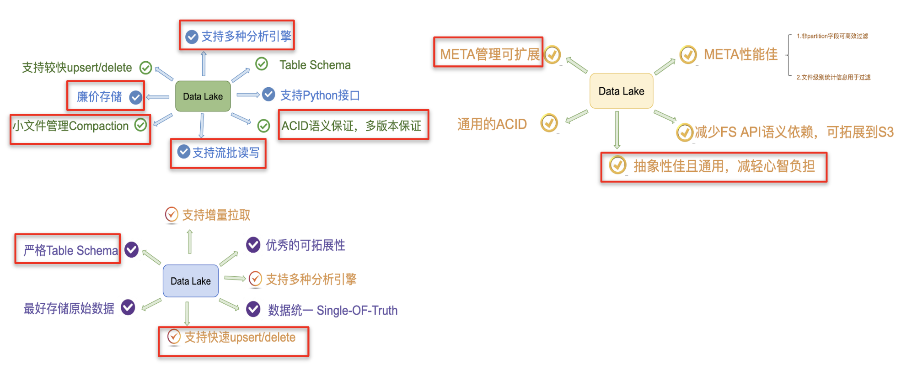

# Delta、Iceberg、Hudi用途, 优缺点

没有数据湖前各公司场景:

**Databricks** 的客户一般会采用经典的 Lambda 架构来构建他们的流批处理场景。以用户点击行为分析为例，点击事件经 Kafka 被下游的 Spark Streaming 作业消费，分析处理（业务层面聚合等）后得到一个实时的分析结果，这个实时结果只是当前时间所看到的一个状态，无法反应时间轴上的所有点击事件。所以为了保存全量点击行为，Kafka 还会被另外一个 Spark Batch 作业分析处理，导入到文件系统上（一般就是 parquet 格式写 HDFS 或者 S3，可以认为这个文件系统是一个简配版的数据湖），供下游的 Batch 作业做全量的数据分析以及 AI 处理等。

这套方案其实存在很多问题  :

第一、批量导入到文件系统的数据一般都缺乏全局的严格 schema 规范，下游的 Spark 作业做分析时碰到格式混乱的数据会很麻烦，每一个分析作业都要过滤处理错乱缺失的数据，成本较大；

第二、数据写入文件系统这个过程没有 ACID 保证，用户可能读到导入中间状态的数据。所以上层的批处理作业为了躲开这个坑，只能调度避开数据导入时间段，可以想象这对业务方是多么不友好；同时也无法保证多次导入的快照版本，例如业务方想读最近 5 次导入的数据版本，其实是做不到的。

第三、用户无法高效 upsert/delete 历史数据，parquet 文件一旦写入 HDFS 文件，要想改数据，就只能全量重新写一份的数据，成本很高。事实上，这种需求是广泛存在的，例如由于程序问题，导致错误地写入一些数据到文件系统，现在业务方想要把这些数据纠正过来；线上的 MySQL binlog 不断地导入 update/delete 增量更新到下游数据湖中；某些数据审查规范要求做强制数据删除，例如欧洲出台的 GDPR 隐私保护等等。

第四、频繁地数据导入会在文件系统上产生大量的小文件，导致文件系统不堪重负，尤其是 HDFS 这种对文件数有限制的文件系统。

参考链接: https://www.infoq.cn/article/fjebconxd2sz9wloykfo

| Hudi                                    |      |      |
| --------------------------------------- | ---- | ---- |
| fast upsert/delete 存量 和 快速增量数据 |      |      |
| compaction                              |      |      |
|                                         |      |      |

# 各公司痛点

|                                                              | As of v0.12.2 | As of v2.2.0 |  As of v1.1.0 |
| ------------------------------------------------------------ | ------------------------------------------------------------ | ------------------------------------------------------------ | ------------------------------------------------------------ |
| **Read/write features**                                      |                                                              |                                                              |                                                              |
| **ACID Transactions**                                        |  |  |  |
| **Copy-On-Write** (Can I version and rewrite columnar files?) | [Writes](https://hudi.apache.org/docs/table_types#copy-on-write-table) | [Writes](https://docs.delta.io/latest/delta-batch.html#write-to-a-table) | [Writes](https://iceberg.apache.org/docs/latest/spark-writes/) |
| **Merge-On-Read**(Can I efficiently amortize updates without rewriting the whole file?) | [Merge-On-Read](https://hudi.apache.org/docs/table_types#merge-on-read-table) |  | [Limited functionality,](https://iceberg.apache.org/docs/latest/configuration/) Cannot balance merge perf for queries. Also Requires manual compaction maintenance |
| **Efficient** **Bulk** **Load** (Can I efficiently layout the initial load into the table? ) | [Bulk_Insert](https://hudi.apache.org/docs/write_operations#bulk_insert) |  |  |
| **Efficient merge writes with record-level indices** (can I avoid merging all base files against all incoming update/delete records?) | Over 4 types of [Indexing](https://hudi.apache.org/docs/indexing) | [Bloom filter index still proprietary](https://docs.databricks.com/delta/optimizations/bloom-filters.html) | [Metadata ](https://tabular.io/blog/iceberg-metadata-indexing/)[indexing](https://tabular.io/blog/iceberg-metadata-indexing/) is for tracking statistics |
| **Bootstrap **** **(Can I upgrade data in-place into the system without rewriting the data?) | [Bootstrap](https://hudi.apache.org/docs/migration_guide) | [Convert to delta](https://docs.databricks.com/spark/latest/spark-sql/language-manual/delta-convert-to-delta.html) | [Table migration](https://iceberg.apache.org/docs/latest/hive/#table-migration) |
| **Incremental Query **** **(can I obtain a change stream for a given time window on the table?) | [Incremental Query](https://hudi.apache.org/docs/querying_data#spark-incr-query) | [CDF Experimental mode in 2.0.0](https://docs.delta.io/2.0.0/delta-change-data-feed.html) | [Can only incrementally read appends](https://iceberg.apache.org/docs/latest/spark-queries/#incremental-read) |
| **Time travel** (can I query the table as of a point-in-time?) | [Time Travel](https://hudi.apache.org/docs/quick-start-guide/#time-travel-query) | [Time Travel](https://docs.delta.io/latest/delta-batch.html#-deltatimetravel) | [Time Travel](https://iceberg.apache.org/docs/latest/spark-queries/#time-travel) |
| **Managed Ingestion** (can I ingest data stream from popular sources, with no/low code?) | [Hudi DeltaStreamer](https://hudi.apache.org/docs/hoodie_deltastreamer) |  |  |
| **Concurrency** (can I run different writers and table services against the table at the same time?) | [OCC with Non-blocking table services](https://hudi.apache.org/blog/2021/12/16/lakehouse-concurrency-control-are-we-too-optimistic) | [OCC only](https://docs.delta.io/latest/concurrency-control.html#write-conflicts) | [OCC only](https://iceberg.apache.org/spec/#optimistic-concurrency) |
| **Primary Keys** (Can I define primary keys like regular database tables?) | [Primary Keys](https://hudi.apache.org/docs/key_generation/) |  |  |
| **Column Statistics and Data Skipping** (Can queries benefit from file pruning based on predicates from any column, without reading data files footers?) |  [Col Stats in metadata](https://www.onehouse.ai/blog/hudis-column-stats-index-and-data-skipping-feature-help-speed-up-queries-by-an-orders-of-magnitude) [Hfile Column Stats Index adds up to 50x perf](https://www.onehouse.ai/blog/hudis-column-stats-index-and-data-skipping-feature-help-speed-up-queries-by-an-orders-of-magnitude) |  [Column Stats in parquet checkpoint](https://docs.delta.io/latest/optimizations-oss.html#data-skipping) |  [Column Stats in avro manifest](https://iceberg.apache.org/docs/latest/performance/#metadata-filtering) |
| **Data Skipping based on built-in functions**(Can queries perform data skipping based on functions defined on column values, in addition to literal column values?) |  With [col stats index](https://www.onehouse.ai/blog/hudis-column-stats-index-and-data-skipping-feature-help-speed-up-queries-by-an-orders-of-magnitude), Hudi can effectively prune files based on column predicates, and [order preserving functions](https://hudi.apache.org/releases/release-0.11.0#data-skipping-with-metadata-table) on columns. | Logical predicates on a source or a[Generated column](https://docs.delta.io/latest/delta-batch.html#-deltausegeneratedcolumns) will prune files during query execution | [Iceberg can transform table data to partition values and maintain relationship](https://iceberg.apache.org/docs/latest/partitioning/#icebergs-hidden-partitioning), while also collecting stats on columns |
| **Partition Evolution  **(Can I keep changing the partition structure of the table as we go?) | Hudi takes a different approach with coarse-grained partitions and fine-grained [Clustering](https://hudi.apache.org/docs/clustering) which can be evolved async without rewriting data. | Delta Lake also considers more complex partitioning as an anti-pattern | [Partition Evolution](https://iceberg.apache.org/docs/latest/evolution/#partition-evolution) lets you change partitions as your data evolves. Old data stays in old partitions, new data gets new partitions, with uneven performance across them. |
| **Data deduplication**(can I insert data without introducing duplicates?) | [Record key uniqueness](https://hudi.apache.org/docs/key_generation),[Precombine Utility Customizations](https://hudi.apache.org/docs/next/faq/#how-does-hudi-handle-duplicate-record-keys-in-an-input),[Merge](https://hudi.apache.org/docs/quick-start-guide#mergeinto),[Drop dupes from inserts](https://hudi.apache.org/docs/configurations/#hoodiedatasourcewriteinsertdropduplicates) | [Merge](https://docs.delta.io/latest/delta-update.html#data-deduplication-when-writing-into-delta-tables) Only | [Merge](https://iceberg.apache.org/docs/latest/spark-writes/#merge-into) Only |
| **Table Services**                                           |                                                              |                                                              |                                                              |
| **File Sizing** (Can I configure a single standard file size to be enforced across any writes to the table automatically?) | [Automated file size tuning](https://hudi.apache.org/docs/file_sizing) | [OPTIMIZE](https://docs.delta.io/latest/optimizations-oss.html) cmd open sourced in 2.0, but [automation](https://docs.databricks.com/delta/optimizations/file-mgmt.html#autotune-based-on-workload) still proprietary | [Manual maintenance](https://iceberg.apache.org/docs/latest/maintenance/#optional-maintenance) |
| **Compaction** (Merge changelogs with updates/deletes  from MoR writes) | [Managed Compaction](https://hudi.apache.org/docs/compaction) | File sizing only. No MoR, so no compaction of deletes/changes | Delete compaction [manual maintenance](https://iceberg.apache.org/javadoc/0.13.1/org/apache/iceberg/actions/RewriteDataFiles.html) |
| **Cleaning** (Do older versions of files get automatically removed from storage?) | [Managed cleaning service](https://hudi.apache.org/docs/hoodie_cleaner) | [VACUUM](https://docs.delta.io/latest/delta-batch.html#data-retention) is manual operation for data and managed for the transaction log | [Expiring snapshots](https://iceberg.apache.org/docs/latest/maintenance/#expire-snapshots) is manual operation |
| **Index management**  (Can I build new indices on the table?) | [Async multi-modal indexing subsystem](https://www.onehouse.ai/blog/asynchronous-indexing-using-hudi) |  |  |
| **Linear Clustering ** (Can I linearly co-locate certain data close together for performance?) | [Automated Clustering](https://hudi.apache.org/blog/2021/01/27/hudi-clustering-intro/) that can be evolved for perf tuning, [user defined partitioners](https://hudi.apache.org/docs/configurations/#hoodiebulkinsertuserdefinedpartitionerclass) |  |  You can force writers to [sort as ](https://iceberg.apache.org/docs/latest/spark-ddl/#alter-table--write-ordered-by)[they](https://iceberg.apache.org/docs/latest/spark-ddl/#alter-table--write-ordered-by)[ write](https://iceberg.apache.org/docs/latest/spark-ddl/#alter-table--write-ordered-by). |
| **Multidimensional Z-Order/Space Curve Clustering**(Can I sort high cardinality data with space curves for performance?) | [Z-Order + Hilbert Curves](https://hudi.apache.org/blog/2021/12/29/hudi-zorder-and-hilbert-space-filling-curves/) with auto async clustering | [Z-Order](https://docs.delta.io/latest/optimizations-oss.html#z-ordering-multi-dimensional-clustering) through manual maintenance | [Z-Order](https://iceberg.apache.org/docs/latest/spark-procedures/#rewrite_data_files) through manual maintenance |
| **Schema Evolution** (Can I adjust the schema of my table)   |  [Schema evolution](https://hudi.apache.org/docs/schema_evolution/) for add, reorder, drop, rename, update (Spark only) |  [Schema evolution](https://docs.delta.io/latest/delta-batch.html#update-table-schema) for add, reorder, drop, rename, update |  [Schema evolution](https://iceberg.apache.org/docs/latest/evolution/#schema-evolution) for add, reorder, drop, rename, update |
| **Scalable Metadata Management** (Can the table metadata scale with my data sizes) |  Hudi [MoR based metadata table](https://hudi.apache.org/docs/metadata/) w/ [HFile formats for 100x faster lookups](https://www.onehouse.ai/blog/introducing-multi-modal-index-for-the-lakehouse-in-apache-hudi#Fast-Lookup), self managed like any Hudi Table |  [Parquet txn log checkpoints ](https://github.com/delta-io/delta/blob/master/PROTOCOL.md#checkpoints-1)significantly slower lookups | [Avro Manifest files](https://iceberg.apache.org/spec/#manifests) significantly slower and [need ](https://medium.com/adobetech/taking-query-optimizations-to-the-next-level-with-iceberg-6c968b83cd6f#manifest-rewrite)[maintenance](https://medium.com/adobetech/taking-query-optimizations-to-the-next-level-with-iceberg-6c968b83cd6f#manifest-rewrite)[ as you scale](https://medium.com/adobetech/taking-query-optimizations-to-the-next-level-with-iceberg-6c968b83cd6f#manifest-rewrite) |
| **Platform Support**                                         |                                                              |                                                              |                                                              |
| **CLI** (Can I manage my tables with a CLI)                  |  [CLI](https://hudi.apache.org/docs/cli) |  |  |
| **Data Quality Validation** (Can I define quality conditions to be checked and enforced?) |  [Pre-Commit Validators](https://hudi.apache.org/docs/precommit_validator) |  [Delta Constraints](https://docs.delta.io/latest/delta-constraints.html) |  |
| **Pre-commit Transformers** (Can I transform data before commit while I write?) |  [Transformers](https://hudi.apache.org/docs/transforms/) |  |  |
| **Commit Notifications** (Can I get a callback notification on successful commit?) |  [Commit Notifications](https://hudi.apache.org/docs/writing_data#commit-notifications) |  |  |
| **Failed Commit Safeguards** (How am I protected from partial and failed write operations?) |  [Automated Marker Mechanism](https://hudi.apache.org/docs/markers) |  [Manual ](https://docs.delta.io/latest/delta-batch.html#idempotent-writes)[configs](https://docs.delta.io/latest/delta-batch.html#idempotent-writes) |  [Orphaned files](https://iceberg.apache.org/docs/latest/maintenance/#delete-orphan-files) need manual maintenance, [failed commits can corrupt table](https://github.com/apache/iceberg/issues/4666) |
| **Monitoring** (Can I get metrics and monitoring out of the box?) |  [MetricsReporter](https://hudi.apache.org/docs/metrics) for automated monitoring |  |  |
| **Savepoint and Restore** (Can I save a snapshot of the data and then restore the table back to this form?) | [Savepoint command to  save specific versions.](https://hudi.apache.org/docs/disaster_recovery#savepoint)[Restore command with time travel versions or savepoints](https://hudi.apache.org/docs/disaster_recovery#restore) |  [Restore command with time travel versions](https://docs.delta.io/latest/delta-utility.html#-restore-delta-table)Have to preserve all versions in vacuum retention (eg. If you want to restore to 6mon ago, you have to retain 6mon of versions or DIY) | [DIY](https://iceberg.apache.org/docs/latest/reliability/) |
| **Ecosystem** **Support**                                    |                                                              |                                                              |                                                              |
| Apache Spark                                                 | [Read + Write](https://hudi.apache.org/docs/quick-start-guide) | [Read + Write](https://docs.delta.io/latest/quick-start.html#set-up-apache-spark-with-delta-lake) | [Read + Write](https://iceberg.apache.org/docs/latest/getting-started/) |
| Apache Flink                                                 | [Read + Write](https://hudi.apache.org/docs/flink-quick-start-guide) | [Read + Write](https://github.com/delta-io/connectors/tree/master/flink) | [Read + Write](https://iceberg.apache.org/docs/latest/flink/) |
| Presto                                                       | [Read](https://prestodb.io/docs/current/connector/hudi.html) | [Read](https://prestodb.io/docs/current/connector/deltalake.html) | [Read + Write](https://prestodb.io/docs/current/connector/iceberg.html) |
| Trino                                                        | [Read](https://trino.io/docs/current/connector/hudi.html)    | [Read + Write](https://trino.io/docs/current/connector/delta-lake.html) | [Read + Write](https://trino.io/docs/current/connector/iceberg.html) |
| Hive                                                         | [Read](https://hudi.apache.org/docs/next/query_engine_setup/#hive) | [Read](https://github.com/delta-io/connectors/tree/master/hive) | [Read + Write](https://iceberg.apache.org/docs/latest/hive/) |
| DBT                                                          | [Read + Write](https://hudi.apache.org/blog/2022/07/11/build-open-lakehouse-using-apache-hudi-and-dbt) | [Read + Write](https://docs.databricks.com/integrations/prep/dbt.html) |  |
| Kafka Connect                                                | [Write](https://github.com/apache/hudi/tree/master/hudi-kafka-connect) | [Proprietary only](https://docs.confluent.io/cloud/current/connectors/cc-databricks-delta-lake-sink/cc-databricks-delta-lake-sink.html) |  |
| Kafka                                                        | [Write](https://hudi.apache.org/docs/hoodie_deltastreamer#kafka) | [Write](https://github.com/delta-io/kafka-delta-ingest)      |  |
| Pulsar                                                       | [Write](https://hub.streamnative.io/connectors/lakehouse-sink/2.9.2/) | [Write](https://hub.streamnative.io/connectors/lakehouse-sink/2.9.2/) | [Write](https://hub.streamnative.io/connectors/lakehouse-sink/2.9.2/) |
| Debezium                                                     | [Write](https://hudi.apache.org/cn/blog/2022/01/14/change-data-capture-with-debezium-and-apache-hudi/) | [Write](https://medium.com/everything-full-stack/streaming-data-changes-to-a-data-lake-with-debezium-and-delta-lake-pipeline-299821053dc3) | [Write](https://debezium.io/blog/2021/10/20/using-debezium-create-data-lake-with-apache-iceberg/) |
| Kyuubi                                                       | [Read + Write](https://kyuubi.readthedocs.io/en/v1.6.0-incubating-rc0/connector/flink/hudi.html) |  | [Read + Write](https://kyuubi.readthedocs.io/en/v1.6.0-incubating-rc0/connector/flink/iceberg.html) |
| ClickHouse                                                   | [Read](https://clickhouse.com/docs/en/whats-new/changelog/#-clickhouse-release-2211-2022-11-17) | [Read](https://clickhouse.com/docs/en/whats-new/changelog/#-clickhouse-release-2211-2022-11-17) |  |
| Apache Impala                                                | [Read + Write](https://hudi.apache.org/docs/querying_data/#impala-34-or-later) |  | [Read + Write](https://impala.apache.org/docs/build/html/topics/impala_iceberg.html) |
| AWS Athena                                                   | [Read](https://docs.aws.amazon.com/athena/latest/ug/querying-hudi.html) | [Read](https://docs.delta.io/latest/presto-integration.html#limitations) | [Read + Write](https://docs.aws.amazon.com/athena/latest/ug/querying-iceberg.html) |
| AWS EMR                                                      | [Read + Write](https://docs.aws.amazon.com/emr/latest/ReleaseGuide/emr-hudi-installation-and-configuration.html) | [Read + Write](https://docs.aws.amazon.com/emr/latest/EMR-Serverless-UserGuide/using-delta-lake.html) | [Read + Write](https://docs.aws.amazon.com/emr/latest/ReleaseGuide/emr-iceberg.html) |
| AWS Redshift                                                 | [Read](https://docs.aws.amazon.com/redshift/latest/dg/c-spectrum-external-tables.html) | [Read](https://docs.aws.amazon.com/redshift/latest/dg/c-spectrum-external-tables.html) |  |
| AWS Glue                                                     | [Read + Write](https://docs.aws.amazon.com/glue/latest/dg/aws-glue-programming-etl-format-hudi.html) | [Read + Write](https://aws.amazon.com/marketplace/pp/prodview-seypofzqhdueq) | [Read + Write](https://aws.amazon.com/marketplace/pp/prodview-iicxofvpqvsio) |
| Google BigQuery                                              | [Read](https://hudi.apache.org/docs/gcp_bigquery/)           |  | [Read](https://cloud.google.com/bigquery/docs/iceberg-tables) |
| Google DataProc                                              | [Read + Write](https://cloud.google.com/blog/products/data-analytics/getting-started-with-new-table-formats-on-dataproc) | [Read + Write](https://cloud.google.com/blog/products/data-analytics/getting-started-with-new-table-formats-on-dataproc) | [Read + Write](https://cloud.google.com/blog/products/data-analytics/getting-started-with-new-table-formats-on-dataproc) |
| Azure Synapse                                                | [Read + Write](https://www.onehouse.ai/blog/apache-hudi-on-microsoft-azure) | [Read + Write](https://docs.microsoft.com/en-us/azure/synapse-analytics/spark/apache-spark-what-is-delta-lake) |  |
| Azure HDInsight                                              | [Read + Write](https://www.onehouse.ai/blog/apache-hudi-on-microsoft-azure) | [Read + Write](https://techcommunity.microsoft.com/t5/analytics-on-azure-blog/delta-lake-on-azure/ba-p/1869746) |  |
| Databricks                                                   | [Read + Write](https://hudi.apache.org/docs/azure_hoodie/)   | [Read + Write](https://docs.databricks.com/delta/index.html) | [Read + Write](https://docs.microsoft.com/en-us/azure/databricks/delta/delta-utility#--convert-an-iceberg-table-to-a-delta-table) |
| Snowflake                                                    |  | [Read](https://docs.snowflake.com/en/sql-reference/sql/create-external-table.html#external-table-that-references-files-in-a-delta-lake) | [Read](https://www.snowflake.com/blog/expanding-the-data-cloud-with-apache-iceberg/)[ + Write](https://www.snowflake.com/blog/expanding-the-data-cloud-with-apache-iceberg/) |
| Vertica                                                      | [Read](https://www.vertica.com/kb/Apache_Hudi_TE/Content/Partner/Apache_Hudi_TE.htm) | [Read](https://www.vertica.com/kb/Vertica_DeltaLake_Technical_Exploration/Content/Partner/Vertica_DeltaLake_Technical_Exploration.htm) |  |
| Apache Doris                                                 | [Read](https://doris.apache.org/docs/ecosystem/external-table/hudi-external-table/) |  | [Read](https://doris.apache.org/docs/ecosystem/external-table/iceberg-of-doris?_highlight=iceberg) |
| Starrocks                                                    | [Read](https://docs.starrocks.com/en-us/main/using_starrocks/External_table#hudi-external-table) | [Preview](https://docs.starrocks.io/en-us/main/data_source/catalog/deltalake_catalog) | [Read](https://docs.starrocks.com/en-us/main/using_starrocks/External_table#apache-iceberg-external-table) |
| Dremio                                                       |  | [Read](https://docs.dremio.com/software/data-formats/delta-lake/')[With limintations](https://docs.dremio.com/software/data-formats/delta-lake/#limitations') | [Read + Write](https://docs.dremio.com/software/data-formats/apache-iceberg/#limitations)[With limitations](https://docs.dremio.com/software/data-formats/apache-iceberg/#limitations) |

# Alluxio、Jindofs