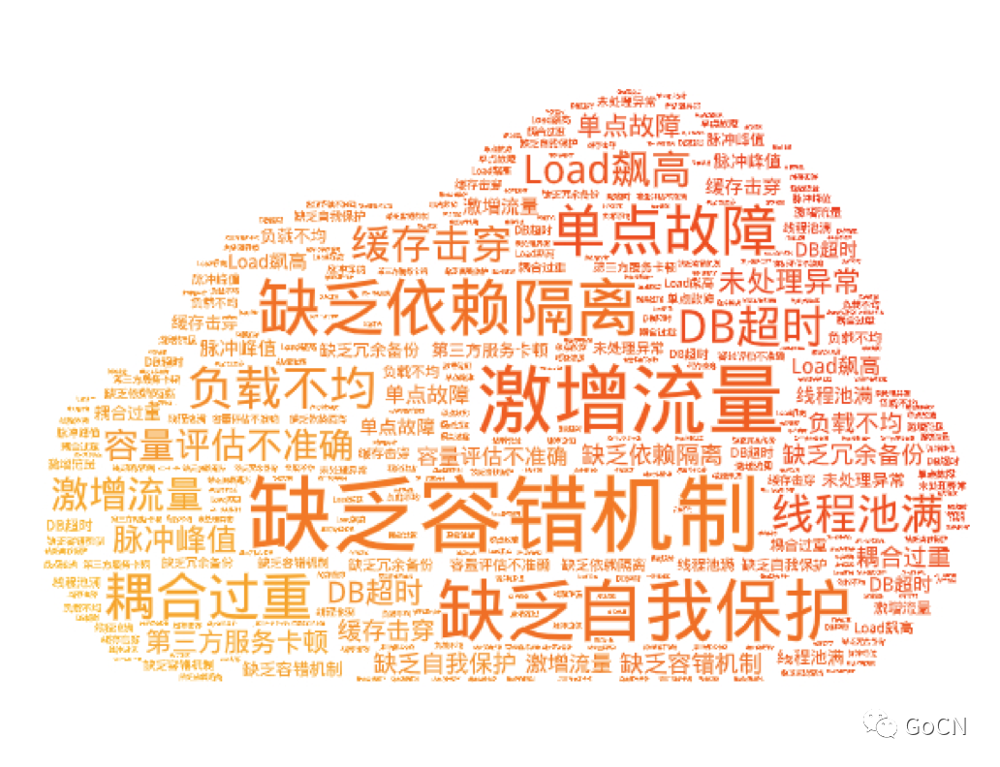
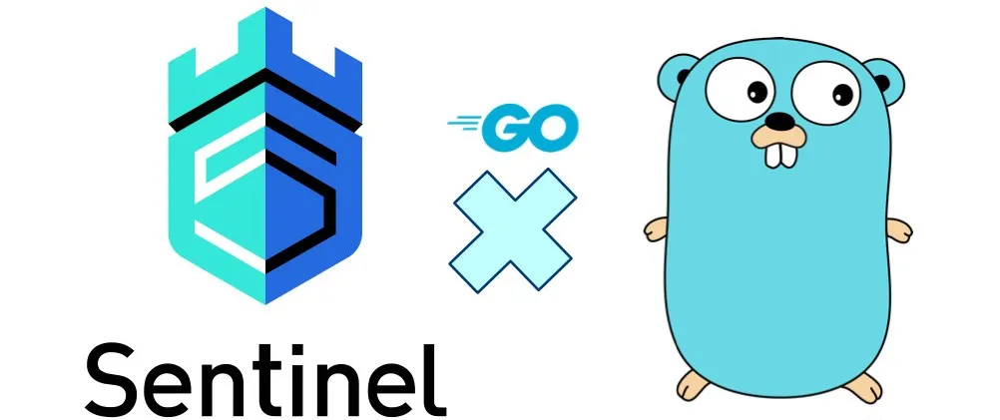
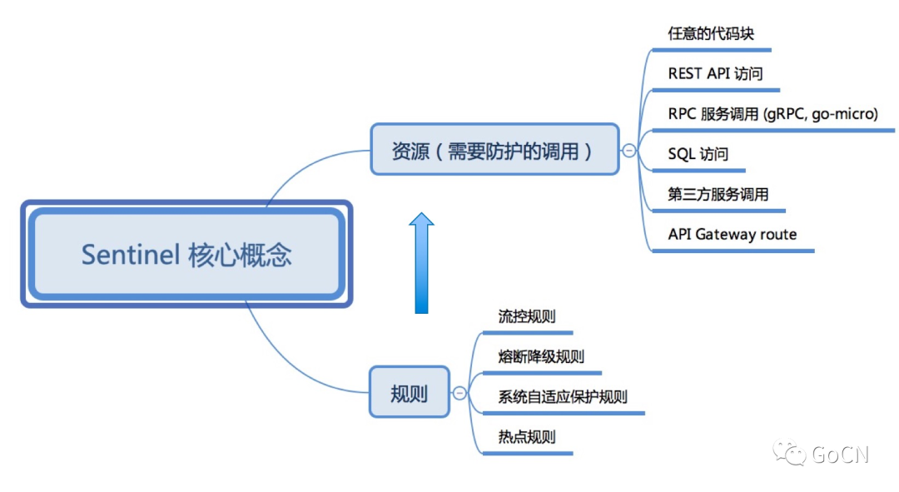
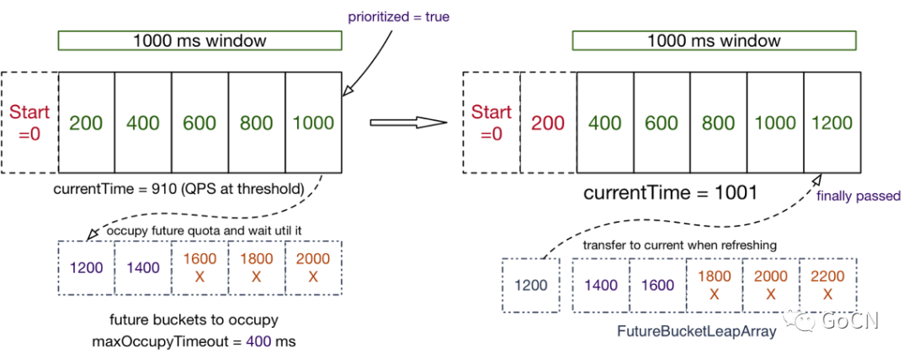
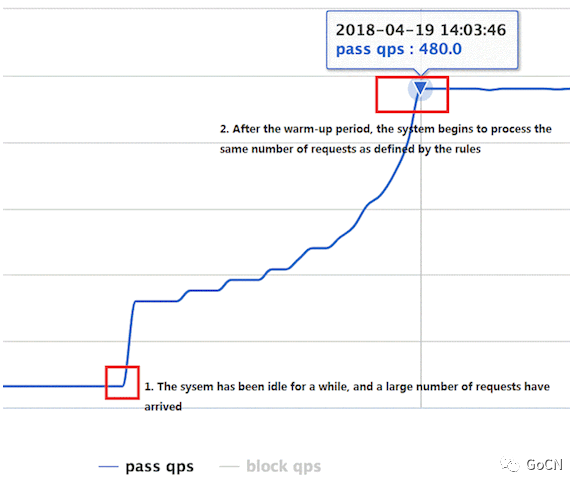
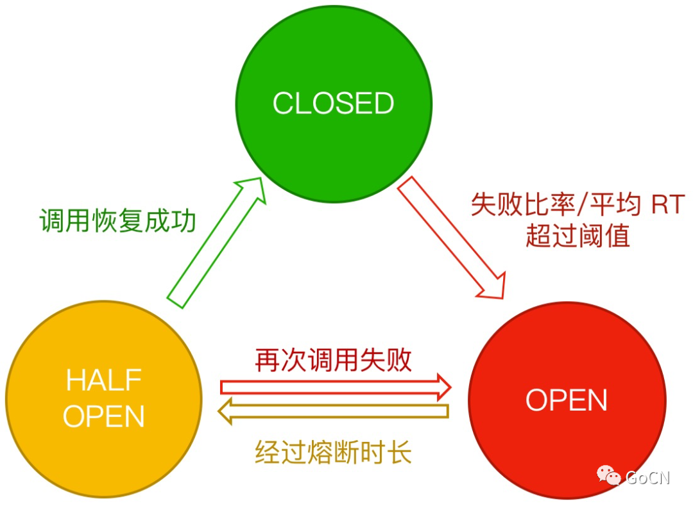
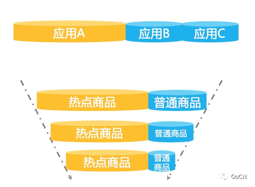
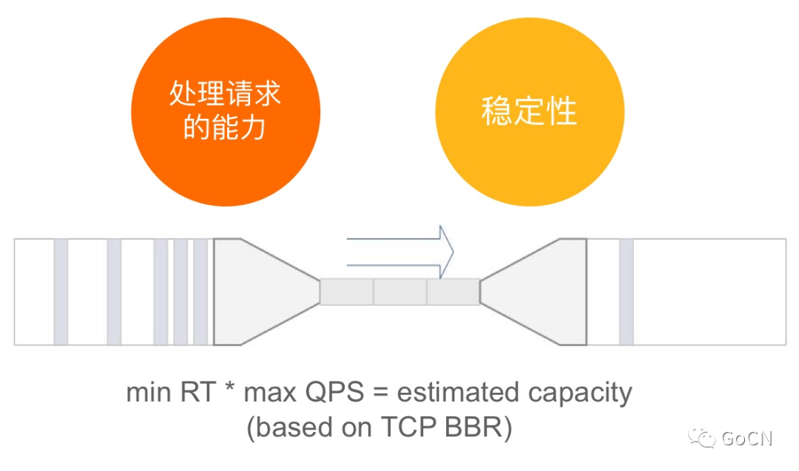

## 还在担心服务挂掉？Sentinel Go 让服务稳如磐石

原创 赵奕豪 [GoCN](javascript:void(0);) *2020-09-21*

## **背景**

微服务的稳定性一直是开发者非常关注的话题。随着业务从单体架构向分布式架构演进以及部署方式的变化，服务之间的依赖关系变得越来越复杂，业务系统也面临着巨大的高可用挑战。

##  

 

​        

 

在生产环境中大家可能遇到过以下不稳定的情况：

 

* 大促时瞬间洪峰流量导致系统超出最大负载，load 飙高，系统崩溃导致用户无法下单
* “黑马”热点商品击穿缓存，DB 被打垮，挤占正常流量
* 调用端被不稳定第三方服务拖垮，线程池被占满，调用堆积，导致整个调用链路卡死

 

这些不稳定的场景可能会导致严重后果，但很多时候我们又容易忽视这些与流量/依赖相关的高可用防护。大家可能想问：如何预防这些不稳定因素带来的影响？如何针对流量进行高可用的防护？如何保障服务“稳如磐石”？这时候我们就要请出服务高可用保障的利器 —— Sentinel。

 

## **Sentinel介绍**

 

Sentinel 是阿里巴巴开源的，面向分布式服务架构的流量控制组件，主要以流量为切入点，从限流、流量整形、熔断降级、系统自适应保护等多个维度来帮助开发者保障微服务的稳定性。Sentinel 承接了阿里巴巴近 10 年的双十一大促流量的核心场景，例如秒杀、冷启动、消息削峰填谷、集群流量控制、实时熔断下游不可用服务等，是保障微服务高可用的利器，原生支持 Java/Go/C++ 等多种语言，并且提供 Istio/Envoy 全局流控支持来为 Service Mesh 提供高可用防护的能力。

 



 

在今年年初，社区宣布了 Sentinel Go 版本的发布，为 Go 语言的微服务提供流控降级、系统自适应保护等特性的原生支持，标志着 Sentinel 朝着多元化与云原生迈出了重要的一步。在这半年的时间内，社区推出了近 10 个版本，逐步对齐了限流、熔断降级、系统自适应流控、热点防护等核心能力；同时社区也在不断扩充开源生态，目前已提供 go-micro、gRPC、Dubbo、Gin 等框架的适配模块，使用这些框架的开发者可以非常简单快速地接入 Sentinel。

 

Sentinel 里面有两个核心的抽象概念：资源和规则：

 

* 资源 (resource) 是 Sentinel 的关键概念，它代表某个逻辑块、函数或接口的调用。它可以是某个 Web API，或者是某个 RPC 服务，甚至是任意的代码块。使用 Sentinel 的 API 将业务逻辑封装起来（或引入 Sentinel 提供的插件），这一步称为“埋点”。每个埋点都有一个资源名称，代表触发了这个资源的调用或访问。
* 规则 (rule) 即定义到达怎样的条件后进行怎样的控制，针对某个资源或某些资源生效。所有规则都可以动态实时调整，社区提供了 etcd、Consul、Nacos 等动态数据源适配，可以方便地通过这些配置组件来管理规则。

 

​        

Sentinel 底层通过高性能的滑动窗口进行秒级调用指标统计，结合 token bucket, leaky bucket 和自适应流控算法来透出核心的高可用防护能力。

​        

那么我们如何利用 Sentinel Go 来保证我们微服务的稳定性？下面我们来看几个典型的场景。

 

## **高可用防护的核心场景**

### 1.流量控制

 

流量是非常随机性的、不可预测的。前一秒可能还风平浪静，后一秒可能就出现流量洪峰了（例如双十一零点的场景）。然而我们系统的容量总是有限的，如果突然而来的流量超过了系统的承受能力，就可能会导致请求处理不过来，堆积的请求处理缓慢，CPU/Load 飙高，最后导致系统崩溃。因此，我们需要针对这种突发的流量来进行限制，在尽可能处理请求的同时来保障服务不被打垮，这就是流量控制。流量控制的场景是非常通用的，像脉冲流量类的场景都是适用的。

 

通常在 Web 入口或服务提供方（Service Provider）的场景下，我们需要保护服务提供方自身不被流量洪峰打垮。这时候通常根据服务提供方的服务能力进行流量控制，或针对特定的服务调用方进行限制。我们可以结合前期压测评估核心接口的承受能力，配置 QPS 模式的流控规则，当每秒的请求量超过设定的阈值时，会自动拒绝多余的请求。

 

下面是最简单的一个 Sentinel 限流规则的配置示例：

 

* 
* 
* 
* 
* 
* 
* 
* 

```
_, err = flow.LoadRules([]*flow.FlowRule{    {        Resource:          "some-service", // 埋点资源名        MetricType:        flow.QPS, // QPS 模式        Count:             10, // QPS 阈值为 10，即该请求单机每秒不超过 10 次        ControlBehavior:   flow.Reject, // 控制效果为直接拒绝，不排队    },})
```

 

### 2.Warm-Up 预热流控

 

近期发布的 Sentinel Go 0.6.0 版本带来了一种新的流控场景：Warm-Up 预热流控。当系统长期处于低水位的情况下，流量突然增加时，直接把系统拉升到高水位可能瞬间把系统压垮。比如刚启动的服务，数据库连接池可能还未初始化，缓存也处于空的状态，这时候激增的流量非常容易导致服务崩溃。如果采用传统的限流模式，不加以平滑/削峰限制，其实也是有被打挂的风险的（比如一瞬间并发很高）。针对这种场景，我们就可以利用 Sentinel 的 Warm-Up 流控模式，控制通过的流量缓慢增加，在一定时间内逐渐增加到阈值上限，而不是在一瞬间全部放行，同时结合请求间隔控制+排队的控制效果 来防止大量请求都在同一时刻被处理。这样可以给冷系统一个预热的时间，避免冷系统被压垮。

​        

 

### 3.并发控制与熔断降级

 

一个服务常常会调用别的模块，可能是另外的一个远程服务、数据库，或者第三方 API 等。例如，支付的时候，可能需要远程调用银联提供的 API；查询某个商品的价格，可能需要进行数据库查询。然而，这个被依赖服务的稳定性是不能保证的。如果依赖的服务出现了不稳定的情况，请求的响应时间变长，那么调用服务的方法的响应时间也会变长，线程会产生堆积，最终可能耗尽业务自身的线程池，服务本身也变得不可用。

 

​        

 

现代微服务架构都是分布式的，由非常多的服务组成。不同服务之间相互调用，组成复杂的调用链路。以上的问题在链路调用中会产生放大的效果。复杂链路上的某一环不稳定，就可能会层层级联，最终导致整个链路都不可用。Sentinel Go 提供以下的能力避免慢调用等不稳定因素造成不可用:

 

* 并发控制：作为一种轻量级隔离的手段，控制某些调用的并发数（即正在进行的数目），防止过多的慢调用挤占正常的调用
* 熔断降级：对不稳定的弱依赖调用进行自动熔断降级，暂时切断不稳定调用，避免局部不稳定因素导致整体的雪崩。

 

Sentinel Go 熔断降级特性基于熔断器模式的思想，在服务出现不稳定因素（如响应时间变长，错误率上升）的时候暂时切断服务的调用，等待一段时间再进行尝试。一方面防止给不稳定服务“雪上加霜”，另一方面保护服务的调用方不被拖垮。Sentinel 支持两种熔断策略：基于响应时间（慢调用比例）和基于错误（错误比例/错误数），可以有效地针对各种不稳定的场景进行防护。

​        

 

注意熔断器模式一般适用于**弱依赖调用**，即降级后不影响业务主流程，开发者需要设计好降级后的 fallback 逻辑和返回值。另外需要注意的是，即使服务调用方引入了熔断降级机制，我们还是需要在 HTTP 或 RPC 客户端配置请求超时时间，来做一个兜底的防护。

 

### 4.热点防护

 

流量是随机的，不可预测的。为了防止被大流量打垮，我们通常会对核心接口配置限流规则，但有的场景下配置普通的流控规则是不够的。我们来看这样一种场景——大促峰值的时候，总是会有不少“热点”商品，这些热点商品的瞬时访问量非常高。一般情况下，我们可以事先预测一波热点商品，并对这些商品信息进行缓存“预热”，以便在出现大量访问时可以快速返回而不会都打到 DB 上。但每次大促都会涌现出一些“黑马”商品，这些“黑马”商品是我们无法事先预测的，没有被预热。当这些“黑马”商品访问量激增时，大量的请求会击穿缓存，直接打到 DB 层，导致 DB 访问缓慢，挤占正常商品请求的资源池，最后可能会导致系统挂掉。这时候，利用 Sentinel 的热点参数流量控制能力，自动识别热点参数并控制每个热点值的访问 QPS 或并发量，可以有效地防止过“热”的参数访问挤占正常的调用资源。

​        

再比如有的场景下我们希望限制每个用户调用某个 API 的频率，将 API 名称+userId 作为埋点资源名显然是不合适的。这时候我们可以在给 API 埋点的时候通过 `WithArgs(xxx)` 将 userId 作为参数传入到 API 埋点中，然后配置热点规则即可针对每个用户分别限制调用频率；同时，Sentinel 也支持针对某些具体值单独配置限流值，进行精细化流控。像其他规则一样，热点流控规则同样支持通过动态数据源进行动态配置。

 

Sentinel Go 提供的 RPC 框架整合模块（如 Dubbo、gRPC）均会自动将 RPC 调用的参数列表附带在埋点中，用户可以直接针对相应的参数位置配置热点流控规则。注意如果需要配置具体值限流，受类型系统限制，目前仅支持基本类型和 string 类型。

 

Sentinel Go 的热点流量控制基于缓存淘汰机制+令牌桶机制实现。Sentinel 通过淘汰机制（如 LRU、LFU、ARC 策略等）来识别热点参数，通过令牌桶机制来控制每个热点参数的访问量。目前的 Sentinel Go 版本采用 LRU 策略统计热点参数，在后续的版本中社区会引入更多的缓存淘汰机制来适配不同的场景。

 

### 5.系统自适应保护

 

有了以上的流量防护场景，是不是就万事无忧了呢？其实不是的，很多时候我们无法事先就准确评估某个接口的准确容量，甚至无法预知核心接口的流量特征（如是否有脉冲情况），这时候靠事先配置的规则可能无法有效地保护当前服务节点；一些情况下我们可能突然发现机器的 Load 和 CPU usage 等开始飚高，但却没有办法很快的确认到是什么原因造成的，也来不及处理异常。这个时候我们其实需要做的是快速止损，先通过一些**自动化的兜底防护手段**，将濒临崩溃的微服务“拉”回来。针对这些情况，Sentinel Go 提供了一种独有的系统自适应保护规则，结合系统指标和服务容量，自适应动态调整流量。

 

​        

 

Sentinel 系统自适应保护策略借鉴了 TCP BBR 算法的思想，结合系统的 Load、CPU 使用率以及服务的入口 QPS、响应时间和并发量等几个维度的监控指标，通过自适应的流控策略，让系统的入口流量和系统的负载达到一个平衡，让系统尽可能跑在最大吞吐量的同时保证系统整体的稳定性。系统规则可以作为整个服务的一个兜底防护策略，保障服务不挂，对 CPU 密集型的场景会有比较好的效果。同时，社区也在结合自动化控制理论和强化学习等手段，来更好地完善自适应流控的效果和适用场景。

 

## 

## **Let's start hacking!** 

了解了以上的高可用防护的场景，相信大家对微服务容错与稳定性保障的手段有了新的体会。大家可以动手玩起来，接入 Sentinel Go 来体验这些能力，让微服务“稳如磐石”。同时 Sentinel 的演进也离不开社区的贡献。Sentinel Go 1.0 GA 版本即将在近期发布，带来更多云原生相关的特性。我们非常欢迎感兴趣的开发者参与贡献，一起来主导未来版本的演进。我们鼓励任何形式的贡献，包括但不限于：

 

* bug fix
* new features/improvements
* dashboard
* document/website
* test cases

 

开发者可以在 GitHub 上面的 good first issue 列表上挑选感兴趣的 issue 来参与讨论和贡献。我们会重点关注积极参与贡献的开发者，核心贡献者会提名为 Committer，一起主导社区的发展。我们也欢迎大家有任何问题和建议，都可以通过 GitHub issue、Gitter 或钉钉群（群号：30150716）等渠道进行交流。Now start hacking!

 

Sentinel Go repo: https://github.com/alibaba/sentinel-golang


## **作者介绍** 赵奕豪（GitHub: sczyh30），阿里 Sentinel 开源项目负责人，高可用技术布道师

