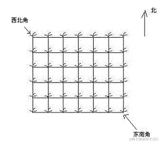

# 基础算法超易懂！——简单DP

# 简单DP

## 🪁简介

> 动态规划：DP：Dynamic Programming是算法的设计方法，是一种编程思想，主要用于解决最优解类型的问题。
>
> 对于一个DP问题，首先将问题分解，任选一个最优解的子状态分析，与原问题（原状态）有什么关系。
>
> 列出状态转移方程，这个尤为重要

## 🪁详讲

从**集合**的角度理解 Dp从两个角度考虑

**状态表示**，考虑清楚用几维表示状态，表示的是哪一个集合，存的数是集合中的哪一个属性 **状态计算**，如何一步步把每一个状态算出来

### 🪁状态表示

每一个状态都表示一个集合

因此要考虑，`f(i,j)` 表示的是哪一个集合，例如背包问题表示的是所有选法的集合

**属性**：`f(i,j)` 表示的是一个集合，实际上存的是一个数，这个数是这个集合的某种属性。因此属性一般有三种：**max，min，元素数量**

**集合**：表示的是所有选法的一个集合(选哪些物品) 还有满足一些条件，在01背包问题中，条件是从前i个物品选，总体积小于等于题目要求

状态表示 举例：在01背包问题中，`f(i,j)` 表示从前i 个物品中选，总体积小于等于`j`选法的集合，存的数是这个集合的每一个选法价值的最大值

### 🪁状态计算

对应的是**集合的划分** 如何把当前的集合划分为若干个更小的能算出来的子集，能用前面更小的状态(集合)表示出来

**划分方式**：是否包含(加入)第`i` 个物品(第`i`个物品对结果是否有影响)

**划分原则**：

- 不重复：某一个元素不可以属于两个集合(不一定满足)
- 不遗漏：某一个元素不属于任何集合(必须满足)

举例：在01背包问题中

不包含`i` 的计算：从 `0 ~ i-1` 中，总体积不超过`j`选法的集合，因此最大值是`f[i-1][j]` 包含`i`的计算：从 `0 ~ i` 中，总体积不超过`j`选法，用状态转移方程转换一下，即是：`f[i-1][j-v[i]]+w[i]` 为最大值

总体的最大值是 `max(f[i-1][j],f[i-1][j-v[i]]+w[i])`

### 🪁优化

DP的优化一般是对动态规划的代码或是方程做一个等价变形

先写出基本的状态，再做优化

### 🪁01背包问题：

> 问题描述：有 `N`件物品和一个容量是 `V`的背包。每件物品只能使用一次。
>
> 第 `i`件物品的体积是 `vi`，价值是 `wi`。
>
> 求解将哪些物品装入背包，可使这些物品的总体积不超过背包容量，且总价值最大。 输出最大价值。

基本写法，二维数组

```ini
ini
复制代码#include <bits/stdc++.h>

using namespace std;

const int N = 1005;
int v[N];    // 体积
int w[N];    // 价值
int f[N][N]; // f[i][j], j体积下前i个物品的最大价值
// i 表示第几个物品  j 表示还有多少体积

int main()
{
    int n, m;
    cin >> n >> m;
    for (int i = 1; i <= n; i++)
        cin >> v[i] >> w[i];
    for (int i = 1; i <= n; i++)
        for (int j = 1; j <= m; j++)
        {
            f[i][j] = f[i - 1][j]; //  当前背包容量装不进第i个物品，则价值等于前i-1个物品
            if (j >= v[i])         // 能装，需进行决策是否选择第i个物品
                f[i][j] = max(f[i - 1][j], f[i - 1][j - v[i]] + w[i]);
        }
    
    cout << f[n][m] << endl;
    
    return 0;
```

优化版，利用 **滚动数组+倒序查找** 为什么一维情况下枚举背包容量需要逆序？ 在二维情况下，状态`f[i][j]`是由上一轮`i - 1`的状态得来的，`f[i][j]`与`f[i - 1][j]`是独立的。而优化到一维后，如果我们还是正序，则有`f[较小体积]`更新到`f[较大体积]`，则有可能本应该用第`i-1`轮的状态却用的是第`i`轮的状态。

简单来说，一维情况正序更新状态`f[j]`需要用到前面计算的状态已经被「污染」，逆序则不会有这样的问题。

```cpp
cpp
复制代码#include <bits/stdc++.h>

using namespace std;

const int N = 1010;

int v[N]; // 体积
int w[N]; // 价值
int f[N];//N 件物品，背包容量j下的最优解

int main()
{
    int n, m;
    cin >> n >> m;
    for (int i = 1; i <= n; i++)
        cin >> v[i] >> w[i];
    for (int i = 1; i <= n; i++)
        for (int j = m; j >= v[i]; j--)//倒序比较
            f[j] = max(f[j], f[j - v[i]] + w[i]);

    cout << f[m] << endl;
    return 0;

}
```

## 🪁一道DP题目

🚀传送点: [1015. 摘花生 ](https://link.juejin.cn?target=https%3A%2F%2Fwww.acwing.com%2Fproblem%2Fcontent%2F1017%2F)

> ### 题目描述
>
> Hello Kitty想摘点花生送给她喜欢的米老鼠。
>
> 她来到一片有网格状道路的矩形花生地(如下图)，从西北角进去，东南角出来。
>
> 地里每个道路的交叉点上都有种着一株花生苗，上面有若干颗花生，经过一株花生苗就能摘走该它上面所有的花生。
>
> Hello Kitty只能向东或向南走，不能向西或向北走。
>
> 问Hello Kitty最多能够摘到多少颗花生。
>
> 
>
> #### 输入格式
>
> 第一行是一个整数T，代表一共有多少组数据。
>
> 接下来是T组数据。
>
> 每组数据的第一行是两个整数，分别代表花生苗的行数R和列数 C。
>
> 每组数据的接下来R行数据，从北向南依次描述每行花生苗的情况。每行数据有C个整数，按从西向东的顺序描述了该行每株花生苗上的花生数目M。
>
> #### 输出格式
>
> 对每组输入数据，输出一行，内容为Hello Kitty能摘到得最多的花生颗数。
>
> #### 数据范围
>
> 1≤T≤100, 1≤R,C≤100, 0≤M≤1000
>
> #### 样例
>
> ##### 输入样例：
>
> ```
> 复制代码2
> 2 2
> 1 1
> 3 4
> 2 3
> 2 3 4
> 1 6 5
> ```
>
> ##### 输出样例：
>
> ```
> 复制代码8
> 16
> ```

------

### 🪁思路

1.状态表示 集合：定义为从`f[i][j]`为(1, 1)到达(i, j)的所有方案

属性：最大值

2.状态计算  (i, j)从(i-1, j)即上方过来； (i, j)从(i, j-1)即左方过来

3.空间压缩 `f[i][j]`只需要用到这一层和上一层的f元素，所以可以压缩成滚动数组。在此之上，还可以直接压缩成一维数组。

### 🪁C++ 代码:

```cpp
cpp
复制代码#include<iostream> 
#include<cstring>
#include<cstdio>
#include<algorithm>
using namespace std;
const int N=110;
int w[N][N];//原数组
int f[N][N];//状态数组
int t;
int main(){
	int r,c;
	scanf("%d",&t);
	while(t--){
	scanf("%d%d",&r,&c);
	for(int i=1;i<=r;i++)
		for(int j=1;j<=c;j++){
			scanf("%d",&w[i][j]);
		}
	memset(f, 0, sizeof f);//在 f 这个数组里面 sizeof f 的长度中填入 0 ， 相当于清空结果数组。不清空也是可以得到答案，
	for(int i=1;i<=r;i++)
		for(int j=1;j<=c;j++){
		f[i][j]=max(f[i-1][j],f[i][j-1])+w[i][j];//状态分割 分为上方过来的和左方过来的 取最大
		}
	printf("%d\n",f[r][c]);//遍历f[1][1]~f[r][c] f[r][c]即为最后数
	}
	
	return 0;
}
```

### 🪁 其他DP题目:

- 🚀[895. 最长上升子序列 ](https://link.juejin.cn?target=https%3A%2F%2Fwww.acwing.com%2Fproblem%2Fcontent%2F897%2F)
- 🚀[1212. 地宫取宝 ](https://link.juejin.cn?target=https%3A%2F%2Fwww.acwing.com%2Fproblem%2Fcontent%2F1214%2F)
- 🚀[1214. 波动数列 ](https://link.juejin.cn?target=https%3A%2F%2Fwww.acwing.com%2Fproblem%2Fcontent%2F1216%2F)

---

[algo](https://github.com/krahets/hello-algo)

[数据结构与算法](数据结构与算法)

[在线课件](https://mooc.study.163.com/learn/1000033001?tid=2403042013#/learn/content)


[刷题](https://www.yuque.com/realsky/anything/hx9n0s)


|        |                                       |              |
| ------ | ------------------------------------- | ------------ |
| 分治法 | 分解成子集,全部完成后合并即是结果的解 | 递归, 尾递归 |
|        |                                       |              |
|        |                                       |              |


# 复杂度总结


| 记号 | 含义       | 通俗理解   |
| ---- | ---------- | ---------- |
| Θ    | 紧确界     | 相当于"="  |
| O    | 上界       | 相当于"<=" |
| ο    | 非紧的上界 | 相当于"<"  |
| Ω    | 下界       | 相当于">=" |
| ω    | 非紧的下界 | 相当于">"  |


# [幂律分布和正态分布](http://www.4k8k.xyz/article/qq_37492806/107362709)

理解了“正态分布”和“幂律分布”，我们就可以很好的理解商业世界，理解各种商业逻辑。哪儿些行业可以出现指数级增长，哪儿些行业永远出现不了指数级增长。

举个例子：比如理发行业，由于一个理发师一次只能服务一个客户，边际交付时间较高，因此很难出现指数级增长，这个市场极度分散，属于正态分布的市场。而互联网行业，比如订票、团购等，理论上可以同时服务无数个客户，边际交付时间几乎为零，因此可以出现指数级增长，甚至第一名、第二名加起来的市场份额会占到整个市场的70%以上。

明白一个非常重要的道理：不是每行每业、每一种商业业态都能实现指数级增长。如果你希望实现指数级增长，最重要的一点是，即使你所在的行业存在边际交付时间，你也要把边际交付时间为零的部分剥离出来，这样才有机会实现指数型增长。


# MECE

https://zhuanlan.zhihu.com/p/144052435


# 算法基础

猜价格/二分查找

|               |                                  |                    |
| ------------- | -------------------------------- | ------------------ |
| 二分法        | 一分为二，特点是取中间值缩小范围 | 二分查找           |
| 递推法\逆推法 |                                  |                    |
| 枚举          |                                  | 填数游戏、填运算符 |
| 递归          |                                  |                    |
| 分治          |                                  |                    |


# 双盲实验

将世界最聪明头脑汇聚在一间屋子的网站 Edge 提过一个有趣问题：有无数能够提高人们心智能力的科学概念，普通人最应掌握的是什么？答案是双盲实验。《自私的基因》作者道金斯如是回答：你只需要理解其原则，领悟到为什么有必要这么做，就能感受其优美。

什么是双盲实验呢？

双盲是科学方法的一种，目的是避免研究结果受安慰剂效应或观察者偏向所影响。在各种科学研究领域中，从医学、食品、心理到社会科学及法证都有使用双盲方法进行实验。

它可以让你在头脑中进行不同方向的思想实验。人类往往习惯朝一个方向进行思考。双盲实验却不断提醒你要朝不同方向思考，注重「样本」、「对照组」与「基础概率」，避免「主观偏见」、「随机效应」、「安慰剂效应」等等。一旦养成「双盲实验」的习惯，你可以轻而易举地在头脑中干掉很多「认知偏差」。

为什么双盲实验重要？

人类的知识都来自于归纳法。而归纳法建立在连续性假设之上，即未来将继续和过去一样。

现象和现象之间本不连续，但人类思维只能建立在连续性上。于是在不连续的现象间，生硬地插入因果律作为桥梁。结果我们获得的不是逻辑学的必然，而是心理学的必然。说白了，这就是一种认知偏差。

罗素有个著名的比喻，农场里有一只火鸡，每次一看到农场主来，就被喂食，这只火鸡就以为农场主和喂食之间有因果联系。但结果有一天，农场主带来的不是食物而是猎枪，农夫把火鸡杀了。

人类认识世界的方式就和这只火鸡一样。

归纳推理大多数时候是有效的，比如听到雄鸡叫，天就亮了；打雷会下雨；下雨天道路是泥泞的。这些都是我们熟悉的常识。而一旦把归纳推理用在人类未知的领域，问题来了。

例如检测某款新药的疗效，让患者吃下该药，观察患者是否痊愈，如果痊愈，则认定该治疗是有效的。——传统临床医学就是这么干的，这能行吗？

要想对两个变量进行因果推断，必须保证一个变量变的时候，其他变量完全不变。

有些疾病无需治疗也能自动痊愈，例如口腔溃疡，感冒等，有些疾病的病人吃安慰剂后，在心理暗示下也能痊愈。以上两类情况下医生进行的药物和治疗都是多此一举的，使用的药物和疗法都是无效的“假治”。

双盲实验就是为了排除变量的不确定性，从而证明两个现象间的强因果关系。

著名中医黑棒棒医生举过一个形象例子来解释双盲实验的作用。

> 买苹果。王婆打开了一箱。“又甜又脆的苹果喽！不甜不脆不要钱”，说的好听！当然了，卖苹果的说的都好听。如果你是个智力正常的消费者，不需要考虑就会挑几个看看。不错，确实没有烂的。但是只看“几个”是不够的，最好把整箱都翻看一遍才放心。只是你没有时间，或者王婆也不让干。那么，你检验的越多，“这一箱苹果都是好的”的可能性就越大。这就是“大样本”的意义。
> 但是，高明的消费者考虑的更多，他要货比三家，没准儿李婆的苹果更甜更脆，“比”比“不比”更可靠。这就是“对照”的意义。
> 比就比，李婆拿出十个苹果，可她眼花；王婆也拿出十个苹果，可她眼毒着呢。这不用比，王婆的苹果好。慢着，消费者可不是被骗大的，两个婆婆都蒙住眼，随便从箱里摸出十个来比比。最后是李婆的苹果好。嘿嘿，这个就是“随机”的意义。
> 经过这样的对比后，作为旁观的第三者，你要是真的以为是李婆的苹果好，你可能也上当了。因为这个消费者可能是李婆的托，也可能对李婆有好感。那么怎么办？将随机选出的二十个苹果让第三者来编号，然后打乱，再让消费者来判断，判断结果由第三者进行统计。现在不但消费者不知道，连王婆李婆自己也不知道哪个苹果是自己的。所以最后得出的结果才是真正客观可靠的。这，就是“双盲”的意义。

双盲实验是证据分级重要的分水岭。

是否理解双盲概念，构成人们认知能力的重要标杆。

双盲实验可以提高5方面认知能力：

1. 你会学会不从零星言论中归纳出普遍结论。
2. 你会学会一个貌似重要的结果，可能只是偶然发生。
3. 你会理解排除主观偏见有多么困难，你会开始尝试放弃崇拜权威和个人观点。（有了立场，就有漏，不究竟。）
4. 你会学会不再接受那些非科学疗法和那些假冒医生的江湖骗子。
5. 你会学会更加广泛的使用批判性思维的习惯。

从概率思考到批判性思考，双盲实验可以帮助我们建立理性思考能力，练习反直觉思考能力，变得聪明。


## 推荐系统-golang微服务

[book](https://github.com/solidglue/Recommender_System?tab=readme-ov-file)
