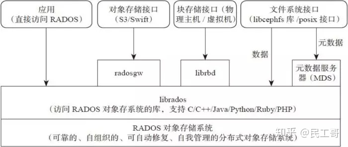

# 生成链接

```sh
day=`date -d 'now + 1 year' +%s`
echo $day
s3cmd -c .s3cfg-netdisk signurl s3://bucketsystemtest/blob_20240131103514339.png $day
```

# help

```shell
ceph orch apply mds koenlifs --placement="3 dp01 dp02 dp03"
radosgw-admin zonegroup create --rgw-zonegroup=default-zonegroup --master --default
ceph orch apply rgw default-realm default-zone --placement="3 dp01 dp02 dp03"
ceph orch apply rgw koenli-rgw default-realm default-zone --placement="3 dp01 dp02 dp03"

ceph orch apply nfs nfs nfs-ganesha nfs-ns --placement="3 dp01 dp02 dp03"

ceph orch apply rgw koenli-rgw default-realm default-zone --placement="3 dp01 dp02 dp03"
```


# nginx

```nginx
# 定义HTTP服务器，将所有请求重定向到HTTPS
server {
    listen 80;
    server_name your.domain.com; # 替换为你的域名

    return 301 https://$host:443$request_uri; # 将HTTP流量重定向到HTTPS
}

# 定义HTTPS服务器并配置SSL证书
server {
    listen 443 ssl;
    server_name your.domain.com; # 同样替换为你的域名

    # SSL证书配置
    ssl_certificate /path/to/your/domainName.pem; # SSL证书文件路径
    ssl_certificate_key /path/to/your/domainName.key; # SSL私钥文件路径

    # SSL会话参数及其他安全相关设置
    ssl_session_cache shared:SSL:1m;
    ssl_session_timeout 5m;
    ssl_protocols TLSv1.2 TLSv1.3; # 使用高版本TLS协议
    ssl_ciphers EECDH+AESGCM:EDH+AESGCM:AES256+EECDH:AES256+EDH; # 强加密套件
    ssl_prefer_server_ciphers on;

    # 设置代理到后端服务器
    location / {
        proxy_pass http://localhost:8080; # 代理到本地8080端口的服务
        proxy_set_header Host $host;
        proxy_set_header X-Real-IP $remote_addr;
        proxy_set_header X-Forwarded-For $proxy_add_x_forwarded_for;
        proxy_set_header X-Forwarded-Proto $scheme;
    }
}
```


# 调研

|                                                              |                                                              |      |
| ------------------------------------------------------------ | ------------------------------------------------------------ | ---- |
| [阿里盘古](https://polarisary.github.io/2018/04/13/pangu/)   |                                                              |      |
| [百度](https://blog.csdn.net/shudaqi2010/article/details/70766179) |                                                              |      |
| [网易云音乐](https://mp.weixin.qq.com/s/FZuWNIVPMX8L-w1PxwPZHA) | [github](https://github.com/opencurve/curve/blob/master/README_cn.md) |      |


# 实践经验

## 内核BUG导致的ceph IO缓慢

尽管上述的监控措施，理论上可以检测到 Ceph中的问题，但并不意味着运维变得简单。Ceph Mgr向外界传递的许多参数都是由系统中各个OSD的指标值生成的。这些值成千上万，即使是很有经验的Ceph开发人员，弄清楚这些值之间的关系也是一件费脑的事情：知道集群中存在缓慢的写入是一件事；但是，更紧要的任务是快速查找出故障根源。这个过程需要大量的实践经验，且相当困难。


以下是一个具有多年资深经验的Ceph运维工程师描述的例子，描述了如何使用监控细节来诊断Ceph中的性能问题的思路。遗憾的是，这个故障诊断过程并不能合理地自动化。

这是一个总容量约为2.5PB的Ceph集群，主要用于OpenStack。当用户启动一个使用Ceph 中的RBD映像作为根文件系统硬盘的虚拟机时，一个烦人的状态时常会发生：虚拟机在几分钟内遭受I/O停顿并且在一段时间内不可用，一段时间后情况恢复正常，但问题周期性地再次出现。在问题没有出现时，对VM卷的写入操作可达到1.5GB/每秒。


在监控系统也显示了前面描述的卡顿或缓慢写入，但无法辨别究竟与哪个OSD相关。相反，它们分布在系统中的所有OSD中。进一步排查发现，问题与OpenStack无关，因为不经过Openstack的本地RBD映像，也会出现类似的性能问题。


首先怀疑的是网络。然而，经过使用Iperf和类似工具进行的大量测试后，推翻了这种怀疑。在Ceph集群的clients之间，双25Gbit/s LACP链路在Iperf测试中可以达到25Gbit/s以上，且是可靠的。当所有涉及到的NIC和网络交换机上的错误计数器都保持在0时，事情开始变得毫无头绪。


从这里开始需要更深入的故障排查技巧，即开启OSDdebug来跟踪数据写入过程。一旦监控到缓慢的写入过程，就重点检查OSD的日志。事实上，每个OSD都保存着它执行的许多操作的内部记录，主OSD日志还包含单独的条目，显示该对象到辅助OSD的复制操作的开始和结束。使用dump_ops_in_flight命令可以显示OSD当前在Ceph中执行的所有操作，也可以使用dump_historic_slow_ops挖掘过去的慢操作。dump_historic_ops也可用于显示有关所有先前操作的日志消息。利用这些工具，更深入的监控成为可能：现在可以为单个慢速写入找到主OSD，然后所涉及的OSD揭示它计算了哪些辅助OSD的信息。例如，它们在同一写入过程的日志中的消息适用于提供有关有缺陷的HDD相关信息。


按照上述的排查发现，Primary OSD花在等Secondary  OSD响应的大部分时间里，请求到达Secondary OSD往往需要几分钟时间；一旦写入请求实际到达Secondray OSD，它们就会在几毫秒内完成。


由于已经排除了网络硬件故障的可能性，故障的源头指向Ceph的问题。经过大量试验和试错后，焦点落在了所涉及系统的数据包过滤器上。最后的结果出入意料，CentOS 8默认使用的Nftables（iptables 后继者）被证实是问题的根源。这不是配置错误：而是Linux内核中的一个Bug，导致数据包过滤器在某些情况下会因为不明确的模式阻止了数据的正常通信，几分钟中又能恢复通信。这解释了为什么Ceph中的问题出现的非常不稳定。更新到较新的内核最后解决了这个问题。


这个例子清楚地表明：Ceph中的自动化性能监控虽然很强大。但由于Ceph本身的复杂性，管理员通常会面临漫长的故障定位与排查过程。同时，这个例子也证实，使用专用存储厂商的Ceph发行版本非常重要，可以有效地排除各种软硬件与操作系统内核之前的兼容性问题。目前，市场上主流的Ceph厂家除了传统IT大厂如华为、浪潮、新华三，还有新兴的分布式存储专业厂家如道熵、Xsky、杉岩等。

# 概念

|                 |                                                              |      |
| --------------- | ------------------------------------------------------------ | ---- |
| *RGW*           | Ceph对象网关，提供了一个兼容S3和Swift的restful API接口。RGW还支持多租户和Openstack的keystone身份验证服务。 |      |
| **RADOS**       | *Reliable Autonomic Distributed Object Store, RADOS*是Ceph 存储集群的基础。Ceph 中的一切都以对象的形式存储，而RADOS 就负责存储这些对象，而不考虑它们的数据类型。RADOS 层确保数据一致性和可靠性。对于数据一致性，它执行数据复制、故障检测和恢复。还包括数据在集群节点间的recovery。 |      |
| **Librados**    | 基于rados对象在功能层和开发层进行的抽象和封装,提供给开发者   |      |
| **RadosGW API** | 通用、固定、易用的少数使用维度的接口, 提供给使用者           |      |
|                 |                                                              |      |



# No matching hosts for label _admin

`unable to calc client keyring client.admin placement PlacementSpec(label='_admin'): Cannot place : No matching hosts for label _admin`

```sh
ceph orch host label add dp01 _admin
```


# centos7/8安装

https://www.koenli.com/ef5921b8.html

```
rpm --import https://www.elrepo.org/RPM-GPG-KEY-elrepo.org

```

To install ELRepo for RHEL-**9**:


```
yum install https://www.elrepo.org/elrepo-release-9.el9.elrepo.noarch.rpm
```

To install ELRepo for RHEL-**8**:


```
yum install https://www.elrepo.org/elrepo-release-8.el8.elrepo.noarch.rpm
```

To install ELRepo for RHEL-**7**, SL-**7** or CentOS-**7**:


```
yum install https://www.elrepo.org/elrepo-release-7.el7.elrepo.noarch.rpm
```

To make use of our mirror system, **please also install yum-plugin-fastestmirror**.

# install

```
cephadm bootstrap --mon-ip x.x.x.x
cephadm --image quay.io/ceph/ceph:v17.2.6 bootstrap --mon-ip x.x.x.x
```

# add device

```
ceph orch daemon add osd dp01:/dev/sdc
```


# rgw

```
radosgw-admin realm create --rgw-realm=default-realm --default
radosgw-admin zonegroup create --rgw-zonegroup=default-zonegroup --master --default
radosgw-admin zone create --rgw-zonegroup=default-zonegroup --rgw-zone=default-zone --master --default
radosgw-admin period update --rgw-realm=default-realm --commit
ceph orch apply rgw koenli-rgw default-realm  --placement="3 dp01 dp02 dp03"
```

https://blog.csdn.net/wxb880114/article/details/130259386

# swift

https://zhuanlan.zhihu.com/p/597907220

# LVM

```sh
查看osd fsid
ceph-volume lvm list
```


## 移除方式

当部署异常的时候，可以使用下面的命令删除掉集群信息重新部署

```shell
ceph orch pause
ceph fsid
cephadm rm-cluster --force --zap-osds --fsid <fsid>
```

# 调整mon数量默认值

```sh
ceph orch apply mon 3
```

#  运维手册

Ceph Dashboard 使用Prometheus、Grafana和相关工具来存储和可视化有关集群利用率和性能的详细指标。Ceph 用户有三种选择：

1. 让 cephadm 部署和配置这些服务。这是引导新集群时的默认设置，除非使用该 --skip-monitoring-stack 选项。
2. 手动部署和配置这些服务。对于在其环境中拥有现有 prometheus 服务的用户（以及 Ceph 使用 Rook 在 Kubernetes 中运行的情况），建议使用此方法。
3. 完全跳过监控堆栈。某些 Ceph 仪表板图表将不可用。

**监控栈由Prometheus、Prometheus 导出器（Prometheus Module、Node exporter）、Prometheus Alert Manager和Grafana 组成。**

> 笔记: Prometheus 的安全模型假定不受信任的用户可以访问 Prometheus HTTP 端点和日志。不受信任的用户可以访问 Prometheus 收集的包含在数据库中的所有（元）数据，以及各种操作和调试信息。但是，Prometheus 的 HTTP API 仅限于只读操作。无法使用 API 更改配置，并且不会公开机密。此外，Prometheus 有一些内置措施来减轻拒绝服务攻击的影响。请参阅Prometheus 的安全模型 https://prometheus.io/docs/operating/security/了解更多详细信息。

## 使用 CEPHADM 部署监控

**cephadm的默认行为是部署一个基本的监控堆栈。**但是，您可能有一个没有监控堆栈的 Ceph 集群，并且您想向其中添加一个监控堆栈。（这里有一些方法可以让您拥有一个没有监控堆栈的 Ceph 集群：您可能在安装集群期间将--skip-monitoring stack选项传递给了cephadm，或者您可能已经将现有集群（没有监控堆栈）转换为cephadm管理。）

要在没有监控的 Ceph 集群上设置监控，请按照以下步骤操作：

1.在集群的每个节点上部署节点导出器服务。node-exporter 提供主机级别的指标，例如 CPU 和内存利用率：

```mipsasm
ceph orch apply node-exporter
```

部署警报管理器：

```mipsasm
ceph orch apply alertmanager
```

部署普罗米修斯。一个 Prometheus 实例就足够了，但为了实现高可用性 (HA)，您可能需要部署两个：

```mipsasm
ceph orch apply prometheus
```

要么:

```bash
ceph orch apply prometheus --placement 'count:2'
```

部署 grafana：

```mipsasm
ceph orch apply grafana
```

## 网络和端口

所有监控服务都可以使用 yaml 服务规范配置它们绑定的网络和端口

示例规范文件：

```yaml
service_type: grafana
service_name: grafana
placement:
  count: 1
networks:
- 192.169.142.0/24
spec:
  port: 4200
```

## 使用自定义镜像

可以基于其他镜像安装或升级监控组件。为此，需要首先将要使用的镜像的名称存储在配置中。以下配置选项可用。

- container_image_prometheus
- container_image_grafana
- container_image_alertmanager
- container_image_node_exporter

可以使用命令ceph config设置自定义镜像：

```bash
ceph config set mgr mgr/cephadm/<option_name> <value>
```

例如:

```bash
ceph config set mgr mgr/cephadm/container_image_prometheus prom/prometheus:v1.4.1
```

如果已经有正在运行的监视堆栈守护程序的类型与您已更改其镜像的类型相同，则必须重新部署守护程序才能让它们实际使用新镜像。

例如，如果您更改了 prometheus 镜像

```mipsasm
ceph orch redeploy prometheus
笔记: 通过设置自定义镜像，默认值将被覆盖（但不会被覆盖）。当更新可用时，默认值会更改。通过设置自定义镜像，您将无法自动更新已设置自定义镜像的组件。您将需要手动更新配置（镜像名称和标签）才能安装更新。

如果您选择使用建议，则可以重置之前设置的自定义镜像。之后，将再次使用默认值。ceph config rm用于重置配置选项:

ceph config rm mgr mgr/cephadm/<option_name>

例如:

ceph config rm mgr mgr/cephadm/container_image_prometheus
```

## 使用自定义配置文件

通过覆盖 cephadm 模板，可以完全自定义监控服务的配置文件。

在内部，cephadm 已经使用Jinja2模板为所有监控组件生成配置文件。为了能够自定义 Prometheus、Grafana 或 Alertmanager 的配置，可以为每个将用于配置生成的服务存储一个 Jinja2 模板。每次部署或重新配置此类服务时，都会评估此模板。这样，自定义配置将被保留并自动应用于这些服务的未来部署。

> 笔记: 当 cephadm 的默认配置更改时，自定义模板的配置也会保留。如果要使用更新后的配置，则需要在每次升级 Ceph 后手动迁移自定义模板。

### 选项名称

可以覆盖将由 cephadm 生成的文件的以下模板。这些是与 ceph config-key set 一起存储时要使用的名称：

- services/alertmanager/alertmanager.yml
- services/grafana/ceph-dashboard.yml
- services/grafana/grafana.ini
- services/prometheus/prometheus.yml

您可以在以下位置src/pybind/mgr/cephadm/templates查找 cephadm 当前使用的文件模板：

- services/alertmanager/alertmanager.yml.j2
- services/grafana/ceph-dashboard.yml.j2
- services/grafana/grafana.ini.j2
- services/prometheus/prometheus.yml.j2

### 用法

以下命令应用单行值：

```bash
ceph config-key set mgr/cephadm/<option_name> <value>
```

要将文件的内容设置为模板，请使用以下-i参数：

```bash
ceph config-key set mgr/cephadm/<option_name> -i $PWD/<filename>
```

> 笔记: 当使用文件作为输入时，config-key必须使用文件的绝对路径。

然后需要重新创建服务的配置文件。这是使用reconfig完成的。有关更多详细信息，请参见以下示例。

### 示例

```bash
# set the contents of ./prometheus.yml.j2 as template
ceph config-key set mgr/cephadm/services/prometheus/prometheus.yml \
  -i $PWD/prometheus.yml.j2

# reconfig the prometheus service
ceph orch reconfig prometheus
```

## 在没有 CEPHADM 的情况下部署监控

如果您有现有的 prometheus 监控基础架构，或者想自己管理它，则需要对其进行配置以与您的 Ceph 集群集成。

- 在 ceph-mgr 守护进程中启用 prometheus 模块

```bash
ceph mgr module enable prometheus
```

默认情况下，ceph-mgr 在每个运行 ceph-mgr 守护进程的主机上的 9283 端口上显示 prometheus 指标。配置 prometheus 来抓取这些。

- 要启用仪表板的基于 prometheus 的警报，请参阅启用 Prometheus 警报。
- 要启用仪表板与 Grafana 的集成，请参阅启用 Grafana 仪表板的嵌入。

## 禁用监控

要禁用监控并删除支持它的软件，请运行以下命令：

```shell
$ ceph orch rm grafana
$ ceph orch rm prometheus --force   # this will delete metrics data collected so far
$ ceph orch rm node-exporter
$ ceph orch rm alertmanager
$ ceph mgr module disable prometheus
```

另请参阅删除服务。

## 设置 RBD-IMAGE 监控

**由于性能原因，默认情况下禁用 RBD 镜像监控。**有关详细信息，请参阅 Ceph 健康检查。如果禁用，Grafana 中的概述和详细信息仪表板将保持空白，Prometheus 中将看不到指标。

## 设置 GRAFANA

### 手动设置 GRAFANA URL

Cephadm 在所有情况下都会自动配置 Prometheus、Grafana 和 Alertmanager，除了一种。

在某些设置中，Dashboard 用户的浏览器可能无法访问 Ceph Dashboard 中配置的 Grafana URL。当集群和访问用户位于不同的 DNS 区域时，可能会发生这种情况。

如果是这种情况，您可以使用 Ceph Dashboard 的配置选项来设置用户浏览器用于访问 Grafana 的 URL。cephadm 永远不会更改此值。要设置此配置选项，请发出以下命令：

```cpp
ceph dashboard set-grafana-frontend-api-url <grafana-server-api>
```

部署服务可能需要一两分钟。部署服务后，您应该在发出ceph orch ls命令时看到如下内容：

```bash
$ ceph orch ls
NAME           RUNNING  REFRESHED  IMAGE NAME                                      IMAGE ID        SPEC
alertmanager       1/1  6s ago     docker.io/prom/alertmanager:latest              0881eb8f169f  present
crash              2/2  6s ago     docker.io/ceph/daemon-base:latest-master-devel  mix           present
grafana            1/1  0s ago     docker.io/pcuzner/ceph-grafana-el8:latest       f77afcf0bcf6   absent
node-exporter      2/2  6s ago     docker.io/prom/node-exporter:latest             e5a616e4b9cf  present
prometheus         1/1  6s ago     docker.io/prom/prometheus:latest                e935122ab143  present
```

## 为 GRAFANA 配置 SSL/TLS

cephadm使用 ceph 键/值存储中定义的证书部署 Grafana。如果未指定证书，则在cephadm部署 Grafana 服务期间生成自签名证书。

可以使用以下命令配置自定义证书：

```bash
ceph config-key set mgr/cephadm/grafana_key -i $PWD/key.pem
ceph config-key set mgr/cephadm/grafana_crt -i $PWD/certificate.pem
```

如果您已经部署了 Grafana，请在服务上运行reconfig以更新其配置：

```mipsasm
ceph orch reconfig grafana
```

该reconfig命令还为 Ceph Dashboard 设置正确的 URL。

## 设置初始管理员密码

**默认情况下，Grafana 不会创建初始管理员用户。**为了创建管理员用户，请创建一个包含以下内容的grafana.yaml文件：

```yaml
service_type: grafana
spec:
  initial_admin_password: mypassword
```

然后应用此规范：

```mipsasm
ceph orch apply -i grafana.yaml
ceph orch redeploy grafana
```

Grafana 现在将创建一个使用给定密码调用的管理员用户admin。

## 设置警报管理器

### 添加 ALERTMANAGER WEBHOOK

要将新的 webhook 添加到 Alertmanager 配置中，请添加额外的 webhook url，如下所示：

```makefile
service_type: alertmanager
spec:
  user_data:
    default_webhook_urls:
    - "https://foo"
    - "https://bar"
```

default_webhook_urls的附加 URL 列表将添加到默认接收器的<webhook_configs>配置。

在服务上运行reconfig以更新其配置：

```mipsasm
ceph orch reconfig alertmanager
```

# already in use

```sh
ceph orch rm [service]
ceph orch apply [service]
```

s3操作

```sh
# 1、删除S3用户
radosgw-admin  user rm --uid=rgwuser

# 2、权限调整,允许rgwuser读写users信息：
radosgw-admin caps add --uid=rgwuser --caps="users=*"

# 3、允许admin读写所有的usage信息
radosgw-admin caps add --uid=rgwuser --caps="usage=read,write"

# 4、删除swift子用户
radosgw-admin subuser rm  --subuser=rgwuser:swift

# 5、列出当前系统下所有的bucket信息
radosgw-admin bucket list

# 6、查看具体某个BUCKET属性
radosgw-admin bucket stats --bucket=my-first-s3-bucket
```


# 版本

选择 16.2.6

# ceph Numerical result out of range (this can be due to a pool or placement group misconfiguration

```sh
ceph config set global mon_max_pg_per_osd 1200
```


# upgrade

https://www.cnblogs.com/varden/p/15966141.html

https://www.cnblogs.com/varden/p/15965326.html

```
docker pull quay.io/ceph/ceph:v16.2.6
ceph orch upgrade start --ceph-version 16.2.6
ceph orch upgrade start --ceph-version 17.2.6 
```


# chronyd

`ERROR: No time synchronization is active`

```shell
systemctl enable chroynd
systemctl start chroynd
```

# Ceph pg_num

> `placement groups，它是ceph的逻辑存储单元`数据存储到cesh时，先打散成一系列对象，再结合基于对象名的哈希操作、复制级别、PG数量，产生目标PG号。根据复制级别的不同，每个PG在不同的OSD上进行复制和分发。可以把PG想象成存储了多个对象的逻辑容器，这个容器映射到多个具体的OSD。PG存在的意义是提高ceph存储系统的性能和扩展性。
>
> 


```sh
rpm --import https://www.elrepo.org/RPM-GPG-KEY-elrepo.org
yum install https://www.elrepo.org/elrepo-release-7.el7.elrepo.noarch.rpm
yum install https://www.elrepo.org/elrepo-release-8.el8.elrepo.noarch.rpm
```

# crash

```
ceph crash ls
ceph crash info <id>
ceph crash rm <id>
```


# create user error

```
ceph osd pool get default-zone.rgw.control pg_num 
ceph osd pool set default-zone.rgw.control pg_num 16
ceph osd pool set default-zone.rgw.control pgp_num 16
ceph osd pool get cephfs_data pgp_num 
ceph osd pool set cephfs_data pgp_num 16
ceph osd pool set cephfs_data pg_num 16
ceph osd pool set cephfs_metadata pg_num 16
ceph osd pool set cephfs_metadata pgp_num 16
```

# RGW REST API failed request with status code 403 

15.2升级到16.2.6解决

# eph版本发行生命周期

2022年5月8日

[暂无评论](https://blog.whsir.com/post-6687.html#respond)

ceph从Nautilus版本（14.2.0）开始，每年都会有一个新的稳定版发行，预计是每年的3月份发布，每年的新版本都会起一个新的名称（例如，“Mimic”）和一个主版本号（例如，13 代表 Mimic，因为“M”是字母表的第 13 个字母）。


版本号的格式为x.y.z，x表示发布周期（例如，13 代表 Mimic，17代表Quincy），y表示发布版本类型，即

x.0.z - y等于0，表示开发版本
x.1.z - y等于1，表示发布候选版本（用于测试集群）
x.2.z - y等于2，表示稳定/错误修复版本（针对用户）

稳定版本的生命周期在第一个发布月份后，大约2年时间将停止该版本的更新维护，具体版本发布时间见下表。

在Octopus版本后使用cephadm来部署ceph集群，如果使用cephadm部署，在后期新的版本升级时，可以做到完全自动化，并可以通过ceph -W cephadm查看升级进度，升级完成后，无法降级，升级时请不要跨版本升级，例如：当前使用Octopus升级到Quincy，要先把Octopus升级到Pacific，然后在升级至Quincy，这是最稳妥的方式。

| 版本       | 主版本号 | 初始发行时间 | 停止维护时间 |
| :--------- | :------- | :----------- | :----------- |
| Quincy     | 17       | 2022-04-19   | 2024-06-01   |
| Pacific    | 16       | 2021-03-31   | 2023-06-01   |
| Octopus    | 15       | 2020-03-23   | 2022-06-01   |
| Nautilus   | 14       | 2019-03-19   | 2021-06-30   |
| Mimic      | 13       | 2018-06-01   | 2020-07-22   |
| Luminous   | 12       | 2017-08-01   | 2020-03-01   |
| Kraken     | 11       | 2017-01-01   | 2017-08-01   |
| Jewel      | 10       | 2016-04-01   | 2018-07-01   |
| Infernalis | 9        | 2015-11-01   | 2016-04-01   |
| Hammer     | 8        | 2015-04-01   | 2017-08-01   |
| Giant      | 7        | 2014-10-01   | 2015-04-01   |
| Firefly    | 6        | 2014-05-01   | 2016-04-01   |
| Emperor    | 5        | 2013-11-01   | 2014-05-01   |
| Dumpling   | 4        | 2013-08-01   | 2015-05-01   |

[主要参考](https://www.koenli.com/ef5921b8.html)