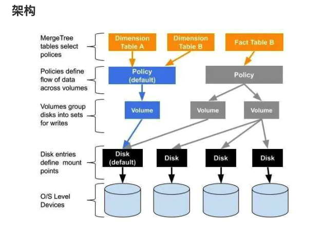

# text search function

https://clickhouse.com/docs/en/sql-reference/functions/string-search-functions

# 全文索引

https://clickhouse.com/docs/en/engines/table-engines/mergetree-family/invertedindexes


# 冷热分层实现

https://www.cnblogs.com/cloudstorageangel/p/14269340.html

# 支撑700亿数据量的ClickHouse高可用架构实践

https://mp.weixin.qq.com/s?__biz=MzkwOTIxNDQ3OA==&mid=2247534096&idx=1&sn=4c33b99f37124ec29f9567755af66200&source=41#wechat_redirect


# 多磁盘存储



https://www.jianshu.com/p/72b0c9bd3967 

```sql
select name,path,formatReadableSize(free_space) AS free,formatReadableSize(total_space) AS total,formatReadableSize(keep_free_space) AS reserved from system.disks;
```


```sql
SELECT policy_name, volume_name, disks FROM system.storage_policies
```

https://clickhouse.tech/docs/en/engines/table-engines/mergetree-family/mergetree/#table_engine-mergetree-multiple-volumes_configure


# 概述

# 20万亿\1秒\Yandex\SIMD


```yml
多层存储:
  c: 多数据盘,区分存储类型
  a: [根据类型将热数据和冷数据分开, 多盘提升IOPS]
冷热\数据移动\move factor:
  c: 设置阈值移动热数据到冷存储，配置文件里的卷顺序很重要，数据会优先写入第一个卷
  a:
    - 在线转离线
冷热\数据移动\TTL:
  c: TTL表达式，遵循时间规则在指定磁盘或卷之间移动数据，实现分层存储
  a:  
    - 不同存储间
    - 在线转离线数据
    - 降低存储成本
下钻:
 c: 从高层次到低层次的明细数据
 a: 比如从省下钻到市
上卷:
 c: 从低层次向高层次汇聚 
 a: 例如从市汇聚到省
切片:
 c: 观察数据立方体的一层
 a: 将一个设为固定，观察表现的数据
切块:
 c: 与切片类似,区别在于多层固定
 a: 将单个固定值变成多个值固定，观察数据表现
旋转: 
 c: 旋转立方体的一个面
 a: 等同于行列转换(置换)
OLAP:
 c: 多维分析
 a: ClickHouse

 
 
```

  - gio解决方案: 工具在本地导入临时表转成正式表

- UAT环境=> 单节点？
- 生产环境=> 分布式?


多磁盘存储


历史分区的清理


```


# 6亿数据秒级查询，ClickHouse太快了！

https://blog.csdn.net/g6U8W7p06dCO99fQ3/article/details/115274415


# 监控

通过clickhouse sql监控

-  https://grafana.com/grafana/dashboards/2515

prometheus  exporter 监控

- https://grafana.com/grafana/dashboards/882

- https://grafana.com/grafana/dashboards/14192


# HDFS engine

https://blog.csdn.net/u012551524/article/details/109188434

参考: https://github.com/ClickHouse/ClickHouse/issues/8159


```

```sh
clickhouse hdfs engine('URI')  
中的URI不识别大小写
我们的growingFS被转成 growingfs, 经测试将hdfs-client.xml中的growingFS批量替换成小写growingfs 有效可用
```


Hive到Clickhosue的数据

- 同步
- 迁移


缓存保护Clickhouse查询

- 主动缓存
- 被动缓存


是否使用分布式:

- zookeeper瓶颈大量日志问题

- 集群同步压力
- 分布式查询压力


Clickhosue缩容扩容问题

- 数据自动平衡问题

  - https://tech.youzan.com/clickhouse-zai-you-zan-de-shi-jian-zhi-lu/

  - ```
    七、ClickHouse 在有赞的未来和展望
    7.1 ClickHouse 的痛点
    扩容/缩容后数据无法自动平衡，只能通过低效的数据重新导入的方式来进行人工平衡。
    尽管我们开发了一套工具基于 clickhouse-copier 来帮助运维进行这个操作，从而加速整个过程，降低人工操作的错误率。但是被迁移的表在迁移过程中仍然需要停止写入的。
    ```

# mergeTree

[mergeTree](https://mp.weixin.qq.com/s?__biz=MzA4MDIwNTY4MQ==&mid=2247483766&idx=1&sn=1fe4ae88fe2c66a68e24938dbe563132&chksm=9fa68368a8d10a7e5789ac3aba4ec59392857a8a4884a726b637b29a738fe10df28b16157625&scene=21#wechat_redirect)

# 实践、场景

ClickHouse在Bilibili用户行为分析的实践
https://mp.weixin.qq.com/s/zQzZfZaTkr1ILBJjEqrgfw


# 《原理解析与实践》

http://reader.obook.vip/books/mobile/ec/ecf2de9deb2c5374ceeec8b12d5c1d8c/text00045.html

```

```


## ClickHouse之DBA运维宝典

https://mp.weixin.qq.com/s/ENdKSSmnIzVP2Ve7wb6wlQ


# [数据迁移](https://liyangliang.me/posts/2020/08/clickhouse-migration/)

## 记一次 ClickHouse 数据迁移

## 背景

大约在 2018 年 8 月份开始正式接触 ClickHouse，当时机房没有合适的服务器，就在 Azure 开了一台虚拟机来部署。平稳运行了两年，支撑了 YiDrone 和 YiSonar 两个重要的产品的底层数据存储和查询。前段时间采购服务器的时候预留了一些资源，加上 Azure 的免费订阅即将到期，于是准备把 ClickHouse 迁回到机房。数据量不大，只有一个节点，硬盘上的数据加起来 500G 左右。

## 方案调研

迁移集群实际上就是要把所有数据库（system 除外）的表结构和数据完整的复制一遍。ClickHouse 官方和社区有一些现成的解决方案，也可以自己实现。

### 拷贝数据目录

先观察一下 ClickHouse 在文件系统上的目录结构（配置文件 `/ect/clickhouse-server/config.xml` 里面配置的 `<path>`），为了便于查看，只保留了 `data` 和 `metadata` 目录。

```text
.
├── data
│   ├── default
│   ├── system
│   │   ├── asynchronous_metric_log
│   │   ├── metric_log
│   │   ├── query_log
│   │   ├── query_thread_log
│   │   └── trace_log
├── metadata
│   ├── default
│   │   └── v_table_size.sql
│   ├── default.sql
│   ├── system
│   │   ├── asynchronous_metric_log.sql
│   │   ├── metric_log.sql
│   │   ├── query_log.sql
│   │   ├── query_thread_log.sql
│   │   └── trace_log.sql
```

* `data` 目录里保存的是数据，每个数据库一个目录，内部每个表一个子目录。

* ```
  metadata
  ```

   

  目录里保存的是元数据，即数据库和表结构。其中

  * `<database>.sql` 是 创建数据库的 DDL（`ATTACH DATABASE default ENGINE = Ordinary`）
  * `<database>/<table>.sql` 是建表的 DDL (`ATTACH TABLE ...`).

> 这里的 DDL 使用的是 `ATTACH` 语句，[进入文档](https://clickhouse.tech/docs/en/sql-reference/statements/attach/) 查看 ATTACH 的作用及跟 CREATE 的区别

基于这个信息，直接把 `data` 和 `metadata` 目录（要排除 system）复制到新集群，即可实现数据迁移。用一个小表做测试，验证可行。

操作流程

1. 在源集群的硬盘上打包好对应数据库或表的 data 和 metadata 数据
2. 拷贝到目标集群对应的目录
3. 重启 clickhouse-server

### 使用 `remote` 表函数

ClickHouse 除了查询常规的表，还能使用表函数来构建一些特殊的「表」，其中 [remote 函数](https://clickhouse.tech/docs/en/sql-reference/table-functions/remote/) 可用于查询另一个 ClickHouse 的表。

使用方式很简单:

```sql
SELECT * FROM remote('addresses_expr', db, table, 'user', 'password') LIMIT 10;
```

因此，可以借助这个功能实现数据迁移：

```sql
INSERT INTO <local_database>.<local_table>
SELECT * FROM remote('remote_clickhouse_addr', <remote_database>, <remote_table>, '<remote_user>', '<remote_password>')
```

操作流程

1. 在源集群的 `system.tables` 表查询出数据库、表、DDL、分区、表引擎等信息
2. 在目标集群上，运行 DDL 创建表，然后运行上述迁移语句复制数据
3. 遍历所有表，执行 2

### 使用 clickhouse-copier

[Clickhouse-copier](https://clickhouse.tech/docs/en/operations/utilities/clickhouse-copier/) 是 ClickHouse 官方提供的一款数据迁移工具，可用于把表从一个集群迁移到另一个（也可以是同一个）集群。Clickhouse-copier 使用 Zookeeper 来管理同步任务，可以同时运行多个 clickhouse-copier 实例。

使用方式:

```bash
clickhouse-copier --daemon --config zookeeper.xml --task-path /task/path --base-dir /path/to/dir
```

其中 `--config zookeeper.xml` 是 Zookeeper 的连接信息，`--task-path /task/path` 是 Zookeeper 里任务配置的节点路径。在使用时，需要先定义一个 XML 格式的任务配置文件，上传到 `/task/path/description` 里。同步任务是表级别的，可以配置的内容还比较多。Clickhouse-copier 可以监听 `/task/path/description` 的变化，动态加载新的配置而不需要重启。

操作流程

1. 创建 `zookeeper.xml`
2. 创建任务配置文件，格式见官方文档，每个表都要配置（可使用代码自动生成）
3. 把配置文件内容上传到 Zookeeper
4. 启动 clickhouse-copier 进程

理论上 clickhouse-copier 运行在源集群或目标集群的环境都可以，官方文档推进在源集群，这样可以节省带宽。

### 使用 clickhouse-backup

[clickhouse-backup](https://github.com/AlexAkulov/clickhouse-backup) 是社区开源的一个 ClickHouse 备份工具，可用于实现数据迁移。其原理是先创建一个备份，然后从备份导入数据，类似 MySQL 的 mysqldump + SOURCE。这个工具可以作为常规的异地冷备方案，不过有个局限是只支持 MergeTree 系列的表。

操作流程

1. 在源集群使用 `clickhouse-backup create` 创建备份
2. 把备份文件压缩拷贝到目标集群
3. 在目标集群使用 `clickhouse-backup restore` 恢复

### 对比

|            | 拷贝数据目录                                                 | 使用 `remote` 表函数               | 使用 clickhouse-copier                                       | 使用 clickhouse-backup         |
| ---------- | ------------------------------------------------------------ | ---------------------------------- | ------------------------------------------------------------ | ------------------------------ |
| 操作复杂度 | 较麻烦，需要在两台服务器上操作文件系统并拷贝文件，不方便自动化 | 一般，需要写程序自动化             | 看起来比使用 `remote` 更复杂一些，主要是生成配置文件比较麻烦 | 类似拷贝数据目录，会更简单一些 |
| 全量同步   | 支持                                                         | 支持                               | 支持                                                         | 支持                           |
| 增量同步   | 不支持                                                       | 支持                               | 应该支持                                                     | 不支持                         |
| 迁移视图   | 不支持                                                       | 支持                               | 不确定，理论上应该支持                                       | 不支持                         |
| 性能       | 较好                                                         | 较好                               | 不确定，应该比 `remote` 快                                   | 不确定                         |
| 局限性     | 不支持集群，很多人工操作                                     | 不适合大表？应该需要相同的拓扑结构 | 不确定，可能没有                                             | 只支持 MergeTree 系列          |

从官方和社区的一些资料综合来看 clickhouse-copier 功能最强大，不过考虑到数据量较少，而且对 clickhouse-copier 有些地方也不是很清楚，最终决定使用 `remote` 函数来做数据迁移。

关于别的数据迁移方案、更多的 clickhouse-copier 使用案例，可参考 Altinity 的博客 [Clickhouse-copier in practice](https://altinity.com/blog/2018/8/22/clickhouse-copier-in-practice).

## 使用 `remote` 函数做数据迁移

使用 `remote` 函数还能实现更多特性：

* 对于分区表，可逐个分区进行同步，这样实际上同步的最小单位是分区，可以实现增量同步
* 可方便集成数据完整性（行数对比）检查，自动重新同步更新过的表

### 代码

代码如下，需要先安装 [clickhouse-driver](https://github.com/mymarilyn/clickhouse-driver)

```python
import collections
import datetime
import functools
import logging
import time

from clickhouse_driver import Client

source_conn = Client(host='source-host', user='user', password='password')
target_conn = Client(host='target-host', user='user', password='password')


def format_partition_expr(p):
    if isinstance(p, int):
        return p
    return f"'{p}'"


def execute_queries(conn, queries):
    if isinstance(queries, str):
        queries = queries.split(';')
    for q in queries:
        conn.execute(q.strip())


class Table(object):
    def __init__(self, database, name, ddl, partition_key, is_view):
        self.database = database
        self.name = name
        self.ddl = ddl.replace('CREATE TABLE', 'CREATE TABLE IF NOT EXISTS')
        self.partition_key = partition_key
        self.is_view = is_view

    def exists(self, conn):
        q = f"SELECT name FROM system.tables WHERE database = '{self.database}' AND name = '{self.name}'"
        return len(conn.execute(q)) > 0

    def get_partitions(self, conn):
        partitions = []
        q = f'SELECT {self.partition_key}, count() FROM {self.identity} GROUP BY {self.partition_key} ORDER BY {self.partition_key}'
        partitions = collections.OrderedDict(conn.execute(q))
        return partitions

    def get_total_count(self, conn):
        q = f'SELECT COUNT() FROM {self.identity}'
        return conn.execute(q)[0][0]

    def check_consistency(self):
        if not self.exists(target_conn):
            return False, None

        source_ttl_count = self.get_total_count(source_conn)
        target_ttl_count = self.get_total_count(target_conn)
        if source_ttl_count == target_ttl_count:
            return True, None

        if not self.partition_key:
            return False, None

        source_partitions = self.get_partitions(source_conn)
        target_partitions = self.get_partitions(target_conn)
        bug_partitions = []
        for p, c in source_partitions.items():
            if p not in target_partitions or c != target_partitions[p]:
                bug_partitions.append(p)
        return False, bug_partitions

    def create(self, replace=False):
        target_conn.execute(f'CREATE DATABASE IF NOT EXISTS {self.database}')
        if self.is_view:
            replace = True
        if replace:
            target_conn.execute(f'DROP TABLE IF EXISTS {self.identity}')
        target_conn.execute(self.ddl)

    def copy_data_from_remote(self, by_partition=True):
        self.create()
        if self.is_view:
            logging.info('ignore view %s', self.identity)
            return

        is_identical, bug_partitions = self.check_consistency()
        if is_identical:
            logging.info('table %s has the same number of rows, skip', self.identity)
            return

        if self.partition_key and by_partition:
            for p in bug_partitions:
                logging.info('copy partition %s=%s', self.partition_key, p)
                self._copy_partition_from_remote(p)
        else:
            self._copy_table_from_remote()

    def _copy_table_from_remote(self):
        queries = f'''
        DROP TABLE {self.identity};
        {self.ddl};
        INSERT INTO {self.identity}
        SELECT * FROM remote('{source_conn.host}', {self.identity}, '{source_conn.user}', '{source_conn.password}')
        '''
        execute_queries(target_conn, queries)

    def _copy_partition_from_remote(self, partition):
        partition = format_partition_expr(partition)
        queries = f'''
        ALTER TABLE {self.identity} DROP PARTITION {partition};
        INSERT INTO {self.identity}
        SELECT * FROM remote('{source_conn.host}', {self.identity}, '{source_conn.user}', '{source_conn.password}')
        WHERE {self.partition_key} = {partition}
        '''
        execute_queries(target_conn, queries)

    def copy_to_another_table(self, database, name=None):
        if not name:
            name = self.name
        assert not (self.database == database and self.name == name)
        if self.partition_key:
            partitions = self.get_partitions(target_conn)
            queries = [f'CREATE TABLE IF NOT EXISTS {database}.{name} AS {self.identity}']
            for p in partitions.keys():
                expr = format_partition_expr(p)
                queries.append(f'ALTER TABLE {database}.{name} DROP PARTITION {expr}')
                queries.append(f'ALTER TABLE {database}.{name} ATTACH PARTITION {expr} FROM {self.identity}')
            execute_queries(target_conn, queries)
        else:
            queries = f'''
            DROP TABLE IF EXISTS {database}.{name};
            CREATE TABLE {database}.{name} AS {self.identity};
            INSERT INTO {database}.{name} SELECT * FROM {self.identity};
            '''
            execute_queries(target_conn, queries)

    @property
    def identity(self):
        return f'{self.database}.{self.name}'

    def __str__(self):
        return self.identity

    __repr__ = __str__


def get_all_tables() -> [Table]:
    # 查询出所有用户的数据库和表，包括视图。视图依赖其他表，所以放到最后。
    q = '''
    SELECT database, name, create_table_query, partition_key, engine = 'View' AS is_view
    FROM system.tables
    WHERE database NOT IN ('system')
    ORDER BY if(engine = 'View', 999, 0), database, name
    '''
    rows = source_conn.execute(q)
    tables = [Table(*values) for values in rows]
    return tables


def copy_remote_tables(tables):
    for idx, t in enumerate(tables):
        start_time = datetime.datetime.now()
        logging.info('>>>> start to migrate table %s, progress %s/%s', t.identity, idx+1, len(tables))
        t.copy_data_from_remote()
        logging.info('<<<< migrated table %s in %s', t.identity, datetime.datetime.now() - start_time)


def with_retry(max_attempts=5, backoff=120):
    def decorator(f):
        @functools.wraps(f)
        def inner(*args, **kwargs):
            attempts = 0
            while True:
                attempts += 1
                logging.info('start attempt #%s', attempts)
                try:
                    f(*args, **kwargs)
                except Exception as e:
                    if attempts >= max_attempts:
                        raise e
                    logging.exception('caught exception')
                    time.sleep(backoff)
                else:
                    break
        return inner
    return decorator


@with_retry(max_attempts=10, backoff=60)
def main():
    tables = get_all_tables()
    logging.info('got %d tables: %s', len(tables), tables)
    copy_remote_tables(tables)


if __name__ == '__main__':
    main()
```

使用方式：直接运行即可，挂了重跑，不会有副作用。

### 局限性

仅通过对比行数来判断数据同步完整，没有比较内部数据的一致性，因此如果上游表行数不变，更新了部分字段，将无法自动识别，需要先从目标库里把表删掉重新同步。

# [ClickHouse集群数据均衡方案分享](https://segmentfault.com/a/1190000041100691)

# 导语

`ClickHouse`集群数据在写入时，虽然可以通过`Distributed`引擎的`sharding_key`指定策略，从而保证一定程度的数据均衡，但这并不是最终解决方案。

比如`rand()`均衡策略虽然可以保证数据的相对均衡，但是可能会破坏数据的内在业务逻辑。举个简单的例子，我们想要将`kafka`的数据写入`clickhouse`集群，如果采用`rand()`的策略，则可能将同一个`partition`的数据拆分到`clickhouse`集群不同的`shard`中，为后续的数据分析等造成了一定的麻烦。

虽然有类似[clickhouse-sinker](https://link.segmentfault.com/?enc=y8fSQOzae%2BrWFF1aHJIErA%3D%3D.I49KEtGkqBglsdTqPrSQUEDHQK0dxiWLtkZydvs6VOQJbTtJ%2F5dzy%2F3i9duUyT57)之类的数据导入工具，可以做到数据导入时的均衡，但是一旦集群扩展了节点，仍然无法将存量数据均衡到新增加的节点中去。这样就造成了存量节点的数据仍然很多，新增节点的数据相对较少，并不能起到很好的负载均衡的作用。

# 数据均衡方案探讨

我们在讨论数据均衡方案的时候，首先需要明确两个前提：

* 针对`clickhouse`集群，而不是单点
* 针对`MergeTree`家族的引擎数据（其他引擎的数据表由于无法通过分布式表去读写，因此也不具备数据均衡的意义）

我们知道，`clickhouse`存储数据是完完全全的列式存储，这也就意味着，在同一个`partition`下，数据很难再一条条的进行拆分（虽然可以做到，但比较麻烦）。因此，数据均衡最科学的方案是以`partition`为单位，整个`partition`进行搬迁。这也就意味着，分区的粒度越小，最终的数据越接近均衡。

另一个我们要思考的问题就是，如果其中某一个分区我们一直在写入数据，我们是无法获取该分区的实际大小的（因为一直在变化）。那么，如果该分区数据也参数数据均衡的话，可能参与均衡的`partition`并不是一个完整的分区，就会导致分区数据被拆散，从而造成不可预知的问题。所以，我们希望最新的一个分区，不参与数据均衡的运算。

如何能获取到最新的分区呢？其实可以通过`SQL`查询到：

```sql
SELECT argMax(partition, modification_time) FROM system.parts WHERE database='?' AND table='?'
```

以上`SQL`查询出来的，就是指定的数据库表最新的分区。将这个分区排除在外，那么剩下的分区就是都可以参与数据均衡的分区了。

另一个核心问题是，如何将`partition`数据在不同节点之间进行移动？我们很容易想到 `attach` 和`detach`，但`attach`和`detach`的前提是，我们必须要设置配置文件中当前操作用户`allow_drop_detached`标志为`1`。对于带副本的集群，我们总能通过`zookeeper`的路径非常方便地将分区数据在不同节点间`fetch`过来。

```sql
 -- 在目标节点执行
 ALTER TABLE {{.tbname}} FETCH PARTITION '{{.partition}}' FROM '{{.zoopath}}'
 ALTER TABLE {{.tbname}} ATTACH PARTITION '{{.partition}}'
 
 -- 在原始节点执行
 ALTER TABLE {{.tbname}} DROP PARTITION '{{.partition}}'
```

但是对于非副本模式的集群则没那么简单了。因为我们无法知道`zoopath`，所以不能通过`fetch`的方式获取到数据，因此，只能使用物理的方式将数据进行传输（比如`scp`, `rsync`等）到指定节点上。考虑到传输效率，这里我们使用`rsync`的方式。

```sql
-- 原始节点执行
ALTER TABLE {{.tbname}} DETACH PARTITION '{{.partition}}'
# 原始节点执行
rsync -e "ssh -o StrictHostKeyChecking=false" -avp /{{.datapath}}/clickhouse/data/{{.database}}/{{.table}}/detached dstHost:/{{.datapath}}/clickhouse/data/{{.database}}/{{.table}}/detached
rm -fr /{{.datapath}}/clickhouse/data/{{.database}}/{{.table}}/detached
-- 目标节点执行
ALTER TABLE {{.tbname}} ATTACH PARTITION '{{.partition}}'
-- 原始节点执行
ALTER TABLE {{.tbname}} DROP DETACHED PARTITION '{{.partition}}'
```

但是，通过`rsync`的方式需要有前提，那就是首先必须在各个节点上已经安装过`rsync`工具了，如果没有安装，可通过下面的命令安装：

```bash
yum install -y rsync
```

其次，需要配置各节点之间的互信（主要是`moveout`的节点到`movein`节点之间的互信，但其实我们并不知道数据在节点间数如何移动的，因此最好全部配置）。

以上问题解决后，那么就剩下最核心的一个问题了。数据如何均衡？

这里需要说明的是，由于是整个`partition`的移动，因此，无法做到绝对的均衡，而是只能做到相对的数据均衡。`partition`的粒度越小，均衡越精确。

一种比较科学的方案是，将各个节点的分区数据按大小排列之后，将最大的节点数据移动到最小的节点中去，次大的节点移到次小的节点，以此类推，不断向中间靠拢，直到满足某一个阈值，则不再移动。

这一段的代码实现我们已经通过`ckman`项目开源出来了，如果感兴趣的朋友可以通过下面的链接阅读源码：[ckman:rebalancer](https://link.segmentfault.com/?enc=cQxLD9RuH3TfD4Huy5lQZw%3D%3D.%2FD2KdU1XiDrLHX2tyAU2IpyPlr7zsQVI5DcMwLDJLH6gb%2BtceOBLbmYOvbVRlPNjJNB00Z1dXaSs6zRfSXT2Q3KbY7G5k7%2BB%2FWCo5wOtC2U%3D)。

> 因此，不难发现，数据均衡的过程中，分区数据由于可能已经被`detach`，但是还没来得及在新的节点上`attach`，这时候去做查询，可能存在一定几率的不准确。
>
> 所以，在做数据均衡的过程中，最好不要有查询操作。
>
> 插入操作反而不受影响，因为我们已经排除了最新的分区不参与均衡运算。

# ckman如何实现数据均衡

[ckman](https://link.segmentfault.com/?enc=XIKSscrwXMztS%2FmIzjsrJg%3D%3D.fppKCvmU5i2PsZlp2hZEW7wMuDGQVyWCmot3CZ8zTd7dZpdWijOqs4y%2BI5zWB8eY)作为一款管理和监控`ClickHouse`集群的可视化工具，天然集成了数据均衡的功能。只需要点击集群管理页面的"均衡集群"按钮，即可实现数据均衡的操作。


与此同时，`ckman`还提供了命令行方式的数据均衡工具`rebalancer`， 其参数如下：

> * `-ch-data-dir`
>   * `clickhouse`集群数据目录
> * `-ch-hosts`
>   * 节点列表（每个`shard`只需列出一个，如果`shard`有多个副本，无需全部列出）
> * `-ch-password`
>   * `clickhouse`用户密码
> * `-ch-port`
>   * `clickhouse`的`TCP`端口，默认`9000`
> * `-ch-user`
>   * `clickhouse`的用户，界面操作时，使用`default`用户
> * `-os-password`
>   * 节点的`ssh`登录密码（非副本模式时需要）
> * `-os-port`
>   * 节点的`ssh`端口，默认`22`（非副本模式时需要）
> * `-os-user`
>   * 节点的`ssh`用户（非副本模式时需要）

如：

```bash
rebalancer -ch-data-dir=/var/lib/ --ch-hosts=192.168.0.1,192.168.0.2,192.168.0.3 --ch-password=123123 --ch-port=9000 --ch-user=default --os-password=123456 --os-port=22 --os-user=root
```

# 实操案例

我们在`ckman`中准备了一个名为`eoi`的集群，该集群有三个节点，分别为`192.168.21.73`,`192.168.21.74`,`192.168.21.75`，集群为非副本模式。


我们从官方文档给出的数据集中导入如下数据：[https://clickhouse.com/docs/e...](https://link.segmentfault.com/?enc=oyeH5aPwWw%2FeDPzmaIhaXg%3D%3D.j2uodUPyQ4HVr9R26KqMcBs3bbkI%2FSfWD82zAFlND%2BOBM0BSK9vOOZMRdv9CfrtVINgf0k0KVnjhdlQf1dImrow3NvoS36eDhtHJmoQ5cQM%3D)

该数据是从2019年1月到2021年5月，共计30个月的航空数据，为了更直观地展示数据均衡，本文将官方的建表语句做了微调，按照月进行分区，并且在集群各个节点都创建表：

```sql
CREATE TABLE opensky ON CLUSTER eoi
(
    callsign String,
    number String,
    icao24 String,
    registration String,
    typecode String,
    origin String,
    destination String,
    firstseen DateTime,
    lastseen DateTime,
    day DateTime,
    latitude_1 Float64,
    longitude_1 Float64,
    altitude_1 Float64,
    latitude_2 Float64,
    longitude_2 Float64,
    altitude_2 Float64
) ENGINE = MergeTree 
PARTITION BY toYYYYMM(day)
ORDER BY (origin, destination, callsign);
```

并创建分布式表：

```sql
CREATE TABLE dist_opensky ON CLUSTER eoi AS opensky
ENGINE = Distributed(eoi, default, opensky, rand())
```

下载数据：

```awk
wget -O- https://zenodo.org/record/5092942 | grep -oP 'https://zenodo.org/record/5092942/files/flightlist_\d+_\d+\.csv\.gz' | xargs wget
```

数据下载完成大约`4.3G`。


使用下面的脚本将数据导入到其中一个节点：

```bash
for file in flightlist_*.csv.gz; do gzip -c -d "$file" | clickhouse-client --password 123123 --date_time_input_format best_effort --query "INSERT INTO opensky FORMAT CSVWithNames"; done
```

导入完成后，分别查看各节点数据如下：

```sql
-- 总数据
master :) select  count() from dist_opensky;

SELECT count()
FROM dist_opensky

Query id: b7bf794b-086b-4986-b616-aef1d40963e3

┌──count()─┐
│ 66010819 │
└──────────┘

1 rows in set. Elapsed: 0.024 sec. 

-- node 21.73
master :) select  count() from opensky;

SELECT count()
FROM opensky

Query id: 5339e93c-b2ed-4085-9f58-da099a641f8f

┌──count()─┐
│ 66010819 │
└──────────┘

1 rows in set. Elapsed: 0.002 sec. 


-- node 21.74
worker-1 :) select  count() from opensky;

SELECT count()
FROM opensky

Query id: 60155715-064e-4c4a-9103-4fd6bf9b7667

┌─count()─┐
│       0 │
└─────────┘

1 rows in set. Elapsed: 0.002 sec. 

-- node 21.75
worker-2 :) select count() from opensky;

SELECT count()
FROM opensky

Query id: d04f42df-d1a4-4d90-ad47-f944b7a32a3dg

┌─count()─┐
│       0 │
└─────────┘

1 rows in set. Elapsed: 0.002 sec. 
```

从以上信息，我们可以知道，原始数据`6600`万条全部在`21.73`这个节点上，另外两个节点`21.74`和`21.75`没有数据。

从`ckman`界面可以看到如下信息：


然后点击数据均衡，等待一段时间后，会看到界面提示数据均衡成功，再次查看各节点数据：

```sql
-- 总数据
master :) select  count() from dist_opensky;

SELECT count()
FROM dist_opensky

Query id: bc4d27a9-12bf-4993-b37c-9f332ed958c9

┌──count()─┐
│ 66010819 │
└──────────┘

1 rows in set. Elapsed: 0.006 sec. 


-- node 21.73
master :) select  count() from opensky;

SELECT count()
FROM opensky

Query id: a4da9246-190c-4663-8091-d09b2a9a2ea3

┌──count()─┐
│ 24304792 │
└──────────┘

1 rows in set. Elapsed: 0.002 sec.

-- node 21.74
worker-1 :) select  count() from opensky;

SELECT count()
FROM opensky

Query id: 5f6a8c89-c21a-4ae1-b69f-2755246ca5d7

┌──count()─┐
│ 20529143 │
└──────────┘

1 rows in set. Elapsed: 0.002 sec. 

-- node 21.75
worker-2 :) select count() from opensky;

SELECT count()
FROM opensky

Query id: 569d7c63-5279-48ad-a296-013dc1df6756

┌──count()─┐
│ 21176884 │
└──────────┘

1 rows in set. Elapsed: 0.002 sec.
```

通过上述操作，简单演示了数据均衡在`ckman`中的实现，原始数据`6600`万条全部在`node1`，通过均衡之后，其中`node1`数据为`2400`万条，`node2`位`2000`万条，`node3`位`2100`万条，实现了大致的数据均衡。

# 结语

虽然我们可以通过`ckman`之类的工具可以实现数据的大致均衡，大大改善了操作的便利性，但数据均衡本身就是一个非常复杂的命题，一旦涉及到存储策略（如数据存储在远端`HDFS`上），那么又会增加数据均衡的复杂性，这些都是`ckman`目前所不能支持的操作（远程数据做数据均衡没有意义，但是可以均衡其元数据，这样可以在查询时充分利用各节点的`CPU`性能）。因此，数据均衡想要做得科学而精确，仍然需要更多的努力。

# 原理

|            |      |      |
| ---------- | ---- | ---- |
| 向量化执行 |      |      |
|            |      |      |
|            |      |      |


# 对比

|              |      |      |
| ------------ | ---- | ---- |
| 数据剪枝能力 |      |      |
|              |      |      |
|              |      |      |


# ---


# **参考文档**

1、[ClickHouse官方文档](https://clickhouse.tech/docs/zh/)

2、Altinity网站参考文档

* [https://altinity.com/blog/201...](https://altinity.com/blog/2019/11/27/amplifying-clickhouse-capacity-with-multi-volume-storage-part-1)
* [https://altinity.com/blog/202...](https://altinity.com/blog/2020/3/23/putting-things-where-they-belong-using-new-ttl-moves)
* [https://altinity.com/presenta...](https://altinity.com/presentations/clickhouse-tiered-storage-intro)

3、[《腾讯云ClickHouse支持数据均衡服务》](https://cloud.tencent.com/developer/article/1688478?from=10680)

4、[《交互式分析领域，为何ClickHouse能够杀出重围？》](https://mp.weixin.qq.com/s?__biz=MzI2NDU4OTExOQ==&mid=2247508197&idx=1&sn=b8924b10f61c22537568a42f326bfa04&scene=21#wechat_redirect)

5、[对象存储COS文档中心](https://cloud.tencent.com/document/product/436?from=10680)


# [性能测试](https://mp.weixin.qq.com/s/2HT1QBoBkJt1FCybkMUSeA)