# 磁盘性能

```sh
#可以用这个命令测试磁盘写性能：
dd if=/dev/zero of=./test bs=512k count=2048 oflag=direct
```


# 自动化测试

|                                       |      |      |
| ------------------------------------- | ---- | ---- |
| [Endtest](https://www.endtest.io/)    |      |      |
| [Playwright](https://playwright.dev/) |      |      |
|                                       |      |      |

nexus 报超时

```
HttpHostConnectException: Connect to sonatype-download.global.ssl.fastly.net:443
```

> ### 解决方法
>
> - Capabilities Outreach:Management 连接超时，关闭服务即可
>   [Server administration and configuration] → [System] → [Capabilities] → [Disable]

# nexus

清理磁盘

https://www.cnblogs.com/ding2016/p/10726047.html

maven

```sh
mvn -s settings.xml deploy:deploy-file -DgroupId=e-iceblue -DartifactId=spire.xls.free -Dversion=5.1.0 -Dpackaging=jar -Dfile=spire.xls.free-5.1.0.jar -Durl=http://10.1.198.114:8888/repository/3rd/ -DrepositoryId=3rd-nexus
```


[jira运维平台](https://mdnice.com/writing/49bde0a8115a485aa7acdd8e4b5a473a#writing-title)

# 调研

https://github.com/pingcap/tiup/blob/master/doc/dev/README.md


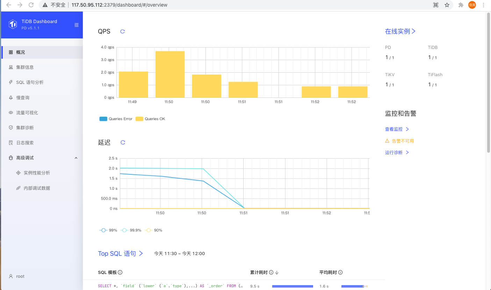

发现是tidb的管理平台，go编写，速度还可


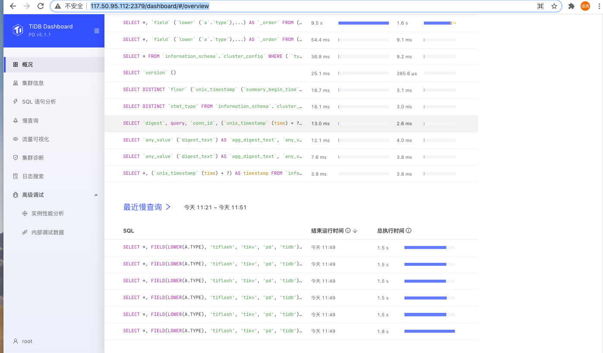


与devops有些联系，但还不合用我们现在的需求


[bytebase](https://github.com/bytebase/bytebase)

```
 docker run -d --init --name bytebase --restart always --publish 18080:18080 --volume ~/.bytebase/data:/var/opt/bytebase bytebase/bytebase:0.11.0 --data /var/opt/bytebase --host http://172.16.200.108 --port 18080
```


# 自动化测试tox


[基础设施及代码](https://martinfowler.com/bliki/InfrastructureAsCode.html)


[11.Ansible你快点：Ansible执行过程分析、异步、效率优化improve](.img_ansible/improve)


# DevOps软件架构师行动指南-读书笔记整理

|                    |                                                              |                        |
| ------------------ | ------------------------------------------------------------ | ---------------------- |
| devops             | 一组过程、方法与系统的统称                                   |                        |
| pipeline           |                                                              |                        |
| 权限分配痛点       | 跨团队开发时,涉及merge和jenkins CI/CD需要其他团队配合        |                        |
| 沟通效率痛点       | 向不同的人描述上下文成本                                     |                        |
| 明确需求痛点       |                                                              |                        |
| 人员轮岗痛点       | 新成员输入上下文、交接工作                                   |                        |
| 关键角色管理痛点   | 未向正确的人汇报                                             | 沟通、建立交付价值指标 |
| 反模式             |                                                              |                        |
| 三步法             |                                                              |                        |
| 职能导向的负面影响 | 对接时需要到达决策层再逐级下达, 调整局部的优先级, 执行工作的人通常都不太理解整件事情的关联, 也会导致糟糕的交接,大量的返工,交付质量下降,延期等现象. |                        |
| 市场导向(速度优化) | 建立虚拟小团队,以客户为导向, 这使得每个小团队能够独立的向客户交付价值,而不必提交工单给IT运维\QA或信息安全等其他部门 |                        |

# [持续集成中的问题整理](.img_devops/CI)


交付 移植


# [技术栈](https://mp.weixin.qq.com/s/FDV4tp9tAodShQjM_LLXpQ)


https://zhuanlan.zhihu.com/p/373551077

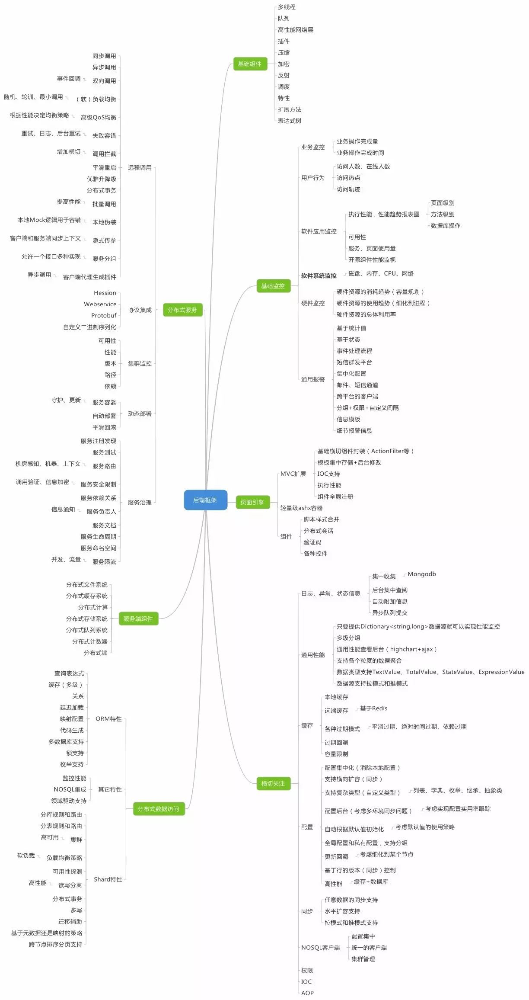


## 架构方法论

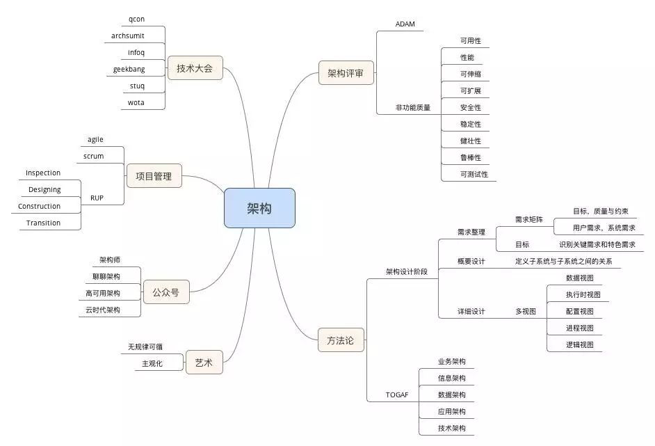


# SRE GOOGLE


|                          |                                                     |           |
| ------------------------ | --------------------------------------------------- | --------- |
| 开发与运维之间的矛盾     | 开发想快速上线迭代,运维求稳                         |           |
| SRE成员特点              | 排斥重复和手工,足够的软件开发能力                   |           |
| 产品OPS负载              |                                                     |           |
| 方法论                   |                                                     |           |
| SLO                      |                                                     |           |
| AB测试?                  |                                                     |           |
| 灰度发布?                |                                                     |           |
| 错误预算?                |                                                     |           |
| 管理错误?                |                                                     |           |
| 紧急报警                 | 需要立即执行某种操作,目标是解决或避免即将发生的问题 | 重大/紧急 |
| 工单                     | 系统不能自动解决目前情况, 几天内解决                | ticket    |
| 日志                     | 正确的做法是平时没人会主动阅读日志,除非有特殊需要   | loki      |
| MTTF                     | 平均失败时间                                        |           |
| MTTR                     | 平均恢复时间                                        |           |
| 变更管理                 |                                                     |           |
| 运维手册+多次演习on-call |                                                     |           |
| 渐进式发布               |                                                     |           |
| 及时检测问题             |                                                     |           |
| 回滚                     |                                                     |           |
| 故障预测...              |                                                     |           |
| 需求预测                 |                                                     |           |
|                          |                                                     |           |


# 程序员的自我修养

|          |      |      |
| -------- | ---- | ---- |
| 微观管理 |      |      |
|          |      |      |
|          |      |      |


# 数据库变更的持续交付

| 数据库变更的持续交付                                         | CI/CD |      |
| ------------------------------------------------------------ | ----- | ---- |
| [针对数据库变更的持续集成与交付](.detail_devops/针对数据库变更的持续集成与交付.md) |       |      |
| [数据库变更部署自动化秘诀](.detail_devops/数据库变更部署自动化秘诀.md) |       |      |
| [数据库版本管理最佳实践](.detail_devops/数据库版本管理最佳实践.md) |       |      |


## 变更规范


|                                                              |      |      |
| ------------------------------------------------------------ | ---- | ---- |
| sql中不能有drop                                              |      |      |
| 在migrate中备份表名 ``"{table}_{current_version}"``, 然后写一个回滚sql文件把表名改回来 |      |      |
|                                                              |      |      |


## 工具准备

|                    |      |      |
| ------------------ | ---- | ---- |
| 一个开发同学一个库 |      |      |
|                    |      |      |
|                    |      |      |


##  migrate as code

|                                                |      |      |
| ---------------------------------------------- | ---- | ---- |
| https://github.com/playframework/playframework |      |      |
|                                                |      |      |
|                                                |      |      |


# dba tool

**Webhooks and insecure internal web services** **all tiers** **self-managed**

1. On the top bar, select Menu > Admin.
2. On the left sidebar, select Settings > Network.
3. Expand the Outbound requests section:
4. Select Allow requests to the local network from web hooks and services.


[](https://computingforgeeks.com/wp-content/uploads/2021/08/Menu-Admin-1-1024x415.png?ezimgfmt=rs:696x282/rscb23/ng:webp/ngcb23)

On the new page, hover over or click “***Settings\***” then hit “***Network\***“.

[](data:image/svg+xml,)

When the new page loads, look for “***Outbound requests\***“. On the far right of this field, click on “***Expand\***“.

[](data:image/svg+xml,)

Once Outbound requests field is expanded, you will see a field against a radio button that reads, “*Allow requests to the local network from web hooks and services*“. Click on the radio button to enable it as shared in the illustration below.

[](data:image/svg+xml,)

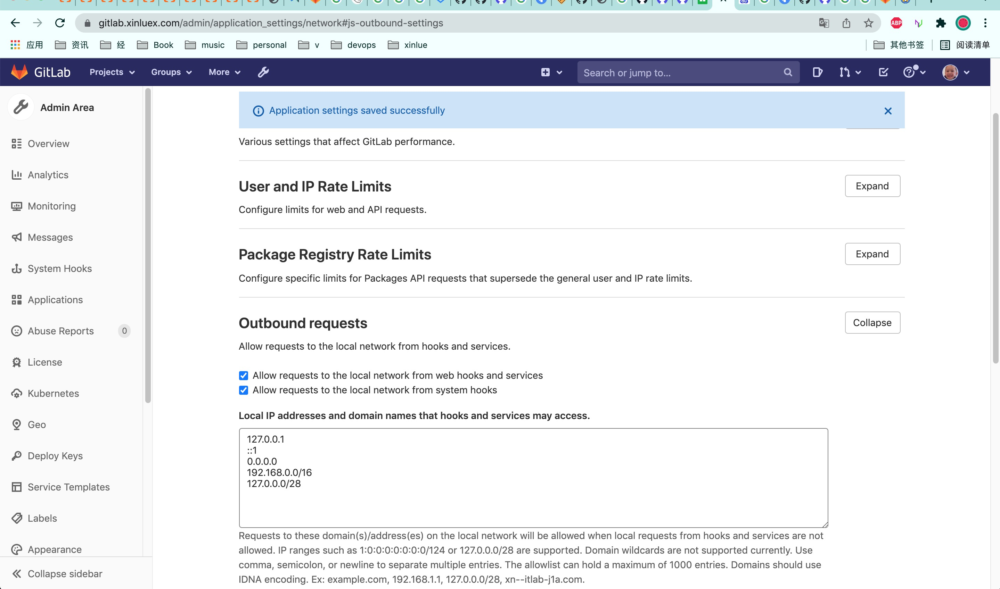


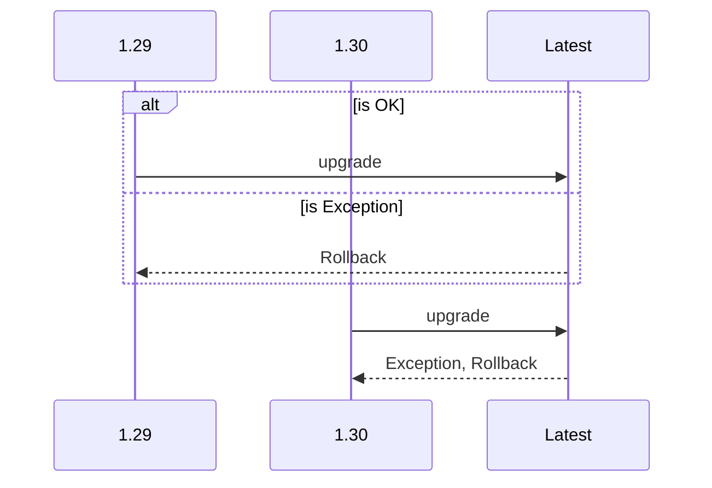


# n8n


```sh
npm install n8n -g
nohup n8n start &
```


## 基础认证

If you are just running it from the command line, set the environment variables before starting n8n.


```sh
N8N_BASIC_AUTH_ACTIVE=true
N8N_BASIC_AUTH_USER=USER
N8N_BASIC_AUTH_PASSWORD=PASSWORD
```


# eureka 返回json


Spring Boot在调用Eureka REST    接口返回格式为xml格式,想改为json格式

解决办法
请求头部改为    Accept: text/html, application/xhtml+xml, application/json;q=0.9, */*;q=0.8


```http
GET /eureka/apps?Accept=text%2Fhtml,%20application%2Fxhtml%2Bxml,%20application%2Fjson%3Bq%3D0.9,%20*%2F*%3Bq%3D0.8 HTTP/1.1
Accept: text/html, application/xhtml+xml, application/json;q=0.9, */*;q=0.8
Host: 172.16.200.101:8082
Connection: close
User-Agent: Paw/3.3.0 (Macintosh; OS X/10.14.6) GCDHTTPRequest
```


# nexus


raw repo 上传下载文件

```sh
# 上传
curl -v --user 'admin:admin123' --upload-file ./test.png http://localhost:8081/repository/documentation/test.png

```

```sh
# 下载
curl -v --user 'admin:admin123' http://localhost:8081/repository/documentation/test.png -O
```

[raw repo blog](https://blog.csdn.net/qq_34556414/article/details/117926726)


[raw repo doc](https://help.sonatype.com/repomanager3/nexus-repository-administration/formats/raw-repositories)


repo maven 

```
https://repo1.maven.org/maven2/
```


# openvpn


```

```


# rocketmq


https://blog.csdn.net/qq_16240085/article/details/119738614


# 云原生


# A/B 测试


# 语义化版本

https://www.cnblogs.com/lane_cn/p/13662071.html


# k8s

https://github.com/easzlab/kubeas


# 运维工程师职业生涯天花板 SRE 学习路径

HelloDog [云原生实验室](javascript:void(0);) *2022-08-16 08:30* *发表于浙江*

收录于合集

\#SRE3个

\#DevOps4个

\#运维2个


> ❝
>
> 本文转自 HelloDog 的博客，原文：**https://wsgzao.github.io/post/sre/**，版权归原作者所有。欢迎投稿，投稿请添加微信好友：**cloud-native-yang**

## 前言

之前分享过 DevOps 但一直忘记补 SRE 相关的信息，其实两者本质没有太多区别，都是运维。

* 按运维阶段划分

* * 人肉运维 -> 脚本运维 -> 平台运维 -> 智能运维

* 按技术栈来划分

* * 物理机堆硬件 -> x86 虚拟化 -> 私有云 + 公有云 -> 云原生

本文主要记录一些 SRE 的背景和学习面试资料，方便需要时串起来。

------

## SRE 简介

SRE 从字面意义来看是 Google 技术 VP **Ben Treynor Sloss**[1] 定义的一个岗位，全名叫 Site Reliability Engineering，翻译过来就是网站可靠性工程 (师)。然而在我看来他不仅仅是一份工作，反而是一套服务保障体系。

## 为什么要有 SRE？

为什么会出现 SRE 这个岗位呢？这就要从大名鼎鼎的 **DevOps**[2] 说起了，这个是 Google 高级研发总监 Melody Meckfessel 在 2017 年提出的理论体系，这套体系是**通过构建一些列  DevOps 工具链和标准把研发过程中的各个角色高效整合在一起，高效的产出稳定的交付结果**。这个体系打破了研发与运维的边界，使研发期望的构建更多特性而运维期望的不要引入太多的不稳定性的目标合二为一。

DevOps  解决了高效生产稳定服务的流程，使服务的生产迭代周期进一步的缩短。但是随着各个服务的搭建，越来越多的服务都在持续演进着，然而运维维护服务的工作也就越来越多，线上的不稳定状态也就越来越多。那么如何解决这个问题呢？是由开发人员时刻关注着自己的服务么？那整体架构的稳定性又如何保证呢？

由此就产生了 SRE。SRE 的职责就是负责整体站点（服务）的稳定性。然而保证稳定性一定**不是在出现问题时才解决问题**，而是体系化的方式观测与避免问题。这就是我所理解的 SRE 体系。

* **https://sre.google/**
* **https://www.googblogs.com/sre-vs-devops-competing-standards-or-close-friends/**
* **https://sre.google/sre-book/table-of-contents/**
* **https://linkedin.github.io/school-of-sre/**

## DevOps Roadmap

关于 DevOps Roadmap 之前也分享过，保持终身学习的态度吧

* **https://roadmap.sh/**
* **https://roadmap.sh/devops**

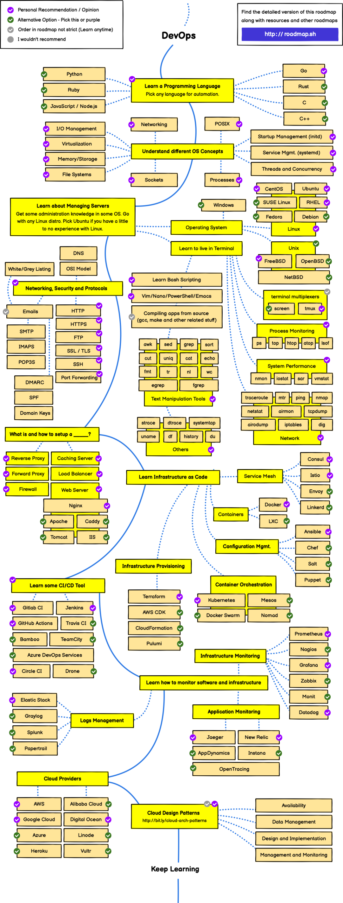

## Agile and Scrum

**Agile Product Ownership in a nutshell**[3]

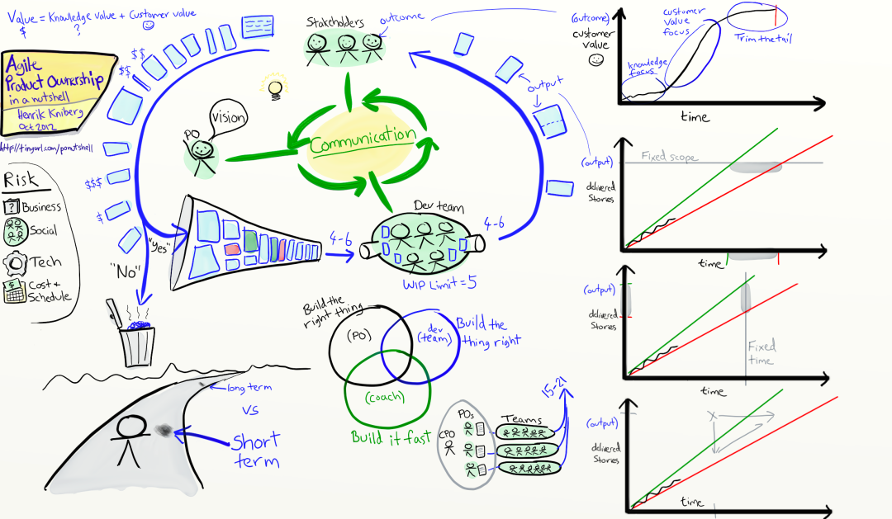

**Introduction to Scrum - 7 Minutes**[4]

**凤凰项目 - The Phoenix Project**[5]


## Network TCP/IP and OSI

* **https://community.fs.com/blog/tcpip-vs-osi-whats-the-difference-between-the-two-models.html**
* **http://www.52im.net/thread-180-1-1.html**
* **https://zqlxtt.cn/2020/09/23/tcpip-overview/**

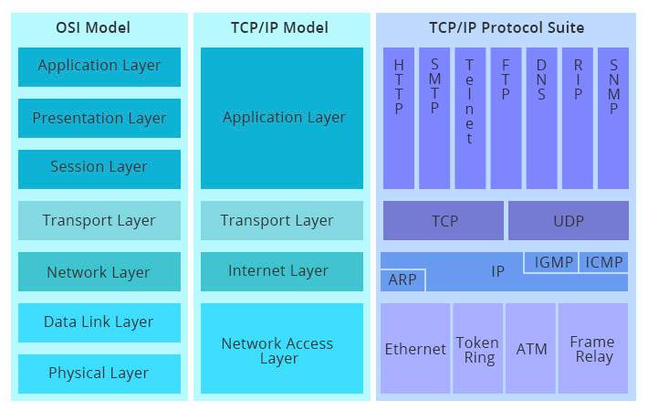


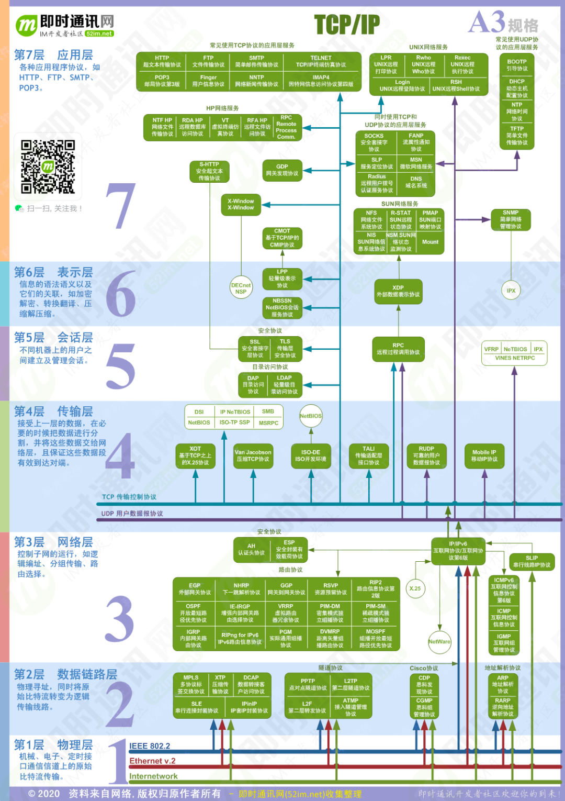

## System Design

**The System Design Primer**[6]

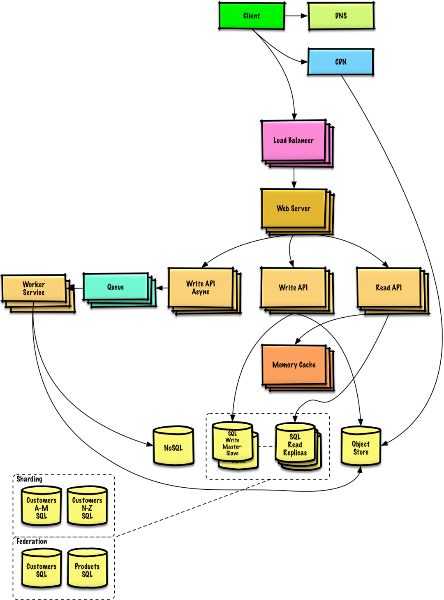

**What happens when you type google.com into your browser’s address box and press enter?**[7]

## Coding

LeetCode

* **https://leetcode.com/**
* **https://leetcode.com/discuss/interview-question**

LeetCode solutions in any programming language | 多种编程语言实现 LeetCode、《剑指 Offer（第 2 版）》、《程序员面试金典（第 6 版）》题解

* **https://leetcode.cn/**
* **https://github.com/doocs/leetcode**

**labuladong 算法小抄**[8]

**代码随想录**[9]

**小浩算法**[10]

## 八股文

> ❝
>
> 什么是八股文？八股文不是死东西，八股文本应该指计算机基础知识，考验的是面试者基础能力、广度以及深度，大厂面试不会很重视死八股，往往是很灵活的分析。

**计算机网络常见知识点 & 面试题**[11]

**操作系统常见面试题总结**[12]

**Linux 基础知识总结**[13]

## 职级和薪资范围评估

**https://www.levels.fyi/**

### 引用链接

[1]Ben Treynor Sloss: *https://www.crunchbase.com/person/benjamin-treynor-sloss*[2]DevOps: *https://en.wikipedia.org/wiki/DevOps*[3]Agile Product Ownership in a nutshell: *https://blog.crisp.se/2012/10/25/henrikkniberg/agile-product-ownership-in-a-nutshell*[4]Introduction to Scrum - 7 Minutes: *https://www.youtube.com/watch?v=9TycLR0TqFA*[5]凤凰项目 - The Phoenix Project: *https://www.youtube.com/watch?v=9TycLR0TqFA*[6]The System Design Primer: *https://github.com/donnemartin/system-design-primer*[7]What happens when you type google.com into your browser’s address box and press enter?: *https://4ark.me/post/b6c7c0a2.html*[8]labuladong 算法小抄: *https://github.com/labuladong/fucking-algorithm*[9]代码随想录: *https://www.programmercarl.com/*[10]小浩算法: *https://github.com/geekxh/hello-algorithm*[11]计算机网络常见知识点 & 面试题: *https://javaguide.cn/cs-basics/network/other-network-questions.html*[12]操作系统常见面试题总结: *https://javaguide.cn/cs-basics/operating-system/operating-system-basic-questions-01.html*[13]Linux 基础知识总结: *https://javaguide.cn/cs-basics/operating-system/linux-intro.html*


**你可能还喜欢**

点击下方图片即可阅读

[如何让 Alertmanger 发送告警时带上监控面板？2022-08-11](https://mp.weixin.qq.com/s?__biz=MzU1MzY4NzQ1OA==&mid=2247512322&idx=2&sn=d3c8223ce32c3ef9c82db843f247eb13&chksm=fbedf1cfcc9a78d9063f412785066ff0e987f9e97504367d452c02479cfcf7423ddcfb648067&scene=21#wechat_redirect)

[巧用 Prometheus 来扩展 Kubernetes 调度器2022-08-08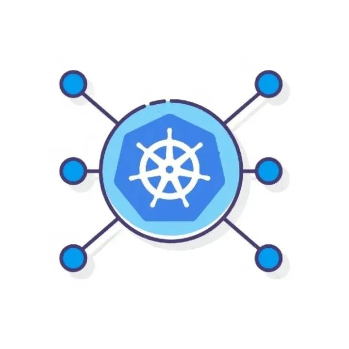](https://mp.weixin.qq.com/s?__biz=MzU1MzY4NzQ1OA==&mid=2247512295&idx=2&sn=94ac0c7497df69bb7704946135829037&chksm=fbedf02acc9a793cd71e0795da524255fa1766c15c728c3a477a33212a6f45fb6366f66b3cf1&scene=21#wechat_redirect)

[Argo CD 保姆级入门教程2022-08-03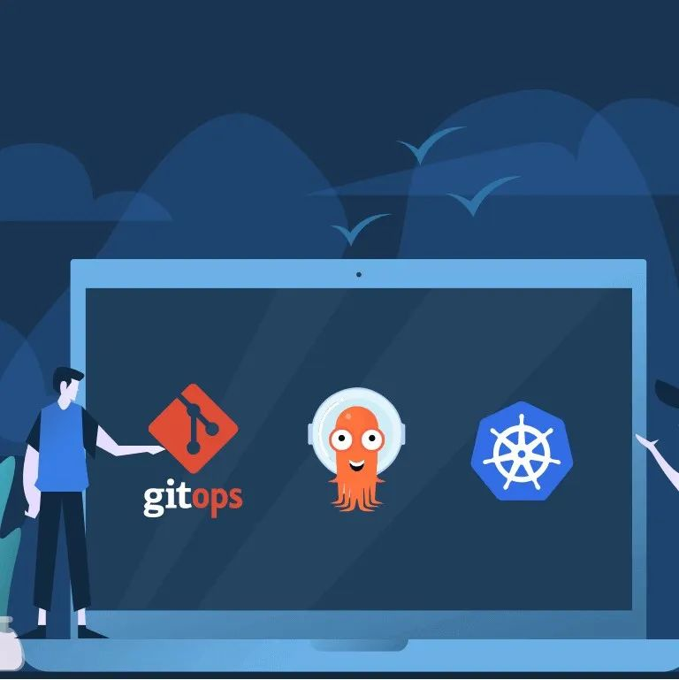](https://mp.weixin.qq.com/s?__biz=MzU1MzY4NzQ1OA==&mid=2247512193&idx=1&sn=da41bb4072870e34bdf338c22bcbc8cc&chksm=fbedf04ccc9a795a08f4b0deb5a8518aa901dc1e8678277d232fff0d05ba1613a3f8d8636ab9&scene=21#wechat_redirect)

[CoreDNS 健康检查详解2022-07-29](https://mp.weixin.qq.com/s?__biz=MzU1MzY4NzQ1OA==&mid=2247512076&idx=1&sn=71ab64e1249deb339db7b003f46a2fb6&chksm=fbedf0c1cc9a79d7cffa5e8da4103921aec8ba83aedff2882a50f8f329f08da1b4b690f344f9&scene=21#wechat_redirect)


**云原生是一种信仰** **🤘**


**云原生实验室**

战略上藐视云原生，战术上重视云原生

135篇原创内容


公众号


# [长文预警](https://lework.github.io/2020/09/05/devops/)


[toc]
