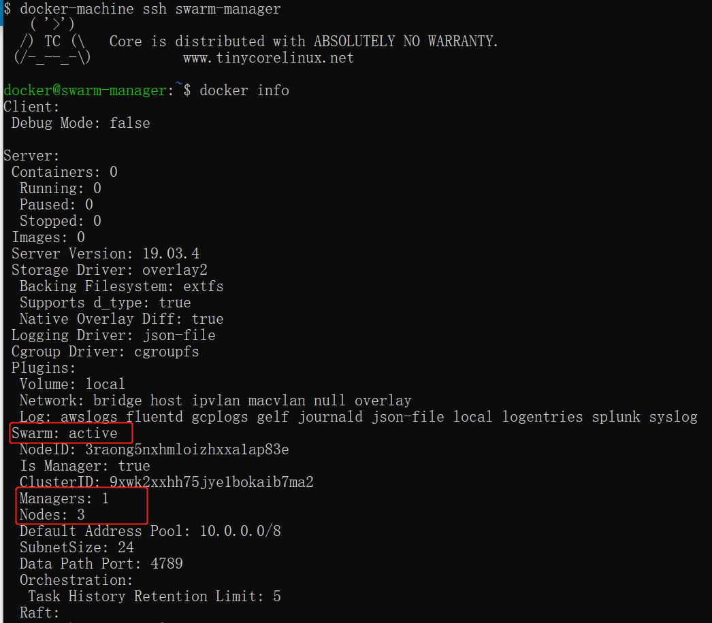
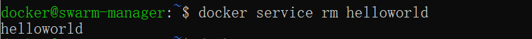
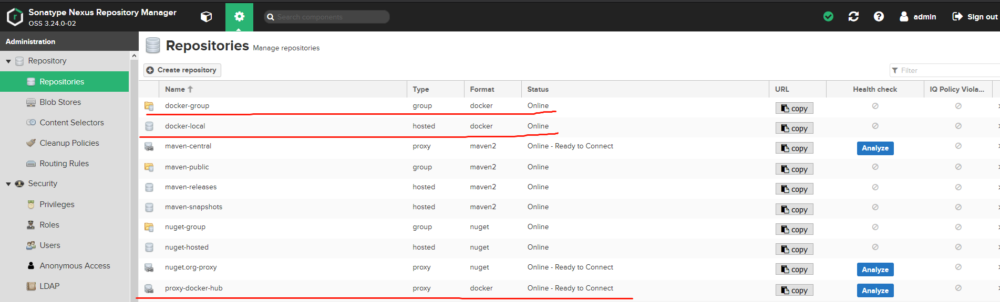

# 启动时添加host

```sh
# 启动时增加hosts，参考自docker docs

docker run -d --name test1 \
    --add-host test1.a:1.2.3.4 \
    local/test
```


# 编辑 Docker 20以上配置文件

```sh
sudo vim /etc/docker/daemon.json
```

加入以下配置项

```json
{
    "default-address-pools": [
      {"base": "10.1.0.0/16", "size": 24}
    ]
}
```

# 更改root-dir的三种方法

一. daemon.json

```json
# cat /etc/docker/daemon.json
{"registry-mirrors": ["https://5e159g9q.mirror.aliyuncs.com"],  "data-root": "/data/docker-data/default"}
```

二、修改启动配置文件

vim /usr/lib/systemd/system/docker.service

在ExecStart的行尾加上--graph=/data/docker-data/default

PS：这里等同于docker -d --graph=/data/docker-data/default,区别在于这种方式只会临时修改，如果重启 docker daemon,就又会回到默认值
————————————————
版权声明：本文为CSDN博主「半生痴狂半生颠」的原创文章，遵循CC 4.0 BY-SA版权协议，转载请附上原文出处链接及本声明。
原文链接：https://blog.csdn.net/lhuang0813/article/details/123005016

# 热重启,不影响运行的容器

生产环境 dockerd 内存泄漏？想重启 dockerd 又怕重启容器，影响到线上业务？

别怕！用 docker live-restore, 在重启 dockerd 时，不会重启容器。

配置 docker daemon 参数，编辑文件 /etc/docker/daemon.json，添加如下配置

```json
{ "live-restore": true }
```

**示例**

cat /etc/docker/daemon.json 

```json
{
  "registry-mirrors": ["http://hub-mirror.c.163.com"],
  "insecure-registries": ["http://192.168.56.10"],
  "exec-opts":["native.cgroupdriver=systemd"],
  "live-restore": true
}

```

dockerd reload 配置(不会重启 dockerd)

```shell
kill -SIGHUP $(pidof dockerd) 
# 给 dockerd 发送 SIGHUP 信号，dockerd 收到信号后会 reload 配置
```


检查是否配置成功

```sh
docker info | grep -i live
```

**应该能看到 Live Restore Enabled: true**


重启 docker，此时重启 docker 不会重启容器

```
systemctl restart docker
```


实在是好用，dockerd 有啥问题都可以重启，不用担心重启 dockerd 会影响现有业务了。比如：

升级 docker 版本

> dockerd 内存泄漏。 docker 17.06  之前容易出现这个问题，再也不怕 dockerd 吃掉所有内存又不敢重启了～
> docker 可以不重启 reload 配置，使用 SIGHUP 信号，就像 nginx -s reload，挺好用的。

# 查看镜像信息


```shell
docker history --format json --no-trunc docker.io/mysql:5.7 
```


# image \<none>定期清理

```sh
59 23 * * * docker rmi -f `docker images | grep '<none>' | awk '{print $3}'`
55 23 * * * docker rmi -f `docker ps -a | grep Exited | awk '{print $1}'`
```


# [优化体积](https://waynerv.com/posts/how-to-reduce-docker-image-size/)


# [neuxs docker nginx search](https://www.jianshu.com/p/b87ace01aee4)


# timezone/时区

Dockerfile

```dockerfile
ENV TZ=Asia/Shanghai
```


```sh
-e TZ=Asia/Shanghai
```


```sh
-v /etc/localtime:/etc/localtime:ro
```


# docker update --restart=always

修改已创建的容器的重启策略

```sh
docker container update --restart=always 容器名字
```


# 记一次no host to route

```
systemctl stop docker
iptables -t nat -F
systemctl start docker
```

推测是其他软件端口冲突导致转发规则有误

# docker安装

centos 7 以上

```sh
yum install -y yum-utils device-mapper-persistent-data lvm2

yum-config-manager --add-repo https://download.docker.com/linux/centos/docker-ce.repo

yum install docker-ce -y

yum install bridge-utils -y

sudo brctl addbr docker0

sudo ip addr add 172.17.0.1/24 dev docker0
sudo ip addr add 172.27.0.1/24 dev docker0
sudo ip addr add 172.50.0.1/24 dev docker0


# vi /etc/docker/daemon.json

# {"bip":"10.49.0.1/24"}

sudo ip link set dev docker0 up

sudo ip addr show docker0

sudo groupadd docker

sudo usermod -aG docker unii

mkdir -p /app/docker && ln -s /app/docker /var/lib/docker && chown -R unii:unii /app/docker

sudo systemctl restart docker
```


```sh
yum install -y yum-utils device-mapper-persistent-data lvm2

yum-config-manager --add-repo https://download.docker.com/linux/centos/docker-ce.repo

yum install docker-ce -y

yum install bridge-utils -y

sudo brctl addbr docker0

sudo ip addr add 10.49.0.1/24 dev docker0

# vi /etc/docker/daemon.json

# {"bip":"10.49.0.1/24"}

sudo ip link set dev docker0 up

sudo ip addr show docker0
sudo useradd appuser

sudo groupadd docker

sudo usermod -aG docker appuser

mkdir -p /data/docker && ln -s /data/docker /var/lib/docker && chown -R appuser:appuser /data/docker

sudo systemctl restart docker
```


```sh
docker commit -a "vue ts python3.6" -m "打包测试成功" f8520479ba2b vue3-ts-python3.6:1.0.0

docker export  --output=vue3-ts-python36.tar  c7
cat vue3-ts-python36.tar|docker import - c8
```


```bash
hr:centos7 hr$ docker port 4966d35fe0a3
22/tcp -> 0.0.0.0:10022
```

# docker swarm

官方网站：[https://docs.docker.com/engine/swarm/](https://links.jianshu.com/go?to=https%3A%2F%2Fdocs.docker.com%2Fengine%2Fswarm%2F)


docker swarm 删除节点 (解散集群)

排空节点上的集群容器 。
docker node update --availability drain g36lvv23ypjd8v7ovlst2n3yt

主动离开集群，让节点处于down状态，才能删除
docker swarm leave

删除指定节点 （管理节点上操作）
docker node rm g36lvv23ypjd8v7ovlst2n3yt

管理节点，解散集群
docker swarm leave --force

 

docker swarm初始化
1）docker swarm init # 针对机器只有一个IP的情况
2）docker swarm init --advertise-addr 172.16.1.13 # 针对机器有多个IP的情况，需要指定一个IP，一般都是指定内网IP

加入到swarm的命令
docker swarm join --token SWMTKN-1-4929ovxh6agko49u0yokrzustjf6yzt30iv1zvwqn8d3pndm92-0kuha3sa80u2u27yca6kzdbnb 172.16.1.13:2377

初始化网络
docker network create -d overlay --attachable zhang
docker network ls # 查看网络
docker network inspect zhang # 查看网络信息

删除网络【慎用】
docker network rm zhang

加入或退出swarm管理
docker swarm join --token SWMTKN-1-4929ovxh6agko49u0yokrzustjf6yzt30iv1zvwqn8d3pndm92-0kuha3sa80u2u27yca6kzdbnb 172.16.1.13:2377

当前swarm有哪些节点
docker node ls

退出当前的swarm节点
docker node rm --force 2pfwllgxpajx5aitlvcih9vsq # 如果mini01上的docker没有停止服务，那么就需要使用 --force 选项

docker node ls
docker swarm leave //在每个 node节点的主机上 都跑一次这条命令


swarm管理机退出swarm
docker node ls
docker swarm leave --force # swarm管理机退出swarm，需要 --force 参数
docker node ls


当前swarm有哪些服务
docker service ls # 只是示例，不是实际数据

swarm标签管理
5.1. 标签添加
根据最开始的主机和组件部署规划，标签规划如下：在swarm管理机mini03上执行。

\# 给mini01机器的标签
docker node update --label-add tomcat=true mini01
docker node update --label-add datanode=true mini01
docker node update --label-add hbase-regionserver-1=true mini01

\# 给mini02机器的标签
docker node update --label-add tomcat=true mini02
docker node update --label-add datanode=true mini02
docker node update --label-add hbase-regionserver-2=true mini02

\# 给mini03机器的标签
docker node update --label-add spark=true mini03
docker node update --label-add zookeeper=true mini03
docker node update --label-add namenode=true mini03
docker node update --label-add hbase-master=true mini03

5.2. 删除标签
在swarm管理机mini03上执行，示例如下：

docker node update --label-rm zookeeper mini03
1
5.3. 查看swarm当前的标签
根据最开始的主机和组件部署规划，标签规划如下：在swarm管理机mini03上执行。

\# 给mini01机器的标签
docker node update --label-add tomcat=true mini01
docker node update --label-add datanode=true mini01
docker node update --label-add hbase-regionserver-1=true mini01

\# 给mini02机器的标签
docker node update --label-add tomcat=true mini02
docker node update --label-add datanode=true mini02
docker node update --label-add hbase-regionserver-2=true mini02

\# 给mini03机器的标签
docker node update --label-add spark=true mini03
docker node update --label-add zookeeper=true mini03
docker node update --label-add namenode=true mini03
docker node update --label-add hbase-master=true mini03

删除标签
在swarm管理机mini03上执行，示例如下：
docker node update --label-rm zookeeper mini03


查看swarm当前的标签
[root@mini03 ~]# docker node ls -q | xargs docker node inspect -f '{{.ID}}[{{.Description.Hostname}}]:{{.Spec.Labels}}'
6f7dwt47y6qvgs3yc6l00nmjd[mini01]:map[tomcat:true datanode:true hbase-regionserver-1:true]
5q2nmm2xaexhkn20z8f8ezglr[mini02]:map[tomcat:true datanode:true hbase-regionserver-2:true]
ncppwjknhcwbegmliafut0718[mini03]:map[hbase-master:true namenode:true spark:true zookeeper:true]

6. 查看日志

启动容器时，查看相关日志，例如如下：

docker stack ps hadoop
docker stack ps hadoop --format "{{.Name}}: {{.Error}}"
docker stack ps hadoop --format "{{.Name}}: {{.Error}}" --no-trunc
docker stack ps hadoop --no-trunc


# 查看docker RestartPolicy

```sh
 docker inspect m1 | python3 -c 'import json,sys;print(json.load(sys.stdin)[0]["HostConfig"]["RestartPolicy"]["Name"])'
```


```sh
docker run -d --name portainer1.2.1 -p 9000:9000 -v /var/run/docker.sock:/var/run/docker.sock -v portainer_data:/data portainer/portainer
```


# [Docker使用pipework配置本地网络](https://www.coonote.com/docker-note/docker-pipework-netword.html)

## 需求

在使用Docker的过程中，有时候我们会有将Docker容器配置到和主机同一网段的需求。要实现这个需求，我们只要将Docker容器和主机的网卡桥接起来，再给Docker容器配上IP就可以了。

下面我们就使用pipework工具来实现这一需求。

## 1、pipework的安装

Pipework是一个Docker配置工具，是一个开源项目，由200多行[shell](https://www.coonote.com/shell/shell-tutorial.html)实现。

Pipework是一个集成工具，需要配合使用的两个工具是OpenvSwitch和Bridge-utils。

```
$ git clone https://github.com/jpetazzo/pipework.git $ sudo cp pipework/pipework /usr/local/bin/
```

## 2、pipework配置Docker的三个简单场景

### 2.1　　pipework+linux bridge：配置Docker单主机容器

```
#主机A：192.168.187.143 #主机A上创建两个容器con1、con2 docker run -itd --name con1 --net=none ubuntu:14.04 bash docker run -itd --name con2 --net=none ubuntu:14.04 bash #使用pipework建立网桥br0，为容器con1和con2添加新的网卡，并将它们连接到br0上 pipework br0 con1 10.0.0.2/24 pipework br0 con2 10.0.0.3/24 #在容器con1和con2内部可以看到有一个网卡地址分别如上，可以ping通
```

### 2.2　　pipework+OVS：单主机Docker容器VLAN划分

pipework不仅可以使用Linux bridge连接Docker容器，还可以与OpenVswitch结合，实现Docker容器的VLAN划分。

```sh
 1 #主机A的IP地址为:192.168.187.147
 2 #在主机A上创建4个Docker容器，test1、test2、test3、test4  3 
 4 docker run -itd --name test1 --net=none busybox sh  5 docker run -itd --name test2 --net=none busybox sh  6 docker run -itd --name test3 --net=none busybox sh  7 docker run -itd --name test4 --net=none busybox sh  8 
 9 #将test1，test2划分到一个vlan中，vlan在mac地址后加@指定，此处mac地址省略 10 pipework ovs0 test1 192.168.0.1/24 @100
11 pipework ovs0 test2 192.168.0.2/24 @100
12 
13 #将test3，test4划分到另一个vlan中 14 pipework ovs0 test3 192.168.0.3/24 @200
15 pipework ovs0 test4 192.168.0.4/24 @200
16 
17 #此时进入容器test1 18 ping 10.0.0.2 #可以通信 19 ping 10.0.0.3    #不可以通信
```

这个功能其实是由于OpenVSwitch本身支持VLAN功能，在将veth pair的一端加入ovs0网桥时，指定了tag。底层的操作是

```sh
ovs-vsctl add-port ovs0 veth* tag=100
```

 

### 2.3　　pipework+OVS：多主机Docker容器VLAN划分

```
 1 #主机A：192.168.187.147
 2 #主机B：192.168.187.148
 3 
 4 #主机A上  5 docker run -itd --net=none --name con1 busybox sh  6 docker run -itd --net=none --name con2 busybox sh  7 
 8 #划分vlan  9 pipework ovs con1 10.0.0.1/24 @100
10 pipework ovs con2 10.0.0.2/24 @200
11 
12 #将eth0连接到ovs上 13 ovs-vsctl add-port ovs eth0 14 
15 #同理在主机B上进行操作 16 docker run -itd --net=none --name con3 busybox sh 17 docker run -itd --net=none --name con4 busybox sh 18 
19 #划分vlan 20 pipework ovs con3 10.0.0.3/24 @100
21 pipework ovs con4 10.0.0.4/24 @200
22 
23 #将eth0连接到ovs上 24 ovs-vsctl add-port ovs eth0
```

遇到问题：

1）进入容器con3，我们期望的结果是可以ping通con1，但是不能ping通con2.但是实验发现都不能ping通。感觉跨主机划分vlan还是存在问题。

注：看到将eth0连接到ovs上另一种实现方式如下，但是试过了还是不能ping通

```
1 #主机A的IP地址为:192.168.187.147
2 ip addr add 192.168.187.147/24 dev ovs0 3 ip addr del 192.168.187.147/24 dev eth0 4 ovs-vsctl add-port ovs0 eth0 5 route del default
6 route add default gw 192.168.187.254 dev ovs0
```

2）如果不划分vlan的话，是可以跨主机通信的。


# 敏感数据及密码

docker secret 

gitlab-ci private variable


# 如何将Docker镜像从1.43G瘦身到22.4MB

张亚龙 译 [Go招聘](javascript:void(0);) *2021-09-18 14:47*

收录于话题#Go译文18个

如果你正在做Web开发相关工作，那么你可能已经知道容器化的概念，以及知道它强大的功能等等。


但在使用Docker时，镜像大小至关重要。我们从create-react-app（https://reactjs.org/docs/create-a-new-react-app.html）获得的样板项目通常都超过1.43 GB。


今天，我们将容器化一个ReactJS应用程序，并学习一些关于如何减少镜像大小并提高性能的技巧。


我们将以ReactJS为例，但它适用于任何类型的NodeJS应用程序。


步骤1：创建项目


1、借助脚手架通过命令行模式创建React项目

```
npx create-react-app docker-image-test
```


2、命令执行成功后将生成一个基础React应用程序架构


3、我们可以进入项目目录安装依赖并运行项目

```
cd docker-image-test
yarn install
yarn start
```


4、通过访问http://localhost:3000可以访问已经启动的应用程序


步骤2：构建第一个镜像


1、在项目的根目录中创建一个名为Dockerfile的文件，并粘贴以下代码：

```
FROM node:12

WORKDIR /app

COPY package.json ./

RUN yarn install

COPY . .

EXPOSE 3000

CMD ["yarn", "start"]
```


2、注意，这里我们从Docker仓库获得基础镜像Node:12，然后安装依赖项并运行基本命令。（我们不会在这里讨论Docker命令的细节）


3、现在可以通过终端为容器构建镜像

```
docker build -t docker-image-test .
```


4、Docker构建镜像完成之后，你可以使用此命令查看已经构建的镜像：

```
docker images
```

在查询结果列表的顶部，是我们新创建的图像，在最右边，我们可以看到图像的大小。目前是1.43GB。


5、我们使用以下命令运行镜像

```
docker run --rm -it -p 3000:3000/tcp docker-image-test:latest
```

打开浏览器并且刷新页面验证其可以正常运行。


步骤3：修改基础镜像


1、先前的配置中我们用node:12作为基础镜像。但是传统的Node镜像是基于Ubuntu的，对于我们简单的React应用程序来说这大可不必。


2、从DockerHub（官方Docker镜像注册表）中我们可以看到，基于alpine-based的Node镜像比基于Ubuntu的镜像小得多，而且它们的依赖程度非常低。


3、下面显示了这些基本图像的大小比较


现在我们将使用node:12-alpine作为我们的基础镜像，看看会发生什么。

```
FROM node:12-alpine

WORKDIR /app

COPY package.json ./

RUN yarn install

COPY . .

EXPOSE 3000

CMD ["yarn", "start"]
```

然后我们以此构建我们的镜像，并与之前做对比。


哇！我们的镜像大小减少到只有580MB，这是一个很大的进步。但还能做得更好吗？


步骤4：多级构建


1、在之前的配置中，我们会将所有源代码也复制到工作目录中。


2、但这大可不必，因为从发布和运行来看我们只需要构建好的运行目录即可。因此，现在我们将引入多级构建的概念，以减少不必要的代码和依赖于我们的最终镜像。


3、配置是这样的：

```
# STAGE 1

FROM node:12-alpine AS build

WORKDIR /app

COPY package.json ./

RUN yarn  install

COPY . /app

RUN yarn build


# STAGE 2

FROM node:12-alpine

WORKDIR /app

RUN npm install -g webserver.local

COPY --from=build /app/build ./build

EXPOSE 3000

CMD webserver.local -d ./build
```


4、在第一阶段，安装依赖项并构建我们的项目


5、在第二阶段，我们复制上一阶段构建产物目录，并使用它来运行应用程序。


6、这样我们在最终的镜像中就不会有不必要的依赖和代码。


接下来，构建镜像成功后并从列表中查看镜像


现在我们的镜像大小只有97.5MB。这简直太棒了。


步骤5：使用Nginx


1、我们正在使用Node服务器运行ReactJS应用程序的静态资源，但这不是静态资源运行的最佳选择。


2、我们尝试使用Nginx这类更高效、更轻量级的服务器来运行资源应用程序，也可以尽可能提高其性能，并且减少镜像的量。


3、我们最终的Docker配置文件看起来像这样

```
# STAGE 1

FROM node:12-alpine AS build

WORKDIR /app

COPY package.json ./

RUN yarn  install

COPY . /app

RUN yarn build

# STAGE 2

FROM nginx:stable-alpine

COPY --from=build /app/build /usr/share/nginx/html

EXPOSE 80

CMD ["nginx", "-g", "daemon off;"]
```


4、我们正在改变Docker配置的第二阶段，以使用Nginx来服务我们的应用程序。


5、然后使用当前配置构建镜像。


6、镜像大小减少到只有22.4MB！


7、同时，我们正在使用一个性能更好的服务器来服务我们出色的应用程序。


8、我们可以使用以下命令验证应用程序是否仍在工作。

```
docker run --rm  -it -p 3000:80/tcp docker-image-test:latest
```


9、注意，我们将容器的80端口暴露给外部，因为默认情况下，Nginx将在容器内部的80端口上可用。


所以这些是一些简单的技巧，你可以应用到你的任何NodeJS项目，以大幅减少镜像大小。


现在，您的容器确实更加便携和高效了。c


原文链接：https://javascript.plainenglish.io/how-i-reduced-docker-image-size-from-1-43-gb-to-22-4-mb-84058d70574b


来自：https://cloud.51cto.com/art/202108/679717.htm


# 在 Go 中使用 dockertest 进行集成测试

原创 程序员ug [幽鬼](javascript:void(0);) *2021-11-29 11:30*

收录于话题#golang56个

争做团队核心程序员，关注「幽鬼」


进行集成测试（或系统测试）通常意味着让数据库填充数据，像 redis、elasticsearch 等，通常，我们的软件与之交互的任何基础设施都可以工作。

最常见的方法是复制我们的生产基础设施，其实用容器来实现还是比较容易的，比如 docker 容器。

我们可以为需要复制的每个服务设置和运行一个容器，我们可以使用 docker-compose 对其进行编排并创建一些 makefile 或只是一个简单的脚本来准备基础设施并运行集成测试。

如果你的测试是独立的（它们应该是独立的），你必须找到在测试之间“重新启动”基础设施服务的方法，这可能很难通过分离的基础设施设置和测试来实现（基础设施是在脚本中设置的，而测试在 Go 文件中）

## 01 dockertest

如果你使用的是 Go，则可以使用 dockertest，一个可以管理和编排 Go 测试文件中的容器的库。

从 Go 文件管理测试基础设施容器，允许我们控制在每个测试中需要的服务（例如，某些包正在使用数据库而不是 Redis，为这个测试运行 Redis 没有意义）

### 安装 dockertest

要安装 dockertest，只需运行：

```sh
go get -u github.com/ory/dockertest/v3
```

### 使用 dockertest

使用 dockertest 设置基础设施的最简单方法是在测试文件的`TestMain` 函数中添加设置代码。

`TestMain` 是在包中运行测试之前调用的函数，更多信息参考这里。

这是如何使用 dockertest 设置 MySQL 服务的示例：

```
package mypackage_test

import (
 "database/sql"
 "fmt"
 "log"
 "os"
 "testing"

 _ "github.com/go-sql-driver/mysql"
 "github.com/ory/dockertest/v3"
)

var db *sql.DB

func TestMain(m *testing.M) {
 // uses a sensible default on windows (tcp/http) and linux/osx (socket)
 pool, err := dockertest.NewPool("")
 if err != nil {
  log.Fatalf("Could not connect to docker: %s", err)
 }

 // pulls an image, creates a container based on it and runs it
 resource, err := pool.Run("mysql", "5.7", []string{"MYSQL_ROOT_PASSWORD=secret"})
 if err != nil {
  log.Fatalf("Could not start resource: %s", err)
 }

 // exponential backoff-retry, because the application in the container might not be ready to accept connections yet
 if err := pool.Retry(func() error {
  var err error
  db, err = sql.Open("mysql", fmt.Sprintf("root:secret@(localhost:%s)/mysql", resource.GetPort("3306/tcp")))
  if err != nil {
   return err
  }
  return db.Ping()
 }); err != nil {
  log.Fatalf("Could not connect to docker: %s", err)
 }

  // RESERVED FOR DATABASE MIGRATIONS
 code := m.Run()
 
 // You can't defer this because os.Exit doesn't care for defer
 if err := pool.Purge(resource); err != nil {
  log.Fatalf("Could not purge resource: %s", err)
 }
 
 os.Exit(code)
}
```

### 填充数据库

现在我们有工作的数据库服务，但这个数据库是空的。dockertest 正在为容器使用通用 MySQL 映像，并且没有与我们的应用程序相关的任何内容。

之前写了一篇关于 数据库迁移，在那篇文章中，我谈到了 *go-migrate*，一个运行数据库迁移的工具，那篇文章，我专注于作为 CLI 工具使用，现在将在我们的 Go 代码中使用它。

我们将先前编写的代码 `// RESERVED FOR DATABASE MIGRATIONS` 添加到此代码中：

```
m, err := migrate.NewWithDatabaseInstance("file://<path-to-migration-folder>, "mysql", driver)
if err != nil {
    log.Fatalf("Error running migrations: %s", err)
}
err = m.Up()
if err != nil {
    log.Fatal(err.Error())
}
```

然后在 dockertest up 数据库后，迁移工具填充数据库，我们的集成测试可以使用数据库中的相同数据运行。

如果应用程序有多个包（这是常见情况），我会将服务的设置代码放在一个独立文件中，该文件在每个包中调用：

```
// it_utils.go
package it_utils

func IntegrationTestSetup() (*dockertest.Pool, *[]dockertestResource {
  // Setup the services
  //return the pool and the resources
}

func IntegrationTestTeardown(pool *dockertest.Pool, resources []*dockertest.Resource) {
 for _, resource := range resources {
  if err := pool.Purge(resource); err != nil {
   fmt.Printf("Could not purge resource: %s\n", err)
  }
 }
}
```

那么在每个包的测试中我们只需要添加如下代码：

```
package my_package

func TestMyTests (t *testing.T) {
    if testing.Short() {
  t.Skip()
 }
 pool, resources := itutils.IntegrationTestSetup()
 defer itutils.IntegrationTestTeardown(pool, resources)
 
 t.Run("your test", func(t *testing.T) {
 ...
 }
}

func TestOtherTests (t *testing.T) {
    if testing.Short() {
  t.Skip()
 }
 pool, resources := itutils.IntegrationTestSetup()
 defer itutils.IntegrationTestTeardown(pool, resources)
 
 t.Run("your other test", func(t *testing.T) {
 ...
 }
}
```

以这种方式在每个测试块上执行此操作，服务在新容器中运行，从而使测试完全独立。

作为最后一个提示，我建议将集成测试放在不同的包中以避免循环导入。

原文链接：https://sergiocarracedo.es/integration-tests-in-golang-with-dockertest/


# bytebase

```sh
docker run -d --init --name bytebase --restart always --publish 18080:8080 --volume ~/.bytebase/data:/var/opt/bytebase bytebase/bytebase:0.11.0 --data /var/opt/bytebase --host http://172.16.200.82 --port 18080
```


# rancher


```sh


docker run --name m1 -p 63306:3306 -e MYSQL_ROOT_PASSWORD=Xinlue@2022 -d mysql:8.0

docker run   -d --name=rancher-master --privileged   --restart=unless-stopped   -p 18081:80 -p 44444:443  \
-v /home/infra/rancher/cni:/var/lib/cni \
-v /home/infra/rancher/log:/var/log \
-v /home/infra/rancher/kubelet:/var/lib/kubelet \
-v /home/infra/rancher/rancher:/var/lib/rancher \
   rancher/rancher:v2.6.0
```


# Swarm 集群管理

### 简介

Docker Swarm 是 Docker 的集群管理工具。它将 Docker 主机池转变为单个虚拟 Docker 主机。 Docker Swarm 提供了标准的 Docker API，所有任何已经与 Docker 守护程序通信的工具都可以使用 Swarm 轻松地扩展到多个主机。

支持的工具包括但不限于以下各项：

* Dokku
* Docker Compose
* Docker Machine
* Jenkins

### 原理

如下图所示，swarm 集群由管理节点（manager）和工作节点（work node）构成。

* **swarm mananger**：负责整个集群的管理工作包括集群配置、服务管理等所有跟集群有关的工作。
* **work node**：即图中的 available node，主要负责运行相应的服务来执行任务（task）。

[](https://www.runoob.com/wp-content/uploads/2019/11/services-diagram.png)

------

## 使用

以下示例，均以 Docker Machine 和 virtualbox 进行介绍，确保你的主机已安装 virtualbox。

### 1、创建 swarm 集群管理节点（manager）

创建 docker 机器：

```
$ docker-machine create -d virtualbox swarm-manager
```

[](https://www.runoob.com/wp-content/uploads/2019/11/swarm1.png)

初始化 swarm 集群，进行初始化的这台机器，就是集群的管理节点。

```
$ docker-machine ssh swarm-manager
$ docker swarm init --advertise-addr 192.168.99.107 #这里的 IP 为创建机器时分配的 ip。
```

[](https://www.runoob.com/wp-content/uploads/2019/11/swarm2.png)

以上输出，证明已经初始化成功。需要把以下这行复制出来，在增加工作节点时会用到：

```
docker swarm join --token SWMTKN-1-4oogo9qziq768dma0uh3j0z0m5twlm10iynvz7ixza96k6jh9p-ajkb6w7qd06y1e33yrgko64sk 192.168.99.107:2377
```

### 2、创建 swarm 集群工作节点（worker）

这里直接创建好俩台机器，swarm-worker1 和 swarm-worker2 。

[](https://www.runoob.com/wp-content/uploads/2019/11/swarm3.png)

分别进入两个机器里，指定添加至上一步中创建的集群，这里会用到上一步复制的内容。

[](https://www.runoob.com/wp-content/uploads/2019/11/swarm4.png)

以上数据输出说明已经添加成功。

上图中，由于上一步复制的内容比较长，会被自动截断，实际上在图运行的命令如下：

```
docker@swarm-worker1:~$ docker swarm join --token SWMTKN-1-4oogo9qziq768dma0uh3j0z0m5twlm10iynvz7ixza96k6jh9p-ajkb6w7qd06y1e33yrgko64sk 192.168.99.107:2377
```

### 3、查看集群信息

进入管理节点，执行：docker info 可以查看当前集群的信息。

```
$ docker info
```

[](https://www.runoob.com/wp-content/uploads/2019/11/swarm5.png)

通过画红圈的地方，可以知道当前运行的集群中，有三个节点，其中有一个是管理节点。

### 4、部署服务到集群中

**注意**：跟集群管理有关的任何操作，都是在管理节点上操作的。

以下例子，在一个工作节点上创建一个名为 helloworld 的服务，这里是随机指派给一个工作节点：

```
docker@swarm-manager:~$ docker service create --replicas 1 --name helloworld alpine ping docker.com
```

[](https://www.runoob.com/wp-content/uploads/2019/11/swarm6.png)

### 5、查看服务部署情况

查看 helloworld 服务运行在哪个节点上，可以看到目前是在 swarm-worker1 节点：

```
docker@swarm-manager:~$ docker service ps helloworld
```

[](https://www.runoob.com/wp-content/uploads/2019/11/swarm7.png)

查看 helloworld 部署的具体信息：

```
docker@swarm-manager:~$ docker service inspect --pretty helloworld
```

[](https://www.runoob.com/wp-content/uploads/2019/11/swarm8.png)

### 6、扩展集群服务

我们将上述的 helloworld 服务扩展到俩个节点。

```
docker@swarm-manager:~$ docker service scale helloworld=2
```

[](https://www.runoob.com/wp-content/uploads/2019/11/swarm9.png)

可以看到已经从一个节点，扩展到两个节点。

[](https://www.runoob.com/wp-content/uploads/2019/11/swarm10.png)

### 7、删除服务

```
docker@swarm-manager:~$ docker service rm helloworld
```

[](https://www.runoob.com/wp-content/uploads/2019/11/swarm11.png)

查看是否已删除：

[](https://www.runoob.com/wp-content/uploads/2019/11/swarm12.png)

### 8、滚动升级服务

以下实例，我们将介绍 redis 版本如何滚动升级至更高版本。

创建一个 3.0.6 版本的 redis。

```
docker@swarm-manager:~$ docker service create --replicas 1 --name redis --update-delay 10s redis:3.0.6
```

[](https://www.runoob.com/wp-content/uploads/2019/11/swarm13.png)

滚动升级 redis 。

```
docker@swarm-manager:~$ docker service update --image redis:3.0.7 redis
```

[](https://www.runoob.com/wp-content/uploads/2019/11/swarm14.png)

看图可以知道 redis 的版本已经从 3.0.6 升级到了 3.0.7，说明服务已经升级成功。

### 9、停止某个节点接收新的任务

查看所有的节点：

```
docker@swarm-manager:~$ docker node ls
```

[](https://www.runoob.com/wp-content/uploads/2019/11/swarm16.png)

可以看到目前所有的节点都是 Active, 可以接收新的任务分配。

停止节点 swarm-worker1：

[](https://www.runoob.com/wp-content/uploads/2019/11/swarm17.png)

**注意**：swarm-worker1 状态变为 Drain。不会影响到集群的服务，只是 swarm-worker1 节点不再接收新的任务，集群的负载能力有所下降。

可以通过以下命令重新激活节点：

```
docker@swarm-manager:~$  docker node update --availability active swarm-worker1
```

[](https://www.runoob.com/wp-content/uploads/2019/11/swarm19.png)


# 清理Docker的container，image与volume


清理image

```sh
docker images|grep '<none>'
docker images|grep '<none>'|awk '{if($1=="<none>")print$3}'|xargs docker image rm
docker images|grep '<none>'|awk '{if($2=="<none>")print$3}'|xargs docker image rm
```


## 清理技巧 [¶](https://note.qidong.name/2017/06/26/docker-clean/#清理技巧)

清理所有停止运行的容器：

```sh
docker container prune
# or
docker rm $(docker ps -aq)
```

清理所有悬挂（`<none>`）镜像：

```sh
docker image prune
# or
docker rmi $(docker images -qf "dangling=true")
```

清理所有无用数据卷：

```sh
docker volume prune
```

由于`prune`操作是批量删除类的危险操作，所以会有一次确认。 如果不想输入`y<CR>`来确认，可以添加`-f`操作。慎用！

## 清理停止的容器 [¶](https://note.qidong.name/2017/06/26/docker-clean/#清理停止的容器)

```sh
docker rm -lv CONTAINER
```

`-l`是清理link，`v`是清理volume。 这里的CONTAINER是容器的name或ID，可以是一个或多个。

参数列表：

| Name, shorthand | Default | Description                                             |
| --------------- | ------- | ------------------------------------------------------- |
| –force, -f      | false   | Force the removal of a running container (uses SIGKILL) |
| –link, -l       | false   | Remove the specified link                               |
| –volumes, -v    | false   | Remove the volumes associated with the container        |

### 清理所有停止的容器 [¶](https://note.qidong.name/2017/06/26/docker-clean/#清理所有停止的容器)

通过`docker ps`可以查询当前运行的容器信息。 而通过`docker ps -a`，可以查询所有的容器信息，包括已停止的。

在需要清理所有已停止的容器时，通常利用shell的特性，组合一下就好。

```sh
docker rm $(docker ps -aq)
```

其中，`ps`的`-q`，是只输出容器ID，方便作为参数让`rm`使用。 假如给`rm`指定`-f`，则可以清理所有容器，包括正在运行的。

这条组合命令，等价于另一条命令：

```sh
docker container prune
```

`container`子命令，下面包含了所有和容器相关的子命令。 包括`docker ps`，等价于`docker container ps`或`docker container ls`。 其余还有`start`、`stop`、`kill`、`cp`等，一级子命令相当于二级子命令在外面的alias。 而`prune`则是特别提供的清理命令，这在其它的管理命令里还可以看到，比如`image`、`volume`。

### 按需批量清理容器 [¶](https://note.qidong.name/2017/06/26/docker-clean/#按需批量清理容器)

清除所有已停止的容器，是比较常用的清理。 但有时会需要做一些特殊过滤。

这时就需要使用`docker ps --filter`。

比如，显示所有返回值为0，即正常退出的容器：

```sh
docker ps -a --filter 'exited=0'
```

同理，可以得到其它非正常退出的容器。

目前支持的过滤器有：

> * id (container’s id)
> * label (`label=<key>` or `label=<key>=<value>`)
> * name (container’s name)
> * exited (int - the code of exited containers. Only useful with –all)
> * status (`created|restarting|running|removing|paused|exited|dead`)
> * ancestor (`<image-name>[:<tag>]`, `<image id>` or `<image@digest>`) - filters containers that were created from the given image or a descendant.
> * before (container’s id or name) - filters containers created before given id or name
> * since (container’s id or name) - filters containers created since given id or name
> * isolation (`default|process|hyperv`) (Windows daemon only)
> * volume (volume name or mount point) - filters containers that mount volumes.
> * network (network id or name) - filters containers connected to the provided network
> * health (`starting|healthy|unhealthy|none`) - filters containers based on healthcheck status

### 清理失败 [¶](https://note.qidong.name/2017/06/26/docker-clean/#清理失败)

如果在清理容器时发生失败，通过重启Docker的Daemon，应该都能解决问题。

```sh
# systemd
sudo systemctl restart docker.service

# initd
sudo service docker restart
```

## 清理镜像 [¶](https://note.qidong.name/2017/06/26/docker-clean/#清理镜像)

与清理容器的`ps`、`rm`类似，清理镜像也有`images`、`rmi`两个子命令。 `images`用来查看，`rmi`用来删除。

清理镜像前，应该确保该镜像的容器，已经被清除。

```sh
docker rmi IMAGE
```

其中，IMAGE可以是name或ID。 如果是name，不加TAG可以删除所有TAG。

另外，这两个命令也都属于alias。 `docker images`等价于`docker image ls`，而`docker rmi`等价于`docker image rm`。

### 按需批量清理镜像 [¶](https://note.qidong.name/2017/06/26/docker-clean/#按需批量清理镜像)

与`ps`类似，`images`也支持`--filter`参数。

与清理相关，最常用的，当属`<none>`了。

```sh
docker images --filter "dangling=true"
```

这条命令，可以列出所有悬挂（dangling）的镜像，也就是显示为`<none>`的那些。

```sh
docker rmi $(docker images -qf "dangling=true")
```

这条组合命令，如果不写入Bash的alias，几乎无法使用。 不过还有一条等价命令，非常容易使用。

```sh
docker image prune
```

`prune`和`images`类似，也同样支持`--filter`参数。 其它的filter有：

> * dangling (boolean - true or false)
> * label (`label=<key>` or `label=<key>=<value>`)
> * before (`<image-name>[:<tag>]`, `<image id>` or `<image@digest>`) - filter images created before given id or references
> * since (`<image-name>[:<tag>]`, `<image id>` or `<image@digest>`) - filter images created since given id or references
> * reference (pattern of an image reference) - filter images whose reference matches the specified pattern

### 清理所有无用镜像 [¶](https://note.qidong.name/2017/06/26/docker-clean/#清理所有无用镜像)

这招要慎用，否则需要重新下载。

```sh
docker image prune -a
```

## 清理数据卷 [¶](https://note.qidong.name/2017/06/26/docker-clean/#清理数据卷)

数据卷不如容器或镜像那样显眼，但占的硬盘却可大可小。

数据卷的相关命令，都在`docker volume`中了。

一般用`docker volume ls`来查看，用`docker volume rm VOLUME`来删除一个或多个。

不过，绝大多数情况下，不需要执行这两个命令的组合。 直接执行`docker volume prune`就好，即可删除所有无用卷。

注意：**这是一个危险操作！甚至可以说，这是本文中最危险的操作！** 一般真正有价值的运行数据，都在数据卷中。 （当然也可能挂载到了容器外的文件系统里，那就没关系。） 如果在关键服务停止期间，执行这个操作，很可能会**丢失所有数据**！

# 清理overlay2

```shell
[root@gitlab-01 ~]# docker system df 
TYPE            TOTAL     ACTIVE    SIZE      RECLAIMABLE
Images          486       4         128.9GB   124.3GB (96%)
Containers      5         2         5.631MB   10.78kB (0%)
Local Volumes   101       1         34.88GB   34.88GB (100%)
Build Cache     2337      0         107.8GB   107.8GB
```

# 清理build cache

```sh
docker builder prune -f
# 清理最近10天
docker builder prune --filter 'until=240h'
```


## 从文件系统删除 [¶](https://note.qidong.name/2017/06/26/docker-clean/#从文件系统删除)

除配置文件以为，Docker的内容相关文件，基本都放在`/var/lib/docker/`目录下。

该目录下有下列子目录，基本可以猜测出用途：

* aufs
* containers
* image
* network
* plugins
* swarm
* tmp
* trust
* volumes

一般不推荐直接操作这些目录，除非一些极特殊情况。 操作不当，后果难料，需要慎重。

## 参考 [¶](https://note.qidong.name/2017/06/26/docker-clean/#参考)

本文发布时的Docker版本：**17.05.0-ce**，API版本：**1.29**。 在一些比较老的版本，文中提到的一些做法未必可行。

* [docker rm | Docker Documentation](https://docs.docker.com/engine/reference/commandline/rm/)
* [docker ps | Docker Documentation](https://docs.docker.com/engine/reference/commandline/ps/)
* [docker images | Docker Documentation](https://docs.docker.com/engine/reference/commandline/images/)
* [docker rmi | Docker Documentation](https://docs.docker.com/engine/reference/commandline/rmi/)
* [docker volume ls | Docker Documentation](https://docs.docker.com/engine/reference/commandline/volume_ls/)
* [docker volume rm | Docker Documentation](https://docs.docker.com/engine/reference/commandline/volume_rm/)
* [docker volume prune | Docker Documentation](https://docs.docker.com/engine/reference/commandline/volume_prune/)

------

## 相关笔记

* 《[Docker中Image、Container与Volume的迁移](https://note.qidong.name/2018/11/docker-migration/)》
* 《[定制ENTRYPOINT自动修改Docker中volume的权限](https://note.qidong.name/2018/01/docker-volume-permission/)》
* 《[Docker中的ENTRYPOINT与CMD](https://note.qidong.name/2017/11/docker-entrypoint-cmd/)》
* 《[在Docker中安装uWSGI](https://note.qidong.name/2017/06/28/uwsgi-in-docker/)》
* 《[在Docker中使用python-ldap](https://note.qidong.name/2017/06/28/python-ldap-in-docker/)》


总结：

```bash
客户端主机操作
1.echo "192.168.0.254 idocker.io" >> /etc/hosts
2.mkdir -p /etc/docker/certs.d/idocker.io
3.把192.168.0.254主机上的/etc/nginx/ssl/out/root.crt复制到客户端的/etc/docker/certs.d/idocker.io目录下
4.客户端使用：
(1) 登陆：docker login -u admin -p newnode7852 idocker.io
(2) 打标签：docker tag image:label idocker.io/image:label
(3) 推送：docker push idocker.io/image:label
(4) 拉取：docker pull idocker.io/image:label
```

# nexus3

## 1，配置

### 1，创建blob存储

登陆之后，先创建一个用于存储镜像的空间。


定义一个name，下边的内容会自动补全。


然后保存。


> 注意：实际生产中使用，建议服务器存储500G或以上。

### 2，创建一个hosted类型的docker仓库

Hosted类型仓库用作我们的私有仓库，替代harbor的功能。

点击步骤如下：


而后可见所支持种类之丰富，可见一斑。


这里我们看到docker类型有三种：


* `hosted` : 本地存储，即同 docker 官方仓库一样提供本地私服功能。
* `proxy` : 提供代理其他仓库的类型，如 docker 中央仓库。
* `group` : 组类型，实质作用是组合多个仓库为一个地址。

先来创建一个hosted类型的私有仓库。

点击 `Repository`下面的`Repositories` – Create repository – `docker(hosted)` :

`Name`: 定义一个名称docker-local

`Online`: 勾选。这个开关可以设置这个Docker repo是在线还是离线。

```undefined
Repository Connectors
```

* 下面包含HTTP和HTTPS两种类型的port。
* 有什么用呢？说明讲得很清楚：
* 
* 连接器允许docker客户端直接连接到docker仓库，并实现一些请求操作，如docker pull, docker push, API查询等。但这个连接器并不是一定需要配置的，尤其是我们后面会用group类型的docker仓库来聚合它。

我们把HTTP这里勾选上，然后设置端口为8083。

```undefined
Allow anonymous docker pull 
```

不勾选。这样的话就不允许匿名访问了，执行docker pull或 docker push之前，都要先登录：docker login

```undefined
Docker Registry API Support
```

Docker registry默认使用的是API v2, 但是为了兼容性，我们可以勾选启用API v1。

```undefined
Storage
```

`Blob store`：我们下拉选择前面创建好的专用blob：docker-hub。

```undefined
Hosted
```

开发环境，我们运行重复发布，因此Delpoyment policy 我们选择Allow redeploy。

整体配置截图如下：


### 3，创建一个proxy类型的docker仓库

proxy类型仓库，可以帮助我们访问不能直接到达的网络，如另一个私有仓库，或者国外的公共仓库，如官方的dockerhub镜像库。

创建一个proxy类型的仓库

`Name`: proxy-docker-hub

`Repository Connectors`: 不设置。

```javascript
Proxy
```

`Remote Storage`: docker hub的proxy，这里填写: [https://registry-1.docker.io](http://www.eryajf.net/go?url=https://registry-1.docker.io) 这个是官方默认的一个链接

`Docker Index`： Use Docker Hub

`Storage`：idocker-hub

整体配置截图如下：


### 4，创建一个group类型的docker仓库

group类型的docker仓库，是一个聚合类型的仓库。它可以将前面我们创建的3个仓库聚合成一个URL对外提供服务，可以屏蔽后端的差异性，实现类似透明代理的功能。

`name`：docker-group

`Repository Connectors`：启用了一个监听在8082端口的http连接器；

`Storage`：选择专用的blob存储idocker-hub。

`group` : 将左边可选的3个仓库，添加到右边的members下。

整体配置截图如下：


最终效果


到这儿，nexus在docker这一块是部署已经完成了，但是这样并不能很好的使用。因为group仓库并不能推送镜像，因为你推送自己制作的镜像到仓库还得通过本地仓库的端口去推送，很不方便！

有一个解决方法：通过Nginx来判断推镜像还是拉镜像，然后代理到不同端口

## 5，nginx代理方式访问仓库

在部署 Nginx 部分，需要先生成自签名 SSL 证书，因为后面不想在 docker pull 的时候还要带一个端口！这里需要 2 个域名，一个用来展示 nexus 前台，另一个用做 docker 仓库，比如：

* nexus 前台：`repo.ald.com`
* docker 仓库：`idocker.io`

### 1.安装nginx

```mipsasm
yum -y install nginx
```

### 2.生成证书

这里推荐一个一键生成工具，大家可以尝试使用：https://github.com/Fishdrowned/ssl ，使用方法请参考作者说明。

Ps：如果你打算做外网仓库服务，那也可以去申请一个免费SSL证书，我这边是内部oa域名使用，所以只能用自签名证书了。

创建证书方式如下：

```vhdl
#直接切换到应用目录
# cd /etc/nginx/conf.d/
 
#下载工具
# git clone https://github.com/Fishdrowned/ssl.git
Cloning into 'ssl'...
remote: Enumerating objects: 106, done.
remote: Total 106 (delta 0), reused 0 (delta 0), pack-reused 106
Receiving objects: 100% (106/106), 171.53 KiB | 286.00 KiB/s, done.
Resolving deltas: 100% (48/48), done.
 
#生成证书
# cd ssl
# ./gen.cert.sh idocker.io

Removing dir out
Creating output structure
Done
Generating a 2048 bit RSA private key
......+++
......................................................................................................................+++
writing new private key to 'out/root.key.pem'
-----
Generating RSA private key, 2048 bit long modulus
...............................................................................+++
.................................+++
e is 65537 (0x10001)
Using configuration from ./ca.cnf
Check that the request matches the signature
Signature ok
The Subject's Distinguished Name is as follows
countryName           :PRINTABLE:'CN'
stateOrProvinceName   :ASN.1 12:'Guangdong'
localityName          :ASN.1 12:'Guangzhou'
organizationName      :ASN.1 12:'Fishdrowned'
organizationalUnitName:ASN.1 12:'idocker.io'
commonName            :ASN.1 12:'*.idocker.io'
Certificate is to be certified until Jun 12 04:29:18 2022 GMT (730 days)

Write out database with 1 new entries
Data Base Updated

Certificates are located in:
lrwxrwxrwx 1 root root 37 6月  12 12:29 /etc/nginx/conf.d/ssl/out/idocker.io/idocker.io.bundle.crt -> ./20200612-1229/idocker.io.bundle.crt
lrwxrwxrwx 1 root root 30 6月  12 12:29 /etc/nginx/conf.d/ssl/out/idocker.io/idocker.io.crt -> ./20200612-1229/idocker.io.crt
lrwxrwxrwx 1 root root 15 6月  12 12:29 /etc/nginx/conf.d/ssl/out/idocker.io/idocker.io.key.pem -> ../cert.key.pem
lrwxrwxrwx 1 root root 11 6月  12 12:29 /etc/nginx/conf.d/ssl/out/idocker.io/root.crt -> ../root.crt
```

### 3.配置nginx

```bash
# ip地址可以换成内网ip
upstream nexus_docker_get {
    server 192.168.75.11:8082;
}
 
upstream nexus_docker_put {
    server 192.168.75.11:8083;
}
server {
    listen 80;
    listen 443 ssl;
    server_name idocker.io;
    access_log /var/log/nginx/idocker.io.log;
    # 证书
    ssl_certificate /etc/nginx/conf.d/ssl/out/idocker.io/idocker.io.crt; # 证书路径根据上面生成的来定
    ssl_certificate_key /etc/nginx/conf.d/ssl/out/idocker.io/idocker.io.key.pem;
    ssl_protocols TLSv1.1 TLSv1.2;
    ssl_ciphers '!aNULL:kECDH+AESGCM:ECDH+AESGCM:RSA+AESGCM:kECDH+AES:ECDH+AES:RSA+AES:';
    ssl_prefer_server_ciphers on;
    ssl_session_cache shared:SSL:10m;
    # disable any limits to avoid HTTP 413 for large image uploads
    client_max_body_size 0;
    # required to avoid HTTP 411: see Issue #1486 (https://github.com/docker/docker/issues/1486)
    chunked_transfer_encoding on;
    # 设置默认使用推送代理
    set $upstream "nexus_docker_put";
    # 当请求是GET，也就是拉取镜像的时候，这里改为拉取代理，如此便解决了拉取和推送的端口统一
    if ( $request_method ~* 'GET') {
        set $upstream "nexus_docker_get";
    }
    # 只有本地仓库才支持搜索，所以将搜索请求转发到本地仓库，否则出现500报错
    if ($request_uri ~ '/search') {
        set $upstream "nexus_docker_put"; 
    }
    index index.html index.htm index.php;
    location / {
        if ($http_user_agent ~*  "docker")  { proxy_pass http://nexus_docker_put; }
        proxy_pass http://$upstream;
        proxy_set_header Host $host;
        proxy_connect_timeout 3600;
        proxy_send_timeout 3600;
        proxy_read_timeout 3600;
        proxy_set_header X-Real-IP $remote_addr;
        proxy_buffering off;
        proxy_request_buffering off;
        proxy_set_header X-Forwarded-For $proxy_add_x_forwarded_for;
        proxy_set_header X-Forwarded-Proto http;
    }
}
```

nginx -t 检查没有问题的话，就可以启动nginx了。

> blob unkown
>
> 
>
> [解决](https://www.orchome.com/1881)
>
> ` if ($http_user_agent ~*  "docker")  { proxy_pass http://nexus_docker_put; }`

### 4.客户端配置 

部署完成之后，我们就可以找一台测试机器进行测试了，不过因为我们刚刚定义的是内部使用的域名，所以需要在测试机器上写hosts解析，并将证书拷贝过去，否则会报不信任的错误。

在上文介绍的一键生成自签名工具中，会生成一个根证书，名称为/etc/nginx/conf.d/ssl/out/idocker.io/root.crt，我们将这个文件上传到客户端服务器的 /etc/docker/certs.d/idocker.io 目录即可（注意目录需要创建，最后的文件夹名称和仓库域名保持一致：idocker.io）。

现在到一台新主机192.168.75.10上测试：

```ruby
# 主机192.168.75.10上的操作
echo "192.168.75.11 idocker.io" >> /etc/hosts
mkdir -p /etc/docker/certs.d/idocker.io

# 然后去nexus主机上，将刚才的证书拷过来
scp root.crt root@192.168.75.10:/etc/docker/certs.d/idocker.io
```

接下来，就可以开始真正的使用了。

## 6，正式验证

### 1，pull镜像

```makefile
[root@master ~]# docker pull redis
Using default tag: latest
latest: Pulling from library/redis
8559a31e96f4: Pull complete 
85a6a5c53ff0: Pull complete 
b69876b7abed: Pull complete 
a72d84b9df6a: Pull complete 
5ce7b314b19c: Pull complete 
04c4bfb0b023: Pull complete 
Digest: sha256:800f2587bf3376cb01e6307afe599ddce9439deafbd4fb8562829da96085c9c5
Status: Downloaded newer image for redis:latest
docker.io/library/redis:latest
```

### 2，登陆私服

> 这个地方也可能在登陆的时候会报错，说证书过期什么的，如下：

```javascript
Error response from daemon: Get https://idocker.io/v1/users/: x509: certificate has expired or is not yet valid
```

报这个错的情况下，大概原因只有一个，那就是，两台服务器的时间不一致，只需要将两台服务器时间保持一致即可。

```mipsasm
yum -y install ntpdate && ntpdate -u cn.pool.ntp.org
```

分别在两台主机执行之后，发现登陆就成功了。

> 登陆的时候若是提示这个错误：Error response from daemon: login attempt to https://idocker.io/v2/ failed with status: 401 Unauthorized
> 这是nexus版本问题，需要通过WEB管理端设置权限
> 
> 

```csharp
[root@master ~]# docker login -u admin -p admin idocker.io
WARNING! Using --password via the CLI is insecure. Use --password-stdin.
WARNING! Your password will be stored unencrypted in /root/.docker/config.json.
Configure a credential helper to remove this warning. See
https://docs.docker.com/engine/reference/commandline/login/#credentials-store

Login Succeeded
```

### 3,打标签

```bash
docker tag docker.io/library/redis:latest idocker.io/nginx
```

### 4,push镜像

```yaml
[root@master ~]# docker push idocker.io/nginx 
The push refers to repository [idocker.io/nginx]
7b9c5be81844: Pushed 
67c707dbd847: Pushed 
72d3a7e6fe02: Pushed 
cdaf0fb0082b: Pushed 
e6b49c7dcaac: Pushed 
13cb14c2acd3: Pushed 
latest: digest: sha256:76ff608805ca40008d6e0f08180d634732d8bf4728b85c18ab9bdbfa0911408d size: 1572
```

这里上传成功了，再去nexus3里边看看是有上去了。


### 5，测试从私服拉镜像

```csharp
[root@master ~]# docker images
REPOSITORY                                                                    TAG                 IMAGE ID            CREATED             SIZE
redis                                                                         latest              235592615444        43 hours ago        104MB
idocker.io/redis                                                              latest              235592615444        43 hours ago        104MB
[root@master ~]# docker rmi idocker.io/redis 
Untagged: idocker.io/redis:latest
Untagged: idocker.io/redis@sha256:76ff608805ca40008d6e0f08180d634732d8bf4728b85c18ab9bdbfa0911408d
[root@master ~]# docker images
REPOSITORY                                                                    TAG                 IMAGE ID            CREATED             SIZE
redis                                                                         latest              235592615444        43 hours ago        104MB
[root@master ~]# docker pull idocker.io/redis    
Using default tag: latest
latest: Pulling from redis
Digest: sha256:76ff608805ca40008d6e0f08180d634732d8bf4728b85c18ab9bdbfa0911408d
Status: Downloaded newer image for idocker.io/redis:latest
idocker.io/redis:latest
[root@master ~]# docker images
REPOSITORY                                                                    TAG                 IMAGE ID            CREATED             SIZE
redis                                                                         latest              235592615444        43 hours ago        104MB
idocker.io/redis                                                              latest              235592615444        43 hours ago        104MB
```

## 7，代理的功能展示

> 当某一个镜像在我们本地仓库没有的时候，就需要从远程仓库拉取了，其他的私有仓库的操作大概都是要从远程拉取，然后在重复如上操作推到本地私有仓库，而nexus因为有了proxy功能，因此，当我们在pull远程镜像的时候，本地就会自动同步下来了.

以拉取gitlab镜像为例：

```yaml
docker pull idocker.io/gitlab/gitlab-ce
Using default tag: latest
Trying to pull repository docker.io/gitlab/gitlab-ce ...
latest: Pulling from docker.io/gitlab/gitlab-ce
3b37166ec614: Pull complete
504facff238f: Pull complete
ebbcacd28e10: Pull complete
c7fb3351ecad: Pull complete
2e3debadcbf7: Pull complete
8e5e9b12009c: Pull complete
0720fffe6e22: Pull complete
2f336a213238: Pull complete
1656ee3e1127: Pull complete
25fa5248fd38: Pull complete
36b8c1d869a0: Pull complete
Digest: sha256:0dd22880358959d9a9233163147adc4c8f1f5d5af90097ff8dfa383c6be7e25a
Status: Downloaded newer image for docker.io/gitlab/gitlab-ce:latest
```

因为本地没有这个镜像，所以从远程仓库拉取，然后去仓库里看看啥情况：


经过查看可以发现：
docker-local里没有，proxy-docker-hub和docker-group里有

> 注意：删除的话只能在docker-local或proxy-docker-hub中删除，当在这两者中执行删除操作后，docker-group里会自动没有的


至此，基本上关于使用nexus3搭建docker私有仓库的知识点。

# Nginx HTTPS 设置 Nexus 3 和 Docker Registry

[**八荒**](https://www.orchome.com/user/3014/show) 发表于: 2019-09-17  最后更新时间: 2019-09-17 22:43:01 

订阅 [3](https://www.orchome.com/nexus/topusers) 订阅， **3,024** 游览

[nexus 4](https://www.orchome.com/nexus/index)[ 问答区 0](https://www.orchome.com/nexus/issues)[ 最新动态 0](https://www.orchome.com/nexus/news)[ 实用工具 0](https://www.orchome.com/nexus/tools)[ 视频 0](https://www.orchome.com/nexus/video)[ 任务悬赏 ](https://www.orchome.com/nexus/task)

如果nexus3已经安装完成之后，通过nginx进行统一负载，以下是`https`或`http`的例子。

如果您还未搭建nexus3，则看上篇：
[nexus3搭建docker镜像仓库及google镜像代理](https://www.orchome.com/1879)

## http

```
upstream nexus_admin { server 127.0.0.1:8081 ; }
upstream nexus_registry { server 127.0.0.1:8082 ; }

server {
    listen 80;
    server_name localhost;
    add_header X-Frame-Options SAMEORIGIN;

    location / {
        client_max_body_size 0;
        chunked_transfer_encoding on;
        add_header Docker-Distribution-Api-Version: registry/2.0 always;
        proxy_http_version 1.1;
        proxy_set_header Connection "";
        if ($http_user_agent ~*  "docker")               { proxy_pass http://nexus_registry; }
        if ($http_user_agent ~* "Chrome|Mozilla")   { proxy_pass http://nexus_admin; }
        proxy_set_header   Host             $host;
        proxy_set_header   X-Real-IP        $remote_addr;
        proxy_set_header   X-Forwarded-For  $proxy_add_x_forwarded_for;
        proxy_set_header   X-Forwarded-Proto $scheme;
        proxy_set_header   X-Forwarded-Port $server_port;
        proxy_redirect off;
    }
}
```

Copy

## https

```
upstream nexus_admin { server 127.0.0.1:8081 ; }
upstream nexus_registry { server 127.0.0.1:5001 ; }

server {
    listen 80;
    listen 443 ssl ;
    server_name docker.domain.com;
    access_log  /dev/null;
    error_log   /app/logs/nginx/docker.domain.com.error.log;
    ssl_certificate      server.pem;
    ssl_certificate_key  server.key;
    ssl_session_timeout  20m;
    ssl_protocols  TLSv1  TLSv1.1 TLSv1.2;
    ssl_prefer_server_ciphers on;
    ssl_ciphers EECDH+AES:EECDH+CHACHA20;
    add_header X-Frame-Options SAMEORIGIN;

    location / {
        client_max_body_size 0;
        chunked_transfer_encoding on;
        add_header Docker-Distribution-Api-Version: registry/2.0 always;
        proxy_http_version 1.1;
        proxy_set_header Connection "";
        if ($http_user_agent ~*  "docker")               { proxy_pass http://nexus_registry; }
        if ($http_user_agent ~* "Chrome|Mozilla")   { proxy_pass http://nexus_admin; }
        proxy_set_header   Host             $host;
        proxy_set_header   X-Real-IP        $remote_addr;
        proxy_set_header   X-Forwarded-For  $proxy_add_x_forwarded_for;
        proxy_set_header   X-Forwarded-Proto $scheme;
        proxy_set_header   X-Forwarded-Port $server_port;
        proxy_redirect off;
    }
}
```

Copy

## docker-compose.yml

```yml
version: "2"

services:
  nexus:
    image: sonatype/nexus3:3.6.0
    volumes:
      - "/app/srv/docker/nexus3:/nexus-data"
    ports:
      - "8081:8081"
      - "5001:5001"
    environment:
#    - NEXUS_CONTEXT=nexus
    - JAVA_OPTS=" -Xmx2048m"
    mem_limit: 2g
    mem_swappiness: 0

## chown -Rv 200 /app/srv/docker/nexus3
## admin/admin123
```


# privileged device


```
--privileged
```


```
--device /dev/disk3
```


# [常见问题](https://mp.weixin.qq.com/s/Kg7BBAMQatTKmHKTikUbJw)


#    systemctl 问题


```sh
docker run -tid --name centos_1 --privileged=true centos:latest /sbin/init
```


---

|      |                                       |         |
| ---- | ------------------------------------- | ------- |
| save | docker save -o x.tar zookeeper:3.5.10 | offline |
| load | docker load < x.tar                   | offline |
|      |                                       |         |


# save


```sh
docker save -o x.tar zookeeper:3.5.10
```


# load 

```sh
docker load < x.tar
```


