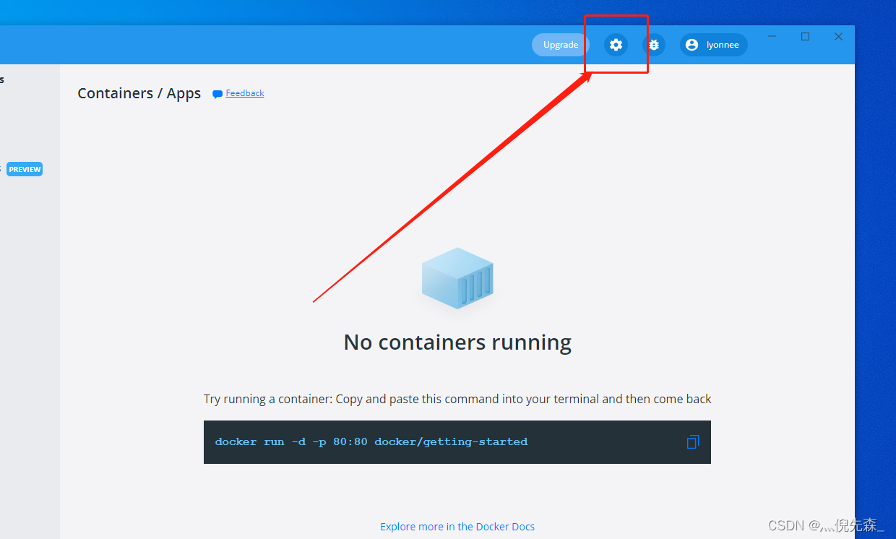
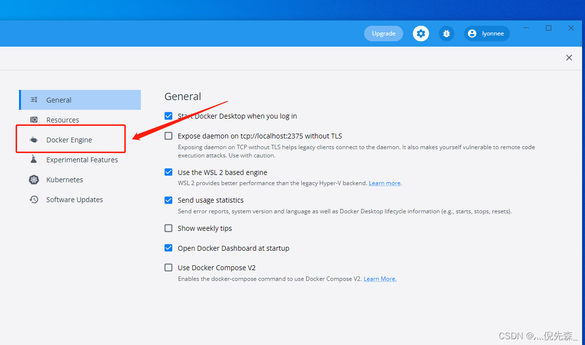
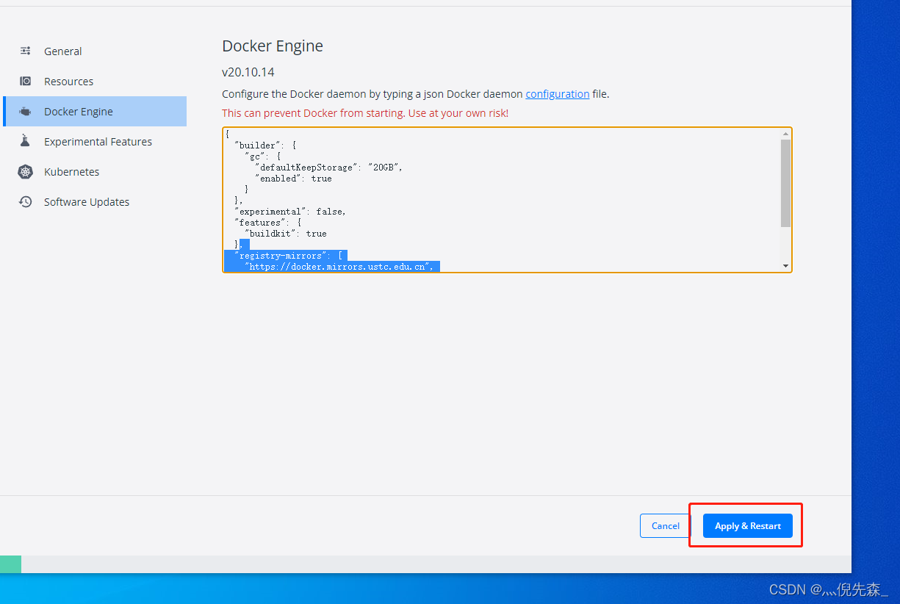

## Windows Docker配置镜像源的两种方法

更新时间 2022.04.14
通过**Docker-Desktop**界面操作和修改**daemon.json**两种方法配置国内镜像源

### 方法一：通过Docker-Desktop配置

- 点击**设置**




选择 **Docker Engine**




- 添加以下源地址

	```json
	"registry-mirrors": [
	    "https://docker.chenby.cn",
	    "docker.awsl9527.cn"
	]
	```
	
	
	
	

