# fatal: index-pack failed  过大

```shell
git config --global http.postBuffer 524288000
```


# 在 HTTPS 端口使用 SSH

如果你能在端口 443 上通过 SSH 连接到 `git@ssh.github.com`，则可覆盖你的 SSH 设置来强制与 GitHub.com 的任何连接均通过该服务器和端口运行。

要在 SSH 配置文件中设置此行为，请在 `~/.ssh/config` 编辑该文件，并添加以下部分：

```
Host github.com
    Hostname ssh.github.com
    Port 443
    User git
```


# git log

https://blog.csdn.net/xhqiang/article/details/82182342

```shell
 git log --pretty="[%cd | %h ] : %s"
```

创建 release note 

# gitlab配置 reload

```sh
#重载配置文件
gitlab-ctl reconfigure                               
#检查是否能够正常获取用户信息
gitlab-rake gitlab:ldap:check                        
```


# ci/cd ui variable


rules 中的variables只支持到script, 不支持 tags选择runner

```yml
.GolangPackage: &GoPack
  stage: GolangPackage
  image: golang:1.18
  script:
    - export
    - cd scripts
    - go env -w GOPROXY="$GO_PROXY"
    - go mod tidy
    - go build autoconfig.go
    - echo $RAW_XU_PASSWD_MASKED
    - echo $MY_TEST
  artifacts:
    paths:
      - scripts/autoconfig
  cache:
    key: go-cache
    paths:
      - scripts/autoconfig
    policy: push
stages:
  - GolangPackage
  - DockerBuild
GoPackOnDev:
  <<: *GoPack
  rules:
    - if: $CI_COMMIT_BRANCH =~ /^develop/
      variables:
        MY_TEST: "devops str"
  tags:
    - devops
GoPackOnTool:
  <<: *GoPack
  rules:
    - if: $CI_COMMIT_BRANCH =~ /^dev-/
      variables:
        MY_TEST: "tools str"
      when: manual
  tags:
    - tools

```


# gitlab postgresql设置

```

```


# proxy

```sh
git config --global https.proxy http://127.0.0.1:1080

git config --global https.proxy https://127.0.0.1:1080

git config --global --unset http.proxy

git config --global --unset https.proxy


npm config delete proxy

```


# delele remote branch

```sh
git push origin --delete feature/login
```


# git cherry-pick 教程


```yml
hosts: 'cdp_deploy_composer'
tasks:
  - name: "find {{ gio_pkg_dir }} dirs"
    find:
      file_type: file
      age: 1d
      paths: "{{ gio_pkg_dir }}"
      patterns: 'id-service-*.tar.gz'
    register: artifacts
    become: yes
  - debug:
      msg: "{{ artifacts.files }}"
```


# Git 工具 - 搜索

## 搜索

无论仓库里的代码量有多少，你经常需要查找一个函数是在哪里调用或者定义的，或者显示一个方法的变更历史。 Git 提供了两个有用的工具来快速地从它的数据库中浏览代码和提交。 我们来简单的看一下。

### Git Grep

Git 提供了一个 `grep` 命令，你可以很方便地从提交历史、工作目录、甚至索引中查找一个字符串或者正则表达式。 我们用 Git 本身源代码的查找作为例子。

默认情况下 `git grep` 会查找你工作目录的文件。 第一种变体是，你可以传递 `-n` 或 `--line-number` 选项数来输出 Git 找到的匹配行的行号。

```console
$ git grep -n gmtime_r
compat/gmtime.c:3:#undef gmtime_r
compat/gmtime.c:8:      return git_gmtime_r(timep, &result);
compat/gmtime.c:11:struct tm *git_gmtime_r(const time_t *timep, struct tm *result)
compat/gmtime.c:16:     ret = gmtime_r(timep, result);
compat/mingw.c:826:struct tm *gmtime_r(const time_t *timep, struct tm *result)
compat/mingw.h:206:struct tm *gmtime_r(const time_t *timep, struct tm *result);
date.c:482:             if (gmtime_r(&now, &now_tm))
date.c:545:             if (gmtime_r(&time, tm)) {
date.c:758:             /* gmtime_r() in match_digit() may have clobbered it */
git-compat-util.h:1138:struct tm *git_gmtime_r(const time_t *, struct tm *);
git-compat-util.h:1140:#define gmtime_r git_gmtime_r
```

除了上面的基本搜索命令外，`git grep` 还支持大量其它有趣的选项。

例如，若不想打印所有匹配的项，你可以使用 `-c` 或 `--count` 选项来让 `git grep` 输出概述的信息， 其中仅包括那些包含匹配字符串的文件，以及每个文件中包含了多少个匹配。

```console
$ git grep --count gmtime_r
compat/gmtime.c:4
compat/mingw.c:1
compat/mingw.h:1
date.c:3
git-compat-util.h:2
```

如果你还关心搜索字符串的 **上下文**，那么可以传入 `-p` 或 `--show-function` 选项来显示每一个匹配的字符串所在的方法或函数：

```console
$ git grep -p gmtime_r *.c
date.c=static int match_multi_number(timestamp_t num, char c, const char *date,
date.c:         if (gmtime_r(&now, &now_tm))
date.c=static int match_digit(const char *date, struct tm *tm, int *offset, int *tm_gmt)
date.c:         if (gmtime_r(&time, tm)) {
date.c=int parse_date_basic(const char *date, timestamp_t *timestamp, int *offset)
date.c:         /* gmtime_r() in match_digit() may have clobbered it */
```

如你所见，date.c 文件中的 `match_multi_number` 和 `match_digit` 两个函数都调用了 `gmtime_r` 例程 （第三个显示的匹配只是注释中的字符串）。

你还可以使用 `--and` 标志来查看复杂的字符串组合，它确保了多个匹配出现在同一文本行中。 比如，我们要查看在旧版本 1.8.0 的 Git 代码库中定义了常量名包含 “LINK” 或者 “BUF_MAX” 这两个字符串的行 （这里也用到了 `--break` 和 `--heading` 选项来使输出更加容易阅读）。

```console
$ git grep --break --heading \
    -n -e '#define' --and \( -e LINK -e BUF_MAX \) v1.8.0
v1.8.0:builtin/index-pack.c
62:#define FLAG_LINK (1u<<20)

v1.8.0:cache.h
73:#define S_IFGITLINK  0160000
74:#define S_ISGITLINK(m)       (((m) & S_IFMT) == S_IFGITLINK)

v1.8.0:environment.c
54:#define OBJECT_CREATION_MODE OBJECT_CREATION_USES_HARDLINKS

v1.8.0:strbuf.c
326:#define STRBUF_MAXLINK (2*PATH_MAX)

v1.8.0:symlinks.c
53:#define FL_SYMLINK  (1 << 2)

v1.8.0:zlib.c
30:/* #define ZLIB_BUF_MAX ((uInt)-1) */
31:#define ZLIB_BUF_MAX ((uInt) 1024 * 1024 * 1024) /* 1GB */
```

相比于一些常用的搜索命令比如 `grep` 和 `ack`，`git grep` 命令有一些的优点。 第一就是速度非常快，第二是你不仅仅可以可以搜索工作目录，还可以搜索任意的 Git 树。 在上一个例子中，我们在一个旧版本的 Git 源代码中查找，而不是当前检出的版本。

### Git 日志搜索

或许你不想知道某一项在 **哪里** ，而是想知道是什么 **时候** 存在或者引入的。 `git log` 命令有许多强大的工具可以通过提交信息甚至是 diff 的内容来找到某个特定的提交。

例如，如果我们想找到 `ZLIB_BUF_MAX` 常量是什么时候引入的，我们可以使用 `-S` 选项 （在 Git 中俗称“鹤嘴锄（pickaxe）”选项）来显示新增和删除该字符串的提交。

```console
$ git log -S ZLIB_BUF_MAX --oneline
e01503b zlib: allow feeding more than 4GB in one go
ef49a7a zlib: zlib can only process 4GB at a time
```

如果我们查看这些提交的 diff，我们可以看到在 `ef49a7a` 这个提交引入了常量，并且在 `e01503b` 这个提交中被修改了。

如果你希望得到更精确的结果，你可以使用 `-G` 选项来使用正则表达式搜索。

#### 行日志搜索

行日志搜索是另一个相当高级并且有用的日志搜索功能。 在 `git log` 后加上 `-L` 选项即可调用，它可以展示代码中一行或者一个函数的历史。

例如，假设我们想查看 `zlib.c` 文件中`git_deflate_bound` 函数的每一次变更， 我们可以执行 `git log -L :git_deflate_bound:zlib.c`。 Git 会尝试找出这个函数的范围，然后查找历史记录，并且显示从函数创建之后一系列变更对应的补丁。

```console
$ git log -L :git_deflate_bound:zlib.c
commit ef49a7a0126d64359c974b4b3b71d7ad42ee3bca
Author: Junio C Hamano <gitster@pobox.com>
Date:   Fri Jun 10 11:52:15 2011 -0700

    zlib: zlib can only process 4GB at a time

diff --git a/zlib.c b/zlib.c
--- a/zlib.c
+++ b/zlib.c
@@ -85,5 +130,5 @@
-unsigned long git_deflate_bound(z_streamp strm, unsigned long size)
+unsigned long git_deflate_bound(git_zstream *strm, unsigned long size)
 {
-       return deflateBound(strm, size);
+       return deflateBound(&strm->z, size);
 }


commit 225a6f1068f71723a910e8565db4e252b3ca21fa
Author: Junio C Hamano <gitster@pobox.com>
Date:   Fri Jun 10 11:18:17 2011 -0700

    zlib: wrap deflateBound() too

diff --git a/zlib.c b/zlib.c
--- a/zlib.c
+++ b/zlib.c
@@ -81,0 +85,5 @@
+unsigned long git_deflate_bound(z_streamp strm, unsigned long size)
+{
+       return deflateBound(strm, size);
+}
+
```

如果 Git 无法计算出如何匹配你代码中的函数或者方法，你可以提供一个正则表达式。 例如，这个命令和上面的是等同的：`git log -L '/unsigned long git_deflate_bound/',/^}/:zlib.c`。 你也可以提供单行或者一个范围的行号来获得相同的输出。	


[PS](https://git-scm.com/book/zh/v2/Git-%E5%B7%A5%E5%85%B7-%E6%90%9C%E7%B4%A2)


# git 如何所有分支里边搜索代码片段

git grep "are you ok" $(git rev-list --all)`

\1. 谷歌大法好：
https://www.google.com/search?q=git+grep+all+branches&oq=git+grep+all&aqs=chrome.0.0i20i263i512j0i512l3j69i57j0i512j0i22i30l4.3117j0j7&sourceid=chrome&ie=UTF-8

\2. 面对 stackoverflow 编程：
https://stackoverflow.com/questions/15292391/is-it-possible-to-perform-a-grep-search-in-all-the-branches-of-a-git-project


```sh
搜索所有的 commit 的 code diff(最快)

git log -p --all -S 'search string'
git log -p --all -G 'match regular expression'

搜索所有 local branch

git branch | tr -d \* | sed '/->/d' | xargs git grep <regexp>

搜索所有的 commit

git grep -F "keyword" $(git rev-list --all)
git grep <regexp> $(git rev-list --all)
git rev-list --all | (while read rev; do git grep -e <regexp> $rev; done)

```

你这个需求用 github 网友的 pickaxe-diff 是最简洁舒适的 结合了 pickaxe-all 但是又不会 print 所有 log -p 无关的 diff  具体参考这里： https://gist.github.com/phil-blain/2a1cf81a0030001d33158e44a35ceda6 显示 Gist 代码 #limiting-diff-output


# tag

```sh
git tag -a v1.4 -m "my version 1.4"
```


```yml
推送代码: ggpush
推送tags: gpoat

```

## 删除tag

git  删除本地标签：


```css
git tag -d 标签名  

例如：git tag -d v3.1.0
```

git  删除远程标签：


```ruby
git push origin :refs/tags/标签名  

例如：git push origin :refs/tags/v3.1.0
```


### gomod命令小结

| **命令**             | **说明**                                                     |
| :------------------- | :----------------------------------------------------------- |
| `go mod download`    | 下载 go.mod 文件中指明的所有依赖                             |
| `go mod tidy`        | 整理现有的依赖，删除未使用的依赖                             |
| `go mod graph`       | 查看现有的依赖结构                                           |
| `go mod init`        | 生成 go.mod 文件 (Go 1.13 中唯一一个可以生成 go.mod 文件的子命令) |
| `go mod edit`        | 编辑 go.mod 文件                                             |
| `go mod vendor`      | 导出现有的所有依赖 (事实上 Go modules 正在淡化 Vendor 的概念) |
| `go mod verify`      | 校验一个模块是否被篡改过                                     |
| `go clean -modcache` | 清理所有已缓存的模块版本数据                                 |
| `go mod`             | 查看所有 go mod的使用命令                                    |


# gitlab-runner

`注意: git版本要升级到2.0+`

```sh
curl -L https://packages.gitlab.com/install/repositories/runner/gitlab-runner/script.rpm.sh | sudo bash
```

docker

```sh
   docker run -d --name gitlab-runner --restart always \
     -v /data/gitlab-runner/config:/etc/gitlab-runner \
     -v /var/run/docker.sock:/var/run/docker.sock \
     gitlab/gitlab-runner:v15.10.1
```


```sh
docker exec -ti gitlab-runner gitlab-runner register
```

register

```sh
docker exec -ti gitlab-runner gitlab-runner register --name my-runner --url https://gitlab.xinluex.com --registration-token xx --docker-privileged --docker-volumes /var/run/docker.sock:/var/run/docker.sock --docker-image docker-hub.xinluex.com/unii-centos:8  --env xx --executor docker
```

unregister

```sh
docker exec -ti gitlab-runner gitlab-runner unregister --name test-01
```


手动register

```sh
$ sudo gitlab-runner register
Runtime platform                                    arch=amd64 os=linux pid=1757391 revision=ece86343 version=13.5.0
Running in system-mode.

Please enter the gitlab-ci coordinator URL (e.g. https://gitlab.com/):
https://gitlab.example.com/
Please enter the gitlab-ci token for this runner:
8LX6mbaPGYxxxxxxxxxx
Please enter the gitlab-ci description for this runner:
[hostname]: runner2
Please enter the gitlab-ci tags for this runner (comma separated):

Registering runner... succeeded                     runner=8LX6xxxx
Please enter the executor: parallels, shell, ssh, virtualbox, kubernetes, custom, docker, docker-ssh, docker+machine, docker-ssh+machine:
shell
Runner registered successfully. Feel free to start it, but if it's running already the config should be automatically reloaded!
```


制作gitlab-runner image

```sh
docker run --name tool-dc -ti -d --privileged --cap-add SYS_ADMIN -v /sys/fs/cgroup:/sys/fs/cgroup:ro -v /var/run/docker.sock:/var/run/docker.sock 10.1.198.114:5010/tool-centos:8.0 /bin/bash

```


# 使用代码仓库管理 GitLab CI 变量


> rules
>
> #### Complex rule clauses
>
> To conjoin `if`, `changes`, and `exists` clauses with an `AND`, use them in the same rule.
>
> In the following example:
>
> * If the `Dockerfile` file or any file in `/docker/scripts` has changed, and `$VAR` == "string value", then the job runs manually
> * Otherwise, the job isn't included in the pipeline.
>
> ```yml
> docker build:
>   script: docker build -t my-image:$CI_COMMIT_REF_SLUG .
>   rules:
>     - if: '$VAR == "string value"'
>       changes:  # Include the job and set to when:manual if any of the follow paths match a modified file.
>         - Dockerfile
>         - docker/scripts/*
>       when: manual
>       # - "when: never" would be redundant here. It is implied any time rules are listed.
> 	
> ```
>
> 


# Docker容器日志清理

 Docker容器日志清理

 原创

[品鉴初心](https://blog.51cto.com/wutengfei)2019-02-16 15:52:13博主文章分类：[Docker实战文档](https://blog.51cto.com/wutengfei/category20)©著作权

*文章标签*[docker](https://blog.51cto.com/topic/docker.html)[docker日志清理](https://blog.51cto.com/topic/docker-log-cleanup-1.html)[/var/lib/docker](https://blog.51cto.com/topic/varlibdocker.html)[linux](https://blog.51cto.com/topic/linux-2.html)[Docker](https://blog.51cto.com/topic/docker.html)*文章分类*[Docker](https://blog.51cto.com/nav/docker)[云计算](https://blog.51cto.com/nav/cloud)*阅读数*7066

# 前言

最近发现公司Gitlab服务器磁盘满了，经排查发现是docker容器日志占用了几十个G容量，那么这些日志怎么去查看和清理呢？

本节主要讲到的知识点如下：

* （1）Docker容器日志路径
* （2）如何清理Docker容器日志
* （3）如何从根本上解决Docker容器日志占用空间问题

# Docker容器日志路径

在linux上，容器日志一般存放在/var/lib/docker/containers/container_id/下面，以json.log结尾的文件（业务日志）。如下：


# 如何清理Docker容器日志

使用命令：

```html
cat /dev/null  >  *-json.log 
```

当然你也可以使用`rm -rf`方式删除日志。但是对于正在运行的docker容器而言，你执行`rm -rf`命令后，通过df -h会发现磁盘空间并没有释放。

原因是在Linux或者Unix系统中，通过rm -rf或者文件管理器删除文件，将会从文件系统的目录结构上解除链接（unlink）。如果文件是被打开的（有一个进程正在使用），那么进程将仍然可以读取该文件，磁盘空间也一直被占用。

当然你也可以通过rm -rf删除后重启docker。

上面两种清除 docker 日志的方式，只是临时上将磁盘空间释放出来了，但是，这样清理之后，随着时间的推移，容器日志总有一天还会积累的很大。下面我们就从根本上解决这个问题～

# 如何从根本上解决Docker容器日志占用空间问题

* （1）方法一：设置一个容器服务的日志大小上限

我们要从根本上解决问题，一种方法是限制容器服务的日志大小上限。这个通过配置容器docker-compose的max-size选项来实现，如下：

```html
nginx: 
  image: nginx:1.12.1 
  restart: always 
  logging: 
    driver: “json-file” 
    options: 
      max-size: “5g” 

```

重启nginx容器之后，其日志文件的大小就被限制在5GB，再也不用担心了。

* （2）方法二：全局设置

新建/etc/docker/daemon.json，若有就不用新建了。添加log-dirver和log-opts参数，样例如下：

```html
# vim /etc/docker/daemon.json

{
  "log-driver":"json-file",
  "log-opts": {"max-size":"500m", "max-file":"3"}
}

```

说明⚠️：

设置的日志大小，只对新建的容器有效。

`max-size=500m`，意味着一个容器日志大小上限是500M

`max-file=3`，意味着一个容器有三个日志，分别是id+.json、id+1.json、id+2.json

```html
// 重启docker守护进程

# systemctl daemon-reload

# systemctl restart docker

```

> **参考文档**
>
>  Docker[容器日志查看与清理](https://blog.csdn.net/yjk13703623757/article/details/80283729)


## 提权

可以直接使用 Docker 官方镜像仓库中的 docker:dind 镜像, 但是在运行时， 需要指定 `--privileged` 选项


https://zhuanlan.zhihu.com/p/41330476


# Git不要只会pull和push，试试这5条提高效率的命令

[](https://juejin.cn/user/4212984288647271)

[出来吧皮卡丘 ](https://juejin.cn/user/4212984288647271)

2022年03月06日 08:42 · 阅读 4025

关注

## 前言

使用 Git 作为代码版本管理，早已是现在开发工程师必备的技能。可大多数工程师还是只会最基本的保存、拉取、推送，遇到一些commit管理的问题就束手无策，或者用一些不优雅的方式解决。

本文分享我在开发工作中实践过的实用命令。这些都能够大大提高工作效率，还能解决不少疑难场景。下面会介绍命令，列出应用场景，手摸手教学使用，让同学们看完即学会。


## stash

[官方文档](https://link.juejin.cn/?target=https%3A%2F%2Fgit-scm.com%2Fdocs%2Fgit-stash)

[git 教程](https://link.juejin.cn/?target=https%3A%2F%2Fwww.bookstack.cn%2Fread%2Fgit-tutorial%2Fdocs-commands-git-stash.md)

### 描述

> 官方解释：当您想记录工作目录和索引的当前状态，但又想返回一个干净的工作目录时，请使用git stash。该命令将保存本地修改，并恢复工作目录以匹配头部提交。

stash 命令能够将还未 commit 的代码存起来，让你的工作目录变得干净。

### 应用场景

我猜你心里一定在想：为什么要变干净？

应用场景：某一天你正在 feature 分支开发新需求，突然产品经理跑过来说线上有bug，必须马上修复。而此时你的功能开发到一半，于是你急忙想切到 master 分支，然后你就会看到以下报错：

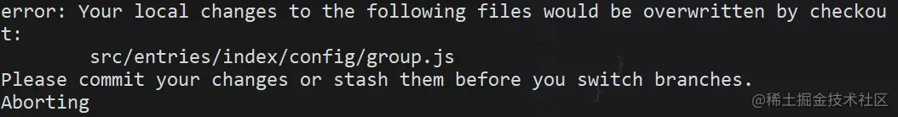

因为当前有文件更改了，需要提交commit保持工作区干净才能切分支。由于情况紧急，你只有急忙 commit 上去，commit 信息也随便写了个“暂存代码”，于是该分支提交记录就留了一条黑历史...(真人真事，看过这种提交)

### 命令使用

如果你学会 stash，就不用那么狼狈了。你只需要：

```sh
git stash
复制代码
```

就这么简单，代码就被存起来了。

当你修复完线上问题，切回 feature 分支，想恢复代码也只需要：

```sh
git stash apply
复制代码
```

### 相关命令

```sh
# 保存当前未commit的代码
git stash

# 保存当前未commit的代码并添加备注
git stash save "备注的内容"

# 列出stash的所有记录
git stash list

# 删除stash的所有记录
git stash clear

# 应用最近一次的stash
git stash apply

# 应用最近一次的stash，随后删除该记录
git stash pop

# 删除最近的一次stash
git stash drop
复制代码
```

当有多条 stash，可以指定操作stash，首先使用stash list 列出所有记录：

```sh
$ git stash list
stash@{0}: WIP on ...
stash@{1}: WIP on ...
stash@{2}: On ...
复制代码
```

应用第二条记录：

```sh
$ git stash apply stash@{1}
复制代码
```

pop，drop 同理。

### vscode 集成

stash 代码

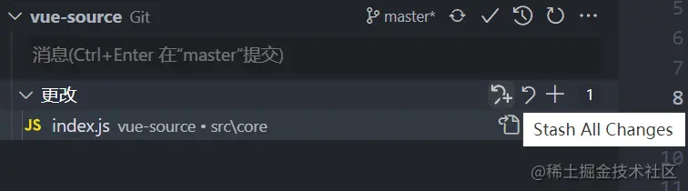

填写备注内容，也可以不填直接Enter

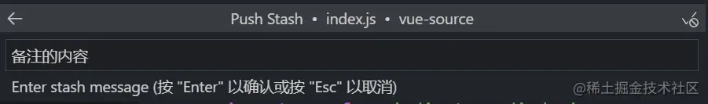

在STASHES菜单中可以看到保存的stash

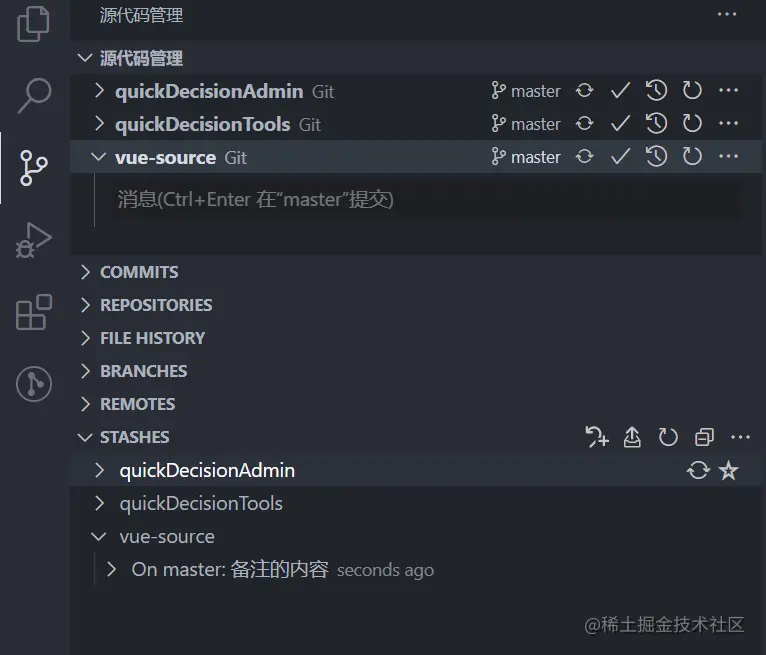

先点击stash记录旁的小箭头，再点击 apply 或者 pop 都可恢复 stash

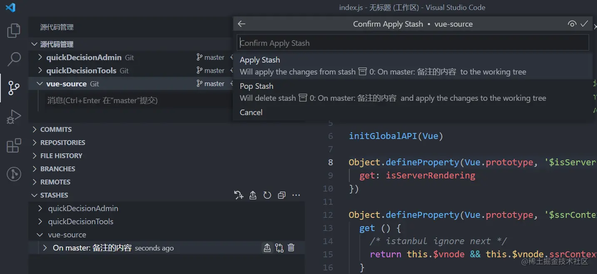

## reset --soft

[官方文档](https://link.juejin.cn/?target=https%3A%2F%2Fgit-scm.com%2Fdocs%2Fgit-reset)

[git 教程](https://link.juejin.cn/?target=https%3A%2F%2Fwww.bookstack.cn%2Fread%2Fgit-tutorial%2Fdocs-commands-git-reset.md)

### 描述

> 完全不接触索引文件或工作树（但会像所有模式一样，将头部重置为）。这使您的所有更改的文件更改为“要提交的更改”。

回退你已提交的 commit，并将 commit 的修改内容放回到暂存区。

一般我们在使用 reset 命令时，`git reset --hard` 会被提及的比较多，它能让 commit 记录强制回溯到某一个节点。而 `git reset --soft` 的作用正如其名，`--soft` (柔软的) 除了回溯节点外，还会保留节点的修改内容。

### 应用场景

回溯节点，为什么要保留修改内容？

应用场景1：有时候手滑不小心把不该提交的内容 commit 了，这时想改回来，只能再 commit 一次，又多一条“黑历史”。

应用场景2：规范些的团队，一般对于 commit 的内容要求职责明确，颗粒度要细，便于后续出现问题排查。本来属于两块不同功能的修改，一起 commit 上去，这种就属于不规范。这次恰好又手滑了，一次性 commit 上去。

### 命令使用

学会 `reset --soft` 之后，你只需要：

```sh
# 恢复最近一次 commit
git reset --soft HEAD^
复制代码
```

`reset --soft` 相当于后悔药，给你重新改过的机会。对于上面的场景，就可以再次修改重新提交，保持干净的 commit 记录。

以上说的是还未 push 的commit。对于已经 push 的 commit，也可以使用该命令，不过再次 push 时，由于远程分支和本地分支有差异，需要强制推送 `git push -f` 来覆盖被 reset 的 commit。

还有一点需要注意，在 `reset --soft` 指定 commit 号时，会将该 commit 到最近一次 commit 的所有修改内容全部恢复，而不是只针对该 commit。

举个栗子：

commit 记录有 c、b、a。

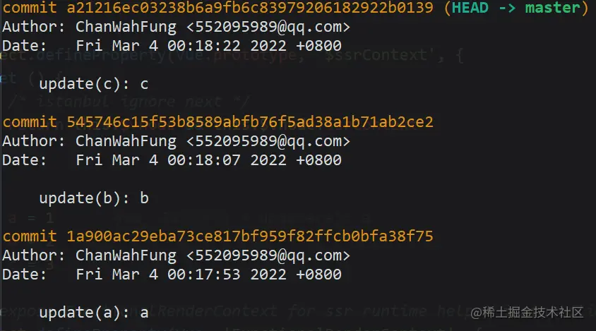

reset 到 a。

```sh
git reset --soft 1a900ac29eba73ce817bf959f82ffcb0bfa38f75
复制代码
```

此时的 HEAD 到了 a，而 b、c 的修改内容都回到了暂存区。

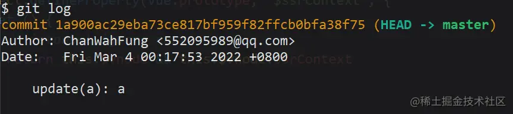

## cherry-pick

[官方文档](https://link.juejin.cn/?target=https%3A%2F%2Fgit-scm.com%2Fdocs%2Fgit-cherry-pick)

[git cherry-pick 教程](https://link.juejin.cn/?target=http%3A%2F%2Fwww.ruanyifeng.com%2Fblog%2F2020%2F04%2Fgit-cherry-pick.html)

### 描述

> 给定一个或多个现有提交，应用每个提交引入的更改，为每个提交记录一个新的提交。这需要您的工作树清洁（没有从头提交的修改）。

将已经提交的 commit，复制出新的 commit 应用到分支里

### 应用场景

commit 都提交了，为什么还要复制新的出来？

应用场景1：有时候版本的一些优化需求开发到一半，可能其中某一个开发完的需求要临时上，或者某些原因导致待开发的需求卡住了已开发完成的需求上线。这时候就需要把 commit 抽出来，单独处理。

应用场景2：有时候开发分支中的代码记录被污染了，导致开发分支合到线上分支有问题，这时就需要拉一条干净的开发分支，再从旧的开发分支中，把 commit 复制到新分支。

### 命令使用

#### 复制单个

现在有一条feature分支，commit 记录如下：

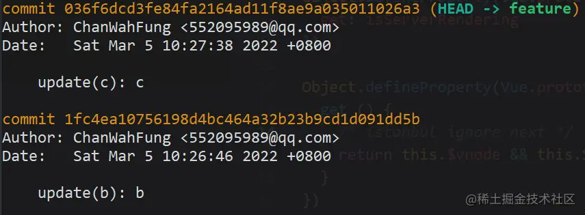

需要把 b 复制到另一个分支，首先把 commitHash 复制下来，然后切到 master 分支。

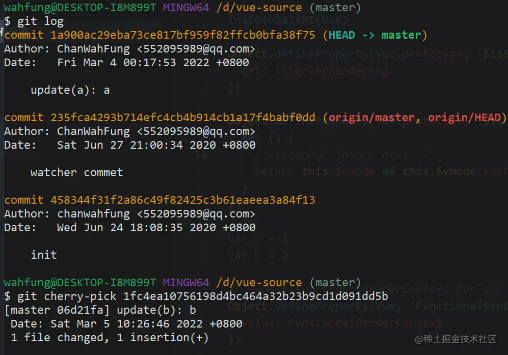

当前 master 最新的记录是 a，使用 `cherry-pick` 把 b 应用到当前分支。

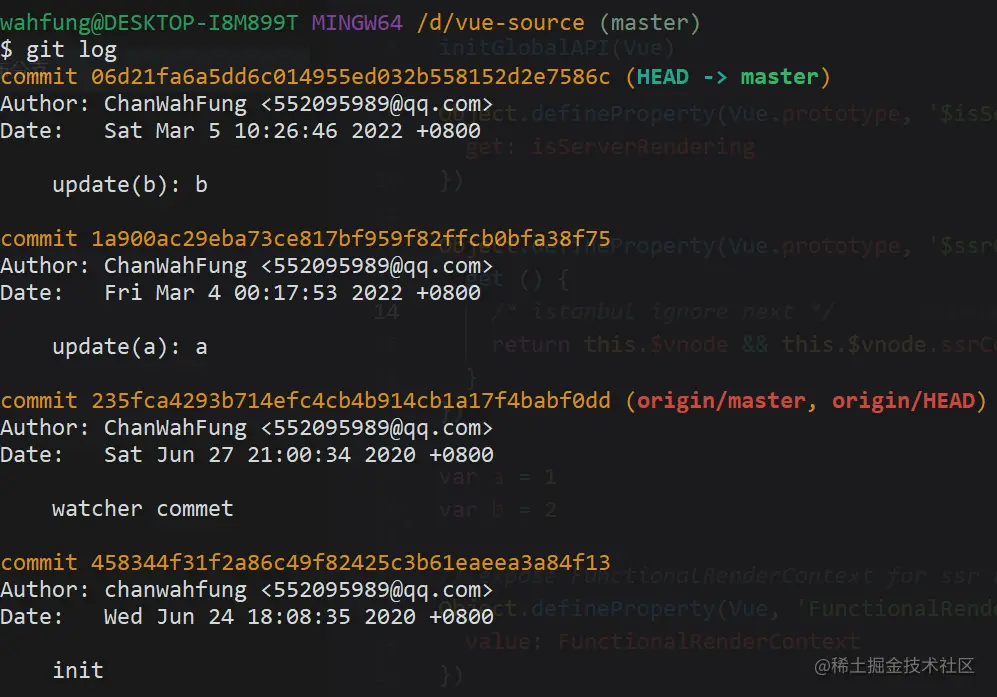

完成后看下最新的 log，b 已经应用到 master，作为最新的 commit 了。可以看到 commitHash 和之前的不一样，但是提交时间还是保留之前的。

#### 复制多个

以上是单个 commit 的复制，下面再来看看 `cherry-pick` 多个 commit 要如何操作。

* 一次转移多个提交：

```sh
git cherry-pick commit1 commit2
复制代码
```

上面的命令将 commit1 和 commit2 两个提交应用到当前分支。

* 多个连续的commit，也可区间复制：

```sh
git cherry-pick commit1^..commit2
复制代码
```

上面的命令将 commit1 到 commit2 这个区间的 commit 都应用到当前分支（包含commit1、commit2），commit1 是最早的提交。

### cherry-pick 代码冲突

在 `cherry-pick` 多个commit时，可能会遇到代码冲突，这时 `cherry-pick` 会停下来，让用户决定如何继续操作。下面看看怎么解决这种场景。

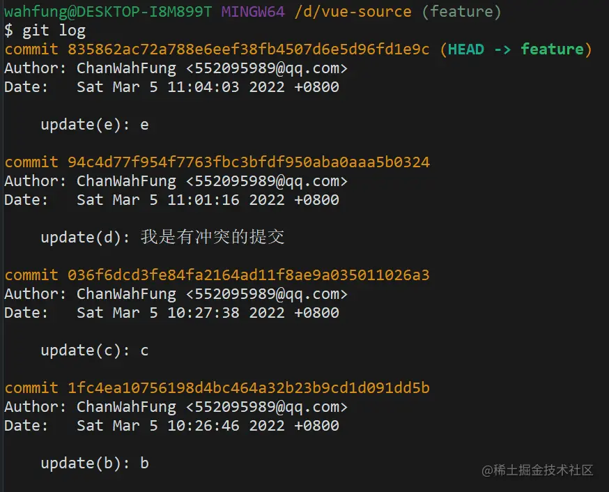

还是 feature 分支，现在需要把 c、d、e 都复制到 master 分支上。先把起点c和终点e的 commitHash 记下来。

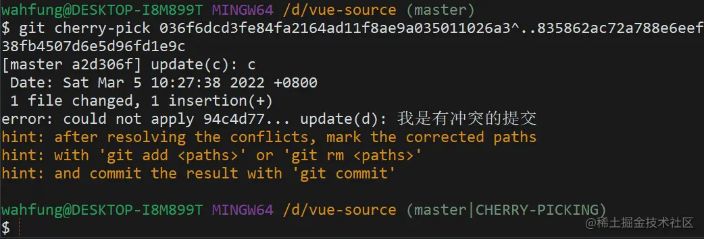

切到 master 分支，使用区间的 `cherry-pick`。可以看到 c 被成功复制，当进行到 d 时，发现代码冲突，`cherry-pick` 中断了。这时需要解决代码冲突，重新提交到暂存区。

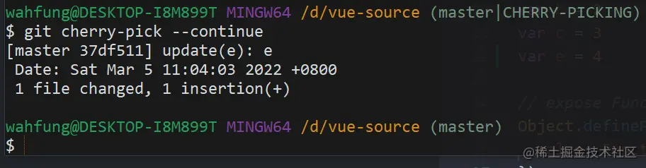

然后使用 `cherry-pick --continue` 让 `cherry-pick` 继续进行下去。最后 e 也被复制进来，整个流程就完成了。

以上是完整的流程，但有时候可能需要在代码冲突后，放弃或者退出流程：

* 放弃 `cherry-pick`：

```sh
gits cherry-pick --abort
复制代码
```

回到操作前的样子，就像什么都没发生过。

* 退出 `cherry-pick`：

```sh
git cherry-pick --quit
复制代码
```

不回到操作前的样子。即保留已经 `cherry-pick` 成功的 commit，并退出 `cherry-pick` 流程。

## revert

[官方文档](https://link.juejin.cn/?target=https%3A%2F%2Fgit-scm.com%2Fdocs%2Fgit-revert)

### 描述

> 给定一个或多个现有提交，恢复相关提交引入的更改，并记录一些这些更改的新提交。这就要求你的工作树是干净的（没有来自头部的修改）。

将现有的提交还原，恢复提交的内容，并生成一条还原记录。

### 应用场景

应用场景：有一天测试突然跟你说，你开发上线的功能有问题，需要马上撤回，否则会影响到系统使用。这时可能会想到用 reset 回退，可是你看了看分支上最新的提交还有其他同事的代码，用 reset 会把这部分代码也撤回了。由于情况紧急，又想不到好方法，还是任性的使用 reset，然后再让同事把他的代码合一遍（同事听到想打人），于是你的技术形象在同事眼里一落千丈。

### 命令使用

#### revert 普通提交

学会 revert 之后，立马就可以拯救这种尴尬的情况。

现在 master 记录如下：

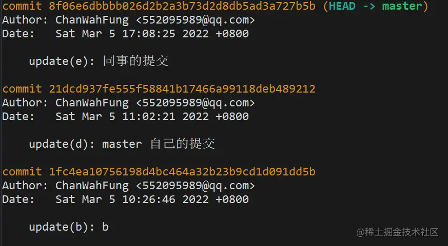

```sh
git revert 21dcd937fe555f58841b17466a99118deb489212
复制代码
```

revert 掉自己提交的 commit。

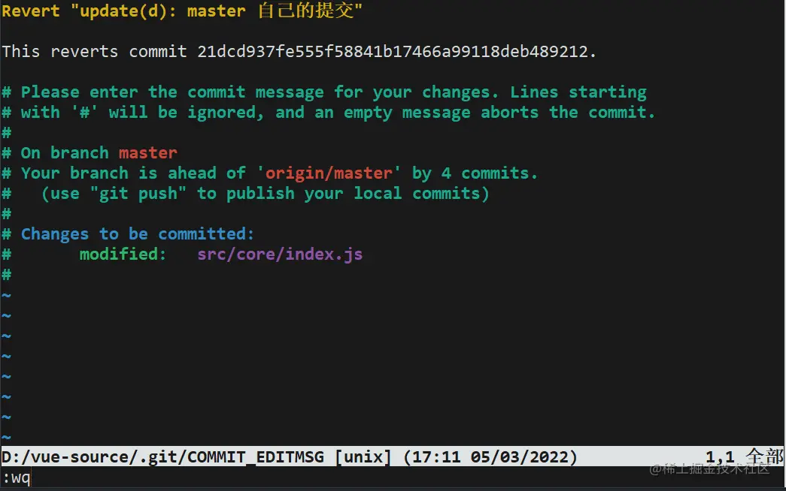

因为 revert 会生成一条新的提交记录，这时会让你编辑提交信息，编辑完后 :wq 保存退出就好了。

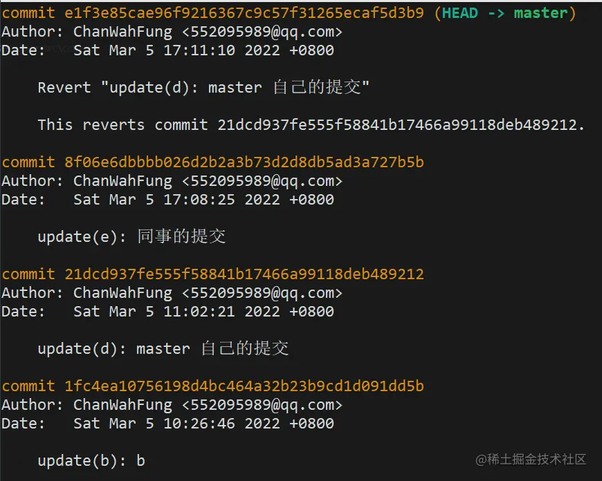

再来看下最新的 log，生成了一条 revert 记录，虽然自己之前的提交记录还是会保留着，但你修改的代码内容已经被撤回了。

#### revert 合并提交

在 git 的 commit 记录里，还有一种类型是合并提交，想要 revert 合并提交，使用上会有些不一样。

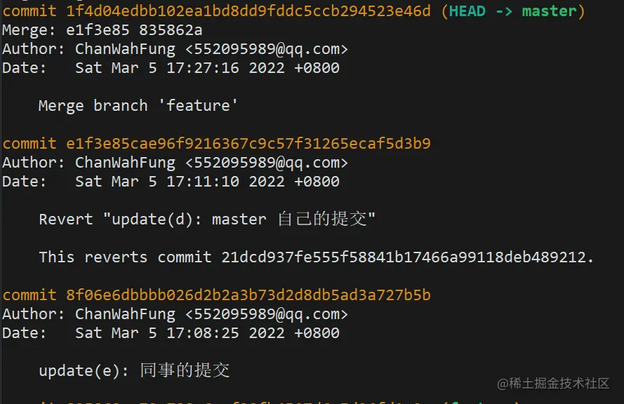

现在的 master 分支里多了条合并提交。

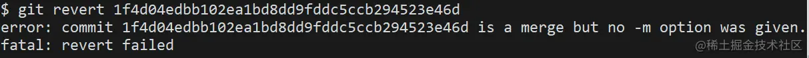

使用刚刚同样的 revert 方法，会发现命令行报错了。

为什么会这样？在官方文档中有解释。

> 通常无法 revert 合并，因为您不知道合并的哪一侧应被视为主线。此选项指定主线的父编号（从1开始），并允许 revert 反转相对于指定父编号的更改

我的理解是因为合并提交是两条分支的交集节点，而 git 不知道需要撤销的哪一条分支，需要添加参数 -m 指定主线分支，保留主线分支的代码，另一条则被撤销。

-m 后面要跟一个 parent number 标识出"主线"，一般使用 1 保留主分支代码。

```sh
git revert -m 1 <commitHash>
复制代码
```

#### revert 合并提交后，再次合并分支会失效

还是上面的场景，在 master 分支 revert 合并提交后，然后切到 feature 分支修复好 bug，再合并到 master 分支时，会发现之前被 revert 的修改内容没有重新合并进来。

因为使用 revert 后， feature 分支的 commit 还是会保留在 master 分支的记录中，当你再次合并进去时，git 判断有相同的 commitHash，就忽略了相关 commit 修改的内容。

这时就需要 revert 掉之前 revert 的合并提交，有点拗口，接下来看操作吧。

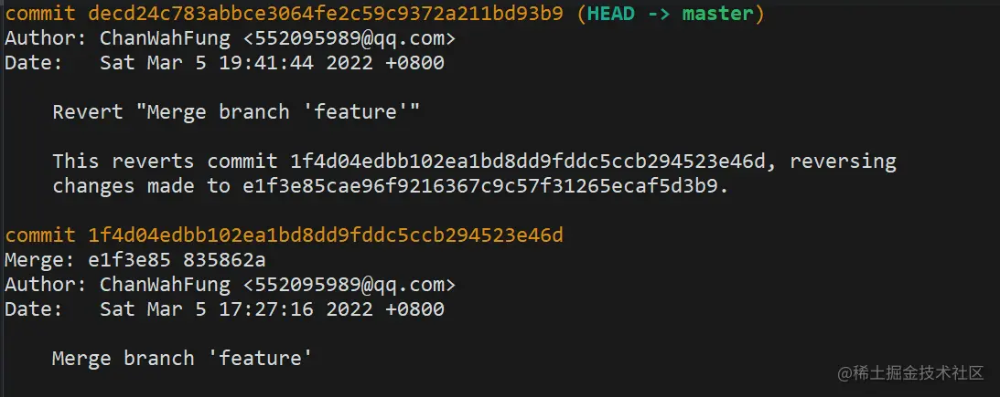

现在 master 的记录是这样的。

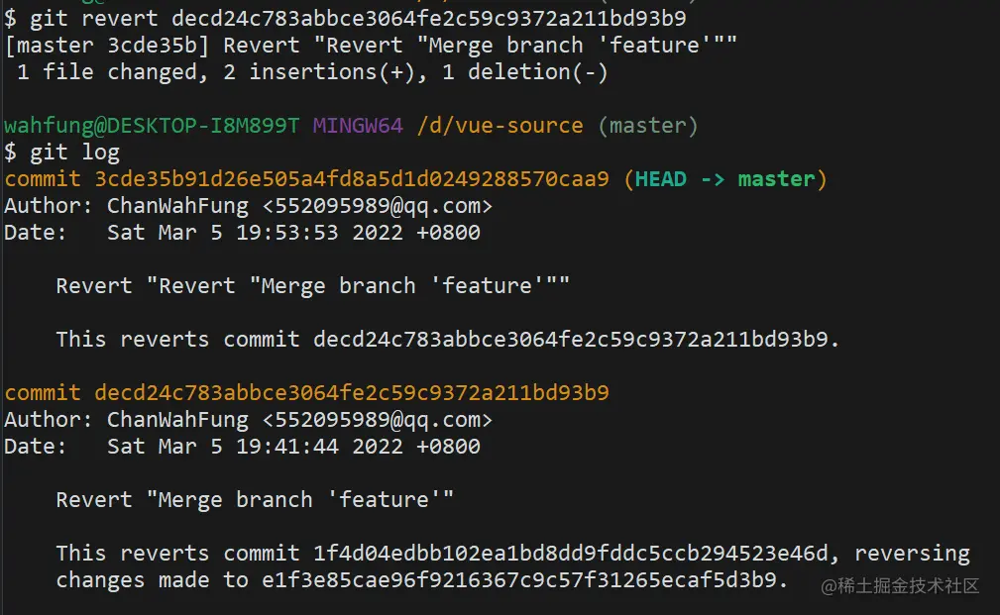

再次使用 revert，之前被 revert 的修改内容就又回来了。

## reflog

[官方文档](https://link.juejin.cn/?target=https%3A%2F%2Fgit-scm.com%2Fdocs%2Fgit-reflog)

### 描述

> 此命令管理重录中记录的信息。

如果说 `reset --soft` 是后悔药，那 reflog 就是强力后悔药。它记录了所有的 commit 操作记录，便于错误操作后找回记录。

### 应用场景

应用场景：某天你眼花，发现自己在其他人分支提交了代码还推到远程分支，这时因为分支只有你的最新提交，就想着使用 `reset --hard`，结果紧张不小心记错了 commitHash，reset 过头，把同事的 commit 搞没了。没办法，`reset --hard` 是强制回退的，找不到 commitHash 了，只能让同事从本地分支再推一次（同事瞬间拳头就硬了，怎么又是你）。于是，你的技术形象又一落千丈。

### 命令使用

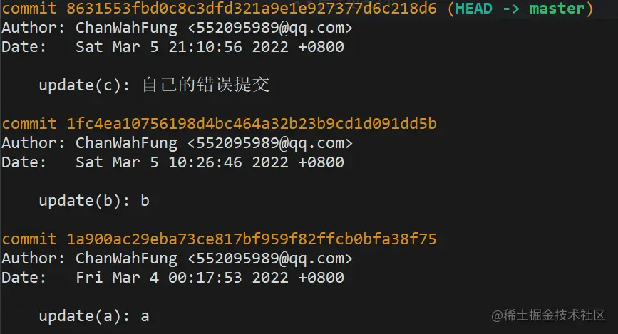

分支记录如上，想要 reset 到 b。

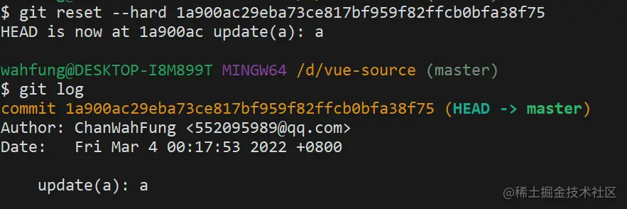

误操作 reset 过头，b 没了，最新的只剩下 a。

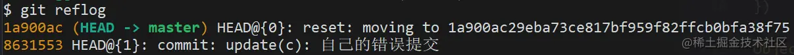

这时用 `git reflog` 查看历史记录，把错误提交的那次 commitHash 记下。

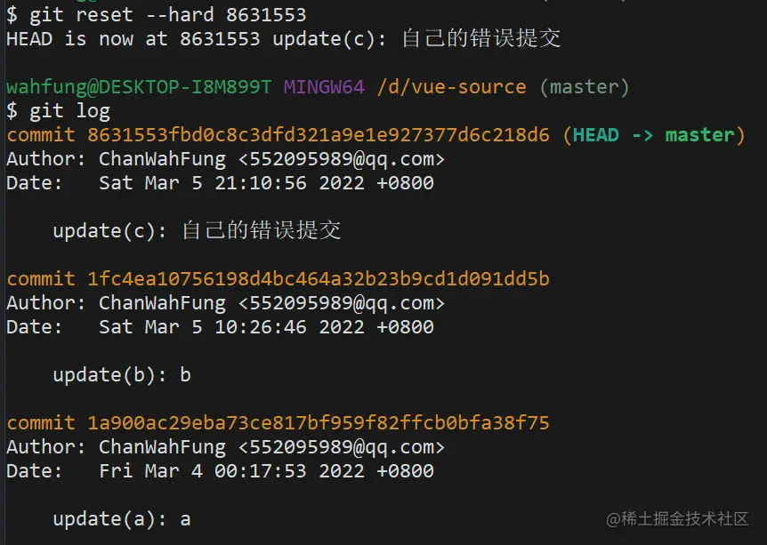

再次 reset 回去，就会发现 b 回来了。

## 设置 Git 短命令

对我这种喜欢敲命令而不用图形化工具的爱好者来说，设置短命令可以很好的提高效率。下面介绍两种设置短命令的方式。

**方式一**

```sh
git config --global alias.ps push
复制代码
```

**方式二**

打开全局配置文件

```sh
vim ~/.gitconfig
复制代码
```

写入内容

```
[alias] 
        co = checkout
        ps = push
        pl = pull
        mer = merge --no-ff
        cp = cherry-pick
复制代码
```

**使用**

```sh
# 等同于 git cherry-pick <commitHash>
git cp <commitHash>
复制代码
```

## 总结

本文主要分享了5个在开发中实用的 Git 命令和设置短命令的方式。

* `stash`：存储临时代码。
* `reset --soft`：软回溯，回退 commit 的同时保留修改内容。
* `cherry-pick`：复制 commit。
* `revert`：撤销 commit 的修改内容。
* `reflog`：记录了 commit 的历史操作。

文中列举的应用场景有部分不太恰当，只是想便于同学们理解，最重要的是要理解命令的作用是什么，活学活用才能发挥最大功效。

如果你也有一些实用的 Git 命令也欢迎在评论区分享~


# API


[project](https://gitlab.xinluex.com/help/api/projects.md)


总结：

```bash
客户端主机操作
1.echo "192.168.0.254 idocker.io" >> /etc/hosts
2.mkdir -p /etc/docker/certs.d/idocker.io
3.把192.168.0.254主机上的/etc/nginx/ssl/out/root.crt复制到客户端的/etc/docker/certs.d/idocker.io目录下
4.客户端使用：
(1) 登陆：docker login -u admin -p newnode7852 idocker.io
(2) 打标签：docker tag image:label idocker.io/image:label
(3) 推送：docker push idocker.io/image:label
(4) 拉取：docker pull idocker.io/image:label
```

# jsoniter用法

将

```go
import "encoding/json"
json.Marshal(&data)
```

替换为

```go
import jsoniter "github.com/json-iterator/go"

var json = jsoniter.ConfigCompatibleWithStandardLibrary
json.Marshal(&data)
```

将

```go
import "encoding/json"
json.Unmarshal(input, &data)
```

替换为

```go
import jsoniter "github.com/json-iterator/go"

var json = jsoniter.ConfigCompatibleWithStandardLibrary
json.Unmarshal(input, &data)
```

[更多用法点此查看](http://jsoniter.com/migrate-from-go-std.html)

## 参考文档：

* https://jsoniter.com/index.cn.html
* https://github.com/json-iterator/go
* http://jsoniter.com/migrate-from-go-std.html


# gitlab cache


# gitlab artifacts


# registry

### Configuring a [runner](https://docs.gitlab.com/ee/ci/docker/using_docker_images.html)

If you have many pipelines that access the same registry, you should set up registry access at the runner level. This allows pipeline authors to have access to a private registry just by running a job on the appropriate runner. It also helps simplify registry changes and credential rotations.

This means that any job on that runner can access the registry with the same privilege, even across projects. If you need to control access to the registry, you need to be sure to control access to the runner.

To add `DOCKER_AUTH_CONFIG` to a runner:

1. Modify the runner’s `config.toml` file as follows:

   ```
   [[runners]]
     environment = ["DOCKER_AUTH_CONFIG={\"auths\":{\"registry.example.com:5000\":{\"auth\":\"bXlfdXNlcm5hbWU6bXlfcGFzc3dvcmQ=\"}}}"]
   ```

   * The double quotes included in the `DOCKER_AUTH_CONFIG` data must be escaped with backslashes. This prevents them from being interpreted as TOML.
   * The `environment` option is a list. Your runner may have existing entries and you should add this to the list, not replace it.

2. Restart the runner service.


# linux [下记住密码的方法](https://support.huaweicloud.com/usermanual-codehub/devcloud_hlp_00073.html)


**store**模式：

将凭证用明文的形式存放在磁盘“home”目录下（默认是“~/.git-credentials”），永不过期，除非手动修改在Git服务器上的密码，否则永远不需要再次输入凭证信息。“git-credentials”文件内容如下：

https://username:password@***********.com

保存退出后，执行如下命令即可完成：

```
git config --global credential.helper store
```

