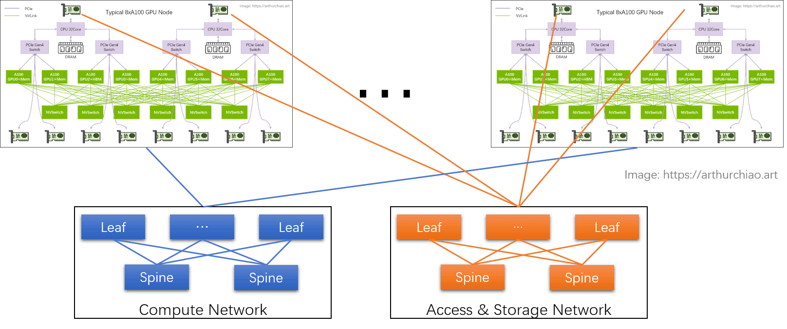
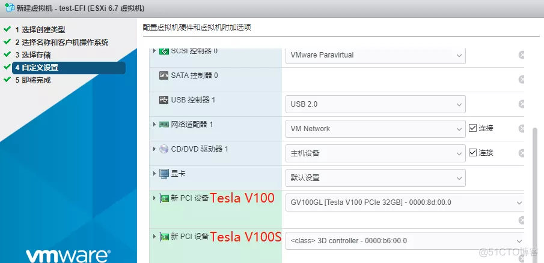
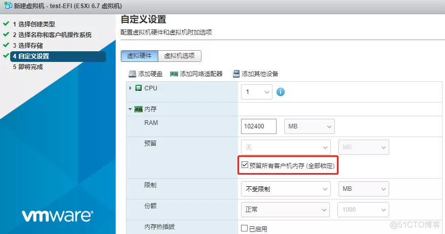

# gpu虚拟化调研

https://www.ctyun.cn/developer/article/387067895132229

## ibping

在启动Server端口时要指定 dev

```shell
ibping -S  -C mlx5_0
```

访问时也要


# 报错systemctl 止住

Failed to get properties: Transport endpoint is not connected

H800 530驱动版本不匹配,升级到535解决

# cenots7.9 装 gpu驱动

```sh
yum install -y kernel-devel
```


`ERROR: Unable to find the kernel source tree for the currently running kernel. Please make sure you have installed the kernel source files for your kernel and that they are properly configured; on Red Hat Linux systems, for example, be sure you have the 'kernel-source' or 'kernel-devel' RPM installed. If you know the correct kernel source files are installed, you may specify the kernel source path with the '--kernel-source-path' command line optiony`

```shell
yum install "kernel-devel-uname-r == $(uname -r)"
yum install gcc -y
```

然后重启

```
./NVIDIA-Linux-x86_64-525.60.13.run
```


# 国产GPU

https://www.eet-china.com/mp/a230168.html

# 第四范式vgpu开源

https://gitee.com/paradigm4/k8s-device-plugin

# 【大模型训练】RDMA高速网络与集合通讯

------

很少有人深入分析其中的一个关键技术：网络。这篇文章带大家认识一下大模型训练的高速网络。

原文发表在我的[个人网站](https://link.zhihu.com/?target=https%3A//lulaoshi.info/machine-learning/system/rdma-network.html)，不定期更新。

**RDMA**

**Remote Direct Memory Access (RDMA)** 是一种超高速的网络内存访问技术，它允许程序以极快速度访问远程计算节点的内存。速度快的原因如下图所示，一次网络访问，不需要经过操作系统的内核（Sockets、TCP/IP等），这些操作系统内核操作都会耗费CPU时间。RDMA直接越过了这些操作系统内核开销，直接访问到网卡（Network Interface Card，NIC）。一些地方又称之为HCA（Host Channel Adapter）。


RDMA的硬件主要有三种实现：InfiniBand、RoCE和iWARP。据我了解，InfiniBand和RoCE是目前比较主流的技术。

## **InfiniBand：无限带宽**

从名字可以看出，InfiniBand要达到无限带宽，名字听起来牛逼哄哄。实际上，也确实很牛逼。InfiniBand来自一家以色列公司：Mellanox，这家公司在2020年以69亿美元卖给了NVIDIA，被老黄收入旗下。


Mellanox

InfiniBand目前主流的技术是100G、200G。人家起了一些很极客的名字，Enhanced Data Rate（EDR，100G）High Data Rate (HDR，200G)。

绝大多数IT从业者可能很少接触到InfiniBand，因为这个技术很贵，大家舍不得买。但在各大高校和科研院所的超算中心，InfiniBand几乎标配，它支撑着非常关键的超级计算任务。有多贵呢？一条InfiniBand 10米网线，大概长下面这样，大概1w人民币；网线的两端要配网卡，两头的网卡一块6k人民币，2块就是1.2w，那一根网线加上两端的网卡就是2w块钱。


InfiniBand软线

下图是1G以太网线与InfiniBand交换机对比图，上面是1G以太网线，下面是HDR交换机。


以太网与InfiniBand

这还没结束，InfiniBand的组网成本也极高。InfiniBand组网跟普通的交换机还不太一样，如果希望这个网络中任何两个计算节点的网卡之间互相无损地通信，需要使用一种叫做胖树（Fat Tree）的网络拓扑，大概是如下一种拓扑结构，方块是交换机，椭圆是计算节点。胖树主要有两层，上面一层是核心层，不连任何计算节点，它的功能就是转发流量；下面一层是接入层，接入各类计算节点。胖树拓扑成本高的主要原因是：某一个汇聚交换机上，假如有36个口，那如果为了达到无损速率，一半的口，也就是18个口可以给计算节点连，剩下一半要连到上层的核心交换机上。要知道，任何一根线，就是1万多块钱呢，如果达到无损，就要冗余地做这些连接。


胖树拓扑

说了这么多成本，再来说性能。贵的就是好的；好的就是贵的。InfiniBand确实能够达到极高的带宽和极低的延迟。据维基百科，InfiniBand对比以太网，延迟分别是100纳秒和230纳秒。包括微软、NVIDIA、以及美国国家实验室等世界上主流的超级计算机，都是用的InfiniBand。

## **RoCE**

相比InfiniBand这种爱马仕，RoCE是另外一种稍微便宜一点的选项，但也便宜不到哪儿去。**RDMA over Converged Ethernet** (**RoCE**)，主要在以太网上提供RDMA。近些年来发展很快，因为InfiniBand太贵了，大家需要一个替代品。

目前来说，华为在力推RoCE，但如果也要做无损网络，整个网络成本也很难控制在InfiniBand的50%以下。

## **GPUDirect RDMA**

训练大模型，节点间通信成本很高，InfiniBand与GPU的组合可以提供跨节点的 GPUDirect RDMA，就是说两个节点的GPU通信不需要经过内存和CPU，而是直接由InfiniBand网卡通信。GPUDirect RDMA对于大模型训练尤其重要，因为模型都在GPU上，模型拷贝到CPU上就已经耗费了大量时间，再通过CPU发送至其他节点就更慢了。


GPUDirect RDMA

## **驱动**

如何让硬件工作，以释放NVIDIA GPU和InfiniBand网卡的性能？其实很简单，只需要安装NVIDIA推荐的最新的驱动即可，在NVIDIA最新的驱动中，有一个名为 `nv_peer_mem` 的模块，加载之后即可以开启GPUDirect RDMA。上层的应用，比如PyTorch或者TensorFlow，几乎不用改代码，就可以充分利用多张GPU卡和InfiniBand网卡带来的性能提升。

## **MPI&NCCL**

前面聊完了硬件，再聊聊软件。在这些高速网络上编程，有几个常用的方案，最通用的可能是MPI（Message Passing Interface），然后就是深度学习训练所需要的NCCL（NVIDIA Collective Communication Library）。

MPI是经典的并行计算接口，主要有OpenMPI和Intel MPI几个实现，可以达到节点间通信的需求。一般情况下，在计算节点上安装了InfiniBand驱动，安装了OpenMPI/Intel MPI之后，一些高性能的计算流量会走InfiniBand网络。

NCCL是16年左右开始的一个项目，已经有了MPI，NVIDIA还要造一个轮子，因为MPI是一个通用的框架，并不是专门做深度学习的。NCCL试图解决深度学习训练中特有的通讯问题。

NCCL主要实现了以下几个通信原语：

- AllReduce
- Broadcast
- Reduce
- AllGather
- ReduceScatter

说白了，就是提供了一个接口，用户不需要知道哪些节点的如何相互之间通信，只需要调用接口，就可以实现GPU之间的通信。

NCCL的接口比较底层，大多数搞深度学习上层应用的人不需要太深入了解，它主要给深度学习框架来用，深度学习框架PyTorch、MindSpore等等都是调用NCCL来进行GPU上的集合通讯的。

下面是一个最经典的 DataParallel 模式，NCCL提供Allreduce原语，把不同GPU上的梯度同步一下。


DataParallel Allreduce

下面是微软 **[DeepSpeed Infinity](https://link.zhihu.com/?target=https%3A//www.microsoft.com/en-us/research/blog/zero-infinity-and-deepspeed-unlocking-unprecedented-model-scale-for-deep-learning-training/)** 的架构，核心的网络在 InfiniBand 上，训练在GPU上，部分参数转移到 CPU 和 NVMe上。


DeepSpeed Infinity

我们可以了解一下NCCL的原理。NCCL主要做几件事：探测计算节点的网络设备和拓扑结构，使用算法自动调优选择一个最优的通信方式。


NCCL主要工作

为什么要做拓扑探测？因为每个计算节点的设备情况差异比较大，每个计算节点可能有自己特定的网卡NIC，可能是InfiniBand也可能是RoCE，每个计算节点上的GPU可能是NVLink，也可能是PCI-E。为了达到最优的传输效率，NCCL先要摸清当前计算节点的网络、CPU和GPU情况。之后使用调优工具，进行调优，从众多通信方式中选择一个最优方式。

下面这张图是1台计算节点搭载了8个GPU和8张网卡，某种通信路径的演示图。


单节点通信路径

下面是3台计算节点的通信示意图。


3节点通信路径

## **大模型网卡配置**

如果要做大模型，最佳的方案是一张GPU卡配一个InfiniBand网卡，NVIDIA的DGX系统就是这么搭配的。那么一个计算节点上通常可能有9个InfiniBand网卡，其中1个给存储系统（比如Lustre），另外8个分别给8个GPU卡。这样的成本极高。预算有限的话，最好也要1 + 4。一般情况下，GPU和InfiniBand都是连在PCI-E Switch上，2个GPU会连在1个PCI-E Switch上。最理想情况是给每个GPU分配1个InfiniBand网卡，这样无疑是最优的。如果给2个GPU配1个InfiniBand网卡，2个GPU共享PCI-E Switch和InfiniBand网卡，两个GPU之间会争抢这1个InfiniBand网卡。如果InfiniBand网卡数量越少，GPU之间的争抢越明显，节点间的通信效率就越低。


浪潮5688M6设计图

下面这张图里可以看到，如果只配置1张100Gbps的网卡，带宽是12GB/s，将bit转换为byte，即 100 \div 8 \ \approx 12。随着网卡数量的增多，带宽也近乎线性地增长。8张H100搭配8张400G的InfiniBand NDR，这速度也是没谁了。


带宽对比


每个GPU配一个网卡是最理想的情况

## **大模型网络拓扑：导轨优化**

如果想做大模型，还需要配置专用的胖树网络拓扑，这种胖树网络拓扑和普通的HPC胖树还不太一样，NVIDIA起名为Rails（导轨优化），具体来说，像下面两张图。


低配置胖树导轨优化

这张图是一个低配版本的胖树和导轨优化拓扑：共配置了2台交换机，QM8700是HDR交换机，两个HDR交换机通过4根HDR线缆相连以保证互联速率；每台DGX GPU节点共9张IB卡（图中的HCA），其中1张给存储（Storage Target），剩下8张给大模型训练。这8张IB卡中的HCA1/3/5/7连到第一个交换机，HCA2/4/6/8连到第二个交换机。


高配置胖树导轨优化

这张图是一张无阻塞全速导轨优化：每台DGX GPU节点共配置8张IB卡，每张卡上连1台交换机，这些交换机被称为叶子（Leaf）交换机，共需8个叶子交换机；确切地说HCA1连第一个叶子交换机，HCA2连第二个叶子交换机，以此类推。叶子交换机之间的通信通过骨干（Spine）交换机来保障速率。

这样做的目的就是为了避免降速，任何一张IB卡都可以和整个网络中其他IB卡高速通信，也就是说，任何一个GPU都可以以极快地速度与其他GPU高速通信。

下面这张图是我们实际部署的一个6台交换机组成的全速网络，密密麻麻的线非常恐怖：


人大数据中心 InfiniBand HDR 大模型网络实拍图

它背后的拓扑是下面这个样子，2个绿色的是 Spine 交换机，4个蓝色的是 Leaf 交换机，蓝色和绿色之间共80根线，蓝色下面接计算节点。


2 Spine + 4 Leaf组成的网络拓扑

## **SHARP：网络优化**

搭建好一个全速网络后，还有一些网络路由方面的优化，比如： Scalable Hierarchical Aggregation and Reduction Protocol (SHARP)。SHARP 是 NVIDIA InfiniBand 网络技术栈中负责进一步优化网络。它提供的一个最核心的功能是：将必须经过 CPU 收发的网络包 offload 到 InfiniBand 交换机上，进一步减少计算节点负载。这样计算节点更专注于计算，而非网络包的收发和处理，同时能减少网络上不必要的流量。

当然，SHARP 也包含在 NVIDIA 提供的驱动中，一个脚本即可开启。

## **Benchmark**

如果想测试你的系统的集合通讯的性能，可以使用**[nccl-tests](https://link.zhihu.com/?target=https%3A//github.com/NVIDIA/nccl-tests)**这个库，这个库需要依赖CUDA、MPI和NCCL编译，并使用 `mpirun` 进行多机通信测试。一张HDR（200Gbps）网卡的理论峰值是 24GB/s ，一般情况下，增加 InfiniBand 网卡，就可以获得更高的多机通讯性能。

下面是我们2节点的`allreduce`实测峰值，网络拓扑为低配版本，GPU为8卡NVLink a800。

|                              | 性能实测 |
| ---------------------------- | -------- |
| 1卡                          | 16GB/s   |
| 4卡                          | 30GB/s   |
| 4卡 + GPUDirect RDMA         | 80GB/s   |
| 4卡 + GPUDirect RDMA + SHARP | 92GB/s   |

参考资料：

**[GTC 2023: Scaling Deep Learning Training: Fast Inter-GPU Communication with NCCL](https://link.zhihu.com/?target=https%3A//www.nvidia.com/en-us/on-demand/session/gtcspring23-s51111/)**

**[GTC 2020: Distributed Training and Fast Inter-GPU communication with NCCL](https://link.zhihu.com/?target=https%3A//developer.nvidia.com/gtc/2020/video/s21107https%3A//developer.nvidia.com/gtc/2020/video/s21107)**

# GPU 进阶笔记（一）：高性能 GPU 服务器硬件拓扑与集群组网（2023）

18 min read

------

Published at 2023-09-16 | Last Update 2023-09-16

记录一些平时接触到的 GPU 知识。由于是笔记而非教程，因此内容不会追求连贯，有基础的同学可作查漏补缺之用。


水平有限，文中不免有错误之处，请酌情参考。

------

## 1 术语与基础

大模型训练一般都是用单机 8 卡 GPU 主机组成集群，机型包括 `8*{A100,A800,H100,H800}` 可能还会用最近即将上市的 `{4,8}*L40S` 等。 下面一台典型 8*A100 GPU 的主机内硬件拓扑：


典型 8 卡 A100 主机硬件拓扑

本节将基于这张图来介绍一些概念和术语，有基础的可直接跳过。

## 1.1 PCIe 交换芯片

CPU、内存、存储（NVME）、GPU、网卡等**支持 PICe 的设备**，都可以连接到 PCIe 总线或专门的 PCIe 交换芯片，实现互联互通。

PCIe 目前有 5 代产品，最新的是 **`Gen5`**。

## 1.2 `NVLink`

### 定义

Wikipedia 上 [NVLink](https://en.wikipedia.org/wiki/NVLink) 上的定义：

> NVLink is a wire-based serial multi-lane near-range communications link developed by Nvidia. Unlike PCI Express, a device can consist of multiple NVLinks, and devices use mesh networking to communicate instead of a central hub. The protocol was first announced in March 2014 and uses a proprietary high-speed signaling interconnect (NVHS).

简单总结：同主机内不同 GPU 之间的一种高速互联方式，

1. 是一种短距离**通信链路**，保证包的成功传输，更高性能，替代 PCIe，
2. 支持多 lane，link 带宽随 lane 数量线性增长，
3. 同一台 node 内的 GPU 通过 NVLink 以 **full-mesh** 方式（类似 spine-leaf）互联，
4. NVIDIA 专利技术。

### 演进：1/2/3/4 代

主要区别是单条 NVLink 链路的 **lane 数量**、每个 **lane 的带宽**（图中给的都是双向带宽）等：


NVLink 演进。Image from: HotChips 2022 [1]

例如，

- A100 是 **`12 lane \* 50GB/s/lane = 600GB/s`** 双向带宽（单向 300GB/s）
- A800 被阉割了 4 条 lane，所以是 **`8 lane \* 50GB/s/lane = 400GB/s`** 双向带宽（单向 200GB/s）

### 监控

基于 DCGM 可以采集到实时 NVLink 带宽：


Metrics from dcgm-exporter [5]

## 1.3 `NVSwitch`

还是参考下图，


典型 8 卡 A100 主机硬件拓扑

NVSwitch 是 NVIDIA 的一款**交换芯片**，封装在 GPU module 上，并**不是主机外的独立交换机**。

下面是真机图，浪潮的机器，图中 8 个盒子就是 8 片 A100，右边的 6 块超厚散热片下面就是 NVSwitch 芯片：


Inspur NF5488A5 NVIDIA HGX A100 8 GPU Assembly Side View. Image source: [2]

## 1.4 NVLink Switch

**`NVSwitch`** 听名字像是交换机，但实际上是 GPU module 上的交换芯片，用来**连接同一台主机内的 GPU**。

2022 年，NVIDIA 把这块芯片拿出来真的做成了交换机，叫 **`NVLink Switch`** [3]， 用来**跨主机连接 GPU 设备**。

这俩名字很容易让人混淆。

## 1.5 HBM (High Bandwidth Memory)

### 由来

传统上，GPU 显存和普通内存（DDR）一样插在主板上，通过 PCIe 连接到处理器（CPU、GPU）， 因此速度瓶颈在 PCIe，Gen4 是 64GB/s，Gen5 是 128GB/s。

因此，一些 GPU 厂商（不是只有 NVIDIA 一家这么做）将**将多个 DDR 芯片堆叠之后与 GPU 封装到一起** （后文讲到 H100 时有图），这样每片 GPU 和它自己的显存交互时，就不用再去 PCIe 交换芯片绕一圈，速度最高可以提升一个量级。 这种**“高带宽内存”**（High Bandwidth Memory）缩写就是 HBM。

HBM 的市场目前被 SK 海力士和三星等韩国公司垄断。

### 演进：HBM 1/2/2e/3/3e

From wikipedia [HBM](https://en.wikipedia.org/wiki/High_Bandwidth_Memory)，

|       | Bandwidth       | Year | GPU            |
| ----- | --------------- | ---- | -------------- |
| HBM   | 128GB/s/package |      |                |
| HBM2  | 256GB/s/package | 2016 | V100           |
| HBM2e | ~450GB/s        | 2018 | A100, ~2TB/s,  |
| HBM3  | 600GB/s/site    | 2020 | H100, 3.35TB/s |
| HBM3e | ~1TB/s          | 2023 |                |


使用了 HBM 的近几代高端 NVIDIA GPU 显存带宽（双向），纵坐标是 TB/s。Image source: [3]

- AMD MI300X 采用 192GB HBM3 方案，带宽 **`5.2TB/s`**；
- HBM3e 是 HBM3 的增强版，速度从 6.4GT/s 到 8GT/s。预计 2024 量产。

## 1.6 带宽单位

大规模 GPU 训练的性能与数据传输速度有直接关系。这里面涉及到很多链路，比如 PCIe 带宽、内存带宽、NVLink 带宽、HBM 带宽、网络带宽等等。

- 网络习惯用 **`bits/second (b/s)`** 表示之外，并且一般说的都是**单向**（TX/RX）；
- 其他模块带宽基本用 `byte/sedond (B/s)` 或 `transactions/second (T/s)` 表示，并且一般都是**双向总带宽**。

比较带宽时注意区分和转换。

## 2 典型 `8*A100/8*A800` 主机

## 2.1 主机内拓扑：`2-2-4-6-8-8`

- 2 片 CPU（及两边的内存，NUMA）
- 2 张**存储网卡**（**访问分布式存储**，带内管理等）
- 4 个 PCIe Gen4 Switch 芯片
- 6 个 NVSwitch 芯片
- 8 个 GPU
- 8 个 **GPU 专属网卡**


典型 8 卡 A100 主机硬件拓扑

下面这个图画的更专业，需要更多细节的可参考：


NVIDIA DGX A100 主机（官方 8 卡机器）硬件拓扑。Image source: [4]

### 存储网卡

通过 PCIe **直连 CPU**。用途：

1. 从分布式存储读写数据，例如**读训练数据**、**写 checkpoint** 等；
2. 正常的 node 管理，ssh，监控采集等等。

官方推荐用 BF3 DPU。但其实只要带宽达标，用什么都行。组网经济点的话用 RoCE，追求最好的性能用 IB。

### NVSwitch fabric：intra-node full-mesh

8 个 GPU 通过 6 个 NVSwitch 芯片 full-mesh 连接，这个 full-mesh 也叫 **`NVSwitch fabric`**； full-mesh 里面的**每根线的带宽是 n \* bw-per-nvlink-lane**，

- A100 用的 NVLink3，**`50GB/s/lane`**，所以 full-mesh 里的每条线就是 **`12*50GB/s=600GB/s`**，注意这个是双向带宽，单向只有 300GB/s。
- A800 是阉割版，**12 lane 变成 8 lane**，所以每条线 8*50GB/s=400GB/s，单向 200GB/s。

### 用 `nvidia-smi topo` 查看拓扑

下面是一台 8*A800 机器上 **`nvidia-smi`** 显示的实际拓扑（网卡两两做了 bond，NIC 0~3 都是 bond）：


- GPU 之间（左上角区域）：都是 **`NV8`**，表示 **8 条 NVLink** 连接；
- NIC 之间：
  - 在同一片 CPU 上：**`NODE`**，表示**不需要跨 NUMA，但需要跨 PCIe 交换芯片**；
  - 不在同一片 CPU 上：**`SYS`**，表示**需要跨 NUMA**；
- GPU 和 NIC 之间：
  - 在同一片 CPU 上，且在同一个 PCIe Switch 芯片下面：**`NODE`**，表示**只需要跨 PCIe 交换芯片**；
  - 在同一片 CPU 上，且不在同一个 PCIe Switch 芯片下面：**`NODE`**，表示**需要跨 PCIe 交换芯片和 PCIe Host Bridge**；
  - 不在同一片 CPU 上：**`SYS`**，表示**需要跨 NUMA、PCIe 交换芯片，距离最远**；

## 1.2 GPU 训练集群组网：IDC GPU fabirc

GPU node 互联架构：



### 计算网络

GPU 网卡直连到置顶交换机（leaf），leaf 通过 full-mesh 连接到 spine，形成跨主机 GPU 计算网络。

- 这个网络的目的是 GPU 与其他 node 的 GPU **交换数据**；
- 每个 GPU 和自己的网卡之间通过 **PCIe 交换芯片连接**：`GPU <--> PCIe Switch <--> NIC`。

### 存储网络

直连 CPU 的两张网卡，连接到另一张网络里，主要作用是读写数据，以及 SSH 管理等等。

### RoCE vs. InfiniBand

不管是计算网络还是存储网络，都需要 RDMA 才能实现 AI 所需的高性能。RDMA 目前有两种选择：

- RoCEv2：公有云卖的 8 卡 GPU 主机基本都是这种网络，比如 CX6 **`8\*100Gbps`** 配置；在性能达标的前提下，（相对）便宜；
- InfiniBand (IB)：同等网卡带宽下，性能比 RoCEv2 好 20% 以上，但是价格贵一倍。

## 1.3 数据链路带宽瓶颈分析


单机 8 卡 A100 GPU 主机带宽瓶颈分析

几个关键链路带宽都标在图上了，

1. 同主机 GPU 之间：走 NVLink，双向 600GB/s，单向 **`300GB/s`**；

2. 同主机 GPU 和自己的网卡之间：走 PICe Gen4 Switch 芯片，双向 64GB/s，单向 **`32GB/s`**；

3. 跨主机 GPU 之间：需要通过网卡收发数据，这个就看网卡带宽了，目前国内 A100/A800 机型配套的主流带宽是（单向） **`100Gbps=12.5GB/s`**。 所以跨机通信相比主机内通信性能要下降很多。

   - `200Gbps==25GB/s`：已经**接近** PCIe Gen4 的单向带宽；
   - `400Gbps==50GB/s`：已经**超过** PCIe Gen4 的单向带宽。

   所以在这种机型里用 400Gbps 网卡作用不大，400Gbps 需要 PCIe Gen5 性能才能发挥出来。

## 3 典型 `8*H100/8*H800` 主机

GPU Board Form Factor 分为两种类型：

- PCIe Gen5
- SXM5：性能更高一些

## 3.1 H100 芯片 layout

下面是一片 H100 GPU 芯片的内部结构：


单片 H100 GPU 内部逻辑布局。Image source: [3]

- **`4nm`** 工艺；
- 最下面一排是 18 根 Gen4 NVLink；双向总带宽 **`18 lanes \* 25GB/s/lane = 900GB/s`**；
- 中间蓝色的是 L2 cache；
- 左右两侧是 **`HBM`** 芯片，即显存；

## 3.2 主机内硬件拓扑

跟 A100 8 卡机结构大致类似，区别：

1. NVSwitch 芯片从 6 个减少到了 4 个；真机图如下，

   

2. 与 CPU 的互联从 PCIe Gen4 x16 升级到 **`PCIe Gen5 x16`**，双向带宽 **`128GB/s`**；

## 3.3 组网

与 A100 也类似，只是标配改成了 **`400Gbps`** 的 CX7 网卡， 否则网络带宽与 PCIe Switch 和 NVLink/NVSwitch 之间的差距更大了。

## 4 典型 `4*L40S/8*L40S` 主机

L40S 是今年（2023）即将上市的新一代“性价比款”多功能 GPU，**对标 A100**。 除了不适合训练基座大模型之外（后面会看到为什么），官方的宣传里它几乎什么都能干。 价格的话，目前第三方服务器厂商给到的口头报价都是 **A100 的 8 折左右**。

## 4.1 L40S vs A100 配置及特点对比

L40S 最大的特点之一是 **time-to-market 时间短**，也就是从订货到拿到货周期比 A100/A800/H800 快很多。 这里面技术和非技术原因都有，比如：

- 不存在被美国制裁的功能，比如 **FP64 和 NVLink 都干掉了**；
- 使用 **`GDDR6`** 显存，不依赖 HBM 产能（及先进封装）；

价格便宜也有几方面原因，后面会详细介绍：

1. 大头可能来自 GPU 本身价格降低：因为去掉了一些模块和功能，或者用便宜的产品替代；
2. 整机成本也有节省：例如去掉了一层 PCIe Gen4 Swtich；不过相比于 4x/8x GPU，整机的其他部分都可以说送的了；

## 4.2 L40S 与 A100 性能对比

下面是一个官方标称性能对比：


具体场景的性能对比网上也有很多官方资料，这里就不列举了。简单来，

- 性能 1.2x ~ 2x（看具体场景）。
- 功耗：两台 L40S 和单台 A100 差不多

需要注意，**L40S 主机官方推荐的是单机 4 卡而不是 8 卡**（后面会介绍为什么）， 所以对比一般是用 `两台 4*L40S` vs `单台 8*A100`。另外，很多场景的性能提升有个 **大前提**：网络需要是 200Gbps RoCE 或 IB 网络，接下来介绍为什么。

## 4.3 L40S 攒机

### 推荐架构：`2-2-4`

相比于 A100 的 **`2-2-4-6-8-8`** 架构， 官方推荐的 L40S GPU 主机是 2-2-4 架构，一台机器物理拓扑如下：


推荐单机 4 卡 L40S GPU 主机拓扑

最明显的变化是**去掉了 CPU 和 GPU 之间的 PCIe Switch 芯片**， 网卡和 GPU 都是直连 CPU 上自带的 PCIe Gen4 x16（64GB/s），

- 2 片 CPU（NUMA）
- 2 张双口 CX7 网卡（每张网卡 **`2\*200Gbps`**）
- 4 片 L40S GPU
- 另外，存储网卡只配 1 张（双口），直连在任意一片 CPU 上

这样**每片 GPU 平均 200Gbps 网络带宽**。

### 不推荐架构：`2-2-8`


单机 8 卡 L40S GPU 主机拓扑，来自 NVIDIA L40S 官方推介材料

如图，跟单机 4 卡相比，单机 8 卡需要引入两片 PCIe Gen5 Switch 芯片：

- 说是现在**PCIe Gen5 Switch 单片价格 1w 刀**（不知真假），一台机器需要 2 片；价格不划算；
- PCIe switch 只有一家在生产，产能受限，周期很长；
- 平摊到每片 GPU 的网络带宽减半；

## 4.4 组网

官方建议 4 卡机型，搭配 200Gbps RoCE/IB 组网。

## 4.5 数据链路带宽瓶颈分析


单机 4 卡 L40S GPU 主机带宽瓶颈分析

以同 CPU 下面的两种 L40S 为例，这里面有两条链路可选：

1. 直接通过 CPU 处理：`GPU0 <--PCIe--> CPU <--PCIe--> GPU1`
   - PCIe Gen4 x16 双向 64GB/s，单向 **`32GB/s`**；
   - **CPU 处理瓶颈？TODO**
2. 完全绕过 CPU 处理，**通过网卡去外面绕一圈再回来**：`GPU0 <--PCIe--> NIC <-- RoCe/IB Switch --> NIC <--PCIe--> GPU1`
   - PCIe Gen4 x16 双向 64GB/s，单向 **`32GB/s`**；
   - 平均每个 GPU 一个单向 200Gbps 网口，单向折算 **`25GB/s`**；
   - **需要 NCCL 支持**，官方说新版本 NCCL 正在针对 L40S 适配，默认行为就是去外面绕一圈回来；

第二种方式看着长了很多，但官方说其实比方式一还要快很多（这里还每太搞懂，CPU 那里是怎么处理的？）—— **前提是网卡和交换机配到位**：200Gbps RoCE/IB 网络。在这种网络架构下（网络带宽充足），

- **任何两片 GPU 的通信带宽和延迟都是一样的**，是否在一台机器内或一片 CPU 下面并不重要，集群可以**横向扩展**（scaling up，compared with scaling in）；
- GPU 机器成本降低；但其实对于那些对网络带宽要求没那么高的业务来说，是**把 NVLINK 的成本转嫁给了网络**，这时候必须要组建 200Gbps 网络，否则发挥不出 L40S 多卡训练的性能。

如果是方式二，同主机内 GPU 卡间的带宽瓶颈在网卡速度。即使网络是推荐的 2*CX7 配置，

- L40S： 200Gbps（网卡单向线速）
- A100： 300GB/s（NVLINK3 单向） == **`12x`**200Gbps
- A800： 200GB/s（NVLINK3 单向） == **`8x`**200Gbps

可以看到，**L40S 卡间带宽还是比 A100 NVLINK 慢了 12 倍**， 比 A800 NVLink 慢了 8 倍，所以**不适合数据密集交互的基础大模型训练**。

## 4.6 测试注意事项

如上，即便只测试单机 4 卡 L40S 机器，也需要搭配 200Gbps 交换机，否则卡间性能发挥不出来。

## 参考资料

1. [NVLink-Network Switch - NVIDIA’s Switch Chip for High Communication-Bandwidth SuperPODs](https://hc34.hotchips.org/), Hot Chips 2022
2. [ChatGPT Hardware a Look at 8x NVIDIA A100 Powering the Tool](https://www.servethehome.com/chatgpt-hardware-a-look-at-8x-nvidia-a100-systems-powering-the-tool-openai-microsoft-azure-supermicro-inspur-asus-dell-gigabyte/), 2023
3. [NVIDIA Hopper Architecture In-Depth](https://developer.nvidia.com/blog/nvidia-hopper-architecture-in-depth/), nvidia.com, 2022
4. [DGX A100 review: Throughput and Hardware Summary](https://www.microway.com/hpc-tech-tips/dgx-a100-review-throughput-and-hardware-summary/), 2020
5. [Understanding NVIDIA GPU Performance: Utilization vs. Saturation](http://arthurchiao.art/blog/understanding-gpu-performance/), 2023


# [ARTHURCHIAO'S BLOG](https://arthurchiao.github.io/)

[Home](http://arthurchiao.art/index.html) [Articles (EN)](http://arthurchiao.art/articles) [Articles (中文)](http://arthurchiao.art/articles-zh) [Categories](http://arthurchiao.art/categories) [About](http://arthurchiao.art/about) [Donate](http://arthurchiao.art/donate)

# GPU 进阶笔记（一）：高性能 GPU 服务器硬件拓扑与集群组网（2023）

Published at 2023-09-16 | Last Update 2023-09-16

记录一些平时接触到的 GPU 知识。由于是笔记而非教程，因此内容不会追求连贯，有基础的同学可作查漏补缺之用。


水平有限，文中不免有错误之处，请酌情参考。

------

- 1 术语与基础
  - [1.1 PCIe 交换芯片](http://arthurchiao.art/blog/gpu-advanced-notes-1-zh/#11-pcie-交换芯片)
  - 1.2 `NVLink`
    - [定义](http://arthurchiao.art/blog/gpu-advanced-notes-1-zh/#定义)
    - [演进：1/2/3/4 代](http://arthurchiao.art/blog/gpu-advanced-notes-1-zh/#演进1234-代)
    - [监控](http://arthurchiao.art/blog/gpu-advanced-notes-1-zh/#监控)
  - [1.3 `NVSwitch`](http://arthurchiao.art/blog/gpu-advanced-notes-1-zh/#13-nvswitch)
  - [1.4 NVLink Switch](http://arthurchiao.art/blog/gpu-advanced-notes-1-zh/#14-nvlink-switch)
  - 1.5 HBM (High Bandwidth Memory)
    - [由来](http://arthurchiao.art/blog/gpu-advanced-notes-1-zh/#由来)
    - [演进：HBM 1/2/2e/3/3e](http://arthurchiao.art/blog/gpu-advanced-notes-1-zh/#演进hbm-122e33e)
  - [1.6 带宽单位](http://arthurchiao.art/blog/gpu-advanced-notes-1-zh/#16-带宽单位)
- 2 典型 `8*A100/8*A800` 主机
  - 2.1 主机内拓扑：`2-2-4-6-8-8`
    - [存储网卡](http://arthurchiao.art/blog/gpu-advanced-notes-1-zh/#存储网卡)
    - [NVSwitch fabric：intra-node full-mesh](http://arthurchiao.art/blog/gpu-advanced-notes-1-zh/#nvswitch-fabricintra-node-full-mesh)
    - [用 `nvidia-smi topo` 查看拓扑](http://arthurchiao.art/blog/gpu-advanced-notes-1-zh/#用-nvidia-smi-topo-查看拓扑)
  - 1.2 GPU 训练集群组网：IDC GPU fabirc
    - [计算网络](http://arthurchiao.art/blog/gpu-advanced-notes-1-zh/#计算网络)
    - [存储网络](http://arthurchiao.art/blog/gpu-advanced-notes-1-zh/#存储网络)
    - [RoCE vs. InfiniBand](http://arthurchiao.art/blog/gpu-advanced-notes-1-zh/#roce-vs-infiniband)
  - [1.3 数据链路带宽瓶颈分析](http://arthurchiao.art/blog/gpu-advanced-notes-1-zh/#13-数据链路带宽瓶颈分析)
- 3 典型 `8*H100/8*H800` 主机
  - [3.1 H100 芯片 layout](http://arthurchiao.art/blog/gpu-advanced-notes-1-zh/#31-h100-芯片-layout)
  - [3.2 主机内硬件拓扑](http://arthurchiao.art/blog/gpu-advanced-notes-1-zh/#32-主机内硬件拓扑)
  - [3.3 组网](http://arthurchiao.art/blog/gpu-advanced-notes-1-zh/#33-组网)
- 4 典型 `4*L40S/8*L40S` 主机
  - [4.1 L40S vs A100 配置及特点对比](http://arthurchiao.art/blog/gpu-advanced-notes-1-zh/#41-l40s-vs-a100-配置及特点对比)
  - [4.2 L40S 与 A100 性能对比](http://arthurchiao.art/blog/gpu-advanced-notes-1-zh/#42-l40s-与-a100-性能对比)
  - 4.3 L40S 攒机
    - [推荐架构：`2-2-4`](http://arthurchiao.art/blog/gpu-advanced-notes-1-zh/#推荐架构2-2-4)
    - [不推荐架构：`2-2-8`](http://arthurchiao.art/blog/gpu-advanced-notes-1-zh/#不推荐架构2-2-8)
  - [4.4 组网](http://arthurchiao.art/blog/gpu-advanced-notes-1-zh/#44-组网)
  - [4.5 数据链路带宽瓶颈分析](http://arthurchiao.art/blog/gpu-advanced-notes-1-zh/#45-数据链路带宽瓶颈分析)
  - [4.6 测试注意事项](http://arthurchiao.art/blog/gpu-advanced-notes-1-zh/#46-测试注意事项)
- [参考资料](http://arthurchiao.art/blog/gpu-advanced-notes-1-zh/#参考资料)

------

# 1 术语与基础

大模型训练一般都是用单机 8 卡 GPU 主机组成集群，机型包括 `8*{A100,A800,H100,H800}` 可能还会用最近即将上市的 `{4,8}*L40S` 等。 下面一台典型 8*A100 GPU 的主机内硬件拓扑：


典型 8 卡 A100 主机硬件拓扑

本节将基于这张图来介绍一些概念和术语，有基础的可直接跳过。

## 1.1 PCIe 交换芯片

CPU、内存、存储（NVME）、GPU、网卡等**支持 PICe 的设备**，都可以连接到 PCIe 总线或专门的 PCIe 交换芯片，实现互联互通。

PCIe 目前有 5 代产品，最新的是 **`Gen5`**。

## 1.2 `NVLink`

### 定义

Wikipedia 上 [NVLink](https://en.wikipedia.org/wiki/NVLink) 上的定义：

> NVLink is a wire-based serial multi-lane near-range communications link developed by Nvidia. Unlike PCI Express, a device can consist of multiple NVLinks, and devices use mesh networking to communicate instead of a central hub. The protocol was first announced in March 2014 and uses a proprietary high-speed signaling interconnect (NVHS).

简单总结：同主机内不同 GPU 之间的一种高速互联方式，

1. 是一种短距离**通信链路**，保证包的成功传输，更高性能，替代 PCIe，
2. 支持多 lane，link 带宽随 lane 数量线性增长，
3. 同一台 node 内的 GPU 通过 NVLink 以 **full-mesh** 方式（类似 spine-leaf）互联，
4. NVIDIA 专利技术。

### 演进：1/2/3/4 代

主要区别是单条 NVLink 链路的 **lane 数量**、每个 **lane 的带宽**（图中给的都是双向带宽）等：


NVLink 演进。Image from: HotChips 2022 [1]

例如，

- A100 是 **`12 lane \* 50GB/s/lane = 600GB/s`** 双向带宽（单向 300GB/s）
- A800 被阉割了 4 条 lane，所以是 **`8 lane \* 50GB/s/lane = 400GB/s`** 双向带宽（单向 200GB/s）

### 监控

基于 DCGM 可以采集到实时 NVLink 带宽：


Metrics from dcgm-exporter [5]

## 1.3 `NVSwitch`

还是参考下图，


典型 8 卡 A100 主机硬件拓扑

NVSwitch 是 NVIDIA 的一款**交换芯片**，封装在 GPU module 上，并**不是主机外的独立交换机**。

下面是真机图，浪潮的机器，图中 8 个盒子就是 8 片 A100，右边的 6 块超厚散热片下面就是 NVSwitch 芯片：


Inspur NF5488A5 NVIDIA HGX A100 8 GPU Assembly Side View. Image source: [2]

## 1.4 NVLink Switch

**`NVSwitch`** 听名字像是交换机，但实际上是 GPU module 上的交换芯片，用来**连接同一台主机内的 GPU**。

2022 年，NVIDIA 把这块芯片拿出来真的做成了交换机，叫 **`NVLink Switch`** [3]， 用来**跨主机连接 GPU 设备**。

这俩名字很容易让人混淆。

## 1.5 HBM (High Bandwidth Memory)

### 由来

传统上，GPU 显存和普通内存（DDR）一样插在主板上，通过 PCIe 连接到处理器（CPU、GPU）， 因此速度瓶颈在 PCIe，Gen4 是 64GB/s，Gen5 是 128GB/s。

因此，一些 GPU 厂商（不是只有 NVIDIA 一家这么做）将**将多个 DDR 芯片堆叠之后与 GPU 封装到一起** （后文讲到 H100 时有图），这样每片 GPU 和它自己的显存交互时，就不用再去 PCIe 交换芯片绕一圈，速度最高可以提升一个量级。 这种**“高带宽内存”**（High Bandwidth Memory）缩写就是 HBM。

HBM 的市场目前被 SK 海力士和三星等韩国公司垄断。

### 演进：HBM 1/2/2e/3/3e

From wikipedia [HBM](https://en.wikipedia.org/wiki/High_Bandwidth_Memory)，

|       | Bandwidth       | Year | GPU            |
| :---- | :-------------- | :--- | :------------- |
| HBM   | 128GB/s/package |      |                |
| HBM2  | 256GB/s/package | 2016 | V100           |
| HBM2e | ~450GB/s        | 2018 | A100, ~2TB/s,  |
| HBM3  | 600GB/s/site    | 2020 | H100, 3.35TB/s |
| HBM3e | ~1TB/s          | 2023 |                |


使用了 HBM 的近几代高端 NVIDIA GPU 显存带宽（双向），纵坐标是 TB/s。Image source: [3]

- AMD MI300X 采用 192GB HBM3 方案，带宽 **`5.2TB/s`**；
- HBM3e 是 HBM3 的增强版，速度从 6.4GT/s 到 8GT/s。预计 2024 量产。

## 1.6 带宽单位

大规模 GPU 训练的性能与数据传输速度有直接关系。这里面涉及到很多链路，比如 PCIe 带宽、内存带宽、NVLink 带宽、HBM 带宽、网络带宽等等。

- 网络习惯用 **`bits/second (b/s)`** 表示之外，并且一般说的都是**单向**（TX/RX）；
- 其他模块带宽基本用 `byte/sedond (B/s)` 或 `transactions/second (T/s)` 表示，并且一般都是**双向总带宽**。

比较带宽时注意区分和转换。

# 2 典型 `8*A100/8*A800` 主机

## 2.1 主机内拓扑：`2-2-4-6-8-8`

- 2 片 CPU（及两边的内存，NUMA）
- 2 张**存储网卡**（**访问分布式存储**，带内管理等）
- 4 个 PCIe Gen4 Switch 芯片
- 6 个 NVSwitch 芯片
- 8 个 GPU
- 8 个 **GPU 专属网卡**


典型 8 卡 A100 主机硬件拓扑

下面这个图画的更专业，需要更多细节的可参考：


NVIDIA DGX A100 主机（官方 8 卡机器）硬件拓扑。Image source: [4]

### 存储网卡

通过 PCIe **直连 CPU**。用途：

1. 从分布式存储读写数据，例如**读训练数据**、**写 checkpoint** 等；
2. 正常的 node 管理，ssh，监控采集等等。

官方推荐用 BF3 DPU。但其实只要带宽达标，用什么都行。组网经济点的话用 RoCE，追求最好的性能用 IB。

### NVSwitch fabric：intra-node full-mesh

8 个 GPU 通过 6 个 NVSwitch 芯片 full-mesh 连接，这个 full-mesh 也叫 **`NVSwitch fabric`**； full-mesh 里面的**每根线的带宽是 n \* bw-per-nvlink-lane**，

- A100 用的 NVLink3，**`50GB/s/lane`**，所以 full-mesh 里的每条线就是 **`12\*50GB/s=600GB/s`**，注意这个是双向带宽，单向只有 300GB/s。
- A800 是阉割版，**12 lane 变成 8 lane**，所以每条线 8*50GB/s=400GB/s，单向 200GB/s。

### 用 `nvidia-smi topo` 查看拓扑

下面是一台 8*A800 机器上 **`nvidia-smi`** 显示的实际拓扑（网卡两两做了 bond，NIC 0~3 都是 bond）：


- GPU 之间（左上角区域）：都是 **`NV8`**，表示 **8 条 NVLink** 连接；
- NIC 之间：
  - 在同一片 CPU 上：**`NODE`**，表示**不需要跨 NUMA，但需要跨 PCIe 交换芯片**；
  - 不在同一片 CPU 上：**`SYS`**，表示**需要跨 NUMA**；
- GPU 和 NIC 之间：
  - 在同一片 CPU 上，且在同一个 PCIe Switch 芯片下面：**`NODE`**，表示**只需要跨 PCIe 交换芯片**；
  - 在同一片 CPU 上，且不在同一个 PCIe Switch 芯片下面：**`NODE`**，表示**需要跨 PCIe 交换芯片和 PCIe Host Bridge**；
  - 不在同一片 CPU 上：**`SYS`**，表示**需要跨 NUMA、PCIe 交换芯片，距离最远**；

## 1.2 GPU 训练集群组网：IDC GPU fabirc

GPU node 互联架构：


### 计算网络

GPU 网卡直连到置顶交换机（leaf），leaf 通过 full-mesh 连接到 spine，形成跨主机 GPU 计算网络。

- 这个网络的目的是 GPU 与其他 node 的 GPU **交换数据**；
- 每个 GPU 和自己的网卡之间通过 **PCIe 交换芯片连接**：`GPU <--> PCIe Switch <--> NIC`。

### 存储网络

直连 CPU 的两张网卡，连接到另一张网络里，主要作用是读写数据，以及 SSH 管理等等。

### RoCE vs. InfiniBand

不管是计算网络还是存储网络，都需要 RDMA 才能实现 AI 所需的高性能。RDMA 目前有两种选择：

- RoCEv2：公有云卖的 8 卡 GPU 主机基本都是这种网络，比如 CX6 **`8\*100Gbps`** 配置；在性能达标的前提下，（相对）便宜；
- InfiniBand (IB)：同等网卡带宽下，性能比 RoCEv2 好 20% 以上，但是价格贵一倍。

## 1.3 数据链路带宽瓶颈分析


单机 8 卡 A100 GPU 主机带宽瓶颈分析

几个关键链路带宽都标在图上了，

1. 同主机 GPU 之间：走 NVLink，双向 600GB/s，单向 **`300GB/s`**；

2. 同主机 GPU 和自己的网卡之间：走 PICe Gen4 Switch 芯片，双向 64GB/s，单向 **`32GB/s`**；

3. 跨主机 GPU 之间：需要通过网卡收发数据，这个就看网卡带宽了，目前国内 A100/A800 机型配套的主流带宽是（单向） **`100Gbps=12.5GB/s`**。 所以跨机通信相比主机内通信性能要下降很多。

   - `200Gbps==25GB/s`：已经**接近** PCIe Gen4 的单向带宽；
   - `400Gbps==50GB/s`：已经**超过** PCIe Gen4 的单向带宽。

   所以在这种机型里用 400Gbps 网卡作用不大，400Gbps 需要 PCIe Gen5 性能才能发挥出来。

# 3 典型 `8*H100/8*H800` 主机

GPU Board Form Factor 分为两种类型：

- PCIe Gen5
- SXM5：性能更高一些

## 3.1 H100 芯片 layout

下面是一片 H100 GPU 芯片的内部结构：


单片 H100 GPU 内部逻辑布局。Image source: [3]

- **`4nm`** 工艺；
- 最下面一排是 18 根 Gen4 NVLink；双向总带宽 **`18 lanes \* 25GB/s/lane = 900GB/s`**；
- 中间蓝色的是 L2 cache；
- 左右两侧是 **`HBM`** 芯片，即显存；

## 3.2 主机内硬件拓扑

跟 A100 8 卡机结构大致类似，区别：

1. NVSwitch 芯片从 6 个减少到了 4 个；真机图如下，

   

2. 与 CPU 的互联从 PCIe Gen4 x16 升级到 **`PCIe Gen5 x16`**，双向带宽 **`128GB/s`**；

## 3.3 组网

与 A100 也类似，只是标配改成了 **`400Gbps`** 的 CX7 网卡， 否则网络带宽与 PCIe Switch 和 NVLink/NVSwitch 之间的差距更大了。

# 4 典型 `4*L40S/8*L40S` 主机

L40S 是今年（2023）即将上市的新一代“性价比款”多功能 GPU，**对标 A100**。 除了不适合训练基座大模型之外（后面会看到为什么），官方的宣传里它几乎什么都能干。 价格的话，目前第三方服务器厂商给到的口头报价都是 **A100 的 8 折左右**。

## 4.1 L40S vs A100 配置及特点对比

L40S 最大的特点之一是 **time-to-market 时间短**，也就是从订货到拿到货周期比 A100/A800/H800 快很多。 这里面技术和非技术原因都有，比如：

- 不存在被美国制裁的功能，比如 **FP64 和 NVLink 都干掉了**；
- 使用 **`GDDR6`** 显存，不依赖 HBM 产能（及先进封装）；

价格便宜也有几方面原因，后面会详细介绍：

1. 大头可能来自 GPU 本身价格降低：因为去掉了一些模块和功能，或者用便宜的产品替代；
2. 整机成本也有节省：例如去掉了一层 PCIe Gen4 Swtich；不过相比于 4x/8x GPU，整机的其他部分都可以说送的了；

## 4.2 L40S 与 A100 性能对比

下面是一个官方标称性能对比：


具体场景的性能对比网上也有很多官方资料，这里就不列举了。简单来，

- 性能 1.2x ~ 2x（看具体场景）。
- 功耗：两台 L40S 和单台 A100 差不多

需要注意，**L40S 主机官方推荐的是单机 4 卡而不是 8 卡**（后面会介绍为什么）， 所以对比一般是用 `两台 4*L40S` vs `单台 8*A100`。另外，很多场景的性能提升有个 **大前提**：网络需要是 200Gbps RoCE 或 IB 网络，接下来介绍为什么。

## 4.3 L40S 攒机

### 推荐架构：`2-2-4`

相比于 A100 的 **`2-2-4-6-8-8`** 架构， 官方推荐的 L40S GPU 主机是 2-2-4 架构，一台机器物理拓扑如下：


推荐单机 4 卡 L40S GPU 主机拓扑

最明显的变化是**去掉了 CPU 和 GPU 之间的 PCIe Switch 芯片**， 网卡和 GPU 都是直连 CPU 上自带的 PCIe Gen4 x16（64GB/s），

- 2 片 CPU（NUMA）
- 2 张双口 CX7 网卡（每张网卡 **`2\*200Gbps`**）
- 4 片 L40S GPU
- 另外，存储网卡只配 1 张（双口），直连在任意一片 CPU 上

这样**每片 GPU 平均 200Gbps 网络带宽**。

### 不推荐架构：`2-2-8`


单机 8 卡 L40S GPU 主机拓扑，来自 NVIDIA L40S 官方推介材料

如图，跟单机 4 卡相比，单机 8 卡需要引入两片 PCIe Gen5 Switch 芯片：

- 说是现在**PCIe Gen5 Switch 单片价格 1w 刀**（不知真假），一台机器需要 2 片；价格不划算；
- PCIe switch 只有一家在生产，产能受限，周期很长；
- 平摊到每片 GPU 的网络带宽减半；

## 4.4 组网

官方建议 4 卡机型，搭配 200Gbps RoCE/IB 组网。

## 4.5 数据链路带宽瓶颈分析


单机 4 卡 L40S GPU 主机带宽瓶颈分析

以同 CPU 下面的两种 L40S 为例，这里面有两条链路可选：

1. 直接通过 CPU 处理：`GPU0 <--PCIe--> CPU <--PCIe--> GPU1`
   - PCIe Gen4 x16 双向 64GB/s，单向 **`32GB/s`**；
   - **CPU 处理瓶颈？TODO**
2. 完全绕过 CPU 处理，**通过网卡去外面绕一圈再回来**：`GPU0 <--PCIe--> NIC <-- RoCe/IB Switch --> NIC <--PCIe--> GPU1`
   - PCIe Gen4 x16 双向 64GB/s，单向 **`32GB/s`**；
   - 平均每个 GPU 一个单向 200Gbps 网口，单向折算 **`25GB/s`**；
   - **需要 NCCL 支持**，官方说新版本 NCCL 正在针对 L40S 适配，默认行为就是去外面绕一圈回来；

第二种方式看着长了很多，但官方说其实比方式一还要快很多（这里还每太搞懂，CPU 那里是怎么处理的？）—— **前提是网卡和交换机配到位**：200Gbps RoCE/IB 网络。在这种网络架构下（网络带宽充足），

- **任何两片 GPU 的通信带宽和延迟都是一样的**，是否在一台机器内或一片 CPU 下面并不重要，集群可以**横向扩展**（scaling up，compared with scaling in）；
- GPU 机器成本降低；但其实对于那些对网络带宽要求没那么高的业务来说，是**把 NVLINK 的成本转嫁给了网络**，这时候必须要组建 200Gbps 网络，否则发挥不出 L40S 多卡训练的性能。

如果是方式二，同主机内 GPU 卡间的带宽瓶颈在网卡速度。即使网络是推荐的 2*CX7 配置，

- L40S： 200Gbps（网卡单向线速）
- A100： 300GB/s（NVLINK3 单向） == **`12x`**200Gbps
- A800： 200GB/s（NVLINK3 单向） == **`8x`**200Gbps

可以看到，**L40S 卡间带宽还是比 A100 NVLINK 慢了 12 倍**， 比 A800 NVLink 慢了 8 倍，所以**不适合数据密集交互的基础大模型训练**。

## 4.6 测试注意事项

如上，即便只测试单机 4 卡 L40S 机器，也需要搭配 200Gbps 交换机，否则卡间性能发挥不出来。

# 参考资料

1. [NVLink-Network Switch - NVIDIA’s Switch Chip for High Communication-Bandwidth SuperPODs](https://hc34.hotchips.org/), Hot Chips 2022
2. [ChatGPT Hardware a Look at 8x NVIDIA A100 Powering the Tool](https://www.servethehome.com/chatgpt-hardware-a-look-at-8x-nvidia-a100-systems-powering-the-tool-openai-microsoft-azure-supermicro-inspur-asus-dell-gigabyte/), 2023
3. [NVIDIA Hopper Architecture In-Depth](https://developer.nvidia.com/blog/nvidia-hopper-architecture-in-depth/), nvidia.com, 2022
4. [DGX A100 review: Throughput and Hardware Summary](https://www.microway.com/hpc-tech-tips/dgx-a100-review-throughput-and-hardware-summary/), 2020
5. [Understanding NVIDIA GPU Performance: Utilization vs. Saturation](http://arthurchiao.art/blog/understanding-gpu-performance/), 2023

[« [译\] 如何训练一个企业级 GPT 助手（OPENAI，2023）](http://arthurchiao.art/blog/how-to-train-a-gpt-assistant-zh/)

© 2016-2023 [Arthur Chiao](https://arthurchiao.art/about), Powered by [Jekyll ](http://jekyllrb.com/), Theme originated from [Long Haul.](https://github.com/brianmaierjr/long-haul) Site visits: 1303036, powered by[ busuanzi](http://busuanzi.ibruce.info/)

- 
-  

- 
-  

- 
-  

# GPU虚拟化技术

|                     |                                                              |      |
| ------------------- | ------------------------------------------------------------ | ---- |
| vmware passthrough  |                                                              |      |
| vmware GRID vGPU    | 在工程设计上，GPUManager方案包括三个部分，cuda封装库vcuda、k8s device plugin 插件gpu-manager-daemonset和k8s调度插件gpu-quota-admission。 |      |
| gpu manager         | https://blog.csdn.net/weixin_46519031/article/details/132212258 |      |
|                     | https://cloud.tencent.com/developer/article/1685122          |      |
| vCuda (gpu manager) | https://www.cnblogs.com/deny/p/16305744.html                 |      |


# chatGLM

https://www.tjsky.net/tutorial/667

https://www.tjsky.net/tutorial/664


# [科普](https://github.com/FelixFu520/README/blob/main/envs/pytorch/cuda_gpu.md)


# GPU和组网方案

https://www.run.ai/guides/multi-gpu/gpu-clusters

A100/H100系列、AMD MI200/300系列受美国禁令影响,只有二手,  A800和H800是中国特供, 代价是跟A100/H100相比带宽降到400(原600)GB/S,价格更贵

| ib网络                                                | nvlink                                                     | vgpu                                                 |
| ----------------------------------------------------- | ---------------------------------------------------------- | ---------------------------------------------------- |
| https://www.nvidia.cn/networking/products/infiniband/ | https://www.nvidia.cn/design-visualization/nvlink-bridges/ | https://www.nvidia.cn/data-center/virtual-solutions/ |
|                                                       |                                                            |                                                      |
|                                                       |                                                            |                                                      |


#  阿里云盘

获取token

```sh
https://aliyundriver-refresh-token.vercel.app/  
#扫描二维码
```

客户端

```
https://github.com/tickstep/aliyunpan
```


# A800 H800


# 容器依赖于驱动版本

```sh
docker run --gpus all --ipc=host -ti --rm --runtime=nvidia -v cv_human_portrait:/cv_human_portrait pytorch/pytorch:2.0.1-cuda11.7-cudnn8-devel /bin/bash
```


---

```sh
nvidia-container-cli: requirement error: unsatisfied condition: cuda>=11.7, please update your driver to a newer version
```


https://qiankunli.github.io/2021/10/30/pytorch_distributed.html

# torch看版本

docker run 参数

```sh
docker run --gpus all --ipc=host -ti --rm --runtime=nvidia  pytorch/pytorch:1.13.1-cuda11.6-cudnn8-runtime /bin/bash
```


```sh
python -c "import torch; print(torch.cuda.is_available())"
python -c "import torch; print(torch.__version__)"
python -c "import torch; print(torch.version.cuda)"
python -c "import torch; print(torch.cuda.device_count())"
python -c "import torch; print(torch.cuda.current_device())"
```


# deepspeed

https://www.zhihu.com/question/502677083

https://zhuanlan.zhihu.com/p/256236705

https://blog.csdn.net/weixin_43301333/article/details/127237122

https://blog.csdn.net/bqw18744018044/article/details/129848009

```sh
# 1、conda部署
sh Anaconda3-2019.10-Linux-x86_64.sh
# 2、python38创建(记得修改国内镜像)
conda create deepspeed python38
# 3、torch安装
pip3 install torch torchvision torchaudio
# 4、cuda-tools安装
sudo apt install nvidia-cuda-toolkit
# 5、deepspeed安装
pip install deepspeed
# 6、requirements安装
pip install -r requirements.txt
ds_report
pip install torch==1.13.1 torchvision==0.14.1 torchaudio==0.13.1
sudo apt install libaio-dev
sudo apt-get install build-essential
pip install Cython  torchsparseattn
# 7、packing版本过高
pip install packaging==21.3
export CUDA_VISIBLE_DEVICES="0,1,2,3"
# 8、demo运行
cd /home/appuser/jupyter-notebook/deepspeed/DeepSpeedExamples/training/HelloDeepSpeed/
# 9. 更新 train_bert.py  458 和 486行中的  mkdir => mkdir(exist_ok=True)
deepspeed train_bert.py --checkpoint_dir ./experiments

```


# A100开箱

# [服务器大讲堂：超A服务器开箱鉴赏系列之四](https://aijishu.com/a/1060000000329691)

[服务器](https://aijishu.com/t/server)


在益企研究院“超A服务器”开箱鉴赏系列前面三集中，主角都是2U的CPU服务器，作为本系列的完结篇，今天跟着狒哥一起来看一款支持8个英伟达A100 GPU的服务器，整体规格是4U，还蕴涵了3U和2U的元素，更有“隐藏款”1U双路CPU服务器。

超微有超多的GPU机型，仅仅H12代A+服务器（A+ Server）产品线中，就已经有六七款不同形态和GPU数量的型号，具有很强的代表性。

这款A+ Server 4124GO-NART支持双路AMD EPYC 7003/7002系列CPU，和8个采用NVLink互联的英伟达（NVIDIA）A100 GPU，面向高性能计算（High Performance Computing，HPC）、AI/深度学习（Deep Learning）等应用。


俗话说“千金易得，一GPU难求”。这里要特别感谢E企研究院的战略合作伙伴联泰集群，提供了配满8个A100 GPU的AS -4124GO-NART+供我们拍摄——看这个“+”号就知道是NART的加强版，具体区别稍后解释。

在上述大数据量的应用场景中，集群里有大量的GPU协同工作（许多节点一起运行单个作业），不仅每个GPU的性能要很强，GPU之间的互连带宽也要尽可能高。体现在服务器设计上，就是对内GPU之间要通过NVLink而不是相对低效的PCIe连接，并采用高性能的NVMe SSD；对外要有足够数量的高性能网卡，支持GPUDirect RDMA，譬如200Gb/s的Mellanox ConnectX-6。

SXM4外形规格的A100 GPU通过英伟达专利的NVLink互联，带宽高达600GB/s，接近PCIe 4.0（x16）的10倍，而且不用去CPU转一圈儿，时延也要短很多。


A100 GPU的数量决定了NVLink组网的拓扑：4个GPU是两两直连，8个GPU则要通过6个NVSwitch。A100 GPU的显存有40GB HBM2和80GB HBM2e两种容量，SXM版本的最大TDP（Thermal Design Power，热设计功耗）分别高达400瓦（W）和500瓦，意味着8个GPU加6个NVSwitch芯片的总功耗可达4千瓦以上，对供电和散热能力的要求已经远超绝大多数CPU服务器。


AS -4124GO-NART由三个功能和外形不同的节点（Node）或者说子系统构成，分别是CPU节点、交换节点和GPU节点。单单GPU子系统就高达3U，深度约700mm，前端（机柜冷通道侧）是4个长宽92mm、深76mm的对旋风扇，分别达到13300RPM和12200RPM的高转速，后面的GPU基板上依次是6个NVSwitch和两行各4个A100 GPU，都安装有高大的散热片，气流先经过NVSwitch的散热片，然后在导流罩的约束下穿过密集排列的GPU散热片，再流过后方的交换节点和电源框排出。


强大的散热设计只是一款专业GPU服务器的必要而非充分条件，作为获得英伟达认证（NVIDIA Certified）的GPU服务器，AS -4124GO-NART遵循了英伟达的以下设计建议：


首先，选择2个最高端的服务器CPU，以匹配8个A100 GPU。在GPU子系统的正上方，就是1U的双路CPU服务器，支持AMD EPYC 7763这样的64核“顶流”CPU。为了在1U的空间内安顿好2个TDP可达280瓦的CPU，超微采用了两大杀手锏：

一是8个4056对旋风扇，转速高达23300RPM/20300RPM（冷/热通道），向CPU吹出强劲气流；

二是大量应用3M出品的扁平线缆，紧贴机箱两侧和底部，尽可能不阻碍气流，保证散热效率。

其次，使用大量的PCIe链接。在2个CPU和8个A100 GPU之间使用至少4个PCIe x16链路，以确保CPU有足够的带宽将命令和数据推送到A100 GPU；

第三，为了获得最佳的大规模AI训练性能，A100 GPU与网卡（NIC）1:1配比以保证节点之间的网络性能。


使用PCIe交换机连接CPU、GPU、网卡和NVMe（存储），形成浅层且平衡的PCIe树形拓扑，可实现从网卡和NVMe进出A100 GPU的最快点对点传输。AS -4124GO-NART的交换节点位于CPU节点后方，核心是4个PCIe交换芯片，两侧各有4个PCIe 4.0 x16扩展槽，可以安装8个200Gb/s高速网卡，满足对网卡数量和带宽的要求。

在交换节点的右侧边，还有1个来自CPU1的超微AIOM（Advanced I/O Module）卡槽，支持OCP 3.0网卡，提供基本而又灵活的网络连接能力。独立的RJ-45管理网口、VGA接口和2个USB 3.0端口，还有出自CPU2的PCIe 4.0 x16和x8 LP插槽各一，分居CPU节点前面板的两边。

最后，在存储方面，英伟达建议采用GPUDirect Storage，可减少读/写延迟，降低CPU开销，并实现更高的性能。AS -4124GO-NART支持大量的NVMe存储设备，除主板后部2个PCIe 4.0 x4的M.2 2280/22110槽位外，CPU节点前面板中部有6个、交换节点也可选配4个，共可提供10个热插拔2.5英寸U.2盘位。

是时候揭晓AS -4124GO-NART后面的这个“+”号了。服务器后端被分为上下两个2U，上2U是已经介绍过的交换节点，下2U则留给4个大功率供电单元（PSU，简称“电源”）。NART是4个2200瓦铂金（Platinum）级电源3+1冗余，NART+则是4个3000瓦钛金（Titanium）级电源2+2冗余，具有高达96%的转换效率，可以作为NART的升级选项。无论哪种配置，都能保证6千瓦（kW）级别的供电能力，充分发挥8个A100 GPU的强大算力。


粗略的看，上面是CPU节点接交换节点，下面是GPU节点接4个大功率电源，结果是AS -4124GO-NART的深度（长度)达到900mm，最好用1.2米的机柜适配。

# ESXI——ESXI 6.7 重置 root 密码

无效的用户名或密码


1、制作 U 盘启动盘，刻录镜像至 U 盘中
2、插入 U 盘，重启或开机服务器，开机按 del 键进入bios（浪潮系统），修改为 U 盘启动


3、选择镜像后，选择进入救援模式


4、
选择语言，默认即可，回车直接进入下一步
键盘类型也默认
是否启用网络接口，此处不启用选No
选Continue进入下一步
此处提示没有找到linux分区，按ok将获得一个shell，从shell退出时系统将自动重启，按ok即可
如下图选择”Shell Start shell”按ok后进入shell

5、如图键入命令，关键命令如下

```
mkdir /mnt/sda5
mount /dev/sda5 /mnt/sda5
cp /mnt/sda5/state.tgz /tmp
cd /tmp
tar xf state.tgz （对state.tgz进行解压，因为state.tgz包含local.tgz，）
tar xf local.tgz （对local.tgz进行解压，里面包含etc目录）
```


6、编辑etc/shadow，删除root用户第1个冒号与第2个冒号中间的内容（提示：x）
vi etc/shadow


7、执行如下命令，对修改过的文件重新打包。然后在虚拟机光驱设置中取消iso文件挂载，接下来执行exit命令，系统将重启

```
rm /tmp/state.tgz /tmp/local.tgz
tar czf local.tgz etc/
tar czf state.tgz local.tgz
cp state.tgz /mnt/sda5/
exit
```

8、系统重启后，按F2，提示输入密码时直接回车。此时密码为空


# GPU在容器云中的方案及使用

keyword: GPU,分布式,容器云

K8s | GPU 管理和 Device Plugin 工作机制 :https://www.cnblogs.com/zhaowei121/p/12196320.html


### 问题根源需求

在使用容器云调度资源场景下，我们可以请求并限制特定配额的CPU及内存供于容器创建使用，K8S调度器会将Pod绑定到资源合适的节点上；但对于现实使用场景原生资源的调度能力仍然不能满足现有的用户，其他特定资源例如GPU、IB卡、硬加密狗等也是迫切需要的，用户希望特定资源也可以被调度工具发现、监管、分配并最终使用。

GPU卡作为重要的计算资源不管是在算法训练还是预测上都不可或缺，而对于常见的算法训练平台或智能业务平台都有往容器迁移演进的趋势，此时如何更好的利用GPU资源成了容器云平台需要解决的问题。

所以可以看出需要解决的问题主要是一下三个方面：

1.资源管理：调度器可以发现并调度GPU资源；

2.资源限制隔离：运行在同一张卡上的GPU资源可以限制在配额之内；

3.资源算力损耗较少：同等算力的GPU资源计算能力不出现明显衰减；

### 解决方案

目前K8S官方对于如何共享单张GPU资源没有很好的解决方案，而对于使用多张GPU也停留在整张GPU卡作为调度颗粒度方式，应付复杂的使用场景譬如集群内存在多种GPU类型时仍有不足。处理复杂使用场景的GPU调度方案需要将资源多维度的标注，针对这种需求可以做如下处理：

1.以显存为单位上报资源并调度使用，用于应对共享单张GPU的场景；

2.以卡为单位上报资源并调度使用，用于应对多卡加速计算场景；

3.以类型为标签标注节点，尽量在同一节点安装相同GPU；

同时用户对于使用特型资源都不太愿意修改K8S原生代码，我们可以利用K8S现有的机制来避免对主干代码的侵入，如下：

1.Extended Resource机制：用于定义GPU资源；

2.Scheduler Extender机制：用于对GPU资源进行调度；

3.Device Plugin机制：用于上报、监管和分配GPU资源；

### 方案设计迭代

计划分三步迭代：

### 一、初步卡共享可行

已实现以显存/卡作为调度颗粒的资源上报使用，用户可以在该方案下在单张GPU上运行多个Pod和将多卡同时供单个Pod使用。

### 二、多类型GPU集群调度

需要支持多类型GPU调度使用，根据请求类型调度到特定节点上运行；同一节点上显存资源及卡资源联动，避免被以显存分配的卡重分配给卡单位的调度请求。

*完成以上两部迭代后，主要架构如下：*


### 三、GPU卡内配额限制

对于共享单张卡都无可避免的会出现计算效率下降的问题，此时可以利用Nvida官方提供的MPS接口，开启该功能可以运行多个进程在GPU上叠加提供利用率，减少了GPU上下文存储与切换，降低了调度带来的开销。需要注意的是容器内使用MPS需要GPU架构高于volta，runc默认为nvidia。对于配额的限制前期还是建议利用应用程序自己的机制来实现。在容器环境中开启MPS功能将根据一下来实现：


需要注意的时Nvidia在Volta 架构引入了新的 MPS 功能。与 Volta GPU 前的 MPS 相比，Volta MPS 提供了一些关键改进：

- Volta MPS 客户端直接向 GPU 提交工作，而无需通过 MPS 服务器。
- 每个 Volta MPS 客户端都拥有自己的 GPU 地址空间，而不是与所有其他 MPS 客户端共享 GPU 地址空间。
- Volta MPS 支持为服务质量 （QoS） 提供有限的执行资源资源。

Volta前架构与Volta机构GPU使用MPS对比：


### GPU在K8S中使用的全流程演示

要求：

1.节点有GPU资源

2.docker >=1.12

3.K8S >=1.10

### 一、安装Nvidia驱动及CUDA

驱动是应用使用GPU资源的前提

按照自己的需求安装特定版本的驱动（需要>=384.81），例如在ubuntu1604上安装CUDA10.2的驱动可以参考一下：

```text
$ wget http://developer.download.nvidia.com/compute/cuda/10.2/Prod/local_installers/cuda_10.2.89_440.33.01_linux.run
$ sudo sh cuda_10.2.89_440.33.01_linux.run
```

安装完成后，可以用一下命令确认：

```text
$ nvidia-smi
```

### 二、部署安装nvidia-docker2

NVIDIA 容器工具包允许用户构建和运行 GPU 加速 Docker 容器。该工具包包括一个容器运行时[库](https://link.zhihu.com/?target=https%3A//github.com/NVIDIA/libnvidia-container)和实用程序，用于自动配置容器以利用 NVIDIA GPU。

可以参考一下安装：

```text
distribution=$(. /etc/os-release;echo $ID$VERSION_ID)
curl -s -L https://nvidia.github.io/nvidia-docker/gpgkey | sudo apt-key add -
curl -s -L https://nvidia.github.io/nvidia-docker/$distribution/nvidia-docker.list | sudo tee /etc/apt/sources.list.d/nvidia-docker.list

sudo apt-get update && sudo apt-get install -y nvidia-container-toolkit
sudo systemctl restart docker
```

安装完成后验证是否已成功可以使用：

```text
docker run --gpus all nvidia/cuda:9.0-base nvidia-smi
```

### 三、切换runtime为nvidia-container-runtime

通过修改Docker的Runtime为nvidia runtime工作，当我们执行 `nvidia-docker create` 或者 `nvidia-docker run` 时，它会默认加上 `--runtime=nvidia` 参数。将runtime指定为nvidia。为了方便使用，可以直接修改Docker daemon 的启动参数，修改默认的 Runtime为：

```text
cat /etc/docker/daemon.json
{
    "default-runtime": "nvidia",
    "runtimes": {
        "nvidia": {
            "path": "/usr/bin/nvidia-container-runtime",
            "runtimeArgs": []
        }
    }
}
```

然后重启docker

### 四、部署GPU-Scheduler及开启K8S相关功能

使用GPU-Scheduler需要更改原生调度启动参数，利用K8S的扩展机制，在全局调度器筛选绑定的时候查找某个节点的特定GPU卡是否能够提供足够的显存，并且在绑定时将GPU分配结果通过annotation记录到Pod Spec以供后续检查分配结果。添加以下：

```text
- --policy-config-file=/etc/kubernetes/scheduler-policy-config.json
```

scheduler-policy-config.json的具体内容为：

```text
{
  "kind": "Policy",
  "apiVersion": "v1",
  "extenders": [
    {
      "urlPrefix": "http://127.0.0.1:32766/gpushare-scheduler",
      "filterVerb": "filter",
      "bindVerb":   "bind",
      "enableHttps": false,
      "nodeCacheCapable": true,
      "managedResources": [
        {
          "name": "aliyun.com/gpu-mem",
          "ignoredByScheduler": false
        }
      ],
      "ignorable": false
    }
  ]
}
```

待调度组件正常启动后，再部署GPU-Scheduler：

```text
---
kind: ClusterRole
apiVersion: rbac.authorization.k8s.io/v1
metadata:
  name: gpushare-schd-extender
rules:
- apiGroups:
  - ""
  resources:
  - nodes
  verbs:
  - get
  - list
  - watch
- apiGroups:
  - ""
  resources:
  - events
  verbs:
  - create
  - patch
- apiGroups:
  - ""
  resources:
  - pods
  verbs:
  - update
  - patch
  - get
  - list
  - watch
- apiGroups:
  - ""
  resources:
  - bindings
  - pods/binding
  verbs:
  - create
---
apiVersion: v1
kind: ServiceAccount
metadata:
  name: gpushare-schd-extender
  namespace: kube-system
---
kind: ClusterRoleBinding
apiVersion: rbac.authorization.k8s.io/v1
metadata:
  name: gpushare-schd-extender
  namespace: kube-system
roleRef:
  apiGroup: rbac.authorization.k8s.io
  kind: ClusterRole
  name: gpushare-schd-extender
subjects:
- kind: ServiceAccount
  name: gpushare-schd-extender
  namespace: kube-system

# deployment yaml
---
kind: Deployment
apiVersion: extensions/v1beta1
metadata:
  name: gpushare-schd-extender
  namespace: kube-system
spec:
  replicas: 1
  strategy:
    type: Recreate
  template:
    metadata:
      labels:
        app: gpushare
        component: gpushare-schd-extender
      annotations:
        scheduler.alpha.kubernetes.io/critical-pod: ''
    spec:
      hostNetwork: true
      tolerations:
      - effect: NoSchedule
        operator: Exists
        key: node-role.kubernetes.io/master
      - effect: NoSchedule
        operator: Exists
        key: node.cloudprovider.kubernetes.io/uninitialized
      serviceAccount: gpushare-schd-extender
      containers:
        - name: gpushare-schd-extender
          image: registry.cn-hangzhou.aliyuncs.com/acs/k8s-gpushare-schd-extender:1.11-d170d8a
          env:
          - name: LOG_LEVEL
            value: debug
          - name: PORT
            value: "12345"

# service.yaml
---
apiVersion: v1
kind: Service
metadata:
  name: gpushare-schd-extender
  namespace: kube-system
  labels:
    app: gpushare
    component: gpushare-schd-extender
spec:
  type: NodePort
  ports:
  - port: 12345
    name: http
    targetPort: 12345
    nodePort: 32766
  selector:
    # select app=ingress-nginx pods
    app: gpushare
    component: gpushare-schd-extender
```

### 五、简单部署GPUshare-device-plugin确认可行

GPUshare-device-plugi是开源的GPU资源上报组件，利用Device Plugin机制，由Kubelet负责调度GPU卡分配，依据GPU-Scheduler分配结果执行。可以用来简单的部署测试下是否已经可使用：

```text
kind: DaemonSet
metadata:
  name: gpushare-device-plugin-ds
  namespace: kube-system
spec:
  template:
    metadata:
      annotations:
        scheduler.alpha.kubernetes.io/critical-pod: ""
      labels:
        component: gpushare-device-plugin
        app: gpushare
        name: gpushare-device-plugin-ds
    spec:
      serviceAccount: gpushare-device-plugin
      hostNetwork: true
      nodeSelector:
        gpushare: "true"
      containers:
      - image: registry.cn-hangzhou.aliyuncs.com/acs/k8s-gpushare-plugin:v2-1.11-aff8a23
        name: gpushare
        command:
          - gpushare-device-plugin-v2
          - -logtostderr
          - --v=5
          - --memory-unit=GiB
          - --mps=true
        resources:
          limits:
            memory: "300Mi"
            cpu: "1"
          requests:
            memory: "300Mi"
            cpu: "1"
        env:
        - name: KUBECONFIG
          value: /etc/kubernetes/kubelet.conf
        - name: NODE_NAME
          valueFrom:
            fieldRef:
              fieldPath: spec.nodeName
        securityContext:
          allowPrivilegeEscalation: false
          capabilities:
            drop: ["ALL"]
        volumeMounts:
          - name: device-plugin
            mountPath: /var/lib/kubelet/device-plugins
      volumes:
        - name: device-plugin
          hostPath:
            path: /var/lib/kubelet/device-plugins
---
kind: ClusterRole
apiVersion: rbac.authorization.k8s.io/v1
metadata:
  name: gpushare-device-plugin
rules:
- apiGroups:
  - ""
  resources:
  - nodes
  verbs:
  - get
  - list
  - watch
- apiGroups:
  - ""
  resources:
  - events
  verbs:
  - create
  - patch
- apiGroups:
  - ""
  resources:
  - pods
  verbs:
  - update
  - patch
  - get
  - list
  - watch
- apiGroups:
  - ""
  resources:
  - nodes/status
  verbs:
  - patch
  - update
---
apiVersion: v1
kind: ServiceAccount
metadata:
  name: gpushare-device-plugin
  namespace: kube-system
---
kind: ClusterRoleBinding
apiVersion: rbac.authorization.k8s.io/v1
metadata:
  name: gpushare-device-plugin
  namespace: kube-system
roleRef:
  apiGroup: rbac.authorization.k8s.io
  kind: ClusterRole
  name: gpushare-device-plugin
subjects:
- kind: ServiceAccount
  name: gpushare-device-plugin
  namespace: kube-system
$ kubectl create -f gpu.yml
```

使用kubectl命令确认节点内已经有GPU资源：[http://aliyun.com/gpu-mem](https://link.zhihu.com/?target=http%3A//aliyun.com/gpu-mem) 后就可以尝试部署一个服务看是否正常：

```text
apiVersion: apps/v1
kind: Deployment
metadata:
  name: gpu-1
  labels:
    app: gpu-1
spec:
  replicas: 1
  selector:
    matchLabels:
      app: gpu-1
  template:
    metadata:
      labels:
        app: gpu-1

    spec:
      containers:
      - name: gpu-1
        image: bvlc/caffe:gpu
        command: ["/bin/sh"]
        args: ["-c","while true;do echo hello;sleep 1;done"]
        resources:
          limits:
            # GiB
            aliyun.com/gpu-mem: 1
```

如果Pod调度成功且可以在容器内正常调用GPU说明已经可以使用。

### 总结

方案在已成功验证步骤一情况下，结合现有资料说明发展路径是可行，后续的步骤是具体实现上的精力花费。

## 参考：

- [https://github.com/NVIDIA/nvidia-docker/wiki/MPS-(EXPERIMENTAL)](https://link.zhihu.com/?target=https%3A//github.com/NVIDIA/nvidia-docker/wiki/MPS-(EXPERIMENTAL))
- [https://kubernetes.io/docs/tasks/configure-pod-container/extended-resource/](https://link.zhihu.com/?target=https%3A//kubernetes.io/docs/tasks/configure-pod-container/extended-resource/)
- [https://github.com/kubernetes/community/blob/master/contributors/design-proposals/scheduling/scheduler_extender.md](https://link.zhihu.com/?target=https%3A//github.com/kubernetes/community/blob/master/contributors/design-proposals/scheduling/scheduler_extender.md)
- [https://docs.nvidia.com/deploy/mps/#topic_5_2_5](https://link.zhihu.com/?target=https%3A//docs.nvidia.com/deploy/mps/%23topic_5_2_5)
- [https://kubernetes.io/docs/concepts/extend-kubernetes/compute-storage-net/device-plugins/](https://link.zhihu.com/?target=https%3A//kubernetes.io/docs/concepts/extend-kubernetes/compute-storage-net/device-plugins/)
- [https://github.com/NVIDIA/k8s-device-plugin](https://link.zhihu.com/?target=https%3A//github.com/NVIDIA/k8s-device-plugin)
- [https://github.com/NVIDIA/nvidia-docker](https://link.zhihu.com/?target=https%3A//github.com/NVIDIA/nvidia-docker)
- [https://github.com/AliyunContainerService/gpushare-scheduler-extender/blob/master/docs/install.md](https://link.zhihu.com/?target=https%3A//github.com/AliyunContainerService/gpushare-scheduler-extender/blob/master/docs/install.md)

# Error 802: system not yet initialized

解决nvcc、驱动正常，但GPU无法正常使用问题

容器里使用cuda报错

```shell
root@13c785a7f060:/workspace/unet3d# python -c "import torch; print(torch.cuda.is_available())"
/opt/conda/lib/python3.8/site-packages/torch/cuda/__init__.py:52: UserWarning: CUDA initialization: Unexpected error from cudaGetDeviceCount(). Did you run some cuda functions before calling NumCudaDevices() that might have already set an error? Error 802: system not yet initialized (Triggered internally at  /opt/conda/conda-bld/pytorch_1607370172916/work/c10/cuda/CUDAFunctions.cpp:100.)
  return torch._C._cuda_getDeviceCount() > 0
False
```


https://blog.csdn.net/ZXF_1991/article/details/129855713

引言
在使用NVIDIA显卡(V100/A100/A30等)时，需要安装对应的驱动，但是有时还要安装与驱动版本对应的 nvidia-fabricmanager 服务，使 GPU 卡间能够通过NVSwitch互联。

问题
当报错信息为以下情况时需要安装nvidia-fabricmanager 服务

ubuntu安装nvidia-fabricmanager


```sh
version=470.103.01  #已经安装的驱动版本
main_version=$(echo $version | awk -F '.' '{print $1}')
apt-get update
apt-get -y install nvidia-fabricmanager-${main_version}=${version}-*

```

CentOS 安装nvidia-fabricmanager


```sh
version=470.103.01 #已经安装的驱动版本
yum -y install yum-utils
yum-config-manager --add-repo https://developer.download.nvidia.com/compute/cuda/repos/rhel7/x86_64/cuda-rhel7.repo
yum install -y nvidia-fabric-manager-${version}-1
```


查验安装结果
启动服务

```sh
sudo systemctl start nvidia-fabricmanager
```


查看状态

```sh
sudo systemctl status nvidia-fabricmanager
```

添加开机启动

```sh
sudo systemctl enable nvidia-fabricmanager
```


查看 cuda 

```sh
python3 -c "import torch; print(torch.cuda.is_available())"
python3 -c "import torch; print(torch.version.cuda)"
python3 -c "import torch; print(torch.version.cuda)"
python3 -c "import torch; print(torch.cuda.device_count())"
python3 -c "import torch; print(torch.cuda.current_device())"
```


# cuda和驱动版本

https://docs.nvidia.com/cuda/cuda-toolkit-release-notes/index.html


# [安装GPU驱动](ubuntu.md)


| 虚拟化   | 显卡        | 系统         |
| -------- | ----------- | ------------ |
| EXSI 6.7 | RTX 2080 Ti | Ubuntu 20.04 |
|          |             |              |
|          |             |              |

## 物理机显卡直通

物理机配置
首先开机进入bios，提前修改物理机bios设置：

Above 4G decoding - Enable
Intel Virtualization Technology for Directed I/O (VT-d) - Enable
MMIO High Base - 默认56T（若为ESXi 6.5以下版本注意修改为4G-16T之间的值，如4T）


GPU 切换直通模式
 安装完ESXi软件后，首先需要将GPU切换为直通模式，切换方法为：导航界面选择管理—>硬件—>PCI设备，搜索框输入nvidia筛选出GPU设备，勾选后，点击切换直通。


GPU切换直通后，需要重新引导主机使配置生效：


重新引导主机后，GPU直通变为活动状态，表示GPU切换直通成功。


如图，添加两块GPU，分别为Tesla V100和Tesla V100S，并在新PCI设备选项下点击预留所有内存。




修改虚拟机内存

 虚拟硬件—>内存，建议设置最小内存为虚拟机所分配GPU显存总大小的1.5倍。确保已勾选预留所有客户机内存(全部锁定)





编辑虚拟机选项、高级、配置参数，添加如下参数

```
hypervisor.cpuid.v0 = "FALSE"
```


修改虚拟机引导选项

编辑虚拟机，修改虚拟机选项—>引导选项为EFI, 关闭UEFI安全引导


安装系统


```
sudo apt-get update   #更新软件列表
sudo apt-get install -y g++
sudo apt-get install -y gcc 
sudo apt-get install  -y  make


```


```
lsmod |grep -i nouveau
```


关闭nouveau

> sudo vi /etc/modprobe.d/blacklist.conf

```sh
# nouveau
blacklist nouveau
options nouveau modeset=0
```


```sh
sudo update-initramfs -u
```


```sh
reboot
```


```sh
lsmod | grep nouveau
```


下载460包

https://http.download.nvidia.com/XFree86/Linux-x86_64/460.91.03/

```sh
sudo ./NVIDIA-Linux-x86_64-460.91.03.run -no-x-check -no-nouveau-check -no-opengl-files
```


---

> ```shell
> appuser@newkn1:~$ sudo ubuntu-drivers devices
> ERROR:root:could not open aplay -l
> Traceback (most recent call last):
> File "/usr/share/ubuntu-drivers-common/detect/sl-modem.py", line 35, in detect
>  aplay = subprocess.Popen(
> File "/usr/lib/python3.8/subprocess.py", line 858, in __init__
>  self._execute_child(args, executable, preexec_fn, close_fds,
> File "/usr/lib/python3.8/subprocess.py", line 1704, in _execute_child
>  raise child_exception_type(errno_num, err_msg, err_filename)
> FileNotFoundError: [Errno 2] No such file or directory: 'aplay'
> ```
>
> 


```
sudo apt install alsa-base
```


找驱动 https://www.nvidia.com/Download/Find.aspx?lang=en-us


```sh
sudo apt install libgtk-3-0
```


```
sudo update-pciids
```


```
apt install ubuntu-drivers-common
```

完全卸载NAVIDIA驱动
如果想卸载NAVIDIA驱动，使用附加驱动的方式只能切换驱动，但卸载不了驱动，只能通过命令的方式卸载：

```
sudo apt-get -y --purge remove nvidia*
sudo apt-get y --purge remove "*nvidia*"
sudo apt-get -y --purge remove "*cublas*" 
sudo apt-get -y --purge remove "cuda*"

sudo apt-get -y --purge nvidia*

sudo update-initramfs -u
```


```
sudo apt-get remove nvidia-*
```


下载460包

https://http.download.nvidia.com/XFree86/Linux-x86_64/460.91.03/


PS:


https://blog.csdn.net/qq_34525916/article/details/110953980

https://blog.csdn.net/qq_46107892/article/details/122616172

https://yukihane.work/li-gong/nvidia-ubuntu-laptop

https://blog.51cto.com/zaa47/2596875


https://hslxy.top/index.php/2022/07/21/esxi6-7ubuntu20-043080直通配置/


https://www.zhangfangzhou.cn/esxi-2080ti-passthrough.html ESXi7u1设置NVIDIA GEFORCE RTX 2080TI显卡直通（passthrough）


https://github.com/OrangeSpatial/documents/blob/main/Ubuntu安装rtx%202080ti%20显卡.md


# CUDA

https://blog.csdn.net/ziqibit/article/details/129935737

下载页面 https://developer.nvidia.com/cuda-toolkit-archive

```
wget https://developer.download.nvidia.com/compute/cuda/repos/ubuntu2004/x86_64/cuda-ubuntu2004.pin
sudo mv cuda-ubuntu2004.pin /etc/apt/preferences.d/cuda-repository-pin-600
wget https://developer.download.nvidia.com/compute/cuda/12.1.0/local_installers/cuda-repo-ubuntu2004-12-1-local_12.1.0-530.30.02-1_amd64.deb
sudo dpkg -i cuda-repo-ubuntu2004-12-1-local_12.1.0-530.30.02-1_amd64.deb
sudo cp /var/cuda-repo-ubuntu2004-12-1-local/cuda-*-keyring.gpg /usr/share/keyrings/
sudo apt-get update
sudo apt-get -y install cuda
```


cuda会装 530驱动，要手动卸载装460 [archive](https://developer.nvidia.com/cuda-toolkit-archive)

11.8驱动 ,[downlaod](https://developer.nvidia.com/cuda-11-8-0-download-archive?target_os=Linux&target_arch=x86_64&Distribution=Ubuntu)

```
sh cuda_11.8.0_520.61.05_linux.run --driver-skip-check
```

# 安装cuDNN

在[cuDNN Archive 页面](https://developer.nvidia.com/rdp/cudnn-archive)挑选适合我们CUDA版本的cuDNN

# [安装GPU驱动](ubuntu.md)


# gpu k8s

Nvidia  device plugin    [github](https://github.com/NVIDIA/k8s-device-plugin)

gpu-operator  [github](https://github.com/NVIDIA/gpu-operator)

|          | OrionX                                                       | [Nvidia](https://developer.nvidia.com/zh-cn/blog/nvidia-gpu-operator-simplifying-gpu-management-in-kubernetes/) | KubeSphere                                            | [TKG](https://www.chimsen.com/?p=1695) | [ Elastic GPU](https://www.cnblogs.com/tencent-cloud-native/p/16168666.html) |
| -------- | ------------------------------------------------------------ | ------------------------------------------------------------ | ----------------------------------------------------- | -------------------------------------- | ------------------------------------------------------------ |
| K8S      | [Y](https://virtaitech.com/development/index?doc=4r4gnqv5j9qgw70njj2a2jnzma) | [Y](https://github.com/NVIDIA/k8s-device-plugin)             | [Y](https://www.kubesphere.io/zh/blogs/gpu-operator/) |                                        | Y                                                            |
| 灵活度   | Y                                                            | N                                                            | N                                                     |                                        | Y                                                            |
| vgpu     | 最小资源单位为vgpu/gmem                                      | pod独占最小资源单位为一张卡                                  |                                                       |                                        | 最小资源单位为vgpu/gmem                                      |
| 远程调用 | 支持                                                         | 不支持,pod必须在gpu机器上                                    |                                                       |                                        | 不支持                                                       |

概念:  vGPU, GPU池化

需求: GPU 细粒度算力与显存分配调度

技术: qGPU 虚拟化、vCUDA、或是 GPU 远端池化


## OrionX

### 已知问题

下面列出当前版本不支持的CUDA库、工具以及使用模式

- 不支持CUDA应用程序使用 Unified Memory
- 不支持 nvidia-smi 工具
- 不支持OpenGL相关接口，不支持图形渲染相关接口
- 有限支持CUDA IPC，对部分程序可能不支持。
- 部分应用需要从源码重新编译以保证动态链接 CUDA 库


## Nvidia (灵活性不好)

> *   GPU 资源只能在 limits 中指定，即：
>     *   您可以只指定 GPU limits 而不指定 requests，因为 Kubernetes 会默认使用 GPU limits 的值作为 GPU requests 的值；
>     *   您可以同时指定 GPU limits 和 requests，但是两者必须相等；
>     *   您不能只指定 GPU requests 而不指定 GPU limits；
> *   容器（容器组）不能共享 GPU。GPU 也不能超售（GPU limits 的总和不能超过实际 GPU 资源的总和）；
> *   每个容器可以请求一个或多个 GPU，不能请求一个 GPU 的一部分（例如 0.5 个 GPU）。

*   GPU 资源只能在 limits 中指定，即：
    *   您可以只指定 GPU limits 而不指定 requests，因为 Kubernetes 会默认使用 GPU limits 的值作为 GPU requests 的值；
    *   您可以同时指定 GPU limits 和 requests，但是两者必须相等；
    *   您不能只指定 GPU requests 而不指定 GPU limits；
*   容器（容器组）不能共享 GPU。GPU 也不能超售（GPU limits 的总和不能超过实际 GPU 资源的总和）；
*   每个容器可以请求一个或多个 GPU，不能请求一个 GPU 的一部分（例如 0.5 个 GPU）。


# [阿里\腾讯\华为,三家对比](https://www.flftuu.com/2020/11/14/k8s集群GPU调研报告%2f)

| 厂商   | nvidia runtime依赖 | 内存共享 | 内存隔离 | 算力隔离 | 采用技术                                                 | 优点                                                         | 缺点                                                   |
| :----- | :----------------- | :------- | :------- | :------- | :------------------------------------------------------- | :----------------------------------------------------------- | :----------------------------------------------------- |
| 阿里云 | 依赖               | 支持     | 支持     | 支持     | cGPU（自研内核驱动）+ device plugin + scheduler extender | 优点：无需重编译AI应用，无需替换CUDA库，升级CUDA、cuDNN的版本后无需重新配置；且基本无性能损耗（官方宣称） | 缺点：开发难度相对较高                                 |
| 腾讯云 | 不依赖             | 支持     | 支持     | 支持     | cuda调用封装 + device plugin + scheduler extender        | 优点：开发难度相对较低                                       | 缺点：驱动和加速库的兼容性依赖于厂商存在约5%的性能损耗 |
| 华为云 | 依赖               | 支持     | 不支持   | 不支持   | device plugin                                            |                                                              |                                                        |

腾讯qGPU: https://cloud.tencent.com/document/product/560/66232

阿里cGPU: https://help.aliyun.com/document_detail/203715.html?spm=a2c4g.155040.0.0.2d484cbcT67uD6


https://blog.csdn.net/ikanaide/article/details/120864852

https://www.shouxicto.com/article/4459.html

https://kubernetes.io/docs/tasks/manage-gpus/scheduling-gpus/o