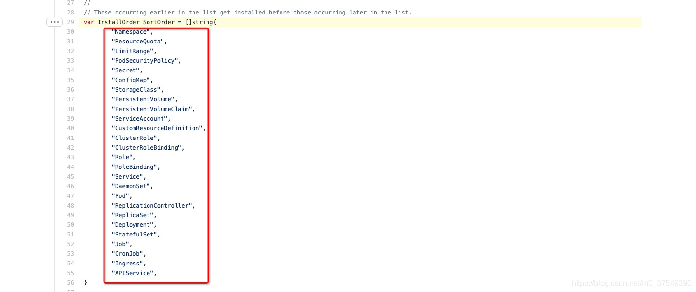

# 子chart

|                                  |      |      |
| -------------------------------- | ---- | ---- |
| global                           |      |      |
| mysubchart.key                   |      |      |
| 依赖控制enable,tags,import-value |      |      |
| helm pull会将依赖拉入charts/目录 |      |      |


# helm chart 编排资源创建顺序_helm资源创建顺序_好记性vs烂笔头的博客-CSDN博客

helm官方文档：https://helm.sh/docs/topics/charts_hooks/

## 背景

公司的应用使用helm发布，除了应用本身（statefulset），还定义了一个一次性任务db-init（执行数据库初始化操作），如果应用在数据库初始化完成前启动，大概率会有问题。为了解决这个问题，需要用到chart hooks特性来编排资源创建的顺序，具体操作如下：

## chart hooks配置

实际只要对chart包templates文件夹下的应用和一次性任务的[yaml](https://so.csdn.net/so/search?q=yaml&spm=1001.2101.3001.7020)文件注入如下annotations配置即可

```none
  annotations:
    helm.sh/hook: pre-install
    helm.sh/hook-weight: "5"
```

通过配置权重**helm.sh/hook-weight**的值来控制资源创建顺序，取值可以是任意的正数和负数，值类型为字符串类型；一次性任务配置为5，应用配置为10，按升序排序，先创建一次性任务job，job执行成功后再启动应用，如果job执行失败，则本次helm发布失败

## 注意

helm创建资源的默认顺序是硬编码的，顺序如下：


# Job database migration

search keyword `k8s job 迁移数据库`

https://learnku.com/articles/43850

# 只渲染不安装

```sh
helm install --debug --dry-run goodly-guppy ./mychart
```

使用`--dry-run`会让你变得更容易测试，但不能保证Kubernetes会接受你生成的模板。 最好不要仅仅因为`--dry-run`可以正常运行就觉得chart可以安装。


