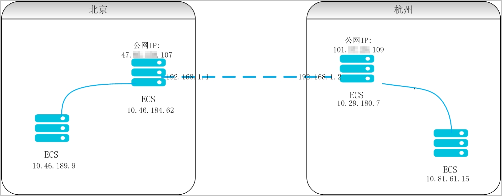
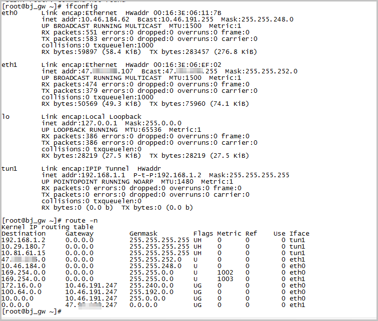
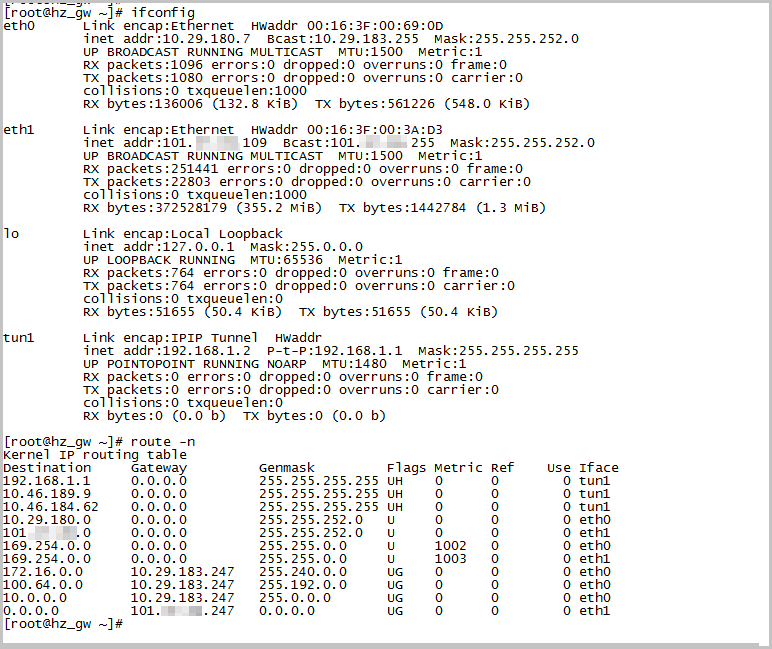
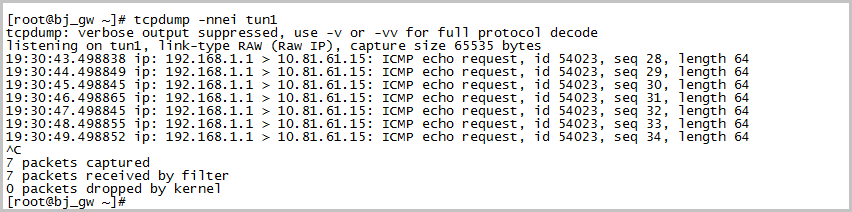
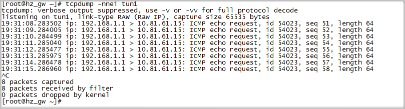
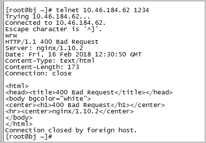

# 路由器防火墙解封

https://www.juniper.net/documentation/cn/zh/software/junos/routing-policy/topics/task/gre-tunnel-services-filter-qfx-series.html

# ecs间IPIP隧道

https://help.aliyun.com/zh/ecs/classic-network-under-different-areas-between-ecs-examples-of-how-to-build-ipip-tunnel


## 概述

本文主要介绍经典网络下不同地域内ECS实例之间如何搭建IPIP隧道。

## 问题描述

实现`10.46.189.9`和`10.81.61.15`通过IPIP隧道互通。网络拓扑图如下所示。



> **说明**：
>
> - 在北京和杭州节点各购买两个ECS实例，一个作为测试机，一台作为IPIP网关。
> - 北京节点下ECS实例`10.46.189.9`作为测试机，`10.46.184.62`作为IPIP隧道网关。
> - 杭州节点下ECS实例`10.81.61.15`作为测试机，`10.29.180.7`作为IPIP隧道网关。
> - `192.168.1.1`和`192.168.1.2`作为隧道的互联地址。

## 解决方案

### 北京节点IPIP网关中相关操作

1. 登录`10.46.184.62`地址，依次执行如下命令，进行配置。

   ```tcl
   echo 1 > /proc/sys/net/ipv4/ip_forward    ##开始路由转发
   modprobe ipip                                         ##加载 ipip 模块
   ip tunnel add tun1 mode ipip local 47.X.X.107  remote 101.X.X.109     ##创建 IPIP 隧道
   ip link set tun1 up                                    ##启动 tun1 隧道
   ip addr add 192.168.1.1 peer 192.168.1.2 dev tun1     ##隧道配置互联地址
   route add -host 10.29.180.7 dev tun1     ##配置路由
   route add -host 10.81.61.15 dev tun1     ##配置路由
   ```

2. 配置完成后，通过ifconfig和`route -n`命令检查配置。
   

### 杭州节点IPIP网关中相关操作

1. 登录`10.29.180.7`地址，依次执行如下命令，进行配置。

   ```tcl
   echo 1 > /proc/sys/net/ipv4/ip_forward    ##开始路由转发
   modprobe ipip                                         ##加载 ipip 模块
   ip tunnel add tun1 mode ipip local 101.X.X.109 remote 47.X.X.107    ##创建 IPIP 隧道
   ip link set tun1 up                                    ##启动 tun1 隧道
   ip addr add  192.168.1.2 peer 192.168.1.1 dev tun1    ##隧道配置互联地址
   route add -host 10.46.184.62 dev tun1     ##配置路由
   route add -host 10.46.189.9 dev tun1    ##配置路由
   ```

1. 配置完成后，通过ifconfig和`route -n`命令检查配置。系统显示类似如下。

   

### 结果验证

如果`10.46.184.62`和`10.29.180.7`能够互通，说明经典网络下搭建IPIP隧道是可以的。但是在北京IPIP网关`10.46.184.62`访问杭州节点测试机`10.81.61.15`不通，在北京测试机`10.46.189.9`访问杭州节点测试机`10.81.61.15`不通。测试结果未达到预期。

### 解决北京IPIP网关10.46.184.62访问杭州节点测试机10.81.61.15不通

1. 在北京IPIP网关`10.46.184.62`上，执行如下命令，进行抓包。

   ```nginx
   tcpdump -nnei tun1
   ```

   系统显示类似如下。

   

1. 在杭州IPIP网关`10.46.184.62`上，执行如下命令，进行抓包。

   ```nginx
   tcpdump -nnei tun1
   ```

   系统显示类似如下。

   

1. 在杭州测试机ECS实例`10.81.61.15`上抓包，没有抓到任何报文。说明在杭州IPIP网关到杭州测试ECS之间网络异常，原因是由于ECS上有对源地址保护，看到不是ECS的地址直接被丢弃。所以在杭州IPIP网关`10.46.184.62`上要做SNAT，将地址转换为 `10.46.184.62`才能正常访问，配置如下所示。

   ```apache
   iptables -t nat -I POSTROUTING -s 192.168.1.0/24 -j SNAT --to-source 10.29.180.7
   iptables -t nat -I POSTROUTING -s 10.46.184.62/32 -j SNAT --to-source 10.29.180.7
   iptables -t nat -I POSTROUTING -s 10.46.189.9/32 -j SNAT --to-source 10.29.180.7
   ```

   > 注：配置第一条`192.168.1.0/24`后，在北京IPIP网关上向杭州测试ECS就能通。后面两条策略是为了后面测试所需。

### 解决在北京测试机10.46.189.9访问杭州节点测试机10.81.61.15不通

1. 在北京测试机`10.46.189.9`访问杭州节点测试机`10.81.61.15`时，要把请求先转发到北京IPIP网关`10.46.184.62`上。但是经典网络下无法自定义路由，所以没有办法直接通过路由访问，所以需要在北京IPIP网关`10.46.184.62`上做个DNAT映射。设置如下所示。

   ```css
   iptables -t nat -A PREROUTING -d 10.46.184.62 -p tcp --dport 1234 -j DNAT --to-destination 10.81.61.15:1234
   ```

   > **说明**：在`10.81.61.15`上启动了一个1234端口做测试。

2. 整个内网链路通过IPIP隧道就可互通。
   

3. 在北京IPIP网关

   ```
   10.46.184.62
   ```

   上，执行如下命令，进行抓包。

   ```
   tcpdump -nnei any port 1234
   ```

   系统显示类似如下。

   

4. 在杭州IPIP网关

   ```
   10.46.184.62
   ```

   上，执行如下命令，进行抓包。

   ```
   tcpdump -nnei any port 1234
   ```

   系统显示类似如下。

   

5. 在杭州测试机ECS实例

   ```
   10.81.61.15
   ```

   上，执行如下命令，进行抓包。

   ```
   tcpdump -nnei any port 1234
   ```

   系统显示类似如下。

   

6. 通过以上抓包情况分析如下：

   - 在报文到北京IPIP网关上抓包，首先通过DNAT把目的地址转化为`10.81.61.15`，并且把请求放到隧道里面。
   - 杭州IPIP网关接受到报文后，把源地址改成`10.46.184.62`，然后去请求`10.81.61.15`。
   - 在杭州测试ECS上收到的报文，并且回包。

虽然在整个链路中，通过配置相应的DNAT和SNAT可以实现通信，但是这个过于复杂，并且后续产品都会向VPC倾斜，所以不推荐在经典网络下使用IPIP隧道。