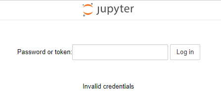

# jupyter


# [关于jupyter notebook密码设置](https://www.cnblogs.com/honway/p/9559324.html)

对于一个jupyter编辑器使用的新手，更换浏览器或者Logout后，需要输入密码进行登陆时



按照网上的教程怎么设置都不行，那么自己整理了一个适用于初学者的操作。

1.windows下，打开命令行，重新生成一个jupyter配置文件：

```sh
jupyter notebook --generate-config　　   

```

2.修个配置文件，找到这个新生成的文件：Windows: `C:\Users\USERNAME\.jupyter\jupyter_notebook_config.py`

 搜索 NotebookApp.allow_password_change，改为：NotebookApp.allow_password_change=False ，记得去掉注释的#

3.回到windows命令行，运行jupyter notebook password

```
C:\Windows\System32>jupyter notebook password
Enter password:             #键入密码，不显示的
Verify password:            #再次重复键入密码
[NotebookPasswordApp] Wrote hashed password to C:\Users\用户\.jupyter\jupyter_notebook_config.json     #密码生成的一串sha1，写入到了这个文件，等下要把这串sha1，复制到第一个生成的配置文件中
```

4.还差一步密码才可以生效使用，在第一个jupyter_notebook_config.py配置文件中找到“c.NotebookApp.password“，等于，刚生成的那个密码sha1，效果如下：去掉前面的”#“

```
c.NotebookApp.password = u'sha1:xxxxxxxxxxxxxxxxxxxxxxxxxxxxxxxxxx'
```

5.保险起见，把jupyter重启，之后，无论是更换浏览器还是Logout登陆，新密码都可以正常使用了。

 

≡≡≡≡≡≡≡≡≡≡≡≡≡≡≡≡≡≡≡≡≡≡≡≡≡≡≡≡≡≡≡≡≡≡≡≡≡≡≡≡≡≡≡≡≡≡≡≡≡≡≡≡≡≡≡≡≡≡≡≡≡≡≡≡≡≡≡≡≡≡≡≡≡≡≡

 

第3步也可以换成：ipython执行

[](javascript:void(0);)

```
C:\Windows\System32>ipython
Python 3.6.4 |Anaconda, Inc.| (default, Jan 16 2018, 10:22:32) [MSC v.1900 64 bit (AMD64)]
Type 'copyright', 'credits' or 'license' for more information
IPython 6.2.1 -- An enhanced Interactive Python. Type '?' for help.

In [1]: from notebook.auth import passwd
In [2]: passwd()
Enter password:
Verify password:
Out[2]: 'sha1:xxxxxxxxxxxxxxxxxxxxxxxxxxxxxxxxxxxxxxx'
```

[](javascript:void(0);)

 

