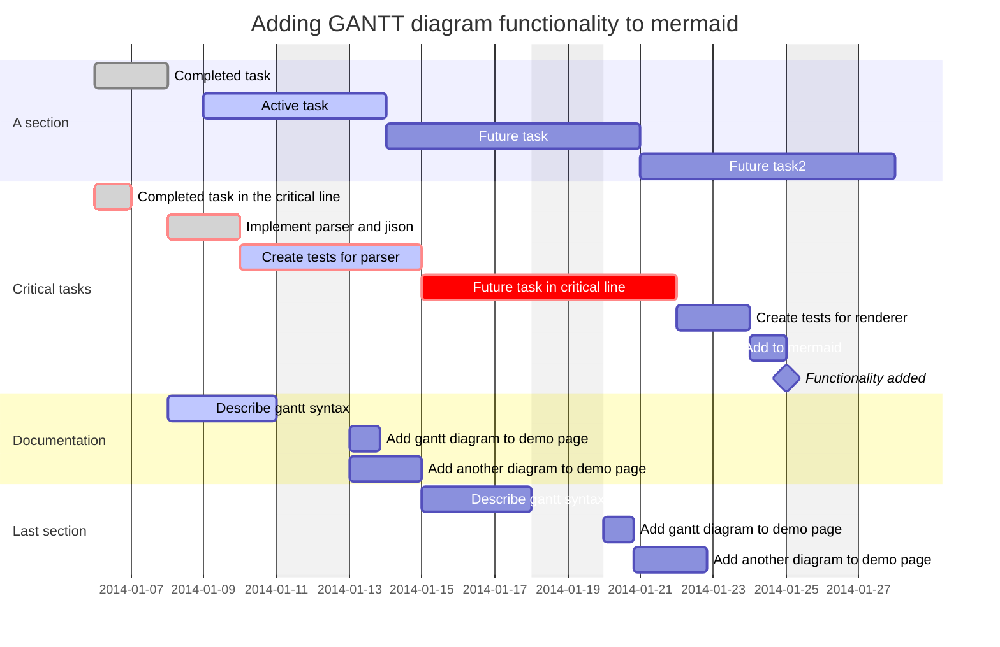
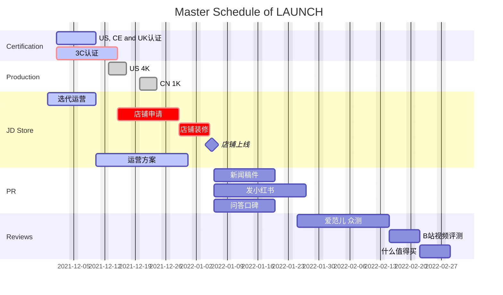

# 思维导图

|              |               |      |
| ------------ | ------------- | ---- |
| 6:00         | 喝水,出发公司 |      |
| 6:30         | 拉伸,运动     |      |
| 7:30         | 早饭          |      |
| 8:00         | 咖啡          |      |
| 9:00 ~ 18:00 | work          |      |
| 19:00        | 运动          |      |
| 20:00        | 看书,娱乐     |      |
| 22:00        | 洗漱,睡觉     |      |


善于时间管理的人可以轻松自如地在多个任务之间来回切换，既能够照顾到各个任务的轻重缓急，又能结合各个任务间内在的依赖关系和持续时长，做到节时、高效、完美地完成复杂的任务组合。但是多重任务的数量一旦超过某个阀值，人的大脑便会显得力不从心，会出现错误和纰漏。这时，我们需要使用工具来进行辅助，更为科学和系统地管理多重任务。

项目经理们通常会使用 Office Project 来管理复杂的项目，也有的项目经理为图省事，仅使用 Excel 表格也可以完成项目管理。不管是使用 Office Project，还是 Excel 表格，其本质都是通过绘制甘特图，来揭示复杂项目中各项相关工作的依赖关系和持续时长，以优化工作流程监视事项进度。

在这篇博文中，我们来介绍使用 Markdown 进行甘特图的绘制。其中，使用 Typora 绘制的甘特图，更可以简便地导出为 SVG 或 PDF 格式文件，非常方便分发和浏览。另外，鉴于 MaraPython 站点是基于 Hexo 框架、使用 Butterfly 主题搭建而成，因此，博文也顺带介绍如何在站点上通过 [mermaid 标签外挂](https://www.marapython.com/posts/butterfly-tag-plugins/#mermaid图表)实现甘特图的绘制。

## 定义

首先，我们来简单了解一下，什么是甘特图。

> A Gantt chart is a type of bar chart, first developed by Karol Adamiecki in 1896, and independently by Henry Gantt in the 1910s, that illustrates a project schedule and the amount of time it would take for any one project to finish. Gantt charts illustrate number of days between the start and finish dates of the terminal elements and summary elements of a project.

## 语法

在 Typora 编辑器里面，按照如下格式直接输入：

````
MARKDOWN


````


Typora 渲染出的甘特图效果如下：

```
PLAINTEXT

gantt
    dateFormat  YYYY-MM-DD
    title       Adding GANTT diagram functionality to mermaid
    excludes    weekends
    %% (`excludes` accepts specific dates in YYYY-MM-DD format, days of the week ("sunday") or "weekends", but not the word "weekdays".)

    section A section
    Completed task            :done,    des1, 2014-01-06,2014-01-08
    Active task               :active,  des2, 2014-01-09, 3d
    Future task               :         des3, after des2, 5d
    Future task2              :         des4, after des3, 5d

    section Critical tasks
    Completed task in the critical line :crit, done, 2014-01-06,24h
    Implement parser and jison          :crit, done, after des1, 2d
    Create tests for parser             :crit, active, 3d
    Future task in critical line        :crit, 5d
    Create tests for renderer           :2d
    Add to mermaid                      :1d
    Functionality added                 :milestone, 2014-01-25, 0d

    section Documentation
    Describe gantt syntax               :active, a1, after des1, 3d
    Add gantt diagram to demo page      :after a1  , 20h
    Add another diagram to demo page    :doc1, after a1  , 48h

    section Last section
    Describe gantt syntax               :after doc1, 3d
    Add gantt diagram to demo page      :20h
    Add another diagram to demo page    :48h
```

在 Hexo 博客站点使用 Butterfly 主题时，如果要在博文的 Markdown 文件内绘制甘特图，必须：

1. 首先，在主题配置文件`_config.butterfly.yml` 内作如下配置：

   ```
   YML
   # mermaid
   # see https://github.com/knsv/mermaid
   mermaid:
     enable: true
     # built-in themes: default/forest/dark/neutral
     theme: default
   ```

2. 其次，在 Markdown 文件内使用 `mermaid` 标签外挂：

   ```
   MARKDOWN
   
   内容
   
   ```

   关于 Butterfly 主题的 [mermaid 标签外挂](https://www.marapython.com/posts/butterfly-tag-plugins/#mermaid图表)或者[其他标签外挂](https://www.marapython.com/posts/butterfly-tag-plugins/)，可以点击前往了解更多。

经 Butterfly 主题渲染出的甘特图效果如下：

2014-01-072014-01-092014-01-112014-01-132014-01-152014-01-172014-01-192014-01-212014-01-232014-01-252014-01-27Completed taskCompleted task in the critical lineImplement parser and jisonDescribe gantt syntaxActive taskCreate tests for parserAdd gantt diagram to demo pageAdd another diagram to demo pageFuture taskFuture task in critical lineDescribe gantt syntaxAdd gantt diagram to demo pageAdd another diagram to demo pageFuture task2Create tests for rendererAdd to mermaidFunctionality addedA sectionCritical tasksDocumentationLast sectionAdding GANTT diagram functionality to mermaid

下面我们逐一介绍各个参数的意义和使用方法。

### 标题 Title

甘特图的**标题**属于可选参数，通过 `title` 进行引入，主要用来在甘特图的顶部标示整个图表的名称或说明。

### 区块 Section

每个具体的任务**区块**，使用 `section [name]` 的格式作为首行来引导，需要注意，**区块**后面的名称是必须的。经过渲染以后，区块的名称会出现在甘特图最左侧的位置。

任务区块内的各个任务**事项**，在 `section [name]` 的下方单独每行使用类似
`task [name] :[default=normal|crit|milestone,] [done|active|default=future,] [simplified_name,] [(start, finish)|(start, duration)|(default=last_finish, duration)]` 的格式来描述。

* 事项名称：`task [name]`
* 事项性质：`[default=normal|crit|milestone,]`，分别表示正常事项、关键事项、重要事件节点。
* 事项状态：`[done|active|default=future,]`，分别表示已完成、进行中、待开展。
* 事项简称：`[simplified_name,]`，作为后续事项的依赖项，可以使用简称进行引用。
* 持续时间：`[(start, finish)|(start, duration)|(default=last_finish, duration)]`

### 重要事件节点 Milestone

甘特图中可以加入**重要事件节点**。任务事项通常表现为持续的时间段，重要事件节点则通常表现为独立的时间点。重要事件节点的准确时间位置，由**开始时间**和**持续时间**共同决定：

重要事件节点的准确时间位置开始时间持续时间重要事件节点的准确时间位置 = 开始时间 + 持续时间 /2

在 Typora 里，关于**重要事件节点**的示例代码如下：

```
MARKDOWN
​```mermaid
gantt 
dateFormat HH:mm
axisFormat %H:%M
Initial milestone : milestone, m1, 17:49,2min
taska2 : 10min
taska3 : 5min 
Final milestone : milestone, m2, 18:14, 2min
​```
```

Typora 的渲染效果如下：

```
gantt 
dateFormat HH:mm
axisFormat %H:%M
Initial milestone : milestone, m1, 17:49,2min
taska2 : 10min
taska3 : 5min 
Final milestone : milestone, m2, 18:14, 2min
```

Butterfly 的渲染效果如下：

```mermaid
gantt 
dateFormat HH:mm
axisFormat %H:%M
Initial milestone : milestone, m1, 17:49,2min
taska2 : 10min
taska3 : 5min 
Final milestone : milestone, m2, 18:14, 2min
```




### 设置日期 Setting dates

`dateFormat` 用来定义**代码输入**的日期时间格式，默认的输入格式是 `YYYY-MM-DD`。如果需要重新定义输入格式，可通过 `dateFormat` 引入以下参数进行设定。

```
MARKDOWN

Input       Example             Description:
YYYY        2014                4 digit year
YY          14                  2 digit year
Q           1..4                Quarter of year. Sets month to first month in quarter.
M MM        1..12               Month number
MMM MMMM    January..Dec        Month name in locale set by moment.locale()
D DD        1..31               Day of month
Do          1st..31st           Day of month with ordinal
DDD DDDD    1..365              Day of year
X           1410715640.579      Unix timestamp
x           1410715640579       Unix ms timestamp
H HH        0..23               24 hour time
h hh        1..12               12 hour time used with a A.
a A         am pm               Post or ante meridiem
m mm        0..59               Minutes
s ss        0..59               Seconds
S           0..9                Tenths of a second
SS          0..99               Hundreds of a second
SSS         0..999              Thousandths of a second
Z ZZ        +12:00              Offset from UTC as +-HH:mm, +-HHmm, or Z
```

`axisFormat` 用来定义**图表输出**的日期时间格式，默认的输出格式是 `YYYY-MM-DD`。如果需要重新定义输出格式，可通过 `axisFormat` 引入以下参数进行设定。

```
MARKDOWN

%a - abbreviated weekday name.
%A - full weekday name.
%b - abbreviated month name.
%B - full month name.
%c - date and time, as "%a %b %e %H:%M:%S %Y".
%d - zero-padded day of the month as a decimal number [01,31].
%e - space-padded day of the month as a decimal number [ 1,31]; equivalent to `%_d`.
%H - hour (24-hour clock) as a decimal number [00,23].
%I - hour (12-hour clock) as a decimal number [01,12].
%j - day of the year as a decimal number [001,366].
%m - month as a decimal number [01,12].
%M - minute as a decimal number [00,59].
%L - milliseconds as a decimal number [000, 999].
%p - either AM or PM.
%S - second as a decimal number [00,61].
%U - week number of the year (Sunday as the first day of the week) as a decimal number [00,53].
%w - weekday as a decimal number [0(Sunday),6].
%W - week number of the year (Monday as the first day of the week) as a decimal number [00,53].
%x - date, as "%m/%d/%Y".
%X - time, as "%H:%M:%S".
%y - year without century as a decimal number [00,99].
%Y - year with century as a decimal number.
%Z - time zone offset, such as "-0700".
%% - a literal "%" character.
```

### 注释 Comments

在甘特图的代码输入位置可以使用注释，注释内容在解释器进行编译渲染的时候会被忽略和跳过。注释必须单独另起一行，以 `%%`（双百分号）开头的内容会全部当作注释。

### 小结 Summary

* `title`：甘特图的标题
* `section [name]`：任务区块
* `exclude`：接受格式为 `YYYY-MM-DD` 的**具体日期**、格式为 `sunday` 的**一周七天**、 格式为 `weekends` 的**周末**，但不接受使用 `weekdays` 来表示工作日。
* `%%`: 在任意地方插入注释

## 实例演示

### Typora 内的 Markdown 代码



### Typora 渲染效果

```markdown
PLAINTEXT

gantt
    dateFormat  YYYY-MM-DD
    title       Master Schedule of LAUNCH
    excludes    weekends
    %% (`excludes` accepts specific dates in YYYY-MM-DD format, days of the week ("sunday") or "weekends", but not the word "weekdays".)

    section Certification
    US, CE and UK认证         :active, cert1, 2021-12-01,2021-12-10
    3C认证                    :crit, active, cert2,2021-12-01,2021-12-15


    section Production
    US 4K             		:done,    p1, 2021-12-13,2021-12-17
    CN 1K             		:done,    p2, 2021-12-20,2021-12-24


    section JD Store
    选代运营					:active, jd1, 2021-11-29,2021-12-10
    店铺申请					:crit, jd2, after cert2, 10d
    店铺装修     				:crit,jd3,  after jd2, 5d
    店铺上线  					:milestone,jd4,  after jd3, 1d
    运营方案					:active, after jd1,15d


    section PR
    新闻稿件					:pr1, after jd4, 10d
    发小红书					:pr2, after jd4, 15d
    问答口碑					:pr3, after jd4, 10d

    section Reviews
    爱范儿 众测					:r1,2022-01-25,2022-02-15
    B站视频评测      			:5d
    什么值得买					:5d
```

### Butterfly 渲染效果

2021-12-052021-12-122021-12-192021-12-262022-01-022022-01-092022-01-162022-01-232022-01-302022-02-062022-02-132022-02-202022-02-27选代运营US, CE and UK 认证3C 认证运营方案US 4K店铺申请CN 1K店铺装修店铺上线新闻稿件发小红书问答口碑爱范儿 众测B 站视频评测什么值得买CertificationProductionJD StorePRReviewsMaster Schedule of LAUNCH

好了，关于在 Markdown 文件中如何绘制甘特图，今天就先介绍到这里。学会了在 Typora 内简便快捷地绘制甘特图，你也可以变身项目经理，通过定时更新和发布甘特图，来沟通团队的资源调配，来管理复杂的任务组合，确保按时、高质地完成项目交付。

## 参考资料

* https://mermaid-js.github.io/mermaid/#/gantt