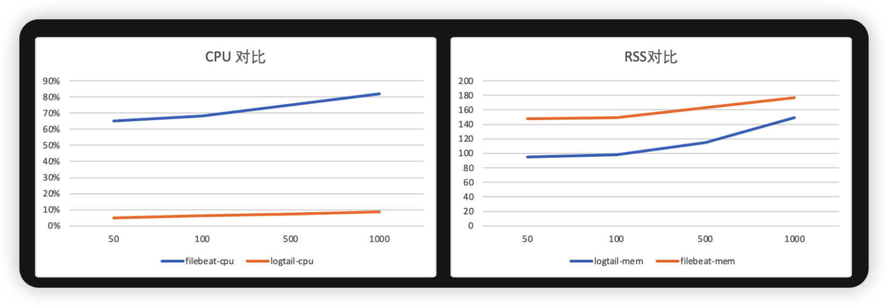
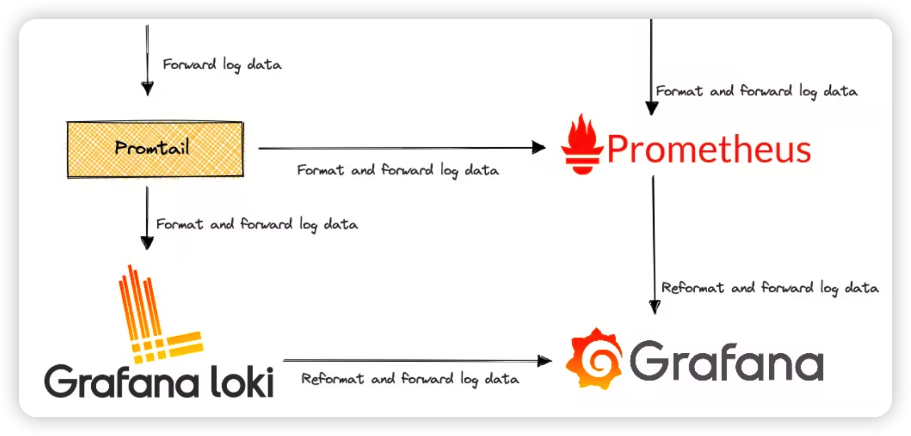
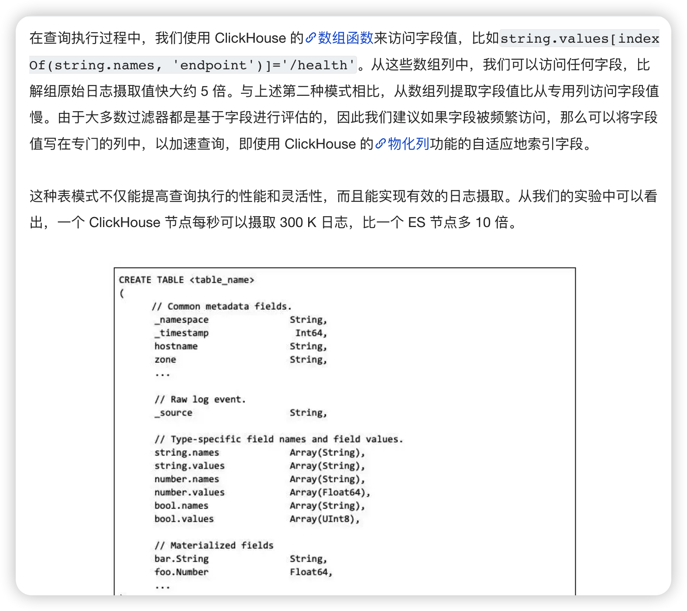
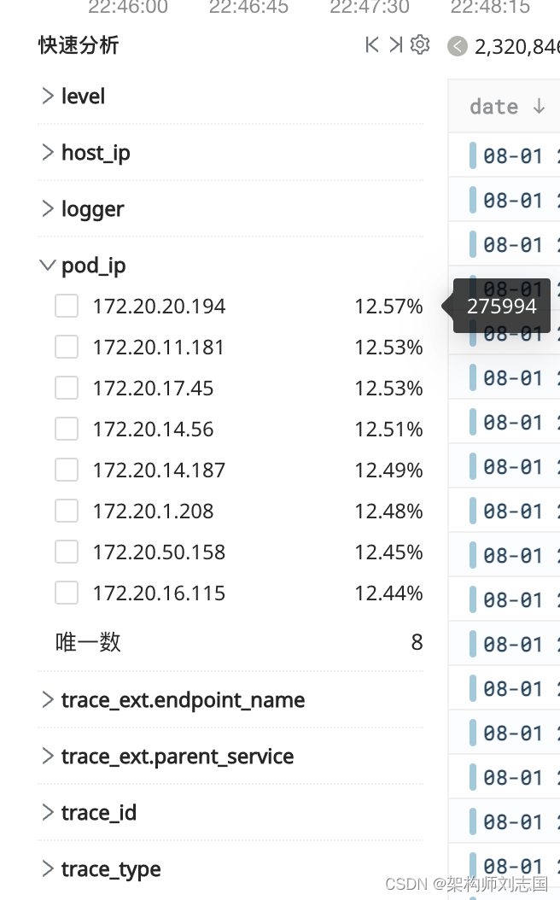
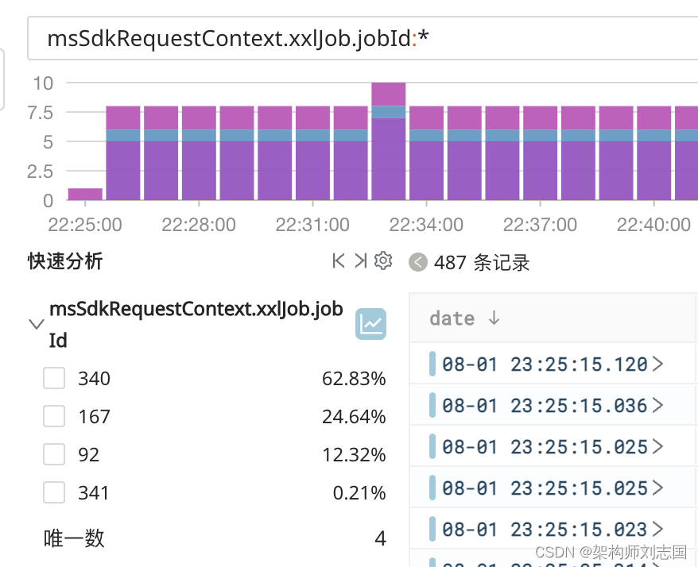

| 版本 | 变更             |      |
| ---- | ---------------- | ---- |
| v0.1 |                  |      |
| v0.2 | 多机房thnaos方案 |      |
|      |                  |      |

# 大规模集群(监控,报警,日志分析查询)

**可观测性数据**

## 如何保证快速预警

- 及时性
- 有效性
- 精确送达到人
- 可统一调度管理, 比如分组, 合并, 过滤, 抑制

## 如何保证高级查询

- 聚合, 分组, 分布, sla统计, 条件判断,业务调用链

- 海量存储

- 周期归档(S3或其他存储)

- 自定义metrics

  

## 如何保障架构承压

- 稳定可扩展

- 高可用

---

## 场景举例

### 监控采集:   agent -> 报警存储

healthy check

- host alive
- service alive

负载

- cpu
- mem
- disk
- net traffic

自定义 metrics

- trace
- handle count
- exception
- ...

### 日志采集:  agent -> 日志存储

- 堆栈trace
- 订单跟踪
- 分析查询
- ...

# 采集端

### 对比

| 采集agent       | 监控 | 日志                       |
| --------------- | ---- | -------------------------- |
| 热数据优先      | 高   | 高                         |
| 及时性          | 高   | 中(有offset, position保障) |
| agent带来的负载 | 低   | 随日志大小线性膨胀         |

建议保障监控agent的快速通道第一优先级, 

日志agent能做到统一管理(拥塞情况下控制资源占用)

### 思路

日志 -> 特征聚合 -> custom metrics -> 监控预警        (快速通道) 

​         -> 高级查询 -> 挖掘价值 -> 行为分析 -> ...

| log collector/transform 分散压力的方案 | 性能 | 特别的点                                                     | 缺点                                           |
| -------------------------------------- | ---- | ------------------------------------------------------------ | ---------------------------------------------- |
| ilogtail                               | 高   | v2支持**采集**metrics,  [ui](https://ilogtail.gitbook.io/ilogtail-docs/benchmark/performance-compare-with-filebeat), [性能](https://ilogtail.gitbook.io/ilogtail-docs/benchmark/performance-compare-with-filebeat) |                                                |
| promtail                               | 中   | 可以暴露/metrics                                             | 绑定loki,prometheus, 只采集console和log file源 |
| filebeat(beats家族)                    | 中   | 无                                                           | 缺少 transform能力                             |
| fluent-bit                             | 中   | 无                                                           |                                                |
| vector                                 | 中   | 多数据源间transform暴露/metrics                              |                                                |

- daemonset, sidecar, deployment的选择

# 存储/查询

|      | clickhouse                       | tidb                           |
| ---- | -------------------------------- | ------------------------------ |
|      | 列存储 Mergetree                 | 行存储                         |
|      | 实践经验: 非事务型, 适用日志分析 | 实践经验: 事务型赛道,替换mysql |
|      | olap                             | oltp/HATP                      |
|      | 查询强悍,update较差              | 适用于数据分析                 |

## 日志存储的方案

|          | clickhouse | elasticsearch | loki |
| -------- | ---------- | ------------- | ---- |
| 水平扩容 | 支持       | 支持          | 较差 |
| 好用程度 | 还行       | 还行          | 还行 |
| 全文索引 | 有         | 有            | 无   |
| 高级查询 | 快         | 慢            | 无   |

常见日志文本大小

| 日志文本         | 单元行   | 大小  |
| ---------------- | -------- | ----- |
| nginx日志        | 单行     | 283B  |
| spring cloud日志 | 多行堆栈 | 1~7KB |
| golang/k8s       | 多行     | 1~5KB |
| syslog,journal   | 单行     | 283B  |
|                  |          |       |

## 日志分析

**一眼看尽上亿日志**

如果仅仅是浏览，人眼能看到的日志只占总量的极少部分。尤其在动辄上亿的量级下，我们往往只关注异常日志，偶尔查查某条链路日志。这种情况下数据的检索率，或许只有百万分之一。

而业务上使用的数据库，某张表只有几千万条数据，一天却要查上亿次的情况屡见不鲜。

大量日志写入后直到过期，也没有被检索过。通过分析日志来提高检索率，提高数据价值，很多时候不是不想，而是难度太高。比如有很多实践是用 hdfs 存储日志，flink 做分析，技术栈和工程复杂不说，添加新的分析模式不灵活，甚至无法发现新的模式。

ClickHouse 最强大的地方，正是其强悍到令人发指的分析功能。如果只是用来存放、检索日志，无疑大材小用。如果做到存储分析一体，不仅架构上会简化，分析能力也可以大大提高，做到让死日志活起来。

**全文检索**的问题

- [跳数索引](https://juejin.cn/post/7130514546069864456)
- 

统计列的 TopN、占比、唯一数。

曾经业务方发现 MQ 消费堆积，因为有时候只有个别线程在进行消费，而在平时每个线程消费数量都很均匀，通过 thread_name 字段看直方图就一目了然了。

优化方案

- clickhouse 开启 keeper 去掉 zookeeper,  解决扩容瓶颈
- chproxy配置写本地表分摊写压力
- 存储策略,冷热分层(ssd+s3), TTL归档(降低存储成本)

# 报警端

| 分担prometheus压力的方案                               | 可选远程存储                                     |      |
| ------------------------------------------------------ | ------------------------------------------------ | ---- |
| 多个prometheus 拆角色                                  | Victoria Metrics/s3<!--/clickhouse graphite表--> |      |
| **thanos多群集(s3存储) operator**                      | s3                                               |      |
| telegraf Nightingale 夜莺监控报警 滴滴团队, UI能力较好 | prometheus/tsdb                                  |      |
|                                                        |                                                  |      |
|                                                        |                                                  |      |

## prometheus水平扩容

### 单机房

- 按group拆分prometheus成多个分摊压力
- prometheus不同角色
  - 仅采集角色 (多个)
  - 存储角色  (远端存储s3/tsdb/clickhouse)

### 多机房thanos方案

|      | sidecar模式                                                  | receiver模式                      |
| ---- | ------------------------------------------------------------ | --------------------------------- |
| 存储 | 机房本地数据默认6小时, 每2小时导入远程s3                     | 机房本地无状态,远程写入到Receiver |
| 集成 | pod中添加sidecar                                             | 指定远程Receiver                  |
| 查询 | Thanos Query 既可以 向A/B prometheus 查询最新数据, 也可以向 store api 查询历史数据 | Query 只能向 store api请求        |

#### sidecar模式

#### receiver模式

# 可视化

- 夜莺监控UI
- grafana
- ClickVisual
- superset

| grafana               | [ClickVisual](https://www.51cto.com/article/708742.html) | superset              | 夜莺监控UI |
| --------------------- | -------------------------------------------------------- | --------------------- | ---------- |
| clickhouse/prometheus | clickhouse                                               | clickhouse/prometheus | prometheus |
|                       |                                                          |                       |            |
|                       |                                                          |                       |            |
|                       |                                                          |                       |            |

# 组件的选择 ||

|        |                           |      |
| ------ | ------------------------- | ---- |
| 采集   | ilogtail                  |      |
| 存储   | clickhouse + prometheus   |      |
| 查询   | clickhouse                |      |
| 报警   | prometheus + alertmanager |      |
| 可视化 | grafana/clickVisual       |      |

# 后续的确认

- 评估硬件瓶颈,  io, 网络, cpu

- 合理压测评估软件瓶颈

- 采集端/存储端/计算端 的扩容缩容方案

- 多机房部署, 统一管控

  

## 

## clickhouse压力扩容

从我们测试的过程和结果来看，影响clickhouse写入性能的包括如下因素：

网卡带宽：在使用千兆网卡的情况下，网络很容易成为整个写入测试的瓶颈，一般到80MB/s左右；在换用万兆网卡后，速度可以测到150MB/s~200MB/s以上。
磁盘IO：如果clickhouse只配置了单块儿SATA盘做数据盘，那么磁盘IO也会是提升写入性能的瓶颈所在，建议使用多块儿盘做RAID。
CPU：我们测试使用了24核的服务器，当写入测试程序激励打到150MB/s以上的速度时，整个CPU的使用率会较长时间处于2000%以上。
物化视图：如果写入的表上有相关的物化视图逻辑，那么也会影响到最终的写入性能，因为CPU会将很多计算用在物化视图的处理上，具体影响大小取决于物化视图逻辑的复杂度以及物化视图的数量，从我们自己的项目来看，下降了至少一半的性能。

其它注意事项
对于分布式CH集群的写入，建议写本地表，而不是直接写分布式表，具体原因在于如果写入分布式表，那么写入的那个点容易成为单点故障或瓶颈；写入本地表的话则可以使用chproxy来做代理转发流量，或者自己实现流量的负载均衡。
通过JDBC接口进行写入时，要注意batchSize的调优，太小容易出现“too many parts”的问题，太大又会使整体的写入性能下降，具体的取值可根据实际的环境做调整。
副本的存在对整体写入性能的影响不大。

4. 总结
总体来看，在理想情况下，clickhouse的写入性能能够达到官方宣称的200MB/s左右（https://clickhouse.com/docs/zh/introduction/performance/#shu-ju-de-xie-ru-xing-neng），
5. 且总体写入性能还可以通过多分片的方式来进行扩展。这样的表现基本能够满足我们的使用需求。

原文链接：https://blog.csdn.net/weixin_40104766/article/details/121323882

**以上仅代表个人看法 , 欢迎指正, 会根据大家建议随时调整方案**