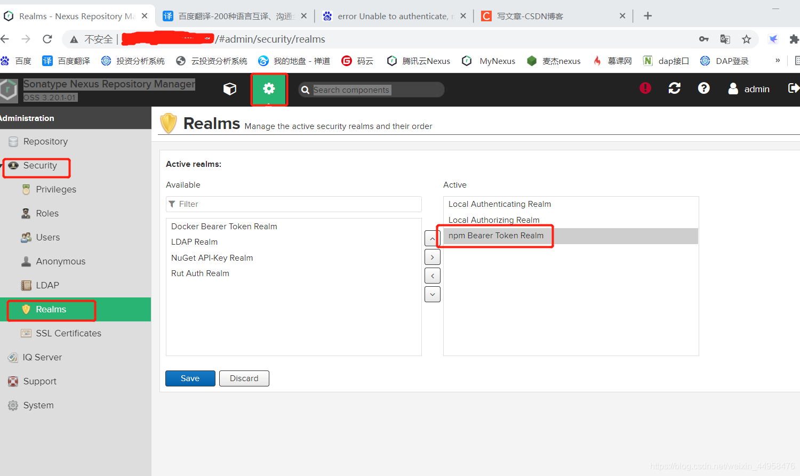

# helm上传

```shell
helm plugin install --version master https://github.com/sonatype-nexus-community/helm-nexus-push.git
helm nexus-push localrepo login -u name -p pass.123
helm nexus-push localrepo kettle-0.1.0.tgz
```


# npm publish支持

设置–Security–Realms–把npm Bearer Token [Realm](https://so.csdn.net/so/search?q=Realm&spm=1001.2101.3001.7020)添加到Active


