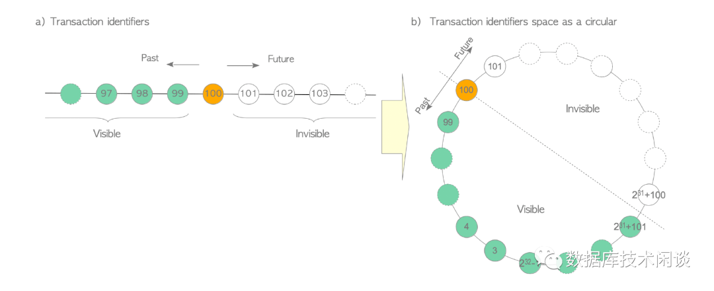
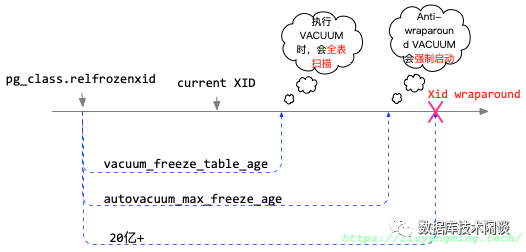

# schema授权


```shell
CREATE USER $user WITH PASSWORD '$password';
GRANT ALL PRIVILEGES ON DATABASE $dbname TO $user;
GRANT ALL ON schema  $schema to $user;
```


PostgreSQL 事务ID回卷问题分析

2023-05-06 17:46:22

**概述**

PG的 MVCC 机制通过保存数据行多个历史版本并通过记录上的事务 ID 元组（xmin,xmax) 来控制不同版本记录的可见性。在 PG里，事务 ID（XID）是 32 位无符号，顺序生成，单调递增。当到达大值（2^32-1) 后又开始从 3 开始使用。这种现象一般称为事务 ID 回卷（Wraparound）。单纯看这个机制可能看出历史事务修改的记录的可见性可能发生反转，一个记录从“历史记录”变成“未来记录”，数据就莫名其妙的“丢失”了。PG 数据库在碰到这种情形下会直接拒绝服务（报错如下）。

```
ERROR: database is not accepting commands to avoid wraparound data loss in database "devops"HINT: Stop the postmaster and vacuum that database in single-user mode.
```

 

PG针对表和数据库有冻结机制（ vacuum freeze ）以避免事务 ID 回卷带来的这种问题出现。

 本文主要通过示例解释 PG 事务 ID 特点及其回卷引发的问题现象和解决方法。


------


 

# **PG 事务特性**

## 

**事务 ID 类型**

事务 ID 是一个数据类型，长度 4字节，表示范围是 [0 , 4294967295] 。PG 将 0、1、2 保留给自己用，业务会话的事务 ID 从 3 开始，到大值 4294967295 后再回到 3 开始，循环使用。这个特征称之为事务 ID 的回卷（wraparound）。

事务 ID 会存储在数据页中。PG还有个虚拟的事务 ID，由会话的 pid 和 本地事务 ID（会话内部），这个本地事务 ID 不会回卷。前面那个事务 ID 也叫全局事务 ID 。

 

示例如下：

```
pgtest=# select locktype, database,transactionid,virtualtransaction,pid,mode,granted from pg_locks where transactionid <> '' ;   locktype    | database | transactionid | virtualtransaction | pid  |     mode      | granted---------------+----------+---------------+--------------------+------+---------------+--------- transactionid |          |    2146496507 | 5/12667            | 2600 | ExclusiveLock | t(1 row)
```

 

## **事务 ID 比较**

全局的事务 ID 常用来比较两个事务开始的先后顺序。但这个比较不是简单的比大小。

当事务 ID 没有回卷现象发生时，简单的比大小是可以判断两个事务 ID 的先后顺序。

 

如下图，每个事务 ID 左边的表示比它早的事务（past），右边的表示比它晚的事务（future）。MVCC 的要求就是每个会话只能看到比会话事务 ID 早且已经提交的事务修改的记录。由于 事务 ID 可以回卷，所以用环状表示更贴切一些。

 



当没有发生事务 ID 回卷时，简单比较两个事务 ID 的大小是能判断先后的。

但是当第二个事务 ID 发生回卷后，个事务 ID 数字就会明显大于第二个，如 2^32-1 和 3 。单纯比大小结论就会错。PG 研发选择了一个技巧，将 （ID1-ID2) 的差值转换为 32位有符号整型。这样 2^32-1 和 3 的差值 恰好由于大于 2^31 就变成负数了（位是符号位，1表示负数），此时结论又正确了。

 

代码如下：

```
/* * TransactionIdPrecedes --- is id1 logically < id2? */bool TransactionIdPrecedes(TransactionId id1, TransactionId id2) // 结果返回一个bool值{  /*   * If either ID is a permanent XID then we can just do unsigned   * comparison.  If both are normal, do a modulo-2^32 comparison.   */  int32    diff;   if (!TransactionIdIsNormal(id1) || !TransactionIdIsNormal(id2)) //若其中一个不是普通id，则其一定较新（较大）    return (id1 < id2);   diff = (int32) (id1 - id2);  return (diff < );}
```


但是上面这个算法还是有问题，当 ID2 发生回卷 且 ID1 和 ID2 的差值大于 0 且小于 2^31 的时候它就是正的，变成 ID1 比 ID2 晚了。这个就跟实际相反，按 MVCC 机制，数据会突然“消失”，就是“丢数据”了（实际数据还在数据页中）。

 

为此，PG 定义上面这种情形为非法，在设计上禁止任意两个事务 ID 的差值值超出 2^31 这个范围。换句话理论上当 PG 一个会话开启事务后，在数据库中多有 2^31 （不是20亿）个事务比它早，多有 2^31 个事务比它晚。注意，这并不表示实际还可以再开启 2^31 个事务。还能开多少个事务是由数据库中历史早的那个未提交事务的事务 ID 决定。此外，MVCC 需要比较会话的事务 ID 跟记录元组中的  xmin 和  xmax （后面解释），它们间的差值也要在上面范围内。所以数据库表中记录的早的事务 ID 也会制约后面的事务数量。这个早的事务可以理解为“拖油瓶”。

 

PG会在这种情形发生之前有多个策略不同程度启用冻结机制回收数据库表中老的事务 ID 。如果后还是出现这种情形了， PG直接拒绝服务，就报文章开头的错误。

 

## **PG 表的数据更新**

PG表每笔记录称为元组（tuple），除了存储数据外，元组里还额外包含几个字段：

- xmin：事务 ID，记录插入时的事务 ID。
- xmax：事务 ID，记录删除或更新时的事务 ID。更新操作对应的删除和插入两笔记录。如果为 0，表示还没有删除或者删除事务还没有提交或者已回滚。删除也不会真的删除元组。
- ctid：表示元组在表中的物理位置。

```
pgtest=# create table t1(id bigint not null primary key, c1 varchar(50));CREATE TABLEpgtest=# insert into t1 values(1,'A') returning xmin; xmin------ 1645(1 row)
INSERT  1pgtest=# delete from t1 returning xmax; xmax------ 1646(1 row)
DELETE 1pgtest=# insert into t1 values(2,'B') returning xmin; xmin------ 1647(1 row)
INSERT  1pgtest=# update t1 set c1=c1||'*' where id=2 returning xmax; xmax------    (1 row)
UPDATE 1pgtest=# update t1 set c1=c1||'*' where id=2 returning xmax; xmax------    (1 row)
UPDATE 1
```

 

查看当前会话的事务 ID，方法如下。数据库里所有会话的事务 ID 都是单调递增不重复的。

```
pgtest=# SELECT pg_current_xact_id(); pg_current_xact_id--------------------               1664(1 row)pgtest=# SELECT pg_current_xact_id(); pg_current_xact_id--------------------               1665(1 row)
```


可以看出每查询一次这个事务 ID 就自增一次。这是因为 PG会话默认是开启自动提交的。在这里这个特性意味着每个查询语句都会将数据库全局的事务 ID 推进一次。

 

前面提到 PG 里的数据更新是删除加插入，删除也不是真的删除（常称为逻辑删除）。接下来通过 PG 的扩展  pageinspect 来查看一下数据页。

```
pgtest=# CREATE EXTENSION pageinspect;CREATE EXTENSIONSELECT lp, t_ctid AS ctid,        t_xmin AS xmin,        t_xmax AS xmax,        to_hex(t_infomask) AS infomask,        to_hex(t_infomask2) AS infomask2,        t_attrs AS attrs FROM heap_page_item_attrs(get_raw_page('t1', ), 't1') LIMIT 10; lp | ctid  | xmin | xmax | infomask | infomask2 |                 attrs----+-------+------+------+----------+-----------+---------------------------------------  1 | (0,1) | 1645 | 1646 | 502      | 2002      | {"\\x0100000000000000","\\x0541"}  2 | (0,3) | 1647 | 1662 | 502      | 4002      | {"\\x0200000000000000","\\x0542"}  3 | (0,4) | 1662 | 1663 | 2102     | c002      | {"\\x0200000000000000","\\x07422a"}  4 | (0,4) | 1663 |    0 | 2802     | 8002      | {"\\x0200000000000000","\\x09422a2a"}(4 rows)
```

从结果看，表  t1 有 4笔记录，只有后一笔记录是有效的。后三笔表示的就是 2次逻辑删除和 1 次插入的记录。

 

## **冻结事务 ID**

PG 冻结指扫描表的行，设置记录的标志位  t_infomask 为冻结状态（ frozen )。同时在表的属性  relfrozenid 记录发起冻结会话的事务 ID。对于冻结状态的记录，在做事务 ID 比较的时候就不是跟  xmin 比较，而是跟表的  relfronzenid 比较。

 

PG 提供了函数  age 方便直接计算表的年龄，具体就是看表的冻结事务 ID 的年龄，如前所说，事务的年龄不能超过 2^31 。

```
pgtest=# select oid, relname, relfrozenxid ,age(relfrozenxid) age, pg_current_xact_id() from pg_class c where c.relkind in ('r', 'm') and relfrozenxid <>  and relname in ('t1');  oid  | relname | relfrozenxid |  age  | pg_current_xact_id-------+---------+--------------+-------+-------------------- 18163 | t1      |         1644 | 11895 |              13539(1 row)
pgtest=# select oid, relname, relfrozenxid ,age(relfrozenxid) age, pg_current_xact_id() from pg_class c where c.relkind in ('r', 'm') and relfrozenxid <>  and relname in ('t1');  oid  | relname | relfrozenxid |  age  | pg_current_xact_id-------+---------+--------------+-------+-------------------- 18163 | t1      |         1644 | 11905 |              13549(1 row)
```

由于 PG 还有 TOAST 对象，严谨的 SQL 如下：

```
SELECT c.oid::regclass as table_name, greatest(age(c.relfrozenxid), age(t.relfrozenxid)) as agefrom pg_class c left join pg_class t on c.reltoastrelid = t.oidwhere c.relkind in ('r', 'm') and c.relname like '%t1%'order by age desc ;
```

随着新事务不断产生，表的年龄也在快速增长。

 

## **VACUUM 操作**

冻结操作是通过命令  vacuum 的  freeze 选项实现的。

vacuum 是 PG 里很常见的动作，有自动的有手动进行的。具体影响范围根据参数不同也不同。vacuum 动作通常有多个效果，其中之一就是冻结表的事务 ID。这个操作会有一些 IO，对表的读写性能有一定影响。PG 提供了很多跟  vacuum 有关的参数，下面是 PG15 下的跟冻结有关的参数。简单来说根据事务的年龄在不同阶段采取不同的策略介入。

 

```
select name, setting, short_desc from pg_settings where name in ('autovacuum','autovacuum_freeze_max_age','log_autovacuum_min_duration','vacuum_failsafe_age','vacuum_freeze_min_age','vacuum_freeze_table_age');pgtest=# select name, setting, short_desc from pg_settings where name in ('autovacuum','autovacuum_freeze_max_age','log_autovacuum_min_duration','vacuum_failsafe_age','vacuum_freeze_min_age','vacuum_freeze_table_age');            name             |  setting   |                                   short_desc-----------------------------+------------+-------------------------------------------------------------------------------- autovacuum                  | off        | Starts the autovacuum subprocess. autovacuum_freeze_max_age   | 200000000  | Age at which to autovacuum a table to prevent transaction ID wraparound. log_autovacuum_min_duration |           | Sets the minimum execution time above which autovacuum actions will be logged. vacuum_failsafe_age         | 1600000000 | Age at which VACUUM should trigger failsafe to avoid a wraparound outage. vacuum_freeze_min_age       | 50000000   | Minimum age at which VACUUM should freeze a table row. vacuum_freeze_table_age     | 150000000  | Age at which VACUUM should scan whole table to freeze tuples.(6 rows)
```

稍加解释一下：

- autovacuum：表示是否开启自动 `vacuum` 操作。注意，即使是设置为  `off` ，为了避免事务 ID回卷带来大问题，PG依然会在合适的时机开启  `autovacuum` 。
- vacuum_freeze_min_age：PG 认为事务年龄超过这个的就应该针对部分记录做  `freeze` 操作。
- vacuum_freeze_table_age：PG 认为事务年龄超过这个的就应该扫描全表做  `freeze` 操作。
- autovacuum_freeze_max_age：PG 认为事务年龄超过这个（默认2亿）就自动对表发起  `vacuum` 操作。这是强制的。PG 还有别的参数会尽可能降低自动  `vacuum` 操作对数据库读写的性能影响。
- vacuum_failsafe_age：PG 认为事务年龄超过这个（默认值16亿）就强制对表发起不计成本（不考虑对数据库读写的性能影响，以及减少不必要的索引清理任务）的  `vacuum` 操作。因为此时再不及时做  `vacuum` ，后面就危险了。这是 PG 14 增加的参数，是后一道保障。
- log_autovacuum_min_duration：是否在 PG 日志里记录  `vacuum` 信息。默认是 `-1` 不记录，这里为了展示设置为 0（记录所有的  `vacuum` 信息）。

 



上面这个图就是说明不同事务年龄时的 PG  vacuum 策略，没有包含 PG14 新增的保底策略。

 

下面就通过一组组实验来观察上面说的观点。

 

# **PG 事务 ID 回卷测试**

默认情况下，PG 的会话都开启了事务自动提交功能。每个查询和事务都能推进 事务 ID。尽管如此，这个还是太慢。

如果要通过性能测试的方式推进，也没有太多资源和精力，所以这里直接野蛮一点，通过 PG的工具直接修改 PG 的当前 WAL 日志的事务 ID 。这个方法仅适用于开发测试调试练习用，生产环境要谨慎使用，否则极有可能导致数据丢失。

 

## **autovacuum**

注意，这里直接将事务 ID 推进了 20多亿，是小于 2^31 的。

 

```
postgres@MQBOOK:~$ pg_resetwal -x 2097483648 -D 15/mainWrite-ahead log resetpostgres@MQBOOK:~$ sudo systemctl restart postgresql@15-mainJob for postgresql@15-main.service failed because the service did not take the steps required by its unit configuration.See "systemctl status postgresql@15-main.service" and "journalctl -xeu postgresql@15-main.service" for details.

```

修改 PG 的事务 ID 后重启 PG 实例会失败。查看 PG 日志说找不到事务日志。

 

```
postgres@MQBOOK:~/15/main/log$ tail -n 50 -f postgresql-2023-04-17_152517.log2023-04-17 15:25:17.823 CST [35990] LOG:  starting PG15.2 (Ubuntu 15.2-1.pgdg22.04+1) on x86_64-pc-linux-gnu, compiled by gcc (Ubuntu 11.3.0-1ubuntu1~22.04) 11.3.0, 64-bit2023-04-17 15:25:17.823 CST [35990] LOG:  listening on IPv4 address "127.0.0.1", port 254322023-04-17 15:25:17.832 CST [35990] LOG:  listening on Unix socket "/var/run/postgresql/.s.PGSQL.25432"2023-04-17 15:25:17.852 CST [35994] LOG:  database system was shut down at 2023-04-17 15:24:56 CST2023-04-17 15:25:17.853 CST [35994] FATAL:  could not access status of transaction 20974836482023-04-17 15:25:17.853 CST [35994] DETAIL:  Could not open file "pg_xact/07D0": No such file or directory.2023-04-17 15:25:17.855 CST [35990] LOG:  startup process (PID 35994) exited with exit code 12023-04-17 15:25:17.855 CST [35990] LOG:  aborting startup due to startup process failure2023-04-17 15:25:17.857 CST [35990] LOG:  database system is shut down
```


 

查看 PG的  pg_xact 目录，确实没有那个日志。这个是正常的， 因为事务 ID 是直接修改过来的，不是靠事务推进的。

 

```
postgres@MQBOOK:~/15/main/pg_xact$ ls -lrthtotal 8.K-rw------- 1 postgres postgres 8.0K Apr 17 15:21 0000postgres@MQBOOK:~/15/main/pg_xact$ file 00000000: ASCII text, with very long lines (3406), with no line terminatorspostgres@MQBOOK:~/15/main/pg_xact$
```


 

所以接下来就通过命令  dd 伪造一下这个日志文件。然后启动 PG 实例，也能成功。

```
postgres@MQBOOK:~$ dd if=/dev/zero of=15/main/pg_xact/07D bs=8192 count=2020+ records in20+ records out163840 bytes (164 kB, 160 KiB) copied, .000231961 s, 706 MB/s
postgres@MQBOOK:~$ sudo systemctl start postgresql@15-main

```

然后再次查看数据库中表的记录里事务 ID。

```
pgtest=# SELECT lp, t_ctid AS ctid,       t_xmin AS xmin,       t_xmax AS xmax,       to_hex(t_infomask) AS infomask,       to_hex(t_infomask2) AS infomask2,       t_attrs AS attrsFROM heap_page_item_attrs(get_raw_page('t1', ), 't1')LIMIT 10; lp | ctid  | xmin | xmax | infomask | infomask2 |                 attrs----+-------+------+------+----------+-----------+---------------------------------------  1 |       |      |      |          |           |  2 |       |      |      |          |           |  3 |       |      |      |          |           |  4 | (0,4) | 1663 |    0 | 2b02     | 8002      | {"\\x0200000000000000","\\x09422a2a"}(4 rows)

pgtest=# select oid, relname, relfrozenxid ,age(relfrozenxid) age, pg_current_xact_id() from pg_class c where c.relkind in ('r', 'm') and relfrozenxid <>  and relname in ('t1');  oid  | relname | relfrozenxid | age | pg_current_xact_id-------+---------+--------------+-----+-------------------- 18163 | t1      |   2097483657 |   0 |         2097483657(1 row)pgtest=#
```


 

此时发现，表的那些的记录（元组）都被清空了，同时表的年龄也重置为 0 了。表的冻结 ID 也变成当前的事务 ID 。

这说明在数据库启动的时候，自动  vacuum 操作生效了，表的冻结事务 ID 更新了。

通过 PG日志 可以确认这点。

 

```
2023-04-17 15:43:44.470 CST [36099] WARNING:  bypassing nonessential maintenance of table "pgtest.public.t1" as a failsafe after 0 index scans2023-04-17 15:43:44.470 CST [36099] DETAIL:  The table's relfrozenxid or relminmxid is too far in the past.2023-04-17 15:43:44.470 CST [36099] HINT:  Consider increasing configuration parameter "maintenance_work_mem" or "autovacuum_work_mem".        You might also need to consider other ways for VACUUM to keep up with the allocation of transaction IDs.2023-04-17 15:43:44.471 CST [36099] LOG:  automatic aggressive vacuum to prevent wraparound of table "pgtest.public.t1": index scans:         pages:  removed, 1 remain, 1 scanned (100.00% of total)        tuples: 3 removed, 1 remain,  are dead but not yet removable        removable cutoff: 2097483657, which was  XIDs old when operation ended        new relfrozenxid: 2097483657, which is 2097482013 XIDs ahead of previous value        new relminmxid: 193, which is 30 MXIDs ahead of previous value        index scan bypassed by failsafe: 1 pages from table (100.00% of total) have 1 dead item identifiers        I/O timings: read: 0.169 ms, write: 0.000 ms        avg read rate: 52.301 MB/s, avg write rate: 32.688 MB/s        buffer usage: 30 hits, 8 misses, 5 dirtied        WAL usage: 3 records, 2 full page images, 1604 bytes        system usage: CPU: user: .00 s, system: .00 s, elapsed: .00 s
```


这里由于表非常小，所以冻结回收操作非常快。如果表很大的话，以及 IO 很忙的时候，这一步会要点时间。

 

继续插入和修改表数据。

 

```
pgtest=# insert into t1 values(3,'C');INSERT  1pgtest=# insert into t1 values(1,'A*') returning xmin;    xmin------------ 2097483705(1 row)
INSERT  1pgtest=# select xmin, xmax, cmin, cmax, ctid  from t1;    xmin    | xmax | cmin | cmax | ctid------------+------+------+------+------- 2097483696 |    0 |     |    0 | (,3)       1663 |    0 |     |    0 | (,4) 2097483705 |    0 |     |    0 | (,5)(3 rows)
 lp | ctid  |    xmin    | xmax | infomask | infomask2 |                 attrs----+-------+------------+------+----------+-----------+---------------------------------------  1 |       |            |      |          |           |  2 |       |            |      |          |           |  3 | (0,3) | 2097483696 |    0 | 902      | 2         | {"\\x0300000000000000","\\x0543"}  4 | (0,4) |       1663 |    0 | 2b02     | 8002      | {"\\x0200000000000000","\\x09422a2a"}  5 | (0,5) | 2097483705 |    0 | 902      | 2         | {"\\x0100000000000000","\\x07412a"}(5 rows)
```


可以看到，PG 后续的插入复用了之前记录删除时保留的空间。

 

继续推进 PG 的事务 ID 到 2^31 ，观察看看。

 

```
postgres@MQBOOK:~$ sudo systemctl stop postgresql@15-mainpostgres@MQBOOK:~$postgres@MQBOOK:~$ pg_resetwal -x 2146483648 -D 15/main/Write-ahead log reset
```


伪造事务日志文件，重启 PG 实例。

 

```
postgres@MQBOOK:~$ sudo systemctl restart postgresql@15-main
postgres@MQBOOK:~/15/main/log$ tail -f postgresql-2023-04-17_161411.log2023-04-17 16:14:11.591 CST [36159] LOG:  starting PG15.2 (Ubuntu 15.2-1.pgdg22.04+1) on x86_64-pc-linux-gnu, compiled by gcc (Ubuntu 11.3.-1ubuntu1~22.04) 11.3., 64-bit2023-04-17 16:14:11.592 CST [36159] LOG:  listening on IPv4 address "127.0.0.1", port 254322023-04-17 16:14:11.601 CST [36159] LOG:  listening on Unix socket "/var/run/postgresql/.s.PGSQL.25432"2023-04-17 16:14:11.623 CST [36163] LOG:  database system was shut down at 2023-04-17 16:13:39 CST2023-04-17 16:14:11.624 CST [36163] FATAL:  could not access status of transaction 21464836482023-04-17 16:14:11.624 CST [36163] DETAIL:  Could not open file "pg_xact/07FF": No such file or directory.2023-04-17 16:14:11.625 CST [36159] LOG:  startup process (PID 36163) exited with exit code 12023-04-17 16:14:11.625 CST [36159] LOG:  aborting startup due to startup process failure2023-04-17 16:14:11.627 CST [36159] LOG:  database system is shut down
postgres@MQBOOK:~/15/main/pg_xact$ dd if=/dev/zero of=~/15/main/pg_xact/07FF bs=8192 count=1010+ records in10+ records out81920 bytes (82 kB, 80 KiB) copied, .000203643 s, 402 MB/s
```


查看表的页记录。

 

```
 lp | ctid  |    xmin    | xmax | infomask | infomask2 |                 attrs----+-------+------------+------+----------+-----------+---------------------------------------  1 |       |            |      |          |           |  2 |       |            |      |          |           |  3 | (0,3) | 2097483696 |    0 | 902      | 2         | {"\\x0300000000000000","\\x0543"}  4 | (0,4) |       1663 |    0 | 2b02     | 8002      | {"\\x0200000000000000","\\x09422a2a"}  5 | (0,5) | 2097483705 |    0 | 902      | 2         | {"\\x0100000000000000","\\x07412a"}(5 rows)pgtest=# select oid, relname, relfrozenxid ,age(relfrozenxid) age, pg_current_xact_id() from pg_class c where c.relkind in ('r', 'm') and relfrozenxid <>  and relname in ('t1');  oid  | relname | relfrozenxid |   age    | pg_current_xact_id-------+---------+--------------+----------+-------------------- 18163 | t1      |   2097483657 | 49000000 |         2146483657(1 row)
```


观察发现，除了表的年龄变大了，接近  `vacuum_freeze_min_age` 值，不够出发  `vacuum freeze` 条件，所以并没有变化。

 

继续推进事务 ID 到 4092967296  ，比上次事务 ID 前进了 接近 20亿，离 2^32 还差 2亿以上 。重启实例。

 

```
postgres@MQBOOK:~$ pg_resetwal -x 4092967296 -D 15/main/Write-ahead log reset
postgres@MQBOOK:~$ dd if=/dev/zero of=15/main/pg_xact/0F3F bs=8192 count=2020+ records in20+ records out163840 bytes (164 kB, 160 KiB) copied, .000228365 s, 717 MB/s
postgres@MQBOOK:~$ sudo systemctl start postgresql@15-main
```


此时表的年龄已经达到  `autovacuum_freeze_max_age` 和  `vacuum_failsafe_age` 阈值，表也是立即进行  `aggresive vacuum` 。

 

```
10216 2023-04-17 17:13:34.725 CST [729] WARNING:  bypassing nonessential maintenance of table "pgtest.public.t1" as a failsafe after 0 index scans10217 2023-04-17 17:13:34.725 CST [729] DETAIL:  The table's relfrozenxid or relminmxid is too far in the past.10218 2023-04-17 17:13:34.725 CST [729] HINT:  Consider increasing configuration parameter "maintenance_work_mem" or "autovacuum_work_mem".10219         You might also need to consider other ways for VACUUM to keep up with the allocation of transaction IDs.10220 2023-04-17 17:13:34.730 CST [729] LOG:  automatic aggressive vacuum to prevent wraparound of table "pgtest.public.t1": index scans: 10221         pages:  removed, 1 remain, 1 scanned (100.00% of total)10222         tuples:  removed, 3 remain,  are dead but not yet removable10223         removable cutoff: 4092967303, which was  XIDs old when operation ended10224         new relfrozenxid: 4092967303, which is 1995483646 XIDs ahead of previous value10225         new relminmxid: 211, which is 18 MXIDs ahead of previous value10226         index scan bypassed by failsafe: 1 pages from table (100.00% of total) have 1 dead item identifiers10227         I/O timings: read: 7.039 ms, write: 0.000 ms10228         avg read rate: 8.431 MB/s, avg write rate: 5.269 MB/s10229         buffer usage: 30 hits, 8 misses, 5 dirtied10230         WAL usage: 2 records, 2 full page images, 1270 bytes10231         system usage: CPU: user: .00 s, system: .00 s, elapsed: .00 s
```


查看表的页和年龄，发生了变化。

 

```
 lp | ctid  |    xmin    | xmax | infomask | infomask2 |                 attrs----+-------+------------+------+----------+-----------+---------------------------------------  1 |       |            |      |          |           |  2 |       |            |      |          |           |  3 | (0,3) | 2097483696 |    0 | b02      | 2         | {"\\x0300000000000000","\\x0543"}  4 | (0,4) |       1663 |    0 | 2b02     | 8002      | {"\\x0200000000000000","\\x09422a2a"}  5 | (0,5) | 2097483705 |    0 | b02      | 2         | {"\\x0100000000000000","\\x07412a"}(5 rows)pgtest=# select oid, relname, relfrozenxid ,age(relfrozenxid) age, pg_current_xact_id() from pg_class c where c.relkind in ('r', 'm') and relfrozenxid <>  and relname in ('t1');  oid  | relname | relfrozenxid | age | pg_current_xact_id-------+---------+--------------+-----+-------------------- 18163 | t1      |   4092967303 |   0 |         4092967303(1 row)
pgtest=# select xmin, xmax, cmin, cmax, ctid  from t1;    xmin    | xmax | cmin | cmax | ctid------------+------+------+------+------- 2097483696 |    0 |     |    0 | (,3)       1663 |    0 |     |    0 | (,4) 2097483705 |    0 |     |    0 | (,5)(3 rows)
```


 

## **事务 ID 回卷**

接下来模拟事务 ID 回卷，将事务 ID 推进到 3 。相比上次事务 ID 大概前进了 2亿多。表的年龄达到参数  `autovacuum_freeze_max_age` 值，触发自动的  `vacuum` 。

 

```
postgres@MQBOOK:~$ pg_resetwal -x 3 -D 15/main/Write-ahead log reset
postgres@MQBOOK:~$ dd if=/dev/zero of=15/main/pg_xact/0000 bs=8192 count=2020+ records in20+ records out163840 bytes (164 kB, 160 KiB) copied, .000218186 s, 751 MB/s
postgres@MQBOOK:~$ sudo systemctl start postgresql@15-main
7714 2023-04-17 17:18:27.632 CST [833] LOG:  automatic aggressive vacuum to prevent wraparound of table "pgtest.public.t1": index scans: 1                                                  7715         pages:  removed, 1 remain, 1 scanned (100.00% of total)7716         tuples:  removed, 3 remain,  are dead but not yet removable7717         removable cutoff: 10, which was  XIDs old when operation ended7718         new relfrozenxid: 10, which is 202000003 XIDs ahead of previous value7719         new relminmxid: 213, which is 2 MXIDs ahead of previous value7720         index scan needed: 1 pages from table (100.00% of total) had 1 dead item identifiers removed7721         index "t1_pkey": pages: 2 in total,  newly deleted,  currently deleted,  reusable7722         I/O timings: read: 0.040 ms, write: 0.000 ms7723         avg read rate: 431.630 MB/s, avg write rate: 172.652 MB/s7724         buffer usage: 36 hits, 10 misses, 4 dirtied7725         WAL usage: 5 records, 4 full page images, 9865 bytes7726         system usage: CPU: user: .00 s, system: .00 s, elapsed: .00 s
```


 

查看表的页和年龄，以及继续更新表，即使事务 ID 回卷了，表都能正常使用。

 

```
pgtest=# select xmin, xmax, cmin, cmax, ctid  from t1;    xmin    | xmax | cmin | cmax | ctid------------+------+------+------+------- 2097483696 |    0 |     |    0 | (,3)       1663 |    0 |     |    0 | (,4) 2097483705 |    0 |     |    0 | (,5)(3 rows)
pgtest=# select oid, relname, relfrozenxid ,age(relfrozenxid) age, pg_current_xact_id() from pg_class c where c.relkind in ('r', 'm') and relfrozenxid <>  and relname in ('t1');  oid  | relname | relfrozenxid | age | pg_current_xact_id-------+---------+--------------+-----+-------------------- 18163 | t1      |           10 |   0 |                 10(1 row)
 lp | ctid  |    xmin    | xmax | infomask | infomask2 |                 attrs----+-------+------------+------+----------+-----------+---------------------------------------  1 |       |            |      |          |           |  2 |       |            |      |          |           |  3 | (0,3) | 2097483696 |    0 | b02      | 2         | {"\\x0300000000000000","\\x0543"}  4 | (0,4) |       1663 |    0 | 2b02     | 8002      | {"\\x0200000000000000","\\x09422a2a"}  5 | (0,5) | 2097483705 |    0 | b02      | 2         | {"\\x0100000000000000","\\x07412a"}(5 rows)
pgtest=# insert into t1 values(4,'D');INSERT  1pgtest=# update t1 set c1=c1||'*' where id=3;UPDATE 1pgtest=# select oid, relname, relfrozenxid ,age(relfrozenxid) age, pg_current_xact_id() from pg_class c where c.relkind in ('r', 'm') and relfrozenxid <>  and relname in ('t1');  oid  | relname | relfrozenxid | age | pg_current_xact_id-------+---------+--------------+-----+-------------------- 18163 | t1      |           10 |  12 |                 22(1 row)

 lp | ctid  |    xmin    | xmax | infomask | infomask2 |                 attrs----+-------+------------+------+----------+-----------+---------------------------------------  1 | (0,1) |         12 |    0 | 902      | 2         | {"\\x0400000000000000","\\x0544"}  2 |       |            |      |          |           |  3 | (0,6) | 2097483696 |   21 | 302      | 4002      | {"\\x0300000000000000","\\x0543"}  4 | (0,4) |       1663 |    0 | 2b02     | 8002      | {"\\x0200000000000000","\\x09422a2a"}  5 | (0,5) | 2097483705 |    0 | b02      | 2         | {"\\x0100000000000000","\\x07412a"}  6 | (0,6) |         21 |    0 | 2802     | 8002      | {"\\x0300000000000000","\\x07432a"}(6 rows)
```


 

## **事务 ID 冻结失败**

整个 PG 的事务 ID 随着业务读写不断推进，同时 PG 内部的  `vacuum` 机制也会在适当的时候被触发 对老的事务 ID 进行冻结回收。正常情况下，PG 是不会碰到文章开头说的那种报错。

如果碰到了，可能是短事务的 TPS 和只读查询的 QPS 非常高，事务 ID 消耗速度非常快，同时表的数据量非常大， `vacuum` 速度非常慢并且由于未知原因报错中断了。可能性都出在这个未知原因上。如：日志文件损坏、有未决的  `prepared transaction` 或者有长事务一直锁表未提交等等。

 

下面就通过模拟存在  `prepared transaction` 来阻碍  `autovacuum` 。

 

```
pgtest=# BEGIN;BEGINpgtest=*# select pg_current_xact_id(); pg_current_xact_id--------------------                 55(1 row)pgtest=*# lock t1 in share update exclusive mode;LOCK TABLEpgtest=*# PREPARE TRANSACTION 'trx01';PREPARE TRANSACTION
```


 

然后关闭数据库。一般的事务就自动回滚了，但这个  `prepared transaction` 会一直存在。这个在 PG 里可能会是一个很大的风险。以后碰到再专门讨论。

 

 

```
postgres@MQBOOK:~$ sudo systemctl stop postgresql@15-mainpostgres@MQBOOK:~$postgres@MQBOOK:~$ pg_resetwal -x 2137483648 -D 15/main/Write-ahead log resetpostgres@MQBOOK:~$ dd if=/dev/zero of=15/main/pg_xact/07F6 bs=8192 count=1515+ records in15+ records out122880 bytes (123 kB, 120 KiB) copied, .00023577 s, 521 MB/s
```


 

此时 PG 依然启动失败。查看 PG 的日志看到了文章开头的那个报错了。

 

```
postgres@MQBOOK:~$ sudo systemctl start postgresql@15-main

10787 2023-04-17 17:39:27.560 CST [972] WARNING:  database "pgtest" must be vacuumed within 9999999 transactions10788 2023-04-17 17:39:27.560 CST [972] HINT:  To avoid a database shutdown, execute a database-wide VACUUM in that database.10789         You might also need to commit or roll back old prepared transactions, or drop stale replication slots. 

```

此时因为事务 ID 还有部分可用，数据库还可以读写。只是读写过程都会提示要尽快做冻结操作。按道理，PG 会自动做  `vacuum` , 但是这个表由于前面的  `prepared transaction` 影响，应该是  `vacuum` 失败了。

```
pgtest=# select pg_current_xact_id();WARNING:  database "pgtest" must be vacuumed within 9999999 transactionsHINT:  To avoid a database shutdown, execute a database-wide VACUUM in that database.You might also need to commit or roll back old prepared transactions, or drop stale replication slots. pg_current_xact_id--------------------         2137483658(1 row)pgtest=# insert into t1 values(7,'E');WARNING:  database "pgtest" must be vacuumed within 9999997 transactionsHINT:  To avoid a database shutdown, execute a database-wide VACUUM in that database.You might also need to commit or roll back old prepared transactions, or drop stale replication slots.INSERT  1pgtest=# SELECT lp, t_ctid AS ctid,       t_xmin AS xmin,       t_xmax AS xmax,       to_hex(t_infomask) AS infomask,       to_hex(t_infomask2) AS infomask2,       t_attrs AS attrsFROM heap_page_item_attrs(get_raw_page('t1', ), 't1')LIMIT 10; lp | ctid  |    xmin    | xmax | infomask | infomask2 |                 attrs----+-------+------------+------+----------+-----------+---------------------------------------  1 | (0,1) |         12 |    0 | 902      | 2         | {"\\x0400000000000000","\\x0544"}  2 |       |            |      |          |           |  3 | (0,6) | 2097483696 |   21 | 702      | 4002      | {"\\x0300000000000000","\\x0543"}  4 | (0,4) |       1663 |    0 | 2b02     | 8002      | {"\\x0200000000000000","\\x09422a2a"}  5 | (0,5) | 2097483705 |    0 | b02      | 2         | {"\\x0100000000000000","\\x07412a"}  6 | (0,6) |         21 |    0 | 2902     | 8002      | {"\\x0300000000000000","\\x07432a"}  7 | (0,7) | 2137483660 |    0 | 802      | 2         | {"\\x0700000000000000","\\x0545"}(7 rows)
```


 

再继续推进事务 ID 到 2^31  。

```
postgres@MQBOOK:~$ sudo systemctl stop postgresql@15-mainpostgres@MQBOOK:~$postgres@MQBOOK:~$ pg_resetwal -x 2146483648 -D 15/main/Write-ahead log resetpostgres@MQBOOK:~$ dd if=/dev/zero of=15/main/pg_xact/07FF bs=8192 count=1515+ records in15+ records out122880 bytes (123 kB, 120 KiB) copied, .000276528 s, 444 MB/s
```


再次启动 PG 实例，果然 PG 就直接罢工了。

```
postgres@MQBOOK:~$ sudo systemctl start postgresql@15-main
2023-04-17 17:44:38.270 CST [1027] LOG:  POWA connected to database powa2023-04-17 17:44:38.280 CST [1027] ERROR:  Failed to lock the powa_snapshot_metas record:                    state  : 54000                    message: database is not accepting commands to avoid wraparound data loss in database "pgtest"                    detail :                    hint   : Stop the postmaster and vacuum that database in single-user mod
```

查看一下数据库此时的库表的年龄。

```
WITH max_age AS (SELECT 2000000000 as max_old_xid, setting AS autovacuum_freeze_max_ageFROM pg_catalog.pg_settingsWHERE name = 'autovacuum_freeze_max_age' ), per_database_stats AS (SELECT datname, m.max_old_xid::int, m.autovacuum_freeze_max_age::int, age(d.datfrozenxid) AS oldest_current_xidFROM pg_catalog.pg_database dJOIN max_age m ON (true)WHERE d.datallowconn )select max(oldest_current_xid) AS oldest_current_xid, max(ROUND(100*(oldest_current_xid/max_old_xid::float))) AS percent_towards_wraparound, max(ROUND(100*(oldest_current_xid/autovacuum_freeze_max_age::float))) AS percent_towards_emergency_autovacFROM per_database_stats;
 oldest_current_xid | percent_towards_wraparound | percent_towards_emergency_autovac--------------------+----------------------------+-----------------------------------         2146483638 |                        107 |                              1073pgtest=# select oid, relname, relfrozenxid ,age(relfrozenxid) age  from pg_class c where c.relkind in ('r', 'm') and relfrozenxid <>  and relname in ('t1');  oid  | relname | relfrozenxid |    age-------+---------+--------------+------------ 18163 | t1      |           10 | 2146483638(1 row)
 lp | ctid  |    xmin    | xmax | infomask | infomask2 |                 attrs----+-------+------------+------+----------+-----------+---------------------------------------  1 | (0,1) |         12 |    0 | 902      | 2         | {"\\x0400000000000000","\\x0544"}  2 |       |            |      |          |           |  3 | (0,6) | 2097483696 |   21 | 702      | 4002      | {"\\x0300000000000000","\\x0543"}  4 | (0,4) |       1663 |    0 | 2b02     | 8002      | {"\\x0200000000000000","\\x09422a2a"}  5 | (0,5) | 2097483705 |    0 | b02      | 2         | {"\\x0100000000000000","\\x07412a"}  6 | (0,6) |         21 |    0 | 2902     | 8002      | {"\\x0300000000000000","\\x07432a"}  7 | (0,7) | 2137483660 |    0 | 902      | 2         | {"\\x0700000000000000","\\x0545"}(7 rows)
pgtest=# insert into t1 values(8,'G') returning xmin;ERROR:  database is not accepting commands to avoid wraparound data loss in database "pgtest"HINT:  Stop the postmaster and vacuum that database in single-user mode.You might also need to commit or roll back old prepared transactions, or drop stale replication slots.pgtest=#pgtest=# vacuum freeze t1;
```


表的年龄达到了 2^31 了。不允许再开启新的事务。

 

此时手动对表发起  `vacuum freeze` 会被阻塞，查看一下 PG 的阻塞情况。

```
SELECT blocked_locks.pid     AS blocked_pid,         blocked_activity.usename  AS blocked_user,         blocking_locks.pid     AS blocking_pid,         blocking_activity.usename AS blocking_user,         blocked_activity.query    AS blocked_statement,         blocking_activity.query   AS current_statement_in_blocking_process   FROM  pg_catalog.pg_locks         blocked_locks    JOIN pg_catalog.pg_stat_activity blocked_activity  ON blocked_activity.pid = blocked_locks.pid    JOIN pg_catalog.pg_locks         blocking_locks         ON blocking_locks.locktype = blocked_locks.locktype        AND blocking_locks.database IS NOT DISTINCT FROM blocked_locks.database        AND blocking_locks.relation IS NOT DISTINCT FROM blocked_locks.relation        AND blocking_locks.page IS NOT DISTINCT FROM blocked_locks.page        AND blocking_locks.tuple IS NOT DISTINCT FROM blocked_locks.tuple        AND blocking_locks.virtualxid IS NOT DISTINCT FROM blocked_locks.virtualxid        AND blocking_locks.transactionid IS NOT DISTINCT FROM blocked_locks.transactionid        AND blocking_locks.classid IS NOT DISTINCT FROM blocked_locks.classid        AND blocking_locks.objid IS NOT DISTINCT FROM blocked_locks.objid        AND blocking_locks.objsubid IS NOT DISTINCT FROM blocked_locks.objsubid        AND blocking_locks.pid != blocked_locks.pid    JOIN pg_catalog.pg_stat_activity blocking_activity ON blocking_activity.pid = blocking_locks.pid   WHERE NOT blocked_locks.granted;
 blocked_pid | blocked_user | blocking_pid | blocking_user |                  blocked_statement                   |        current_statement_in_blocking_process-------------+--------------+--------------+---------------+------------------------------------------------------+------------------------------------------------------        1030 |              |         1075 | postgres      | autovacuum: VACUUM public.t1 (to prevent wraparound) | vacuum freeze t1;        1075 | postgres     |         1030 |               | vacuum freeze t1;                                    | autovacuum: VACUUM public.t1 (to prevent wraparound)(2 rows) select locktype, database , virtualtransaction , pid, mode, waitstart from pg_locks where database = (select oid from pg_database where datname = 'pgtest') and mode like '%Exclusive%'; locktype | database | virtualtransaction | pid  |           mode           |           waitstart----------+----------+--------------------+------+--------------------------+------------------------------- relation |    18153 | -1/55              |      | ShareUpdateExclusiveLock | relation |    18153 | 4/4                | 1030 | ShareUpdateExclusiveLock | 2023-04-17 17:44:38.280852+08(2 rows)

```

发现 PG 已经开始对表开始  `autovacuum` ，但锁一直不释放，明显是遇到问题了。这里看不到阻塞的根本原因（前面模拟的  `prepared transaction` )。有关这种事务特点以后再分析。


后，将此前的未决事务回滚或者提交掉，数据库就恢复正常了。

 

```
pgtest=# rollback prepared 'trx01';ROLLBACK PREPAREDpgtest=# select locktype, database , virtualtransaction , pid, mode, waitstart  from pg_locks where database = (select oid from pg_database where datname = 'pgtest') and mode like '%Exclusive%'; locktype | database | virtualtransaction | pid | mode | waitstart----------+----------+--------------------+-----+------+-----------( rows)
```


 

# **总结**

本文分析解释了 PG 的事务 ID 的使用和回卷现象特点以及实际问题特征和解决方法。PG 14/15 相比 PG 9/10/11/12 在处理这个问题的  `vacuum` 策略上更加丰富灵活，所以出现事务 ID 用尽的概率是非常低的。一旦出现，结果很严重，排查也比较麻烦。首先看文件是否损坏、然后看是否有未提交或未决事务（如  `prepared transaction` ) 存在等等。如果平时表特别大，建议适当调整  `vacuum` 参数改变  `vacuum` 的性能和效果。有关  `vacuum` 的详细调优方法以后碰到再分享。

# docker安装postgresql 12.12

```
docker run -d --name postgres --restart always -e POSTGRES_PASSWORD='admin'   -e POSTGRES_USER='admin' -e ALLOW_IP_RANGE=0.0.0.0/0 -v /data/postgres/data:/var/lib/postgresql -p 5432:5432 -d postgres
```


# 如何将postgresql数据库表内数据导出为excel格式

 原创

[瀚高实验室](https://blog.51cto.com/u_13646489)2021-05-28 16:27:11©著作权

*文章标签*[数据库](https://blog.51cto.com/topic/the-database-1.html)*文章分类*[PostgreSQL通用知识](https://blog.51cto.com/u_13646489/category1)*阅读数*272

作者：瀚高PG实验室 （Highgo PG Lab）- 禹晓

本文主要用于介绍如何使用copy或者\copy命令将postgresql数据库内表的数据导出为excel格式，方便用户查看编辑。

copy命令同\copy命令语法上相同，区别在于copy必须使用能够超级用户使用,copy … to file 中的文件都是数据库服务器所在的服务器上的文件，而\copy 一般用户即可执行且\copy 保存或者读取的文件是在客户端所在的服务器。本文主要以copy命令作为介绍重点，使用copy命令将表内数据倒为csv格式文件即为excel格式。
1、copy命令语法

```excel
COPY { 表名 [ ( 列名称 [, ...] ) ] | ( 查询 ) }    TO { '文件名' | PROGRAM '命令' | STDOUT }   
 [ [ WITH ] ( 选项 [, ...] ) ]选项可以是下列内容之一
 FORMAT 格式_名称    
 FREEZE [ 布尔 ]    
 DELIMITER '分隔字符'    
 NULL '空字符串'    
 HEADER [ 布尔 ]    
 QUOTE '引用字符'    
 ESCAPE '转义字符'    
 FORCE_QUOTE { ( 列名称 [, ...] ) | * }    
 FORCE_NOT_NULL ( 列名称 [, ...] )    
 FORCE_NULL ( 列名称 [, ...] )    
 ENCODING 'encoding_name(编码名)'1.2.3.4.5.6.7.8.9.10.11.12.13.
```

2、多场景使用介绍
①查看现有表数据

```sql
test=# select * from test;user_id |   user_name   | age | gender |                    remark                    
---------+---------------+-----+--------+----------------------------------------------       1 | Jackie Chan   |  45 | male   | "police story","project A","rush hour"
       3 | Brigitte Li   |  46 | female | 
       4 | Maggie Cheung |  39 | female | 
       5 | Jet Li        |  41 | male   | "Fist of Legend","Once Upon a Time in China"
       2 | Gong Li       |  38 | female | "Farewell My Concubine","Lifetimes Living"(5 行记录)1.2.3.4.5.6.
```

②带列名导出，默认情况下使用，作为分隔符

```sql
copy test to '/tmp/test1.csv' with csv header;
```

③带列名导出，指定使用|作为分隔符

```sql
copy test to '/tmp/test1.csv' with csv header DELIMITER '|';

```

④带列名导出，将空字符替换为指定值导出

```sql
copy test to '/tmp/test1.csv' with csv header null 'to be supplemented';
```


# 授权


```
CREATE USER src_user WITH PASSWORD '*****';
GRANT ALL PRIVILEGES ON DATABASE testDB TO testUser;
GRANT ALL PRIVILEGES ON all tables in schema public TO testUser;

```


# 导出

```

```

