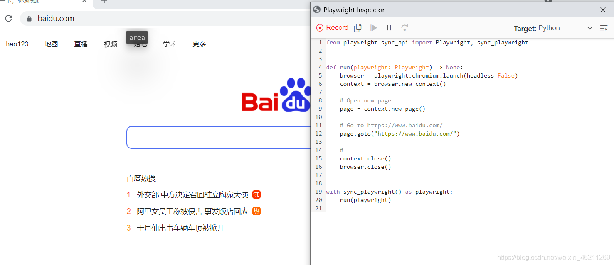
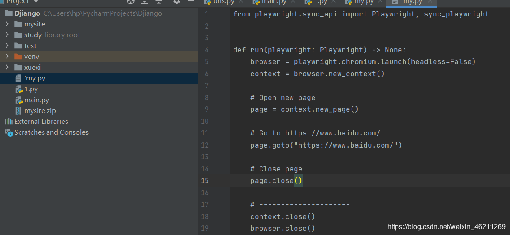
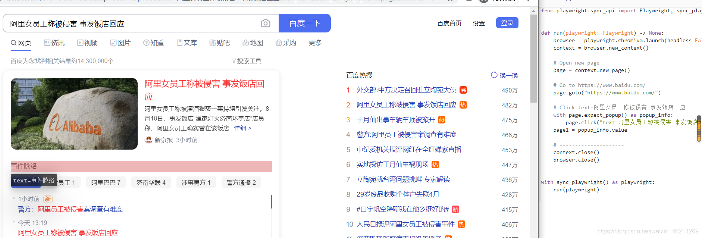
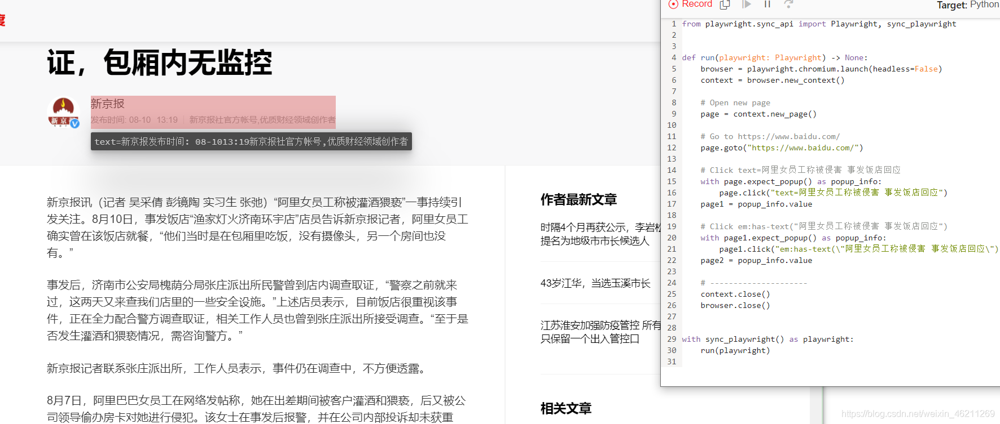
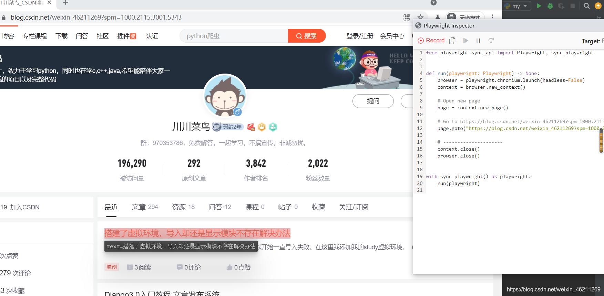
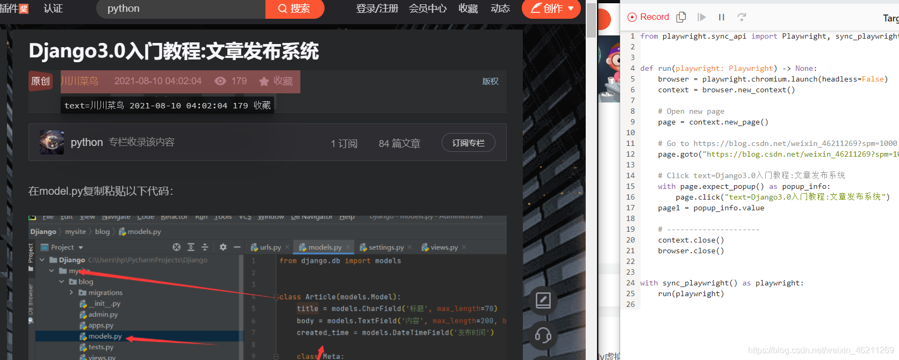
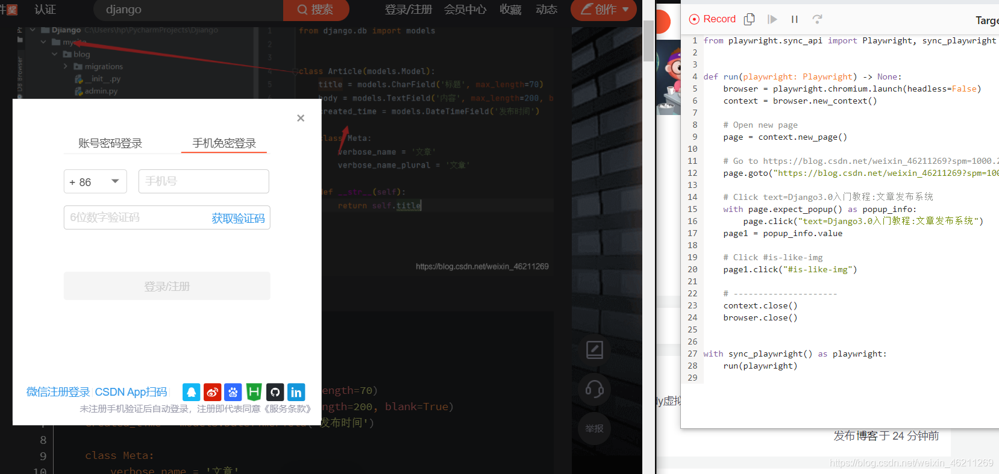

# 软件开发中的原则 - SOLID

函数名代替注释

# 自动化测试

https://developer.aliyun.com/article/835305

# 微软开源最强Python自动化神器Playwright！不用写一行代码！自动生成代码还竟然如此流畅！妈妈再也不用担心我不会写代码了！-阿里云开发者社区

Web3-Basketball,

10 min read

------

版权声明：

本文内容由阿里云实名注册用户自发贡献，版权归原作者所有，阿里云开发者社区不拥有其著作权，亦不承担相应法律责任。具体规则请查看《 [阿里云开发者社区用户服务协议](https://developer.aliyun.com/article/768092)》和 《[阿里云开发者社区知识产权保护指引](https://developer.aliyun.com/article/768093)》。如果您发现本社区中有涉嫌抄袭的内容，填写 [侵权投诉表单](https://yida.alibaba-inc.com/o/right)进行举报，一经查实，本社区将立刻删除涉嫌侵权内容。

**简介：** 微软开源最强Python自动化神器Playwright！不用写一行代码！自动生成代码还竟然如此流畅！妈妈再也不用担心我不会写代码了！

## 安装

```sh
# 安装playwright库
pip install playwright

# 安装浏览器驱动文件
python -m playwright install

#再安装
playwright install
```

要求：**python版本3.7+**

使用Playwright无需写一行代码，我们只需手动操作浏览器，它会录制我们的操作，然后自动生成代码脚本。

下面就是录制的命令codegen，仅仅一行。

```
python -m playwright codegen
```

codegen的用法可以使用–help查看，如果简单使用就是直接在命令后面加上url链接，如果有其他需要可以添加options。我就把结果粘贴出来：

```
Usage: npx playwright codegen [options] [url]

open page and generate code for user actions

Options:
  -o, --output <file name>     saves the generated script to a file
  --target <language>          language to generate, one of javascript, test, python, python-async, csharp (default: "python")
  -b, --browser <browserType>  browser to use, one of cr, chromium, ff, firefox, wk, webkit (default: "chromium")
  --channel <channel>          Chromium distribution channel, "chrome", "chrome-beta", "msedge-dev", etc
  --color-scheme <scheme>      emulate preferred color scheme, "light" or "dark"
  --device <deviceName>        emulate device, for example  "iPhone 11"
  --geolocation <coordinates>  specify geolocation coordinates, for example "37.819722,-122.478611"
  --ignore-https-errors        ignore https errors
  --load-storage <filename>    load context storage state from the file, previously saved with --save-storage
  --lang <language>            specify language / locale, for example "en-GB"
  --proxy-server <proxy>       specify proxy server, for example "http://myproxy:3128" or "socks5://myproxy:8080"
  --save-storage <filename>    save context storage state at the end, for later use with --load-storage
  --timezone <time zone>       time zone to emulate, for example "Europe/Rome"
  --timeout <timeout>          timeout for Playwright actions in milliseconds (default: "10000")
  --user-agent <ua string>     specify user agent string
  --viewport-size <size>       specify browser viewport size in pixels, for example "1280, 720"
  -h, --help                   display help for command

Examples:

  $ codegen
  $ codegen --target=python
  $ codegen -b webkit https://example.com
```

解释：

-o：将录制的脚本保存到一个文件

–target：规定生成脚本的语言，有JS和[Python](https://so.csdn.net/so/search?from=pc_blog_highlight&q=Python)，java,c#等，默认为Python

-b：指定浏览器驱动

举个例子：

比如，我要在baidu.com搜索，用chromium驱动，将结果保存为my.py的python文件。

```
python -m playwright codegen --target python -o 'my.py' -b chromium https://www.baidu.com
```



这就自动生成文件：



现在我还得改个名。大家可以试试。

当你在浏览器继续点击，他会继续更新生成新的代码：

这次我们执行下命令：

```
python -m playwright codegen --target python -o 'my.py' -b chromium https://www.baidu.comom
```

点击一下，代码就自动更新：



再点击一下，代码还会继续更新：



结束后自动关闭浏览器，保存生成的自动化脚本到py文件如下：

```
from playwright.sync_api import Playwright, sync_playwright


def run(playwright: Playwright) -> None:
    browser = playwright.chromium.launch(headless=False)
    context = browser.new_context()

    # Open new page
    page = context.new_page()

    # Go to https://www.baidu.com/
    page.goto("https://www.baidu.com/")

    # Click text=阿里女员工称被侵害 事发饭店回应
    with page.expect_popup() as popup_info:
        page.click("text=阿里女员工称被侵害 事发饭店回应")
    page1 = popup_info.value

    # Click em:has-text("阿里女员工称被侵害 事发饭店回应")
    with page1.expect_popup() as popup_info:
        page1.click("em:has-text(\"阿里女员工称被侵害 事发饭店回应\")")
    page2 = popup_info.value

    # Close page
    page2.close()

    # Close page
    page1.close()

    # Close page
    page.close()

    # ---------------------
    context.close()
    browser.close()


with sync_playwright() as playwright:
    run(playwright)
```

playwright还提供了同步和异步的API接口，这里也有官方文档，如果你英文还可以，可以参考文档：

```
https://playwright.dev/python/docs/intro/
```

这里我继续演示一个例子。

我就以访问我的CSDN为例子，我则需要在terminal执行以下命令：

```
python -m playwright codegen --target python -o 'my.py' -b chromium https://blog.csdn.net/weixin_46211269?spm=1000.2115.3001.5343
```

回车即可开始神操作！


看效果，我多贴几个演示这个动态过程：



我点击了一下一篇文章，代码也跟着自动更新：



那么我还想再给自己点个赞，似乎被发现了猫腻？那我就用手机扫码登录，因为这是新的浏览器，没有登陆历史，所以这是正常的。



登陆了，我就给自己点了一个赞，代码也同时更新了我点赞的部分。

手残，点了一下图片，他还是把代码加了一部分来点击照片，下面是‘my.py’新的代码：

```
from playwright.sync_api import Playwright, sync_playwright


def run(playwright: Playwright) -> None:
    browser = playwright.chromium.launch(headless=False)
    context = browser.new_context()

    # Open new page
    page = context.new_page()

    # Go to https://blog.csdn.net/weixin_46211269?spm=1000.2115.3001.5343
    page.goto("https://blog.csdn.net/weixin_46211269?spm=1000.2115.3001.5343")

    # Click text=Django3.0入门教程:文章发布系统
    with page.expect_popup() as popup_info:
        page.click("text=Django3.0入门教程:文章发布系统")
    page1 = popup_info.value

    # Click #is-like-img
    page1.click("#is-like-img")

    # Click text=CSDN App扫码
    page1.frame(name="passport_iframe").click("text=CSDN App扫码")

    # Go to https://blog.csdn.net/weixin_46211269/article/details/119553344?spm=1001.2014.3001.5501
    page1.goto("https://blog.csdn.net/weixin_46211269/article/details/119553344?spm=1001.2014.3001.5501")

    # Click text=0 点赞 >> a
    page1.click("text=0 点赞 >> a")

    # Click img[alt="在这里插入图片描述"]
    page1.click("img[alt=\"在这里插入图片描述\"]", button="right")

    # Click text=在model.py复制粘贴以下代码：
    page1.click("text=在model.py复制粘贴以下代码：")

    # Click .imgViewDom img
    page1.click(".imgViewDom img")

    # Close page
    page1.close()

    # Close page
    page.close()

    # ---------------------
    context.close()
    browser.close()


with sync_playwright() as playwright:
    run(playwright)
```

你可以把文件名引号去掉，用这个代码运行，他则会执行相同的操作。

**那么大家是不是还好奇如何分别使用同步和异步？**

那么问题来了，我先贴个我的群：970353786hhhh继续发车

由于这个生成代码如此之快，万一被发现怎么办？于是我想让他慢一点，比如这个火狐浏览器，使用slow_mo让他慢下来，而不能再用timeout,也不能用time . sleep (5) 来休息，而是可以用page.wait_for_timeout (5000)来代替，headless=False则表示无头模式

```
firefox.launch(headless=False, slow_mo=50)
```

直接说哦异步，因为同步我们已经写的太多了，如下就是异步的最简demo

```
import asyncio
from playwright.async_api import async_playwright

async def main():
    async with async_playwright() as p:
        browser = await p.chromium.launch(headless=False)
        await browser.close()

asyncio.run(main())
```

浏览器环境中也可以用来模拟多页场景涉及到移动设备,权限,语言环境和配色方案.比如：

```
import asyncio
from playwright.async_api import async_playwright

async def main():
    async with async_playwright() as p:
        iphone_11 = p.devices['iPhone 11 Pro']
        browser = await p.chromium.launch()
        context = await browser.new_context(
            **iphone_11,
            locale='de-DE',
            geolocation={ 'longitude': 12.492507, 'latitude': 41.889938 },
            permissions=['geolocation'],
            color_scheme='dark',
        )
        page = await browser.new_page()
        await browser.close()

asyncio.run(main())
```

浏览器中可以有多个页面。 一个 页面 是指一个标签或一个弹出窗口在浏览器中上下文。 它应该被用来导航到url页面内容并与之交互。比如以下代码，这是demo,你得根据你需要的网址进行修改，example.com则为demo

```
page = await context.new_page()

# Navigate explicitly, similar to entering a URL in the browser.
await page.goto('http://example.com')
# Fill an input.
await page.fill('#search', 'query')

# Navigate implicitly by clicking a link.
await page.click('#submit')
# Expect a new url.
print(page.url)

# Page can navigate from the script - this will be picked up by Playwright.
# window.location.href = 'https://example.com'
```

操作实在太多，不再继续演示了，如果你英文可以，可以看看上面的参考文档，这工具也是实在牛逼，爽爆了！

[](https://developer.aliyun.com/topic/chrome-extension)

相关文章

[分别用python和go语言来实现的风靡一时的2048 游戏，包含完整代码](https://developer.aliyun.com/article/1316830)

@[TOC](目录) 2048 游戏实现主要包括以下几个步骤： 1. 创建一个棋盘，通常使用二维列表表示。 2. 实现棋子的移动规则，左移、右移、上移、下移。 3. 判断游戏是否结束，即棋盘是否已满或者无空位可移动。 4. 实现游戏界面的显示。 # 1、Python实现 下面是一个简单的 Python 实现示例，运行效果如下： ```python import pygame import sys import random # 初始化 pygame pygame.init() # 设置屏幕大小 screen_size = (80

# pip源

腾讯

```sh
pip config set global.index-url http://mirrors.cloud.tencent.com/pypi/simple
pip config set global.trusted-host mirrors.cloud.tencent.com
```

阿里

```sh
pip config set global.index-url http://mirrors.aliyun.com/pypi/simple
pip config set global.trusted-host mirrors.aliyun.com
```

清华

```shell
pip config set global.index-url http://pypi.tuna.tsinghua.edu.cn/simple
pip config set global.trusted-host pypi.tuna.tsinghua.edu.cn
```


# conda源

```sh
conda config --add channels https://mirrors.tuna.tsinghua.edu.cn/anaconda/pkgs/free/
conda config --add channels https://mirrors.tuna.tsinghua.edu.cn/anaconda/pkgs/main/
conda config --add channels https://mirrors.tuna.tsinghua.edu.cn/anaconda/cloud/pytorch/
conda config --add channels https://mirrors.tuna.tsinghua.edu.cn/anaconda/cloud/conda-forge/
conda config --set show_channel_urls yes
```


# tensorflow

# [Tensorflow和Keras版本对照表](https://www.cnblogs.com/-yhwu/p/14619541.html)

**Tensorflow和Keras版本对应关系**

**二者对应版本号如表所示（Keras新版本对Tensorflow老版本不兼容，需注意安装版本号）**

 


| Framework       | Env name (--env parameter) | Description                                    | Docker Image                                                 | Packages and Nvidia Settings                                 |
| --------------- | -------------------------- | ---------------------------------------------- | ------------------------------------------------------------ | ------------------------------------------------------------ |
| TensorFlow 2.2  | tensorflow-2.2             | TensorFlow 2.2.0 + Keras 2.3.1 on Python 3.7.  | [floydhub/tensorflow](https://hub.docker.com/r/floydhub/tensorflow/) | [TensorFlow-2.2](https://docs.floydhub.com/guides/tensorflow/#tensorflow-22) |
| TensorFlow 2.1  | tensorflow-2.1             | TensorFlow 2.1.0 + Keras 2.3.1 on Python 3.6.  | [floydhub/tensorflow](https://hub.docker.com/r/floydhub/tensorflow/) | [TensorFlow-2.1](https://docs.floydhub.com/guides/tensorflow/#tensorflow-21) |
| TensorFlow 2.0  | tensorflow-2.0             | TensorFlow 2.0.0 + Keras 2.3.1 on Python 3.6.  | [floydhub/tensorflow](https://hub.docker.com/r/floydhub/tensorflow/) | [TensorFlow-2.0](https://docs.floydhub.com/guides/tensorflow/#tensorflow-20) |
| TensorFlow 1.15 | tensorflow-1.15            | TensorFlow 1.15.0 + Keras 2.3.1 on Python 3.6. | [floydhub/tensorflow](https://hub.docker.com/r/floydhub/tensorflow/) | [TensorFlow-1.15](https://docs.floydhub.com/guides/tensorflow/#tensorflow-115) |
| TensorFlow 1.14 | tensorflow-1.14            | TensorFlow 1.14.0 + Keras 2.2.5 on Python 3.6. | [floydhub/tensorflow](https://hub.docker.com/r/floydhub/tensorflow/) | [TensorFlow-1.14](https://docs.floydhub.com/guides/tensorflow/#tensorflow-114) |
| TensorFlow 1.13 | tensorflow-1.13            | TensorFlow 1.13.0 + Keras 2.2.4 on Python 3.6. | [floydhub/tensorflow](https://hub.docker.com/r/floydhub/tensorflow/) | [TensorFlow-1.13](https://docs.floydhub.com/guides/tensorflow/#tensorflow-113) |
| TensorFlow 1.12 | tensorflow-1.12            | TensorFlow 1.12.0 + Keras 2.2.4 on Python 3.6. | [floydhub/tensorflow](https://hub.docker.com/r/floydhub/tensorflow/) | [TensorFlow-1.12](https://docs.floydhub.com/guides/tensorflow/#tensorflow-112) |
|                 | tensorflow-1.12:py2        | TensorFlow 1.12.0 + Keras 2.2.4 on Python 2.   | [floydhub/tensorflow](https://hub.docker.com/r/floydhub/tensorflow/) |                                                              |
| TensorFlow 1.11 | tensorflow-1.11            | TensorFlow 1.11.0 + Keras 2.2.4 on Python 3.6. | [floydhub/tensorflow](https://hub.docker.com/r/floydhub/tensorflow/) | [TensorFlow-1.11](https://docs.floydhub.com/guides/tensorflow/#tensorflow-111) |
|                 | tensorflow-1.11:py2        | TensorFlow 1.11.0 + Keras 2.2.4 on Python 2.   | [floydhub/tensorflow](https://hub.docker.com/r/floydhub/tensorflow/) |                                                              |
| TensorFlow 1.10 | tensorflow-1.10            | TensorFlow 1.10.0 + Keras 2.2.0 on Python 3.6. | [floydhub/tensorflow](https://hub.docker.com/r/floydhub/tensorflow/) | [TensorFlow-1.10](https://docs.floydhub.com/guides/tensorflow/#tensorflow-110) |
|                 | tensorflow-1.10:py2        | TensorFlow 1.10.0 + Keras 2.2.0 on Python 2.   | [floydhub/tensorflow](https://hub.docker.com/r/floydhub/tensorflow/) |                                                              |
| TensorFlow 1.9  | tensorflow-1.9             | TensorFlow 1.9.0 + Keras 2.2.0 on Python 3.6.  | [floydhub/tensorflow](https://hub.docker.com/r/floydhub/tensorflow/) | [TensorFlow-1.9](https://docs.floydhub.com/guides/tensorflow/#tensorflow-19) |
|                 | tensorflow-1.9:py2         | TensorFlow 1.9.0 + Keras 2.2.0 on Python 2.    | [floydhub/tensorflow](https://hub.docker.com/r/floydhub/tensorflow/) |                                                              |
| TensorFlow 1.8  | tensorflow-1.8             | TensorFlow 1.8.0 + Keras 2.1.6 on Python 3.6.  | [floydhub/tensorflow](https://hub.docker.com/r/floydhub/tensorflow/) | [TensorFlow-1.8](https://docs.floydhub.com/guides/tensorflow/#tensorflow-18) |
|                 | tensorflow-1.8:py2         | TensorFlow 1.8.0 + Keras 2.1.6 on Python 2.    | [floydhub/tensorflow](https://hub.docker.com/r/floydhub/tensorflow/) |                                                              |
| TensorFlow 1.7  | tensorflow-1.7             | TensorFlow 1.7.0 + Keras 2.1.6 on Python 3.6.  | [floydhub/tensorflow](https://hub.docker.com/r/floydhub/tensorflow/) | [TensorFlow-1.7](https://docs.floydhub.com/guides/tensorflow/#tensorflow-17) |
|                 | tensorflow-1.7:py2         | TensorFlow 1.7.0 + Keras 2.1.6 on Python 2.    | [floydhub/tensorflow](https://hub.docker.com/r/floydhub/tensorflow/) |                                                              |
| TensorFlow 1.5  | tensorflow-1.5             | TensorFlow 1.5.0 + Keras 2.1.6 on Python 3.6.  | [floydhub/tensorflow](https://hub.docker.com/r/floydhub/tensorflow/) | [TensorFlow-1.5](https://docs.floydhub.com/guides/tensorflow/#tensorflow-15) |
|                 | tensorflow-1.5:py2         | TensorFlow 1.5.0 + Keras 2.1.6 on Python 2.    | [floydhub/tensorflow](https://hub.docker.com/r/floydhub/tensorflow/) |                                                              |
| TensorFlow 1.4  | tensorflow-1.4             | TensorFlow 1.4.0 + Keras 2.0.8 on Python 3.6.  | [floydhub/tensorflow](https://hub.docker.com/r/floydhub/tensorflow/) |                                                              |
|                 | tensorflow-1.4:py2         | TensorFlow 1.4.0 + Keras 2.0.8 on Python 2.    | [floydhub/tensorflow](https://hub.docker.com/r/floydhub/tensorflow/) |                                                              |
| TensorFlow 1.3  | tensorflow-1.3             | TensorFlow 1.3.0 + Keras 2.0.6 on Python 3.6.  | [floydhub/tensorflow](https://hub.docker.com/r/floydhub/tensorflow/) |                                                              |
|                 | tensorflow-1.3:py2         | TensorFlow 1.3.0 + Keras 2.0.6 on Python 2.    | [floydhub/tensorflow](https://hub.docker.com/r/floydhub/tensorflow/) |                                                              |
| TensorFlow 1.2  | tensorflow-1.2             | TensorFlow 1.2.0 + Keras 2.0.6 on Python 3.5.  | [floydhub/tensorflow](https://hub.docker.com/r/floydhub/tensorflow/) |                                                              |
|                 | tensorflow-1.2:py2         | TensorFlow 1.2.0 + Keras 2.0.6 on Python 2.    | [floydhub/tensorflow](https://hub.docker.com/r/floydhub/tensorflow/) |                                                              |
| TensorFlow 1.1  | tensorflow                 | TensorFlow 1.1.0 + Keras 2.0.6 on Python 3.5.  | [floydhub/tensorflow](https://hub.docker.com/r/floydhub/tensorflow/) |                                                              |
|                 | tensorflow:py2             | TensorFlow 1.1.0 + Keras 2.0.6 on Python 2.    | [floydhub/tensorflow](https://hub.docker.com/r/floydhub/tensorflow/) |                                                              |
| TensorFlow 1.0  | tensorflow-1.0             | TensorFlow 1.0.0 + Keras 2.0.6 on Python 3.5.  | [floydhub/tensorflow](https://hub.docker.com/r/floydhub/tensorflow/) |                                                              |
|                 | tensorflow-1.0:py2         | TensorFlow 1.0.0 + Keras 2.0.6 on Python 2.    | [floydhub/tensorflow](https://hub.docker.com/r/floydhub/tensorflow/) |                                                              |
| TensorFlow 0.12 | tensorflow-0.12            | TensorFlow 0.12.1 + Keras 1.2.2 on Python 3.5. | [floydhub/tensorflow](https://hub.docker.com/r/floydhub/tensorflow/) |                                                              |
|                 | tensorflow-0.12:py2        | TensorFlow 0.12.1 + Keras 1.2.2 on Python 2.   | [floydhub/tensorflow](https://hub.docker.com/r/floydhub/tensorflow/) |                                                              |
| PyTorch 1.5     | pytorch-1.5                | PyTorch 1.5.0 + fastai 1.0.61 on Python 3.7.   | [floydhub/pytorch](https://hub.docker.com/r/floydhub/pytorch/) | [PyTorch-1.5](https://docs.floydhub.com/guides/pytorch/#pytorch-15) |
| PyTorch 1.4     | pytorch-1.4                | PyTorch 1.4.0 + fastai 1.0.60 on Python 3.6.   | [floydhub/pytorch](https://hub.docker.com/r/floydhub/pytorch/) | [PyTorch-1.4](https://docs.floydhub.com/guides/pytorch/#pytorch-14) |
| PyTorch 1.3     | pytorch-1.3                | PyTorch 1.3.0 + fastai 1.0.60 on Python 3.6.   | [floydhub/pytorch](https://hub.docker.com/r/floydhub/pytorch/) | [PyTorch-1.3](https://docs.floydhub.com/guides/pytorch/#pytorch-13) |
| PyTorch 1.2     | pytorch-1.2                | PyTorch 1.2.0 + fastai 1.0.60 on Python 3.6.   | [floydhub/pytorch](https://hub.docker.com/r/floydhub/pytorch/) | [PyTorch-1.2](https://docs.floydhub.com/guides/pytorch/#pytorch-12) |
| PyTorch 1.1     | pytorch-1.1                | PyTorch 1.1.0 + fastai 1.0.57 on Python 3.6.   | [floydhub/pytorch](https://hub.docker.com/r/floydhub/pytorch/) | [PyTorch-1.1](https://docs.floydhub.com/guides/pytorch/#pytorch-11) |
| PyTorch 1.0     | pytorch-1.0                | PyTorch 1.0.0 + fastai 1.0.51 on Python 3.6.   | [floydhub/pytorch](https://hub.docker.com/r/floydhub/pytorch/) | [PyTorch-1.0](https://docs.floydhub.com/guides/pytorch/#pytorch-10) |
|                 | pytorch-1.0:py2            | PyTorch 1.0.0 on Python 2.                     | [floydhub/pytorch](https://hub.docker.com/r/floydhub/pytorch/) |                                                              |
| PyTorch 0.4     | pytorch-0.4                | PyTorch 0.4.1 on Python 3.6.                   | [floydhub/pytorch](https://hub.docker.com/r/floydhub/pytorch/) | [PyTorch-0.4](https://docs.floydhub.com/guides/pytorch/#pytorch-04) |
|                 | pytorch-0.4:py2            | PyTorch 0.4.1 on Python 2.                     | [floydhub/pytorch](https://hub.docker.com/r/floydhub/pytorch/) |                                                              |
| PyTorch 0.3     | pytorch-0.3                | PyTorch 0.3.1 on Python 3.6.                   | [floydhub/pytorch](https://hub.docker.com/r/floydhub/pytorch/) | [PyTorch-0.3](https://docs.floydhub.com/guides/pytorch/#pytorch-03) |
|                 | pytorch-0.3:py2            | PyTorch 0.3.1 on Python 2.                     | [floydhub/pytorch](https://hub.docker.com/r/floydhub/pytorch/) |                                                              |
| PyTorch 0.2     | pytorch-0.2                | PyTorch 0.2.0 on Python 3.5                    | [floydhub/pytorch](https://hub.docker.com/r/floydhub/pytorch/) |                                                              |
|                 | pytorch-0.2:py2            | PyTorch 0.2.0 on Python 2.                     | [floydhub/pytorch](https://hub.docker.com/r/floydhub/pytorch/) |                                                              |
| PyTorch 0.1     | pytorch-0.1                | PyTorch 0.1.12 on Python 3.                    | [floydhub/pytorch](https://hub.docker.com/r/floydhub/pytorch/) |                                                              |
|                 | pytorch-0.1:py2            | PyTorch 0.1.12 on Python 2.                    | [floydhub/pytorch](https://hub.docker.com/r/floydhub/pytorch/) |                                                              |
| Theano 0.9      | theano-0.9                 | Theano rel-0.8.2 + Keras 2.0.3 on Python3.5.   | [floydhub/theano](https://hub.docker.com/r/floydhub/theano/) |                                                              |
|                 | theano-0.9:py2             | Theano rel-0.8.2 + Keras 2.0.3 on Python2.     | [floydhub/theano](https://hub.docker.com/r/floydhub/theano/) |                                                              |
| Caffe           | caffe                      | Caffe rc4 on Python3.5.                        | [floydhub/caffe](https://hub.docker.com/r/floydhub/caffe/)   |                                                              |
|                 | caffe:py2                  | Caffe rc4 on Python2.                          | [floydhub/caffe](https://hub.docker.com/r/floydhub/caffe/)   |                                                              |
| Torch           | torch                      | Torch 7 with Python 3 env.                     | [floydhub/torch](https://hub.docker.com/r/floydhub/torch/)   |                                                              |
|                 | torch:py2                  | Torch 7 with Python 2 env.                     | [floydhub/torch](https://hub.docker.com/r/floydhub/torch/)   |                                                              |
| Chainer 1.23    | chainer-1.23               | Chainer 1.23.0 on Python 3.                    | [floydhub/chainer](https://hub.docker.com/r/floydhub/chainer/) |                                                              |
|                 | chainer-1.23:py2           | Chainer 1.23.0 on Python 2.                    | [floydhub/chainer](https://hub.docker.com/r/floydhub/chainer/) |                                                              |
| Chainer 2.0     | chainer-2.0                | Chainer 1.23.0 on Python 3.                    | [floydhub/chainer](https://hub.docker.com/r/floydhub/chainer/) |                                                              |
|                 | chainer-2.0:py2            | Chainer 1.23.0 on Python 2.                    | [floydhub/chainer](https://hub.docker.com/r/floydhub/chainer/) |                                                              |
| MxNet 1.0       | mxnet                      | MxNet 1.0.0 on Python 3.6.                     | [floydhub/mxnet](https://hub.docker.com/r/floydhub/mxnet/)   |                                                              |
|                 | mxnet:py2                  | MxNet 1.0.0 on Python 2.                       | [floydhub/mxnet](https://hub.docker.com/r/floydhub/mxnet/)   |                                                              |


# pip源

```bash
# 清华源
pip config set global.index-url https://pypi.tuna.tsinghua.edu.cn/simple

# 或：
# 阿里源
pip config set global.index-url https://mirrors.aliyun.com/pypi/simple/
# 腾讯源
pip config set global.index-url http://mirrors.cloud.tencent.com/pypi/simple
# 豆瓣源
pip config set global.index-url http://pypi.douban.com/simple/
```

# 【乾貨】Python3.x：第三方庫簡介

語言: [CN](https://www.mdeditor.tw/pl/g8cT) / [TW](https://www.mdeditor.tw/pl/g8cT/zh-tw) / [HK](https://www.mdeditor.tw/pl/g8cT/zh-hk)

時間 2021-01-25 18:01:27 [程序員霖霖](https://www.mdeditor.tw/pla/程序員霖霖)

主題: [django ](https://www.mdeditor.tw/plt/django)[flask ](https://www.mdeditor.tw/plt/flask)[mysql ](https://www.mdeditor.tw/plt/mysql)[oauth ](https://www.mdeditor.tw/plt/oauth)[javascript ](https://www.mdeditor.tw/plt/javascript)[機器學習 ](https://www.mdeditor.tw/plt/機器學習)[qt ](https://www.mdeditor.tw/plt/qt)[redis ](https://www.mdeditor.tw/plt/redis)[pyramid ](https://www.mdeditor.tw/plt/pyramid)[wsgi](https://www.mdeditor.tw/plt/wsgi)


# 编译


```shell
export LC_CTYPE=en_US.UTF-8
```

```shell
./configure --prefix=/usr/local/python3 --with-openssl=/usr/local/openssl

```


## 環境管理

管理 Python 版本和環境的工具

* p – 非常簡單的交互式 python 版本管理工具。
* pyenv – 簡單的 Python 版本管理工具。
* Vex – 可以在虛擬環境中執行命令。
* virtualenv – 創建獨立 Python 環境的工具。
* virtualenvwrapper- virtualenv 的一組擴展。


## 包管理

管理包和依賴的工具。

* pip – Python 包和依賴關係管理工具。
* pip-tools – 保證 Python 包依賴關係更新的一組工具。
* conda – 跨平台，Python 二進制包管理工具。
* Curdling – 管理 Python 包的命令行工具。
* wheel – Python 分發的新標準，意在取代 eggs。


## 包倉庫

本地 PyPI 倉庫服務和代理。

* warehouse – 下一代 PyPI。
* Warehousebandersnatch – PyPA 提供的 PyPI 鏡像工具。
* devpi – PyPI 服務和打包/測試/分發工具。
* localshop – 本地 PyPI 服務（自定義包並且自動對 PyPI 鏡像）。


## 分發

打包為可執行文件以便分發。

* PyInstaller – 將 Python 程序轉換成獨立的執行文件（跨平台）。
* dh-virtualenv – 構建並將 virtualenv 虛擬環境作為一個 Debian 包來發布。
* Nuitka – 將腳本、模塊、包編譯成可執行文件或擴展模塊。
* py2app – 將 Python 腳本變為獨立軟件包（Mac OS X）。
* py2exe – 將 Python 腳本變為獨立軟件包（Windows）。
* pynsist – 一個用來創建 Windows 安裝程序的工具，可以在安裝程序中打包 Python本身。


## 構建工具

將源碼編譯成軟件。

* buildout – 一個構建系統，從多個組件來創建，組裝和部署應用。
* BitBake – 針對嵌入式 Linux 的類似 make 的構建工具。
* fabricate – 對任何語言自動找到依賴關係的構建工具。
* PlatformIO – 多平台命令行構建工具。
* PyBuilder – 純 Python 實現的持續化構建工具。
* SCons – 軟件構建工具。


## 交互式解析器

交互式 Python 解析器。

* IPython – 功能豐富的工具，非常有效的使用交互式 Python。
* bpython- 界面豐富的 Python 解析器。
* ptpython – 高級交互式Python解析器， 構建於python-prompt-toolkit 之上。


## 文件

文件管理和 MIME（多用途的網際郵件擴充協議）類型檢測。

* imghdr – （Python 標準庫）檢測圖片類型。
* mimetypes – （Python 標準庫）將文件名映射為 MIME 類型。
* path.py – 對 os.path 進行封裝的模塊。
* pathlib – （Python3.4+ 標準庫）跨平台的、面向對象的路徑操作庫。
* python-magic- 文件類型檢測的第三方庫 libmagic 的 Python 接口。
* Unipath- 用面向對象的方式操作文件和目錄
* watchdog – 管理文件系統事件的 API 和 shell 工具


## 日期和時間

操作日期和時間的類庫。

* arrow- 更好的 Python 日期時間操作類庫。
* Chronyk – Python 3 的類庫，用於解析手寫格式的時間和日期。
* dateutil – Python datetime 模塊的擴展。
* delorean- 解決 Python 中有關日期處理的棘手問題的庫。
* moment – 一個用來處理時間和日期的Python庫。靈感來自於Moment.js。
* PyTime – 一個簡單易用的Python模塊，用於通過字符串來操作日期/時間。
* pytz – 現代以及歷史版本的世界時區定義。將時區數據庫引入Python。
* when.py – 提供用户友好的函數來幫助用户進行常用的日期和時間操作。


## 文本處理

用於解析和操作文本的庫。

* 

  ### 通用

* chardet – 字符編碼檢測器，兼容 Python2 和 Python3。

* difflib – (Python 標準庫)幫助我們進行差異化比較。

* ftfy – 讓Unicode文本更完整更連貫。

* fuzzywuzzy – 模糊字符串匹配。

* Levenshtein – 快速計算編輯距離以及字符串的相似度。

* pangu.py – 在中日韓語字符和數字字母之間添加空格。

* pyfiglet -figlet 的 Python實現。

* shortuuid – 一個生成器庫，用以生成簡潔的，明白的，URL 安全的 UUID。

* unidecode – Unicode 文本的 ASCII 轉換形式 。

* uniout – 打印可讀的字符，而不是轉義的字符串。

* xpinyin – 一個用於把漢字轉換為拼音的庫。

* 

  ### Slug化

* awesome-slugify – 一個 Python slug 化庫，可以保持 Unicode。

* python-slugify – Python slug 化庫，可以把 unicode 轉化為 ASCII。

* unicode-slugify – 一個 slug 工具，可以生成 unicode slugs ,需要依賴 Django 。

* 

  ### 解析器

* phonenumbers – 解析，格式化，儲存，驗證電話號碼。

* PLY – lex 和 yacc 解析工具的 Python 實現。

* Pygments – 通用語法高亮工具。

* pyparsing – 生成通用解析器的框架。

* python-nameparser – 把一個人名分解為幾個獨立的部分。

* python-user-agents – 瀏覽器 user agent 解析器。

* sqlparse – 一個無驗證的 SQL 解析器。


### 特殊文本格式處理

一些用來解析和操作特殊文本格式的庫。

* 

  ### 通用

* tablib – 一個用來處理中表格數據的模塊。

* 

  ### Office

* Marmir – 把輸入的Python 數據結構轉換為電子表單。

* openpyxl – 一個用來讀寫 Excel 2010 xlsx/xlsm/xltx/xltm 文件的庫。

* python-docx – 讀取，查詢以及修改 Microsoft Word 2007/2008 docx 文件。

* unoconv – 在 LibreOffice/OpenOffice 支持的任意文件格式之間進行轉換。

* XlsxWriter – 一個用於創建 Excel .xlsx 文件的 Python 模塊。

* xlwings – 一個使得在 Excel 中方便調用 Python 的庫（反之亦然），基於 BSD 協議。

* xlwt / xlrd – 讀寫 Excel 文件的數據和格式信息。

* relatorio – 模板化OpenDocument 文件。

* 

  ### PDF

* PDFMiner – 一個用於從PDF文檔中抽取信息的工具。

* PyPDF2 – 一個可以分割，合併和轉換 PDF 頁面的庫。

* ReportLab – 快速創建富文本 PDF 文檔。

* Markdown

* Mistune – 快速並且功能齊全的純 Python 實現的 Markdown 解析器。

* Python-Markdown – John Gruber’s Markdown 的 Python 版實現。

* 

  ### YAML

* PyYAML – Python 版本的 YAML 解析器。

* 

  ### CSV

* csvkit – 用於轉換和操作 CSV 的工具。

* 

  ### Archive

* unp – 一個用來方便解包歸檔文件的命令行工具。


## 自然語言處理

用來處理人類語言的庫。

* NLTK – 一個先進的平台，用以構建處理人類語言數據的 Python 程序。
* jieba – 中文分詞工具。
* langid.py – 獨立的語言識別系統。
* Pattern – Python 網絡信息挖掘模塊。
* SnowNLP – 一個用來處理中文文本的庫。
* TextBlob – 為進行普通自然語言處理任務提供一致的 API。
* TextGrocery – 一簡單高效的短文本分類工具，基於 LibLinear 和 Jieba。


## 文檔

用以生成項目文檔的庫。

* Sphinx – Python 文檔生成器。
* awesome-sphinxdoc
* MkDocs – 對 Markdown 友好的文檔生成器。
* pdoc – 一個可以替換Epydoc 的庫，可以自動生成 Python 庫的 API 文檔。
* Pycco – 文學編程（literate-programming）風格的文檔生成器。


## 配置

用來保存和解析配置的庫。

* config – logging 模塊作者寫的分級配置模塊。
* ConfigObj – INI 文件解析器，帶驗證功能。
* ConfigParser – (Python 標準庫) INI 文件解析器。
* profig – 通過多種格式進行配置，具有數值轉換功能。
* python-decouple – 將設置和代碼完全隔離。


## 命令行工具

用於創建命令行程序的庫。

* 

  ### 命令行程序開發

* cement – Python 的命令行程序框架。

* click – 一個通過組合的方式來創建精美命令行界面的包。

* cliff – 一個用於創建命令行程序的框架，可以創建具有多層命令的命令行程序。

* clint – Python 命令行程序工具。

* colorama – 跨平台彩色終端文本。

* docopt – Python 風格的命令行參數解析器。

* Gooey – 一條命令，將命令行程序變成一個 GUI 程序。

* python-prompt-toolkit – 一個用於構建強大的交互式命令行程序的庫。

* 

  ### 生產力工具

* aws-cli – Amazon Web Services 的通用命令行界面。

* bashplotlib – 在終端中進行基本繪圖。

* caniusepython3 – 判斷是哪個項目妨礙你你移植到 Python 3。

* cookiecutter – 從 cookiecutters（項目模板）創建項目的一個命令行工具。

* doitlive – 一個用來在終端中進行現場演示的工具。

* howdoi – 通過命令行獲取即時的編程問題解答。

* httpie – 一個命令行HTTP 客户端，cURL 的替代品，易用性更好。

* PathPicker – 從bash輸出中選出文件。

* percol – 向UNIX shell 傳統管道概念中加入交互式選擇功能。

* SAWS – 一個加強版的 AWS 命令行。

* thefuck – 修正你之前的命令行指令。

* mycli – 一個 MySQL 命令行客户端，具有自動補全和語法高亮功能。

* pgcli – Postgres 命令行工具，具有自動補全和語法高亮功能。


## 下載器

用來進行下載的庫.

* s3cmd – 一個用來管理Amazon S3 和 CloudFront 的命令行工具。
* s4cmd – 超級 S3 命令行工具，性能更加強勁。
* you-get – 一個 YouTube/Youku/Niconico 視頻下載器，使用 Python3 編寫。
* youtube-dl – 一個小巧的命令行程序，用來下載 YouTube 視頻。


## 圖像處理

用來操作圖像的庫.

* pillow – Pillow 是一個更加易用版的 PIL。
* hmap – 圖像直方圖映射。
* imgSeek – 一個使用視覺相似性搜索一組圖片集合的項目。
* nude.py – 裸體檢測。
* pyBarcode – 不借助 PIL 庫在 Python 程序中生成條形碼。
* pygram – 類似 Instagram 的圖像濾鏡。
* python-qrcode – 一個純 Python 實現的二維碼生成器。
* Quads – 基於四叉樹的計算機藝術。
* scikit-image – 一個用於（科學）圖像處理的 Python 庫。
* thumbor – 一個小型圖像服務，具有剪裁，尺寸重設和翻轉功能。
* wand – MagickWand的Python 綁定。MagickWand 是 ImageMagick的 C API 。


## OCR

光學字符識別庫。

* pyocr – Tesseract 和 Cuneiform 的一個封裝(wrapper)。
* pytesseract – Google Tesseract OCR 的另一個封裝(wrapper)。
* python-tesseract – Google Tesseract OCR 的一個包裝類。


## 音頻

用來操作音頻的庫

* audiolazy -Python 的數字信號處理包。
* audioread – 交叉庫 (GStreamer + Core Audio + MAD + FFmpeg) 音頻解碼。
* beets – 一個音樂庫管理工具及 MusicBrainz 標籤添加工具
* dejavu – 音頻指紋提取和識別
* django-elastic-transcoder – Django + Amazon Elastic Transcoder。
* eyeD3 – 一個用來操作音頻文件的工具，具體來講就是包含 ID3 元信息的 MP3 文件。
* id3reader – 一個用來讀取 MP3 元數據的 Python 模塊。
* m3u8 – 一個用來解析 m3u8 文件的模塊。
* mutagen – 一個用來處理音頻元數據的 Python 模塊。
* pydub – 通過簡單、簡潔的高層接口來操作音頻文件。
* pyechonest – Echo Nest API 的 Python 客户端
* talkbox – 一個用來處理演講/信號的 Python 庫
* TimeSide – 開源 web 音頻處理框架。
* tinytag – 一個用來讀取MP3, OGG, FLAC 以及 Wave 文件音樂元數據的庫。
* mingus – 一個高級音樂理論和曲譜包，支持 MIDI 文件和回放功能。


## 視頻

用來操作視頻和GIF的庫。

* moviepy – 一個用來進行基於腳本的視頻編輯模塊，適用於多種格式，包括動圖 GIFs。
* scikit-video – SciPy 視頻處理常用程序。


## 地理位置

地理編碼地址以及用來處理經緯度的庫。

* GeoDjango – 世界級地理圖形 web 框架。
* GeoIP – MaxMind GeoIP Legacy 數據庫的 Python API。
* geojson – GeoJSON 的 Python 綁定及工具。
* geopy – Python 地址編碼工具箱。
* pygeoip – 純 Python GeoIP API。
* django-countries – 一個 Django 應用程序，提供用於表格的國家選擇功能，國旗圖標靜態文件以及模型中的國家字段。


## HTTP

使用HTTP的庫。

* requests – 人性化的HTTP請求庫。
* grequests – requests 庫 + gevent ，用於異步 HTTP 請求.
* httplib2 – 全面的 HTTP 客户端庫。
* treq – 類似 requests 的Python API 構建於 Twisted HTTP 客户端之上。
* urllib3 – 一個具有線程安全連接池，支持文件 post，清晰友好的 HTTP 庫。


## 數據庫

Python實現的數據庫。

* pickleDB – 一個簡單，輕量級鍵值儲存數據庫。
* PipelineDB – 流式 SQL 數據庫。
* TinyDB – 一個微型的，面向文檔型數據庫。
* ZODB – 一個 Python 原生對象數據庫。一個鍵值和對象圖數據庫。


## 數據庫驅動

用來連接和操作數據庫的庫。

* 

  ### MySQL – awesome-mysql系列

* mysql-python – Python 的 MySQL 數據庫連接器。

* mysqlclient – mysql-python 分支，支持 Python 3。

* oursql – 一個更好的 MySQL 連接器，支持原生預編譯指令和 BLOBs.

* PyMySQL – 純 Python MySQL 驅動，兼容 mysql-python。

* 

  ### PostgreSQL

* psycopg2 – Python 中最流行的 PostgreSQL 適配器。

* queries – psycopg2 庫的封裝，用來和 PostgreSQL 進行交互。

* txpostgres – 基於 Twisted 的異步 PostgreSQL 驅動。

* 

  ### 其他關係型數據庫

* apsw – 另一個 Python SQLite封裝。

* dataset – 在數據庫中存儲Python字典 – 可以協同SQLite，MySQL，和 PostgreSQL工作。

* pymssql- 一個簡單的Microsoft SQL Server數據庫接口。

* 

  ### NoSQL 數據庫

* cassandra-python-driver – Cassandra 的 Python 驅動。

* HappyBase – 一個為 Apache HBase 設計的，對開發者友好的庫。

* Plyvel – 一個快速且功能豐富的 LevelDB 的 Python 接口。

* py2neo – Neo4j restful 接口的Python 封裝客户端。

* pycassa – Cassandra 的 Python Thrift 驅動。

* PyMongo – MongoDB 的官方 Python 客户端。

* redis-py – Redis 的 Python 客户端。

* telephus – 基於 Twisted 的 Cassandra 客户端。

* txRedis – 基於 Twisted 的 Redis 客户端。


## ORM

實現對象關係映射或數據映射技術的庫。

* 

  ### 關係型數據庫

* Django Models – Django 的一部分。

* SQLAlchemy – Python SQL 工具以及對象關係映射工具。

* 

  ### awesome-sqlalchemy系列

* Peewee – 一個小巧，富有表達力的 ORM。

* PonyORM – 提供面向生成器的 SQL 接口的 ORM。

* python-sql – 編寫 Python 風格的 SQL 查詢。

* 

  ### NoSQL 數據庫

* django-mongodb-engine – Django MongoDB 後端。

* PynamoDB – Amazon DynamoDB 的一個 Python 風格接口。

* flywheel – Amazon DynamoDB 的對象映射工具。

* MongoEngine – 一個Python 對象文檔映射工具，用於 MongoDB。

* hot-redis – 為 Redis 提供 Python 豐富的數據類型。

* redisco – 一個 Python 庫，提供可以持續存在在 Redis 中的簡單模型和容器。

* 

  ### 其他

* butterdb – Google Drive 電子表格的 Python ORM。


## Web 框架

全棧 web 框架。

* Django – Python 界最流行的 web 框架。
* awesome-django系列
* Flask – 一個 Python 微型框架。
* awesome-flask系列
* Pyramid – 一個小巧，快速，接地氣的開源Python web 框架。
* awesome-pyramid系列
* Bottle – 一個快速小巧，輕量級的 WSGI 微型 web 框架。
* CherryPy – 一個極簡的 Python web 框架，服從 HTTP/1.1 協議且具有WSGI 線程池。
* TurboGears – 一個可以擴展為全棧解決方案的微型框架。
* web.py – 一個 Python 的 web 框架，既簡單，又強大。
* web2py – 一個全棧 web 框架和平台，專注於簡單易用。
* Tornado – 一個web 框架和異步網絡庫。


## 權限

允許或拒絕用户訪問數據或功能的庫。

* Carteblanche – Module to align code with thoughts of users and designers. Also magically handles navigation and permissions.
* django-guardian – Django 1.2+ 實現了單個對象權限。
* django-rules – 一個小巧但是強大的應用，提供對象級別的權限管理，且不需要使用數據庫。


## CMS

內容管理系統


* django-cms – 一個開源的，企業級 CMS，基於 Django。
* djedi-cms – 一個輕量級但卻非常強大的 Django CMS ，考慮到了插件，內聯編輯以及性能。
* FeinCMS – 基於 Django 構建的最先進的內容管理系統之一。
* Kotti – 一個高級的，Python 範的 web 應用框架，基於 Pyramid 構建。
* Mezzanine – 一個強大的，持續的，靈活的內容管理平台。
* Opps – 一個為雜誌，報紙網站以及大流量門户網站設計的 CMS 平台，基於 Django。
* Plone – 一個構建於開源應用服務器 Zope 之上的 CMS。
* Quokka – 靈活，可擴展的小型 CMS，基於 Flask 和 MongoDB。
* Wagtail – 一個 Django 內容管理系統。
* Widgy – 最新的 CMS 框架，基於 Django。


## 電子商務

用於電子商務以及支付的框架和庫。

* django-oscar – 一個用於 Django 的開源的電子商務框架。
* django-shop – 一個基於 Django 的店鋪系統。
* Cartridge – 一個基於 Mezzanine 構建的購物車應用。
* shoop – 一個基於 Django 的開源電子商務平台。
* alipay – 非官方的 Python 支付寶 API。
* merchant – 一個可以接收來自多種支付平台支付的 Django 應用。
* money – 貨幣類庫with optional CLDR-backed locale-aware formatting and an extensible currency exchange solution.
* python-currencies – 顯示貨幣格式以及它的數值。


## RESTful API

用來開發RESTful APIs的庫

* 

  ### Django

* django-rest-framework – 一個強大靈活的工具，用來構建 web API。

* django-tastypie – 為Django 應用開發API。

* django-formapi – 為 Django 的表單驗證，創建 JSON APIs 。

* 

  ### Flask

* flask-api – 為 flask 開發的，可瀏覽 Web APIs 。

* flask-restful – 為 flask 快速創建REST APIs 。

* flask-restless – 為 SQLAlchemy 定義的數據庫模型創建 RESTful APIs 。

* flask-api-utils – 為 Flask 處理 API 表示和驗證。

* eve – REST API 框架，由 Flask, MongoDB 等驅動。

* 

  ### Pyramid

* cornice – 一個Pyramid 的 REST 框架 。

* 

  ### 與框架無關的

* falcon – 一個用來建立雲 API 和 web app 後端的噶性能框架。

* sandman – 為現存的數據庫驅動系統自動創建 REST APIs 。

* restless – 框架無關的 REST 框架 ，基於從 Tastypie 學到的知識。

* ripozo – 快速創建 REST/HATEOAS/Hypermedia APIs。


## 驗證

實現驗證方案的庫。

* 

  ### OAuth

* Authomatic – 簡單但是強大的框架，身份驗證/授權客户端。

* django-allauth – Django 的驗證應用。

* django-oauth-toolkit – 為 Django 用户準備的 OAuth2。

* django-oauth2-provider – 為 Django 應用提供 OAuth2 接入。

* Flask-OAuthlib – OAuth 1.0/a, 2.0 客户端實現，供 Flask 使用。

* OAuthLib – 一個 OAuth 請求-簽名邏輯通用、 完整的實現。

* python-oauth2 – 一個完全測試的抽象接口。用來創建 OAuth 客户端和服務端。

* python-social-auth – 一個設置簡單的社會化驗證方式。

* rauth – OAuth 1.0/a, 2.0, 和 Ofly 的 Python 庫。

* sanction – 一個超級簡單的OAuth2 客户端實現。

* 

  ### 其他

* jose – JavaScript 對象簽名和加密草案的實現。

* PyJWT – JSON Web 令牌草案 01。

* python-jws – JSON Web 簽名草案 02 的實現。

* python-jwt – 一個用來生成和驗證 JSON Web 令牌的模塊。


## 模板引擎

模板生成和詞法解析的庫和工具。

* Jinja2 – 一個現代的，對設計師友好的模板引擎。
* Chameleon – 一個 HTML/XML 模板引擎。 模仿了 ZPT（Zope Page Templates）, 進行了速度上的優化。
* Genshi – Python 模板工具，用以生成 web 感知的結果。
* Mako – Python 平台的超高速輕量級模板。


## Queue

處理事件以及任務隊列的庫。

* celery – 一個異步任務隊列/作業隊列，基於分佈式消息傳遞。
* huey – 小型多線程任務隊列。
* mrq – Mr. Queue -一個 Python 的分佈式 worker 任務隊列， 使用 Redis 和 gevent。
* rq – 簡單的 Python 作業隊列。
* simpleq – 一個簡單的，可無限擴張的，基於亞馬遜 SQS 的隊列。


## 搜索

對數據進行索引和執行搜索查詢的庫和軟件。

* django-haystack – Django 模塊化搜索。
* elasticsearch-py – Elasticsearch 的官方底層 Python 客户端。
* elasticsearch-dsl-py -Elasticsearch 的官方高級 Python 客户端。
* solrpy – solr的 Python 客户端。
* Whoosh – 一個快速的純 Python 搜索引擎庫。


## 動態消息

用來創建用户活動的庫。

* django-activity-stream – 從你的站點行為中生成通用活動信息流。
* Stream-Framework – 使用 Cassandra 和 Redis 創建動態消息和通知系統。


## 資源管理

管理、壓縮、縮小網站資源的工具。

* django-compressor – 將鏈接和內聯的 JavaScript 或 CSS 壓縮到一個單獨的緩存文件中。
* django-storages – 一個針對 Django 的自定義存儲後端的工具集合。
* fanstatic – 打包、優化，並且把靜態文件依賴作為 Python 的包來提供。
* File Conveyor – 一個後台駐留的程序，用來發現和同步文件到 CDNs, S3 和 FTP。
* Flask-Assets – 幫你將 web 資源整合到你的 Flask app 中。
* jinja-assets-compressor – 一個 Jinja 擴展，用來編譯和壓縮你的資源。
* webassets – 為你的靜態資源打包、優化和管理生成獨一無二的緩存 URL。


## 緩存

緩存數據的庫。

* Beaker – 一個緩存和會話庫，可以用在 web 應用和獨立 Python腳本和應用上。
* django-cache-machine – Django 模型的自動緩存和失效。
* django-cacheops- 具有自動顆粒化事件驅動失效功能的 ORM。
* django-viewlet – 渲染模板，同時具有額外的緩存控制功能。
* dogpile.cache – dogpile.cache 是 Beaker 的下一代替代品，由同一作者開發。
* HermesCache – Python 緩存庫，具有基於標籤的失效和 dogpile effect 保護功能。
* johnny-cache – django應用緩存框架。
* pylibmc – libmemcached 接口的 Python 封裝。


## 電子郵件

用來發送和解析電子郵件的庫。

* django-celery-ses – 帶有 AWS SES 和 Celery 的 Django email 後端。
* envelopes – 供人類使用的電子郵件庫。
* flanker – 一個 email 地址和 Mime 解析庫。
* imbox – Python IMAP 庫
* inbox.py – Python SMTP 服務器。
* inbox – 一個開源電子郵件工具箱。
* lamson – Python 風格的 SMTP 應用服務器。
* mailjet – Mailjet API 實現，用來提供批量發送郵件，統計等功能。
* marrow.mailer – 高性能可擴展郵件分發框架。
* modoboa – 一個郵件託管和管理平台，具有現代的、簡約的 Web UI。
* pyzmail – 創建，發送和解析電子郵件。
* Talon – Mailgun 庫，用來抽取信息和簽名。


## 國際化

用來進行國際化的庫。

* Babel – 一個Python 的國際化庫。
* Korean – 一個韓語詞態庫。


## URL處理

解析URLs的庫

* furl – 一個讓處理 URL 更簡單小型 Python 庫。
* purl – 一個簡單的，不可變的URL類，具有簡潔的 API 來進行詢問和處理。
* pyshorteners – 一個純 Python URL 縮短庫。
* shorturl- 生成短小 URL 和類似 bit.ly 短鏈的Python 實現。
* webargs – 一個解析 HTTP 請求參數的庫，內置對流行 web 框架的支持，包括 Flask, Django, Bottle, Tornado和 Pyramid。


## HTML處理

處理 HTML和XML的庫。

* BeautifulSoup – 以 Python 風格的方式來對 HTML 或 XML 進行迭代，搜索和修改。
* bleach – 一個基於白名單的 HTML 清理和文本鏈接庫。
* cssutils – 一個 Python 的 CSS 庫。
* html5lib – 一個兼容標準的 HTML 文檔和片段解析及序列化庫。
* lxml – 一個非常快速，簡單易用，功能齊全的庫，用來處理 HTML 和 XML。
* MarkupSafe – 為Python 實現 XML/HTML/XHTML 標記安全字符串。
* pyquery – 一個解析 HTML 的庫，類似 jQuery。
* untangle – 將XML文檔轉換為Python對象，使其可以方便的訪問。
* xhtml2pdf – HTML/CSS 轉 PDF 工具。
* xmltodict – 像處理 JSON 一樣處理 XML。


## 網絡站點爬取

爬取網絡站點的庫

* Scrapy – 一個快速高級的屏幕爬取及網頁採集框架。
* cola – 一個分佈式爬蟲框架。
* Demiurge – 基於PyQuery 的爬蟲微型框架。
* feedparser – 通用 feed 解析器。
* Grab – 站點爬取框架。
* MechanicalSoup – 用於自動和網絡站點交互的 Python 庫。
* portia – Scrapy 可視化爬取。
* pyspider – 一個強大的爬蟲系統。
* RoboBrowser – 一個簡單的，Python 風格的庫，用來瀏覽網站，而不需要一個獨立安裝的瀏覽器。


## 網頁內容提取

用於進行網頁內容提取的庫。

* Haul – 一個可以擴展的圖像爬取工具。
* html2text – 將 HTML 轉換為 Markdown 格式文本
* lassie – 人性化的網頁內容檢索庫。
* micawber -一個小型網頁內容提取庫，用來從 URLs 提取富內容。
* newspaper – 使用 Python 進行新聞提取，文章提取以及內容策展。
* opengraph – 一個用來解析開放內容協議(Open Graph Protocol)的 Python模塊。
* python-goose – HTML內容/文章提取器。
* python-readability- arc90 公司 readability 工具的 Python 高速端口
* sanitize – 為雜亂的數據世界帶來調理性。
* sumy – 一個為文本文件和 HTML 頁面進行自動摘要的模塊。
* textract – 從任何格式的文檔中提取文本，Word，PowerPoint，PDFs 等等。


## 表單

進行表單操作的庫。

* Deform – Python HTML 表單生成庫，受到了 formish 表單生成庫的啟發。
* django-bootstrap3- 集成了 Bootstrap 3 的 Django。
* django-crispy-forms – 一個 Django 應用，他可以讓你以一種非常優雅且 DRY（Don’t repeat yourself） 的方式來創建美觀的表單。
* django-remote-forms- 一個平台獨立的 Django 表單序列化工具。
* WTForms – 一個靈活的表單驗證和呈現庫。
* WTForms-JSON- 一個 WTForms 擴展，用來處理 JSON 數據。


## 數據驗證

數據驗證庫。多用於表單驗證。

* Cerberus – A mappings-validator with a variety of rules, normalization-features and simple customization that uses a pythonic schema-definition.
* colander – 一個用於對從 XML, JSON，HTML 表單獲取的數據或其他同樣簡單的序列化數據進行驗證和反序列化的系統。
* kmatch – 一種用於匹配/驗證/篩選 Python 字典的語言。
* schema -一個用於對 Python 數據結構進行驗證的庫。
* Schematics – 數據結構驗證。
* valideer – 輕量級可擴展的數據驗證和適配庫。
* voluptuous – 一個 Python 數據驗證庫。主要是為了驗證傳入 Python的 JSON，YAML 等數據。


## 反垃圾技術

幫助你和電子垃圾進行戰鬥的庫。

* django-simple-captcha – 一個簡單、高度可定製的Django 應用，可以為任何Django表單添加驗證碼。
* django-simple-spam-blocker- 一個用於Django的簡單的電子垃圾屏蔽工具。


## 標記

用來進行標記的庫。

* django-taggit – 簡單的 Django 標記工具。


## 管理面板

管理界面庫。

* Ajenti – 一個你的服務器值得擁有的管理面板。
* django-suit – Django 管理界面的一個替代品 (僅對於非商業用途是免費的)。
* django-xadmin – Django admin 的一個替代品，具有很多不錯的功能。
* flask-admin – 一個用於 Flask 的簡單可擴展的管理界面框架。
* flower – 一個對 Celery 集羣進行實時監控和提供 web 管理界面的工具。
* Grappelli – Django 管理界面的一個漂亮的皮膚。
* Wooey – 一個 Django 應用，可以為 Python 腳本創建 web 用户界面。


## 靜態站點生成器

靜態站點生成器是一個軟件，它把文本和模板作為輸入，然後輸出HTML文件。

* Pelican – 使用 Markdown 或 ReST 來處理內容， Jinja 2 來製作主題。支持 DVCS, Disqus.。AGPL 許可。
* Cactus – 為設計師設計的靜態站點生成器。
* Hyde – 基於 Jinja2 的靜態站點生成器。
* Nikola – 一個靜態網站和博客生成器。
* Tinkerer – Tinkerer 是一個博客引擎/靜態站點生成器，由Sphinx驅動。
* Lektor – 一個簡單易用的靜態 CMS 和博客引擎。


## 進程

操作系統進程啟動及通信庫。

* envoy – 比 Python subprocess 模塊更人性化。
* sarge – 另一 種 subprocess 模塊的封裝。
* sh – 一個完備的 subprocess 替代庫。


## 併發和並行

用以進行併發和並行操作的庫。

* multiprocessing – (Python 標準庫) 基於進程的“線程”接口。
* threading – (Python 標準庫)更高層的線程接口。
* eventlet – 支持 WSGI 的異步框架。
* gevent – 一個基於協程的 Python 網絡庫，使用greenlet。
* Tomorrow -用於產生異步代碼的神奇的裝飾器語法實現。


## 網絡

用於網絡編程的庫。

* asyncio – (Python 標準庫) 異步 I/O, 事件循環, 協程以及任務。
* Twisted – 一個事件驅動的網絡引擎。
* pulsar – 事件驅動的併發框架。
* diesel – 基於Greenlet 的事件 I/O 框架。
* pyzmq – 一個 ZeroMQ 消息庫的 Python 封裝。
* txZMQ – 基於 Twisted 的 ZeroMQ 消息庫的 Python 封裝。


## WebSocket

幫助使用WebSocket的庫。

* AutobahnPython – 給 Python 、使用的 WebSocket & WAMP 基於 Twisted 和 asyncio。
* Crossbar – 開源統一應用路由(Websocket & WAMP for Python on Autobahn).
* django-socketio – 給 Django 用的 WebSockets。
* WebSocket-for-Python – 為Python2/3 以及 PyPy 編寫的 WebSocket 客户端和服務器庫。


## WSGI 服務器

兼容 WSGI 的 web 服務器


* gunicorn – Pre-forked, 部分是由 C 語言編寫的。
* uwsgi – uwsgi 項目的目的是開發一組全棧工具，用來建立託管服務， 由 C 語言編寫。
* bjoern – 異步，非常快速，由 C 語言編寫。
* fapws3 – 異步 (僅對於網絡端)，由 C 語言編寫。
* meinheld – 異步，部分是由 C 語言編寫的。
* netius – 異步，非常快速。
* paste – 多線程，穩定，久經考驗。
* rocket – 多線程。
* waitress – 多線程, 是它驅動着 Pyramid 框架。
* Werkzeug – 一個 WSGI 工具庫，驅動着 Flask ，而且可以很方便大嵌入到你的項目中去。


## RPC 服務器

兼容 RPC 的服務器。

* SimpleJSONRPCServer – 這個庫是 JSON-RPC 規範的一個實現。
* SimpleXMLRPCServer – (Python 標準庫) 簡單的 XML-RPC 服務器實現，單線程。
* zeroRPC – zerorpc 是一個靈活的 RPC 實現，基於 ZeroMQ 和 MessagePack。


## 密碼學

* cryptography – 這個軟件包意在提供密碼學基本內容和方法提供給 Python 開發者。
* hashids – 在 Python 中實現 hashids 。
* Paramiko – SSHv2 協議的 Python (2.6+, 3.3+) ，提供客户端和服務端的功能。
* Passlib – 安全密碼存儲／哈希庫，
* PyCrypto – Python 密碼學工具箱。
* PyNacl – 網絡和密碼學(NaCl) 庫的 Python 綁定。


## 圖形用户界面

用來創建圖形用户界面程序的庫。

* curses – 內建的 ncurses 封裝，用來創建終端圖形用户界面。
* enaml – 使用類似 QML 的Declaratic語法來創建美觀的用户界面。
* kivy – 一個用來創建自然用户交互（NUI）應用程序的庫，可以運行在 Windows, Linux, Mac OS X, Android 以及 iOS平台上。
* pyglet – 一個Python 的跨平台窗口及多媒體庫。
* PyQt – 跨平台用户界面框架 Qt 的 Python 綁定 ，支持Qt v4 和 Qt v5。
* PySide – P跨平台用户界面框架 Qt 的 Python 綁定 ，支持Qt v4。
* Tkinter – Tkinter 是 Python GUI 的一個事實標準庫。
* Toga – 一個 Python 原生的, 操作系統原生的 GUI 工具包。
* urwid – 一個用來創建終端 GUI 應用的庫，支持組件，事件和豐富的色彩等。
* wxPython – wxPython 是 wxWidgets C++ 類庫和 Python 語言混合的產物。
* PyGObject – GLib/GObject/GIO/GTK+ (GTK+3) 的 Python 綁定
* Flexx – Flexx 是一個純 Python 語言編寫的用來創建 GUI 程序的工具集，它使用 web 技術進行界面的展示。


## 遊戲開發

超讚的遊戲開發庫。

* Cocos2d – cocos2d 是一個用來開發 2D 遊戲， 示例和其他圖形/交互應用的框架。基於 pyglet。
* Panda3D – 由迪士尼開發的 3D 遊戲引擎，並由卡內基梅隴娛樂技術中心負責維護。使用C++編寫, 針對 Python 進行了完全的封裝。
* Pygame – Pygame 是一組 Python 模塊，用來編寫遊戲。
* PyOgre – Ogre 3D 渲染引擎的 Python 綁定，可以用來開發遊戲和仿真程序等任何 3D 應用。
* PyOpenGL – OpenGL 的 Python 綁定及其相關 APIs。
* PySDL2 – SDL2 庫的封裝，基於 ctypes。
* RenPy – 一個視覺小説（visual novel）引擎。


## 日誌

用來生成和操作日誌的庫。

* logging – (Python 標準庫) 為 Python 提供日誌功能。
* logbook – Logging 庫的替代品。
* Eliot – 為複雜的和分佈式系統創建日誌。
* Raven – Sentry的 Python 客户端。
* Sentry – 實時記錄和收集日誌的服務器。


## 測試

進行代碼庫測試和生成測試數據的庫。

* 

  ### 測試框架

* unittest – (Python 標準庫) 單元測試框架。

* nose – nose 擴展了 unittest 的功能。

* contexts – 一個 Python 3.3+ 的 BDD 框架。受到C# – Machine.Specifications的啟發。

* hypothesis – Hypothesis 是一個基於先進的 Quickcheck 風格特性的測試庫。

* mamba – Python 的終極測試工具， 擁護BDD。

* PyAutoGUI – PyAutoGUI 是一個人性化的跨平台 GUI 自動測試模塊。

* pyshould- Should 風格的斷言，基於 PyHamcrest。

* pytest- 一個成熟的全功能 Python 測試工具。

* green- 乾淨，多彩的測試工具。

* pyvows- BDD 風格的測試工具，受Vows.js的啟發。

* Robot Framework – 一個通用的自動化測試框架。

* 

  ### Web 測試

* Selenium – Selenium WebDriver 的 Python 綁定。

* locust – 使用 Python 編寫的，可擴展的用户加載測試工具。

* sixpack – 一個和語言無關的 A/B 測試框架。

* splinter – 開源的 web 應用測試工具。

* 

  ### Mock測試

* mock – (Python 標準庫) 一個用於偽造測試的庫。

* doublex – Python 的一個功能強大的 doubles 測試框架。

* freezegun – 通過偽造日期模塊來生成不同的時間。

* httmock – 針對 Python 2.6+ 和 3.2+ 生成 偽造請求的庫。

* httpretty – Python 的 HTTP 請求 mock 工具。

* responses – 偽造 Python 中的 requests 庫的一個通用庫。

* VCR.py – 在你的測試中記錄和重放 HTTP 交互。

* 

  ### 對象工廠

* factoryboy – 一個 Python 用的測試固件 (test fixtures) 替代庫。

* mixer – 另外一個測試固件 (test fixtures) 替代庫，支持 Django, Flask, SQLAlchemy, Peewee 等。

* modelmommy – 為 Django 測試創建隨機固件

* 

  ### 代碼覆蓋率

* coverage – 代碼覆蓋率測量。

* 

  ### 偽數據

* faker – 一個 Python 庫，用來生成偽數據。

* fake2db – 偽數據庫生成器。

* radar – 生成隨機的日期/時間。

* 

  ### 錯誤處理

* FuckIt.py – FuckIt.py 使用最先進的技術來保證你的 Python 代碼無論對錯都能繼續運行。


## 代碼分析和Lint工具

進行代碼分析，解析和操作代碼庫的庫和工具。

* 

  ### 代碼分析

* code2flow – 把你的 Python 和 JavaScript 代碼轉換為流程圖。

* pycallgraph -這個庫可以把你的Python 應用的流程(調用圖)進行可視化。

* pysonar2 – Python 類型推斷和檢索工具。

* 

  ### Lint工具

* Flake8 – 模塊化源碼檢查工具: pep8, pyflakes 以及 co。

* Pylint – 一個完全可定製的源碼分析器。

* pylama – Python 和 JavaScript 的代碼審查工具。


## 調試工具

用來進行代碼調試的庫。

* 

  ### 調試器

* ipdb – IPython 啟用的 pdb。

* pudb – 全屏，基於控制枱的 Python 調試器。

* pyringe – 可以在 Python 進程中附加和注入代碼的調試器。

* wdb – 一個奇異的 web 調試器，通過 WebSockets 工作。

* winpdb – 一個具有圖形用户界面的 Python 調試器，可以進行遠程調試，基於 rpdb2。

* django-debug-toolbar – 為 Django 顯示各種調試信息。

* django-devserver – 一個 Django 運行服務器的替代品。

* flask-debugtoolbar – django-debug-toolbar 的 flask 版。

* 

  ### 性能分析器

* lineprofiler – 逐行性能分析。

* memoryprofiler – 監控 Python 代碼的內存使用。

* profiling – 一個交互式 Python 性能分析工具。

* 

  ### 其他

* pyelftools – 解析和分析 ELF 文件以及 DWARF 調試信息。

* python-statsd – statsd 服務器的 Python 客户端。


## 科學技術和數據分析

用來進行科學計算和數據分析的庫。

* astropy – 一個天文學 Python 庫。
* bcbio-nextgen – 這個工具箱為全自動高通量測序分析提供符合最佳實踐的處理流程。
* bccb – 生物分析相關代碼集合
* Biopython – Biopython 是一組可以免費使用的用來進行生物計算的工具。
* blaze – NumPy 和 Pandas 的大數據接口。
* cclib – 一個用來解析和解釋計算化學軟件包輸出結果的庫。
* NetworkX – 一個為複雜網絡設計的高性能軟件。
* Neupy – 執行和測試各種不同的人工神經網絡算法。
* Numba – Python JIT (just in time) 編譯器，針對科學用的 Python ，由Cython 和 NumPy 的開發者開發。
* NumPy – 使用 Python 進行科學計算的基礎包。
* Open Babel – 一個化學工具箱，用來描述多種化學數據。
* Open Mining – 使用 Python 挖掘商業情報 (BI) (Pandas web 接口)。
* orange – 通過可視化編程或 Python 腳本進行數據挖掘，數據可視化，分析和機器學習。
* Pandas – 提供高性能，易用的數據結構和數據分析工具。
* PyDy – PyDy 是 Python Dynamics 的縮寫，用來為動力學運動建模工作流程提供幫助， 基於 NumPy, SciPy, IPython 和 matplotlib。
* PyMC – 馬爾科夫鏈蒙特卡洛採樣工具。
* RDKit – 化學信息學和機器學習軟件。
* SciPy – 由一些基於 Python ，用於數學，科學和工程的開源軟件構成的生態系統。
* statsmodels – 統計建模和計量經濟學。
* SymPy – 一個用於符號數學的 Python 庫。
* zipline – 一個 Python 算法交易庫。


## 數據可視化

進行數據可視化的庫。 參見: awesome-javascript。

* matplotlib – 一個 Python 2D 繪圖庫。
* bokeh – 用 Python 進行交互式 web 繪圖。
* ggplot – ggplot2 給 R 提供的 API 的 Python 版本。
* plotly – 協同 Python 和 matplotlib 工作的 web 繪圖庫。
* pygal – 一個 Python SVG 圖表創建工具。
* pygraphviz – Graphviz 的 Python 接口。
* PyQtGraph – 交互式實時2D/3D/圖像繪製及科學/工程學組件。
* SnakeViz – 一個基於瀏覽器的 Python’s cProfile 模塊輸出結果查看工具。
* vincent – 把 Python 轉換為 Vega 語法的轉換工具。
* VisPy – 基於 OpenGL 的高性能科學可視化工具。


## 計算機視覺

計算機視覺庫。

* OpenCV – 開源計算機視覺庫。
* SimpleCV – 一個用來創建計算機視覺應用的開源框架。


## 機器學習

機器學習庫。 參見: awesome-machine-learning.

* Crab – 靈活、快速的推薦引擎。
* gensim – 人性化的話題建模庫。
* hebel – GPU 加速的深度學習庫。
* NuPIC – 智能計算 Numenta 平台。
* pattern – Python 網絡挖掘模塊。
* PyBrain – 另一個 Python 機器學習庫。
* Pylearn2 – 一個基於 Theano 的機器學習庫。
* python-recsys – 一個用來實現推薦系統的 Python 庫。
* scikit-learn – 基於 SciPy 構建的機器學習 Python 模塊。
* pydeep – Python 深度學習庫。
* vowpalporpoise – 輕量級 Vowpal Wabbit 的 Python 封裝。
* skflow – 一個 TensorFlow 的簡化接口(模仿 scikit-learn)。


## MapReduce

MapReduce 框架和庫。

* dpark – Spark 的 Python 克隆版，一個類似 MapReduce 的框架。
* dumbo – 這個 Python 模塊可以讓人輕鬆的編寫和運行 Hadoop 程序。
* luigi – 這個模塊幫你構建批處理作業的複雜流水線。
* mrjob – 在 Hadoop 或 Amazon Web Services 上運行 MapReduce 任務。
* PySpark – Spark 的 Python API 。
* streamparse – 運行鍼對事實數據流的 Python 代碼。集成了Apache Storm。


## 函數式編程

使用 Python 進行函數式編程。

* CyToolz – Toolz 的 Cython 實現 : 高性能函數式工具。
* fn.py – 在 Python 中進行函數式編程 : 實現了一些享受函數式編程缺失的功能。
* funcy – 炫酷又實用的函數式工具。
* Toolz – 一組用於迭代器，函數和字典的函數式編程工具。


## 第三方 API

用來訪問第三方 API的庫。 參見： List of Python API Wrappers and Libraries。

* apache-libcloud – 一個為各種雲設計的 Python 庫。
* boto – Amazon Web Services 的 Python 接口。
* django-wordpress – WordPress models and views for Django.
* facebook-sdk – Facebook 平台的 Python SDK.
* facepy – Facepy 讓和 Facebook’s Graph API 的交互變得更容易。
* gmail – Gmail 的 Python 接口。
* google-api-python-client – Python 用的 Google APIs 客户端庫。
* gspread – Google 電子表格的 Python API.
* twython – Twitter API 的封裝。


## DevOps 工具

用於 DevOps 的軟件和庫。

* Ansible – 一個非常簡單的 IT 自動化平台。
* SaltStack – 基礎設施自動化和管理系統。
* OpenStack – 用於構建私有和公有云的開源軟件。
* Docker Compose – 快速，分離的開發環境，使用 Docker。
* Fabric – 一個簡單的，Python 風格的工具，用來進行遠程執行和部署。
* cuisine – 為 Fabric 提供一系列高級函數。
* Fabtools – 一個用來編寫超讚的 Fabric 文件的工具。
* gitapi – Git 的純 Python API。
* hgapi – Mercurial 的純 Python API。
* honcho – Foreman的 Python 克隆版，用來管理基於Procfile的應用。
* pexpect – Controlling interactive programs in a pseudo-terminal like 在一個偽終端中控制交互程序，就像 GNU expect 一樣。
* psutil – 一個跨平台進程和系統工具模塊。
* supervisor – UNIX 的進程控制系統。


## 任務調度

任務調度庫。

* APScheduler – 輕巧但強大的進程內任務調度，使你可以調度函數。
* django-schedule – 一個 Django 排程應用。
* doit – 一個任務執行和構建工具。
* gunnery – 分佈式系統使用的多用途任務執行工具 ，具有 web 交互界面。
* Joblib – 一組為 Python 提供輕量級作業流水線的工具。
* Plan – 如有神助地編寫 crontab 文件。
* schedule – 人性化的 Python 任務調度庫。
* Spiff – 使用純 Python 實現的強大的工作流引擎。
* TaskFlow – 一個可以讓你方便執行任務的 Python 庫，一致並且可靠。


## 外來函數接口

使用外來函數接口的庫。

* cffi – 用來調用 C 代碼的外來函數接口。
* ctypes – (Python 標準庫) 用來調用 C 代碼的外來函數接口。
* PyCUDA – Nvidia CUDA API 的封裝。
* SWIG – 簡化的封裝和接口生成器。


## 高性能

讓 Python 更快的庫。

* Cython – 優化的 Python 靜態編譯器。使用類型混合使 Python 編譯成 C 或 C++ 模塊來獲得性能的極大提升。
* PeachPy – 嵌入 Python 的 x86-64 彙編器。可以被用作 Python 內聯的彙編器或者是獨立的彙編器，用於 Windows, Linux, OS X, Native Client 或者 Go 。
* PyPy – 使用 Python 實現的 Python。解釋器使用黑魔法加快 Python 運行速度且不需要加入額外的類型信息。
* Pyston – 使用 LLVM 和現代 JIT 技術構建的 Python 實現，目標是為了獲得很好的性能。
* Stackless Python – 一個強化版的 Python。


## 微軟的 Windows平台

在 Windows 平台上進行 Python 編程。

* Python(x,y) – 面向科學應用的 Python 發行版，基於 Qt 和 Spyder。
* pythonlibs – 非官方的 Windows 平台 Python 擴展二進制包。
* PythonNet – Python 與 .NET 公共語言運行庫 (CLR)的集成。
* PyWin32 – 針對 Windows 的Python 擴展。
* WinPython – Windows 7/8 系統下便攜式開發環境。


## 網絡可視化和SDN

用來進行網絡可視化和SDN(軟件定義網絡)的工具和庫。

* Mininet – 一款流行的網絡模擬器以及用 Python 編寫的 API。
* POX – 一個針對基於 Python 的軟件定義網絡應用（例如 OpenFlow SDN 控制器）的開源開發平台。
* Pyretic – 火熱的 SDN 編程語言中的一員，為網絡交換機和模擬器提供強大的抽象能力。
* SDX Platform – 基於 SDN 的 IXP 實現，影響了 Mininet, POX 和 Pyretic。


## 硬件

用來對硬件進行編程的庫。

* ino -操作Arduino的命令行工具。
* Pyro – Python 機器人編程庫。
* PyUserInput – 跨平台的，控制鼠標和鍵盤的模塊。
* scapy – 一個非常棒的操作數據包的庫。
* wifi – 一個 Python 庫和命令行工具用來在 Linux 平台上操作WiFi。
* Pingo – Pingo 為類似Raspberry Pi，pcDuino， Intel Galileo等設備提供統一的API用以編程。


## 兼容性

幫助從 Python 2 向 Python 3遷移的庫。

* Python-Future – 這就是 Python 2 和 Python 3 之間丟失的那個兼容性層。
* Python-Modernize – 使 Python 代碼更加現代化以便最終遷移到 Python 3。
* Six – Python 2 和 3 的兼容性工具。


## 雜項

不屬於上面任何一個類別，但是非常有用的庫。


* blinker – 一個快速的 Python 進程內信號/事件分發系統。
* itsdangerous – 一系列輔助工具用來將可信的數據傳入不可信的環境。
* pluginbase – 一個簡單但是非常靈活的 Python 插件系統。
* Pychievements – 一個用來創建和追蹤成就的 Python 框架。
* Tryton – 一個通用商務框架。


## 算法和設計模式

Python 實現的算法和設計模式。

* algorithms -一個 Python 算法模塊
* python-patterns – Python 設計模式的集合。
* sortedcontainers – 快速，純 Python 實現的SortedList，SortedDict 和 SortedSet 類型。


## 編輯器插件

編輯器和 IDE 的插件

* 

  ### Emacs

* Elpy – Emacs Python 開發環境。

* 

  ### Sublime Text

* SublimeJEDI – 一個 Sublime Text 插件，用來使用超讚的自動補全庫 Jedi。

* Anaconda – Anaconda 把你的 Sublime Text 3 變成一個功能齊全的 Python IDE。

* 

  ### Vim

* YouCompleteMe – 引入基於 Jedi 的 Python 自動補全引擎。

* Jedi-vim – 綁定 Vim 和 Jedi 自動補全庫對 Python 進行自動補全。

* Python-mode – 將 Vim 變成 Python IDE 的一款多合一插件。

* 

  ### Visual Studio

* PTVS – Visual Studio 的 Python 工具


## 集成開發環境

流行的 Python 集成開發環境。

* PyCharm – 商業化的 Python IDE ，由 JetBrains 開發。也有免費的社區版提供。
* LiClipse – 基於 Eclipse 的免費多語言 IDE 。使用 PyDev 來支持 Python 。
* Spyder – 開源 Python IDE。


## 服務

* 在線工具和簡化開發的 API


## 持續集成

* Travis CI – 一個流行的工具，為你的開源和私人項目提供持續集成服務。(僅支持 GitHub)
* CircleCI – 一個持續集成工具，可以非常快速的進行並行測試。 (僅支持 GitHub)
* Vexor CI – 一個為私人 app 提供持續集成的工具，支持按分鐘付費。
* Wercker – 基於 Docker 平台，用來構建和部署微服務。


## 代碼質量

* Codacy – 自動化代碼審查，更加快速的發佈高質量代碼。對於開源項目是免費的。
* QuantifiedCode – 一個數據驅動、自動、持續的代碼審查工具。


## 網站

* r/Python
* CoolGithubProjects
* Django Packages
* Full Stack Python
* Python 3 Wall of Superpowers
* Python Hackers
* Python ZEEF
* Trending Python repositories on GitHub today
* PyPI Ranking


## 週刊

* Import Python Newsletter
* Pycoder’s Weekly
* Python Weekly


## Twitter

* @codetengu
* @getpy
* @planetpython
* @pycoders
* @pypi
* @pythontrending
* @PythonWeekly


#  補充：


## 網絡

* Scapy, Scapy3k: 發送，嗅探，分析和偽造網絡數據包。可用作交互式包處理程序或單獨作為一個庫。
* pypcap, Pcapy, pylibpcap: 幾個不同 libpcap 捆綁的python庫
* libdnet: 低級網絡路由，包括端口查看和以太網幀的轉發
* dpkt: 快速，輕量數據包創建和分析，面向基本的 TCP/IP 協議
* Impacket: 偽造和解碼網絡數據包，支持高級協議如 NMB 和 SMB
* pynids: libnids 封裝提供網絡嗅探，IP 包碎片重組，TCP 流重組和端口掃描偵查
* Dirtbags py-pcap: 無需 libpcap 庫支持讀取 pcap 文件
* flowgrep: 通過正則表達式查找數據包中的 Payloads
* Knock Subdomain Scan: 通過字典枚舉目標子域名
* SubBrute: 快速的子域名枚舉工具
* Mallory: 可擴展的 TCP/UDP 中間人代理工具，可以實時修改非標準協議
* Pytbull: 靈活的 IDS/IPS 測試框架（附帶超過300個測試樣例）


## 調試和逆向工程

* Paimei: 逆向工程框架，包含 PyDBG, PIDA,pGRAPH
* Immunity Debugger: 腳本 GUI 和命令行調試器
* mona.py: Immunity Debugger 中的擴展，用於代替 pvefindaddr
* IDAPython: IDA pro 中的插件，集成 Python 編程語言，允許腳本在 IDA Pro 中執行
* PyEMU: 全腳本實現的英特爾32位仿真器，用於惡意軟件分析
* pefile: 讀取並處理 PE 文件
* pydasm: Python 封裝的 libdasm
* PyDbgEng: Python 封裝的微軟 Windows 調試引擎
* uhooker: 截獲 DLL 或內存中任意地址可執行文件的 API 調用
* diStorm: AMD64 下的反彙編庫
* python-ptrace: Python 寫的使用 ptrace 的調試器
* vdb/vtrace: vtrace 是用 Python 實現的跨平台調試 API, vdb 是使用它的調試器
* Androguard: 安卓應用程序的逆向分析工具
* Capstone: 一個輕量級的多平台多架構支持的反彙編框架。支持包括ARM,ARM64,MIPS和x86/x64平台。
* PyBFD: GNU 二進制文件描述(BFD)庫的 Python 接口


## Fuzzing

* Sulley: 一個模糊器開發和模糊測試的框架，由多個可擴展的構件組成的
* Peach Fuzzing Platform: 可擴展的模糊測試框架(v2版本 是用 Python 語言編寫的)
* antiparser: 模糊測試和故障注入的 API
* TAOF: (The Art of Fuzzing, 模糊的藝術)包含 ProxyFuzz, 一箇中間人網絡模糊測試工具
* untidy: 針對 XML 模糊測試工具
* Powerfuzzer: 高度自動化和可完全定製的 Web 模糊測試工具
* SMUDGE: 純 Python 實現的網絡協議模糊測試
* Mistress: 基於預設模式，偵測實時文件格式和偵測畸形數據中的協議
* Fuzzbox: 媒體多編碼器的模糊測試
* Forensic Fuzzing Tools: 通過生成模糊測試用的文件，文件系統和包含模糊測試文件的文件系統，來測試取證工具的魯棒性
* Windows IPC Fuzzing Tools: 使用 Windows 進程間通信機制進行模糊測試的工具
* WSBang: 基於 Web 服務自動化測試 SOAP 安全性
* Construct: 用於解析和構建數據格式(二進制或文本)的庫
* fuzzer.py(feliam): 由 Felipe Andres Manzano 編寫的簡單模糊測試工具
* Fusil: 用於編寫模糊測試程序的 Python 庫


## Web

* Requests: 優雅，簡單，人性化的 HTTP 庫
* HTTPie: 人性化的類似 cURL 命令行的 HTTP 客户端
* ProxMon: 處理代理日誌和報吿發現的問題
* WSMap: 尋找 Web 服務器和發現文件
* Twill: 從命令行界面瀏覽網頁。支持自動化網絡測試
* Ghost.py: Python 寫的 WebKit Web 客户端
* Windmill: Web 測試工具幫助你輕鬆實現自動化調試 Web 應用
* FunkLoad: Web 功能和負載測試
* spynner: Python 寫的 Web瀏覽模塊支持 Javascript/AJAX
* python-spidermonkey: 是 Mozilla JS 引擎在 Python 上的移植，允許調用 Javascript 腳本和函數
* mitmproxy: 支持 SSL 的 HTTP 代理。可以在控制枱接口實時檢查和編輯網絡流量
* pathod/pathoc: 變態的 HTTP/S 守護進程，用於測試和折磨 HTTP 客户端


## 取證

* Volatility: 從 RAM 中提取數據
* Rekall: Google 開發的內存分析框架
* LibForensics: 數字取證應用程序庫
* TrIDLib: Python 實現的從二進制簽名中識別文件類型
* aft: 安卓取證工具集惡意軟件分析
* pyew: 命令行十六進制編輯器和反彙編工具，主要用於分析惡意軟件
* Exefilter: 過濾 E-mail，網頁和文件中的特定文件格式。可以檢測很多常見文件格式，也可以移除文檔內容。
* pyClamAV: 增加你 Python 軟件的病毒檢測能力
* jsunpack-n: 通用 JavaScript 解釋器，通過模仿瀏覽器功能來檢測針對目標瀏覽器和瀏覽器插件的漏洞利用
* yara-python: 對惡意軟件樣本進行識別和分類
* phoneyc: 純 Python 實現的蜜罐
* CapTipper: 分析，研究和重放 PCAP 文件中的 HTTP 惡意流量


## PDF

* peepdf: Python 編寫的PDF文件分析工具，可以幫助檢測惡意的PDF文件
* Didier Stevens’ PDF tools: 分析，識別和創建 PDF 文件(包含PDFiD，pdf-parser，make-pdf 和 mPDF)
* Opaf: 開放 PDF 分析框架，可以將 PDF 轉化為 XML 樹從而進行分析和修改。
* Origapy: Ruby 工具 Origami 的 Python 接口，用於審查 PDF 文件
* pyPDF2: Python PDF 工具包包含：信息提取，拆分，合併，製作，加密和解密等等
* PDFMiner: 從 PDF 文件中提取文本
* python-poppler-qt4: Python 寫的 Poppler PDF 庫，支持 Qt4


## 雜項

* InlineEgg: 使用 Python 編寫的具有一系列小功能的工具箱
* Exomind: 是一個利用社交網絡進行釣魚攻擊的工具
* RevHosts: 枚舉指定 IP 地址包含的虛擬主句
* simplejson: JSON 編碼和解碼器，例如使用 Google’s AJAX API
* PyMangle: 命令行工具和一個創建用於滲透測試使用字典的庫
* Hachoir: 查看和編輯二進制流


## 其他有用的庫和工具

* IPython: 增強的交互式 Python shell
* Beautiful Soup: HTML 解析器
* matplotlib: 製作二維圖
* Mayavi: 三維科學數據的可視化與繪圖
* RTGraph3D: 在三維空間中創建動態圖
* Twisted: Python 語言編寫的事件驅動的網絡框架
* Suds: 一個輕量級的基於SOAP的python客户端
* M2Crypto: Python 語言對 OpenSSL 的封裝
* NetworkX: 圖庫(邊, 節點)
* Pandas: 基於 Numpy 構建的含有更高級數據結構和工具的數據分析包
* pyparsing: 通用解析模塊
* lxml: 使用 Python 編寫的庫，可以迅速、靈活地處理 XML
* Whoosh: 純python實現的全文搜索組件
* Pexpect: 控制和自動化程序
* Sikuli: 使用 Jython 腳本自動化基於截圖進行視覺搜索
* PyQt 和PySide: Python 捆綁的 Qt 應用程序框架和 GUI 庫


## 微信框架

* WeRoBot


# 协程

|                    |                                                      |                                                  |
| ------------------ | ---------------------------------------------------- | ------------------------------------------------ |
| 协程               | 调度由用户控制的轻量级线程,                          | tornado/ [code样例](.detail_python/Coroutine.md) |
| 线程               | 是进程的一个实体                                     | 多线程                                           |
| GIL                | 全局互斥锁,多线程同一时间内拥有GIL的线程才会执行     | 只能用一核(资源隔离?),解决方案: 多进程+协程      |
| 协程和多线程的区别 | 多线程内核切换开销较大, 协程是栈和上下文切换开销很小 | tornado                                          |
| 并发               | 在一个时间段,处理多个任务,单核也可以并发             |                                                  |
| 并行               | 同一时刻多个任务执行,必须有多核                      |                                                  |


# 代码复用性


# 排序

```python
from natsort import natsorted
versions = ["1.1.2", "1.0.0", "1.3.3", "1.0.12", "1.0.2"]
natsorted(versions)
print versions
# 输出
['1.0.0', '1.0.2', '1.0.12', '1.1.2', '1.3.3']
```

对于完整的版本字符串, `natsort`也可以很好地完成排序:

```python
versions = ['version-1.9', 'version-2.0', 'version-1.11', 'version-1.10']
n = natsorted(versions)
print(n)
# 输出
['version-1.9', 'version-1.10', 'version-1.11', 'version-2.0']
```

# 上下文管理 contextmanager


创建上下文管理器实际就是创建一个类, 添加\_\_enter\_\_ 和 \__exit__ 方法, 看看如何实现open的上下文管理功能:

```python
class OpenContext(object):
    def __init__(self, filename, mode):
        self.fp = open(filename, mode)
    def __enter__(self):
        return self.fp
    def __exit__(self, exc_type, exc_val, exc_tb):
        self.fp.close()
with OpenContext('/tmp/a', 'a') as f:
  f.write('hello world')
```


python标准库提供了易用的contextlib, 我们不必再创建类以及2个方法

```python
from contextlib import contextmanager


@contextmanager
def make_open_context(filename, mode):
    fp = open(filename, mode)
    try:
        yield fp
    finally:
        fp.close()


with make_open_context('/tmp/a', 'a') as f:
    f.write('hello')

```

https://www.zhihu.com/question/23760468


# selenium内网proxy修改headers

https://www.codeleading.com/article/40472897677/


内网proxy修改headers

测试修改headers附加token

```python
import requests

token = "7b835e16-6a2b-4831-8f49-2510c11394b5"
headers = {
    "Authorization": token,
}
# url = "http://106.75.47.159/projects/WlGk4Daj/analysis/retention"
url = "http://uat-gdp.growingio.com/hosts_test"
r = requests.Session()
r.headers.update(headers)
b=r.get(url=url)
print(b.content)
print(str(b.content, encoding='utf-8'))
```


安装[browsermob-proxy-2.1.4-bin.zip](https://github.com/lightbody/browsermob-proxy)

启动8080

```python
from browsermobproxy import Server
server = Server("/data/tmp/browsermob-proxy-2.1.4/bin/browsermob-proxy")
server.start()
```

启动11011端口

```sh
curl -X POST -d 'port=11011' localhost:8080/proxy
```


headers附带token注册11011端口

```python
token = "7b835e16-6a2b-4831-8f49-2510c11394b5"
headers = {
    "Authorization": token,
}
#wHeaders = {'Content-type': 'application/json'}
r = requests.post("http://localhost:8080/proxy/11011/headers", json=headers)
#, headers=wHeaders)
print(r.headers)
print(r.content)
print(r)
```


```python
from selenium import webdriver  # Enter browser settings
from selenium.webdriver.common.proxy import Proxy, ProxyType

chrome_options = webdriver.ChromeOptions()  # Set up Chinese
chrome_options.add_argument('headless')
chrome_options.add_argument('--no-sandbox')
chrome_options.add_argument('disable-dev-shm-usage')

PROXY = "http://10.10.100.247:11011"
proxy = Proxy()
proxy.proxy_type = ProxyType.MANUAL
proxy.http_proxy = PROXY
proxy.ssl_proxy = PROXY
cap = webdriver.DesiredCapabilities.CHROME
proxy.add_to_capabilities(cap)

browser = webdriver.Chrome(options=chrome_options, desired_capabilities=cap)

browser.get("http://10.10.29.124/hosts_test")

print(browser.title)
print(browser.get_cookies())
print(browser.page_source)

browser.close()

```


请求成功!!


测试proxy功能


# 闭包


# [装饰器](https://www.cnblogs.com/alexkn/p/4663185.html)


# text/plain


```python
@app.route("/")
def robots_txt():
    response = make_response(render_template("readme.txt"))
    response.headers["Content-type"]="text/plain;charset=UTF-8"
    return response
```


# whl打包成.so

编译后必须在相同Python版本下运行，不能跨版本


# [BeeWare](https://beeware.org/)

一个 Python 跨平台图形框架，号称只要写一次代码，就能编译出 iOS、Android、Windows、MacOS、Linux、Web 等各种平台的图形界面应用程序。


# Django


反向命名空间


# python2.7  pip 升级21.0 后错误


```
Traceback (most recent call last):
  File "/bin/pip", line 9, in <module>
    load_entry_point('pip==21.0', 'console_scripts', 'pip')()
  File "/usr/lib/python2.7/site-packages/pkg_resources.py", line 378, in load_entry_point
    return get_distribution(dist).load_entry_point(group, name)
  File "/usr/lib/python2.7/site-packages/pkg_resources.py", line 2566, in load_entry_point
    return ep.load()
  File "/usr/lib/python2.7/site-packages/pkg_resources.py", line 2260, in load
    entry = __import__(self.module_name, globals(),globals(), ['__name__'])
  File "/usr/lib/python2.7/site-packages/pip/_internal/cli/main.py", line 60
    sys.stderr.write(f"ERROR: {exc}")
                                   ^
```

解决方法

```
curl  https://bootstrap.pypa.io/pip/2.7/get-pip.py -o get-pip.py
python get-pip.py
```


# pip安装时WARNING: Ignoring invalid distribution -XX的解决办法


```sh
cd /data/opt/anaconda3/lib/python3.7/site-packages
find ./  -name ~\* -type d |xargs rm -rf
```


https://zhuanlan.zhihu.com/p/507200187
