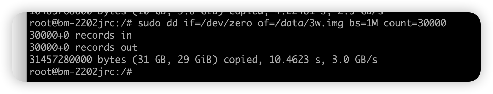

[发散阅读](https://aijishu.com/a/1060000000225602)

# 软raid  mdadm

## 创建

```
mdadm -Cv /dev/md0  -a yes -n 3 -l 5  /dev/sdb /dev/sdc /dev/sdd
mdadm -Cv /dev/md0  -a yes -n 4 -l 10  /dev/nvme5n1 /dev/nvme6n1 /dev/nvme7n1 /dev/nvme8n1
```

-n 为设备数量

-l 为raid 等级

## 格式化

```
mkfs.xfs /dev/md0
```

## 查uuid

```
blkid
```

## 写入自动挂载 /etc/fstab

```sh
UUID=b0fa49de-aa9e-4b4f-902e-64e52455804b /data xfs defaults 0 0
```

查看状态

```sh
mdadm -D /dev/md<number>
cat /proc/mdstat
```

# 性能测试

```sh
sudo dd if=/dev/zero of=/data/test.img bs=1M count=3000
```

nvme U.2 ssd , 4块 做 raid10 



# 手册

添加磁盘

```
mdadm --manage /dev/md0 --add /dev/sdc1
```

1.
RAID1下/dev/sdc1将成为备用盘，在有故障发生时自动进行替换。

删除磁盘

```
mdadm --manage /dev/md0 --remove /dev/sdc1
```

1.
扩充磁盘

```
mdadm --grow /dev/md0 --raid-devices=3
```


# 模拟故障处理

```
mdadm --manage /dev/md0 --fail /dev/sdb
mdadm --manage /dev/md0 --add /dev/sdd
```


# Resync Status 速度慢

sysctl

```sh
dev.raid.speed_limit_min = 1000000
dev.raid.speed_limit_max = 2500000
```

生效

```sh
sysctl -p
```

