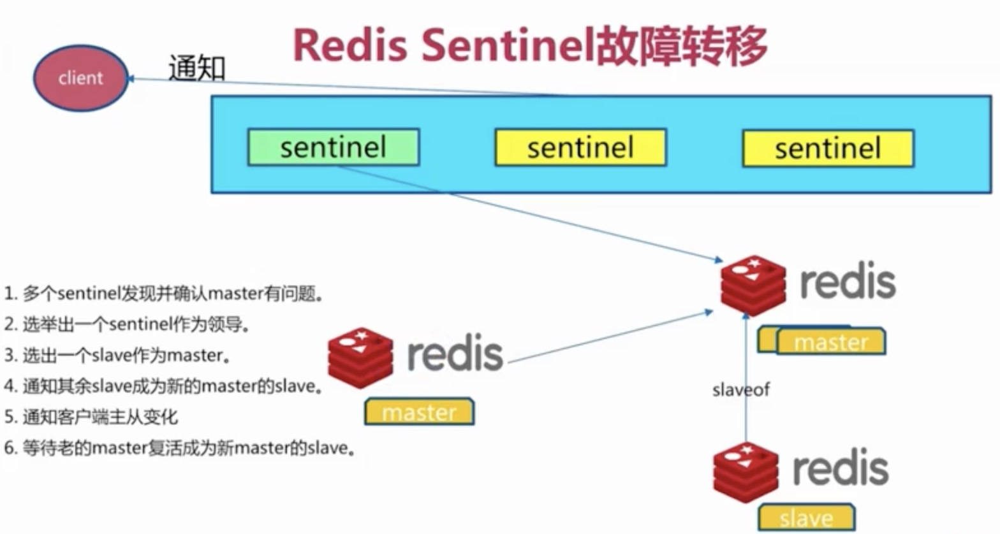

# Docker环境下安装部署Redis [Sentinel](https://juejin.cn/post/6997458845148659743)


本文记录了在Mac上的Docker环境下安装部署Redis Sentinel集群并挂载外部配置和数据的操作步骤。通过前面文章可知，由于主从复制出现了故障，需要手动进行故障转移，同时写能力和存储能力有有限。所以Redis官方提供了Redis Sentinel部署方式提供高可用的解决方案。Redis Sentinel可以理解成一个特殊的Redis进程，它不存储数据，支持的命令也很有限， 只负责持续监控主从节点的健康，当主节点挂掉时，自动选择一个最优的从节点切换为主节点。客户端来连接集群时，会首先连接 sentinel，通过 sentinel 来查询主节点的地址，然后再去连接主节点进行数据交互。当主节点发生故障时，客户端会重新向 sentinel 要地址，sentinel 会将最新的主节点地址告诉客户端，这样应用程序将无需重启即可自动完成节点切换。Redis Sentinel可以同时监控多个Redis部署集群，通过设置maste目录就可以实现同时监控多个集群。

关注文末的公众号，后台私信获取完整的配置文件。

# Redis Sentinel配置

我们搭建的Redis Sentinel集群包括三个sentinel节点，一个master节点和两个slave从节点，sentinel集群负责监控mymaster命名的redis主从复制集群，设置客观下线的投票数为2，来实现Redis Sentinel集群故障转移和切换。



第一种Redis Sentinel Host模式Docker Compose的配置:

```yml 
version: "3.1"

services:
  master:
    image: redis
    container_name: redis-master
    hostname: redis-master
    network_mode: host
    ports:
      - 6379:6379
    command: redis-server /etc/redis/redis.conf
    volumes:
      - "./redis-master/data:/data"
      - "./redis-master/conf/redis.conf:/etc/redis/redis.conf"
    environment:
      TZ: Asia/Shanghai
  slave_1:
    image: redis
    container_name: redis-slave_1
    hostname: redis-slave_1
    network_mode: host
    ports:
      - 6380:6380
    command: redis-server /etc/redis/redis.conf --slaveof 127.0.0.1 6379
    volumes:
      - "./redis-slave_1/data:/data"
      - "./redis-slave_1/conf/redis.conf:/etc/redis/redis.conf"
    environment:
      TZ: Asia/Shanghai
  slave_2:
    image: redis
    container_name: redis-slave_2
    hostname: redis-slave_2
    network_mode: host
    ports:
      - 6381:6381
    command: redis-server /etc/redis/redis.conf --slaveof 127.0.0.1 6379
    volumes:
      - "./redis-slave_2/data:/data"
      - "./redis-slave_2/conf/redis.conf:/etc/redis/redis.conf"
    environment:
      TZ: Asia/Shanghai
  sentinel_1:
    image: redis
    container_name: redis-sentinel_1
    hostname: redis-sentinel_1
    network_mode: host
    ports:
      - 26379:26379
    command: redis-sentinel /etc/redis/sentinel.conf --sentinel
    volumes:
      - "./redis-sentinel_1/conf/sentinel.conf:/etc/redis/sentinel.conf"
      - "./redis-sentinel_1/data:/data"
    environment:
      TZ: Asia/Shanghai
  sentinel_2:
    image: redis
    container_name: redis-sentinel_2
    hostname: redis-sentinel_2
    network_mode: host
    ports:
      - 26380:26380
    command: redis-sentinel /etc/redis/sentinel.conf --sentinel
    volumes:
      - "./redis-sentinel_2/conf/sentinel.conf:/etc/redis/sentinel.conf"
      - "./redis-sentinel_2/data:/data"
    environment:
      TZ: Asia/Shanghai
  sentinel_3:
    image: redis
    container_name: redis-sentinel_3
    hostname: redis-sentinel_3
    network_mode: host
    ports:
      - 26381:26381
    command: redis-sentinel /etc/redis/sentinel.conf --sentinel
    volumes:
      - "./redis-sentinel_3/conf/sentinel.conf:/etc/redis/sentinel.conf"
      - "./redis-sentinel_3/data:/data"
    environment:
      TZ: Asia/Shanghai
```


>  sentinel.conf统一配置

```nginx
# 所有哨兵端口都一致，因为使用 Docker 桥接网络映射 
port 26379

# 哨兵设置，所有哨兵皆一致，都指向 Master
sentinel monitor mymaster 172.25.0.101 6379 2
sentinel parallel-syncs mymaster 1
sentinel down-after-milliseconds mymaster 30000
sentinel failover-timeout mymaster 180000

bind 0.0.0.0
protected-mode no
daemonize no
pidfile /var/run/redis-sentinel.pid
logfile ""
dir /tmp

```


> 查看命令

```sh
docker exec -it redis-master redis-cli -h 127.0.0.1 -p 6379
docker exec -it redis-sentinel_1 redis-cli -h 127.0.0.1 -p 26379
```


## 迁移步骤


> 1. 配置文件和数据文件打包拷贝
> 2. 停止sentinel_3 和 slave_2
> 3. 新机启动sentinel_3和slave_2
> 4. 查看数据同步状态