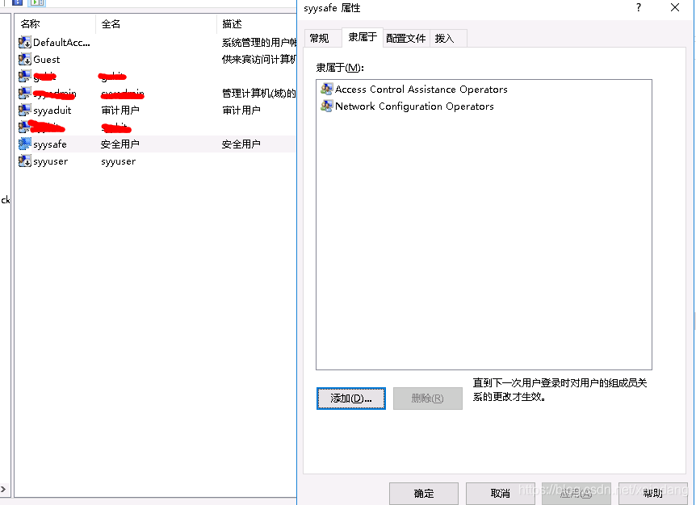
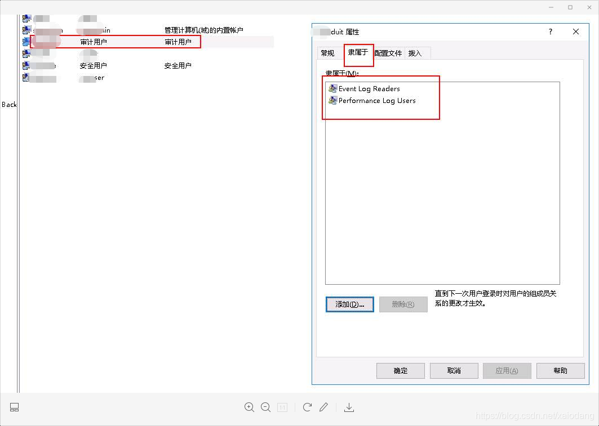

# [三权分立](https://help.aliyun.com/document_detail/313298.html?spm=5176.21213303.J_6704733920.19.682a53c9UdmsKV&scm=20140722.S_help%40%40%E6%96%87%E6%A1%A3%40%40313298.S_0%2Bos0.ID_313298-RL_%E4%B8%89%E6%9D%83%E5%88%86%E7%AB%8B-LOC_helpmain-OR_ser-V_2-P0_2)


# DB三权分立下的权限管理

更新时间：2021-09-29 15:29

[产品详情](https://www.aliyun.com/product/drds)

[相关技术圈](https://developer.aliyun.com/group/polardbX)

[我的收藏](https://help.aliyun.com/my_favorites.html)

本文介绍了三权分立下的三类管理员相关权限。

PolarDB-X在开启三权分立模式后，默认的高权限账号将划分为系统管理员账号、安全管理员账号和审计管理员账号，具体功能介绍与使用方法可参考[三权分立](https://help.aliyun.com/document_detail/213824.htm#concept-2074814)。

下面将以上述三个类型管理员的身份来演示不同类型的SQL操作，其中三类管理员的用户名分别如下所示：

* 系统管理员：admin_dba
* 安全管理员：admin_security
* 审计管理员：admin_audit

## 系统管理员

只有系统管理员具备DDL相关权限：

```sql
mysql> SELECT USER();
+--------------------------+
| USER()                   |
+--------------------------+
| admin_dba@10.159.164.179 |
+--------------------------+

mysql> create database priv_test;
Query OK, 1 row affected (0.09 sec)

mysql> use priv_test;
Database changed

mysql> create table test (id int primary key, value int);
Query OK, 0 rows affected (1.23 sec)
```

但系统管理员不具备DML/DQL/DAL以及权限管理功能：

```sql
mysql> select * from test;
ERROR 5108 (HY000): [130b87654f001000][10.2.57.181:3028][priv_test]ERR-CODE: [TDDL-5108][ERR_CHECK_PRIVILEGE_FAILED_ON_TABLE] User admin_dba@'10.159.164.179' does not have 'SELECT' privilege on table 'TEST'. Database is PRIV_TEST.

mysql> insert into test values (1, 123);
ERROR 5108 (HY000): [130b877647c01000][10.2.57.181:3028][priv_test]ERR-CODE: [TDDL-5108][ERR_CHECK_PRIVILEGE_FAILED_ON_TABLE] User admin_dba@'10.159.164.179' does not have 'INSERT' privilege on table 'TEST'. Database is PRIV_TEST.

mysql> CREATE USER 'user1'@'%' IDENTIFIED BY '123456';
ERROR 5110 (HY000): [130b877e6f001000][10.2.57.181:3028][priv_test]ERR-CODE: [TDDL-5110][ERR_CHECK_PRIVILEGE_FAILED] User admin_dba@'%' does not have 'CREATE ACCOUNT' privilege.
```

## 安全管理员

安全管理员同样不具备DML/DQL/DAL权限，但支持账户或角色的权限管理以及将DML/DQL/DAL权限授予给普通账号：

```sql
mysql> SELECT USER();
+-------------------------------+
| USER()                        |
+-------------------------------+
| admin_security@10.159.164.119 |
+-------------------------------+

mysql> use priv_test;
Database changed

mysql> select * from test;
ERROR 5108 (HY000): [130b8a31af401000][10.57.23.233:3028][priv_test]ERR-CODE: [TDDL-5108][ERR_CHECK_PRIVILEGE_FAILED_ON_TABLE] User admin_security@'10.159.164.119' does not have 'SELECT' privilege on table 'TEST'. Database is PRIV_TEST.

mysql> CREATE USER 'user1'@'%' IDENTIFIED BY '123456';
Query OK, 0 rows affected (0.08 sec)

mysql> GRANT SELECT,INSERT,UPDATE ON priv_test.* TO 'user1'@'%';
Query OK, 0 rows affected (0.06 sec)

-- 使用user1账户登录
mysql> SELECT USER();
+---------------------+
| USER()              |
+---------------------+
| user1@10.159.164.29 |
+---------------------+

mysql> show grants;
+------------------------------------------------------------+
| GRANTS FOR 'USER1'@'%'                                     |
+------------------------------------------------------------+
| GRANT USAGE ON *.* TO 'user1'@'%'                          |
| GRANT SELECT, INSERT, UPDATE ON priv_test.* TO 'user1'@'%' |
+------------------------------------------------------------+

mysql> insert into test values (1, 123);
Query OK, 1 row affected (0.02 sec)

mysql> select * from test;
+------+-------+
| id   | value |
+------+-------+
|    1 |   123 |
+------+-------+
```

安全管理员不具备DDL相关权限：

```sql
mysql> drop table test;
ERROR 5108 (HY000): [130b8a1b9dc01000][10.2.57.181:3028][priv_test]ERR-CODE: [TDDL-5108][ERR_CHECK_PRIVILEGE_FAILED_ON_TABLE] User admin_security@'10.159.164.59' does not have 'DROP' privilege on table 'TEST'. Database is PRIV_TEST.
```

## 审计管理员

审计管理员只具备查看审计日志的权限：

```sql
mysql> SELECT USER();
+----------------------------+
| USER()                     |
+----------------------------+
| admin_audit@10.159.164.209 |
+----------------------------+

mysql> select USER_NAME,HOST,PORT,AUDIT_INFO,ACTION,TRACE_ID from polardbx_audit_log where SCHEMA = 'priv_test';
+----------------+----------------+-------+----------------------------------------------------+-------------+------------------+
| USER_NAME      | HOST           | PORT  | AUDIT_INFO                                         | ACTION      | TRACE_ID         |
+----------------+----------------+-------+----------------------------------------------------+-------------+------------------+
| admin_dba      | 10.159.164.239 | 26245 | create table test (id int primary key, value int)  | CREATE      | 130b83120e003000 |
| admin_security | 10.159.164.239 | 37537 | create table test2 (id int primary key, value int) | CREATE      | 130b839700402000 |
| admin_audit    | 10.159.164.89  | 51128 | create table test2 (id int primary key, value int) | CREATE      | 130b83ea42404000 |
| admin_dba      | 10.159.164.119 | 15923 | CREATE USER 'user1'@'%' IDENTIFIED BY '123456'     | CREATE      | 130b8658c9c03000 |
| admin_dba      | 10.159.164.119 | 15923 | CREATE USER 'user1'@'%' IDENTIFIED BY '123456'     | CREATE      | 130b866b49c03000 |
| admin_dba      | 10.159.164.179 | 24559 | CREATE USER 'user1'@'%' IDENTIFIED BY '123456'     | CREATE      | 130b877e6f001000 |
| admin_security | 10.159.164.119 | 44965 | create table test2 (id int primary key, value int) | CREATE      | 130b87c6f6002000 |
| admin_security | 10.159.164.119 | 44965 | CREATE USER 'user1'@'%' IDENTIFIED BY '123456'     | CREATE_USER | 130b87ee65402000 |
| admin_security | 10.159.164.119 | 44965 | CREATE USER 'user1'@'%' IDENTIFIED BY '123456'     | CREATE      | 130b87ee65402000 |
| admin_security | 10.159.164.119 | 44965 | GRANT SELECT,UPDATE ON priv_test.* TO 'user1'@'%'  | GRANT       | 130b88a7b0402000 |
| admin_security | 10.159.164.59  | 21156 | drop table test                                    | DROP        | 130b8a1b9dc01000 |
+----------------+----------------+-------+----------------------------------------------------+-------------+------------------+
```


# 等保windows server

安全策略三权分立设置三权的理解：配置，授权，审计

> 三员的理解：系统管理员，安全保密管理员，安全审计员
>
> 三员之三权：废除超级管理员；三员是三角色并非三人；安全保密管理员与审计员必须非同一个人。

控制面板》 计算机管理〉本地用户和组
安全用户配置


审计用户配置