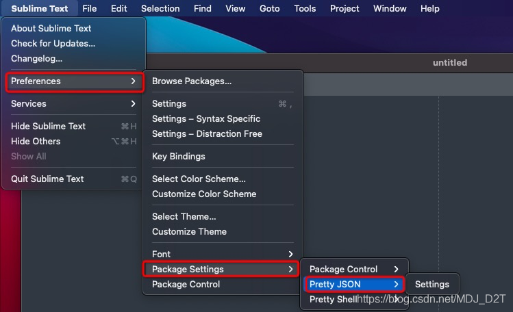
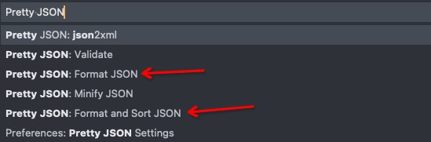
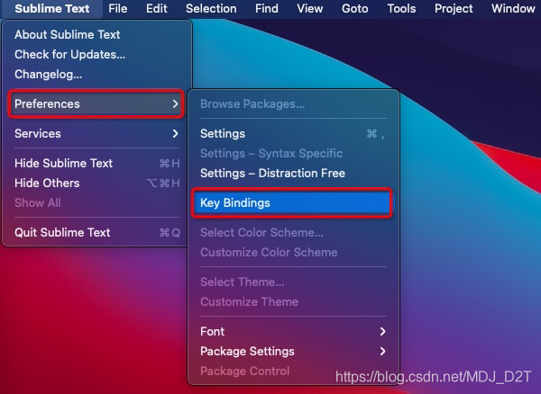
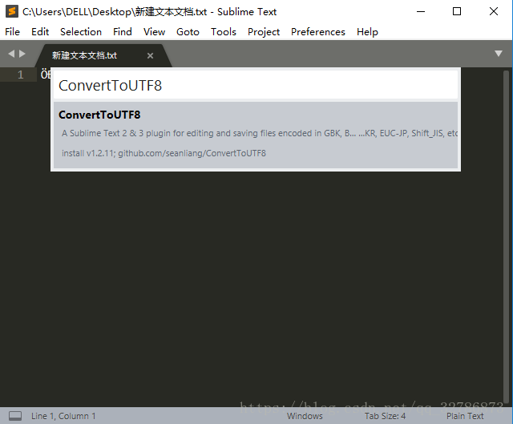
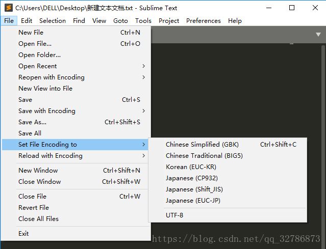

# Mac下sublime安装pretty json使用及快捷键无效时，快捷键方式

一、安装

（一）安装
1、Ctrl+Shift+P 弹框中输入Package Control 选中 Install Package；
2、弹框中输入 Pretty Json 选中，开始安装，可以在左下角看安装情况；

（二）是否安装成功
1、Ctrl+Shift+P 弹框中输入Package Control 选中 List Packages；
2、弹框中输入 Pretty Json 若存在即证明安装成功；

也可以如下图查看，有了就是安装成功了。




二、使用

1、选中json串，Ctrl+Shift+P 弹框中输入 Pretty Json，选中 Pretty JSON:Format JSON 或 Pretty JSON:Format and Sort JSON 可以格式化JSON串；
2、选中json 串后，直接快捷键；




三、快捷键问题
我安完就没有快捷键（如上图）（可以通过 Ctrl+Shift+P 弹框中输入 Pretty Json 查看命令右侧是否存在快捷键）。

有快捷键的长下图这样


配置方式：Preference -> Key Bindings



打开后，在右侧输入配置即可，如果没生效就重启下。


右侧配置信息

[
	{ "keys": ["ctrl+command+j"], "command": "pretty_json" },
]
————————————————
版权声明：本文为CSDN博主「嘉月君」的原创文章，遵循CC 4.0 BY-SA版权协议，转载请附上原文出处链接及本声明。
原文链接：https://blog.csdn.net/MDJ_D2T/article/details/119183504


# 中文乱码

```
Ctrl+Shift+P调出命令面板，在输入框输入Install Package
```






或者弹出窗口 选择GBK