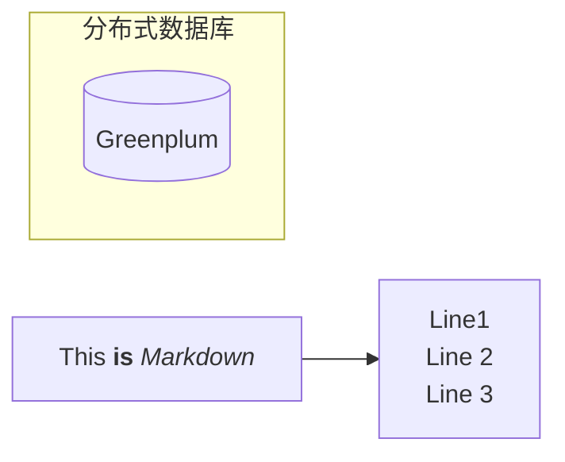
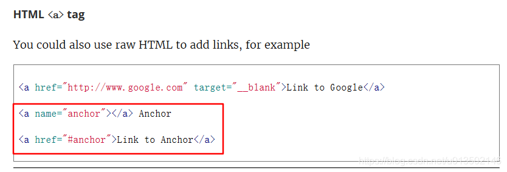
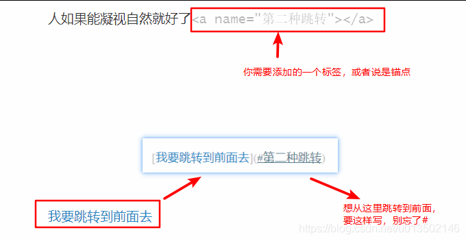

# Typora页内跳转，真正能用的方法

用Typora写文章时，当一篇文章里的内容很多，我们需要从后面跳到前面去参考之前提到的东西时，我们需要用到页内跳转，所谓页内跳转就是从一篇文章的一个地方跳到该篇文章的另一个地方。

页内跳转有两种情况：

跳转到标题所在位置
跳转到非标题所在位置，即页面内任何位置
第一种跳转方法，即跳转到标题所在位置，用Markdown的标准跳转方法即可，而Typora跟它是完全兼容的，即：

[任意文字] (#标题名称)
1
举个例子：

这是一个三级标题，我们要跳转到这里
现在，我们用上面提到的方法来实现跳转，代码是

[第一种跳转] (#这是一个三级标题，我们要跳转到这里)
1
第一种跳转

但是，当我想用第二种跳转方法，即跳转到非标题所在位置，即页面内任何位置时，我搜遍了中文互联网，也没搜到如何在Typora里实现，后来搞清楚了，Typora比较特殊，大量文章里提到的用HTML里的span标签来实现是不行的。

后来在Typora里的官方文档里找到了答案：得用a标签！：

上面图片中圈红的即为实现方法，我更喜欢用name那种，因为简单。

知道这个方法后，直接在我想跳转的地方后面添上一段代码即可，比如

其实说的更抽象一点，想要实现跳转，就要告诉代码你要跳转到的具体位置，即给一个锚点，就像船到港后需要抛锚来固定一样。这个具体位置可以是一个URL；具体位置可以是标题，因为标题前面是有若干个“#”的，可以准确定位它；具体位置也可以是一个用HTML标签a定义的锚点。
————————————————
版权声明：本文为CSDN博主「NaraEllen」的原创文章，遵循CC 4.0 BY-SA版权协议，转载请附上原文出处链接及本声明。
原文链接：https://blog.csdn.net/u013502146/article/details/103171825