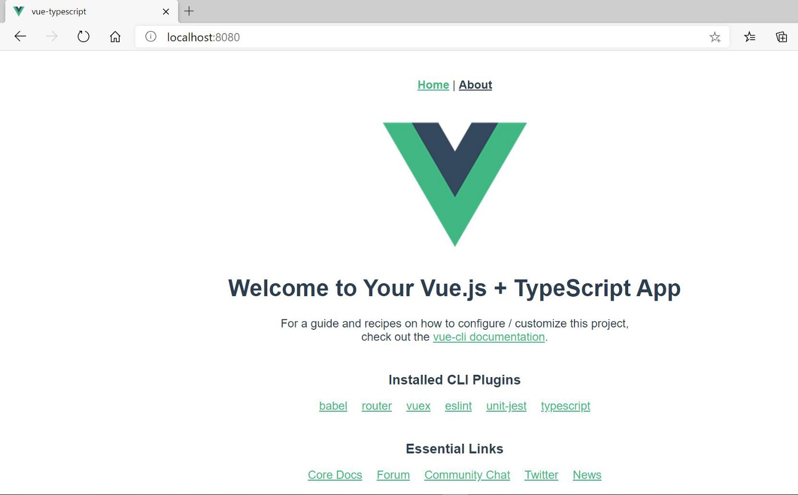

# class style  和 compostion api

|                      |                                  |      |
| -------------------- | -------------------------------- | ---- |
| vue-facing-decorator | <script lang="ts"> 去掉其中setup |      |
|                      |                                  |      |
|                      |                                  |      |

# vue-facing-decorator

tsconfig.json启用装饰器

```json
{
    "compilerOptions": {
       "experimentalDecorators": true
    }
}

```

  <script lang="ts"> 去掉其中setup 语法糖   

添加@Component装饰器(响应式)

-

组件属性需要在类属性的基础上使用@Prop

-


# copy json value path

https://github.com/MaloPolese/copy-json-path.git


# vue3 ts create project

## Vue CLI 3 + TypeScript: A Complete Setup Guide

## **Installation**

Vue CLI 3 comes as an NPM package. The first thing you need to make sure is that Node.js and NPM are available on your system. Vue CLI 3 requires at least Node.js version 8.9 (or above) on your system. If you have already installed Node.js you can check the version with the following command:

```
$ node —version
```

If you need to install or update Node.js first you can go to https://nodejs.org/ and download the installer for your OS. By installing Node.js the Node.js Package Manager (NPM) is installed automatically.

Vue CLI 3 is a complete re-write. In comparison to the previous version of Vue CLI the package name has changed from `vue-cli` to `@vue/cli`.

It is recommended to first uninstall the old package from your system:

```
$ npm uninstall vue-cli -g
```

The installation of Vue CLI 3 is then done via:

```
$ npm install -g @vue/cli
```

After having completed the installation successfully you’re able to check for the installed version with:

```
$ vue --version
>> @vue/cli 4.5.5
```

## **Creating a Project using Command Line**

```
# Create a new project
$ vue create <project_name>
```

When prompted, choose ‘Manually select features’.


Selecting Manual, you’ll have the following features to select


Here you can use the up and down arrow key on your keyboard to navigate through the list of features. Use the spacebar to select a feature from the list. After selection hit “Enter”.


Here you can select the version for VueJS. Similarly, you can select for all presets.


Here we’re going to select the *ESLint + Prettier* option.

* *ESLint* is a tool for identifying and reporting on patterns found in ECMAScript/JavaScript code, with the goal of making code more consistent and avoiding bugs.
* *Prettier* is an opinionated code formatter. It enforces a consistent style by parsing your code and re-printing it with its own rules that take the maximum line length into account, wrapping code when necessary.


Here you get to decide which unit testing tool to use.


Here you can choose to have dedicated config files or to place the configuration just inside of package.json. We’re going to decide on dedicated config files.


Having selected the package manager the new project is created and the corresponding dependencies are downloaded and installed.


Finally, you’ll see a success message on the command line confirming that the project has been created.

Now that the Vue.js project is created and configured we’re able to change into the newly created project folder and start the development web server by typing in:

```
$ cd <project_name>
$ npm run serve
```

The application is then available via [http://localhost:8080:](http://localhost:8080/)



## Project structure

Your folder structure will look similar to a typical Vue CLI project. **Some files** are specific to TypeScript projects:

```sh
Project:
|   babel.config.js
|   package-lock.json
|   package.json
|   README.md
|   tsconfig.json
|   .browserslistrc
|   .gitignore
|   .eslintrc.js
|   
+---node_modules 
|
+---public
|   |   favicon.ico
|   |   index.html
|   |                 
+---src
    |   App.vue
    |   main.ts
    |   shims-vue.d.ts
    |   
    +---assets
    |       logo.png
    |
    +---components
    |       HelloWorld.vue
    |
    +---router
    |       index.ts
    |
    +---store
            index.ts
    +---views
            About.vue
            Home.vue
```

[**tsconfig.json**](https://www.typescriptlang.org/docs/handbook/tsconfig-json.html)
Denotes a TypeScript project. Contains compiler options and specifies the location of root files.

[**tslint.json**](https://palantir.github.io/tslint/usage/configuration/)
Options and rules for Typescript linting, for TSlint.

**main.ts
**The equivalent of main.js; the entry file for the project.

**shims-vue.d.ts
**Allows .vue single file components to be imported and used.

## Writing components

We can now write TypeScript in .vue single file components, within the script tags.

```
<script lang="ts"></script>
```

Components are written using either [Vue.extend()](https://vuejs.org/v2/guide/typescript.html#Basic-Usage) or the [@Component decorator](https://vuejs.org/v2/guide/typescript.html#Class-Style-Vue-Components). Choose the way that is best suited to your needs.

## Basic usage, with Vue.extend()

Similar to declaring a normal Vue component. Vue.extend() is used so that the code inside can be subject to type inference.

```
HelloWorld.vue
<template>
  <div>
    <h1>{{ msg }}</h1>
  </div>
</template>

<script lang="ts">
import Vue from 'vue';

export default Vue.extend({
  name: 'HelloWorld',
  props: {
    msg: String,
  },
});
</script>

<style scoped lang="scss">
</style>
```

## Class-style, with @Component decorator

Decorators, such as [@Prop, @Watch, @Emit](https://github.com/kaorun343/vue-property-decorator), are used to define the component.
This is achieved using a combination of two libraries, [vue-class-component](https://github.com/vuejs/vue-class-component) and [vue-property-decorator](https://github.com/kaorun343/vue-property-decorator).

```
HelloWorld.vue
<template>
  <div>
    <h1>{{ msg }}</h1>
  </div>
</template>

<script lang="ts">
import { Component, Prop, Vue } from 'vue-property-decorator';

@Component
export default class HelloWorld extends Vue {
  @Prop() private msg!: string;
}
</script>

<style scoped lang="scss">
</style>
```

## IDE support for TypeScript

TypeScript support and features are available with these IDEs:

* [Vetur extension](https://github.com/vuejs/vetur) for [Visual Studio Code](https://code.visualstudio.com/)
* [WebStorm](https://www.jetbrains.com/webstorm/)

## router

https://www.cnblogs.com/yuyujuan/p/9839705.html


新建src/router.config.js

```js
import Hello from '@/components/HelloWorld'
import Home from '@/components/Home'
export default {
  routes: [
    {path: '/home', component:Home},
    {path: '/', component:Hello},
    // {path: '*', redirect:'/home'}
  ]
}
```


main.js中引入

```js
import Vue from 'vue'
import App from './App.vue'
import ElementUI from 'element-ui'
import 'element-ui/lib/theme-chalk/index.css'
import axios from 'axios'
import VueRouter from 'vue-router'
import routerConfig from './router.config'

Vue.config.productionTip = false
Vue.use(ElementUI)
Vue.use(VueRouter)
const router = new VueRouter(routerConfig)
Vue.prototype.$axios = axios
// axios.defaults.baseURL = "http://localhost:18080"

new Vue({
  router,
  render: h => h(App),
}).$mount('#app')

```


App.vue

```js
<template>
  <div id="app">
  <el-container>
    <el-header>
      <router-link to ="/home">TEST</router-link>
      <router-link to ="/">project</router-link>
      Header</el-header>
    <el-container>
      <el-aside width="200px">Aside
        
      </el-aside>
      <el-container>
        <el-main>Main
          <div><router-view></router-view></div>
<!--        <HelloWorld msg="Welcome to Your Vue.js App" title="baby "/>-->
        </el-main>
        <el-footer>Footer
        </el-footer>
      </el-container>
    </el-container>
  </el-container>
  </div>
</template>

<script>
// import HelloWorld from './components/HelloWorld.vue'
export default {
  name: 'App',
  // components: {
  //   HelloWorld
  // }
}
</script>

<style>
#app {
  font-family: Avenir, Helvetica, Arial, sans-serif;
  -webkit-font-smoothing: antialiased;
  -moz-osx-font-smoothing: grayscale;
  text-align: center;
  color: #2c3e50;
  margin-top: 60px;
}
</style>

```

参照


# vue打包后分离config配置文件

用vue-cli构建的项目通常是采用前后端分离的开发模式，也就是前端与后台完全分离，此时就需要将后台接口地址打包进项目中，此时如果只是改个接口地址也要重新打包那就太麻烦了，解决方法是直接加个config.js文件

1.首先我们在static文件下建立一个js文件，就叫config.js吧，内容为

```js
window.g = {
  AXIOS_TIMEOUT: 10000,
  ApiUrl: 'http://localhost:21021/api/services/app', // 配置服务器地址,
  ParentPage: {
    CrossDomainProxyUrl: '/Home/CrossDomainProxy',
    BtnsApi: '/api/services/app/Authorization/GetBtns',
    OrgsApi: '/api/services/app/authorization/GetOrgsByUserId'
  },
}
 

```

2.接下来我们只需要在index.html这个入口文件里引入该文件（注意路径就ok）

```js
<script type="text/javascript" src="/static/config.js"></script>
3.然后你就可以在你需要的地方随意获取就行了，比如

var baseURLStr = window.g.ApiUrl
// 创建axios实例
const service = axios.create({
  baseURL: baseURLStr, // api的base_url
  timeout: 5000 // 请求超时时间
})

```

4.最后在打包成功之后，config,js文件不会被打包，依然存在static文件夹下，如果需要修改只需要用记事本打开文件修改地址就OK了，而且该方法也不会影响开发模式。

# 打包关闭filenameHashing


>  vue.config.js
>
> ```js
> module.exports = {
>   filenameHashing: false,
> }
> 
> ```
>
> 


## WebSocket

# dashboard VUE改造

 项目信息管理

* [x] ### hosts

* [x] ### topology

* [x] ### hardware resource info

* [x] ### project info:  project id,key/pg con info/redis passwword/api info/auth info

* [x] ### 项目版本管理、切换  时间线记录

## 服务管理

* [ ] ### 配置查看

* [ ] ### 配置批量修改

* [ ] ### 服务重启

## 部署管理


# 资讯

| word            | main                                                         | applications                                                 |
| --------------- | ------------------------------------------------------------ | ------------------------------------------------------------ |
| bootstrap       | html,css,js框架                                              | 以前很火，现在的话比较简单重复的企业可能会用到它，它和JQuery一样已经不再是主流。 |
| 前端框架        | html,css,js的库和框架                                        | 提高前端生产效率                                             |
| vue             |                                                              | 你会我也会，工资不高,学习vue较react简单，算法看一看就好，主要是设计模式 |
| react           |                                                              | 你会我也会，工资不高                                         |
| 设计模式        | 指导软件设计开发过程中反复出现的某类问题的思想和解决方案，设计模式是方法论不是现成的代码 | 结构型模式（Structural Patterns）；创建型模式（Creational Patterns）；行为型模式（Behavioral Patterns）； |
| 结构型模式      |                                                              |                                                              |
| 创建型模式      |                                                              |                                                              |
| 行为型模式      |                                                              |                                                              |
| 外观模式/结构型 | 把多个子系统抽象成一个简洁易用的API                          | JQuery把复杂的原生DOM操作抽象和封装并消除了浏览器之间的兼容性问题 |
| 代理模式/结构型 | 降低访问时间或专业成本; 增加额外逻辑                         | 中间商，中介，律师，代理，proxy,缓存                         |
| 工厂模式/创建型 | 集中\统一方法和类,根据传入参数生成不同的对象                 | 构造函数过多,创建对象之间存在某些关联,使用工厂设计模式实现统一集中化管理,避免代码重复\灵活性差 |
| 单例模式/创建型 | 单个实例贯穿整个系统,保持唯一性,优点是: 减少资源占用; 防止重复; | 防止脑裂, 分布式锁保障                                       |
|                 |                                                              |                                                              |
|                 |                                                              |                                                              |


# vue[对比](https://www.bilibili.com/video/BV1kE411v7rw/?spm_id_from=333.788.recommend_more_video.0)

|          | angular                                  | react                           | vue              |
| -------- | ---------------------------------------- | ------------------------------- | ---------------- |
| 编程范式 | 需要考虑作用域                           | 写组件, 拼合成应用              | 对初学者友好     |
| 历史     | angularJS                                | \>16版本,顺滑升级, 提倡function | Vue3.0           |
| 背景     | google支持                               | Facebook                        | 龙雨溪,阿里      |
| 模板     | 基于模板                                 | jsx,没有解析,较快               | 基于模板解析     |
| 组件     | 指令                                     | class方式, 现在兼容function     | 属性控制效果     |
| 开发生态 | 全家桶                                   | 只提供基本框架,需要在生态中寻找 | 也有生态         |
| 手机端   | flutter, 稍差, 学习成本较高,但是表现顺滑 | React Native, 有生态弥补坑      | Weex, 移动端稍差 |
|          |                                          |                                 |                  |


# Vue 3.0 + typescript + element-plus


```bash
npm uninstall  element-ui -S
yarn remove element-ui
```

then install the latest one :

```bash
npm i element-plus -S
#
yarn add element-plus
```

the `main.js` minimum content :

```javascript
import { createApp } from "vue";
import router from "./router";
import store from "./store";

import ElementPlus from "element-plus";
import "element-plus/lib/theme-chalk/index.css";

import App from "./App.vue";

createApp(App)
.use(ElementPlus)
.use(store)
.use(router)
.mount("#app");
```

在 main.js 中写入以下内容：

```javascript
import { createApp } from 'vue'
import ElementPlus from 'h';
import 'element-plus/lib/theme-chalk/index.css';
import App from './App.vue';

const app = createApp(App)
app.use(ElementPlus)
app.mount('#app')
```

以上代码便完成了 Element Plus 的引入。需要注意的是，样式文件需要单独引入。

## axios


# websoket

公共状态管理


#    vue3 动画特效教程 [技术胖](https://jspang.com/detailed?id=71#toc21)

技术胖 https://jspang.com/detailed?id=68  

[技术胖vue3+ts](https://jspang.com/detailed?id=64) 23集

[技术胖typescript](https://jspang.com/detailed?id=63)

[offically docs typescript](https://typescript.bootcss.com/)

官方 https://www.vue3js.cn/docs/zh/guide/introduction.html#%E5%A3%B0%E6%98%8E%E5%BC%8F%E6%B8%B2%E6%9F%93   45小节 (或者本地起docs源码,看英文版)

https://v3.cn.vuejs.org/guide/introduction.html#vue-js-%E6%98%AF%E4%BB%80%E4%B9%88

google https://www.google.com/search?q=vue3+%E8%AF%AD%E6%B3%95&oq=vue3+%E8%AF%AD%E6%B3%95&aqs=chrome..69i57j0i30j0i8i30l2.2227j0j7&sourceid=chrome&ie=UTF-8


https://github.com/KieSun/all-of-frontend

[# 近 20 人爆肝数周，写给初中级前端的万字高级进阶指南](https://juejin.cn/post/7017645909483716615)


目标:   =>  VUE3+ts 

1. 能够搭建 devops运维平台
2. 实现webssh, axios动态加载


# 学习书签

| Word                                                         | Content                                                      | Application         |
| ------------------------------------------------------------ | ------------------------------------------------------------ | ------------------- |
| Dom                                                          | [short_hands](.detail_vue_ts/short_hands)                    |                     |
| Musta                                                        |                                                              |                     |
| 应用 & 组件实例https://www.vue3js.cn/docs/zh/guide/instance.html | https://codepen.io/team/Vue/pen/KKpRVpx                      | 2021-07-15 09:48:43 |
|                  |  |                     |
| [模板语法](https://www.vue3js.cn/docs/zh/guide/template-syntax.html#%E6%8F%92%E5%80%BC) |                                                              |                     |
| [data property](https://www.vue3js.cn/docs/zh/guide/data-methods.html#data-property) |                                                              |                     |
| [方法](https://www.vue3js.cn/docs/zh/guide/data-methods.html#%E6%96%B9%E6%B3%95) |                                                              |                     |
| [生命周期勾子](https://v3.cn.vuejs.org/guide/composition-api-lifecycle-hooks.html) => [方法](https://www.vue3js.cn/docs/zh/guide/data-methods.html#%E6%96%B9%E6%B3%95) |                                                              |                     |
| [防抖和节流](https://www.vue3js.cn/docs/zh/guide/data-methods.html#%E9%98%B2%E6%8A%96%E5%92%8C%E8%8A%82%E6%B5%81) |                                                              |                     |
| [计算属性和侦听器](https://v3.cn.vuejs.org/guide/computed.html) | [笔记](.detail_vue_ts/计算属性与侦听器.md)                   |                     |
| [绑定HTML Class](https://www.vue3js.cn/docs/zh/guide/class-and-style.html#%E7%BB%91%E5%AE%9A-html-class) |                                                              |                     |
| [条件渲染](https://v3.cn.vuejs.org/guide/conditional.html#v-show) | [笔记](.img_vue_ts/conditional)                              |                     |
| [列表渲染](https://www.vue3js.cn/docs/zh/guide/list.html#%E7%94%A8-v-for-%E6%8A%8A%E4%B8%80%E4%B8%AA%E6%95%B0%E7%BB%84%E5%AF%B9%E5%BA%94%E4%B8%BA%E4%B8%80%E7%BB%84%E5%85%83%E7%B4%A0) | [笔记](.detail_vue_ts/列表渲染.md)                           |                     |
| [Event_Handle](http://localhost:8080/guide/events.html#listening-to-events) | [笔记](.detail_vue_ts/event_handing)                         |                     |
| [form_Input_binding](http://localhost:8080/guide/forms.html#basic-usage) |                                                              |                     |
| [Components](http://localhost:8080/guide/component-basics.html#base-example) | [笔记](.detail_vue_ts/components)                            |                     |
| [typescript](https://www.typescriptlang.org/docs/handbook/2/generics.html) |                                                              |                     |
| [变量声明](https://typescript.bootcss.com/variable-declarations.html) | [变量](.detail_vue_ts/变量)                                  |                     |
| [生命周期勾子](https://v3.cn.vuejs.org/guide/composition-api-lifecycle-hooks.html) |                                                              |                     |
| [refs](https://v3.cn.vuejs.org/guide/reactivity-fundamentals.html#%E5%A3%B0%E6%98%8E%E5%93%8D%E5%BA%94%E5%BC%8F%E7%8A%B6%E6%80%81) |                                                              |                     |
| [深入理解typescript](https://jkchao.github.io/typescript-book-chinese/) |                                                              |                     |
| export,import                                                | [笔记](.detail_vue_ts/export)                                |                     |
| [namespace](https://jkchao.github.io/typescript-book-chinese/project/namespaces.html) | [note](.detail_vue_ts/namespace)                             |                     |
| 泛型 <T>                                                     | `function reverse<T>(items: T[]): T[]{}`                     |                     |
| 联合类型 \|                                                  | `(command: string[] | string)`                               |                     |
|                                                              |                                                              |                     |


# Vue3 + TS [最佳实践](https://juejin.cn/post/7001897686567747598)


# el-icon

Element Plus 团队表示正在将原有组件内的 Font Icon 向 SVG Icon 迁移，正式版本Font Icon将被弃用，于是目标是对代码进行对应的更新，Font Icon换成SVG Icon。


> 文档： Icon 图标 | Element Plus (element-plus.org)  (2021.10.12更新替换连接地址，element-plus文档网址变动了)
>
> 注意：当前图标只适用于vue3。
>
> 首先更新 element-plus版本，指定安装@1.0.2-beta.69（2021.8.5时的最新版本）。安装图标包，npm install @element-plus/icons。


`npm install element-plus@1.0.2-beta.69`

`npm install @element-plus/icons`

 文档中表示，使用el-icon需要全局注册组件或者在要用到的组件中单独注册。看了一下源码，发现无统一导出，只能一个个注册。[ 已更新 el-icon 统一导入及注册方式，见最下方2021.10.12更新 ]


组件中注册：

```typescript
//组件script
import { Fold } from '@element-plus/icons'
import { Edit } from '@element-plus/icons'
export default {
    components: {
      Fold,
      Edit
    }
}
```


全局注册

```typescript
//main.js
import { Expand } from '@element-plus/icons'

const app=createApp(App)
app.component('expand', Expand)
app.mount('#app')
```


**经过实测:**

```vue
<template>
          <el-icon class="el-icon--upload" :size="150">
            <upload-filled/>
          </el-icon>
</template>
<script lang="ts">
import {Options, Vue} from 'vue-class-component';
import {UploadFilled} from '@element-plus/icons'
@Options({
    components: {
        UploadFilled,
        ReleasePublish
    }
})
```

**2021.10.12更新：el-icon 统一导入及注册方式**

用 import * as 统一模块对象 from '路径' 方式导入，并使用 for in 循环注册。代码如下：

```typescript
//main.js
// 统一导入 el-icon 图标
import * as ElIconModules from '@element-plus/icons'
// 导入转换图标名称的函数
import { transElIconName } from './utils/utils.js'
...
// 统一注册el-icon图标
for(let iconName in ElIconModules){
  app.component(transElIconName(iconName), ElIconModules[iconName])
}
// utils/utils.js
// 将el-icon的组件名称AbbbCddd转化为i-abbb-cddd形式
// 此前用switch做给组件名时因关键字重复报错, 所以格式统一加了前缀 
// 例: Switch转换为i-switch, ArrowDownBold转换为i-arrow-down-bold

export function transElIconName(iconName){
  return 'i'+iconName.replace(/[A-Z]/g), (match)=>'-'+match.toLowerCase())
}
```

注：此时使用的 @element-plus/icons 版本为0.0.11（2021.10.12时的最新版本）。


# vue3-1项目复盘

|                                |                                           |              |
| ------------------------------ | ----------------------------------------- | ------------ |
| ts interface                   | 定义数据结构                              |              |
| vue component                  | 组件拆分,模块化, 变量域独立               |              |
| 组件内部响应式渲染             |                                           |              |
| icons引用,vue 需要多个地方声明 | vue 需要多个地方声明                      | 好看的logo   |
| vue修改title                   | [笔记](.detail_vue_ts/title_vue)          | 指           |
| 串行                           | [笔记](.detail_vue_ts/async_await)        | 顺序执行任务 |
| style div class                | [style_class](.detail_vue_ts/style_class) |              |
| webssh                         | 缺                                        |              |
| websocket                      | 缺                                        |              |
|                                |                                           |              |

# aws-boto3


## Boto3 访问 S3 的基本用法

https://www.zhihu.com/people/kongyifei

[Angry Bugs](https://www.zhihu.com/people/kongyifei)

5 人赞同了该文章

以前我以为文档坑爹只有一种方式，那就是没有文档。最近在用 boto3, 才让我认识到了文档的另一种坑爹方式：太多。具体来说是这样的：Boto3 中有两种 API, 低级和高级。其中低级 API 是和 AWS 的 HTTP 接口一一对应的，通过 boto3.client("xxx") 暴露。高级接口是面向对象的，更加易于使用，通过 boto3.resource("xxx") 暴露，美中不足是不一定覆盖了所有的 API.

坑爹的 AWS 文档中，经常混用 resource 和 client 两套接口，也没有任何提示，文档的首页除了简单的提了一句有两套 API 外再没有单独的介绍了。在没写这篇文章之前，我的脑子里都是乱的，总觉得 S3(Simple Storage Service) 的这个狗屁接口哪里配得上 Simple 这个词，一会儿是 list_object, 一会儿是 list_object_v2 的。高级 API 是很简单易用的，然而这样一个简单的 API 被深深地埋在了一大堆的低级 API 中，网上的文章也是一会儿 boto3.client, 一会儿 boto3.resource. 除了有人特意提问两者的区别，很难看到有人说这俩到底是啥。

吐槽完毕。

最近总是用到 S3, 在这里记录一下 Boto3 的简单用法了。Boto3 是整个 AWS 的 SDK, 而不只是包括 S3. 还可以用来访问 SQS, EC2 等等。

如果没有特殊需求的话，建议使用高级 API. 本文一下就记录一些 boto3.resource("s3") 的例子。

```python
import boto3

s3 = boto3.resource("s3")

# 创建一个 bucket
bucket = s3.create_bucket(Bucket="my-bucket")

# 获得所有的 bucket, boto 会自动处理 API 的翻页等信息。
for bucket in s3.buckets.all():
    print(bucket.name)

# 过滤 bucket, 同样返回一个 bucket_iterator
s3.buckets.fitler()

# 生成一个 Bucket 资源对象
bucket = s3.Bucket("my-bucket")
bucket.name  # bucket 的名字
bucket.delete()  # 删除 bucket

# 删除一些对象
bucket.delete_objects(
    Delete={
        'Objects': [
            {
                'Key': 'string',
                'VersionId': 'string'
            },
        ],
        'Quiet': True|False
    },
)
# 返回结果
{
    'Deleted': [
        {
            'Key': 'string',
            'VersionId': 'string',
            'DeleteMarker': True|False,
            'DeleteMarkerVersionId': 'string'
        },
    ],
    'RequestCharged': 'requester',
    'Errors': [
        {
            'Key': 'string',
            'VersionId': 'string',
            'Code': 'string',
            'Message': 'string'
        },
    ]
}

# 下载文件
bucket.download_file(Key, Filename, ExtraArgs=None, Callback=None, Config=None)

# 下载到文件对象，可能会自动开启多线程下载
with open('filename', 'wb') as data:
    bucket.download_fileobj('mykey', data)

# 上传文件
object = bucket.put_object(Body=b"data"|file, ContentMD5="", Key="xxx")

# 这个方法会自动开启多线程上传
with open('filename', 'rb') as f:
    bucket.upload_fileobj(f, 'mykey')

# 列出所有对象
bucket.objects.all()

# 过滤并返回对象
objects = bucket.objects.filter(
    Delimiter='string',
    EncodingType='url',
    Marker='string',
    MaxKeys=123,
    Prefix='string',
    RequestPayer='requester',
    ExpectedBucketOwner='string'
)

# 创建一个对象
obj = bucket.Object("xxx")
# 或者
obj = s3.Object("my-bucket", "key")

obj.bucket_name
obj.key

# 删除对象
obj.delete()
# 下载对象
obj.download_file(path)
# 自动多线程下载
with open('filename', 'wb') as data:
    obj.download_fileobj(data)
# 获取文件内容
rsp = obj.get()
body = rsp["Body"].read()  # 文件内容
obj.put(Body=b"xxx"|file, ContentMD5="")

# 上传文件
obj.upload_file(filename)
# 自动多线程上传
obj.upload_fileobj(fileobj)
```

如果想进一步了解，建议直接点开参考文献 2, 阅读下 resouce 相关接口的文档，其他的 client 接口完全可以不看。

# xterm.js

https://segmentfault.com/a/1190000018712469

https://github.com/yudai/gotty

https://juejin.cn/post/6986543907689463822

https://xtermjs.org/docs/api/terminal/classes/terminal/#loadaddon

https://www.jianshu.com/p/db8a860b286c

https://bengbu-yuezhang.github.io/2019/03/10/xterm/

## 参考

1. [https://stackoverflow.com/questions/42809096/difference-in-boto3-between-resource-client-and-session](https://link.zhihu.com/?target=https%3A//stackoverflow.com/questions/42809096/difference-in-boto3-between-resource-client-and-session)
2. [https://boto3.amazonaws.com/v1/documentation/api/latest/reference/services/s3.html#service-resource](https://link.zhihu.com/?target=https%3A//boto3.amazonaws.com/v1/documentation/api/latest/reference/services/s3.html%23service-resource)

#  书签尾部


# build 速度问题 换node源  taobao

```sh
npm config set cache 目录地址
安装的依赖默认是从npm官网仓库下载，官网下载一般比较慢，我们可以手动配置npm的下载源
npm config set registry https://registry.npmmirror.com
国内源有被挂马记录, 建议做离线源,从官方同步
```


